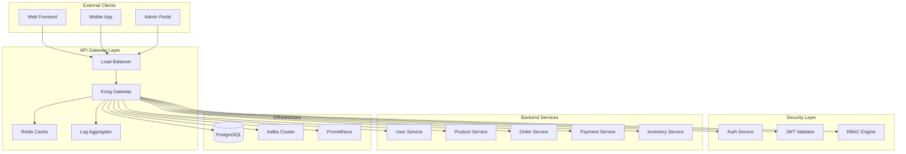
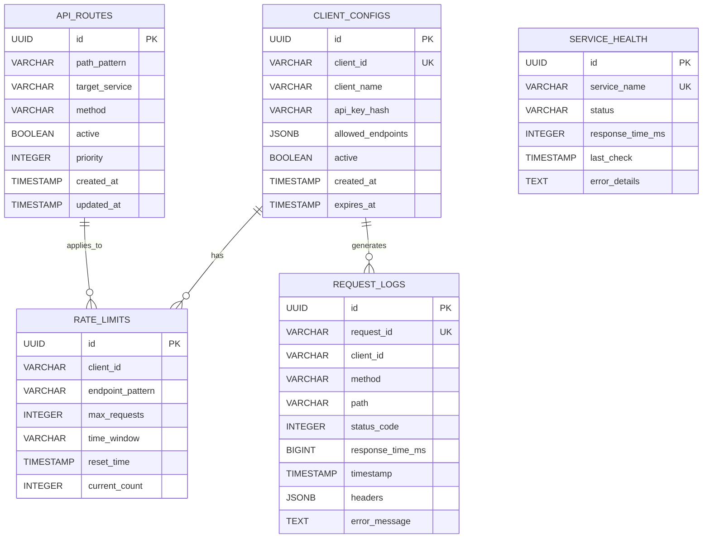

# API Gateway Service Detailed Design Document

## Table of Contents

1. [Overview](#overview)
2. [Technical Specifications](#technical-specifications)
3. [Architecture Design](#architecture-design)
4. [API Design](#api-design)
5. [Database Design](#database-design)
6. [Error Handling](#error-handling)
7. [Security Design](#security-design)
8. [Test Design](#test-design)
9. [Local Development Environment](#local-development-environment)
10. [Production Deployment](#production-deployment)
11. [Monitoring and Operations](#monitoring-and-operations)
12. [Incident Response](#incident-response)

## Overview

### Service Summary

The API Gateway Service acts as a unified entry point for the ski equipment sales shop site, handling routing, authentication/authorization, rate limiting, and request/response transformation for all external requests.

### Key Responsibilities

- **Request Routing**: Appropriate routing to each microservice
- **Authentication/Authorization**: Unified authentication using OAuth 2.0/OpenID Connect
- **Rate Limiting**: Throttling by client and endpoint
- **Protocol Transformation**: Support for HTTP/HTTPS, WebSocket
- **Load Balancing**: Load balancing for backend services
- **Monitoring/Logging**: Unified log collection and metrics generation

## Technical Specifications

### Technology Stack

| Technology Area | Technology/Library | Version | Purpose |
|---|---|---|---|
| **Runtime** | OpenJDK | 21 LTS | Java execution environment |
| **Framework** | Jakarta EE | 11 | Enterprise framework |
| **Application Server** | WildFly | 31.0.1 | Jakarta EE application server |
| **API Gateway** | Kong Gateway | 3.7 | Gateway engine |
| **Service Mesh** | Istio | 1.21 | Service mesh (production) |
| **Database** | PostgreSQL | 16 | Metadata and configuration storage |
| **Cache** | Redis | 7.2 | Session and rate limiting |
| **Message Queue** | Apache Kafka | 3.7 | Asynchronous event processing |
| **Monitoring** | MicroProfile Metrics | 5.1 | Metrics collection |
| **Tracing** | MicroProfile OpenTelemetry | 2.0 | Distributed tracing |
| **Security** | MicroProfile JWT | 2.1 | JWT validation |
| **Configuration** | MicroProfile Config | 3.1 | Configuration management |
| **Health Check** | MicroProfile Health | 4.0 | Health checks |

### Excluded Technologies

- **Lombok**: Not used in order to leverage Jakarta EE 11's Record classes and Text Blocks.

## Architecture Design

### System Architecture Diagram



### Component Design

```java
// Main application class
@ApplicationScoped
@Path("/gateway")
public class ApiGatewayApplication {
    
    @Inject
    private RequestRoutingService routingService;
    
    @Inject
    private AuthenticationService authService;
    
    @Inject
    private RateLimitingService rateLimitService;
    
    @Path("/{proxy: .*}")
    @GET
    @POST
    @PUT
    @DELETE
    @Asynchronous
    public CompletionStage<Response> proxyRequest(
            @Context HttpServletRequest request,
            @Context HttpHeaders headers,
            @PathParam("proxy") String path) {
        
        return CompletableFuture
            .supplyAsync(() -> validateAndRouteRequest(request, path))
            .thenCompose(this::executeRequest)
            .thenApply(this::transformResponse);
    }
}

// Request routing service
@ApplicationScoped
public class RequestRoutingService {
    
    @Inject
    @ConfigProperty(name = "services.routing.rules")
    private String routingRules;
    
    public RouteTarget determineRoute(String path, String method) {
        return RoutingEngine.builder()
            .addRule("/api/v1/users/**", "user-service")
            .addRule("/api/v1/products/**", "product-service")
            .addRule("/api/v1/orders/**", "order-service")
            .addRule("/api/v1/payments/**", "payment-service")
            .addRule("/api/v1/inventory/**", "inventory-service")
            .build()
            .route(path, method);
    }
}
```

## API Design

### Endpoint Specifications

#### 1. Proxy Endpoint

```yaml
# OpenAPI 3.1 Specification
openapi: 3.1.0
info:
  title: API Gateway Service
  version: 1.0.0
  description: Ski Shop API Gateway

servers:
  - url: https://api.ski-shop.com
    description: Production server
  - url: https://staging.api.ski-shop.com
    description: Staging server
  - url: http://localhost:8080
    description: Local development

paths:
  /health:
    get:
      summary: Health Check
      responses:
        '200':
          description: Service is healthy
          content:
            application/json:
              schema:
                $ref: '#/components/schemas/HealthStatus'

  /metrics:
    get:
      summary: Get Metrics
      security:
        - AdminAuth: []
      responses:
        '200':
          description: Metrics information
          content:
            text/plain:
              schema:
                type: string

  /api/v1/{proxy+}:
    x-amazon-apigateway-any-method:
      summary: Proxy Request
      parameters:
        - name: proxy
          in: path
          required: true
          schema:
            type: string
      responses:
        '200':
          description: Successful response
        '400':
          description: Validation error
          content:
            application/json:
              schema:
                $ref: '#/components/schemas/ErrorResponse'
        '401':
          description: Authentication error
        '403':
          description: Authorization error
        '429':
          description: Rate limit exceeded
        '500':
          description: Internal server error

components:
  schemas:
    HealthStatus:
      type: object
      properties:
        status:
          type: string
          enum: [UP, DOWN, DEGRADED]
        timestamp:
          type: string
          format: date-time
        services:
          type: object
          additionalProperties:
            $ref: '#/components/schemas/ServiceHealth'
    
    ServiceHealth:
      type: object
      properties:
        status:
          type: string
          enum: [UP, DOWN]
        responseTime:
          type: integer
        lastCheck:
          type: string
          format: date-time
    
    ErrorResponse:
      type: object
      properties:
        type:
          type: string
        title:
          type: string
        status:
          type: integer
        detail:
          type: string
        instance:
          type: string
        timestamp:
          type: string
          format: date-time

  securitySchemes:
    BearerAuth:
      type: http
      scheme: bearer
      bearerFormat: JWT
    AdminAuth:
      type: http
      scheme: bearer
      bearerFormat: JWT
```

### Request/Response Transformation

```java
// Request transformation service
@ApplicationScoped
public class RequestTransformationService {
    
    public TransformedRequest transformInboundRequest(
            HttpServletRequest originalRequest) {
        
        return TransformedRequest.builder()
            .method(originalRequest.getMethod())
            .path(normalizePath(originalRequest.getPathInfo()))
            .headers(extractHeaders(originalRequest))
            .queryParameters(extractQueryParams(originalRequest))
            .body(extractBody(originalRequest))
            .clientInfo(extractClientInfo(originalRequest))
            .build();
    }
    
    public Response transformOutboundResponse(
            ServiceResponse serviceResponse) {
        
        return Response.status(serviceResponse.getStatus())
            .entity(serviceResponse.getBody())
            .headers(transformHeaders(serviceResponse.getHeaders()))
            .header("X-Gateway-RequestId", MDC.get("requestId"))
            .header("X-Gateway-Timestamp", Instant.now().toString())
            .build();
    }
}

// Record-based data transfer object
public record TransformedRequest(
    String method,
    String path,
    Map<String, String> headers,
    Map<String, String> queryParameters,
    String body,
    ClientInfo clientInfo
) {}

public record ClientInfo(
    String ipAddress,
    String userAgent,
    String clientId,
    String version
) {}
```

## Database Design

### ERD (Entity Relationship Diagram)



### Entity Design

```java
// API route configuration entity
@Entity
@Table(name = "api_routes")
public class ApiRoute {
    
    @Id
    @GeneratedValue(strategy = GenerationType.UUID)
    private UUID id;
    
    @Column(name = "path_pattern", nullable = false)
    private String pathPattern;
    
    @Column(name = "target_service", nullable = false)
    private String targetService;
    
    @Column(name = "method", nullable = false)
    private String method;
    
    @Column(name = "active", nullable = false)
    private Boolean active = true;
    
    @Column(name = "priority", nullable = false)
    private Integer priority = 100;
    
    @Column(name = "created_at", nullable = false)
    private LocalDateTime createdAt;
    
    @Column(name = "updated_at")
    private LocalDateTime updatedAt;
    
    @PrePersist
    void prePersist() {
        this.createdAt = LocalDateTime.now();
        this.updatedAt = LocalDateTime.now();
    }
    
    @PreUpdate
    void preUpdate() {
        this.updatedAt = LocalDateTime.now();
    }
    
    // Getters and Setters (Records are recommended in Jakarta EE 11)
}

// Rate limit configuration entity
@Entity
@Table(name = "rate_limits")
public class RateLimit {
    
    @Id
    @GeneratedValue(strategy = GenerationType.UUID)
    private UUID id;
    
    @Column(name = "client_id", nullable = false)
    private String clientId;
    
    @Column(name = "endpoint_pattern", nullable = false)
    private String endpointPattern;
    
    @Column(name = "max_requests", nullable = false)
    private Integer maxRequests;
    
    @Column(name = "time_window", nullable = false)
    private String timeWindow;
    
    @Column(name = "reset_time")
    private LocalDateTime resetTime;
    
    @Column(name = "current_count", nullable = false)
    private Integer currentCount = 0;
    
    // JPA Entity methods
}

// Record-based DTO (recommended)
public record ApiRouteDTO(
    UUID id,
    String pathPattern,
    String targetService,
    String method,
    Boolean active,
    Integer priority,
    LocalDateTime createdAt,
    LocalDateTime updatedAt
) {
    public static ApiRouteDTO from(ApiRoute entity) {
        return new ApiRouteDTO(
            entity.getId(),
            entity.getPathPattern(),
            entity.getTargetService(),
            entity.getMethod(),
            entity.getActive(),
            entity.getPriority(),
            entity.getCreatedAt(),
            entity.getUpdatedAt()
        );
    }
}
```

### Repository Design

```java
// CQRS for event-driven processing and metrics management
@ApplicationScoped
@Transactional
public class GatewayMetricsService {
    
    @Inject
    private MetricsRepository metricsRepository;
    
    @Inject
    private GatewayEventPublisher eventPublisher;
    
    // Command Handlers
    @CommandHandler
    public void handle(RecordRequestMetricsCommand command) {
        var metrics = new RequestMetrics(
            command.path(),
            command.method(),
            command.targetService(),
            command.statusCode(),
            command.responseTime(),
            command.timestamp()
        );
        
        metricsRepository.save(metrics);
        
        // Anomaly detection
        if (command.responseTime() > 5000) { // More than 5 seconds
            eventPublisher.publish(new SlowResponseDetectedEvent(
                command.path(),
                command.targetService(),
                command.responseTime(),
                LocalDateTime.now()
            ));
        }
        
        if (command.statusCode() >= 500) {
            eventPublisher.publish(new ServiceErrorDetectedEvent(
                command.path(),
                command.targetService(),
                command.statusCode(),
                LocalDateTime.now()
            ));
        }
    }
    
    @CommandHandler
    public void handle(UpdateRateLimitCommand command) {
        var rateLimit = rateLimitRepository.findByClientAndEndpoint(
            command.clientId(), command.endpoint())
            .orElse(new RateLimit(command.clientId(), command.endpoint()));
        
        rateLimit.incrementCounter();
        rateLimitRepository.save(rateLimit);
        
        if (rateLimit.isExceeded()) {
            eventPublisher.publish(new RateLimitExceededEvent(
                command.clientId(),
                command.endpoint(),
                rateLimit.getCurrentCount(),
                rateLimit.getMaxRequests(),
                LocalDateTime.now()
            ));
        }
    }
    
    // Query Handlers
    @QueryHandler
    public List<RequestMetricsProjection> handle(GetRequestMetricsQuery query) {
        return metricsRepository.findByDateRange(
            query.fromDate(), query.toDate())
            .stream()
            .map(this::toProjection)
            .toList();
    }
    
    @QueryHandler
    public ServiceHealthProjection handle(GetServiceHealthQuery query) {
        var metrics = metricsRepository.findRecentByService(
            query.serviceName(), Duration.ofMinutes(5));
        
        var avgResponseTime = metrics.stream()
            .mapToInt(RequestMetrics::getResponseTime)
            .average()
            .orElse(0.0);
        
        var errorRate = (double) metrics.stream()
            .mapToInt(m -> m.getStatusCode() >= 400 ? 1 : 0)
            .sum() / metrics.size();
        
        var status = determineServiceStatus(avgResponseTime, errorRate);
        
        return new ServiceHealthProjection(
            query.serviceName(),
            status,
            avgResponseTime,
            errorRate,
            metrics.size(),
            LocalDateTime.now()
        );
    }
    
    private ServiceStatus determineServiceStatus(double avgResponseTime, double errorRate) {
        if (errorRate > 0.1 || avgResponseTime > 3000) {
            return ServiceStatus.CRITICAL;
        } else if (errorRate > 0.05 || avgResponseTime > 1000) {
            return ServiceStatus.WARNING;
        } else {
            return ServiceStatus.HEALTHY;
        }
    }
    
    private RequestMetricsProjection toProjection(RequestMetrics metrics) {
        return new RequestMetricsProjection(
            metrics.getPath(),
            metrics.getMethod(),
            metrics.getTargetService(),
            metrics.getStatusCode(),
            metrics.getResponseTime(),
            metrics.getTimestamp()
        );
    }
}

// Gateway Commands
public sealed interface GatewayCommand permits RecordRequestMetricsCommand, 
        UpdateRateLimitCommand, UpdateRouteConfigCommand {}

public record RecordRequestMetricsCommand(
    String path,
    String method,
    String targetService,
    int statusCode,
    int responseTime,
    String clientId,
    LocalDateTime timestamp
) implements GatewayCommand {}

public record UpdateRateLimitCommand(
    String clientId,
    String endpoint,
    LocalDateTime timestamp
) implements GatewayCommand {}

public record UpdateRouteConfigCommand(
    String pathPattern,
    String targetService,
    String method,
    boolean active,
    int priority
) implements GatewayCommand {}

// Gateway Queries  
public sealed interface GatewayQuery permits GetRequestMetricsQuery, 
        GetServiceHealthQuery, GetRateLimitStatusQuery {}

public record GetRequestMetricsQuery(
    LocalDateTime fromDate,
    LocalDateTime toDate,
    String serviceName,
    String path
) implements GatewayQuery {}

public record GetServiceHealthQuery(
    String serviceName
) implements GatewayQuery {}

public record GetRateLimitStatusQuery(
    String clientId,
    String endpoint
) implements GatewayQuery {}

// Projections
public record RequestMetricsProjection(
    String path,
    String method,
    String targetService,
    int statusCode,
    int responseTime,
    LocalDateTime timestamp
) {}

public record ServiceHealthProjection(
    String serviceName,
    ServiceStatus status,
    double avgResponseTime,
    double errorRate,
    int requestCount,
    LocalDateTime lastCheck
) {}

public record RateLimitStatusProjection(
    String clientId,
    String endpoint,
    int currentCount,
    int maxRequests,
    LocalDateTime resetTime,
    boolean isExceeded
) {}

// Gateway Events
public sealed interface GatewayEvent permits RequestProcessedEvent, SlowResponseDetectedEvent,
        ServiceErrorDetectedEvent, RateLimitExceededEvent, RouteConfigUpdatedEvent {}

public record RequestProcessedEvent(
    String path,
    String method,
    String targetService,
    int statusCode,
    int responseTime,
    String clientId,
    LocalDateTime timestamp
) implements GatewayEvent {}

public record SlowResponseDetectedEvent(
    String path,
    String targetService,
    int responseTime,
    LocalDateTime timestamp
) implements GatewayEvent {}

public record ServiceErrorDetectedEvent(
    String path,
    String targetService,
    int statusCode,
    LocalDateTime timestamp
) implements GatewayEvent {}

public record RateLimitExceededEvent(
    String clientId,
    String endpoint,
    int currentCount,
    int maxRequests,
    LocalDateTime timestamp
) implements GatewayEvent {}

public record RouteConfigUpdatedEvent(
    String pathPattern,
    String targetService,
    String operation,
    LocalDateTime timestamp
) implements GatewayEvent {}

// Request Interceptor with Event Publishing
@ApplicationScoped
public class RequestMetricsInterceptor {
    
    @Inject
    private GatewayMetricsService metricsService;
    
    @Inject
    private GatewayEventPublisher eventPublisher;
    
    public void recordRequest(String path, String method, String targetService, 
                            int statusCode, int responseTime, String clientId) {
        
        var command = new RecordRequestMetricsCommand(
            path, method, targetService, statusCode, 
            responseTime, clientId, LocalDateTime.now()
        );
        
        metricsService.handle(command);
        
        eventPublisher.publish(new RequestProcessedEvent(
            path, method, targetService, statusCode,
            responseTime, clientId, LocalDateTime.now()
        ));
    }
}

// Service Health Monitor
@ApplicationScoped
public class ServiceHealthMonitor {
    
    @Inject
    private GatewayMetricsService metricsService;
    
    @Inject
    private GatewayEventPublisher eventPublisher;
    
    @Schedule(every = "30s")
    public void checkServiceHealth() {
        var services = List.of("user-service", "product-service", "order-service", 
                              "payment-service", "inventory-service");
        
        for (String service : services) {
            var health = metricsService.handle(new GetServiceHealthQuery(service));
            
            if (health.status() == ServiceStatus.CRITICAL) {
                eventPublisher.publish(new ServiceHealthCriticalEvent(
                    service,
                    health.avgResponseTime(),
                    health.errorRate(),
                    LocalDateTime.now()
                ));
            }
        }
    }
}

// Additional Events
public record ServiceHealthCriticalEvent(
    String serviceName,
    double avgResponseTime,
    double errorRate,
    LocalDateTime timestamp
) implements GatewayEvent {}

// Enums
public enum ServiceStatus {
    HEALTHY("Healthy"),
    WARNING("Warning"), 
    CRITICAL("Critical");
    
    private final String description;
    
    ServiceStatus(String description) {
        this.description = description;
    }
    
    public String getDescription() {
        return description;
    }
}

// CQRS Annotations
@Retention(RetentionPolicy.RUNTIME)
@Target(ElementType.METHOD)
public @interface CommandHandler {}

@Retention(RetentionPolicy.RUNTIME)
@Target(ElementType.METHOD)
public @interface QueryHandler {}

// Repository Layer (Jakarta Data Repository)
@Repository
public interface ApiRouteRepository extends BasicRepository<ApiRoute, UUID> {
    
    @Query("SELECT r FROM ApiRoute r WHERE r.active = true ORDER BY r.priority ASC")
    List<ApiRoute> findActiveRoutes();
    
    @Query("""
        SELECT r FROM ApiRoute r 
        WHERE r.pathPattern = :pattern 
        AND r.method = :method 
        AND r.active = true
        """)
    Optional<ApiRoute> findByPatternAndMethod(String pattern, String method);
    
    @Query("""
        SELECT r FROM ApiRoute r 
        WHERE r.targetService = :service 
        AND r.active = true
        """)
    List<ApiRoute> findByTargetService(String service);
}

@Repository  
public interface MetricsRepository extends BasicRepository<RequestMetrics, UUID> {
    
    @Query("""
        SELECT m FROM RequestMetrics m 
        WHERE m.timestamp BETWEEN :fromDate AND :toDate
        ORDER BY m.timestamp DESC
        """)
    List<RequestMetrics> findByDateRange(LocalDateTime fromDate, LocalDateTime toDate);
    
    @Query("""
        SELECT m FROM RequestMetrics m 
        WHERE m.targetService = :serviceName 
        AND m.timestamp >= :since
        ORDER BY m.timestamp DESC
        """)
    List<RequestMetrics> findRecentByService(String serviceName, LocalDateTime since);
    
    default List<RequestMetrics> findRecentByService(String serviceName, Duration duration) {
        return findRecentByService(serviceName, LocalDateTime.now().minus(duration));
    }
}

@Repository
public interface RateLimitRepository extends BasicRepository<RateLimit, UUID> {
    
    @Query("""
        SELECT r FROM RateLimit r 
        WHERE r.clientId = :clientId 
        AND r.endpointPattern = :endpoint
        """)
    Optional<RateLimit> findByClientAndEndpoint(String clientId, String endpoint);
    
    @Query("""
        SELECT r FROM RateLimit r 
        WHERE r.resetTime < :now
        """)
    List<RateLimit> findExpiredLimits(LocalDateTime now);
}

// Service Layer
@ApplicationScoped
@Transactional
public class ApiRouteService {
    
    @Inject
    private ApiRouteRepository repository;
    
    public List<ApiRouteDTO> getAllActiveRoutes() {
        return repository.findActiveRoutes()
            .stream()
            .map(ApiRouteDTO::from)
            .collect(Collectors.toList());
    }
    
    public Optional<RouteTarget> findRoute(String path, String method) {
        return repository.findByPatternAndMethod(path, method)
            .map(route -> new RouteTarget(
                route.getTargetService(),
                route.getPathPattern()
            ));
    }
}
```

## Error Handling

### Error Classification and Handling

```java
// Unified error response
public record ErrorResponse(
    String type,
    String title,
    int status,
    String detail,
    String instance,
    LocalDateTime timestamp,
    Map<String, Object> extensions
) {
    
    public static ErrorResponse of(GatewayException exception, String instance) {
        return new ErrorResponse(
            exception.getType(),
            exception.getTitle(),
            exception.getStatus(),
            exception.getDetail(),
            instance,
            LocalDateTime.now(),
            exception.getExtensions()
        );
    }
}

// Gateway-specific exception hierarchy
public abstract class GatewayException extends RuntimeException {
    protected final String type;
    protected final String title;
    protected final int status;
    protected final Map<String, Object> extensions;
    
    protected GatewayException(String type, String title, int status, String message) {
        super(message);
        this.type = type;
        this.title = title;
        this.status = status;
        this.extensions = new HashMap<>();
    }
    
    // Getters
}

public class RouteNotFoundException extends GatewayException {
    public RouteNotFoundException(String path, String method) {
        super(
            "https://api.ski-shop.com/problems/route-not-found",
            "Route Not Found",
            404,
            String.format("No route found for %s %s", method, path)
        );
        extensions.put("path", path);
        extensions.put("method", method);
    }
}

public class RateLimitExceededException extends GatewayException {
    public RateLimitExceededException(String clientId, int limit, String window) {
        super(
            "https://api.ski-shop.com/problems/rate-limit-exceeded",
            "Rate Limit Exceeded",
            429,
            String.format("Rate limit of %d requests per %s exceeded", limit, window)
        );
        extensions.put("clientId", clientId);
        extensions.put("limit", limit);
        extensions.put("window", window);
    }
}

// Global exception handler
@Provider
public class GatewayExceptionMapper implements ExceptionMapper<Exception> {
    
    private static final Logger logger = LoggerFactory.getLogger(GatewayExceptionMapper.class);
    
    @Override
    public Response toResponse(Exception exception) {
        String requestId = MDC.get("requestId");
        
        return switch (exception) {
            case GatewayException ge -> {
                logger.warn("Gateway error: {}", ge.getMessage(), ge);
                yield Response.status(ge.getStatus())
                    .entity(ErrorResponse.of(ge, requestId))
                    .type(MediaType.APPLICATION_JSON)
                    .header("X-Request-ID", requestId)
                    .build();
            }
            
            case SecurityException se -> {
                logger.warn("Security error: {}", se.getMessage());
                yield Response.status(403)
                    .entity(createSecurityErrorResponse(requestId))
                    .type(MediaType.APPLICATION_JSON)
                    .build();
            }
            
            default -> {
                logger.error("Unexpected error: {}", exception.getMessage(), exception);
                yield Response.status(500)
                    .entity(createInternalErrorResponse(requestId))
                    .type(MediaType.APPLICATION_JSON)
                    .build();
            }
        };
    }
}
```

### Rate Limiting Implementation

```java
@ApplicationScoped
public class RateLimitingService {
    
    @Inject
    private RedisTemplate redisTemplate;
    
    @Inject
    @ConfigProperty(name = "ratelimit.default.requests", defaultValue = "100")
    private Integer defaultMaxRequests;
    
    @Inject
    @ConfigProperty(name = "ratelimit.default.window", defaultValue = "PT1M")
    private Duration defaultWindow;
    
    public boolean isAllowed(String clientId, String endpoint) {
        String key = buildRateLimitKey(clientId, endpoint);
        String windowKey = key + ":window";
        
        return redisTemplate.execute(connection -> {
            var window = Instant.now().truncatedTo(ChronoUnit.MINUTES);
            var currentWindow = connection.get(windowKey);
            
            if (currentWindow == null || !currentWindow.equals(window.toString())) {
                // Start new window
                connection.set(windowKey, window.toString());
                connection.set(key, "1");
                connection.expire(key, defaultWindow.getSeconds());
                return true;
            }
            
            var currentCount = Integer.parseInt(connection.get(key));
            if (currentCount >= defaultMaxRequests) {
                return false;
            }
            
            connection.incr(key);
            return true;
        });
    }
    
    private String buildRateLimitKey(String clientId, String endpoint) {
        return String.format("ratelimit:%s:%s", clientId, 
            Base64.getEncoder().encodeToString(endpoint.getBytes()));
    }
}
```

## Security Design

### JWT Authentication Implementation

```java
@ApplicationScoped
public class JwtAuthenticationService {
    
    @Inject
    @ConfigProperty(name = "jwt.issuer")
    private String jwtIssuer;
    
    @Inject
    @ConfigProperty(name = "jwt.public-key")
    private String publicKeyPath;
    
    private PublicKey publicKey;
    
    @PostConstruct
    void initializeKeys() {
        try {
            this.publicKey = loadPublicKey(publicKeyPath);
        } catch (Exception e) {
            throw new SecurityException("Failed to load JWT public key", e);
        }
    }
    
    public AuthenticationResult authenticate(String token) {
        try {
            var jwt = Jwts.parserBuilder()
                .setSigningKey(publicKey)
                .requireIssuer(jwtIssuer)
                .build()
                .parseClaimsJws(token);
                
            var claims = jwt.getBody();
            var principal = createPrincipal(claims);
            
            return AuthenticationResult.success(principal);
            
        } catch (JwtException e) {
            return AuthenticationResult.failure("Invalid JWT token: " + e.getMessage());
        }
    }
    
    private UserPrincipal createPrincipal(Claims claims) {
        return new UserPrincipal(
            claims.getSubject(),
            claims.get("email", String.class),
            extractRoles(claims),
            extractPermissions(claims)
        );
    }
}

// Principal Record
public record UserPrincipal(
    String userId,
    String email,
    Set<String> roles,
    Set<String> permissions
) implements Principal {
    
    @Override
    public String getName() {
        return userId;
    }
    
    public boolean hasRole(String role) {
        return roles.contains(role);
    }
    
    public boolean hasPermission(String permission) {
        return permissions.contains(permission);
    }
}
```

## Test Design

### Unit Tests

```java
@ExtendWith(MockitoExtension.class)
class RequestRoutingServiceTest {
    
    @InjectMocks
    private RequestRoutingService routingService;
    
    @Mock
    private ApiRouteRepository routeRepository;
    
    @Test
    @DisplayName("Should return correct target service when a valid route exists")
    void shouldReturnCorrectTargetService_WhenValidRouteExists() {
        // Given
        var route = new ApiRoute();
        route.setPathPattern("/api/v1/users/**");
        route.setTargetService("user-service");
        route.setMethod("GET");
        route.setActive(true);
        
        when(routeRepository.findByPatternAndMethod("/api/v1/users/**", "GET"))
            .thenReturn(Optional.of(route));
        
        // When
        var result = routingService.findRoute("/api/v1/users/123", "GET");
        
        // Then
        assertThat(result).isPresent();
        assertThat(result.get().serviceName()).isEqualTo("user-service");
    }
    
    @Test
    @DisplayName("Should return empty Optional when route is not found")
    void shouldReturnEmpty_WhenRouteNotFound() {
        // Given
        when(routeRepository.findByPatternAndMethod(anyString(), anyString()))
            .thenReturn(Optional.empty());
        
        // When
        var result = routingService.findRoute("/unknown/path", "GET");
        
        // Then
        assertThat(result).isEmpty();
    }
}

// Integration Test
@QuarkusIntegrationTest
@TestProfile(IntegrationTestProfile.class)
class ApiGatewayIntegrationTest {
    
    @Test
    @DisplayName("Should process a valid request with an authentication token")
    void shouldProcessValidRequestWithAuth() {
        given()
            .header("Authorization", "Bearer " + generateValidToken())
            .header("Content-Type", "application/json")
        .when()
            .get("/api/v1/users/profile")
        .then()
            .statusCode(200)
            .header("X-Gateway-RequestId", notNullValue());
    }
    
    @Test
    @DisplayName("Should return 429 error when rate limit is exceeded")
    void shouldReturn429_WhenRateLimitExceeded() {
        var token = generateValidToken();
        
        // Make requests up to the rate limit
        IntStream.range(0, 101).forEach(i -> 
            given()
                .header("Authorization", "Bearer " + token)
            .when()
                .get("/api/v1/products")
            .then()
                .statusCode(anyOf(is(200), is(429)))
        );
        
        // Request after exceeding the limit
        given()
            .header("Authorization", "Bearer " + token)
        .when()
            .get("/api/v1/products")
        .then()
            .statusCode(429)
            .body("type", containsString("rate-limit-exceeded"));
    }
}
```

### Performance Tests

```java
@Component
public class GatewayLoadTest {
    
    @Test
    public void loadTest() {
        var scenario = Scenario.builder()
            .name("API Gateway Load Test")
            .users(1000)
            .rampUp(Duration.ofMinutes(5))
            .duration(Duration.ofMinutes(10))
            .protocol(http.baseUrl("http://localhost:8080"))
            .build();
            
        var simulation = Simulation.builder()
            .scenarios(scenario)
            .checks(
                Check.responseTime().percentile(95).lessThan(500),
                Check.successRate().greaterThan(99.5)
            )
            .build();
            
        simulation.run();
    }
}
```

## Local Development Environment

### Docker Compose Configuration

```yaml
# docker-compose.yml
version: '3.9'

services:
  api-gateway:
    build:
      context: .
      dockerfile: Dockerfile.dev
    ports:
      - "8080:8080"
      - "9990:9990"  # WildFly Admin Console
    environment:
      - DATABASE_URL=jdbc:postgresql://postgres:5432/gateway_db
      - DATABASE_USER=gateway_user
      - DATABASE_PASSWORD=gateway_pass
      - REDIS_URL=redis://redis:6379
      - KAFKA_BOOTSTRAP_SERVERS=kafka:9092
      - JWT_PUBLIC_KEY_PATH=/app/config/jwt-public.pem
      - LOG_LEVEL=DEBUG
    volumes:
      - ./src:/app/src
      - ./config:/app/config
      - gateway_logs:/app/logs
    depends_on:
      - postgres
      - redis
      - kafka
    networks:
      - ski-shop-network

  postgres:
    image: postgres:16-alpine
    environment:
      - POSTGRES_DB=gateway_db
      - POSTGRES_USER=gateway_user
      - POSTGRES_PASSWORD=gateway_pass
    ports:
      - "5432:5432"
    volumes:
      - postgres_data:/var/lib/postgresql/data
      - ./scripts/init-db.sql:/docker-entrypoint-initdb.d/init-db.sql
    networks:
      - ski-shop-network

  redis:
    image: redis:7-alpine
    ports:
      - "6379:6379"
    volumes:
      - redis_data:/data
    networks:
      - ski-shop-network

  kafka:
    image: confluentinc/cp-kafka:7.5.0
    ports:
      - "9092:9092"
    environment:
      KAFKA_BROKER_ID: 1
      KAFKA_ZOOKEEPER_CONNECT: zookeeper:2181
      KAFKA_ADVERTISED_LISTENERS: PLAINTEXT://kafka:9092
      KAFKA_OFFSETS_TOPIC_REPLICATION_FACTOR: 1
    depends_on:
      - zookeeper
    networks:
      - ski-shop-network

  zookeeper:
    image: confluentinc/cp-zookeeper:7.5.0
    environment:
      ZOOKEEPER_CLIENT_PORT: 2181
      ZOOKEEPER_TICK_TIME: 2000
    networks:
      - ski-shop-network

  prometheus:
    image: prom/prometheus:v2.47.0
    ports:
      - "9090:9090"
    volumes:
      - ./monitoring/prometheus.yml:/etc/prometheus/prometheus.yml
      - prometheus_data:/prometheus
    networks:
      - ski-shop-network

volumes:
  postgres_data:
  redis_data:
  prometheus_data:
  gateway_logs:

networks:
  ski-shop-network:
    driver: bridge
```

### Development Dockerfile

```dockerfile
# Dockerfile.dev
FROM maven:3.9-eclipse-temurin-21 AS build

WORKDIR /app
COPY pom.xml .
RUN mvn dependency:go-offline

COPY src ./src
RUN mvn clean package -DskipTests

FROM quay.io/wildfly/wildfly:31.0.1.Final-jdk21

# WildFly configuration
ENV WILDFLY_HOME=/opt/jboss/wildfly
ENV DEPLOYMENT_DIR=$WILDFLY_HOME/standalone/deployments

# Java 21 optimization options
ENV JAVA_OPTS="-server \
               -XX:+UseZGC \
               -XX:+UnlockExperimentalVMOptions \
               --enable-preview \
               -XX:+UseStringDeduplication \
               -Xms512m \
               -Xmx2g \
               -Djboss.bind.address=0.0.0.0 \
               -Djboss.bind.address.management=0.0.0.0"

# Application deployment
COPY --from=build /app/target/*.war $DEPLOYMENT_DIR/

# Configuration files
COPY config/ /app/config/

# Health check
HEALTHCHECK --interval=30s --timeout=10s --start-period=60s --retries=3 \
  CMD curl -f http://localhost:8080/health || exit 1

EXPOSE 8080 9990

# Start WildFly
CMD ["/opt/jboss/wildfly/bin/standalone.sh", "-b", "0.0.0.0", "-bmanagement", "0.0.0.0"]
```

### Local Execution Steps

```bash
#!/bin/bash
# run-local.sh

echo "Starting API Gateway Service locally..."

# 1. Environment setup
echo "Setting up environment..."
cp config/application-local.properties src/main/resources/
cp config/jwt-public.pem.example config/jwt-public.pem

# 2. Database initialization
echo "Initializing database..."
docker-compose up -d postgres redis kafka
sleep 30

# 3. Database schema creation
echo "Creating database schema..."
mvn flyway:migrate -Dflyway.configFiles=src/main/resources/db/flyway.conf

# 4. Application build
echo "Building application..."
mvn clean package -DskipTests

# 5. Start API Gateway
echo "Starting API Gateway..."
docker-compose up --build api-gateway

echo "API Gateway is ready at http://localhost:8080"
echo "Management console at http://localhost:9990"
echo "Prometheus metrics at http://localhost:9090"
```

### Debugging Configuration

```bash
# Start in debug mode
export JAVA_OPTS="$JAVA_OPTS -agentlib:jdwp=transport=dt_socket,server=y,suspend=n,address=*:5005"
docker-compose -f docker-compose.debug.yml up api-gateway

# Log level settings
export LOG_LEVEL=TRACE
export ROOT_LOG_LEVEL=DEBUG

# Enable profiling
export JAVA_OPTS="$JAVA_OPTS -XX:+FlightRecorder -XX:StartFlightRecording=duration=60s,filename=gateway-profile.jfr"
```

## Production Deployment

### Azure Container Apps Configuration

```bicep
// main.bicep
param environment string = 'production'
param location string = resourceGroup().location

// Container Apps Environment
resource containerAppsEnv 'Microsoft.App/managedEnvironments@2023-05-01' = {
  name: 'ski-shop-${environment}'
  location: location
  properties: {
    vnetConfiguration: {
      infrastructureSubnetId: vnet.outputs.infrastructureSubnetId
    }
    appLogsConfiguration: {
      destination: 'log-analytics'
      logAnalyticsConfiguration: {
        customerId: logAnalytics.properties.customerId
        sharedKey: logAnalytics.listKeys().primarySharedKey
      }
    }
  }
}

// API Gateway Container App
resource apiGatewayApp 'Microsoft.App/containerApps@2023-05-01' = {
  name: 'api-gateway'
  location: location
  properties: {
    managedEnvironmentId: containerAppsEnv.id
    configuration: {
      activeRevisionsMode: 'Multiple'
      ingress: {
        external: true
        targetPort: 8080
        allowInsecure: false
        traffic: [
          {
            revisionName: 'api-gateway--latest'
            weight: 100
          }
        ]
        customDomains: [
          {
            name: 'api.ski-shop.com'
            certificateId: sslCertificate.id
          }
        ]
      }
      secrets: [
        {
          name: 'database-connection-string'
          value: 'postgresql://${postgresServer.name}.postgres.database.azure.com:5432/gateway_db'
        }
        {
          name: 'redis-connection-string'
          value: redisCache.properties.hostName
        }
        {
          name: 'jwt-private-key'
          keyVaultUrl: keyVault.properties.vaultUri
          identity: managedIdentity.id
        }
      ]
    }
    template: {
      containers: [
        {
          name: 'api-gateway'
          image: '${containerRegistry.name}.azurecr.io/api-gateway:latest'
          env: [
            {
              name: 'DATABASE_URL'
              secretRef: 'database-connection-string'
            }
            {
              name: 'REDIS_URL'
              secretRef: 'redis-connection-string'
            }
            {
              name: 'JWT_PRIVATE_KEY'
              secretRef: 'jwt-private-key'
            }
            {
              name: 'ENVIRONMENT'
              value: environment
            }
          ]
          resources: {
            cpu: '2.0'
            memory: '4Gi'
          }
          probes: [
            {
              type: 'Liveness'
              httpGet: {
                path: '/health/live'
                port: 8080
              }
              initialDelaySeconds: 60
              periodSeconds: 30
              timeoutSeconds: 10
              failureThreshold: 3
            }
            {
              type: 'Readiness'
              httpGet: {
                path: '/health/ready'
                port: 8080
              }
              initialDelaySeconds: 30
              periodSeconds: 10
              timeoutSeconds: 5
              failureThreshold: 3
            }
          ]
        }
      ]
      scale: {
        minReplicas: 3
        maxReplicas: 50
        rules: [
          {
            name: 'http-scaling'
            http: {
              metadata: {
                concurrentRequests: '200'
              }
            }
          }
          {
            name: 'cpu-scaling'
            custom: {
              type: 'cpu'
              metadata: {
                type: 'Utilization'
                value: '70'
              }
            }
          }
          {
            name: 'memory-scaling'
            custom: {
              type: 'memory'
              metadata: {
                type: 'Utilization'
                value: '80'
              }
            }
          }
        ]
      }
    }
  }
}
```

### CI/CD Pipeline

```yaml
# .github/workflows/deploy-api-gateway.yml
name: Deploy API Gateway

on:
  push:
    branches: [main]
    paths: ['api-gateway/**']

env:
  AZURE_RESOURCE_GROUP: ski-shop-rg
  CONTAINER_REGISTRY: skishopregistry
  APP_NAME: api-gateway

jobs:
  test:
    runs-on: ubuntu-latest
    steps:
      - uses: actions/checkout@v4
      
      - name: Set up JDK 21
        uses: actions/setup-java@v4
        with:
          java-version: '21'
          distribution: 'temurin'
          
      - name: Cache Maven dependencies
        uses: actions/cache@v3
        with:
          path: ~/.m2
          key: ${{ runner.os }}-m2-${{ hashFiles('**/pom.xml') }}
          
      - name: Run Tests
        run: |
          cd api-gateway
          mvn clean test
          mvn verify -P integration-tests
          
      - name: SonarQube Analysis
        env:
          SONAR_TOKEN: ${{ secrets.SONAR_TOKEN }}
        run: |
          cd api-gateway
          mvn sonar:sonar \
            -Dsonar.projectKey=ski-shop-api-gateway \
            -Dsonar.host.url=${{ secrets.SONAR_HOST_URL }}

  build-and-deploy:
    needs: test
    runs-on: ubuntu-latest
    if: github.ref == 'refs/heads/main'
    
    steps:
      - uses: actions/checkout@v4
      
      - name: Set up Docker Buildx
        uses: docker/setup-buildx-action@v3
        
      - name: Login to Azure Container Registry
        uses: azure/docker-login@v1
        with:
          login-server: ${{ env.CONTAINER_REGISTRY }}.azurecr.io
          username: ${{ secrets.ACR_USERNAME }}
          password: ${{ secrets.ACR_PASSWORD }}
          
      - name: Build and Push Docker Image
        run: |
          cd api-gateway
          docker build -t ${{ env.CONTAINER_REGISTRY }}.azurecr.io/${{ env.APP_NAME }}:${{ github.sha }} .
          docker build -t ${{ env.CONTAINER_REGISTRY }}.azurecr.io/${{ env.APP_NAME }}:latest .
          docker push ${{ env.CONTAINER_REGISTRY }}.azurecr.io/${{ env.APP_NAME }}:${{ github.sha }}
          docker push ${{ env.CONTAINER_REGISTRY }}.azurecr.io/${{ env.APP_NAME }}:latest
          
      - name: Login to Azure
        uses: azure/login@v1
        with:
          creds: ${{ secrets.AZURE_CREDENTIALS }}
          
      - name: Deploy to Container Apps
        run: |
          az containerapp update \
            --name ${{ env.APP_NAME }} \
            --resource-group ${{ env.AZURE_RESOURCE_GROUP }} \
            --image ${{ env.CONTAINER_REGISTRY }}.azurecr.io/${{ env.APP_NAME }}:${{ github.sha }}
            
      - name: Verify Deployment
        run: |
          # Health check
          sleep 60
          HEALTH_URL=$(az containerapp show \
            --name ${{ env.APP_NAME }} \
            --resource-group ${{ env.AZURE_RESOURCE_GROUP }} \
            --query properties.configuration.ingress.fqdn -o tsv)
          
          curl -f "https://$HEALTH_URL/health" || exit 1
```

## Monitoring and Operations

### Metrics Implementation

```java
@ApplicationScoped
public class GatewayMetricsService {
    
    @Inject
    @Metric(name = "gateway_requests_total", 
            description = "Total number of requests")
    private Counter requestCounter;
    
    @Inject
    @Metric(name = "gateway_request_duration_seconds",
            description = "Request duration in seconds")
    private Timer requestTimer;
    
    @Inject
    @Metric(name = "gateway_active_connections",
            description = "Number of active connections")
    private Gauge<Integer> activeConnections;
    
    public void recordRequest(String method, String path, int statusCode, long durationMs) {
        requestCounter.inc(
            Tags.of(
                "method", method,
                "path_pattern", normalizePathPattern(path),
                "status_code", String.valueOf(statusCode)
            )
        );
        
        requestTimer.record(Duration.ofMillis(durationMs),
            Tags.of("method", method, "status_code", String.valueOf(statusCode))
        );
    }
}

// Health check implementation
@ApplicationScoped
@Health
public class GatewayHealthCheck implements HealthCheck {
    
    @Inject
    private DatabaseHealthService databaseHealth;
    
    @Inject
    private RedisHealthService redisHealth;
    
    @Override
    public HealthCheckResponse call() {
        var builder = HealthCheckResponse.named("api-gateway");
        
        try {
            // Check database connection
            if (!databaseHealth.isHealthy()) {
                return builder.down()
                    .withData("database", "unhealthy")
                    .build();
            }
            
            // Check Redis connection
            if (!redisHealth.isHealthy()) {
                return builder.down()
                    .withData("redis", "unhealthy")
                    .build();
            }
            
            return builder.up()
                .withData("database", "healthy")
                .withData("redis", "healthy")
                .withData("uptime", getUptime())
                .build();
                
        } catch (Exception e) {
            return builder.down()
                .withData("error", e.getMessage())
                .build();
        }
    }
}
```

### Logging Configuration

```xml
<!-- logback-spring.xml -->
<configuration>
    <include resource="org/springframework/boot/logging/logback/defaults.xml"/>
    
    <springProfile name="local">
        <appender name="CONSOLE" class="ch.qos.logback.core.ConsoleAppender">
            <encoder class="net.logstash.logback.encoder.LoggingEventCompositeJsonEncoder">
                <providers>
                    <timestamp/>
                    <level/>
                    <loggerName/>
                    <message/>
                    <mdc/>
                    <arguments/>
                    <stackTrace/>
                </providers>
            </encoder>
        </appender>
        <root level="INFO">
            <appender-ref ref="CONSOLE"/>
        </root>
    </springProfile>
    
    <springProfile name="production">
        <appender name="FILE" class="ch.qos.logback.core.rolling.RollingFileAppender">
            <file>/app/logs/api-gateway.log</file>
            <rollingPolicy class="ch.qos.logback.core.rolling.TimeBasedRollingPolicy">
                <fileNamePattern>/app/logs/api-gateway.%d{yyyy-MM-dd}.%i.gz</fileNamePattern>
                <maxFileSize>100MB</maxFileSize>
                <maxHistory>30</maxHistory>
                <totalSizeCap>3GB</totalSizeCap>
            </rollingPolicy>
            <encoder class="net.logstash.logback.encoder.LoggingEventCompositeJsonEncoder">
                <providers>
                    <timestamp/>
                    <level/>
                    <loggerName/>
                    <message/>
                    <mdc/>
                    <arguments/>
                    <stackTrace/>
                </providers>
            </encoder>
        </appender>
        <root level="WARN">
            <appender-ref ref="FILE"/>
        </root>
    </springProfile>
</configuration>
```

## Incident Response

### Failure Scenarios and Response Procedures

#### 1. Database Connection Failure

```bash
# Check symptoms
curl -f http://api-gateway:8080/health
# Response: {"status": "DOWN", "checks": [{"name": "database", "status": "DOWN"}]}

# Response procedure
echo "1. Check database connection status"
kubectl logs deployment/api-gateway -n ski-shop | grep -i database

echo "2. Check PostgreSQL Pod status"
kubectl get pods -n ski-shop | grep postgres

echo "3. Check connection string"
kubectl get secret database-secret -n ski-shop -o yaml

echo "4. Execute failover"
kubectl patch deployment api-gateway -n ski-shop -p '{"spec":{"template":{"spec":{"containers":[{"name":"api-gateway","env":[{"name":"DATABASE_URL","value":"postgresql://secondary-db:5432/gateway_db"}]}]}}}}'
```

#### 2. Rate Limiting Redis Failure

```bash
# Symptoms: 429 errors are not returned, or all requests get 429
echo "Check Redis connection"
kubectl exec -it deployment/api-gateway -n ski-shop -- redis-cli -h redis ping

# Enable fallback feature
kubectl set env deployment/api-gateway -n ski-shop REDIS_FALLBACK_MODE=true
```

#### 3. Memory Leak Response

```bash
# Check JVM metrics
curl http://api-gateway:8080/metrics | grep jvm_memory

# Get heap dump
kubectl exec -it deployment/api-gateway -n ski-shop -- jcmd 1 GC.run_finalization
kubectl exec -it deployment/api-gateway -n ski-shop -- jcmd 1 VM.gc
kubectl exec -it deployment/api-gateway -n ski-shop -- jcmd 1 GC.run

# Emergency Pod restart
kubectl rollout restart deployment/api-gateway -n ski-shop
```

#### 4. High Traffic Response

```bash
# Check current scaling status
kubectl get hpa api-gateway-hpa -n ski-shop

# Manual scale-up
kubectl scale deployment api-gateway -n ski-shop --replicas=20

# Check Circuit Breaker status
curl http://api-gateway:8080/metrics | grep circuit_breaker
```

### Failure Detection and Alerting

```java
@ApplicationScoped
public class FailureDetectionService {
    
    @Inject
    private NotificationService notificationService;
    
    @Schedule(every = "30s")
    public void checkSystemHealth() {
        var healthStatus = performHealthCheck();
        
        if (healthStatus.isUnhealthy()) {
            var incident = createIncident(healthStatus);
            notificationService.sendCriticalAlert(incident);
            
            // Attempt auto-recovery
            if (healthStatus.isAutoRecoverable()) {
                performAutoRecovery(healthStatus);
            }
        }
    }
    
    private void performAutoRecovery(HealthStatus status) {
        switch (status.getFailureType()) {
            case DATABASE_CONNECTION -> restartDatabaseConnection();
            case REDIS_CONNECTION -> enableRedisFailover();
            case HIGH_MEMORY_USAGE -> triggerGarbageCollection();
            case HIGH_CPU_USAGE -> scaleUpInstances();
        }
    }
}
```
