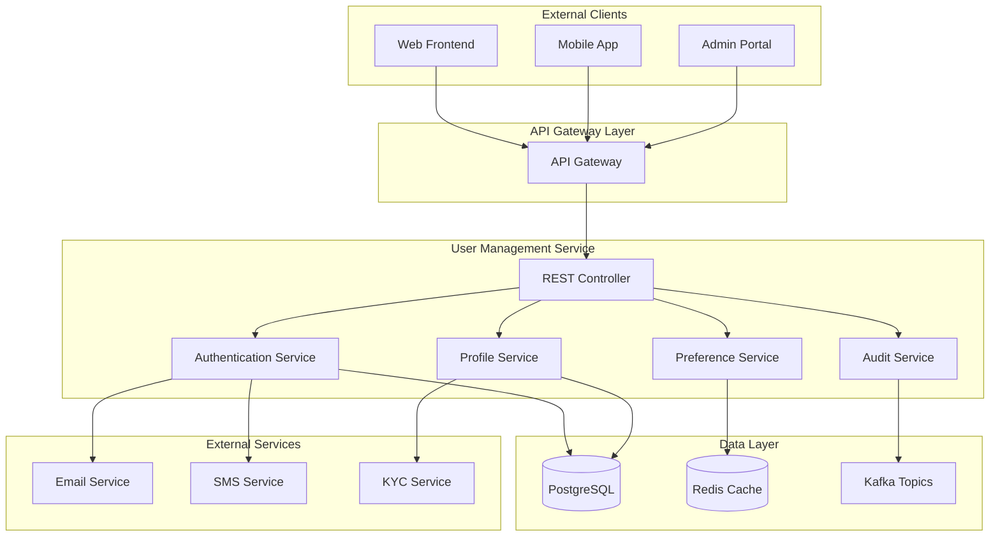

# User Management Service Detailed Design Document

## Table of Contents

1. [Overview](#overview)
2. [Technical Specifications](#technical-specifications)
3. [Architecture Design](#architecture-design)
4. [API Design](#api-design)
5. [Database Design](#database-design)
6. [Error Handling](#error-handling)
7. [Security Design](#security-design)
8. [Test Design](#test-design)
9. [Local Development Environment](#local-development-environment)
10. [Production Deployment](#production-deployment)
11. [Monitoring and Operations](#monitoring-and-operations)
12. [Incident Response](#incident-response)

## Overview

### Service Summary

The User Management Service is a microservice responsible for the user management functions of the ski equipment sales shop site. It provides all user-related functions, including user registration, authentication, profile management, and settings management.

### Key Responsibilities

- **User Registration & Authentication**: New user registration, login/logout processing
- **Profile Management**: Management of user basic information, addresses, and contact information
- **Settings Management**: Account settings, privacy settings, and notification settings
- **Permission Management**: Management of user roles and permissions
- **Session Management**: Management of user sessions
- **Audit Function**: Audit log management of user operations

### Business Value

- **Improved Customer Experience**: Smooth registration and login experience
- **Personalization**: Customization based on user attributes
- **Security**: Robust user management and access control
- **GDPR Compliance**: Compliance with personal data protection regulations

## Technical Specifications

### Technology Stack

| Technology Area | Technology/Library | Version | Purpose |
|---|---|---|---|
| **Runtime** | OpenJDK | 21 LTS | Java execution environment |
| **Framework** | Jakarta EE | 11 | Enterprise framework |
| **Application Server** | WildFly | 31.0.1 | Jakarta EE application server |
| **Persistence** | Jakarta Persistence (JPA) | 3.2 | ORM |
| **Data Access** | Jakarta Data | 1.0 | Repository abstraction |
| **REST API** | Jakarta REST (JAX-RS) | 4.0 | RESTful Web Services |
| **CDI** | Jakarta CDI | 4.1 | Dependency injection and management |
| **Validation** | Jakarta Validation | 3.1 | Bean Validation |
| **Security** | Jakarta Security | 3.0 | Security |
| **JSON Processing** | Jakarta JSON-P | 2.1 | JSON processing |
| **Database** | PostgreSQL | 16 | Main database |
| **Cache** | Redis | 7.2 | Session and cache |
| **Message Queue** | Apache Kafka | 3.7 | Asynchronous event processing |
| **Password Hashing** | BCrypt | 0.10.2 | Password hashing |
| **Monitoring** | MicroProfile Metrics | 5.1 | Metrics collection |
| **Tracing** | MicroProfile OpenTelemetry | 2.0 | Distributed tracing |
| **Health Check** | MicroProfile Health | 4.0 | Health checks |
| **Configuration** | MicroProfile Config | 3.1 | Configuration management |

### Excluded Technologies

- **Lombok**: Not used in order to leverage Jakarta EE 11's Record classes and modern Java features.

### Java 21 LTS Features Utilized

- **Virtual Threads**: Performance improvement through high concurrency
- **Record Classes**: Concise implementation of immutable data structures
- **Pattern Matching**: Type-safe and highly readable code
- **Text Blocks**: Improved readability of complex SQL/JSON definitions
- **Sealed Classes**: Enhanced type safety

## Architecture Design

### System Architecture Diagram



### Domain Model Design

```java
// User entity (utilizing Jakarta EE 11 Records)
@Entity
@Table(name = "users")
public class User {
    
    @Id
    @GeneratedValue(strategy = GenerationType.UUID)
    private UUID id;
    
    @Column(unique = true, nullable = false)
    private String email;
    
    @Column(name = "password_hash", nullable = false)
    private String passwordHash;
    
    @Embedded
    private PersonalInfo personalInfo;
    
    @Embedded
    private AccountStatus accountStatus;
    
    @OneToMany(mappedBy = "user", cascade = CascadeType.ALL, fetch = FetchType.LAZY)
    private List<Address> addresses = new ArrayList<>();
    
    @OneToMany(mappedBy = "user", cascade = CascadeType.ALL, fetch = FetchType.LAZY)
    private List<UserPreference> preferences = new ArrayList<>();
    
    @Column(name = "created_at", nullable = false)
    private LocalDateTime createdAt;
    
    @Column(name = "updated_at")
    private LocalDateTime updatedAt;
    
    @PrePersist
    void prePersist() {
        this.createdAt = LocalDateTime.now();
        this.updatedAt = LocalDateTime.now();
    }
    
    @PreUpdate
    void preUpdate() {
        this.updatedAt = LocalDateTime.now();
    }
    
    // Asynchronous method compatible with Virtual Threads
    @Asynchronous
    public CompletableFuture<List<Order>> getUserOrdersAsync() {
        return CompletableFuture.supplyAsync(() -> {
            // Order service integration (asynchronous)
            return orderServiceClient.getOrdersByUserId(this.id);
        });
    }
}

// Record-based Value Objects
public record PersonalInfo(
    String firstName,
    String lastName,
    String firstNameKana,
    String lastNameKana,
    LocalDate birthDate,
    Gender gender,
    String phoneNumber
) {
    public String getFullName() {
        return String.format("%s %s", firstName, lastName);
    }
    
    public String getFullNameKana() {
        return String.format("%s %s", firstNameKana, lastNameKana);
    }
}

public record AccountStatus(
    UserStatus status,
    boolean emailVerified,
    boolean phoneVerified,
    LocalDateTime lastLoginAt,
    int loginFailureCount,
    LocalDateTime lockoutUntil
) {
    public boolean isLocked() {
        return lockoutUntil != null && lockoutUntil.isAfter(LocalDateTime.now());
    }
    
    public boolean isActive() {
        return status == UserStatus.ACTIVE && !isLocked();
    }
}

// Sealed Classes for Type Safety
public sealed interface UserEvent
    permits UserRegisteredEvent, UserProfileUpdatedEvent, UserDeactivatedEvent {
}

public record UserRegisteredEvent(
    UUID userId,
    String email,
    LocalDateTime registeredAt
) implements UserEvent {}

public record UserProfileUpdatedEvent(
    UUID userId,
    String fieldName,
    String oldValue,
    String newValue,
    LocalDateTime updatedAt
) implements UserEvent {}

// Enums
public enum UserStatus {
    PENDING_VERIFICATION,
    ACTIVE, 
    SUSPENDED,
    DEACTIVATED,
    DELETED
}

public enum Gender {
    MALE, FEMALE, OTHER, NOT_SPECIFIED
}
```

### Layered Architecture

```java
// REST Controller Layer
@Path("/users")
@ApplicationScoped
@Produces(MediaType.APPLICATION_JSON)
@Consumes(MediaType.APPLICATION_JSON)
public class UserResource {
    
    @Inject
    private UserService userService;
    
    @Inject
    private UserMapper userMapper;
    
    @POST
    @Path("/register")
    @Valid
    public Response registerUser(@Valid UserRegistrationRequest request) {
        try {
            var user = userService.registerUser(request);
            var response = userMapper.toResponse(user);
            
            return Response.status(Response.Status.CREATED)
                .entity(response)
                .location(URI.create("/users/" + user.getId()))
                .build();
                
        } catch (EmailAlreadyExistsException e) {
                .build();
        }
    }
}
```

## Security Design {#security-design}

### Password Management

```java
// Password encoding service
@ApplicationScoped
public class PasswordEncoder {
    
    private final BCryptPasswordEncoder encoder;
    
    public PasswordEncoder() {
        this.encoder = new BCryptPasswordEncoder(12); // Stronger encryption strength
    }
    
    public String encode(String rawPassword) {
        validatePasswordStrength(rawPassword);
        return encoder.encode(rawPassword);
    }
    
    public boolean matches(String rawPassword, String encodedPassword) {
        return encoder.matches(rawPassword, encodedPassword);
    }
    
    private void validatePasswordStrength(String password) {
        var violations = new ArrayList<String>();
        
        if (password.length() < 8) {
            violations.add("Password must be at least 8 characters long");
        }
        
        if (!password.matches(".*[a-z].*")) {
            violations.add("Must contain a lowercase letter");
        }
        
        if (!password.matches(".*[A-Z].*")) {
            violations.add("Must contain an uppercase letter");
        }
        
        if (!password.matches(".*\\d.*")) {
            violations.add("Must contain a number");
        }
        
        if (!password.matches(".*[!@#$%^&*()_+\\-=\\[\\]{};':\"\\\\|,.<>?].*")) {
            violations.add("Must contain a special character");
        }
        
        if (!violations.isEmpty()) {
            throw new PasswordValidationException(violations);
        }
    }
}

// Session management service
@ApplicationScoped
public class SessionManagementService {
    
    @Inject
    private RedisTemplate redisTemplate;
    
    @Inject
    @ConfigProperty(name = "session.timeout.minutes", defaultValue = "30")
    private Integer sessionTimeoutMinutes;
    
    @Inject
    @ConfigProperty(name = "session.max.concurrent", defaultValue = "5")
    private Integer maxConcurrentSessions;
    
    public UserSession createSession(User user, String ipAddress, String userAgent) {
        // Check number of existing sessions
        limitConcurrentSessions(user.getId());
        
        var sessionToken = generateSecureToken();
        var deviceInfo = parseDeviceInfo(userAgent);
        var expiresAt = LocalDateTime.now().plusMinutes(sessionTimeoutMinutes);
        
        var session = new UserSession(
            UUID.randomUUID(),
            user.getId(),
            sessionToken,
            deviceInfo,
            ipAddress,
            expiresAt,
            LocalDateTime.now(),
            LocalDateTime.now()
        );
        
        // Save session to Redis
        var sessionKey = "session:" + sessionToken;
        redisTemplate.opsForValue().set(
            sessionKey, 
            session, 
            Duration.ofMinutes(sessionTimeoutMinutes)
        );
        
        // Update user's session list
        var userSessionsKey = "user_sessions:" + user.getId();
        redisTemplate.opsForSet().add(userSessionsKey, sessionToken);
        redisTemplate.expire(userSessionsKey, Duration.ofHours(24));
        
        return session;
    }
    
    public Optional<UserSession> validateSession(String sessionToken) {
        var sessionKey = "session:" + sessionToken;
        var session = redisTemplate.opsForValue().get(sessionKey);
        
        if (session != null && !session.isExpired()) {
            // Update last accessed time
            updateLastAccessed(sessionToken);
            return Optional.of(session);
        }
        
        return Optional.empty();
    }
    
    private void limitConcurrentSessions(UUID userId) {
        var userSessionsKey = "user_sessions:" + userId;
        var sessionTokens = redisTemplate.opsForSet().members(userSessionsKey);
        
        if (sessionTokens.size() >= maxConcurrentSessions) {
            // Delete the oldest session
            var oldestSession = findOldestSession(sessionTokens);
            if (oldestSession != null) {
                invalidateSession(oldestSession);
            }
        }
    }
}
```

### JWT Implementation

```java
// JWT Service
@ApplicationScoped
public class JwtService {
    
    @Inject
    @ConfigProperty(name = "jwt.secret")
    private String jwtSecret;
    
    @Inject
    @ConfigProperty(name = "jwt.issuer")
    private String jwtIssuer;
    
    @Inject
    @ConfigProperty(name = "jwt.expiration.hours", defaultValue = "2")
    private Integer jwtExpirationHours;
    
    private Key signingKey;
    
    @PostConstruct
    void initializeKey() {
        this.signingKey = Keys.hmacShaKeyFor(jwtSecret.getBytes(StandardCharsets.UTF_8));
    }
    
    public String generateToken(User user) {
        var now = Instant.now();
        var expiration = now.plus(jwtExpirationHours, ChronoUnit.HOURS);
        
        return Jwts.builder()
            .setIssuer(jwtIssuer)
            .setSubject(user.getId().toString())
            .setIssuedAt(Date.from(now))
            .setExpiration(Date.from(expiration))
            .claim("email", user.getEmail())
            .claim("roles", extractUserRoles(user))
            .claim("permissions", extractUserPermissions(user))
            .signWith(signingKey, SignatureAlgorithm.HS512)
            .compact();
    }
    
    public Claims validateToken(String token) {
        try {
            return Jwts.parserBuilder()
                .setSigningKey(signingKey)
                .requireIssuer(jwtIssuer)
                .build()
                .parseClaimsJws(token)
                .getBody();
        } catch (JwtException e) {
            throw new InvalidCredentialsException();
        }
    }
    
    private Set<String> extractUserRoles(User user) {
        // User role extraction logic
        return Set.of("USER"); // Basic implementation
    }
    
    private Set<String> extractUserPermissions(User user) {
        // User permission extraction logic
        return Set.of("READ_PROFILE", "UPDATE_PROFILE");
    }
}
```

### Security Filter

```java
// Authentication Filter
@Provider
@PreMatching
public class AuthenticationFilter implements ContainerRequestFilter {
    
    @Inject
    private JwtService jwtService;
    
    @Inject
    private SessionManagementService sessionService;
    
    @Override
    public void filter(ContainerRequestContext requestContext) throws IOException {
        var path = requestContext.getUriInfo().getPath();
        
        // Skip public endpoints
        if (isPublicEndpoint(path)) {
            return;
        }
        
        var authHeader = requestContext.getHeaderString("Authorization");
        if (authHeader == null || !authHeader.startsWith("Bearer ")) {
            abortWithUnauthorized(requestContext);
            return;
        }
        
        var token = authHeader.substring("Bearer ".length());
        
        try {
            var claims = jwtService.validateToken(token);
            var userPrincipal = createUserPrincipal(claims);
            
            // Set security context
            requestContext.setSecurityContext(new UserSecurityContext(userPrincipal));
            
        } catch (Exception e) {
            abortWithUnauthorized(requestContext);
        }
    }
    
    private boolean isPublicEndpoint(String path) {
        return path.matches("/(health|metrics|register|login|forgot-password).*");
    }
    
    private void abortWithUnauthorized(ContainerRequestContext requestContext) {
        requestContext.abortWith(
            Response.status(Response.Status.UNAUTHORIZED)
                .entity(new ErrorResponse(
                    "https://api.ski-shop.com/problems/unauthorized",
                    "Unauthorized",
                    401,
                    "Authentication is required",
                    requestContext.getUriInfo().getPath(),
                    LocalDateTime.now(),
                    Collections.emptyMap()
                ))
                .build()
        );
    }
}

// Security Context
public class UserSecurityContext implements SecurityContext {
    private final UserPrincipal userPrincipal;
    
    public UserSecurityContext(UserPrincipal userPrincipal) {
        this.userPrincipal = userPrincipal;
    }
    
    @Override
    public Principal getUserPrincipal() {
        return userPrincipal;
    }
    
    @Override
    public boolean isUserInRole(String role) {
        return userPrincipal.hasRole(role);
    }
    
    @Override
    public boolean isSecure() {
        return true;
    }
    
    @Override
    public String getAuthenticationScheme() {
        return "BEARER";
    }
}
```

## Test Design

### Unit Tests

```java
// UserService Test
@ExtendWith(MockitoExtension.class)
class UserServiceTest {
    
    @InjectMocks
    private UserService userService;
    
    @Mock
    private UserRepository userRepository;
    
    @Mock
    private PasswordEncoder passwordEncoder;
    
    @Mock
    private UserEventPublisher eventPublisher;
    
    @Test
    @DisplayName("User registration succeeds with a valid request")
    void shouldRegisterUser_WhenValidRequest() {
        // Given
        var request = new UserRegistrationRequest(
            "test@example.com",
            "SecurePass123!",
            "Taro",
            "Tanaka",
            "TARO",
            "TANAKA",
            LocalDate.of(1990, 1, 1),
            Gender.MALE,
            "090-1234-5678"
        );
        
        when(userRepository.findByEmail(request.email())).thenReturn(Optional.empty());
        when(passwordEncoder.encode(request.password())).thenReturn("hashedPassword");
        when(userRepository.save(any(User.class))).thenAnswer(invocation -> {
            var user = (User) invocation.getArgument(0);
            user.setId(UUID.randomUUID());
            return user;
        });
        
        // When
        var result = userService.registerUser(request);
        
        // Then
        assertThat(result).isNotNull();
        assertThat(result.getEmail()).isEqualTo(request.email());
        assertThat(result.getPersonalInfo().firstName()).isEqualTo(request.firstName());
        
        verify(userRepository).save(any(User.class));
        verify(eventPublisher).publish(any(UserRegisteredEvent.class));
    }
    
    @Test
    @DisplayName("Exception is thrown when registering with an existing email address")
    void shouldThrowException_WhenEmailAlreadyExists() {
        // Given
        var request = new UserRegistrationRequest(
            "existing@example.com",
            "SecurePass123!",
            "Taro",
            "Tanaka",
            "TARO",
            "TANAKA",
            LocalDate.of(1990, 1, 1),
            Gender.MALE,
            "090-1234-5678"
        );
        
        var existingUser = new User();
        when(userRepository.findByEmail(request.email())).thenReturn(Optional.of(existingUser));
        
        // When & Then
        assertThatThrownBy(() -> userService.registerUser(request))
            .isInstanceOf(EmailAlreadyExistsException.class)
            .hasMessageContaining("is already in use");
        
        verify(userRepository, never()).save(any(User.class));
    }
}

// Integration Test
@QuarkusIntegrationTest
@TestProfile(IntegrationTestProfile.class)
@TestMethodOrder(OrderAnnotation.class)
class UserManagementIntegrationTest {
    
    @Test
    @Order(1)
    @DisplayName("User registration API works correctly")
    void shouldRegisterUserSuccessfully() {
        var request = """
            {
                "email": "integration-test@example.com",
                "password": "SecurePass123!",
                "firstName": "Integration",
                "lastName": "Test",
                "firstNameKana": "INTEGRATION",
                "lastNameKana": "TEST",
                "birthDate": "1990-01-01",
                "gender": "MALE",
                "phoneNumber": "090-1234-5678"
            }
            """;
        
        given()
            .contentType(ContentType.JSON)
            .body(request)
        .when()
            .post("/users/register")
        .then()
            .statusCode(201)
            .body("email", equalTo("integration-test@example.com"))
            .body("firstName", equalTo("Integration"))
            .body("status", equalTo("PENDING_VERIFICATION"));
    }
    
    @Test
    @Order(2)
    @DisplayName("Can log in with a registered user")
    void shouldLoginWithRegisteredUser() {
        var loginRequest = """
            {
                "email": "integration-test@example.com",
                "password": "SecurePass123!"
            }
            """;
        
        given()
            .contentType(ContentType.JSON)
            .body(loginRequest)
        .when()
            .post("/users/login")
        .then()
            .statusCode(200)
            .body("accessToken", notNullValue())
            .body("tokenType", equalTo("Bearer"))
            .body("expiresIn", greaterThan(0));
    }
}
```

### Performance Tests

```java
@Component
public class UserManagementLoadTest {
    
    @Test
    public void registrationLoadTest() {
        var scenario = Scenario.builder()
            .name("User Registration Load Test")
            .users(500)
            .rampUp(Duration.ofMinutes(2))
            .duration(Duration.ofMinutes(5))
            .protocol(http.baseUrl("http://localhost:8081"))
            .exec(
                http("register_user")
                    .post("/users/register")
                    .header("Content-Type", "application/json")
                    .body(StringBody(session -> generateRandomUserRegistration()))
                    .check(status().is(201))
            )
            .build();
            
        var simulation = Simulation.builder()
            .scenarios(scenario)
            .checks(
                Check.responseTime().percentile(95).lessThan(1000),
                Check.successRate().greaterThan(99.0)
            )
            .build();
            
        simulation.run();
    }
    
    private String generateRandomUserRegistration() {
        var random = new Random();
        var email = "load-test-" + random.nextInt(100000) + "@example.com";
        
        return String.format("""
            {
                "email": "%s",
                "password": "LoadTest123!",
                "firstName": "Load",
                "lastName": "Test",
                "firstNameKana": "LOAD",
                "lastNameKana": "TEST",
                "birthDate": "1990-01-01",
                "gender": "MALE",
                "phoneNumber": "090-1234-5678"
            }
            """, email);
    }
}
```

## Local Development Environment

### Docker Compose Configuration

```yaml
# docker-compose.yml
version: '3.9'

services:
  user-management:
    build:
      context: .
      dockerfile: Dockerfile.dev
    ports:
      - "8081:8081"
      - "9991:9990"  # WildFly Admin Console
    environment:
      - DATABASE_URL=jdbc:postgresql://postgres:5432/user_db
      - DATABASE_USER=user_service
      - DATABASE_PASSWORD=user_pass
      - REDIS_URL=redis://redis:6379
      - KAFKA_BOOTSTRAP_SERVERS=kafka:9092
      - JWT_SECRET=dev-jwt-secret-key-change-in-production
      - JWT_ISSUER=ski-shop-dev
      - LOG_LEVEL=DEBUG
      - SESSION_TIMEOUT_MINUTES=30
    volumes:
      - ./src:/app/src
      - ./config:/app/config
      - user_logs:/app/logs
    depends_on:
      - postgres
      - redis
      - kafka
    networks:
      - ski-shop-network
    healthcheck:
      test: ["CMD", "curl", "-f", "http://localhost:8081/health"]
      interval: 30s
      timeout: 10s
      retries: 3
      start_period: 60s

  postgres:
    image: postgres:16-alpine
    environment:
      - POSTGRES_DB=user_db
      - POSTGRES_USER=user_service
      - POSTGRES_PASSWORD=user_pass
    ports:
      - "5433:5432"
    volumes:
      - postgres_user_data:/var/lib/postgresql/data
      - ./scripts/init-user-db.sql:/docker-entrypoint-initdb.d/init-db.sql
    networks:
      - ski-shop-network

  redis:
    image: redis:7-alpine
    command: redis-server --appendonly yes
    ports:
      - "6380:6379"
    volumes:
      - redis_user_data:/data
    networks:
      - ski-shop-network

  kafka:
    image: confluentinc/cp-kafka:7.5.0
    ports:
      - "9093:9092"
    environment:
      KAFKA_BROKER_ID: 2
      KAFKA_ZOOKEEPER_CONNECT: zookeeper:2181
      KAFKA_ADVERTISED_LISTENERS: PLAINTEXT://kafka:9092
      KAFKA_OFFSETS_TOPIC_REPLICATION_FACTOR: 1
      KAFKA_AUTO_CREATE_TOPICS_ENABLE: true
    depends_on:
      - zookeeper
    networks:
      - ski-shop-network

  zookeeper:
    image: confluentinc/cp-zookeeper:7.5.0
    environment:
      ZOOKEEPER_CLIENT_PORT: 2181
      ZOOKEEPER_TICK_TIME: 2000
    networks:
      - ski-shop-network

volumes:
  postgres_user_data:
  redis_user_data:
  user_logs:

networks:
  ski-shop-network:
    driver: bridge
```

### Development Configuration

```bash
#!/bin/bash
# run-user-service.sh

echo "Starting User Management Service locally..."

# 1. Set environment variables
export JAVA_OPTS="-server \
                  -XX:+UseZGC \
                  -XX:+UnlockExperimentalVMOptions \
                  --enable-preview \
                  -Xms256m \
                  -Xmx1g \
                  -Djboss.bind.address=0.0.0.0 \
                  -Djboss.bind.address.management=0.0.0.0"

# 2. Debug mode (optional)
if [ "$1" = "debug" ]; then
    export JAVA_OPTS="$JAVA_OPTS -agentlib:jdwp=transport=dt_socket,server=y,suspend=n,address=*:5006"
    echo "Debug mode enabled on port 5006"
fi

# 3. Prepare database
echo "Preparing database..."
docker-compose up -d postgres redis kafka
sleep 20

# 4. Initialize database schema
echo "Initializing database schema..."
mvn flyway:migrate -Dflyway.configFiles=src/main/resources/db/flyway.conf

# 5. Load test data
echo "Loading test data..."
mvn exec:java -Dexec.mainClass="com.skishop.user.dev.TestDataLoader"

# 6. Start application
echo "Starting User Management Service..."
docker-compose up --build user-management

echo "User Management Service is ready at http://localhost:8081"
```

## Production Deployment {#production-deployment}

### Azure Container Apps Configuration

```bicep
// user-management.bicep
param environment string = 'production'
param location string = resourceGroup().location

// Container Apps Environment
resource containerAppsEnv 'Microsoft.App/managedEnvironments@2023-05-01' existing = {
  name: 'ski-shop-${environment}'
}

// User Management Container App
resource userManagementApp 'Microsoft.App/containerApps@2023-05-01' = {
  name: 'user-management'
  location: location
  properties: {
    managedEnvironmentId: containerAppsEnv.id
    configuration: {
      activeRevisionsMode: 'Multiple'
      ingress: {
        external: false  // Internal service
        targetPort: 8081
        allowInsecure: false
        traffic: [
          {
            revisionName: 'user-management--latest'
            weight: 100
          }
        ]
      }
      secrets: [
        {
          name: 'database-connection-string'
          value: 'postgresql://${postgresServer.name}.postgres.database.azure.com:5432/user_db'
        }
        {
          name: 'database-password'
          keyVaultUrl: keyVault.properties.vaultUri
          identity: managedIdentity.id
        }
        {
          name: 'redis-connection-string'
          value: '${redisCache.properties.hostName}:6380,password=${redisCache.listKeys().primaryKey},ssl=true'
        }
        {
          name: 'jwt-secret'
          keyVaultUrl: keyVault.properties.vaultUri
          identity: managedIdentity.id
        }
      ]
      registries: [
        {
          server: '${containerRegistry.name}.azurecr.io'
          identity: managedIdentity.id
        }
      ]
    }
    template: {
      containers: [
        {
          name: 'user-management'
          image: '${containerRegistry.name}.azurecr.io/user-management:latest'
          env: [
            {
              name: 'DATABASE_URL'
              secretRef: 'database-connection-string'
            }
            {
              name: 'DATABASE_PASSWORD'
              secretRef: 'database-password'
            }
            {
              name: 'REDIS_URL'
              secretRef: 'redis-connection-string'
            }
            {
              name: 'JWT_SECRET'
              secretRef: 'jwt-secret'
            }
            {
              name: 'ENVIRONMENT'
              value: environment
            }
            {
              name: 'LOG_LEVEL'
              value: 'INFO'
            }
          ]
          resources: {
            cpu: '1.0'
            memory: '2Gi'
          }
          probes: [
            {
              type: 'Liveness'
              httpGet: {
                path: '/health/live'
                port: 8081
              }
              initialDelaySeconds: 60
              periodSeconds: 30
              timeoutSeconds: 10
              failureThreshold: 3
            }
            {
              type: 'Readiness'
              httpGet: {
                path: '/health/ready'
                port: 8081
              }
              initialDelaySeconds: 30
              periodSeconds: 10
              timeoutSeconds: 5
              failureThreshold: 3
            }
          ]
        }
      ]
      scale: {
        minReplicas: 2
        maxReplicas: 20
        rules: [
          {
            name: 'http-scaling'
            http: {
              metadata: {
                concurrentRequests: '100'
              }
            }
          }
          {
            name: 'cpu-scaling'
            custom: {
              type: 'cpu'
              metadata: {
                type: 'Utilization'
                value: '70'
              }
            }
          }
          {
            name: 'memory-scaling'
            custom: {
              type: 'memory'
              metadata: {
                type: 'Utilization'
                value: '80'
              }
            }
          }
        ]
      }
    }
  }
}
```

### CI/CD Pipeline

```yaml
# .github/workflows/deploy-user-management.yml
name: Deploy User Management Service

on:
  push:
    branches: [main]
    paths: ['user-management/**']

env:
  AZURE_RESOURCE_GROUP: ski-shop-rg
  CONTAINER_REGISTRY: skishopregistry
  APP_NAME: user-management

jobs:
  test:
    runs-on: ubuntu-latest
    services:
      postgres:
        image: postgres:16
        env:
          POSTGRES_DB: test_user_db
          POSTGRES_USER: test_user
          POSTGRES_PASSWORD: test_pass
        options: >-
          --health-cmd pg_isready
          --health-interval 10s
          --health-timeout 5s
          --health-retries 5
        ports:
          - 5432:5432
      
      redis:
        image: redis:7
        options: >-
          --health-cmd "redis-cli ping"
          --health-interval 10s
          --health-timeout 5s
          --health-retries 5
        ports:
          - 6379:6379

    steps:
      - uses: actions/checkout@v4
      
      - name: Set up JDK 21
        uses: actions/setup-java@v4
        with:
          java-version: '21'
          distribution: 'temurin'
          
      - name: Cache Maven dependencies
        uses: actions/cache@v3
        with:
          path: ~/.m2
          key: ${{ runner.os }}-m2-${{ hashFiles('**/pom.xml') }}
          
      - name: Run Unit Tests
        run: |
          cd user-management
          mvn clean test
          
      - name: Run Integration Tests
        env:
          DATABASE_URL: jdbc:postgresql://localhost:5432/test_user_db
          DATABASE_USER: test_user
          DATABASE_PASSWORD: test_pass
          REDIS_URL: redis://localhost:6379
        run: |
          cd user-management
          mvn verify -P integration-tests
          
      - name: Generate Test Reports
        uses: dorny/test-reporter@v1
        if: success() || failure()
        with:
          name: User Management Tests
          path: 'user-management/target/surefire-reports/*.xml'
          reporter: java-junit

  security-scan:
    runs-on: ubuntu-latest
    steps:
      - uses: actions/checkout@v4
      
      - name: Run OWASP Dependency Check
        run: |
          cd user-management
          mvn org.owasp:dependency-check-maven:check
          
      - name: Upload Security Scan Results
        uses: actions/upload-artifact@v3
        with:
          name: security-scan-results
          path: user-management/target/dependency-check-report.html

  build-and-deploy:
    needs: [test, security-scan]
    runs-on: ubuntu-latest
    if: github.ref == 'refs/heads/main'
    
    steps:
      - uses: actions/checkout@v4
      
      - name: Set up Docker Buildx
        uses: docker/setup-buildx-action@v3
        
      - name: Login to Azure Container Registry
        uses: azure/docker-login@v1
        with:
          login-server: ${{ env.CONTAINER_REGISTRY }}.azurecr.io
          username: ${{ secrets.ACR_USERNAME }}
          password: ${{ secrets.ACR_PASSWORD }}
          
      - name: Build and Push Docker Image
        run: |
          cd user-management
          docker build -t ${{ env.CONTAINER_REGISTRY }}.azurecr.io/${{ env.APP_NAME }}:${{ github.sha }} .
          docker build -t ${{ env.CONTAINER_REGISTRY }}.azurecr.io/${{ env.APP_NAME }}:latest .
          docker push ${{ env.CONTAINER_REGISTRY }}.azurecr.io/${{ env.APP_NAME }}:${{ github.sha }}
          docker push ${{ env.CONTAINER_REGISTRY }}.azurecr.io/${{ env.APP_NAME }}:latest
          
      - name: Login to Azure
        uses: azure/login@v1
        with:
          creds: ${{ secrets.AZURE_CREDENTIALS }}
          
      - name: Deploy to Container Apps
        run: |
          az containerapp update \
            --name ${{ env.APP_NAME }} \
            --resource-group ${{ env.AZURE_RESOURCE_GROUP }} \
            --image ${{ env.CONTAINER_REGISTRY }}.azurecr.io/${{ env.APP_NAME }}:${{ github.sha }}
            
      - name: Verify Deployment
        run: |
          # Wait for health check
          sleep 60
          
          # Get Internal URL (access via API Gateway)
          GATEWAY_URL=$(az containerapp show \
            --name api-gateway \
            --resource-group ${{ env.AZURE_RESOURCE_GROUP }} \
            --query properties.configuration.ingress.fqdn -o tsv)
          
          # Run health check
          curl -f "https://$GATEWAY_URL/api/v1/users/health" || exit 1
```

## Monitoring and Operations

### Metrics Implementation

```java
@ApplicationScoped
public class UserManagementMetricsService {
    
    @Inject
    @Metric(name = "user_registrations_total",
            description = "Total number of user registrations")
    private Counter registrationCounter;
    
    @Inject
    @Metric(name = "user_logins_total",
            description = "Total number of user logins")
    private Counter loginCounter;
    
    @Inject
    @Metric(name = "user_login_failures_total",
            description = "Total number of failed login attempts")
    private Counter loginFailureCounter;
    
    @Inject
    @Metric(name = "active_user_sessions",
            description = "Number of active user sessions")
    private Gauge<Integer> activeSessionsGauge;
    
    @Inject
    @Metric(name = "user_operation_duration_seconds",
            description = "Duration of user operations")
    private Timer operationTimer;
    
    public void recordRegistration(String source) {
        registrationCounter.inc(Tags.of("source", source));
    }
    
    public void recordLogin(String method, boolean success) {
        if (success) {
            loginCounter.inc(Tags.of("method", method));
        } else {
            loginFailureCounter.inc(Tags.of("method", method));
        }
    }
    
    public Timer.Sample startOperationTimer(String operation) {
        return Timer.start(
            Tags.of("operation", operation)
        );
    }
    
    public void updateActiveSessionsCount(int count) {
        // Update Gauge (periodically update session count)
        activeSessionsGauge.set(count);
    }
}

// Health check implementation
@ApplicationScoped
@Health
public class UserManagementHealthCheck implements HealthCheck {
    
    @Inject
    private DataSource dataSource;
    
    @Inject
    private RedisTemplate redisTemplate;
    
    @Override
    public HealthCheckResponse call() {
        var builder = HealthCheckResponse.named("user-management");
        
        try {
            // Check database connection
            if (!isDatabaseHealthy()) {
                return builder.down()
                    .withData("database", "unhealthy")
                    .build();
            }
            
            // Check Redis connection
            if (!isRedisHealthy()) {
                return builder.down()
                    .withData("redis", "unhealthy")
                    .build();
            }
            
            return builder.up()
                .withData("database", "healthy")
                .withData("redis", "healthy")
                .withData("active_users", getActiveUserCount())
                .withData("uptime", getUptime())
                .build();
                
        } catch (Exception e) {
            return builder.down()
                .withData("error", e.getMessage())
                .build();
        }
    }
    
    private boolean isDatabaseHealthy() {
        try (var connection = dataSource.getConnection()) {
            return connection.isValid(5);
        } catch (Exception e) {
            return false;
        }
    }
    
    private boolean isRedisHealthy() {
        try {
            redisTemplate.execute(connection -> {
                connection.ping();
                return true;
            });
            return true;
        } catch (Exception e) {
            return false;
        }
    }
}
```

### Logging Configuration

```xml
<!-- logback-spring.xml -->
<configuration>
    <include resource="org/springframework/boot/logging/logback/defaults.xml"/>
    
    <springProfile name="local">
        <appender name="CONSOLE" class="ch.qos.logback.core.ConsoleAppender">
            <encoder class="net.logstash.logback.encoder.LoggingEventCompositeJsonEncoder">
                <providers>
                    <timestamp/>
                    <level/>
                    <loggerName/>
                    <message/>
                    <mdc/>
                    <arguments/>
                    <stackTrace/>
                </providers>
            </encoder>
        </appender>
        
        <logger name="com.skishop.user" level="DEBUG"/>
        <logger name="org.hibernate.SQL" level="DEBUG"/>
        <logger name="org.hibernate.type.descriptor.sql.BasicBinder" level="TRACE"/>
        
        <root level="INFO">
            <appender-ref ref="CONSOLE"/>
        </root>
    </springProfile>
    
    <springProfile name="production">
        <appender name="FILE" class="ch.qos.logback.core.rolling.RollingFileAppender">
            <file>/app/logs/user-management.log</file>
            <rollingPolicy class="ch.qos.logback.core.rolling.TimeBasedRollingPolicy">
                <fileNamePattern>/app/logs/user-management.%d{yyyy-MM-dd}.%i.gz</fileNamePattern>
                <maxFileSize>100MB</maxFileSize>
                <maxHistory>30</maxHistory>
                <totalSizeCap>3GB</totalSizeCap>
            </rollingPolicy>
            <encoder class="net.logstash.logback.encoder.LoggingEventCompositeJsonEncoder">
                <providers>
                    <timestamp/>
                    <level/>
                    <loggerName/>
                    <message/>
                    <mdc/>
                    <arguments/>
                    <stackTrace/>
                </providers>
            </encoder>
        </appender>
        
        <appender name="AUDIT" class="ch.qos.logback.core.rolling.RollingFileAppender">
            <file>/app/logs/user-audit.log</file>
            <rollingPolicy class="ch.qos.logback.core.rolling.TimeBasedRollingPolicy">
                <fileNamePattern>/app/logs/user-audit.%d{yyyy-MM-dd}.%i.gz</fileNamePattern>
                <maxFileSize>100MB</maxFileSize>
                <maxHistory>90</maxHistory>
                <totalSizeCap>10GB</totalSizeCap>
            </rollingPolicy>
            <encoder class="net.logstash.logback.encoder.LoggingEventCompositeJsonEncoder">
                <providers>
                    <timestamp/>
                    <level/>
                    <loggerName/>
                    <message/>
                    <mdc/>
                    <arguments/>
                </providers>
            </encoder>
        </appender>
        
        <logger name="com.skishop.user.audit" level="INFO" additivity="false">
            <appender-ref ref="AUDIT"/>
        </logger>
        
        <root level="WARN">
            <appender-ref ref="FILE"/>
        </root>
    </springProfile>
</configuration>
```

## Incident Response

### Failure Scenarios and Response Procedures

#### 1. Database Connection Failure

```bash
# Check symptoms
curl -f http://user-management:8081/health
# Response: {"status": "DOWN", "checks": [{"name": "database", "status": "DOWN"}]}

# Response procedure
echo "1. Check database connection status"
kubectl logs deployment/user-management -n ski-shop | grep -i database

echo "2. Check PostgreSQL connection"
kubectl exec -it deployment/user-management -n ski-shop -- \
  psql -h postgres -U user_service -d user_db -c "SELECT 1"

echo "3. Check connection pool status"
curl http://user-management:8081/metrics | grep -E "(hikari|connection)"

echo "4. Enable read-only mode in an emergency"
kubectl set env deployment/user-management -n ski-shop READ_ONLY_MODE=true
```

#### 2. Redis Session Failure

```bash
# Symptoms: Logged-in users get authentication errors
echo "Check Redis connection"
kubectl exec -it deployment/user-management -n ski-shop -- redis-cli -h redis ping

# Check session information
kubectl exec -it deployment/user-management -n ski-shop -- \
  redis-cli -h redis keys "session:*" | wc -l

# Enable fallback feature (database session)
kubectl set env deployment/user-management -n ski-shop SESSION_FALLBACK_MODE=database
```

#### 3. Mass Registration Request Attack

```bash
# Check rate limits
curl http://user-management:8081/metrics | grep rate_limit

# Strengthen rate limits in an emergency
kubectl set env deployment/user-management -n ski-shop \
  REGISTRATION_RATE_LIMIT=10 \
  REGISTRATION_RATE_WINDOW=PT1H

# Block suspicious IP addresses
kubectl create configmap blocked-ips \
  --from-literal=ips="192.168.1.100,10.0.0.50" \
  -n ski-shop

kubectl set env deployment/user-management -n ski-shop \
  BLOCKED_IPS_CONFIGMAP=blocked-ips
```

#### 4. Memory Leak Response

```bash
# Check JVM metrics
curl http://user-management:8081/metrics | grep jvm_memory

# Get heap dump
kubectl exec -it deployment/user-management-xxx -n ski-shop -- \
  jcmd 1 GC.run_finalization
kubectl exec -it deployment/user-management-xxx -n ski-shop -- \
  jcmd 1 VM.gc

# Emergency Pod restart
kubectl rollout restart deployment/user-management -n ski-shop
```

### Auto-Recovery Feature

```java
@ApplicationScoped
public class UserManagementFailureDetectionService {
    
    @Inject
    private NotificationService notificationService;
    
    @Inject
    private UserManagementMetricsService metricsService;
    
    @Schedule(every = "30s")
    public void checkSystemHealth() {
        var healthStatus = performDetailedHealthCheck();
        
        if (healthStatus.isCritical()) {
            var incident = createIncident(healthStatus);
            notificationService.sendCriticalAlert(incident);
            
            // Attempt auto-recovery
            if (healthStatus.isAutoRecoverable()) {
                performAutoRecovery(healthStatus);
            }
        }
    }
    
    private void performAutoRecovery(HealthStatus status) {
        switch (status.getFailureType()) {
            case DATABASE_CONNECTION -> restartConnectionPool();
            case REDIS_CONNECTION -> enableSessionFallback();
            case HIGH_MEMORY_USAGE -> triggerGarbageCollection();
            case HIGH_ERROR_RATE -> enableCircuitBreaker();
            case SUSPICIOUS_ACTIVITY -> activateRateLimiting();
        }
    }
    
    @Asynchronous
    private void restartConnectionPool() {
        try {
            // Re-initialize connection pool
            dataSourceManager.restart();
            logger.info("Database connection pool restarted successfully");
        } catch (Exception e) {
            logger.error("Failed to restart connection pool", e);
            notificationService.sendAlert("Connection pool restart failed: " + e.getMessage());
        }
    }
}
```

This detailed design document for the User Management Service enables the comprehensive implementation of the user management functions for the ski equipment shop site. Next, I will create the detailed design document for the next microservice (Product Catalog Service).

```java

// CQRS Commands
public sealed interface UserCommand permits RegisterUserCommand, UpdateUserProfileCommand, 
        DeactivateUserCommand, ChangePasswordCommand, UpdateUserPreferencesCommand {}

public record RegisterUserCommand(
    String email,
    String password,
    String firstName,
    String lastName,
    String firstNameKana,
    String lastNameKana,
    LocalDate birthDate,
    Gender gender,
    String phoneNumber,
    Address address
) implements UserCommand {}

public record UpdateUserProfileCommand(
    UUID userId,
    String firstName,
    String lastName,
    String firstNameKana,
    String lastNameKana,
    LocalDate birthDate,
    Gender gender,
    String phoneNumber,
    List<Address> addresses
) implements UserCommand {}

public record DeactivateUserCommand(
    UUID userId,
    String reason,
    UUID deactivatedBy
) implements UserCommand {}

public record ChangePasswordCommand(
    UUID userId,
    String currentPassword,
    String newPassword
) implements UserCommand {}

public record UpdateUserPreferencesCommand(
    UUID userId,
    String language,
    String timezone,
    boolean emailNotifications,
    boolean smsNotifications,
    Map<String, Object> customPreferences
) implements UserCommand {}

// CQRS Queries
public sealed interface UserQuery permits GetUserByIdQuery, GetUserByEmailQuery, 
        GetUsersByRoleQuery, GetUserStatisticsQuery, SearchUsersQuery {}

public record GetUserByIdQuery(
    UUID userId
) implements UserQuery {}

public record GetUserByEmailQuery(
    String email
) implements UserQuery {}

public record GetUsersByRoleQuery(
    String role,
    int page,
    int size
) implements UserQuery {}

public record GetUserStatisticsQuery(
    LocalDate fromDate,
    LocalDate toDate,
    String groupBy
) implements UserQuery {}

public record SearchUsersQuery(
    String searchTerm,
    Set<UserStatus> statuses,
    Set<String> roles,
    int page,
    int size,
    String sortBy,
    String sortDirection
) implements UserQuery {}

// CQRS Projections
public record UserProjection(
    UUID id,
    String email,
    String fullName,
    String fullNameKana,
    UserStatus status,
    List<String> roles,
    LocalDateTime createdAt,
    LocalDateTime lastLoginAt
) {}

public record UserDetailsProjection(
    UUID id,
    String email,
    PersonalInfo personalInfo,
    List<Address> addresses,
    UserPreferences preferences,
    AccountStatus accountStatus,
    List<String> roles,
    LocalDateTime createdAt,
    LocalDateTime updatedAt,
    LocalDateTime lastLoginAt
) {}

public record UserStatisticsProjection(
    long totalUsers,
    long activeUsers,
    long pendingUsers,
    long deactivatedUsers,
    Map<String, Long> roleDistribution,
    Map<LocalDate, Long> registrationTrend
) {}

// Service Layer with CQRS
@ApplicationScoped
@Transactional
public class UserService {
    
    @Inject
    private UserRepository userRepository;
    
    @Inject
    private PasswordEncoder passwordEncoder;
    
    @Inject
    private UserEventPublisher eventPublisher;
    
    @Inject
    private UserQueryService queryService;
    
    // Command Handlers
    @CommandHandler
    public UUID handle(RegisterUserCommand command) {
        validateRegistrationRequest(command);
        
        var user = User.builder()
            .email(command.email())
            .passwordHash(passwordEncoder.encode(command.password()))
            .personalInfo(new PersonalInfo(
                command.firstName(),
                command.lastName(),
                command.firstNameKana(),
                command.lastNameKana(),
                command.birthDate(),
                command.gender(),
                command.phoneNumber()
            ))
            .accountStatus(new AccountStatus(
                UserStatus.PENDING_VERIFICATION,
                false,
                false,
                null,
                0,
                null
            ))
            .build();
            
        if (command.address() != null) {
            user.addAddress(command.address());
        }
            
        var savedUser = userRepository.save(user);
        
        // Publish event
        eventPublisher.publish(new UserRegisteredEvent(
            savedUser.getId(),
            savedUser.getEmail(),
            LocalDateTime.now()
        ));
        
        return savedUser.getId();
    }
    
    @CommandHandler
    public void handle(UpdateUserProfileCommand command) {
        var user = userRepository.findById(command.userId())
            .orElseThrow(() -> new UserNotFoundException("User not found: " + command.userId()));
        
        user.updatePersonalInfo(new PersonalInfo(
            command.firstName(),
            command.lastName(),
            command.firstNameKana(),
            command.lastNameKana(),
            command.birthDate(),
            command.gender(),
            command.phoneNumber()
        ));
        
        // Update addresses
        if (command.addresses() != null) {
            user.updateAddresses(command.addresses());
        }
        
        userRepository.save(user);
        
        eventPublisher.publish(new UserProfileUpdatedEvent(
            user.getId(),
            user.getEmail(),
            Map.of(
                "firstName", command.firstName(),
                "lastName", command.lastName()
            ),
            LocalDateTime.now()
        ));
    }
    
    @CommandHandler
    public void handle(DeactivateUserCommand command) {
        var user = userRepository.findById(command.userId())
            .orElseThrow(() -> new UserNotFoundException("User not found: " + command.userId()));
        
        user.deactivate(command.reason());
        userRepository.save(user);
        
        eventPublisher.publish(new UserDeactivatedEvent(
            user.getId(),
            user.getEmail(),
            command.reason(),
            command.deactivatedBy(),
            LocalDateTime.now()
        ));
    }
    
    @CommandHandler
    public void handle(ChangePasswordCommand command) {
        var user = userRepository.findById(command.userId())
            .orElseThrow(() -> new UserNotFoundException("User not found: " + command.userId()));
        
        if (!passwordEncoder.matches(command.currentPassword(), user.getPasswordHash())) {
            throw new InvalidPasswordException("Current password is incorrect");
        }
        
        user.changePassword(passwordEncoder.encode(command.newPassword()));
        userRepository.save(user);
        
        eventPublisher.publish(new UserPasswordChangedEvent(
            user.getId(),
            LocalDateTime.now()
        ));
    }
    
    @CommandHandler
    public void handle(UpdateUserPreferencesCommand command) {
        var user = userRepository.findById(command.userId())
            .orElseThrow(() -> new UserNotFoundException("User not found: " + command.userId()));
        
        var preferences = new UserPreferences(
            command.language(),
            command.timezone(),
            command.emailNotifications(),
            command.smsNotifications(),
            command.customPreferences()
        );
        
        user.updatePreferences(preferences);
        userRepository.save(user);
        
        eventPublisher.publish(new UserPreferencesUpdatedEvent(
            user.getId(),
            preferences,
            LocalDateTime.now()
        ));
    }
    
    private void validateRegistrationRequest(RegisterUserCommand command) {
        if (userRepository.findByEmail(command.email()).isPresent()) {
            throw new EmailAlreadyExistsException("Email already exists: " + command.email());
        }
        
        if (!isValidPassword(command.password())) {
            throw new InvalidPasswordException("Password does not meet requirements");
        }
    }
    
    private boolean isValidPassword(String password) {
        return password.length() >= 8 && 
               password.matches(".*[A-Z].*") &&
               password.matches(".*[a-z].*") &&
               password.matches(".*[0-9].*") &&
               password.matches(".*[!@#$%^&*()].*");
    }
}

// Query Service
@ApplicationScoped
public class UserQueryService {
    
    @Inject
    private UserRepository userRepository;
    
    @QueryHandler
    public Optional<UserDetailsProjection> handle(GetUserByIdQuery query) {
        return userRepository.findById(query.userId())
            .map(this::toDetailsProjection);
    }
    
    @QueryHandler
    public Optional<UserProjection> handle(GetUserByEmailQuery query) {
        return userRepository.findByEmail(query.email())
            .map(this::toProjection);
    }
    
    @QueryHandler
    public List<UserProjection> handle(GetUsersByRoleQuery query) {
        return userRepository.findByRole(query.role(), query.page(), query.size())
            .stream()
            .map(this::toProjection)
            .toList();
    }
    
    @QueryHandler
    public UserStatisticsProjection handle(GetUserStatisticsQuery query) {
        var totalUsers = userRepository.countByCreatedAtBetween(
            query.fromDate().atStartOfDay(),
            query.toDate().atTime(LocalTime.MAX)
        );
        
        var activeUsers = userRepository.countByStatusAndCreatedAtBetween(
            UserStatus.ACTIVE,
            query.fromDate().atStartOfDay(),
            query.toDate().atTime(LocalTime.MAX)
        );
        
        var pendingUsers = userRepository.countByStatusAndCreatedAtBetween(
            UserStatus.PENDING_VERIFICATION,
            query.fromDate().atStartOfDay(),
            query.toDate().atTime(LocalTime.MAX)
        );
        
        var deactivatedUsers = userRepository.countByStatusAndCreatedAtBetween(
            UserStatus.DEACTIVATED,
            query.fromDate().atStartOfDay(),
            query.toDate().atTime(LocalTime.MAX)
        );
        
        return new UserStatisticsProjection(
            totalUsers,
            activeUsers,
            pendingUsers,
            deactivatedUsers,
            Map.of(), // Role distribution would be calculated
            Map.of()  // Registration trend would be calculated
        );
    }
    
    @QueryHandler
    public List<UserProjection> handle(SearchUsersQuery query) {
        return userRepository.searchUsers(
            query.searchTerm(),
            query.statuses(),
            query.roles(),
            query.page(),
            query.size(),
            query.sortBy(),
            query.sortDirection()
        ).stream()
        .map(this::toProjection)
        .toList();
    }
    
    private UserProjection toProjection(User user) {
        return new UserProjection(
            user.getId(),
            user.getEmail(),
            user.getPersonalInfo().getFullName(),
            user.getPersonalInfo().getFullNameKana(),
            user.getAccountStatus().getStatus(),
            user.getRoles().stream().map(Role::getName).toList(),
            user.getCreatedAt(),
            user.getLastLoginAt()
        );
    }
    
    private UserDetailsProjection toDetailsProjection(User user) {
        return new UserDetailsProjection(
            user.getId(),
            user.getEmail(),
            user.getPersonalInfo(),
            user.getAddresses(),
            user.getPreferences(),
            user.getAccountStatus(),
            user.getRoles().stream().map(Role::getName).toList(),
            user.getCreatedAt(),
            user.getUpdatedAt(),
            user.getLastLoginAt()
        );
    }
}

// User Management Saga Patterns
@ApplicationScoped
@Transactional
public class UserRegistrationSaga {
    
    private static final Logger logger = LoggerFactory.getLogger(UserRegistrationSaga.class);
    
    @Inject
    private UserRepository userRepository;
    
    @Inject
    private SagaStateRepository sagaStateRepository;
    
    @Inject
    private UserEventPublisher eventPublisher;
    
    @Inject
    private EmailService emailService;
    
    @Inject
    private LoyaltyService loyaltyService;
    
    public CompletableFuture<SagaResult> processUserRegistration(
            RegisterUserCommand command) {
```
