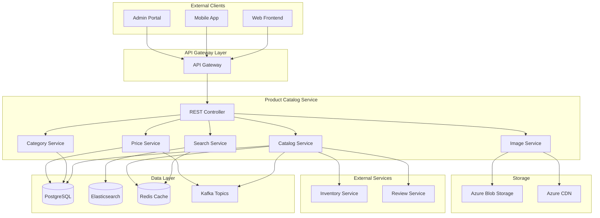

# Product Catalog Service Detailed Design Document

## Table of Contents

1. [Overview](#overview)
2. [Technical Specifications](#technical-specifications)
3. [Architecture Design](#architecture-design)
4. [API Design](#api-design)
5. [Database Design](#database-design)
6. [Search & Filtering Design](#search-and-filtering-design)
7. [Error Handling](#error-handling)
8. [Test Design](#test-design)
9. [Local Development Environment](#local-development-environment)
10. [Production Deployment](#production-deployment)
11. [Monitoring & Operations](#monitoring-and-operations)
12. [Incident Response](#incident-response)

## Overview

### Service Summary

The Product Catalog Service is a microservice responsible for managing the product catalog of the ski equipment sales shop site. It provides all product-related functions, including product information management, search, filtering, category management, and inventory integration.

### Key Responsibilities

- **Product Management**: Registration, updating, and deletion of product information
- **Category Management**: Hierarchical management of product categories and brands
- **Search Function**: High-speed product search and filtering
- **Product Details**: Management of specifications, images, and review information
- **Price Management**: Management of price history and sale prices
- **Inventory Integration**: Synchronization of inventory status with the inventory service

### Business Value

- **Improved Customer Experience**: Fast and accurate product search
- **Sales Promotion**: Effective product catalog display
- **Operational Efficiency**: Centralized management of product information
- **Data Analysis**: Foundation for product performance analysis

## Technical Specifications

### Technology Stack

| Technology Area | Technology/Library | Version | Purpose |
|---|---|---|---|
| **Runtime** | OpenJDK | 21 LTS | Java execution environment |
| **Framework** | Jakarta EE | 11 | Enterprise framework |
| **Application Server** | WildFly | 31.0.1 | Jakarta EE application server |
| **Persistence** | Jakarta Persistence (JPA) | 3.2 | ORM |
| **Data Access** | Jakarta Data | 1.0 | Repository abstraction |
| **REST API** | Jakarta REST (JAX-RS) | 4.0 | RESTful Web Services |
| **CDI** | Jakarta CDI | 4.1 | Dependency injection and management |
| **Validation** | Jakarta Validation | 3.1 | Bean Validation |
| **JSON Processing** | Jakarta JSON-P | 2.1 | JSON processing |
| **Database** | PostgreSQL | 16 | Main database |
| **Search Engine** | Elasticsearch | 8.11 | Full-text search and analysis |
| **Cache** | Redis | 7.2 | Cache |
| **Message Queue** | Apache Kafka | 3.7 | Asynchronous event processing |
| **Image Processing** | ImageIO | Built-in | Image processing |
| **Monitoring** | MicroProfile Metrics | 5.1 | Metrics collection |
| **Tracing** | MicroProfile OpenTelemetry | 2.0 | Distributed tracing |
| **Health Check** | MicroProfile Health | 4.0 | Health checks |
| **Configuration** | MicroProfile Config | 3.1 | Configuration management |

### Excluded Technologies

- **Lombok**: Not used in order to leverage Jakarta EE 11's Record classes and modern Java features.

### Java 21 LTS Features Utilized

- **Virtual Threads**: Handling a large number of concurrent search requests
- **Record Classes**: Product data transfer objects
- **Pattern Matching**: Product filtering logic
- **Text Blocks**: Definition of complex search queries
- **Sealed Classes**: Type safety for product types

## Architecture Design

### System Architecture Diagram



### Domain Model Design

```java
// Product entity (utilizing Jakarta EE 11 Records)
@Entity
@Table(name = "products")
public class Product {
    
    @Id
    @GeneratedValue(strategy = GenerationType.UUID)
    private UUID id;
    
    @Column(name = "sku", unique = true, nullable = false)
    private String sku;
    
    @Column(name = "name", nullable = false)
    private String name;
    
    @Column(name = "description", columnDefinition = "TEXT")
    private String description;
    
    @Embedded
    private ProductSpecification specification;
    
    @Embedded
    private ProductStatus status;
    
    @ManyToOne(fetch = FetchType.LAZY)
    @JoinColumn(name = "category_id")
    private Category category;
    
    @ManyToOne(fetch = FetchType.LAZY)
    @JoinColumn(name = "brand_id")
    private Brand brand;
    
    @OneToMany(mappedBy = "product", cascade = CascadeType.ALL, fetch = FetchType.LAZY)
    private List<ProductVariant> variants = new ArrayList<>();
    
    @OneToMany(mappedBy = "product", cascade = CascadeType.ALL, fetch = FetchType.LAZY)
    private List<ProductImage> images = new ArrayList<>();
    
    @OneToMany(mappedBy = "product", cascade = CascadeType.ALL, fetch = FetchType.LAZY)
    private List<ProductPrice> priceHistory = new ArrayList<>();
    
    @ElementCollection
    @CollectionTable(name = "product_tags", joinColumns = @JoinColumn(name = "product_id"))
    @Column(name = "tag")
    private Set<String> tags = new HashSet<>();
    
    @Column(name = "created_at", nullable = false)
    private LocalDateTime createdAt;
    
    @Column(name = "updated_at")
    private LocalDateTime updatedAt;
    
    @PrePersist
    void prePersist() {
        this.createdAt = LocalDateTime.now();
        this.updatedAt = LocalDateTime.now();
    }
    
    @PreUpdate
    void preUpdate() {
        this.updatedAt = LocalDateTime.now();
    }
    
    // Asynchronous method compatible with Virtual Threads
    @Asynchronous
    public CompletableFuture<InventoryStatus> getInventoryStatusAsync() {
        return CompletableFuture.supplyAsync(() -> {
            return inventoryServiceClient.getInventoryStatus(this.id);
        });
    }
}

// Record-based Value Objects
public record ProductSpecification(
    Material material,
    SkiType skiType,
    DifficultyLevel difficultyLevel,
    String length,
    String width,
    String weight,
    String radius,
    String flex,
    Map<String, String> additionalSpecs
) {
    
    public boolean isCompatibleWith(SkierProfile profile) {
        return switch (difficultyLevel) {
            case BEGINNER -> profile.level() == SkierLevel.BEGINNER || profile.level() == SkierLevel.INTERMEDIATE;
            case INTERMEDIATE -> profile.level() != SkierLevel.EXPERT;
            case ADVANCED -> profile.level() == SkierLevel.EXPERT || profile.level() == SkierLevel.ADVANCED;
            case EXPERT -> profile.level() == SkierLevel.EXPERT;
        };
    }
}

public record ProductStatus(
    PublishStatus publishStatus,
    boolean isActive,
    boolean isFeatured,
    boolean isDiscontinued,
    LocalDateTime publishedAt,
    LocalDateTime discontinuedAt
) {
    public boolean isAvailableForPurchase() {
        return publishStatus == PublishStatus.PUBLISHED 
            && isActive 
            && !isDiscontinued;
    }
}

// Sealed Classes for Type Safety
public sealed interface ProductEvent
    permits ProductCreatedEvent, ProductUpdatedEvent, ProductDiscontinuedEvent {
}

public record ProductCreatedEvent(
    UUID productId,
    String sku,
    String name,
    UUID categoryId,
    LocalDateTime createdAt
) implements ProductEvent {}

public record ProductUpdatedEvent(
    UUID productId,
    String fieldName,
    String oldValue,
    String newValue,
    LocalDateTime updatedAt
) implements ProductEvent {}

// Enums
public enum SkiType {
    ALL_MOUNTAIN("All Mountain"),
    CARVING("Carving"),
    FREESTYLE("Freestyle"),
    RACING("Racing"),
    TOURING("Touring"),
    POWDER("Powder");
    
    private final String displayName;
    
    SkiType(String displayName) {
        this.displayName = displayName;
    }
    
    public String getDisplayName() {
        return displayName;
    }
}

public enum DifficultyLevel {
    BEGINNER(1, "Beginner"),
    INTERMEDIATE(2, "Intermediate"),
    ADVANCED(3, "Advanced"),
    EXPERT(4, "Expert");
    
    private final int level;
    private final String displayName;
    
    DifficultyLevel(int level, String displayName) {
        this.level = level;
        this.displayName = displayName;
    }
    
    public boolean isHigherThan(DifficultyLevel other) {
        return this.level > other.level;
    }
}

public enum PublishStatus {
    DRAFT, REVIEW_PENDING, PUBLISHED, ARCHIVED
}
```

### Product Search Index Design

```java
// Product index for Elasticsearch
public record ProductSearchDocument(
    String id,
    String sku,
    String name,
    String description,
    CategoryInfo category,
    BrandInfo brand,
    ProductSpecificationSearchable specification,
    PriceInfo currentPrice,
    List<String> tags,
    double popularityScore,
    LocalDateTime lastUpdated
) {
    
    public static ProductSearchDocument from(Product product) {
        return new ProductSearchDocument(
            product.getId().toString(),
            product.getSku(),
            product.getName(),
            product.getDescription(),
            CategoryInfo.from(product.getCategory()),
            BrandInfo.from(product.getBrand()),
            ProductSpecificationSearchable.from(product.getSpecification()),
            PriceInfo.from(product.getCurrentPrice()),
            new ArrayList<>(product.getTags()),
            calculatePopularityScore(product),
            product.getUpdatedAt()
        );
    }
}

public record CategoryInfo(
    String id,
    String name,
    String path,
    List<String> ancestors
) {
    public static CategoryInfo from(Category category) {
        return new CategoryInfo(
            category.getId().toString(),
            category.getName(),
            category.getPath(),
            category.getAncestors().stream()
                .map(Category::getName)
                .collect(Collectors.toList())
        );
    }
}

public record ProductSpecificationSearchable(
    String material,
    String skiType,
    String difficultyLevel,
    NumericRange lengthRange,
    NumericRange widthRange,
    NumericRange weightRange
) {
    public static ProductSpecificationSearchable from(ProductSpecification spec) {
        return new ProductSpecificationSearchable(
            spec.material().toString(),
            spec.skiType().toString(),
            spec.difficultyLevel().toString(),
            parseNumericRange(spec.length()),
            parseNumericRange(spec.width()),
            parseNumericRange(spec.weight())
        );
    }
}
```

## API Design

### OpenAPI 3.1 Specification

```yaml
# product-catalog-api.yml
openapi: 3.1.0
info:
  title: Product Catalog Service API
  version: 1.0.0
  description: Ski Equipment Shop Product Catalog Service

servers:
  - url: https://api.ski-shop.com/v1
    description: Production server
  - url: https://staging.api.ski-shop.com/v1
    description: Staging server
  - url: http://localhost:8082
    description: Local development

paths:
  /products:
    get:
      summary: Get/Search Product List
      operationId: searchProducts
      tags: [Products]
      parameters:
        - name: q
          in: query
          description: Search keyword
          schema:
            type: string
            example: "carving ski"
        - name: category
          in: query
          description: Category ID
          schema:
            type: string
            format: uuid
        - name: brand
          in: query
          description: Brand ID
          schema:
            type: string
            format: uuid
        - name: skiType
          in: query
          description: Ski type
          schema:
            type: string
            enum: [ALL_MOUNTAIN, CARVING, FREESTYLE, RACING, TOURING, POWDER]
        - name: difficultyLevel
          in: query
          description: Difficulty level
          schema:
            type: string
            enum: [BEGINNER, INTERMEDIATE, ADVANCED, EXPERT]
        - name: priceMin
          in: query
          description: Minimum price
          schema:
            type: integer
            minimum: 0
        - name: priceMax
          in: query
          description: Maximum price
          schema:
            type: integer
            minimum: 0
        - name: lengthMin
          in: query
          description: Minimum length (cm)
          schema:
            type: integer
            minimum: 0
        - name: lengthMax
          in: query
          description: Maximum length (cm)
          schema:
            type: integer
            minimum: 0
        - name: inStock
          in: query
          description: In stock only
          schema:
            type: boolean
            default: false
        - name: featured
          in: query
          description: Featured products only
          schema:
            type: boolean
            default: false
        - name: sort
          in: query
          description: Sort order
          schema:
            type: string
            enum: [relevance, price_asc, price_desc, name_asc, name_desc, created_desc, popularity]
            default: relevance
        - name: page
          in: query
          description: Page number
          schema:
            type: integer
            minimum: 1
            default: 1
        - name: size
          in: query
          description: Number of items per page
          schema:
            type: integer
            minimum: 1
            maximum: 100
            default: 20
      responses:
        '200':
          description: Product search results
          content:
            application/json:
              schema:
                $ref: '#/components/schemas/ProductSearchResponse'

    post:
      summary: Register Product
      operationId: createProduct
      tags: [Products]
      security:
        - BearerAuth: []
      requestBody:
        required: true
        content:
          application/json:
            schema:
              $ref: '#/components/schemas/ProductCreateRequest'
      responses:
        '201':
          description: Product registration successful
          content:
            application/json:
              schema:
                $ref: '#/components/schemas/ProductResponse'

  /products/{productId}:
    get:
      summary: Get Product Details
      operationId: getProduct
      tags: [Products]
      parameters:
        - name: productId
          in: path
          required: true
          schema:
            type: string
            format: uuid
      responses:
        '200':
          description: Product details
          content:
            application/json:
              schema:
                $ref: '#/components/schemas/ProductDetailResponse'
        '404':
          description: Product not found

    put:
      summary: Update Product Information
      operationId: updateProduct
      tags: [Products]
      security:
        - BearerAuth: []
      parameters:
        - name: productId
          in: path
          required: true
          schema:
            type: string
            format: uuid
      requestBody:
        required: true
        content:
          application/json:
            schema:
              $ref: '#/components/schemas/ProductUpdateRequest'
      responses:
        '200':
          description: Update successful
          content:
            application/json:
              schema:
                $ref: '#/components/schemas/ProductResponse'

  /products/{productId}/variants:
    get:
      summary: Get Product Variation List
      operationId: getProductVariants
      tags: [Products]
      parameters:
        - name: productId
          in: path
          required: true
          schema:
            type: string
            format: uuid
      responses:
        '200':
          description: Variation list
          content:
            application/json:
              schema:
                type: array
                items:
                  $ref: '#/components/schemas/ProductVariantResponse'

  /categories:
    get:
      summary: Get Category Hierarchy
      operationId: getCategories
      tags: [Categories]
      parameters:
        - name: parentId
          in: query
          description: Parent category ID
          schema:
            type: string
            format: uuid
        - name: depth
          in: query
          description: Depth of hierarchy to retrieve
          schema:
            type: integer
            minimum: 1
            maximum: 5
            default: 3
      responses:
        '200':
          description: Category hierarchy
          content:
            application/json:
              schema:
                type: array
                items:
                  $ref: '#/components/schemas/CategoryResponse'

  /brands:
    get:
      summary: Get Brand List
      operationId: getBrands
      tags: [Brands]
      parameters:
        - name: featured
          in: query
          description: Featured brands only
          schema:
            type: boolean
            default: false
      responses:
        '200':
          description: Brand list
          content:
            application/json:
              schema:
                type: array
                items:
                  $ref: '#/components/schemas/BrandResponse'

components:
  schemas:
    ProductSearchResponse:
      type: object
      properties:
        products:
          type: array
          items:
            $ref: '#/components/schemas/ProductSummaryResponse'
        pagination:
          $ref: '#/components/schemas/PaginationInfo'
        facets:
          $ref: '#/components/schemas/SearchFacets'
        total:
          type: integer
          example: 1250

    ProductSummaryResponse:
      type: object
      properties:
        id:
          type: string
          format: uuid
        sku:
          type: string
          example: "SKI-CARV-001"
        name:
          type: string
          example: "Pro Carving Ski 165cm"
        description:
          type: string
          example: "Carving ski for beginner to intermediate skiers"
        category:
          $ref: '#/components/schemas/CategorySummaryResponse'
        brand:
          $ref: '#/components/schemas/BrandSummaryResponse'
        currentPrice:
          $ref: '#/components/schemas/PriceResponse'
        primaryImage:
          $ref: '#/components/schemas/ImageResponse'
        specification:
          $ref: '#/components/schemas/SpecificationSummaryResponse'
        rating:
          type: number
          format: float
          minimum: 0
          maximum: 5
          example: 4.2
        reviewCount:
          type: integer
          example: 125
        inStock:
          type: boolean
        featured:
          type: boolean

    ProductCreateRequest:
      type: object
      required:
        - sku
        - name
        - categoryId
        - brandId
        - specification
      properties:
        sku:
          type: string
          pattern: '^[A-Z0-9-]+$'
          example: "SKI-CARV-001"
        name:
          type: string
          maxLength: 255
          example: "Pro Carving Ski 165cm"
        description:
          type: string
          maxLength: 2000
          example: "Carving ski for beginner to intermediate skiers"
        categoryId:
          type: string
          format: uuid
        brandId:
          type: string
          format: uuid
        specification:
          $ref: '#/components/schemas/SpecificationRequest'
        tags:
          type: array
          items:
            type: string
          maxItems: 20
        status:
          $ref: '#/components/schemas/ProductStatusRequest'

    SpecificationRequest:
      type: object
      required:
        - material
        - skiType
        - difficultyLevel
        - length
        - width
      properties:
        material:
          type: string
          enum: [WOOD, COMPOSITE, CARBON, TITANIUM]
        skiType:
          type: string
          enum: [ALL_MOUNTAIN, CARVING, FREESTYLE, RACING, TOURING, POWDER]
        difficultyLevel:
          type: string
          enum: [BEGINNER, INTERMEDIATE, ADVANCED, EXPERT]
        length:
          type: string
          pattern: '^\d+cm$'
          example: "165cm"
        width:
          type: string
          pattern: '^\d+mm$'
          example: "75mm"
        weight:
          type: string
          pattern: '^\d+(\.\d+)?kg$'
          example: "2.8kg"
        radius:
          type: string
          pattern: '^\d+m$'
          example: "14m"
        flex:
          type: string
          enum: [SOFT, MEDIUM, HARD]

  securitySchemes:
    BearerAuth:
      type: http
      scheme: bearer
      bearerFormat: JWT
```

## Database Design

### ERD (Entity Relationship Diagram)

```mermaid
erDiagram
    PRODUCTS {
        UUID id PK
        VARCHAR sku UK
        VARCHAR name
        TEXT description
        UUID category_id FK
        UUID brand_id FK
        VARCHAR material
        VARCHAR ski_type
        VARCHAR difficulty_level
        VARCHAR length
        VARCHAR width
        VARCHAR weight
        VARCHAR radius
        VARCHAR flex
        VARCHAR publish_status
        BOOLEAN is_active
        BOOLEAN is_featured
        BOOLEAN is_discontinued
        TIMESTAMP published_at
        TIMESTAMP discontinued_at
        TIMESTAMP created_at
        TIMESTAMP updated_at
    }
    
    CATEGORIES {
        UUID id PK
        VARCHAR name
        TEXT description
        UUID parent_id FK
        VARCHAR path
        INTEGER level
        INTEGER sort_order
        BOOLEAN is_active
        TIMESTAMP created_at
        TIMESTAMP updated_at
    }
    
    BRANDS {
        UUID id PK
        VARCHAR name
        TEXT description
        VARCHAR country
        VARCHAR logo_url
        BOOLEAN is_featured
        BOOLEAN is_active
        TIMESTAMP created_at
        TIMESTAMP updated_at
    }
    
    PRODUCT_VARIANTS {
        UUID id PK
        UUID product_id FK
        VARCHAR variant_type
        VARCHAR variant_value
        VARCHAR sku
        DECIMAL additional_price
        BOOLEAN is_default
        TIMESTAMP created_at
        TIMESTAMP updated_at
    }
    
    PRODUCT_IMAGES {
        UUID id PK
        UUID product_id FK
        VARCHAR image_url
        VARCHAR alt_text
        VARCHAR image_type
        INTEGER sort_order
        BOOLEAN is_primary
        TIMESTAMP created_at
        TIMESTAMP updated_at
    }
    
    PRODUCT_PRICES {
        UUID id PK
        UUID product_id FK
        DECIMAL base_price
        DECIMAL sale_price
        DECIMAL cost_price
        TIMESTAMP effective_from
        TIMESTAMP effective_to
        BOOLEAN is_current
        TIMESTAMP created_at
    }
    
    PRODUCT_TAGS {
        UUID product_id FK
        VARCHAR tag
    }
    
    PRODUCT_REVIEWS_SUMMARY {
        UUID product_id PK FK
        DECIMAL average_rating
        INTEGER review_count
        INTEGER five_star_count
        INTEGER four_star_count
        INTEGER three_star_count
        INTEGER two_star_count
        INTEGER one_star_count
        TIMESTAMP last_updated
    }
    
    PRODUCTS ||--o{ PRODUCT_VARIANTS : "has"
    PRODUCTS ||--o{ PRODUCT_IMAGES : "has"
    PRODUCTS ||--o{ PRODUCT_PRICES : "has"
    PRODUCTS ||--o{ PRODUCT_TAGS : "has"
    PRODUCTS ||--|| PRODUCT_REVIEWS_SUMMARY : "summarizes"
    CATEGORIES ||--o{ CATEGORIES : "parent"
    CATEGORIES ||--o{ PRODUCTS : "categorizes"
    BRANDS ||--o{ PRODUCTS : "manufactures"
```

### Repository Design (Utilizing Jakarta Data)

```java
// Product Repository
@Repository
public interface ProductRepository extends BasicRepository<Product, UUID> {
    
    @Query("SELECT p FROM Product p WHERE p.sku = :sku")
    Optional<Product> findBySku(String sku);
    
    @Query("""
        SELECT p FROM Product p 
        WHERE p.category.id = :categoryId 
        AND p.status.publishStatus = 'PUBLISHED' 
        AND p.status.isActive = true
        ORDER BY p.createdAt DESC
        """)
    List<Product> findByCategoryAndPublished(UUID categoryId);
    
    @Query("""
        SELECT p FROM Product p 
        WHERE p.brand.id = :brandId 
        AND p.status.publishStatus = 'PUBLISHED' 
        AND p.status.isActive = true
        """)
    List<Product> findByBrandAndPublished(UUID brandId);
    
    @Query("""
        SELECT p FROM Product p 
        WHERE p.status.isFeatured = true 
        AND p.status.publishStatus = 'PUBLISHED' 
        AND p.status.isActive = true
        ORDER BY p.createdAt DESC
        """)
    @Limit(20)
    List<Product> findFeaturedProducts();
    
    @Query("""
        SELECT p FROM Product p 
        WHERE p.specification.skiType = :skiType 
        AND p.specification.difficultyLevel = :difficultyLevel
        AND p.status.publishStatus = 'PUBLISHED'
        """)
    List<Product> findBySkiTypeAndDifficulty(SkiType skiType, DifficultyLevel difficultyLevel);
}

// Category Repository
@Repository
public interface CategoryRepository extends BasicRepository<Category, UUID> {
    
    @Query("SELECT c FROM Category c WHERE c.parent IS NULL ORDER BY c.sortOrder")
    List<Category> findRootCategories();
    
    @Query("""
        SELECT c FROM Category c 
        WHERE c.parent.id = :parentId 
        AND c.isActive = true 
        ORDER BY c.sortOrder
        """)
    List<Category> findByParentId(UUID parentId);
    
    @Query("""
        SELECT c FROM Category c 
        WHERE c.path LIKE :pathPrefix% 
        AND c.isActive = true 
        ORDER BY c.level, c.sortOrder
        """)
    List<Category> findByPathPrefix(String pathPrefix);
    
    @Query("SELECT c FROM Category c WHERE c.level <= :maxLevel ORDER BY c.path")
    List<Category> findByMaxLevel(Integer maxLevel);
}
```

## Search and Filtering Design

### Elasticsearch Configuration

```java
// Product Service (CQRS Pattern compliant)
@ApplicationScoped
@Transactional
public class ProductService {
    
    private static final Logger logger = LoggerFactory.getLogger(ProductService.class);
    
    @Inject
    private ProductRepository productRepository;
    
    @Inject
    private CategoryRepository categoryRepository;
    
    @Inject
    private ProductEventPublisher eventPublisher;
    
    @Inject
    private ProductSearchIndexer searchIndexer;
    
    @Inject
    private ProductProcessingSaga productProcessingSaga;
    
    @Inject
    private ProductValidator productValidator;
    
    // CQRS Command Handlers
    @CommandHandler
    public ProductResult handle(CreateProductCommand command) {
        try {
            // Validate product data
            var validationResult = productValidator.validate(command.toRequest());
            if (!validationResult.isValid()) {
                return new ProductResult(false, null, validationResult.getErrorMessage());
            }
            
            // Check if category exists
            var category = categoryRepository.findById(command.categoryId())
                .orElseThrow(() -> new CategoryNotFoundException("Category not found: " + command.categoryId()));
            
            // Create product
            var product = new Product();
            product.setSku(command.sku());
            product.setName(command.name());
            product.setDescription(command.description());
            product.setShortDescription(command.shortDescription());
            product.setCategory(category);
            product.setBrand(command.brand());
            product.setPrice(command.price());
            product.setCostPrice(command.costPrice());
            product.setStatus(ProductStatus.ACTIVE);
            product.setCreatedAt(LocalDateTime.now());
            
            var savedProduct = productRepository.save(product);
            
            // Publish event
            eventPublisher.publish(new ProductCreatedEvent(
                savedProduct.getId(),
                savedProduct.getSku(),
                savedProduct.getName(),
                savedProduct.getPrice(),
                savedProduct.getCategory().getId(),
                LocalDateTime.now()
            ));
            
            logger.info("Product created: sku={}, name={}", savedProduct.getSku(), savedProduct.getName());
            return new ProductResult(true, savedProduct.getId(), "Product creation complete");
            
        } catch (Exception e) {
            logger.error("Product creation error: sku=" + command.sku(), e);
            return new ProductResult(false, null, e.getMessage());
        }
    }
    
    @CommandHandler
    public ProductResult handle(UpdateProductCommand command) {
        try {
            var product = productRepository.findById(command.productId())
                .orElseThrow(() -> new ProductNotFoundException("Product not found: " + command.productId()));
            
            var oldPrice = product.getPrice();
            
            // Update product
            product.setName(command.name());
            product.setDescription(command.description());
            product.setShortDescription(command.shortDescription());
            product.setPrice(command.price());
            product.setCostPrice(command.costPrice());
            product.setBrand(command.brand());
            product.setUpdatedAt(LocalDateTime.now());
            
            var savedProduct = productRepository.save(product);
            
            // Publish a special event if the price changed
            if (oldPrice.compareTo(command.price()) != 0) {
                eventPublisher.publish(new ProductPriceChangedEvent(
                    savedProduct.getSku(),
                    oldPrice,
                    command.price(),
                    LocalDateTime.now()
                ));
            }
            
            eventPublisher.publish(new ProductUpdatedEvent(
                savedProduct.getId(),
                savedProduct.getSku(),
                savedProduct.getName(),
                savedProduct.getPrice(),
                LocalDateTime.now()
            ));
            
            logger.info("Product updated: sku={}, name={}", savedProduct.getSku(), savedProduct.getName());
            return new ProductResult(true, savedProduct.getId(), "Product update complete");
            
        } catch (Exception e) {
            logger.error("Product update error: productId=" + command.productId(), e);
            return new ProductResult(false, null, e.getMessage());
        }
    }
    
    @CommandHandler
    public ProductResult handle(DeactivateProductCommand command) {
        try {
            var product = productRepository.findById(command.productId())
                .orElseThrow(() -> new ProductNotFoundException("Product not found: " + command.productId()));
            
            product.setStatus(ProductStatus.INACTIVE);
            product.setUpdatedAt(LocalDateTime.now());
            
            var savedProduct = productRepository.save(product);
            
            eventPublisher.publish(new ProductDeactivatedEvent(
                savedProduct.getId(),
                savedProduct.getSku(),
                command.reason(),
                LocalDateTime.now()
            ));
            
            logger.info("Product deactivated: sku={}, reason={}", savedProduct.getSku(), command.reason());
            return new ProductResult(true, savedProduct.getId(), "Product deactivation complete");
            
        } catch (Exception e) {
            logger.error("Product deactivation error: productId=" + command.productId(), e);
            return new ProductResult(false, null, e.getMessage());
        }
    }
    
    @CommandHandler
    public ProductResult handle(UpdateProductInventoryCommand command) {
        try {
            var product = productRepository.findBySku(command.sku())
                .orElseThrow(() -> new ProductNotFoundException("Product not found: " + command.sku()));
            
            // Process inventory information update with Saga
            CompletableFuture.runAsync(() -> {
                try {
                    productProcessingSaga.processInventoryUpdate(
                        product.getId(),
                        command.sku(),
                        command.availableQuantity(),
                        command.reservedQuantity()
                    );
                } catch (Exception e) {
                    logger.error("Inventory update Saga execution error: sku=" + command.sku(), e);
                }
            }, VirtualThread.ofVirtual().factory());
            
            return new ProductResult(true, product.getId(), "Inventory update process started");
            
        } catch (Exception e) {
            logger.error("Inventory update error: sku=" + command.sku(), e);
            return new ProductResult(false, null, e.getMessage());
        }
    }
    
    // CQRS Query Handlers
    @QueryHandler
    public ProductProjection handle(GetProductByIdQuery query) {
        var product = productRepository.findById(query.productId());
        return product.map(ProductProjection::from)
            .orElse(null);
    }
    
    @QueryHandler
    public ProductProjection handle(GetProductBySkuQuery query) {
        var product = productRepository.findBySku(query.sku());
        return product.map(ProductProjection::from)
            .orElse(null);
    }
    
    @QueryHandler
    public List<ProductProjection> handle(SearchProductsQuery query) {
        return productRepository.searchProducts(
                query.searchCriteria(), query.page(), query.size())
            .stream()
            .map(ProductProjection::from)
            .toList();
    }
    
    @QueryHandler
    public List<ProductProjection> handle(GetProductsByCategoryQuery query) {
        return productRepository.findByCategoryId(query.categoryId(), query.page(), query.size())
            .stream()
            .map(ProductProjection::from)
            .toList();
    }
    
    @QueryHandler
    public ProductStatisticsProjection handle(GetProductStatisticsQuery query) {
        var totalProducts = productRepository.countByDateRange(query.fromDate(), query.toDate());
        var activeProducts = productRepository.countActiveProducts();
        var inactiveProducts = productRepository.countInactiveProducts();
        var averagePrice = productRepository.getAveragePrice();
        
        return new ProductStatisticsProjection(
            totalProducts,
            activeProducts,
            inactiveProducts,
            averagePrice,
            LocalDateTime.now()
        );
    }
    
    // Event Handlers
    @EventHandler
    public void handle(InventoryChangedEvent event) {
        logger.info("Starting inventory change event processing: sku={}", event.sku());
        
        CompletableFuture.runAsync(() -> {
            try {
                productProcessingSaga.processExternalInventoryChange(
                    event.sku(),
                    event.availableQuantity(),
                    event.reservedQuantity()
                );
            } catch (Exception e) {
                logger.error("Inventory change processing error: sku=" + event.sku(), e);
            }
        }, VirtualThread.ofVirtual().factory());
    }
    
    @EventHandler
    public void handle(OrderCreatedEvent event) {
        logger.info("Starting order creation event processing: orderId={}", event.orderId());
        
        CompletableFuture.runAsync(() -> {
            try {
                productProcessingSaga.processOrderProductsUpdate(
                    event.orderId(),
                    event.orderItems()
                );
            } catch (Exception e) {
                logger.error("Order product update processing error: orderId=" + event.orderId(), e);
            }
        }, VirtualThread.ofVirtual().factory());
    }
    
    // Helper methods
    private Product findProductById(UUID productId) {
        return productRepository.findById(productId)
            .orElseThrow(() -> new ProductNotFoundException("Product not found: " + productId));
    }
    
    private Product findProductBySku(String sku) {
        return productRepository.findBySku(sku)
            .orElseThrow(() -> new ProductNotFoundException("Product not found: " + sku));
    }
}

// Product Processing Saga Pattern
@ApplicationScoped
@Transactional
public class ProductProcessingSaga {
    
    private static final Logger logger = LoggerFactory.getLogger(ProductProcessingSaga.class);
    
    @Inject
    private ProductRepository productRepository;
    
    @Inject
    private SagaStateRepository sagaStateRepository;
    
    @Inject
    private ProductEventPublisher eventPublisher;
    
    @Inject
    private ProductSearchIndexer searchIndexer;
    
    @Inject
    private InventoryServiceClient inventoryServiceClient;
    
    public CompletableFuture<SagaResult> processInventoryUpdate(
            UUID productId, String sku, Integer availableQuantity, Integer reservedQuantity) {
        
        return CompletableFuture.supplyAsync(() -> {
            var sagaId = UUID.randomUUID();
            var sagaState = new SagaState(sagaId, productId, SagaType.PRODUCT_INVENTORY_UPDATE);
            sagaStateRepository.save(sagaState);
            
            try {
                logger.info("Starting product inventory update Saga: sagaId={}, sku={}", sagaId, sku);
                
                // Step 1: Validate product
                sagaState.setCurrentStep("VALIDATING_PRODUCT");
                var product = productRepository.findById(productId)
                    .orElseThrow(() -> new ProductNotFoundException("Product not found"));
                sagaState.setLastCompletedStep("VALIDATING_PRODUCT");
                
                // Step 2: Update inventory service
                sagaState.setCurrentStep("UPDATING_INVENTORY");
                var inventoryResult = inventoryServiceClient.updateInventory(sku, availableQuantity, reservedQuantity);
                if (!inventoryResult.success()) {
                    return handleSagaFailure(sagaState, "Inventory update failed", inventoryResult.message());
                }
                sagaState.setLastCompletedStep("UPDATING_INVENTORY");
                
                // Step 3: Update search index
                sagaState.setCurrentStep("UPDATING_SEARCH_INDEX");
                searchIndexer.updateProductInventory(sku, availableQuantity);
                sagaState.setLastCompletedStep("UPDATING_SEARCH_INDEX");
                
                // Step 4: Publish inventory update event
                sagaState.setCurrentStep("PUBLISHING_EVENTS");
                eventPublisher.publish(new ProductInventoryUpdatedEvent(
                    productId,
                    sku,
                    availableQuantity,
                    reservedQuantity,
                    LocalDateTime.now()
                ));
                sagaState.setLastCompletedStep("PUBLISHING_EVENTS");
                
                // Saga complete
                sagaState.complete();
                sagaStateRepository.save(sagaState);
                
                logger.info("Product inventory update Saga complete: sagaId={}, sku={}", sagaId, sku);
                return new SagaResult(true, "Inventory update complete");
                
            } catch (Exception e) {
                logger.error("Product inventory update Saga execution error: sagaId=" + sagaId, e);
                return handleSagaFailure(sagaState, "Unexpected error", e.getMessage());
            }
        }, VirtualThread.ofVirtual().factory());
    }
    
    public CompletableFuture<SagaResult> processExternalInventoryChange(
            String sku, Integer availableQuantity, Integer reservedQuantity) {
        
        return CompletableFuture.supplyAsync(() -> {
            var sagaId = UUID.randomUUID();
            var sagaState = new SagaState(sagaId, null, SagaType.EXTERNAL_INVENTORY_SYNC);
            sagaStateRepository.save(sagaState);
            
            try {
                logger.info("Starting external inventory sync Saga: sagaId={}, sku={}", sagaId, sku);
                
                // Step 1: Find product
                sagaState.setCurrentStep("FINDING_PRODUCT");
                var product = productRepository.findBySku(sku);
                if (product.isEmpty()) {
                    logger.warn("Product not found: sku={}", sku);
                    sagaState.complete();
                    sagaStateRepository.save(sagaState);
                    return new SagaResult(true, "Product not found - processing complete");
                }
                sagaState.setLastCompletedStep("FINDING_PRODUCT");
                
                // Step 2: Update search index
                sagaState.setCurrentStep("UPDATING_SEARCH_INDEX");
                searchIndexer.updateProductInventory(sku, availableQuantity);
                sagaState.setLastCompletedStep("UPDATING_SEARCH_INDEX");
                
                // Step 3: Publish product availability event
                sagaState.setCurrentStep("PUBLISHING_EVENTS");
                if (availableQuantity == 0) {
                    eventPublisher.publish(new ProductOutOfStockEvent(
                        product.get().getId(),
                        sku,
                        LocalDateTime.now()
                    ));
                } else {
                    eventPublisher.publish(new ProductBackInStockEvent(
                        product.get().getId(),
                        sku,
                        availableQuantity,
                        LocalDateTime.now()
                    ));
                }
                sagaState.setLastCompletedStep("PUBLISHING_EVENTS");
                
                // Saga complete
                sagaState.complete();
                sagaStateRepository.save(sagaState);
                
                logger.info("External inventory sync Saga complete: sagaId={}, sku={}", sagaId, sku);
                return new SagaResult(true, "Inventory sync complete");
                
            } catch (Exception e) {
                logger.error("External inventory sync Saga execution error: sagaId=" + sagaId, e);
                return handleSagaFailure(sagaState, "Unexpected error", e.getMessage());
            }
        }, VirtualThread.ofVirtual().factory());
    }
    
    public CompletableFuture<SagaResult> processOrderProductsUpdate(
            UUID orderId, List<OrderItemDto> orderItems) {
        
        return CompletableFuture.supplyAsync(() -> {
            var sagaId = UUID.randomUUID();
            var sagaState = new SagaState(sagaId, orderId, SagaType.ORDER_PRODUCTS_UPDATE);
            sagaStateRepository.save(sagaState);
            
            try {
                logger.info("Starting order product update Saga: sagaId={}, orderId={}", sagaId, orderId);
                
                // Step 1: Update product popularity
                sagaState.setCurrentStep("UPDATING_POPULARITY");
                updateProductPopularity(orderItems);
                sagaState.setLastCompletedStep("UPDATING_POPULARITY");
                
                // Step 2: Update search index
                sagaState.setCurrentStep("UPDATING_SEARCH_INDEX");
                for (var item : orderItems) {
                    searchIndexer.updateProductPopularity(item.sku());
                }
                sagaState.setLastCompletedStep("UPDATING_SEARCH_INDEX");
                
                // Step 3: Publish product sold event
                sagaState.setCurrentStep("PUBLISHING_EVENTS");
                for (var item : orderItems) {
                    eventPublisher.publish(new ProductSoldEvent(
                        item.productId(),
                        item.sku(),
                        item.quantity(),
                        orderId,
                        LocalDateTime.now()
                    ));
                }
                sagaState.setLastCompletedStep("PUBLISHING_EVENTS");
                
                // Saga complete
                sagaState.complete();
                sagaStateRepository.save(sagaState);
                
                logger.info("Order product update Saga complete: sagaId={}, orderId={}", sagaId, orderId);
                return new SagaResult(true, "Product update complete");
                
            } catch (Exception e) {
                logger.error("Order product update Saga execution error: sagaId=" + sagaId, e);
                return handleSagaFailure(sagaState, "Unexpected error", e.getMessage());
            }
        }, VirtualThread.ofVirtual().factory());
    }
    
    private void updateProductPopularity(List<OrderItemDto> orderItems) {
        for (var item : orderItems) {
            var product = productRepository.findBySku(item.sku());
            if (product.isPresent()) {
                var p = product.get();
                p.incrementSalesCount(item.quantity());
                p.setUpdatedAt(LocalDateTime.now());
                productRepository.save(p);
            }
        }
    }
    
    private SagaResult handleSagaFailure(SagaState sagaState, String reason, String message) {
        sagaState.fail(reason + ": " + message);
        sagaStateRepository.save(sagaState);
        return new SagaResult(false, reason + ": " + message);
    }
}

// Product Search Service
@ApplicationScoped
public class ProductSearchService {
    
    @Inject
    private ElasticsearchClient elasticsearchClient;
    
    @Inject
    private ProductSearchIndexer indexer;
    
    public ProductSearchResult searchProducts(ProductSearchQuery query) {
        var searchRequest = buildSearchRequest(query);
        
        try {
            var response = elasticsearchClient.search(searchRequest, ProductSearchDocument.class);
            return transformSearchResponse(response, query);
            
        } catch (Exception e) {
            logger.error("Product search failed", e);
            throw new ProductSearchException("Product search failed", e);
        }
    }
    
    private SearchRequest buildSearchRequest(ProductSearchQuery query) {
        var builder = SearchRequest.of(s -> s
            .index("products")
            .query(buildQuery(query))
            .aggregations(buildAggregations(query))
            .sort(buildSort(query))
            .from(query.getOffset())
            .size(query.getSize())
        );
        
        return builder;
    }
    
    private Query buildQuery(ProductSearchQuery query) {
        var boolQuery = BoolQuery.of(b -> {
            // Basic conditions
            b.filter(f -> f.term(t -> t.field("status.publishStatus").value("PUBLISHED")));
            b.filter(f -> f.term(t -> t.field("status.isActive").value(true)));
            
            // Keyword search
            if (query.getKeyword() != null && !query.getKeyword().isBlank()) {
                b.must(m -> m.multiMatch(mm -> mm
                    .query(query.getKeyword())
                    .fields("name^3", "description^2", "tags^1.5", "brand.name^2")
                    .type(TextQueryType.BestFields)
                    .fuzziness("AUTO")
                ));
            }
            
            // Category filter
            if (query.getCategoryId() != null) {
                b.filter(f -> f.term(t -> t.field("category.id").value(query.getCategoryId())));
            }
            
            // Brand filter
            if (query.getBrandId() != null) {
                b.filter(f -> f.term(t -> t.field("brand.id").value(query.getBrandId())));
            }
            
            // Ski type filter
            if (query.getSkiType() != null) {
                b.filter(f -> f.term(t -> t.field("specification.skiType").value(query.getSkiType())));
            }
            
            // Price range filter
            if (query.getPriceMin() != null || query.getPriceMax() != null) {
                b.filter(f -> f.range(r -> {
                    var rangeBuilder = r.field("currentPrice.amount");
                    if (query.getPriceMin() != null) {
                        rangeBuilder.gte(JsonData.of(query.getPriceMin()));
                    }
                    if (query.getPriceMax() != null) {
                        rangeBuilder.lte(JsonData.of(query.getPriceMax()));
                    }
                    return rangeBuilder;
                }));
            }
            
            // Stock filter
            if (query.isInStockOnly()) {
                b.filter(f -> f.term(t -> t.field("inStock").value(true)));
            }
            
            return b;
        });
        
        return Query.of(q -> q.bool(boolQuery));
    }
    
    private Map<String, Aggregation> buildAggregations(ProductSearchQuery query) {
        return Map.of(
            "categories", Aggregation.of(a -> a
                .terms(t -> t.field("category.name").size(20))
            ),
            "brands", Aggregation.of(a -> a
                .terms(t -> t.field("brand.name").size(20))
            ),
            "skiTypes", Aggregation.of(a -> a
                .terms(t -> t.field("specification.skiType").size(10))
            ),
            "difficultyLevels", Aggregation.of(a -> a
                .terms(t -> t.field("specification.difficultyLevel").size(5))
            ),
            "priceRanges", Aggregation.of(a -> a
                .range(r -> r
                    .field("currentPrice.amount")
                    .ranges(
                        Range.of(ra -> ra.to(JsonData.of(50000))),
                        Range.of(ra -> ra.from(JsonData.of(50000)).to(JsonData.of(100000))),
                        Range.of(ra -> ra.from(JsonData.of(100000)).to(JsonData.of(200000))),
                        Range.of(ra -> ra.from(JsonData.of(200000)))
                    )
                )
            )
        );
    }
}

// Search Query Record
public record ProductSearchQuery(
    String keyword,
    UUID categoryId,
    UUID brandId,
    SkiType skiType,
    DifficultyLevel difficultyLevel,
    BigDecimal priceMin,
    BigDecimal priceMax,
    Integer lengthMin,
    Integer lengthMax,
    boolean inStockOnly,
    boolean featuredOnly,
    ProductSearchSort sort,
    int page,
    int size
) {
    public int getOffset() {
        return (page - 1) * size;
    }
    
    public int getSize() {
        return Math.min(size, 100); // Max 100 items
    }
}

public enum ProductSearchSort {
    RELEVANCE("_score", SortOrder.Desc),
    PRICE_ASC("currentPrice.amount", SortOrder.Asc),
    PRICE_DESC("currentPrice.amount", SortOrder.Desc),
    NAME_ASC("name.keyword", SortOrder.Asc),
    NAME_DESC("name.keyword", SortOrder.Desc),
    CREATED_DESC("createdAt", SortOrder.Desc),
    POPULARITY("popularityScore", SortOrder.Desc);
    
    private final String field;
    private final SortOrder order;
    
    ProductSearchSort(String field, SortOrder order) {
        this.field = field;
        this.order = order;
    }
}
```

### Search Index Management

```java
// Search Index Management Service
@ApplicationScoped
public class ProductSearchIndexer {
    
    @Inject
    private ElasticsearchClient elasticsearchClient;
    
    @Inject
    private ProductRepository productRepository;
    
    @EventObserver
    public void onProductCreated(@Observes ProductCreatedEvent event) {
        indexProductAsync(event.productId());
    }
    
    @EventObserver
    public void onProductUpdated(@Observes ProductUpdatedEvent event) {
        indexProductAsync(event.productId());
    }
    
    @Asynchronous
    private CompletableFuture<Void> indexProductAsync(UUID productId) {
        return CompletableFuture.runAsync(() -> {
            try {
                var product = productRepository.findById(productId);
                if (product.isPresent()) {
                    var document = ProductSearchDocument.from(product.get());
                    indexDocument(document);
                }
            } catch (Exception e) {
                logger.error("Failed to index product: " + productId, e);
            }
        });
    }
    
    public void indexDocument(ProductSearchDocument document) {
        try {
            var request = IndexRequest.of(i -> i
                .index("products")
                .id(document.id())
                .document(document)
            );
            
            elasticsearchClient.index(request);
            
        } catch (Exception e) {
            throw new ProductIndexingException("Failed to update product index", e);
        }
    }
    
    @Schedule(every = "PT1H") // Every 1 hour
    public void reindexModifiedProducts() {
        var lastHour = LocalDateTime.now().minusHours(1);
        var modifiedProducts = productRepository.findModifiedSince(lastHour);
        
        modifiedProducts.forEach(product -> {
            var document = ProductSearchDocument.from(product);
            indexDocument(document);
        });
        
        logger.info("Reindexed {} modified products", modifiedProducts.size());
    }
}
```

## Error Handling

### Product Management Exception Design

```java
// Base exception class
public abstract class ProductCatalogException extends RuntimeException {
    protected final String errorCode;
    protected final int httpStatus;
    protected final Map<String, Object> details;
    
    protected ProductCatalogException(String errorCode, String message, int httpStatus) {
        super(message);
        this.errorCode = errorCode;
        this.httpStatus = httpStatus;
        this.details = new HashMap<>();
    }
    
    public ProductCatalogException withDetail(String key, Object value) {
        this.details.put(key, value);
        return this;
    }
    
    // Getters
    public String getErrorCode() { return errorCode; }
    public int getHttpStatus() { return httpStatus; }
    public Map<String, Object> getDetails() { return details; }
}

// Specific exception classes
public class ProductNotFoundException extends ProductCatalogException {
    public ProductNotFoundException(UUID productId) {
        super("PRODUCT_NOT_FOUND", 
              "The specified product was not found", 404);
        withDetail("productId", productId);
    }
    
    public ProductNotFoundException(String sku) {
        super("PRODUCT_NOT_FOUND", 
              "The product with the specified SKU was not found", 404);
        withDetail("sku", sku);
    }
}

public class DuplicateSkuException extends ProductCatalogException {
    public DuplicateSkuException(String sku) {
        super("DUPLICATE_SKU", 
              "The specified SKU is already in use", 409);
        withDetail("sku", sku);
    }
}

public class InvalidProductSpecificationException extends ProductCatalogException {
    public InvalidProductSpecificationException(String field, String value, String reason) {
        super("INVALID_SPECIFICATION", 
              "The product specification is incorrect", 400);
        withDetail("field", field);
        withDetail("value", value);
        withDetail("reason", reason);
    }
}

public class CategoryNotFoundException extends ProductCatalogException {
    public CategoryNotFoundException(UUID categoryId) {
        super("CATEGORY_NOT_FOUND", 
              "The specified category was not found", 404);
        withDetail("categoryId", categoryId);
    }
}

public class ProductSearchException extends ProductCatalogException {
    public ProductSearchException(String message, Throwable cause) {
        super("SEARCH_ERROR", 
              "An error occurred during product search", 500);
        initCause(cause);
    }
}

// Global exception handler
@Provider
public class ProductCatalogExceptionMapper implements ExceptionMapper<Exception> {
    
    private static final Logger logger = LoggerFactory.getLogger(ProductCatalogExceptionMapper.class);
    
    @Override
    public Response toResponse(Exception exception) {
        String requestId = MDC.get("requestId");
        
        return switch (exception) {
            case ProductCatalogException pce -> {
                logger.warn("Product catalog error: {} - {}", pce.getErrorCode(), pce.getMessage());
                yield Response.status(pce.getHttpStatus())
                    .entity(createErrorResponse(pce, requestId))
                    .type(MediaType.APPLICATION_JSON)
                    .build();
            }
            
            case ConstraintViolationException cve -> {
                logger.warn("Validation error: {}", cve.getMessage());
                yield Response.status(400)
                    .entity(createValidationErrorResponse(cve, requestId))
                    .type(MediaType.APPLICATION_JSON)
                    .build();
            }
            
            default -> {
                logger.error("Unexpected error: {}", exception.getMessage(), exception);
                yield Response.status(500)
                    .entity(createInternalErrorResponse(requestId))
                    .type(MediaType.APPLICATION_JSON)
                    .build();
            }
        };
    }
}
```

## Test Design

### Unit Tests

```java
// ProductService Test
@ExtendWith(MockitoExtension.class)
class ProductServiceTest {
    
    @InjectMocks
    private ProductService productService;
    
    @Mock
    private ProductRepository productRepository;
    
    @Mock
    private CategoryRepository categoryRepository;
    
    @Mock
    private BrandRepository brandRepository;
    
    @Mock
    private ProductEventPublisher eventPublisher;
    
    @Test
    @DisplayName("Product is created successfully with valid data")
    void shouldCreateProduct_WhenValidData() {
        // Given
        var categoryId = UUID.randomUUID();
        var brandId = UUID.randomUUID();
        
        var category = new Category();
        category.setId(categoryId);
        category.setName("Ski");
        
        var brand = new Brand();
        brand.setId(brandId);
        brand.setName("TestBrand");
        
        var request = new ProductCreateRequest(
            "SKI-TEST-001",
            "Test Ski",
            "This is a test ski",
            categoryId,
            brandId,
            new ProductSpecification(
                Material.COMPOSITE,
                SkiType.CARVING,
                DifficultyLevel.INTERMEDIATE,
                "165cm",
                "75mm",
                "2.8kg",
                "14m",
                "MEDIUM",
                Map.of()
            ),
            Set.of("Test", "Carving"),
            new ProductStatus(
                PublishStatus.DRAFT,
                true,
                false,
                false,
                null,
                null
            )
        );
        
        when(productRepository.findBySku(request.sku())).thenReturn(Optional.empty());
        when(categoryRepository.findById(categoryId)).thenReturn(Optional.of(category));
        when(brandRepository.findById(brandId)).thenReturn(Optional.of(brand));
        when(productRepository.save(any(Product.class))).thenAnswer(invocation -> {
            var product = (Product) invocation.getArgument(0);
            product.setId(UUID.randomUUID());
            return product;
        });
        
        // When
        var result = productService.createProduct(request);
        
        // Then
        assertThat(result).isNotNull();
        assertThat(result.getSku()).isEqualTo(request.sku());
        assertThat(result.getName()).isEqualTo(request.name());
        assertThat(result.getCategory().getId()).isEqualTo(categoryId);
        
        verify(productRepository).save(any(Product.class));
        verify(eventPublisher).publish(any(ProductCreatedEvent.class));
    }
    
    @Test
    @DisplayName("Exception is thrown when creating a product with a duplicate SKU")
    void shouldThrowException_WhenDuplicateSku() {
        // Given
        var request = new ProductCreateRequest(
            "SKI-EXISTING-001",
            "Test Ski",
            "This is a test ski",
            UUID.randomUUID(),
            UUID.randomUUID(),
            new ProductSpecification(
                Material.COMPOSITE,
                SkiType.CARVING,
                DifficultyLevel.INTERMEDIATE,
                "165cm",
                "75mm",
                "2.8kg",
                "14m",
                "MEDIUM",
                Map.of()
            ),
            Set.of(),
            new ProductStatus(PublishStatus.DRAFT, true, false, false, null, null)
        );
        
        var existingProduct = new Product();
        when(productRepository.findBySku(request.sku())).thenReturn(Optional.of(existingProduct));
        
        // When & Then
        assertThatThrownBy(() -> productService.createProduct(request))
            .isInstanceOf(DuplicateSkuException.class)
            .hasMessageContaining("is already in use");
        
        verify(productRepository, never()).save(any(Product.class));
    }
}

// Search Test
@ExtendWith(MockitoExtension.class)
class ProductSearchServiceTest {
    
    @InjectMocks
    private ProductSearchService searchService;
    
    @Mock
    private ElasticsearchClient elasticsearchClient;
    
    @Test
    @DisplayName("Keyword search is executed successfully")
    void shouldSearchProducts_WhenKeywordProvided() throws Exception {
        // Given
        var query = new ProductSearchQuery(
            "carving",
            null, null, null, null,
            null, null, null, null,
            false, false,
            ProductSearchSort.RELEVANCE,
            1, 20
        );
        
        var mockResponse = createMockSearchResponse();
        when(elasticsearchClient.search(any(SearchRequest.class), eq(ProductSearchDocument.class)))
            .thenReturn(mockResponse);
        
        // When
        var result = searchService.searchProducts(query);
        
        // Then
        assertThat(result).isNotNull();
        assertThat(result.getProducts()).isNotEmpty();
        assertThat(result.getTotal()).isGreaterThan(0);
        
        verify(elasticsearchClient).search(any(SearchRequest.class), eq(ProductSearchDocument.class));
    }
}
```

## Local Development Environment

### Docker Compose Configuration

```yaml
# docker-compose.yml
version: '3.9'
```
