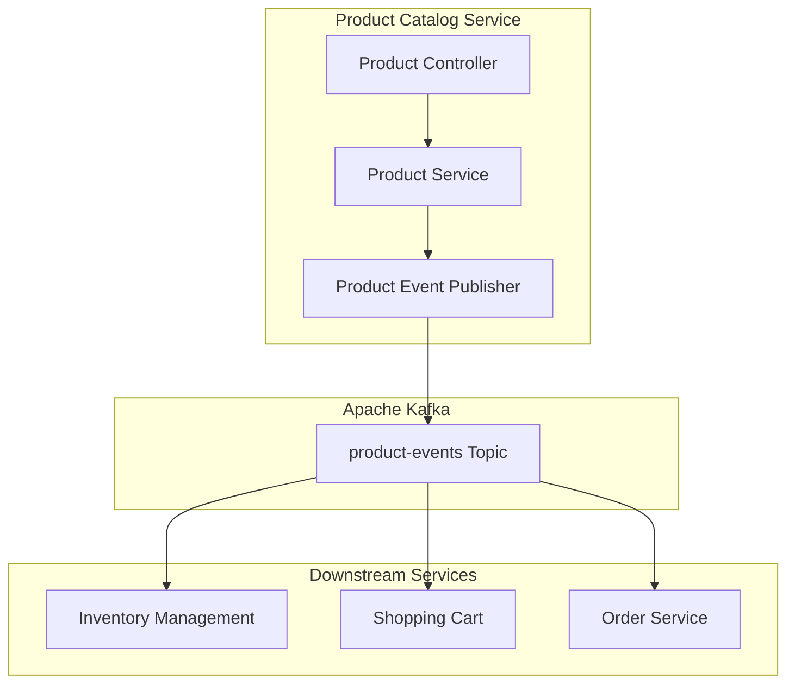
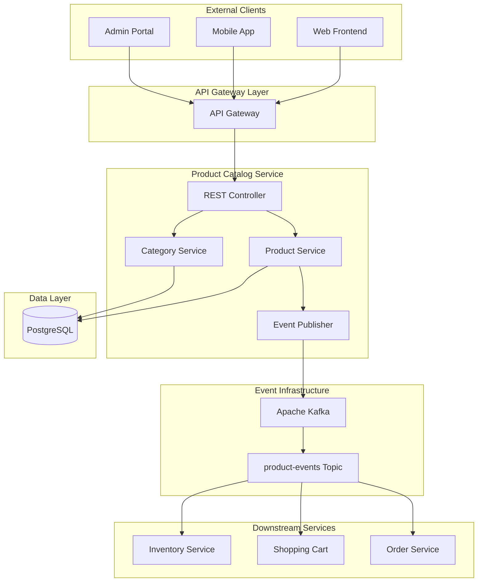
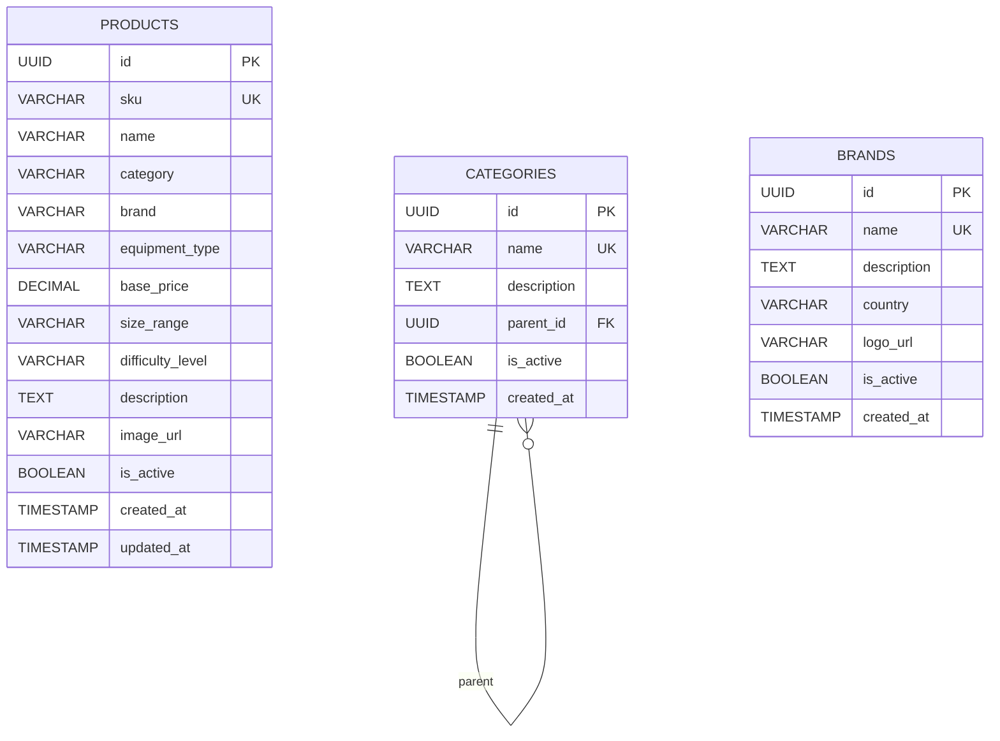

# Product Catalog Service 詳細設計書

## 目次

1. [概要](#概要)
2. [技術仕様](#技術仕様)
3. [アーキテクチャ設計](#アーキテクチャ設計)
4. [Event-Driven Architecture](#event-driven-architecture)
5. [API設計](#api設計)
6. [データベース設計](#データベース設計)
7. [商品管理設計](#product-management-design)
8. [エラー処理](#エラー処理)
9. [テスト設計](#テスト設計)
10. [ローカル開発環境](#ローカル開発環境)
11. [本番デプロイメント](#production-deployment)
12. [監視・運用](#monitoring-operations)

## 概要

### サービス概要

Product Catalog Serviceは、スキー用品販売ショップサイトの商品カタログ管理を担当するマイクロサービスです。商品情報の管理、検索、フィルタリング、カテゴリ管理、在庫連携など、商品に関する全ての機能を提供します。

### 主要責務

- **商品管理**: 商品情報の登録、更新、削除
- **カテゴリ管理**: 商品カテゴリとブランドの階層管理
- **Event Publishing**: 商品変更イベントの発行（Kafka）
- **商品詳細**: 仕様、画像、価格情報の管理
- **Single Source of Truth**: 商品データの統一的な管理
- **サービス間連携**: Event-Driven Architectureによる他サービスとの連携

### ビジネス価値

- **データ整合性**: 商品データの単一情報源として一貫性を保証
- **リアルタイム同期**: Event-Driven Architectureによる即座の変更通知
- **サービス独立性**: 疎結合なアーキテクチャによる独立したデプロイと拡張
- **運用効率化**: 商品情報の一元管理とイベントベースの自動化
- **障害耐性**: 非同期イベント処理による可用性向上

## 技術仕様

### 使用技術スタック

| 技術領域 | 技術/ライブラリ | バージョン | 用途 |
|---------|----------------|-----------|------|
| **Runtime** | OpenJDK | 17 LTS | Java実行環境 |
| **Framework** | Quarkus | 3.8.1 | マイクロサービスフレームワーク |
| **Persistence** | Hibernate ORM | 6.4 | ORM |
| **Data Access** | JPA | 3.2 | データアクセス |
| **REST API** | RESTEasy | 6.2 | RESTful Web Services |
| **CDI** | ArC (Quarkus CDI) | 3.8 | 依存性注入・管理 |
| **Validation** | Hibernate Validator | 8.0 | Bean Validation |
| **JSON Processing** | Jackson | 2.16 | JSON処理 |
| **Database** | PostgreSQL | 16 | 商品データベース |
| **Message Queue** | Apache Kafka | 3.7 | Event-Driven Architecture |
| **Reactive Messaging** | SmallRye Reactive Messaging | 4.15 | Kafka統合 |
| **Health Check** | MicroProfile Health | 4.0 | ヘルスチェック |
| **Configuration** | MicroProfile Config | 3.1 | 設定管理 |
| **Metrics** | MicroProfile Metrics | 5.1 | メトリクス収集 |

### 除外技術

- **Elasticsearch**: 検索機能は簡素化し、PostgreSQLベースの検索を採用
- **Redis**: キャッシュ機能は他サービスで管理

### Java 17 LTS 活用機能

- **Records**: 商品データ転送オブジェクトとイベントクラス
- **Pattern Matching for instanceof**: 商品タイプ別の処理分岐
- **Text Blocks**: 複雑なSQL定義とJSONテンプレート
- **Sealed Classes**: イベントタイプの型安全性
- **Stream API**: 効率的なデータ処理とフィルタリング

## Event-Driven Architecture

### アーキテクチャ概要

Product Catalog Serviceは、Event-Driven Architectureの中核として機能し、商品データの単一情報源（Single Source of Truth）として他のマイクロサービスにリアルタイムで変更を通知します。



### イベント設計

#### イベントタイプ

```java
public sealed interface ProductEvent 
    permits ProductCreatedEvent, ProductUpdatedEvent, ProductDeletedEvent, 
            ProductActivatedEvent, ProductDeactivatedEvent {
    String getEventType();
    UUID getAggregateId();
    UUID getEventId();
    LocalDateTime getEventTime();
}
```

#### 商品作成イベント

```java
public record ProductCreatedEvent(
    UUID eventId,
    UUID productId,
    String sku,
    String name,
    String category,
    String brand,
    String equipmentType,
    BigDecimal basePrice,
    String sizeRange,
    String difficultyLevel,
    String description,
    String imageUrl,
    boolean isRentalAvailable,
    LocalDateTime eventTime
) implements ProductEvent {
    
    public ProductCreatedEvent(Product product) {
        this(
            UUID.randomUUID(),
            product.id,
            product.sku,
            product.name,
            product.category,
            product.brand,
            product.equipmentType,
            product.basePrice,
            product.sizeRange,
            product.difficultyLevel,
            product.description,
            product.imageUrl,
            isRentalEligible(product.equipmentType),
            LocalDateTime.now()
        );
    }
    
    @Override
    public String getEventType() {
        return "PRODUCT_CREATED";
    }
    
    @Override
    public UUID getAggregateId() {
        return productId;
    }
    
    private static boolean isRentalEligible(String equipmentType) {
        return !"WAX".equals(equipmentType) && !"TUNING".equals(equipmentType);
    }
}
```

#### イベント発行サービス

```java
@ApplicationScoped
public class ProductEventPublisher {
    
    @Channel("product-events-out")
    Emitter<ProductEvent> eventEmitter;
    
    @Inject
    Logger logger;
    
    public void publishProductCreated(Product product) {
        ProductCreatedEvent event = new ProductCreatedEvent(product);
        eventEmitter.send(event)
            .whenComplete((success, failure) -> {
                if (failure != null) {
                    logger.error("Failed to publish product created event", failure);
                } else {
                    logger.info("Published product created event for: " + product.id);
                }
            });
    }
    
    public void publishProductUpdated(Product oldProduct, Product newProduct) {
        ProductUpdatedEvent event = new ProductUpdatedEvent(oldProduct, newProduct);
        eventEmitter.send(event)
            .whenComplete((success, failure) -> {
                if (failure != null) {
                    logger.error("Failed to publish product updated event", failure);
                } else {
                    logger.info("Published product updated event for: " + newProduct.id);
                }
            });
    }
    
    // その他のイベント発行メソッド...
}
```

### Kafka設定

#### application.yml設定

```yaml
mp:
  messaging:
    outgoing:
      product-events-out:
        connector: smallrye-kafka
        topic: product-events
        value:
          serializer: io.quarkus.kafka.client.serialization.JsonbSerializer
        key:
          serializer: org.apache.kafka.common.serialization.StringSerializer
        acks: all
        retries: 3
        enable-idempotence: true

kafka:
  bootstrap:
    servers: ${KAFKA_BOOTSTRAP_SERVERS:localhost:9092}
```

### イベント発行戦略

#### 1. トランザクション整合性

商品データの永続化とイベント発行は、トランザクション境界内で実行され、データベースのコミット後にイベントが発行されることを保証します。

```java
@Transactional
public Product createProduct(ProductCreateRequest request) {
    // 1. 商品データをデータベースに永続化
    Product product = new Product();
    // ... 商品データ設定
    Product savedProduct = productRepository.persist(product);
    
    // 2. 永続化成功後にイベント発行
    productEventPublisher.publishProductCreated(savedProduct);
    
    return savedProduct;
}
```

#### 2. 冪等性保証

イベントにはユニークなイベントIDが付与され、下流サービスでの重複処理を防止します。

#### 3. エラーハンドリング

イベント発行失敗時には詳細なログが記録され、必要に応じて手動での再発行が可能です。

### 下流サービスとの連携

#### Inventory Management Service

- **PRODUCT_CREATED**: レンタル対象商品の Equipment エンティティ作成
- **PRODUCT_UPDATED**: キャッシュされた商品情報の更新
- **PRODUCT_DELETED**: Equipment の非アクティブ化
- **PRODUCT_ACTIVATED/DEACTIVATED**: レンタル可用性の更新

#### Shopping Cart Service

- **PRODUCT_UPDATED**: カート内商品情報の更新
- **PRODUCT_DELETED**: カートからの商品削除
- **PRODUCT_DEACTIVATED**: 購入不可能商品の通知

### イベントストア（将来実装）

現在はKafkaトピックでのイベント配信のみですが、将来的にはイベントソーシングパターンの実装も検討されています。

## アーキテクチャ設計

### システムアーキテクチャ図



### ドメインモデル設計

```java
// 商品エンティティ
@Entity
@Table(name = "products")
public class Product {
    
    @Id
    @GeneratedValue(strategy = GenerationType.UUID)
    public UUID id;
    
    @Column(name = "sku", unique = true, nullable = false)
    public String sku;
    
    @Column(name = "name", nullable = false)
    public String name;
    
    @Column(name = "category", nullable = false)
    public String category;
    
    @Column(name = "brand", nullable = false)
    public String brand;
    
    @Column(name = "equipment_type")
    public String equipmentType;
    
    @Column(name = "base_price", precision = 10, scale = 2)
    public BigDecimal basePrice;
    
    @Column(name = "size_range")
    public String sizeRange;
    
    @Column(name = "difficulty_level")
    public String difficultyLevel;
    
    @Column(name = "description", columnDefinition = "TEXT")
    public String description;
    
    @Column(name = "image_url")
    public String imageUrl;
    
    @Column(name = "is_active", nullable = false)
    public boolean isActive = true;
    
    @Column(name = "created_at", nullable = false)
    public LocalDateTime createdAt;
    
    @Column(name = "updated_at")
    public LocalDateTime updatedAt;
    
    @PrePersist
    void prePersist() {
        this.createdAt = LocalDateTime.now();
        this.updatedAt = LocalDateTime.now();
    }
    
    @PreUpdate
    void preUpdate() {
        this.updatedAt = LocalDateTime.now();
    }
}

// カテゴリエンティティ
@Entity
@Table(name = "categories")
public class Category {
    
    @Id
    @GeneratedValue(strategy = GenerationType.UUID)
    public UUID id;
    
    @Column(name = "name", nullable = false)
    public String name;
    
    @Column(name = "description")
    public String description;
    
    @Column(name = "parent_id")
    public UUID parentId;
    
    @Column(name = "is_active", nullable = false)
    public boolean isActive = true;
    
    @Column(name = "created_at", nullable = false)
    public LocalDateTime createdAt;
}

// ブランドエンティティ
@Entity
@Table(name = "brands")
public class Brand {
    
    @Id
    @GeneratedValue(strategy = GenerationType.UUID)
    public UUID id;
    
    @Column(name = "name", nullable = false, unique = true)
    public String name;
    
    @Column(name = "description")
    public String description;
    
    @Column(name = "country")
    public String country;
    
    @Column(name = "logo_url")
    public String logoUrl;
    
    @Column(name = "is_active", nullable = false)
    public boolean isActive = true;
    
    @Column(name = "created_at", nullable = false)
    public LocalDateTime createdAt;
}

// Enum定義
public enum SkiType {
    ALL_MOUNTAIN, CARVING, FREESTYLE, RACING, TOURING, POWDER
}

public enum DifficultyLevel {
    BEGINNER, INTERMEDIATE, ADVANCED, EXPERT
}

public enum Material {
    WOOD, COMPOSITE, CARBON, TITANIUM
}

public enum PublishStatus {
    DRAFT, PUBLISHED, ARCHIVED
}

public enum SkierLevel {
    BEGINNER, INTERMEDIATE, ADVANCED, EXPERT
}
```

## 商品管理設計 {#product-management-design}

### 商品サービス設計

```java
@ApplicationScoped
@Transactional
public class ProductService {
    
    @Inject
    ProductRepository productRepository;
    
    @Inject
    ProductEventPublisher eventPublisher;
    
    @Inject
    Logger logger;
    
    /**
     * 商品作成
     */
    public Product createProduct(ProductCreateRequest request) {
        // 入力値検証
        validateProductRequest(request);
        
        // SKU重複チェック
        if (productRepository.existsBySku(request.sku())) {
            throw new DuplicateSkuException("SKU already exists: " + request.sku());
        }
        
        // 商品エンティティ作成
        Product product = new Product();
        product.sku = request.sku();
        product.name = request.name();
        product.category = request.category();
        product.brand = request.brand();
        product.equipmentType = request.equipmentType();
        product.basePrice = request.basePrice();
        product.sizeRange = request.sizeRange();
        product.difficultyLevel = request.difficultyLevel();
        product.description = request.description();
        product.imageUrl = request.imageUrl();
        
        // データベース保存
        Product savedProduct = productRepository.persist(product);
        
        // イベント発行
        eventPublisher.publishProductCreated(savedProduct);
        
        logger.info("Created product: " + savedProduct.sku);
        return savedProduct;
    }
    
    /**
     * 商品更新
     */
    public Product updateProduct(UUID productId, ProductUpdateRequest request) {
        Product existingProduct = findByIdOrThrow(productId);
        Product oldProduct = cloneProduct(existingProduct);
        
        // 更新可能フィールドの更新
        existingProduct.name = request.name();
        existingProduct.category = request.category();
        existingProduct.brand = request.brand();
        existingProduct.basePrice = request.basePrice();
        existingProduct.description = request.description();
        existingProduct.imageUrl = request.imageUrl();
        
        // データベース保存
        Product updatedProduct = productRepository.persist(existingProduct);
        
        // 変更イベント発行
        eventPublisher.publishProductUpdated(oldProduct, updatedProduct);
        
        logger.info("Updated product: " + updatedProduct.sku);
        return updatedProduct;
    }
    
    /**
     * 商品削除（論理削除）
     */
    public void deleteProduct(UUID productId) {
        Product product = findByIdOrThrow(productId);
        
        product.isActive = false;
        productRepository.persist(product);
        
        // 削除イベント発行
        eventPublisher.publishProductDeleted(product.id, product.sku);
        
        logger.info("Deleted product: " + product.sku);
    }
    
    /**
     * 商品アクティベート
     */
    public void activateProduct(UUID productId) {
        Product product = findByIdOrThrow(productId);
        
        if (product.isActive) {
            throw new IllegalStateException("Product is already active: " + productId);
        }
        
        product.isActive = true;
        productRepository.persist(product);
        
        // アクティベートイベント発行
        eventPublisher.publishProductActivated(product.id, product.sku);
        
        logger.info("Activated product: " + product.sku);
    }
    
    /**
     * 商品ディアクティベート
     */
    public void deactivateProduct(UUID productId) {
        Product product = findByIdOrThrow(productId);
        
        if (!product.isActive) {
            throw new IllegalStateException("Product is already inactive: " + productId);
        }
        
        product.isActive = false;
        productRepository.persist(product);
        
        // ディアクティベートイベント発行
        eventPublisher.publishProductDeactivated(product.id, product.sku);
        
        logger.info("Deactivated product: " + product.sku);
    }
    
    // 検索・取得メソッド
    public List<Product> findActiveProducts() {
        return productRepository.findByIsActive(true);
    }
    
    public List<Product> findByCategory(String category) {
        return productRepository.findByCategoryAndIsActive(category, true);
    }
    
    public List<Product> findByBrand(String brand) {
        return productRepository.findByBrandAndIsActive(brand, true);
    }
    
    public List<Product> findByEquipmentType(String equipmentType) {
        return productRepository.findByEquipmentTypeAndIsActive(equipmentType, true);
    }
    
    public Optional<Product> findBySku(String sku) {
        return productRepository.findBySku(sku);
    }
    
    private Product findByIdOrThrow(UUID productId) {
        return productRepository.findByIdOptional(productId)
            .orElseThrow(() -> new ProductNotFoundException("Product not found: " + productId));
    }
    
    private void validateProductRequest(ProductCreateRequest request) {
        if (request.sku() == null || request.sku().isBlank()) {
            throw new IllegalArgumentException("SKU is required");
        }
        if (request.name() == null || request.name().isBlank()) {
            throw new IllegalArgumentException("Name is required");
        }
        if (request.basePrice() == null || request.basePrice().compareTo(BigDecimal.ZERO) <= 0) {
            throw new IllegalArgumentException("Base price must be positive");
        }
    }
    
    private Product cloneProduct(Product original) {
        // 変更前の状態を保持するためのクローン作成
        Product clone = new Product();
        clone.id = original.id;
        clone.sku = original.sku;
        clone.name = original.name;
        clone.category = original.category;
        clone.brand = original.brand;
        clone.equipmentType = original.equipmentType;
        clone.basePrice = original.basePrice;
        clone.description = original.description;
        clone.imageUrl = original.imageUrl;
        return clone;
    }
}
```

### Repository設計

```java
@ApplicationScoped
public class ProductRepository implements PanacheRepositoryBase<Product, UUID> {
    
    public Optional<Product> findBySku(String sku) {
        return find("sku", sku).firstResultOptional();
    }
    
    public boolean existsBySku(String sku) {
        return count("sku", sku) > 0;
    }
    
    public List<Product> findByIsActive(boolean isActive) {
        return find("isActive", isActive).list();
    }
    
    public List<Product> findByCategoryAndIsActive(String category, boolean isActive) {
        return find("category = ?1 AND isActive = ?2", category, isActive).list();
    }
    
    public List<Product> findByBrandAndIsActive(String brand, boolean isActive) {
        return find("brand = ?1 AND isActive = ?2", brand, isActive).list();
    }
    
    public List<Product> findByEquipmentTypeAndIsActive(String equipmentType, boolean isActive) {
        return find("equipmentType = ?1 AND isActive = ?2", equipmentType, isActive).list();
    }
    
    public List<Product> searchByNameContaining(String namePattern) {
        return find("LOWER(name) LIKE LOWER(?1) AND isActive = true", 
                   "%" + namePattern + "%").list();
    }
    
    public List<Product> findByPriceRange(BigDecimal minPrice, BigDecimal maxPrice) {
        return find("basePrice >= ?1 AND basePrice <= ?2 AND isActive = true", 
                   minPrice, maxPrice).list();
    }
}
```

### DTOクラス設計

```java
// 商品作成リクエスト
public record ProductCreateRequest(
    @NotBlank String sku,
    @NotBlank String name,
    @NotBlank String category,
    @NotBlank String brand,
    String equipmentType,
    @NotNull @DecimalMin("0.01") BigDecimal basePrice,
    String sizeRange,
    String difficultyLevel,
    String description,
    String imageUrl
) {}

// 商品更新リクエスト
public record ProductUpdateRequest(
    @NotBlank String name,
    @NotBlank String category,
    @NotBlank String brand,
    @NotNull @DecimalMin("0.01") BigDecimal basePrice,
    String description,
    String imageUrl
) {}

// 商品レスポンス
public record ProductResponse(
    UUID id,
    String sku,
    String name,
    String category,
    String brand,
    String equipmentType,
    BigDecimal basePrice,
    String sizeRange,
    String difficultyLevel,
    String description,
    String imageUrl,
    boolean isActive,
    LocalDateTime createdAt,
    LocalDateTime updatedAt
) {
    public static ProductResponse from(Product product) {
        return new ProductResponse(
            product.id,
            product.sku,
            product.name,
            product.category,
            product.brand,
            product.equipmentType,
            product.basePrice,
            product.sizeRange,
            product.difficultyLevel,
            product.description,
            product.imageUrl,
            product.isActive,
            product.createdAt,
            product.updatedAt
        );
    }
}
```

## API設計

### REST API エンドポイント

#### 商品管理

| Method | Path | Description |
|--------|------|-------------|
| GET | `/api/products` | 商品一覧取得 |
| GET | `/api/products/{id}` | 商品詳細取得 |
| GET | `/api/products/sku/{sku}` | SKUによる商品取得 |
| POST | `/api/products` | 商品登録 |
| PUT | `/api/products/{id}` | 商品更新 |
| DELETE | `/api/products/{id}` | 商品削除 |
| PUT | `/api/products/{id}/activate` | 商品アクティベート |
| PUT | `/api/products/{id}/deactivate` | 商品ディアクティベート |

#### カテゴリ管理

| Method | Path | Description |
|--------|------|-------------|
| GET | `/api/categories` | カテゴリ一覧取得 |
| GET | `/api/categories/{id}` | カテゴリ詳細取得 |
| POST | `/api/categories` | カテゴリ登録 |
| PUT | `/api/categories/{id}` | カテゴリ更新 |

#### ブランド管理

| Method | Path | Description |
|--------|------|-------------|
| GET | `/api/brands` | ブランド一覧取得 |
| GET | `/api/brands/{id}` | ブランド詳細取得 |
| POST | `/api/brands` | ブランド登録 |
| PUT | `/api/brands/{id}` | ブランド更新 |

### 商品検索API

```java
@Path("/api/products")
@ApplicationScoped
public class ProductResource {
    
    @Inject
    ProductService productService;
    
    @GET
    public Response getProducts(
            @QueryParam("category") String category,
            @QueryParam("brand") String brand,
            @QueryParam("equipmentType") String equipmentType,
            @QueryParam("search") String search,
            @QueryParam("minPrice") BigDecimal minPrice,
            @QueryParam("maxPrice") BigDecimal maxPrice) {
        
        List<Product> products;
        
        if (search != null && !search.isBlank()) {
            products = productService.searchByName(search);
        } else if (category != null) {
            products = productService.findByCategory(category);
        } else if (brand != null) {
            products = productService.findByBrand(brand);
        } else if (equipmentType != null) {
            products = productService.findByEquipmentType(equipmentType);
        } else {
            products = productService.findActiveProducts();
        }
        
        // 価格フィルタリング
        if (minPrice != null || maxPrice != null) {
            products = products.stream()
                .filter(p -> priceInRange(p.basePrice, minPrice, maxPrice))
                .collect(Collectors.toList());
        }
        
        List<ProductResponse> response = products.stream()
            .map(ProductResponse::from)
            .collect(Collectors.toList());
            
        return Response.ok(response).build();
    }
    
    @GET
    @Path("/{id}")
    public Response getProduct(@PathParam("id") UUID id) {
        return productService.findById(id)
            .map(ProductResponse::from)
            .map(response -> Response.ok(response).build())
            .orElse(Response.status(Response.Status.NOT_FOUND).build());
    }
    
    @POST
    @Consumes(MediaType.APPLICATION_JSON)
    @Produces(MediaType.APPLICATION_JSON)
    public Response createProduct(@Valid ProductCreateRequest request) {
        Product product = productService.createProduct(request);
        ProductResponse response = ProductResponse.from(product);
        return Response.status(Response.Status.CREATED).entity(response).build();
    }
    
    @PUT
    @Path("/{id}")
    @Consumes(MediaType.APPLICATION_JSON)
    @Produces(MediaType.APPLICATION_JSON)
    public Response updateProduct(@PathParam("id") UUID id, 
                                @Valid ProductUpdateRequest request) {
        Product product = productService.updateProduct(id, request);
        ProductResponse response = ProductResponse.from(product);
        return Response.ok(response).build();
    }
    
    @DELETE
    @Path("/{id}")
    public Response deleteProduct(@PathParam("id") UUID id) {
        productService.deleteProduct(id);
        return Response.noContent().build();
    }
    
    private boolean priceInRange(BigDecimal price, BigDecimal minPrice, BigDecimal maxPrice) {
        if (minPrice != null && price.compareTo(minPrice) < 0) {
            return false;
        }
        if (maxPrice != null && price.compareTo(maxPrice) > 0) {
            return false;
        }
        return true;
    }
}
```

## データベース設計

### ERD（Entity Relationship Diagram）



### テーブル設計

#### Products テーブル

```sql
CREATE TABLE products (
    id UUID PRIMARY KEY DEFAULT gen_random_uuid(),
    sku VARCHAR(100) NOT NULL UNIQUE,
    name VARCHAR(200) NOT NULL,
    category VARCHAR(100) NOT NULL,
    brand VARCHAR(100) NOT NULL,
    equipment_type VARCHAR(50),
    base_price DECIMAL(10,2) NOT NULL,
    size_range VARCHAR(50),
    difficulty_level VARCHAR(20),
    description TEXT,
    image_url VARCHAR(500),
    is_active BOOLEAN NOT NULL DEFAULT TRUE,
    created_at TIMESTAMP NOT NULL DEFAULT CURRENT_TIMESTAMP,
    updated_at TIMESTAMP NOT NULL DEFAULT CURRENT_TIMESTAMP
);

-- インデックス作成
CREATE INDEX idx_products_sku ON products(sku);
CREATE INDEX idx_products_category ON products(category);
CREATE INDEX idx_products_brand ON products(brand);
CREATE INDEX idx_products_equipment_type ON products(equipment_type);
CREATE INDEX idx_products_is_active ON products(is_active);
CREATE INDEX idx_products_created_at ON products(created_at);

-- 更新時刻自動更新トリガー
CREATE OR REPLACE FUNCTION update_updated_at_column()
RETURNS TRIGGER AS $$
BEGIN
    NEW.updated_at = CURRENT_TIMESTAMP;
    RETURN NEW;
END;
$$ language 'plpgsql';

CREATE TRIGGER update_products_updated_at BEFORE UPDATE
    ON products FOR EACH ROW EXECUTE PROCEDURE update_updated_at_column();
```

#### Categories テーブル

```sql
CREATE TABLE categories (
    id UUID PRIMARY KEY DEFAULT gen_random_uuid(),
    name VARCHAR(100) NOT NULL UNIQUE,
    description TEXT,
    parent_id UUID REFERENCES categories(id),
    is_active BOOLEAN NOT NULL DEFAULT TRUE,
    created_at TIMESTAMP NOT NULL DEFAULT CURRENT_TIMESTAMP
);

CREATE INDEX idx_categories_parent_id ON categories(parent_id);
CREATE INDEX idx_categories_is_active ON categories(is_active);
```

#### Brands テーブル

```sql
CREATE TABLE brands (
    id UUID PRIMARY KEY DEFAULT gen_random_uuid(),
    name VARCHAR(100) NOT NULL UNIQUE,
    description TEXT,
    country VARCHAR(50),
    logo_url VARCHAR(500),
    is_active BOOLEAN NOT NULL DEFAULT TRUE,
    created_at TIMESTAMP NOT NULL DEFAULT CURRENT_TIMESTAMP
);

CREATE INDEX idx_brands_is_active ON brands(is_active);
CREATE INDEX idx_brands_country ON brands(country);
```

### 初期データ投入

#### カテゴリデータ

```sql
INSERT INTO categories (name, description) VALUES
('SKI_BOARD', 'スキー板'),
('BOOT', 'スキーブーツ'),
('POLE', 'ストック'),
('HELMET', 'ヘルメット'),
('GOGGLE', 'ゴーグル'),
('GLOVE', 'グローブ'),
('WEAR', 'ウェア'),
('BAG', 'バッグ'),
('WAX', 'ワックス'),
('TUNING', 'チューンナップ用品');
```

#### ブランドデータ

```sql
INSERT INTO brands (name, country, description) VALUES
('Rossignol', 'France', 'フランスの老舗スキーブランド'),
('Atomic', 'Austria', 'オーストリアの革新的スキーメーカー'),
('Salomon', 'France', 'フランスのスポーツ用品メーカー'),
('K2', 'USA', 'アメリカのスキー・スノーボードブランド'),
('Volkl', 'Germany', 'ドイツの高品質スキーメーカー'),
('Nordica', 'Italy', 'イタリアのスキーブーツ専門メーカー'),
('Leki', 'Germany', 'ドイツのストック専門メーカー'),
('POC', 'Sweden', 'スウェーデンの安全用品メーカー'),
('Smith', 'USA', 'アメリカのゴーグル・ヘルメットメーカー'),
('Oakley', 'USA', 'アメリカのスポーツ用品メーカー');
```

### データ移行戦略

Event-Driven Architectureの導入に伴う既存データの移行手順：

1. **現在のスキーマ維持**: 既存のproductsテーブル構造を保持
2. **イベント発行機能追加**: 商品CRUD操作時にKafkaイベント発行
3. **下流サービス対応**: Inventory Managementサービスでイベント消費開始
4. **データ整合性確認**: 既存商品データと新規イベントベースデータの整合性検証
5. **段階的移行**: 新規商品から段階的にEvent-Driven方式に移行

## エラー処理

### 例外クラス設計

```java
// ベース例外クラス
public abstract class ProductCatalogException extends RuntimeException {
    protected final String errorCode;
    
    protected ProductCatalogException(String errorCode, String message) {
        super(message);
        this.errorCode = errorCode;
    }
    
    public String getErrorCode() { 
        return errorCode; 
    }
}

// 具体的な例外クラス
public class ProductNotFoundException extends ProductCatalogException {
    public ProductNotFoundException(String message) {
        super("PRODUCT_NOT_FOUND", message);
    }
}

public class DuplicateSkuException extends ProductCatalogException {
    public DuplicateSkuException(String message) {
        super("DUPLICATE_SKU", message);
    }
}

public class InvalidProductDataException extends ProductCatalogException {
    public InvalidProductDataException(String message) {
        super("INVALID_PRODUCT_DATA", message);
    }
}

// グローバル例外ハンドラー
@Provider
public class ProductCatalogExceptionMapper implements ExceptionMapper<Exception> {
    
    @Override
    public Response toResponse(Exception exception) {
        if (exception instanceof ProductCatalogException pce) {
            return Response.status(getHttpStatus(pce))
                .entity(new ErrorResponse(pce.getErrorCode(), pce.getMessage()))
                .type(MediaType.APPLICATION_JSON)
                .build();
        }
        
        if (exception instanceof ConstraintViolationException cve) {
            return Response.status(400)
                .entity(new ErrorResponse("VALIDATION_ERROR", "入力値が正しくありません"))
                .type(MediaType.APPLICATION_JSON)
                .build();
        }
        
        return Response.status(500)
            .entity(new ErrorResponse("INTERNAL_ERROR", "内部エラーが発生しました"))
            .type(MediaType.APPLICATION_JSON)
            .build();
    }
    
    private int getHttpStatus(ProductCatalogException exception) {
        return switch (exception.getErrorCode()) {
            case "PRODUCT_NOT_FOUND" -> 404;
            case "DUPLICATE_SKU" -> 409;
            case "INVALID_PRODUCT_DATA" -> 400;
            default -> 500;
        };
    }
}

public record ErrorResponse(String errorCode, String message) {}
```

## テスト設計

### 単体テスト

```java
@QuarkusTest
class ProductServiceTest {
    
    @Inject
    ProductService productService;
    
    @InjectMock
    ProductEventPublisher eventPublisher;
    
    @Test
    @Transactional
    void testCreateProduct_Success() {
        // Given
        ProductCreateRequest request = new ProductCreateRequest(
            "SKI-TEST-001",
            "テストスキー",
            "SKI_BOARD",
            "Rossignol",
            "SKI_BOARD",
            new BigDecimal("50000"),
            "160-170cm",
            "INTERMEDIATE",
            "テスト用スキー",
            "https://example.com/image.jpg"
        );
        
        // When
        Product result = productService.createProduct(request);
        
        // Then
        assertThat(result.sku).isEqualTo("SKI-TEST-001");
        assertThat(result.name).isEqualTo("テストスキー");
        assertThat(result.isActive).isTrue();
        
        verify(eventPublisher).publishProductCreated(any(Product.class));
    }
    
    @Test
    void testCreateProduct_DuplicateSku() {
        // Given
        ProductCreateRequest request = new ProductCreateRequest(
            "SKI-EXISTING-001", // 既存のSKU
            "テストスキー",
            "SKI_BOARD",
            "Rossignol",
            "SKI_BOARD", 
            new BigDecimal("50000"),
            "160-170cm",
            "INTERMEDIATE",
            "テスト用スキー",
            "https://example.com/image.jpg"
        );
        
        // When & Then
        assertThatThrownBy(() -> productService.createProduct(request))
            .isInstanceOf(DuplicateSkuException.class)
            .hasMessageContaining("SKU already exists");
    }
}
```

### 統合テスト

```java
@QuarkusTest
@TestMethodOrder(OrderAnnotation.class)
class ProductResourceTest {
    
    @Test
    @Order(1)
    void testCreateProduct() {
        ProductCreateRequest request = new ProductCreateRequest(
            "SKI-INTEGRATION-001",
            "統合テストスキー",
            "SKI_BOARD",
            "Atomic",
            "SKI_BOARD",
            new BigDecimal("60000"),
            "165cm",
            "ADVANCED",
            "統合テスト用",
            null
        );
        
        given()
            .contentType(ContentType.JSON)
            .body(request)
        .when()
            .post("/api/products")
        .then()
            .statusCode(201)
            .body("sku", equalTo("SKI-INTEGRATION-001"))
            .body("name", equalTo("統合テストスキー"));
    }
    
    @Test
    @Order(2)
    void testGetProducts() {
        given()
        .when()
            .get("/api/products")
        .then()
            .statusCode(200)
            .body("size()", greaterThan(0));
    }
}
```

### Event発行テスト

```java
@QuarkusTest
class ProductEventPublisherTest {
    
    @Inject
    ProductEventPublisher eventPublisher;
    
    @Channel("product-events-out")
    TestEmitter<ProductEvent> eventEmitter;
    
    @Test
    void testPublishProductCreatedEvent() {
        // Given
        Product product = new Product();
        product.id = UUID.randomUUID();
        product.sku = "SKI-EVENT-001";
        product.name = "イベントテストスキー";
        
        // When
        eventPublisher.publishProductCreated(product);
        
        // Then
        await().atMost(Duration.ofSeconds(5)).untilAsserted(() -> {
            assertThat(eventEmitter.getMessages()).hasSize(1);
            ProductEvent event = eventEmitter.getMessages().get(0);
            assertThat(event.getEventType()).isEqualTo("PRODUCT_CREATED");
            assertThat(event.getAggregateId()).isEqualTo(product.id);
        });
    }
}
```

## ローカル開発環境

### 開発環境セットアップ

#### 前提条件

- Java 17 LTS
- Maven 3.9+
- Docker & Docker Compose
- Apache Kafka (開発環境)

#### Docker Compose設定

```yaml
# docker-compose.yml
version: '3.8'
services:
  product-catalog-service:
    build:
      context: .
      dockerfile: src/main/docker/Dockerfile.jvm
    ports:
      - "8083:8083"
    environment:
      - QUARKUS_DATASOURCE_JDBC_URL=jdbc:postgresql://postgres:5432/product_catalog
      - QUARKUS_DATASOURCE_USERNAME=product_user
      - QUARKUS_DATASOURCE_PASSWORD=product_pass
      - KAFKA_BOOTSTRAP_SERVERS=kafka:9092
    depends_on:
      - postgres
      - kafka
    networks:
      - ski-shop-network

  postgres:
    image: postgres:16-alpine
    environment:
      - POSTGRES_DB=product_catalog
      - POSTGRES_USER=product_user
      - POSTGRES_PASSWORD=product_pass
    ports:
      - "5433:5432"
    volumes:
      - postgres_product_data:/var/lib/postgresql/data
      - ./scripts/init-product-db.sql:/docker-entrypoint-initdb.d/init-db.sql
    networks:
      - ski-shop-network

  zookeeper:
    image: confluentinc/cp-zookeeper:latest
    environment:
      ZOOKEEPER_CLIENT_PORT: 2181
      ZOOKEEPER_TICK_TIME: 2000
    networks:
      - ski-shop-network

  kafka:
    image: confluentinc/cp-kafka:latest
    depends_on:
      - zookeeper
    ports:
      - "9092:9092"
    environment:
      KAFKA_BROKER_ID: 1
      KAFKA_ZOOKEEPER_CONNECT: zookeeper:2181
      KAFKA_ADVERTISED_LISTENERS: PLAINTEXT://localhost:9092
      KAFKA_OFFSETS_TOPIC_REPLICATION_FACTOR: 1
      KAFKA_AUTO_CREATE_TOPICS_ENABLE: true
    networks:
      - ski-shop-network

volumes:
  postgres_product_data:

networks:
  ski-shop-network:
    driver: bridge
```

#### アプリケーション設定

```yaml
# application.yml
quarkus:
  application:
    name: product-catalog-service
  
  http:
    port: 8083
    
  datasource:
    db-kind: postgresql
    jdbc:
      url: ${QUARKUS_DATASOURCE_JDBC_URL:jdbc:postgresql://localhost:5433/product_catalog}
    username: ${QUARKUS_DATASOURCE_USERNAME:product_user}
    password: ${QUARKUS_DATASOURCE_PASSWORD:product_pass}
  
  hibernate-orm:
    database:
      generation: update
    sql-load-script: import.sql
  
  log:
    level: INFO
    category:
      "com.ski.shop.catalog": DEBUG

# Kafka設定
mp:
  messaging:
    outgoing:
      product-events-out:
        connector: smallrye-kafka
        topic: product-events
        value:
          serializer: io.quarkus.kafka.client.serialization.JsonbSerializer
        key:
          serializer: org.apache.kafka.common.serialization.StringSerializer
        acks: all
        retries: 3
        enable-idempotence: true

kafka:
  bootstrap:
    servers: ${KAFKA_BOOTSTRAP_SERVERS:localhost:9092}
```

#### 開発用データ投入スクリプト

```sql
-- import.sql
-- カテゴリデータ
INSERT INTO categories (id, name, description, is_active, created_at) VALUES
('01234567-89ab-cdef-0123-456789abcdef', 'SKI_BOARD', 'スキー板', true, CURRENT_TIMESTAMP),
('11234567-89ab-cdef-0123-456789abcdef', 'BOOT', 'スキーブーツ', true, CURRENT_TIMESTAMP),
('21234567-89ab-cdef-0123-456789abcdef', 'POLE', 'ストック', true, CURRENT_TIMESTAMP),
('31234567-89ab-cdef-0123-456789abcdef', 'HELMET', 'ヘルメット', true, CURRENT_TIMESTAMP);

-- ブランドデータ
INSERT INTO brands (id, name, country, description, is_active, created_at) VALUES
('a1234567-89ab-cdef-0123-456789abcdef', 'Rossignol', 'France', 'フランスの老舗スキーブランド', true, CURRENT_TIMESTAMP),
('b1234567-89ab-cdef-0123-456789abcdef', 'Atomic', 'Austria', 'オーストリアの革新的スキーメーカー', true, CURRENT_TIMESTAMP),
('c1234567-89ab-cdef-0123-456789abcdef', 'Salomon', 'France', 'フランスのスポーツ用品メーカー', true, CURRENT_TIMESTAMP);

-- サンプル商品データ
INSERT INTO products (id, sku, name, category, brand, equipment_type, base_price, size_range, difficulty_level, description, is_active, created_at, updated_at) VALUES
('p1234567-89ab-cdef-0123-456789abcdef', 'SKI-ROSS-HERO-165', 'Rossignol Hero Athlete FIS GS', 'SKI_BOARD', 'Rossignol', 'SKI_BOARD', 120000.00, '165cm', 'EXPERT', 'World Cup レーシングスキー', true, CURRENT_TIMESTAMP, CURRENT_TIMESTAMP),
('p2234567-89ab-cdef-0123-456789abcdef', 'SKI-ATOM-REDSTER-170', 'Atomic Redster X9 WC GS', 'SKI_BOARD', 'Atomic', 'SKI_BOARD', 110000.00, '170cm', 'EXPERT', 'World Cup GSスキー', true, CURRENT_TIMESTAMP, CURRENT_TIMESTAMP),
('p3234567-89ab-cdef-0123-456789abcdef', 'SKI-SAL-SMAX-160', 'Salomon S/Max 8', 'SKI_BOARD', 'Salomon', 'SKI_BOARD', 45000.00, '160cm', 'INTERMEDIATE', '中級者向けオールマウンテンスキー', true, CURRENT_TIMESTAMP, CURRENT_TIMESTAMP);
```

### 開発モード実行

```bash
# 開発モードで起動（ホットリロード有効）
./mvnw quarkus:dev

# または Docker Composeで起動
docker-compose up -d
```

### API テスト

```bash
# 商品一覧取得
curl http://localhost:8083/api/products

# 商品詳細取得
curl http://localhost:8083/api/products/p1234567-89ab-cdef-0123-456789abcdef

# 商品作成
curl -X POST http://localhost:8083/api/products \
  -H "Content-Type: application/json" \
  -d '{
    "sku": "SKI-TEST-001",
    "name": "テストスキー",
    "category": "SKI_BOARD",
    "brand": "Rossignol",
    "equipmentType": "SKI_BOARD",
    "basePrice": 50000,
    "sizeRange": "165cm",
    "difficultyLevel": "INTERMEDIATE",
    "description": "テスト用スキー"
  }'
```

## 本番デプロイメント {#production-deployment}

### Kubernetes デプロイメント

```yaml
apiVersion: apps/v1
kind: Deployment
metadata:
  name: product-catalog-service
  labels:
    app: product-catalog-service
spec:
  replicas: 3
  selector:
    matchLabels:
      app: product-catalog-service
  template:
    metadata:
      labels:
        app: product-catalog-service
    spec:
      containers:
      - name: product-catalog-service
        image: ski-shop/product-catalog-service:latest
        ports:
        - containerPort: 8083
        env:
        - name: QUARKUS_DATASOURCE_JDBC_URL
          value: "jdbc:postgresql://postgres-service:5432/product_catalog"
        - name: QUARKUS_DATASOURCE_USERNAME
          valueFrom:
            secretKeyRef:
              name: postgres-secret
              key: username
        - name: QUARKUS_DATASOURCE_PASSWORD
          valueFrom:
            secretKeyRef:
              name: postgres-secret
              key: password
        - name: KAFKA_BOOTSTRAP_SERVERS
          value: "kafka-service:9092"
        livenessProbe:
          httpGet:
            path: /q/health/live
            port: 8083
          initialDelaySeconds: 30
          periodSeconds: 10
        readinessProbe:
          httpGet:
            path: /q/health/ready
            port: 8083
          initialDelaySeconds: 5
          periodSeconds: 5
        resources:
          requests:
            memory: "512Mi"
            cpu: "250m"
          limits:
            memory: "1Gi"
            cpu: "500m"

---
apiVersion: v1
kind: Service
metadata:
  name: product-catalog-service
spec:
  selector:
    app: product-catalog-service
  ports:
  - port: 8083
    targetPort: 8083
  type: ClusterIP
```

### 本番環境設定

```yaml
# application-prod.yml
quarkus:
  log:
    level: WARN
    category:
      "com.ski.shop.catalog": INFO
  
  datasource:
    jdbc:
      min-size: 5
      max-size: 20
      acquisition-timeout: 10s
  
  hibernate-orm:
    database:
      generation: validate
    sql-load-script: no-file

mp:
  messaging:
    outgoing:
      product-events-out:
        acks: all
        retries: 5
        batch-size: 100
        linger-ms: 5
        compression-type: snappy
```

## 監視・運用 {#monitoring-operations}

### ヘルスチェック

```java
@ApplicationScoped
public class ProductCatalogHealthCheck implements HealthCheck {
    
    @Inject
    AgroalDataSource dataSource;
    
    @Inject
    @Channel("product-events-out")
    Emitter<ProductEvent> eventEmitter;
    
    @Override
    public HealthCheckResponse call() {
        HealthCheckResponseBuilder builder = HealthCheckResponse.named("product-catalog-service");
        
        try {
            // データベース接続確認
            checkDatabaseConnection();
            
            // Kafka接続確認
            checkKafkaConnection();
            
            builder.up();
        } catch (Exception e) {
            builder.down().withData("error", e.getMessage());
        }
        
        return builder.build();
    }
    
    private void checkDatabaseConnection() throws SQLException {
        try (Connection connection = dataSource.getConnection()) {
            try (PreparedStatement statement = connection.prepareStatement("SELECT 1")) {
                statement.executeQuery();
            }
        }
    }
    
    private void checkKafkaConnection() {
        // Kafka接続確認ロジック
        // イベント送信が可能かチェック
    }
}
```

### メトリクス

```java
@ApplicationScoped
public class ProductMetrics {
    
    @Inject
    @Metric(name = "products_created_total")
    Counter productsCreated;
    
    @Inject
    @Metric(name = "products_updated_total")
    Counter productsUpdated;
    
    @Inject
    @Metric(name = "product_events_published_total")
    Counter eventsPublished;
    
    @Inject
    @Metric(name = "product_processing_duration")
    Timer processingDuration;
    
    public void recordProductCreated() {
        productsCreated.increment();
    }
    
    public void recordProductUpdated() {
        productsUpdated.increment();
    }
    
    public void recordEventPublished() {
        eventsPublished.increment();
    }
    
    public Timer.Sample startProcessingTimer() {
        return Timer.start(processingDuration);
    }
}
```

このProduct Catalog Serviceの詳細設計書により、Event-Driven Architectureを活用した高性能な商品カタログ管理システムの実装が可能です。
