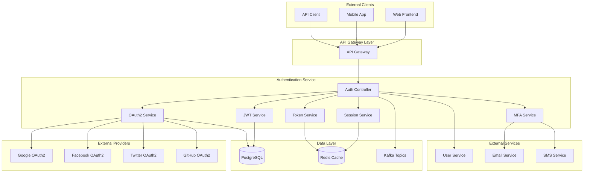
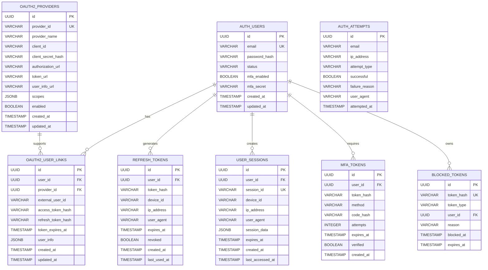

# Authentication Service Detailed Design Document

## Table of Contents

1. [Overview](#overview)
2. [Technical Specifications](#technical-specifications)
3. [Architecture Design](#architecture-design)
4. [API Design](#api-design)
5. [Database Design](#database-design)
6. [JWT Design](#jwt-design)
7. [OAuth2 Design](#oauth2-design)
8. [Session Management Design](#session-management-design)
9. [Error Handling](#error-handling)
10. [Security Design](#security-design)
11. [Test Design](#test-design)
12. [Local Development Environment](#local-development)
13. [Production Deployment](#production-deployment)
14. [Monitoring and Operations](#monitoring-operations)
15. [Incident Response](#incident-response)

## Overview

### Service Summary

The Authentication Service is a microservice dedicated to handling the authentication and authorization functions for the ski equipment e-commerce site. It provides all security-related features, including JWT authentication, OAuth2 provider integration, session management, and multi-factor authentication.

### Key Responsibilities

- **JWT Authentication**: Generation, validation, and refreshing of JWT tokens.
- **OAuth2 Integration**: Authentication with external providers like Google, Facebook, and Twitter.
- **Session Management**: Creation, validation, and invalidation of sessions.
- **Multi-Factor Authentication (MFA)**: SMS, email, and TOTP authentication.
- **Authorization Control**: Role-based and resource-based access control.
- **Token Management**: Lifecycle management of access tokens and refresh tokens.

### Business Value

- **Enhanced Security**: Robust authentication and authorization features.
- **Improved User Experience**: Single Sign-On (SSO) and social logins.
- **Operational Efficiency**: Reduced management costs through a unified authentication platform.
- **Compliance**: Adherence to security standards.

## Technical Specifications

### Technology Stack

| Category | Technology/Library | Version | Purpose |
|---|---|---|---|
| **Runtime** | OpenJDK | 21 LTS | Java execution environment |
| **Framework** | Jakarta EE | 11 | Enterprise framework |
| **Application Server** | WildFly | 31.0.1 | Jakarta EE application server |
| **Security** | Jakarta Security | 3.0 | Security framework |
| **JWT** | MicroProfile JWT | 2.1 | JWT processing |
| **OAuth2** | Jakarta Authorization | 2.1 | OAuth2 server |
| **Persistence** | Jakarta Persistence (JPA) | 3.2 | ORM |
| **REST API** | Jakarta REST (JAX-RS) | 4.0 | RESTful Web Services |
| **CDI** | Jakarta CDI | 4.1 | Dependency Injection and Management |
| **Validation** | Jakarta Validation | 3.1 | Bean Validation |
| **Database** | PostgreSQL | 16 | Primary database |
| **Cache** | Redis | 7.2 | Token and session caching |
| **Message Queue** | Apache Kafka | 3.7 | Authentication event processing |
| **Crypto** | Bouncy Castle | 1.77 | Cryptographic operations |
| **TOTP** | Google Authenticator | 1.5.0 | Two-factor authentication |
| **Rate Limiting** | Bucket4j | 8.7.0 | Rate limiting |
| **Monitoring** | MicroProfile Metrics | 5.1 | Metrics collection |
| **Tracing** | MicroProfile OpenTelemetry | 2.0 | Distributed tracing |
| **Health Check** | MicroProfile Health | 4.0 | Health checks |
| **Configuration** | MicroProfile Config | 3.1 | Configuration management |

### Excluded Technologies

- **Lombok**: Not used, to leverage Jakarta EE 11's Record classes and modern Java features.

### Java 21 LTS Features Utilized

- **Virtual Threads**: For highly concurrent authentication processing.
- **Record Classes**: For token and authentication data structures.
- **Pattern Matching**: For determining authentication flow.
- **Text Blocks**: For defining complex JWT Claims.
- **Sealed Classes**: For type safety of authentication results.

## Architecture Design

### System Architecture Diagram



### Domain Model Design

```java
// Sealed Classes for Authentication Result
public sealed interface AuthenticationResult
    permits SuccessfulAuthentication, FailedAuthentication, RequiresMFA {
}

public record SuccessfulAuthentication(
    String userId,
    Set<String> roles,
    Set<String> permissions,
    TokenPair tokens,
    LocalDateTime authenticatedAt
) implements AuthenticationResult {}

public record FailedAuthentication(
    String reason,
    int attemptCount,
    LocalDateTime nextAttemptAllowed
) implements AuthenticationResult {}

public record RequiresMFA(
    String mfaToken,
    Set<MFAMethod> availableMethods,
    Duration expiresIn
) implements AuthenticationResult {}

// JWT Token Pair
public record TokenPair(
    String accessToken,
    String refreshToken,
    String tokenType,
    Duration expiresIn,
    Set<String> scopes
) {
    public static TokenPair create(String accessToken, String refreshToken, Duration expiresIn) {
        return new TokenPair(accessToken, refreshToken, "Bearer", expiresIn, Set.of());
    }
}

// OAuth2 Provider Information
public record OAuth2Provider(
    String providerId,
    String providerName,
    String clientId,
    String clientSecret,
    String authorizationUrl,
    String tokenUrl,
    String userInfoUrl,
    Set<String> scopes
) {}

// MFA Configuration
public record MFAConfiguration(
    boolean enabled,
    Set<MFAMethod> enabledMethods,
    MFAMethod primaryMethod,
    int backupCodesRemaining
) {}

// Session Information
public record SessionInfo(
    String sessionId,
    String userId,
    String deviceId,
    String ipAddress,
    String userAgent,
    LocalDateTime createdAt,
    LocalDateTime lastAccessedAt,
    Duration timeoutDuration,
    Map<String, Object> attributes
) {
    public boolean isExpired() {
        return LocalDateTime.now().isAfter(lastAccessedAt.plus(timeoutDuration));
    }
}

// Enums
public enum MFAMethod {
    SMS("SMS Authentication"),
    EMAIL("Email Authentication"),
    TOTP("TOTP App"),
    BACKUP_CODE("Backup Code");
    
    private final String displayName;
    
    MFAMethod(String displayName) {
        this.displayName = displayName;
    }
    
    public String getDisplayName() {
        return displayName;
    }
}

public enum AuthenticationProvider {
    LOCAL("Local Authentication"),
    GOOGLE("Google"),
    FACEBOOK("Facebook"),
    TWITTER("Twitter"),
    GITHUB("GitHub");
    
    private final String displayName;
    
    AuthenticationProvider(String displayName) {
        this.displayName = displayName;
    }
    
    public String getDisplayName() {
        return displayName;
    }
}
```

### Authentication Flow Design

```java
// Authentication Service
@ApplicationScoped
public class AuthenticationService {
    
    @Inject
    private JwtService jwtService;
    
    @Inject
    private OAuth2Service oauth2Service;
    
    @Inject
    private MFAService mfaService;
    
    @Inject
    private SessionService sessionService;
    
    @Inject
    private UserService userService;
    
    public AuthenticationResult authenticate(AuthenticationRequest request) {
        return switch (request) {
            case LocalAuthenticationRequest local -> authenticateLocal(local);
            case OAuth2AuthenticationRequest oauth2 -> authenticateOAuth2(oauth2);
            case MFAAuthenticationRequest mfa -> authenticateMFA(mfa);
            case RefreshTokenRequest refresh -> refreshAuthentication(refresh);
        };
    }
    
    private AuthenticationResult authenticateLocal(LocalAuthenticationRequest request) {
        try {
            // User validation
            var user = userService.validateCredentials(request.email(), request.password());
            if (user.isEmpty()) {
                return new FailedAuthentication(
                    "Invalid credentials",
                    incrementFailedAttempts(request.email()),
                    calculateNextAttemptTime(request.email())
                );
            }
            
            // MFA requirement check
            var mfaConfig = user.get().getMfaConfiguration();
            if (mfaConfig.enabled()) {
                var mfaToken = mfaService.generateMFAToken(user.get());
                return new RequiresMFA(
                    mfaToken,
                    mfaConfig.enabledMethods(),
                    Duration.ofMinutes(5)
                );
            }
            
            // Successful authentication process
            return createSuccessfulAuthentication(user.get(), request.deviceInfo());
            
        } catch (AccountLockedException e) {
            return new FailedAuthentication(
                "Account is locked",
                e.getFailedAttempts(),
                e.getLockoutUntil()
            );
        }
    }
    
    private AuthenticationResult createSuccessfulAuthentication(User user, DeviceInfo deviceInfo) {
        // Generate JWT token
        var tokens = jwtService.generateTokenPair(user);
        
        // Create session
        var session = sessionService.createSession(user, deviceInfo);
        
        // Record authentication success
        recordAuthenticationSuccess(user, deviceInfo);
        
        return new SuccessfulAuthentication(
            user.getId().toString(),
            user.getRoles(),
            user.getPermissions(),
            tokens,
            LocalDateTime.now()
        );
    }
}

// JWT Service
@ApplicationScoped
public class JwtService {
    
    @Inject
    @ConfigProperty(name = "jwt.issuer")
    private String issuer;
    
    @Inject
    @ConfigProperty(name = "jwt.access-token.expiration", defaultValue = "PT15M")
    private Duration accessTokenExpiration;
    
    @Inject
    @ConfigProperty(name = "jwt.refresh-token.expiration", defaultValue = "P30D")
    private Duration refreshTokenExpiration;
    
    private KeyPair keyPair;
    
    @PostConstruct
    void initializeKeys() {
        this.keyPair = generateRSAKeyPair();
    }
    
    public TokenPair generateTokenPair(User user) {
        var now = Instant.now();
        
        // Generate access token
        var accessToken = Jwts.builder()
            .setIssuer(issuer)
            .setSubject(user.getId().toString())
            .setAudience("ski-shop")
            .setIssuedAt(Date.from(now))
            .setExpiration(Date.from(now.plus(accessTokenExpiration)))
            .claim("email", user.getEmail())
            .claim("roles", user.getRoles())
            .claim("permissions", user.getPermissions())
            .claim("type", "access")
            .signWith(keyPair.getPrivate(), SignatureAlgorithm.RS256)
            .compact();
        
        // Generate refresh token
        var refreshToken = Jwts.builder()
            .setIssuer(issuer)
            .setSubject(user.getId().toString())
            .setIssuedAt(Date.from(now))
            .setExpiration(Date.from(now.plus(refreshTokenExpiration)))
            .claim("type", "refresh")
            .claim("jti", UUID.randomUUID().toString()) // Token ID
            .signWith(keyPair.getPrivate(), SignatureAlgorithm.RS256)
            .compact();
        
        // Save refresh token to Redis
        storeRefreshToken(user.getId(), refreshToken);
        
        return TokenPair.create(accessToken, refreshToken, accessTokenExpiration);
    }
    
    public Claims validateAccessToken(String token) {
        try {
            var claims = Jwts.parserBuilder()
                .setSigningKey(keyPair.getPublic())
                .requireIssuer(issuer)
                .build()
                .parseClaimsJws(token)
                .getBody();
                
            if (!"access".equals(claims.get("type"))) {
                throw new InvalidTokenException("Invalid token type");
            }
            
            return claims;
            
        } catch (JwtException e) {
            throw new InvalidTokenException("Token validation failed", e);
        }
    }
}
```

## API Design

### OpenAPI 3.1 Specification

```yaml
# authentication-api.yml
openapi: 3.1.0
info:
  title: Authentication Service API
  version: 1.0.0
  description: Ski Shop Authentication Service

servers:
  - url: https://auth.ski-shop.com/v1
    description: Production server
  - url: https://staging.auth.ski-shop.com/v1
    description: Staging server
  - url: http://localhost:8083
    description: Local development

paths:
  /auth/login:
    post:
      summary: Local Authentication
      operationId: login
      tags: [Authentication]
      requestBody:
        required: true
        content:
          application/json:
            schema:
              $ref: '#/components/schemas/LoginRequest'
            examples:
              basic_login:
                summary: Basic Login
                value:
                  email: "user@example.com"
                  password: "SecurePass123!"
                  deviceInfo:
                    deviceId: "device-123"
                    userAgent: "Mozilla/5.0..."
                    ipAddress: "192.168.1.100"
      responses:
        '200':
          description: Authentication Successful
          content:
            application/json:
              schema:
                $ref: '#/components/schemas/AuthenticationResponse'
        '202':
          description: MFA Required
          content:
            application/json:
              schema:
                $ref: '#/components/schemas/MFARequiredResponse'
        '401':
          description: Authentication Failed
          content:
            application/json:
              schema:
                $ref: '#/components/schemas/AuthenticationFailedResponse'
        '423':
          description: Account Locked
          content:
            application/json:
              schema:
                $ref: '#/components/schemas/AccountLockedResponse'

  /auth/oauth2/{provider}/authorize:
    get:
      summary: Start OAuth2 Authentication
      operationId: startOAuth2Authentication
      tags: [OAuth2]
      parameters:
        - name: provider
          in: path
          required: true
          schema:
            type: string
            enum: [google, facebook, twitter, github]
        - name: redirect_uri
          in: query
          required: true
          schema:
            type: string
            format: uri
        - name: state
          in: query
          required: true
          schema:
            type: string
      responses:
        '302':
          description: Redirect to OAuth2 provider
          headers:
            Location:
              schema:
                type: string
                format: uri

  /auth/oauth2/{provider}/callback:
    post:
      summary: Handle OAuth2 Callback
      operationId: handleOAuth2Callback
      tags: [OAuth2]
      parameters:
        - name: provider
          in: path
          required: true
          schema:
            type: string
            enum: [google, facebook, twitter, github]
      requestBody:
        required: true
        content:
          application/json:
            schema:
              $ref: '#/components/schemas/OAuth2CallbackRequest'
      responses:
        '200':
          description: OAuth2 Authentication Successful
          content:
            application/json:
              schema:
                $ref: '#/components/schemas/AuthenticationResponse'
        '400':
          description: Invalid Callback
        '401':
          description: OAuth2 Authentication Failed

  /auth/mfa/verify:
    post:
      summary: Verify MFA
      operationId: verifyMFA
      tags: [MFA]
      requestBody:
        required: true
        content:
          application/json:
            schema:
              $ref: '#/components/schemas/MFAVerificationRequest'
      responses:
        '200':
          description: MFA Verification Successful
          content:
            application/json:
              schema:
                $ref: '#/components/schemas/AuthenticationResponse'
        '400':
          description: Invalid MFA Code
        '410':
          description: MFA Token Expired

  /auth/token/refresh:
    post:
      summary: Refresh Token
      operationId: refreshToken
      tags: [Token Management]
      requestBody:
        required: true
        content:
          application/json:
            schema:
              $ref: '#/components/schemas/RefreshTokenRequest'
      responses:
        '200':
          description: Token Refresh Successful
          content:
            application/json:
              schema:
                $ref: '#/components/schemas/TokenResponse'
        '401':
          description: Invalid Refresh Token

  /auth/token/revoke:
    post:
      summary: Revoke Token
      operationId: revokeToken
      tags: [Token Management]
      security:
        - BearerAuth: []
      requestBody:
        required: true
        content:
          application/json:
            schema:
              $ref: '#/components/schemas/RevokeTokenRequest'
      responses:
        '204':
          description: Token Revocation Successful
        '400':
          description: Invalid Request

  /auth/session:
    get:
      summary: Get Session Information
      operationId: getSessionInfo
      tags: [Session Management]
      security:
        - BearerAuth: []
      responses:
        '200':
          description: Session Information
          content:
            application/json:
              schema:
                $ref: '#/components/schemas/SessionInfoResponse'
        '401':
          description: Invalid Session

    delete:
      summary: Invalidate Session
      operationId: invalidateSession
      tags: [Session Management]
      security:
        - BearerAuth: []
      responses:
        '204':
          description: Session Invalidation Successful

  /auth/validate:
    post:
      summary: Validate Token
      operationId: validateToken
      tags: [Token Validation]
      requestBody:
        required: true
        content:
          application/json:
            schema:
              $ref: '#/components/schemas/TokenValidationRequest'
      responses:
        '200':
          description: Token Validation Successful
          content:
            application/json:
              schema:
                $ref: '#/components/schemas/TokenValidationResponse'
        '401':
          description: Invalid Token

components:
  schemas:
    LoginRequest:
      type: object
      required:
        - email
        - password
        - deviceInfo
      properties:
        email:
          type: string
          format: email
          example: "user@example.com"
        password:
          type: string
          example: "SecurePass123!"
        deviceInfo:
          $ref: '#/components/schemas/DeviceInfo'
        rememberMe:
          type: boolean
          default: false

    DeviceInfo:
      type: object
      required:
        - deviceId
        - userAgent
        - ipAddress
      properties:
        deviceId:
          type: string
          example: "device-123"
        userAgent:
          type: string
          example: "Mozilla/5.0 (Windows NT 10.0; Win64; x64)..."
        ipAddress:
          type: string
          format: ipv4
          example: "192.168.1.100"

    AuthenticationResponse:
      type: object
      properties:
        success:
          type: boolean
          example: true
        accessToken:
          type: string
          example: "eyJhbGciOiJSUzI1NiIs..."
        refreshToken:
          type: string
          example: "eyJhbGciOiJSUzI1NiIs..."
        tokenType:
          type: string
          example: "Bearer"
        expiresIn:
          type: integer
          example: 900
        scope:
          type: string
          example: "read write"
        user:
          $ref: '#/components/schemas/UserInfo'

    MFARequiredResponse:
      type: object
      properties:
        requiresMFA:
          type: boolean
          example: true
        mfaToken:
          type: string
          example: "mfa-token-123"
        availableMethods:
          type: array
          items:
            type: string
            enum: [SMS, EMAIL, TOTP, BACKUP_CODE]
        expiresIn:
          type: integer
          example: 300

    MFAVerificationRequest:
      type: object
      required:
        - mfaToken
        - method
        - code
      properties:
        mfaToken:
          type: string
          example: "mfa-token-123"
        method:
          type: string
          enum: [SMS, EMAIL, TOTP, BACKUP_CODE]
        code:
          type: string
          example: "123456"

    OAuth2CallbackRequest:
      type: object
      required:
        - code
        - state
      properties:
        code:
          type: string
          example: "auth-code-123"
        state:
          type: string
          example: "state-123"
        error:
          type: string
          example: "access_denied"

    UserInfo:
      type: object
      properties:
        id:
          type: string
          format: uuid
        email:
          type: string
          format: email
# Authentication CQRS Commands
public sealed interface AuthenticationCommand permits LoginCommand, LogoutCommand, 
        RefreshTokenCommand, RevokeTokenCommand, EnableMFACommand, DisableMFACommand,
        OAuth2LinkCommand, ChangePasswordCommand {}

public record LoginCommand(
    String email,
    String password,
    DeviceInfo deviceInfo,
    boolean rememberMe,
    String ipAddress
) implements AuthenticationCommand {}

public record LogoutCommand(
    String userId,
    String sessionId,
    String deviceId
) implements AuthenticationCommand {}

public record RefreshTokenCommand(
    String refreshToken,
    String deviceId,
    String ipAddress
) implements AuthenticationCommand {}

public record RevokeTokenCommand(
    String token,
    String tokenType,
    String userId
) implements AuthenticationCommand {}

public record EnableMFACommand(
    String userId,
    MFAMethod method,
    String secret
) implements AuthenticationCommand {}

public record DisableMFACommand(
    String userId,
    MFAMethod method,
    String confirmationCode
) implements AuthenticationCommand {}

public record OAuth2LinkCommand(
    String userId,
    String provider,
    String code,
    String state
) implements AuthenticationCommand {}

public record ChangePasswordCommand(
    String userId,
    String currentPassword,
    String newPassword,
    boolean revokeAllTokens
) implements AuthenticationCommand {}

// Authentication CQRS Queries
public sealed interface AuthenticationQuery permits GetSessionQuery, GetActiveSessionsQuery,
        GetMFAStatusQuery, GetOAuth2ProvidersQuery, GetSecurityEventQuery {}

public record GetSessionQuery(
    String sessionId
) implements AuthenticationQuery {}

public record GetActiveSessionsQuery(
    String userId,
    int page,
    int size
) implements AuthenticationQuery {}

public record GetMFAStatusQuery(
    String userId
) implements AuthenticationQuery {}

public record GetOAuth2ProvidersQuery(
    String userId
) implements AuthenticationQuery {}

public record GetSecurityEventQuery(
    String userId,
    LocalDateTime fromDate,
    LocalDateTime toDate,
    Set<SecurityEventType> eventTypes
) implements AuthenticationQuery {}

// Authentication Projections
public record SessionProjection(
    String sessionId,
    String userId,
    DeviceInfo deviceInfo,
    LocalDateTime createdAt,
    LocalDateTime expiresAt,
    LocalDateTime lastActivity,
    boolean isActive
) {}

public record MFAStatusProjection(
    String userId,
    boolean isEnabled,
    Set<MFAMethod> enabledMethods,
    LocalDateTime lastUpdated
) {}

public record OAuth2ProviderProjection(
    String provider,
    String providerName,
    boolean isLinked,
    LocalDateTime linkedAt
) {}

public record SecurityEventProjection(
    String eventId,
    String userId,
    SecurityEventType eventType,
    String description,
    String ipAddress,
    DeviceInfo deviceInfo,
    LocalDateTime timestamp
) {}

// Authentication Service with CQRS
@ApplicationScoped
@Transactional
public class AuthenticationService {
    
    @Inject
    private UserRepository userRepository;
    
    @Inject
    private SessionRepository sessionRepository;
    
    @Inject
    private AuthenticationEventPublisher eventPublisher;
    
    @Inject
    private PasswordEncoder passwordEncoder;
    
    @Inject
    private JwtTokenService jwtTokenService;
    
    @Inject
    private MFAService mfaService;
    
    // Command Handlers
    @CommandHandler
    public AuthenticationResult handle(LoginCommand command) {
        var user = userRepository.findByEmail(command.email())
            .orElseThrow(() -> new InvalidCredentialsException("Invalid credentials"));
        
        if (!passwordEncoder.matches(command.password(), user.getPasswordHash())) {
            recordFailedLogin(command.email(), command.ipAddress());
            throw new InvalidCredentialsException("Invalid credentials");
        }
        
        if (!user.isActive()) {
            throw new AccountDisabledException("Account is disabled");
        }
        
        // MFA check
        if (user.isMFAEnabled()) {
            var mfaToken = mfaService.generateMFAToken(user.getId());
            return new RequiresMFA(
                mfaToken,
                user.getEnabledMFAMethods(),
                Duration.ofMinutes(5)
            );
        }
        
        // Create session
        var session = createSession(user, command.deviceInfo(), command.ipAddress());
        var tokens = jwtTokenService.generateTokens(user, session);
        
        eventPublisher.publish(new UserLoggedInEvent(
            user.getId(),
            command.deviceInfo(),
            command.ipAddress(),
            LocalDateTime.now()
        ));
        
        return new SuccessfulAuthentication(
            user.getId(),
            user.getRoles(),
            user.getPermissions(),
            tokens,
            LocalDateTime.now()
        );
    }
    
    @CommandHandler
    public void handle(LogoutCommand command) {
        var session = sessionRepository.findById(command.sessionId())
            .orElseThrow(() -> new SessionNotFoundException("Session not found"));
        
        session.invalidate();
        sessionRepository.save(session);
        
        // Revoke tokens associated with session
        jwtTokenService.revokeTokensForSession(command.sessionId());
        
        eventPublisher.publish(new UserLoggedOutEvent(
            command.userId(),
            command.sessionId(),
            command.deviceId(),
            LocalDateTime.now()
        ));
    }
    
    @CommandHandler
    public TokenPair handle(RefreshTokenCommand command) {
        var tokenClaims = jwtTokenService.validateRefreshToken(command.refreshToken());
        var userId = tokenClaims.getSubject();
        var sessionId = tokenClaims.getSessionId();
        
        var session = sessionRepository.findById(sessionId)
            .orElseThrow(() -> new SessionNotFoundException("Session not found"));
        
        if (!session.isValid() || !session.getUserId().equals(userId)) {
            throw new InvalidTokenException("Invalid refresh token");
        }
        
        var user = userRepository.findById(userId)
            .orElseThrow(() -> new UserNotFoundException("User not found"));
        
        var newTokens = jwtTokenService.refreshTokens(command.refreshToken(), session);
        
        eventPublisher.publish(new TokenRefreshedEvent(
            userId,
            sessionId,
            command.ipAddress(),
            LocalDateTime.now()
        ));
        
        return newTokens;
    }
    
    @CommandHandler
    public void handle(EnableMFACommand command) {
        var user = userRepository.findById(command.userId())
            .orElseThrow(() -> new UserNotFoundException("User not found"));
        
        user.enableMFA(command.method(), command.secret());
        userRepository.save(user);
        
        eventPublisher.publish(new MFAEnabledEvent(
            command.userId(),
            command.method(),
            LocalDateTime.now()
        ));
    }
    
    private void recordFailedLogin(String email, String ipAddress) {
        eventPublisher.publish(new LoginFailedEvent(
            email,
            ipAddress,
            "Invalid credentials",
            LocalDateTime.now()
        ));
    }
    
    private Session createSession(User user, DeviceInfo deviceInfo, String ipAddress) {
        var session = new Session(
            UUID.randomUUID().toString(),
            user.getId(),
            deviceInfo,
            ipAddress,
            LocalDateTime.now(),
            LocalDateTime.now().plus(Duration.ofDays(30))
        );
        
        return sessionRepository.save(session);
    }
}

// Authentication Query Service
@ApplicationScoped
public class AuthenticationQueryService {
    
    @Inject
    private SessionRepository sessionRepository;
    
    @Inject
    private SecurityEventRepository securityEventRepository;
    
    @QueryHandler
    public Optional<SessionProjection> handle(GetSessionQuery query) {
        return sessionRepository.findById(query.sessionId())
            .map(this::toSessionProjection);
    }
    
    @QueryHandler
    public List<SessionProjection> handle(GetActiveSessionsQuery query) {
        return sessionRepository.findActiveByUserId(query.userId(), query.page(), query.size())
            .stream()
            .map(this::toSessionProjection)
            .toList();
    }
    
    @QueryHandler
    public MFAStatusProjection handle(GetMFAStatusQuery query) {
        var user = userRepository.findById(query.userId())
            .orElseThrow(() -> new UserNotFoundException("User not found"));
        
        return new MFAStatusProjection(
            user.getId(),
            user.isMFAEnabled(),
            user.getEnabledMFAMethods(),
            user.getMFALastUpdated()
        );
    }
    
    @QueryHandler
    public List<SecurityEventProjection> handle(GetSecurityEventQuery query) {
        return securityEventRepository.findByUserIdAndDateRange(
            query.userId(),
            query.fromDate(),
            query.toDate(),
            query.eventTypes()
        ).stream()
        .map(this::toSecurityEventProjection)
        .toList();
    }
    
    private SessionProjection toSessionProjection(Session session) {
        return new SessionProjection(
            session.getId(),
            session.getUserId(),
            session.getDeviceInfo(),
            session.getCreatedAt(),
            session.getExpiresAt(),
            session.getLastActivity(),
            session.isActive()
        );
    }
    
    private SecurityEventProjection toSecurityEventProjection(SecurityEvent event) {
        return new SecurityEventProjection(
            event.getId(),
            event.getUserId(),
            event.getEventType(),
            event.getDescription(),
            event.getIpAddress(),
            event.getDeviceInfo(),
            event.getTimestamp()
        );
    }
}

// Authentication Saga Patterns
@ApplicationScoped
@Transactional
public class AuthenticationSaga {
    
    private static final Logger logger = LoggerFactory.getLogger(AuthenticationSaga.class);
    
    @Inject
    private AuthenticationService authenticationService;
    
    @Inject
    private UserRepository userRepository;
    
    @Inject
    private SagaStateRepository sagaStateRepository;
    
    @Inject
    private AuthenticationEventPublisher eventPublisher;
    
    @Inject
    private MFAService mfaService;
    
    @Inject
    private EmailService emailService;
    
    public CompletableFuture<SagaResult> processOAuth2Login(
            String provider, String code, String state, String ipAddress) {
        
        return CompletableFuture.supplyAsync(() -> {
            var sagaId = UUID.randomUUID();
            var sagaState = new SagaState(sagaId, provider, SagaType.OAUTH2_LOGIN);
            sagaStateRepository.save(sagaState);
            
            try {
                logger.info("Starting OAuth2 Login Saga: sagaId={}, provider={}", sagaId, provider);
                
                // Step 1: Exchange OAuth2 token
                var tokenResult = exchangeOAuth2Code(provider, code, state);
                if (!tokenResult.success()) {
                    return handleSagaFailure(sagaState, "OAuth2 token exchange failed", tokenResult.message());
                }
                
                sagaState.markStepCompleted("oauth2_token_exchanged", tokenResult.accessToken());
                sagaStateRepository.save(sagaState);
                
                // Step 2: Fetch user info
                var userInfoResult = fetchOAuth2UserInfo(provider, tokenResult.accessToken());
                if (!userInfoResult.success()) {
                    return handleSagaFailure(sagaState, "Failed to fetch user info", userInfoResult.message());
                }
                
                sagaState.markStepCompleted("user_info_fetched", userInfoResult.email());
                sagaStateRepository.save(sagaState);
                
                // Step 3: Create/Update user account
                var accountResult = createOrUpdateAccount(userInfoResult.userInfo(), provider);
                if (!accountResult.success()) {
                    return handleSagaFailure(sagaState, "Account processing failed", accountResult.message());
                }
                
                sagaState.markStepCompleted("account_processed", accountResult.userId());
                sagaStateRepository.save(sagaState);
                
                // Step 4: Generate session and tokens
                var sessionResult = createAuthenticatedSession(accountResult.userId(), ipAddress);
                if (!sessionResult.success()) {
                    return handleSagaFailure(sagaState, "Session creation failed", sessionResult.message());
                }
                
                sagaState.markStepCompleted("session_created", sessionResult.sessionId());
                sagaState.complete();
                sagaStateRepository.save(sagaState);
                
                // Publish completion event
                eventPublisher.publish(new OAuth2LoginCompletedEvent(
                    accountResult.userId(),
                    provider,
                    sessionResult.sessionId(),
                    LocalDateTime.now()
                ));
                
                logger.info("OAuth2 Login Saga completed: sagaId={}, userId={}", sagaId, accountResult.userId());
                return new SagaResult(true, "OAuth2 login completed");
                
            } catch (Exception e) {
                logger.error("OAuth2 Login Saga execution error: sagaId=" + sagaId, e);
                return handleSagaFailure(sagaState, "Unexpected error", e.getMessage());
            }
        }, VirtualThread.ofVirtual().factory());
    }
    
    public CompletableFuture<SagaResult> processMFAVerification(
            String mfaToken, MFAMethod method, String code, String ipAddress) {
        
        return CompletableFuture.supplyAsync(() -> {
            var sagaId = UUID.randomUUID();
            var sagaState = new SagaState(sagaId, mfaToken, SagaType.MFA_VERIFICATION);
            sagaStateRepository.save(sagaState);
            
            try {
                logger.info("Starting MFA Verification Saga: sagaId={}, method={}", sagaId, method);
                
                // Step 1: Validate MFA token
                var tokenResult = validateMFAToken(mfaToken);
                if (!tokenResult.success()) {
                    return handleSagaFailure(sagaState, "MFA token validation failed", tokenResult.message());
                }
                
                sagaState.markStepCompleted("mfa_token_validated", tokenResult.userId());
                sagaStateRepository.save(sagaState);
                
                // Step 2: Verify MFA code
                var codeResult = verifyMFACode(tokenResult.userId(), method, code);
                if (!codeResult.success()) {
                    // Record failure attempt
                    recordMFAFailure(tokenResult.userId(), method, ipAddress);
                    return handleSagaFailure(sagaState, "MFA code verification failed", codeResult.message());
                }
                
                sagaState.markStepCompleted("mfa_code_verified", method.toString());
                sagaStateRepository.save(sagaState);
                
                // Step 3: Complete authentication and create session
                var sessionResult = completeMFAAuthentication(tokenResult.userId(), ipAddress);
                if (!sessionResult.success()) {
                    return handleSagaFailure(sagaState, "Authentication completion failed", sessionResult.message());
                }
                
                sagaState.markStepCompleted("authentication_completed", sessionResult.sessionId());
                sagaState.complete();
                sagaStateRepository.save(sagaState);
                
                // Publish completion event
                eventPublisher.publish(new MFAVerificationCompletedEvent(
                    tokenResult.userId(),
                    method,
                    sessionResult.sessionId(),
                    LocalDateTime.now()
                ));
                
                logger.info("MFA Verification Saga completed: sagaId={}, userId={}", sagaId, tokenResult.userId());
                return new SagaResult(true, "MFA verification completed");
                
            } catch (Exception e) {
                logger.error("MFA Verification Saga execution error: sagaId=" + sagaId, e);
                return handleSagaFailure(sagaState, "Unexpected error", e.getMessage());
            }
        }, VirtualThread.ofVirtual().factory());
    }
    
    // Helper methods
    private OAuth2TokenResult exchangeOAuth2Code(String provider, String code, String state) {
        try {
            var tokenResponse = oauth2Service.exchangeCode(provider, code, state);
            return new OAuth2TokenResult(true, tokenResponse.getAccessToken(), "Success");
        } catch (Exception e) {
            return new OAuth2TokenResult(false, null, "Token exchange error: " + e.getMessage());
        }
    }
    
    private UserInfoResult fetchOAuth2UserInfo(String provider, String accessToken) {
        try {
            var userInfo = oauth2Service.fetchUserInfo(provider, accessToken);
            return new UserInfoResult(true, userInfo, userInfo.getEmail(), "Success");
        } catch (Exception e) {
            return new UserInfoResult(false, null, null, "User info fetch error: " + e.getMessage());
        }
    }
    
    private AccountResult createOrUpdateAccount(OAuth2UserInfo userInfo, String provider) {
        try {
            var user = userRepository.findByEmail(userInfo.getEmail())
                .orElseGet(() -> createNewUser(userInfo));
            
            // Update OAuth2 provider info
            user.linkOAuth2Provider(provider, userInfo.getProviderId());
            userRepository.save(user);
            
            return new AccountResult(true, user.getId(), "Account processing completed");
        } catch (Exception e) {
            return new AccountResult(false, null, "Account processing error: " + e.getMessage());
        }
    }
    
    private User createNewUser(OAuth2UserInfo userInfo) {
        return User.builder()
            .email(userInfo.getEmail())
            .firstName(userInfo.getFirstName())
            .lastName(userInfo.getLastName())
            .status(UserStatus.ACTIVE)
            .emailVerified(true)
            .build();
    }
    
    private SagaResult handleSagaFailure(SagaState sagaState, String reason, String message) {
        sagaState.fail(reason + ": " + message);
        sagaStateRepository.save(sagaState);
        
        return new SagaResult(false, reason + ": " + message);
    }
}

// Saga Result Records
public record OAuth2TokenResult(
    boolean success,
    String accessToken,
    String message
) {}

public record UserInfoResult(
    boolean success,
    OAuth2UserInfo userInfo,
    String email,
    String message
) {}

public record AccountResult(
    boolean success,
    String userId,
    String message
) {}

public record MFATokenResult(
    boolean success,
    String userId,
    String message
) {}

public record MFACodeResult(
    boolean success,
    String message
) {}

public record SessionResult(
    boolean success,
    String sessionId,
    String message
) {}

// Authentication Events
public sealed interface AuthenticationEvent permits UserLoggedInEvent, UserLoggedOutEvent,
        LoginFailedEvent, TokenRefreshedEvent, MFAEnabledEvent, MFADisabledEvent,
        OAuth2LoginCompletedEvent, MFAVerificationCompletedEvent, PasswordChangedEvent {}

public record UserLoggedInEvent(
    String userId,
    DeviceInfo deviceInfo,
    String ipAddress,
    LocalDateTime timestamp
) implements AuthenticationEvent {}

public record UserLoggedOutEvent(
    String userId,
    String sessionId,
    String deviceId,
    LocalDateTime timestamp
) implements AuthenticationEvent {}

public record LoginFailedEvent(
    String email,
    String ipAddress,
    String reason,
    LocalDateTime timestamp
) implements AuthenticationEvent {}

public record TokenRefreshedEvent(
    String userId,
    String sessionId,
    String ipAddress,
    LocalDateTime timestamp
) implements AuthenticationEvent {}

public record MFAEnabledEvent(
    String userId,
    MFAMethod method,
    LocalDateTime timestamp
) implements AuthenticationEvent {}

public record MFADisabledEvent(
    String userId,
    MFAMethod method,
    LocalDateTime timestamp
) implements AuthenticationEvent {}

public record OAuth2LoginCompletedEvent(
    String userId,
    String provider,
    String sessionId,
    LocalDateTime timestamp
) implements AuthenticationEvent {}

public record MFAVerificationCompletedEvent(
    String userId,
    MFAMethod method,
    String sessionId,
    LocalDateTime timestamp
) implements AuthenticationEvent {}

public record PasswordChangedEvent(
    String userId,
    boolean allTokensRevoked,
    LocalDateTime timestamp
) implements AuthenticationEvent {}

// CQRS Annotations for Authentication
@Retention(RetentionPolicy.RUNTIME)
@Target(ElementType.METHOD)
public @interface CommandHandler {}

@Retention(RetentionPolicy.RUNTIME)
@Target(ElementType.METHOD)
public @interface QueryHandler {}

// Enums
public enum MFAMethod {
    SMS("SMS"),
    EMAIL("Email"),
    TOTP("Authenticator App"),
    BACKUP_CODE("Backup Code");
    
    private final String description;
    
    MFAMethod(String description) {
        this.description = description;
    }
    
    public String getDescription() {
        return description;
    }
}

public enum SecurityEventType {
    LOGIN("Login"),
    LOGOUT("Logout"),
    LOGIN_FAILED("Login Failed"),
    PASSWORD_CHANGED("Password Changed"),
    MFA_ENABLED("MFA Enabled"),
    MFA_DISABLED("MFA Disabled"),
    TOKEN_REFRESHED("Token Refreshed"),
    SUSPICIOUS_ACTIVITY("Suspicious Activity");
    
    private final String description;
    
    SecurityEventType(String description) {
        this.description = description;
    }
    
    public String getDescription() {
        return description;
    }
}
        roles:
          type: array
          items:
            type: string
        permissions:
          type: array
          items:
            type: string

  securitySchemes:
    BearerAuth:
      type: http
      scheme: bearer
      bearerFormat: JWT
```

## Database Design

### ERD (Entity Relationship Diagram)



### Entity Detailed Design

```java
// Authentication User Entity
@Entity
@Table(name = "auth_users")
public class AuthUser {
    
    @Id
    @GeneratedValue(strategy = GenerationType.UUID)
    private UUID id;
    
    @Column(name = "email", unique = true, nullable = false)
    @Email
    private String email;
    
    @Column(name = "password_hash")
    private String passwordHash;
    
    @Enumerated(EnumType.STRING)
    @Column(name = "status", nullable = false)
    private AuthUserStatus status;
    
    @Column(name = "mfa_enabled", nullable = false)
    private Boolean mfaEnabled = false;
    
    @Column(name = "mfa_secret")
    private String mfaSecret;
    
    @Column(name = "failed_login_attempts", nullable = false)
    private Integer failedLoginAttempts = 0;
    
    @Column(name = "lockout_until")
    private LocalDateTime lockoutUntil;
    
    @Column(name = "last_login_at")
    private LocalDateTime lastLoginAt;
    
    @Column(name = "created_at", nullable = false)
    private LocalDateTime createdAt;
    
    @Column(name = "updated_at")
    private LocalDateTime updatedAt;
    
    // Related Entities
    @OneToMany(mappedBy = "user", cascade = CascadeType.ALL, fetch = FetchType.LAZY)
    private List<OAuth2UserLink> oauth2Links = new ArrayList<>();
    
    @OneToMany(mappedBy = "user", cascade = CascadeType.ALL, fetch = FetchType.LAZY)
    private List<RefreshToken> refreshTokens = new ArrayList<>();
    
    @OneToMany(mappedBy = "user", cascade = CascadeType.ALL, fetch = FetchType.LAZY)
    private List<UserSession> sessions = new ArrayList<>();
    
    // Business Logic
    public boolean isAccountLocked() {
        return lockoutUntil != null && LocalDateTime.now().isBefore(lockoutUntil);
    }
    
    public void incrementFailedAttempts() {
        this.failedLoginAttempts++;
        if (this.failedLoginAttempts >= 5) {
            this.lockoutUntil = LocalDateTime.now().plusMinutes(30);
        }
    }
    
    public void resetFailedAttempts() {
        this.failedLoginAttempts = 0;
        this.lockoutUntil = null;
    }
}

// OAuth2 Provider Entity
@Entity
@Table(name = "oauth2_providers")
public class OAuth2Provider {
    
    @Id
    @GeneratedValue(strategy = GenerationType.UUID)
    private UUID id;
    
    @Column(name = "provider_id", unique = true, nullable = false)
    private String providerId;
    
    @Column(name = "provider_name", nullable = false)
    private String providerName;
    
    @Column(name = "client_id", nullable = false)
    private String clientId;
    
    @Column(name = "client_secret_hash", nullable = false)
    private String clientSecretHash;
    
    @Column(name = "authorization_url", nullable = false)
    private String authorizationUrl;
    
    @Column(name = "token_url", nullable = false)
    private String tokenUrl;
    
    @Column(name = "user_info_url", nullable = false)
    private String userInfoUrl;
    
    @Column(name = "scopes", columnDefinition = "JSONB")
    private String scopes;
    
    @Column(name = "enabled", nullable = false)
    private Boolean enabled = true;
    
    @Column(name = "created_at", nullable = false)
    private LocalDateTime createdAt;
    
    @Column(name = "updated_at")
    private LocalDateTime updatedAt;
    
    public Set<String> getScopesAsSet() {
        if (scopes == null) return Set.of();
        // Convert JSONB to Set
        return JsonParser.parseString(scopes)
            .getAsJsonArray()
            .asList()
            .stream()
            .map(JsonElement::getAsString)
            .collect(Collectors.toSet());
    }
}

// Refresh Token Entity
@Entity
@Table(name = "refresh_tokens")
public class RefreshToken {
    
    @Id
    @GeneratedValue(strategy = GenerationType.UUID)
    private UUID id;
    
    @ManyToOne(fetch = FetchType.LAZY)
    @JoinColumn(name = "user_id", nullable = false)
    private AuthUser user;
    
    @Column(name = "token_hash", nullable = false, unique = true)
    private String tokenHash;
    
    @Column(name = "device_id")
    private String deviceId;
    
    @Column(name = "ip_address")
    private String ipAddress;
    
    @Column(name = "user_agent")
    private String userAgent;
    
    @Column(name = "expires_at", nullable = false)
    private LocalDateTime expiresAt;
    
    @Column(name = "revoked", nullable = false)
    private Boolean revoked = false;
    
    @Column(name = "created_at", nullable = false)
    private LocalDateTime createdAt;
    
    @Column(name = "last_used_at")
    private LocalDateTime lastUsedAt;
    
    public boolean isExpired() {
        return LocalDateTime.now().isAfter(expiresAt);
    }
    
    public boolean isValid() {
        return !revoked && !isExpired();
    }
}

// Record-based DTO Design
public record AuthenticationToken(
    String tokenId,
    String tokenValue,
    String tokenType,
    UUID userId,
    Set<String> scopes,
    LocalDateTime issuedAt,
    LocalDateTime expiresAt,
    Map<String, Object> claims
) {
    public boolean isExpired() {
        return LocalDateTime.now().isAfter(expiresAt);
    }
    
    public Duration getTimeToExpiry() {
        return Duration.between(LocalDateTime.now(), expiresAt);
    }
}

public record OAuth2UserProfile(
    String externalUserId,
    String email,
    String name,
    String picture,
    Boolean emailVerified,
    String locale,
    Map<String, Object> rawProfile
) {}

// Enums
public enum AuthUserStatus {
    PENDING_VERIFICATION,
    ACTIVE,
    SUSPENDED,
    DEACTIVATED
}

public enum TokenType {
    ACCESS_TOKEN,
    REFRESH_TOKEN,
    MFA_TOKEN,
    AUTHORIZATION_CODE
}
```

## JWT Design

### JWT Implementation

```java
// JWT Configuration
@ApplicationScoped
public class JwtConfiguration {
    
    @ConfigProperty(name = "jwt.issuer")
    String issuer;
    
    @ConfigProperty(name = "jwt.audience")
    String audience;
    
    @ConfigProperty(name = "jwt.access-token.expiration", defaultValue = "PT15M")
    Duration accessTokenExpiration;
    
    @ConfigProperty(name = "jwt.refresh-token.expiration", defaultValue = "P30D")
    Duration refreshTokenExpiration;
    
    @ConfigProperty(name = "jwt.algorithm", defaultValue = "RS256")
    String algorithm;
    
    @ConfigProperty(name = "jwt.key.size", defaultValue = "2048")
    Integer keySize;
}

// JWT Key Management
@ApplicationScoped
public class JwtKeyManager {
    
    private static final Logger logger = LoggerFactory.getLogger(JwtKeyManager.class);
    
    @Inject
    private JwtConfiguration jwtConfig;
    
    private KeyPair currentKeyPair;
    private String currentKeyId;
    private final Map<String, PublicKey> publicKeys = new ConcurrentHashMap<>();
    
    @PostConstruct
    void initializeKeys() {
        loadOrGenerateKeyPair();
        scheduleKeyRotation();
    }
    
    private void loadOrGenerateKeyPair() {
        try {
            // Load existing key pair from database or configuration
            var existingKeyPair = loadKeyPairFromStorage();
            if (existingKeyPair.isPresent()) {
                this.currentKeyPair = existingKeyPair.get();
                this.currentKeyId = generateKeyId(currentKeyPair.getPublic());
            } else {
                generateNewKeyPair();
            }
            
            // Add public key to cache
            publicKeys.put(currentKeyId, currentKeyPair.getPublic());
            
            logger.info("JWT key pair initialized with key ID: {}", currentKeyId);
            
        } catch (Exception e) {
            logger.error("Failed to initialize JWT keys", e);
            throw new RuntimeException("JWT key initialization failed", e);
        }
    }
    
    private void generateNewKeyPair() throws NoSuchAlgorithmException {
        var keyPairGenerator = KeyPairGenerator.getInstance("RSA");
        keyPairGenerator.initialize(jwtConfig.keySize);
        this.currentKeyPair = keyPairGenerator.generateKeyPair();
        this.currentKeyId = generateKeyId(currentKeyPair.getPublic());
        
        // Save new key pair to storage
        saveKeyPairToStorage(currentKeyPair, currentKeyId);
    }
    
    private String generateKeyId(PublicKey publicKey) {
        try {
            var digest = MessageDigest.getInstance("SHA-256");
            var hash = digest.digest(publicKey.getEncoded());
            return Base64.getUrlEncoder().withoutPadding().encodeToString(Arrays.copyOf(hash, 8));
        } catch (NoSuchAlgorithmException e) {
            throw new RuntimeException("Failed to generate key ID", e);
        }
    }
    
    public KeyPair getCurrentKeyPair() {
        return currentKeyPair;
    }
    
    public String getCurrentKeyId() {
        return currentKeyId;
    }
    
    public Optional<PublicKey> getPublicKey(String keyId) {
        return Optional.ofNullable(publicKeys.get(keyId));
    }
    
    // Key Rotation (weekly)
    @Schedule(cron = "0 0 2 ? * SUN")
    void rotateKeys() {
        try {
            logger.info("Starting JWT key rotation");
            
            // Save old key ID
            var oldKeyId = currentKeyId;
            
            // Generate new key pair
            generateNewKeyPair();
            
            // Keep old public key for 30 days (for validating existing tokens)
            scheduleOldKeyRemoval(oldKeyId, Duration.ofDays(30));
            
            logger.info("JWT key rotation completed. New key ID: {}", currentKeyId);
            
        } catch (Exception e) {
            logger.error("JWT key rotation failed", e);
        }
    }
}

// Main JWT Service
@ApplicationScoped
public class JwtService {
    
    private static final Logger logger = LoggerFactory.getLogger(JwtService.class);
    
    @Inject
    private JwtConfiguration jwtConfig;
    
    @Inject
    private JwtKeyManager keyManager;
    
    @Inject
    private RedisTemplate redisTemplate;
    
    public TokenPair generateTokenPair(AuthUser user, DeviceInfo deviceInfo) {
        var now = Instant.now();
        var keyPair = keyManager.getCurrentKeyPair();
        var keyId = keyManager.getCurrentKeyId();
        
        // Access Token Claims
        var accessClaims = createAccessTokenClaims(user, now);
        
        // Generate Access Token
        var accessToken = Jwts.builder()
            .setHeaderParam("kid", keyId)
            .setHeaderParam("typ", "JWT")
            .setClaims(accessClaims)
            .signWith(keyPair.getPrivate(), SignatureAlgorithm.valueOf(jwtConfig.algorithm))
            .compact();
        
        // ... (rest of the implementation)
    }
}
```
