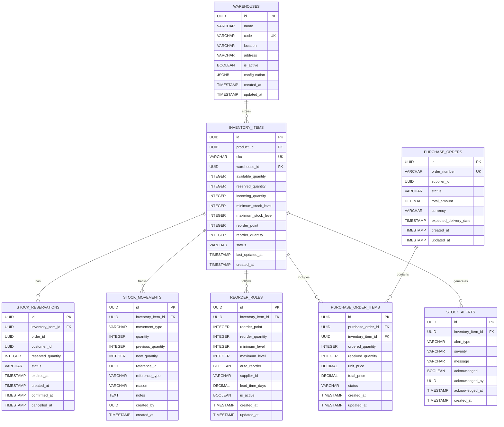

# Inventory Management Service Detailed Design Document

## Table of Contents

1. [Overview](#overview)
2. [Technical Specifications](#technical-specifications)
3. [Architecture Design](#architecture-design)
4. [API Design](#api-design)
5. [Database Design](#database-design)
6. [Inventory Management Design](#inventory-management-design)
7. [Inventory Tracking Design](#inventory-tracking-design)
8. [Error Handling](#error-handling)
9. [Test Design](#test-design)
10. [Local Development Environment](#local-development)
11. [Production Deployment](#production-deployment)
12. [Monitoring and Operations](#monitoring-operations)
13. [Incident Response](#incident-response)

## Overview

### Service Summary

The Inventory Management Service is a microservice responsible for handling the inventory management functions of the ski equipment e-commerce site. It provides all inventory-related features, including tracking, reservation, updating, replenishment, and monitoring of stock levels.

### Key Responsibilities

- **Inventory Management**: Managing, updating, and tracking product stock levels.
- **Inventory Reservation**: Allocating and managing stock for orders.
- **Inventory Replenishment**: Automatic replenishment and reorder point management.
- **Inventory Monitoring**: Monitoring stock levels and sending alerts.
- **Inventory History**: Tracking inventory changes and maintaining audit logs.
- **Warehouse Management**: Managing inventory across multiple warehouses.

### Business Value

- **Maximizing Sales Opportunities**: Maintaining appropriate stock levels.
- **Cost Optimization**: Preventing overstock and stockouts.
- **Improved Customer Satisfaction**: Providing accurate inventory information.
- **Operational Efficiency**: Automated inventory management.

## Technical Specifications

### Technology Stack

| Category | Technology/Library | Version | Purpose |
|---|---|---|---|
| **Runtime** | OpenJDK | 21 LTS | Java execution environment |
| **Framework** | Jakarta EE | 11 | Enterprise framework |
| **Application Server** | WildFly | 31.0.1 | Jakarta EE application server |
| **Persistence** | Jakarta Persistence (JPA) | 3.2 | ORM |
| **Data Access** | Jakarta Data | 1.0 | Repository abstraction |
| **REST API** | Jakarta REST (JAX-RS) | 4.0 | RESTful Web Services |
| **CDI** | Jakarta CDI | 4.1 | Dependency Injection and Management |
| **Validation** | Jakarta Validation | 3.1 | Bean Validation |
| **JSON Processing** | Jakarta JSON-P | 2.1 | JSON processing |
| **Database** | PostgreSQL | 16 | Primary database |
| **Cache** | Redis | 7.2 | Inventory caching |
| **Message Queue** | Apache Kafka | 3.7 | Inventory event processing |
| **Time Series DB** | InfluxDB | 2.7 | Inventory history data |
| **Monitoring** | MicroProfile Metrics | 5.1 | Metrics collection |
| **Tracing** | MicroProfile OpenTelemetry | 2.0 | Distributed tracing |
| **Health Check** | MicroProfile Health | 4.0 | Health checks |
| **Configuration** | MicroProfile Config | 3.1 | Configuration management |

### Excluded Technologies

- **Lombok**: Not used, to leverage Jakarta EE 11's Record classes and modern Java features.

### Java 21 LTS Features Utilized

- **Virtual Threads**: For highly concurrent inventory processing.
- **Record Classes**: For inventory data structures.
- **Pattern Matching**: For determining inventory status.
- **Text Blocks**: For defining complex SQL queries.
- **Sealed Classes**: For type safety of inventory events.

## Architecture Design

### System Architecture Diagram


### Domain Model Design

```java
// Inventory Item
@Entity
@Table(name = "inventory_items")
public class InventoryItem {
    
    @Id
    @GeneratedValue(strategy = GenerationType.UUID)
    private UUID id;
    
    @Column(name = "product_id", nullable = false)
    private UUID productId;
    
    @Column(name = "sku", unique = true, nullable = false)
    private String sku;
    
    @Column(name = "warehouse_id", nullable = false)
    private UUID warehouseId;
    
    @Column(name = "available_quantity", nullable = false)
    private Integer availableQuantity;
    
    @Column(name = "reserved_quantity", nullable = false)
    private Integer reservedQuantity = 0;
    
    @Column(name = "incoming_quantity", nullable = false)
    private Integer incomingQuantity = 0;
    
    @Column(name = "minimum_stock_level", nullable = false)
    private Integer minimumStockLevel;
    
    @Column(name = "maximum_stock_level", nullable = false)
    private Integer maximumStockLevel;
    
    @Column(name = "reorder_point", nullable = false)
    private Integer reorderPoint;
    
    @Column(name = "reorder_quantity", nullable = false)
    private Integer reorderQuantity;
    
    @Enumerated(EnumType.STRING)
    @Column(name = "status", nullable = false)
    private InventoryStatus status;
    
    @Column(name = "last_updated_at", nullable = false)
    private LocalDateTime lastUpdatedAt;
    
    @Column(name = "created_at", nullable = false)
    private LocalDateTime createdAt;
    
    // Related Entities
    @OneToMany(mappedBy = "inventoryItem", cascade = CascadeType.ALL, fetch = FetchType.LAZY)
    private List<StockMovement> stockMovements = new ArrayList<>();
    
    @OneToMany(mappedBy = "inventoryItem", cascade = CascadeType.ALL, fetch = FetchType.LAZY)
    private List<StockReservation> reservations = new ArrayList<>();
    
    // Business Logic
    public Integer getTotalQuantity() {
        return availableQuantity + reservedQuantity;
    }
    
    public boolean isLowStock() {
        return availableQuantity <= reorderPoint;
    }
    
    public boolean isOutOfStock() {
        return availableQuantity <= 0;
    }
    
    public boolean canReserve(Integer quantity) {
        return availableQuantity >= quantity;
    }
    
    public void reserveStock(Integer quantity) {
        if (!canReserve(quantity)) {
            throw new InsufficientStockException("Insufficient stock");
        }
        this.availableQuantity -= quantity;
        this.reservedQuantity += quantity;
        this.lastUpdatedAt = LocalDateTime.now();
    }
    
    public void releaseReservation(Integer quantity) {
        this.reservedQuantity = Math.max(0, this.reservedQuantity - quantity);
        this.availableQuantity += quantity;
        this.lastUpdatedAt = LocalDateTime.now();
    }
    
    public void confirmReservation(Integer quantity) {
        this.reservedQuantity = Math.max(0, this.reservedQuantity - quantity);
        this.lastUpdatedAt = LocalDateTime.now();
    }
}

// Stock Reservation
@Entity
@Table(name = "stock_reservations")
public class StockReservation {
    
    @Id
    @GeneratedValue(strategy = GenerationType.UUID)
    private UUID id;
    
    @ManyToOne(fetch = FetchType.LAZY)
    @JoinColumn(name = "inventory_item_id", nullable = false)
    private InventoryItem inventoryItem;
    
    @Column(name = "order_id")
    private UUID orderId;
    
    @Column(name = "customer_id")
    private UUID customerId;
    
    @Column(name = "reserved_quantity", nullable = false)
    private Integer reservedQuantity;
    
    @Enumerated(EnumType.STRING)
    @Column(name = "status", nullable = false)
    private ReservationStatus status;
    
    @Column(name = "expires_at", nullable = false)
    private LocalDateTime expiresAt;
    
    @Column(name = "created_at", nullable = false)
    private LocalDateTime createdAt;
    
    @Column(name = "confirmed_at")
    private LocalDateTime confirmedAt;
    
    public boolean isExpired() {
        return LocalDateTime.now().isAfter(expiresAt);
    }
    
    public boolean canConfirm() {
        return status == ReservationStatus.ACTIVE && !isExpired();
    }
}

// Stock Movement History
@Entity
@Table(name = "stock_movements")
public class StockMovement {
    
    @Id
    @GeneratedValue(strategy = GenerationType.UUID)
    private UUID id;
    
    @ManyToOne(fetch = FetchType.LAZY)
    @JoinColumn(name = "inventory_item_id", nullable = false)
    private InventoryItem inventoryItem;
    
    @Enumerated(EnumType.STRING)
    @Column(name = "movement_type", nullable = false)
    private MovementType movementType;
    
    @Column(name = "quantity", nullable = false)
    private Integer quantity;
    
    @Column(name = "reference_id")
    private UUID referenceId;
    
    @Column(name = "reference_type")
    private String referenceType;
    
    @Column(name = "reason")
    private String reason;
    
    @Column(name = "notes")
    private String notes;
    
    @Column(name = "created_by")
    private UUID createdBy;
    
    @Column(name = "created_at", nullable = false)
    private LocalDateTime createdAt;
}

// Record-based Value Objects
public record StockLevel(
    Integer available,
    Integer reserved,
    Integer incoming,
    Integer total
) {
    public static StockLevel from(InventoryItem item) {
        return new StockLevel(
            item.getAvailableQuantity(),
            item.getReservedQuantity(),
            item.getIncomingQuantity(),
            item.getTotalQuantity()
        );
    }
    
    public boolean isLow(Integer reorderPoint) {
        return available <= reorderPoint;
    }
    
    public boolean isOutOfStock() {
        return available <= 0;
    }
}

public record ReorderInfo(
    Integer reorderPoint,
    Integer reorderQuantity,
    Integer minimumLevel,
    Integer maximumLevel,
    boolean autoReorder
) {
    public boolean shouldReorder(Integer currentLevel) {
        return currentLevel <= reorderPoint;
    }
}

public record WarehouseInfo(
    UUID warehouseId,
    String warehouseName,
    String location,
    boolean isActive
) {}

// Sealed Classes for Events
public sealed interface InventoryEvent
    permits StockUpdatedEvent, StockReservedEvent, StockConfirmedEvent, 
            LowStockEvent, OutOfStockEvent, ReorderTriggeredEvent {
}

public record StockUpdatedEvent(
    UUID inventoryItemId,
    String sku,
    Integer previousQuantity,
    Integer newQuantity,
    MovementType movementType,
    String reason,
    LocalDateTime timestamp
) implements InventoryEvent {}

public record StockReservedEvent(
    UUID reservationId,
    UUID inventoryItemId,
    String sku,
    Integer quantity,
    UUID orderId,
    LocalDateTime expiresAt,
    LocalDateTime timestamp
) implements InventoryEvent {}

public record LowStockEvent(
    UUID inventoryItemId,
    String sku,
    Integer currentQuantity,
    Integer reorderPoint,
    LocalDateTime timestamp
) implements InventoryEvent {}

// Enums
public enum InventoryStatus {
    ACTIVE("Active"),
    INACTIVE("Inactive"),
    DISCONTINUED("Discontinued");
    
    private final String description;
    
    InventoryStatus(String description) {
        this.description = description;
    }
    
    public String getDescription() {
        return description;
    }
}

public enum ReservationStatus {
    ACTIVE("Active"),
    CONFIRMED("Confirmed"),
    CANCELLED("Cancelled"),
    EXPIRED("Expired");
    
    private final String description;
    
    ReservationStatus(String description) {
        this.description = description;
    }
    
    public String getDescription() {
        return description;
    }
}

public enum MovementType {
    INBOUND("Inbound"),
    OUTBOUND("Outbound"),
    ADJUSTMENT("Adjustment"),
    TRANSFER("Transfer"),
    RETURN("Return"),
    DAMAGE("Damage"),
    THEFT("Theft");
    
    private final String description;
    
    MovementType(String description) {
        this.description = description;
    }
    
    public String getDescription() {
        return description;
    }
}
```

### Service Layer Design

```java
// Inventory Service (CQRS Pattern compliant)
@ApplicationScoped
@Transactional
public class InventoryService {
    
    private static final Logger logger = LoggerFactory.getLogger(InventoryService.class);
    
    @Inject
    private InventoryItemRepository inventoryRepository;
    
    @Inject
    private StockMovementRepository movementRepository;
    
    @Inject
    private InventoryEventPublisher eventPublisher;
    
    @Inject
    private InventoryCacheService cacheService;
    
    @Inject
    private InventoryProcessingSaga inventoryProcessingSaga;
    
    // CQRS Command Handlers
    @CommandHandler
    public InventoryResult handle(ReserveInventoryCommand command) {
        try {
            var reservationId = UUID.randomUUID();
            var result = reserveStock(command.sku(), command.quantity(), 
                command.orderId(), command.customerId(), reservationId);
            
            if (result.success()) {
                eventPublisher.publish(new InventoryReservedEvent(
                    command.orderId(),
                    command.sku(),
                    command.quantity(),
                    reservationId,
                    LocalDateTime.now()
                ));
                
                logger.info("Inventory reservation completed: SKU={}, quantity={}, orderId={}, reservationId={}", 
                    command.sku(), command.quantity(), command.orderId(), reservationId);
            }
            
            return result;
        } catch (Exception e) {
            logger.error("Inventory reservation error: SKU=" + command.sku(), e);
            eventPublisher.publish(new InventoryReservationFailedEvent(
                command.orderId(),
                command.sku(),
                command.quantity(),
                e.getMessage(),
                LocalDateTime.now()
            ));
            
            return new InventoryResult(false, null, e.getMessage());
        }
    }
    
    @CommandHandler
    public InventoryResult handle(ReleaseInventoryCommand command) {
        try {
            var result = releaseReservation(command.reservationId(), command.reason());
            
            if (result.success()) {
                eventPublisher.publish(new InventoryReleasedEvent(
                    command.orderId(),
                    command.reservationId(),
                    command.reason(),
                    LocalDateTime.now()
                ));
                
                logger.info("Inventory release completed: reservationId={}, orderId={}", 
                    command.reservationId(), command.orderId());
            }
            
            return result;
        } catch (Exception e) {
            logger.error("Inventory release error: reservationId=" + command.reservationId(), e);
            return new InventoryResult(false, null, e.getMessage());
        }
    }
    
    @CommandHandler
    public InventoryResult handle(ConfirmInventoryCommand command) {
        try {
            var result = confirmReservation(command.reservationId());
            
            if (result.success()) {
                eventPublisher.publish(new InventoryConfirmedEvent(
                    command.orderId(),
                    command.reservationId(),
                    LocalDateTime.now()
                ));
                
                logger.info("Inventory confirmation completed: reservationId={}, orderId={}", 
                    command.reservationId(), command.orderId());
            }
            
            return result;
        } catch (Exception e) {
            logger.error("Inventory confirmation error: reservationId=" + command.reservationId(), e);
            return new InventoryResult(false, null, e.getMessage());
        }
    }
    
    @CommandHandler
    public InventoryResult handle(AdjustInventoryCommand command) {
        try {
            var result = adjustStock(command.sku(), command.newQuantity(), command.reason());
            
            if (result.success()) {
                eventPublisher.publish(new InventoryAdjustedEvent(
                    command.sku(),
                    command.previousQuantity(),
                    command.newQuantity(),
                    command.reason(),
                    LocalDateTime.now()
                ));
                
                logger.info("Inventory adjustment completed: SKU={}, oldQuantity={}, newQuantity={}", 
                    command.sku(), command.previousQuantity(), command.newQuantity());
            }
            
            return result;
        } catch (Exception e) {
            logger.error("Inventory adjustment error: SKU=" + command.sku(), e);
            return new InventoryResult(false, null, e.getMessage());
        }
    }
    
    // CQRS Query Handlers
    @QueryHandler
    public InventoryProjection handle(GetInventoryBySkuQuery query) {
        var item = findBySku(query.sku());
        return item.map(InventoryProjection::from)
            .orElse(null);
    }
    
    @QueryHandler
    public List<InventoryProjection> handle(GetLowStockItemsQuery query) {
        return inventoryRepository.findLowStockItems(query.threshold())
            .stream()
            .map(InventoryProjection::from)
            .toList();
    }
    
    @QueryHandler
    public List<StockMovementProjection> handle(GetStockMovementHistoryQuery query) {
        return movementRepository.findBySkuAndDateRange(
                query.sku(), query.fromDate(), query.toDate())
            .stream()
            .map(StockMovementProjection::from)
            .toList();
    }
    
    @QueryHandler
    public InventoryStatisticsProjection handle(GetInventoryStatisticsQuery query) {
        var totalItems = inventoryRepository.countAll();
        var lowStockItems = inventoryRepository.countLowStockItems(query.lowStockThreshold());
        var outOfStockItems = inventoryRepository.countOutOfStockItems();
        var totalValue = inventoryRepository.calculateTotalValue();
        
        return new InventoryStatisticsProjection(
            totalItems,
            lowStockItems,
            outOfStockItems,
            totalValue,
            LocalDateTime.now()
        );
    }
    
    // Event Handlers
    @EventHandler
    public void handle(OrderCreatedEvent event) {
        logger.info("Processing order creation event: orderId={}", event.orderId());
        
        CompletableFuture.runAsync(() -> {
            try {
                inventoryProcessingSaga.processOrderInventoryReservation(
                    event.orderId(),
                    event.orderItems()
                );
            } catch (Exception e) {
                logger.error("Inventory reservation saga execution error: orderId=" + event.orderId(), e);
            }
        }, VirtualThread.ofVirtual().factory());
    }
    
    @EventHandler
    public void handle(OrderCancelledEvent event) {
        logger.info("Processing order cancellation event: orderId={}", event.orderId());
        
        CompletableFuture.runAsync(() -> {
            try {
                inventoryProcessingSaga.processOrderInventoryRelease(
                    event.orderId(),
                    event.reason()
                );
            } catch (Exception e) {
                logger.error("Inventory release saga execution error: orderId=" + event.orderId(), e);
            }
        }, VirtualThread.ofVirtual().factory());
    }
    
    public Optional<InventoryItem> findBySku(String sku) {
        // Attempt to get from cache
        var cached = cacheService.getInventoryItem(sku);
        if (cached.isPresent()) {
            return cached;
        }
        
        // Get from database
        var item = inventoryRepository.findBySku(sku);
        if (item.isPresent()) {
            cacheService.cacheInventoryItem(item.get());
        }
        
        return item;
    }
    
    public StockLevel getStockLevel(String sku) {
        var item = findBySku(sku)
            .orElseThrow(() -> new InventoryNotFoundException("SKU not found: " + sku));
        
        return StockLevel.from(item);
    }
    
    public void updateStock(String sku, Integer quantity, MovementType movementType, String reason) {
        var item = findBySku(sku)
            .orElseThrow(() -> new InventoryNotFoundException("SKU not found: " + sku));
        
        var previousQuantity = item.getAvailableQuantity();
        
        // Update stock
        switch (movementType) {
            case INBOUND -> item.setAvailableQuantity(item.getAvailableQuantity() + quantity);
            case OUTBOUND -> {
                if (item.getAvailableQuantity() < quantity) {
                    throw new InsufficientStockException("Insufficient stock");
                }
                item.setAvailableQuantity(item.getAvailableQuantity() - quantity);
            }
            case ADJUSTMENT -> item.setAvailableQuantity(quantity);
            default -> throw new UnsupportedOperationException("Unsupported movement type: " + movementType);
        }
        
        item.setLastUpdatedAt(LocalDateTime.now());
        
        // Record stock movement history
        var movement = new StockMovement();
        movement.setInventoryItem(item);
        movement.setMovementType(movementType);
        movement.setQuantity(quantity);
        movement.setReason(reason);
        movement.setCreatedAt(LocalDateTime.now());
        
        movementRepository.save(movement);
        inventoryRepository.save(item);
        
        // Update cache
        cacheService.updateInventoryItem(item);
        
        // Publish event
        eventPublisher.publish(new StockUpdatedEvent(
            item.getId(),
            item.getSku(),
            previousQuantity,
            item.getAvailableQuantity(),
            movementType,
            reason,
            LocalDateTime.now()
        ));
        
        // Check for low stock
        checkLowStock(item);
        
        logger.info("Stock updated for SKU: {}, Movement: {}, Quantity: {}", 
            sku, movementType, quantity);
    }
    
    private void checkLowStock(InventoryItem item) {
        if (item.isLowStock()) {
            eventPublisher.publish(new LowStockEvent(
                item.getId(),
                item.getSku(),
                item.getAvailableQuantity(),
                item.getReorderPoint(),
                LocalDateTime.now()
            ));
        }
        
        if (item.isOutOfStock()) {
            eventPublisher.publish(new OutOfStockEvent(
                item.getId(),
                item.getSku(),
                LocalDateTime.now()
            ));
        }
    }
    
    public List<InventoryItem> findLowStockItems() {
        return inventoryRepository.findLowStockItems();
    }
    
    public List<InventoryItem> findByWarehouse(UUID warehouseId) {
        return inventoryRepository.findByWarehouseId(warehouseId);
    }
    
    public InventoryStatistics getInventoryStatistics() {
        var totalItems = inventoryRepository.count();
        var lowStockCount = inventoryRepository.countLowStockItems();
        var outOfStockCount = inventoryRepository.countOutOfStockItems();
        var totalValue = inventoryRepository.calculateTotalInventoryValue();
        
        return new InventoryStatistics(
            totalItems,
            lowStockCount,
            outOfStockCount,
            totalValue
        );
    }
}

// Inventory Processing Saga Pattern
@ApplicationScoped
@Transactional
public class InventoryProcessingSaga {
    
    private static final Logger logger = LoggerFactory.getLogger(InventoryProcessingSaga.class);
    
    @Inject
    private InventoryItemRepository inventoryRepository;
    
    @Inject
    private StockReservationRepository reservationRepository;
    
    @Inject
    private SagaStateRepository sagaStateRepository;
    
    @Inject
    private InventoryEventPublisher eventPublisher;
    
    public CompletableFuture<SagaResult> processOrderInventoryReservation(
            UUID orderId, List<OrderItemDto> orderItems) {
        
        return CompletableFuture.supplyAsync(() -> {
            var sagaId = UUID.randomUUID();
            var sagaState = new SagaState(sagaId, orderId, SagaType.INVENTORY_RESERVATION);
            sagaStateRepository.save(sagaState);
            
            try {
                logger.info("Starting inventory reservation saga: sagaId={}, orderId={}", sagaId, orderId);
                sagaState.setCurrentStep("VALIDATING_INVENTORY");
                
                // Step 1: Validate inventory
                var validationResult = validateInventoryAvailability(orderItems);
                if (!validationResult.success()) {
                    return handleSagaFailure(sagaState, "Inventory validation failed", validationResult.message());
                }
                sagaState.setLastCompletedStep("VALIDATING_INVENTORY");
                
                // Step 2: Reserve inventory
                sagaState.setCurrentStep("RESERVING_INVENTORY");
                var reservationResult = reserveInventoryItems(orderId, orderItems);
                if (!reservationResult.success()) {
                    return handleSagaFailure(sagaState, "Inventory reservation failed", reservationResult.message());
                }
                sagaState.setLastCompletedStep("RESERVING_INVENTORY");
                
                // Step 3: Send reservation confirmation events
                sagaState.setCurrentStep("PUBLISHING_EVENTS");
                publishInventoryReservedEvents(orderId, orderItems, reservationResult.reservationIds());
                sagaState.setLastCompletedStep("PUBLISHING_EVENTS");
                
                // Saga complete
                sagaState.complete();
                sagaStateRepository.save(sagaState);
                
                logger.info("Inventory reservation saga completed: sagaId={}, orderId={}", sagaId, orderId);
                return new SagaResult(true, "Inventory reservation completed");
                
            } catch (Exception e) {
                logger.error("Inventory reservation saga execution error: sagaId=" + sagaId, e);
                return handleSagaFailure(sagaState, "Unexpected error", e.getMessage());
            }
        }, VirtualThread.ofVirtual().factory());
    }
    
    public CompletableFuture<SagaResult> processOrderInventoryRelease(
            UUID orderId, String reason) {
        
        return CompletableFuture.supplyAsync(() -> {
            var sagaId = UUID.randomUUID();
            var sagaState = new SagaState(sagaId, orderId, SagaType.INVENTORY_RELEASE);
            sagaStateRepository.save(sagaState);
            
            try {
                logger.info("Starting inventory release saga: sagaId={}, orderId={}", sagaId, orderId);
                
                // Step 1: Find reservations
                sagaState.setCurrentStep("FINDING_RESERVATIONS");
                var reservations = reservationRepository.findByOrderId(orderId);
                if (reservations.isEmpty()) {
                    logger.warn("No reservations found: orderId={}", orderId);
                    sagaState.complete();
                    sagaStateRepository.save(sagaState);
                    return new SagaResult(true, "No reservations - processing complete");
                }
                sagaState.setLastCompletedStep("FINDING_RESERVATIONS");
                
                // Step 2: Release reservations
                sagaState.setCurrentStep("RELEASING_RESERVATIONS");
                var releaseResult = releaseInventoryReservations(reservations, reason);
                if (!releaseResult.success()) {
                    return handleSagaFailure(sagaState, "Reservation release failed", releaseResult.message());
                }
                sagaState.setLastCompletedStep("RELEASING_RESERVATIONS");
                
                // Step 3: Send release events
                sagaState.setCurrentStep("PUBLISHING_EVENTS");
                publishInventoryReleasedEvents(orderId, reservations, reason);
                sagaState.setLastCompletedStep("PUBLISHING_EVENTS");
                
                // Saga complete
                sagaState.complete();
                sagaStateRepository.save(sagaState);
                
                logger.info("Inventory release saga completed: sagaId={}, orderId={}", sagaId, orderId);
                return new SagaResult(true, "Inventory release completed");
                
            } catch (Exception e) {
                logger.error("Inventory release saga execution error: sagaId=" + sagaId, e);
                return handleSagaFailure(sagaState, "Unexpected error", e.getMessage());
            }
        }, VirtualThread.ofVirtual().factory());
    }
    
    // Saga Compensation
    public CompletableFuture<SagaResult> compensateInventoryReservation(UUID sagaId) {
        return CompletableFuture.supplyAsync(() -> {
            try {
                var sagaState = sagaStateRepository.findById(sagaId)
                    .orElseThrow(() -> new IllegalArgumentException("Saga not found: " + sagaId));
                
                logger.info("Starting inventory reservation compensation: sagaId={}, orderId={}", sagaId, sagaState.getOrderId());
                sagaState.setStatus(SagaStatus.COMPENSATING);
                
                var lastCompletedStep = sagaState.getLastCompletedStep();
                
                // Compensate in reverse order
                if ("PUBLISHING_EVENTS".equals(lastCompletedStep)) {
                    // Event compensation is usually not needed (handled by idempotency)
                }
                
                if ("RESERVING_INVENTORY".equals(lastCompletedStep) || 
                    "PUBLISHING_EVENTS".equals(lastCompletedStep)) {
                    // Release inventory reservation
                    var reservations = reservationRepository.findByOrderId(sagaState.getOrderId());
                    if (!reservations.isEmpty()) {
                        releaseInventoryReservations(reservations, "Saga compensation release");
                        logger.info("Inventory reservation compensation completed: sagaId={}", sagaId);
                    }
                }
                
                sagaState.setStatus(SagaStatus.COMPENSATED);
                sagaStateRepository.save(sagaState);
                
                return new SagaResult(true, "Compensation completed");
                
            } catch (Exception e) {
                logger.error("Inventory reservation compensation error: sagaId=" + sagaId, e);
                return new SagaResult(false, "Compensation failed: " + e.getMessage());
            }
        }, VirtualThread.ofVirtual().factory());
    }
    
    // Private helper methods
    private SagaStepResult validateInventoryAvailability(List<OrderItemDto> orderItems) {
        for (var item : orderItems) {
            var inventoryItem = inventoryRepository.findBySku(item.sku());
            if (inventoryItem.isEmpty()) {
                return new SagaStepResult(false, "Product not found: " + item.sku());
            }
            
            if (!inventoryItem.get().canReserve(item.quantity())) {
                return new SagaStepResult(false, "Insufficient stock: " + item.sku());
            }
        }
        
        return new SagaStepResult(true, "Inventory check completed");
    }
    
    private InventoryReservationResult reserveInventoryItems(UUID orderId, List<OrderItemDto> orderItems) {
        var reservationIds = new ArrayList<UUID>();
        
        try {
            for (var item : orderItems) {
                var inventoryItem = inventoryRepository.findBySku(item.sku())
                    .orElseThrow(() -> new InventoryNotFoundException("SKU not found: " + item.sku()));
                
                // Execute stock reservation
                inventoryItem.reserveStock(item.quantity());
                inventoryRepository.save(inventoryItem);
                
                // Create reservation record
                var reservation = new StockReservation();
                reservation.setInventoryItem(inventoryItem);
                reservation.setOrderId(orderId);
                reservation.setQuantity(item.quantity());
                reservation.setStatus(ReservationStatus.RESERVED);
                reservation.setCreatedAt(LocalDateTime.now());
                reservation.setExpiresAt(LocalDateTime.now().plusMinutes(30));
                
                reservationRepository.save(reservation);
                reservationIds.add(reservation.getId());
            }
            
            return new InventoryReservationResult(true, reservationIds, "Reservation completed");
            
        } catch (Exception e) {
            // Rollback partial reservations
            rollbackPartialReservations(reservationIds);
            return new InventoryReservationResult(false, Collections.emptyList(), e.getMessage());
        }
    }
    
    private SagaStepResult releaseInventoryReservations(List<StockReservation> reservations, String reason) {
        try {
            for (var reservation : reservations) {
                if (reservation.getStatus() == ReservationStatus.RESERVED) {
                    var inventoryItem = reservation.getInventoryItem();
                    inventoryItem.releaseReservation(reservation.getQuantity());
                    inventoryRepository.save(inventoryItem);
                    
                    reservation.setStatus(ReservationStatus.RELEASED);
                    reservation.setReleasedAt(LocalDateTime.now());
                    reservation.setReleaseReason(reason);
                    reservationRepository.save(reservation);
                }
            }
            
            return new SagaStepResult(true, "Reservation release completed");
            
        } catch (Exception e) {
            return new SagaStepResult(false, "Reservation release error: " + e.getMessage());
        }
    }
    
    private void publishInventoryReservedEvents(UUID orderId, List<OrderItemDto> orderItems, 
            List<UUID> reservationIds) {
        
        for (int i = 0; i < orderItems.size(); i++) {
            var item = orderItems.get(i);
            var reservationId = i < reservationIds.size() ? reservationIds.get(i) : null;
            
            eventPublisher.publish(new InventoryReservedEvent(
                orderId,
                item.sku(),
                item.quantity(),
                reservationId,
                LocalDateTime.now()
            ));
        }
    }
    
    private void publishInventoryReleasedEvents(UUID orderId, List<StockReservation> reservations, 
            String reason) {
        
        for (var reservation : reservations) {
            eventPublisher.publish(new InventoryReleasedEvent(
                orderId,
                reservation.getId(),
                reason,
                LocalDateTime.now()
            ));
        }
    }
    
    private void rollbackPartialReservations(List<UUID> reservationIds) {
        for (var reservationId : reservationIds) {
            try {
                var reservation = reservationRepository.findById(reservationId);
                if (reservation.isPresent()) {
                    var inventoryItem = reservation.get().getInventoryItem();
                    inventoryItem.releaseReservation(reservation.get().getQuantity());
                    inventoryRepository.save(inventoryItem);
                    
                    reservationRepository.delete(reservation.get());
                }
            } catch (Exception e) {
                logger.error("Reservation rollback error: reservationId=" + reservationId, e);
            }
        }
    }
    
    private SagaResult handleSagaFailure(SagaState sagaState, String reason, String message) {
        sagaState.fail(reason + ": " + message);
        sagaStateRepository.save(sagaState);
        
        // Execute compensation asynchronously
        CompletableFuture.runAsync(() -> {
            try {
                compensateInventoryReservation(sagaState.getId()).get();
            } catch (Exception e) {
                logger.error("Saga compensation execution error: sagaId=" + sagaState.getId(), e);
            }
        }, VirtualThread.ofVirtual().factory());
        
        return new SagaResult(false, reason + ": " + message);
    }
}

// Stock Reservation Service
@ApplicationScoped
@Transactional
public class StockReservationService {
    
    private static final Logger logger = LoggerFactory.getLogger(StockReservationService.class);
    
    @Inject
    private InventoryService inventoryService;
    
    @Inject
    private StockReservationRepository reservationRepository;
    
    @Inject
    private InventoryEventPublisher eventPublisher;
    
    @ConfigProperty(name = "reservation.default.expiration", defaultValue = "PT30M")
    private Duration defaultReservationDuration;
    
    public StockReservation reserveStock(ReservationRequest request) {
        var item = inventoryService.findBySku(request.sku())
            .orElseThrow(() -> new InventoryNotFoundException("SKU not found: " + request.sku()));
        
        if (!item.canReserve(request.quantity())) {
            throw new InsufficientStockException("Insufficient stock: " + request.sku());
        }
        
        // Reserve stock
        item.reserveStock(request.quantity());
        
        var reservation = new StockReservation();
        reservation.setInventoryItem(item);
        reservation.setOrderId(request.orderId());
        reservation.setCustomerId(request.customerId());
        reservation.setReservedQuantity(request.quantity());
        reservation.setStatus(ReservationStatus.ACTIVE);
        reservation.setExpiresAt(LocalDateTime.now().plus(defaultReservationDuration));
        reservation.setCreatedAt(LocalDateTime.now());
        
        reservationRepository.save(reservation);
        
        // Publish event
        eventPublisher.publish(new StockReservedEvent(
            reservation.getId(),
            item.getId(),
            item.getSku(),
            request.quantity(),
            request.orderId(),
            reservation.getExpiresAt(),
            LocalDateTime.now()
        ));
        
        logger.info("Stock reserved: SKU={}, Quantity={}, OrderId={}", 
            request.sku(), request.quantity(), request.orderId());
        
        return reservation;
    }
    
    public void confirmReservation(UUID reservationId) {
        var reservation = reservationRepository.findById(reservationId)
            .orElseThrow(() -> new ReservationNotFoundException("Reservation not found: " + reservationId));
        
        if (!reservation.canConfirm()) {
            throw new InvalidReservationStateException("Cannot confirm reservation");
        }
        
        var item = reservation.getInventoryItem();
        item.confirmReservation(reservation.getReservedQuantity());
        
        reservation.setStatus(ReservationStatus.CONFIRMED);
        reservation.setConfirmedAt(LocalDateTime.now());
        
        reservationRepository.save(reservation);
        
        // Publish event
        eventPublisher.publish(new StockConfirmedEvent(
            reservation.getId(),
            item.getId(),
            item.getSku(),
            reservation.getReservedQuantity(),
            reservation.getOrderId(),
            LocalDateTime.now()
        ));
        
        logger.info("Reservation confirmed: ReservationId={}, SKU={}", 
            reservationId, item.getSku());
    }
    
    public void cancelReservation(UUID reservationId, String reason) {
        var reservation = reservationRepository.findById(reservationId)
            .orElseThrow(() -> new ReservationNotFoundException("Reservation not found: " + reservationId));
        
        if (reservation.getStatus() != ReservationStatus.ACTIVE) {
            throw new InvalidReservationStateException("Cannot cancel reservation");
        }
        
        var item = reservation.getInventoryItem();
        item.releaseReservation(reservation.getReservedQuantity());
        
        reservation.setStatus(ReservationStatus.CANCELLED);
        
        reservationRepository.save(reservation);
        
        logger.info("Reservation cancelled: ReservationId={}, Reason={}", 
            reservationId, reason);
    }
    
    // Automatic cancellation of expired reservations
    @Schedule(every = "PT5M") // every 5 minutes
    public void cleanupExpiredReservations() {
        var expiredReservations = reservationRepository.findExpiredReservations();
        
        for (var reservation : expiredReservations) {
            try {
                cancelReservation(reservation.getId(), "Automatic cancellation due to expiration");
            } catch (Exception e) {
                logger.error("Failed to cancel expired reservation: {}", reservation.getId(), e);
            }
        }
        
        if (!expiredReservations.isEmpty()) {
            logger.info("Cleaned up {} expired reservations", expiredReservations.size());
        }
    }
}
```

## API Design

### OpenAPI 3.1 Specification

```yaml
# inventory-management-api.yml
openapi: 3.1.0
info:
  title: Inventory Management Service API
  version: 1.0.0
  description: Ski Shop Inventory Management Service

servers:
  - url: https://api.ski-shop.com/v1/inventory
    description: Production server
  - url: https://staging.api.ski-shop.com/v1/inventory
    description: Staging server
  - url: http://localhost:8084
    description: Local development

paths:
  /items/{sku}/stock:
    get:
      summary: Get Stock Level
      operationId: getStockLevel
      tags: [Stock Management]
      parameters:
        - name: sku
          in: path
          required: true
          schema:
            type: string
          example: "SKI-ROSSIGNOL-HERO-165"
      responses:
        '200':
          description: Stock level information
          content:
            application/json:
              schema:
                $ref: '#/components/schemas/StockLevelResponse'
        '404':
          description: SKU not found

    put:
      summary: Update Stock Level
      operationId: updateStockLevel
      tags: [Stock Management]
      security:
        - BearerAuth: []
      parameters:
        - name: sku
          in: path
          required: true
          schema:
            type: string
      requestBody:
        required: true
        content:
          application/json:
            schema:
              $ref: '#/components/schemas/StockUpdateRequest'
      responses:
        '200':
          description: Stock update successful
          content:
            application/json:
              schema:
                $ref: '#/components/schemas/StockLevelResponse'
        '400':
          description: Invalid request
        '404':
          description: SKU not found

  /items/bulk-check:
    post:
      summary: Bulk Stock Check
      operationId: bulkStockCheck
      tags: [Stock Management]
      requestBody:
        required: true
        content:
          application/json:
            schema:
              $ref: '#/components/schemas/BulkStockCheckRequest'
      responses:
        '200':
          description: Bulk SKU stock information
          content:
            application/json:
              schema:
                $ref: '#/components/schemas/BulkStockCheckResponse'

  /reservations:
    post:
      summary: Reserve Stock
      operationId: reserveStock
      tags: [Reservations]
      security:
        - BearerAuth: []
      requestBody:
        required: true
        content:
          application/json:
            schema:
              $ref: '#/components/schemas/StockReservationRequest'
      responses:
        '201':
          description: Reservation created successfully
          content:
            application/json:
              schema:
                $ref: '#/components/schemas/StockReservationResponse'
        '400':
          description: Insufficient stock or invalid request
        '404':
          description: SKU not found

  /reservations/{reservationId}/confirm:
    post:
      summary: Confirm Stock Reservation
      operationId: confirmReservation
      tags: [Reservations]
      security:
        - BearerAuth: []
      parameters:
        - name: reservationId
          in: path
          required: true
          schema:
            type: string
            format: uuid
      responses:
        '200':
          description: Reservation confirmed successfully
        '400':
          description: Cannot confirm reservation
        '404':
          description: Reservation not found

  /reservations/{reservationId}/cancel:
    post:
      summary: Cancel Stock Reservation
      operationId: cancelReservation
      tags: [Reservations]
      security:
        - BearerAuth: []
      parameters:
        - name: reservationId
          in: path
          required: true
          schema:
            type: string
            format: uuid
      requestBody:
        required: true
        content:
          application/json:
            schema:
              $ref: '#/components/schemas/CancelReservationRequest'
      responses:
        '200':
          description: Reservation cancelled successfully
        '404':
          description: Reservation not found

  /items/low-stock:
    get:
      summary: List of Low Stock Items
      operationId: getLowStockItems
      tags: [Stock Management]
      security:
        - BearerAuth: []
      parameters:
        - name: warehouse
          in: query
          schema:
            type: string
            format: uuid
        - name: category
          in: query
          schema:
            type: string
        - name: limit
          in: query
          schema:
            type: integer
            default: 50
      responses:
        '200':
          description: List of low stock items
          content:
            application/json:
              schema:
                $ref: '#/components/schemas/LowStockItemsResponse'

  /warehouses/{warehouseId}/items:
    get:
      summary: Warehouse Inventory List
      operationId: getWarehouseInventory
      tags: [Warehouse Management]
      security:
        - BearerAuth: []
      parameters:
        - name: warehouseId
          in: path
          required: true
          schema:
            type: string
            format: uuid
        - name: page
          in: query
          schema:
            type: integer
            default: 0
        - name: size
          in: query
          schema:
            type: integer
            default: 20
      responses:
        '200':
          description: Warehouse inventory list
          content:
            application/json:
              schema:
                $ref: '#/components/schemas/WarehouseInventoryResponse'

  /items/{sku}/movements:
    get:
      summary: Stock Movement History
      operationId: getStockMovementHistory
      tags: [Stock Tracking]
      security:
        - BearerAuth: []
      parameters:
        - name: sku
          in: path
          required: true
          schema:
            type: string
        - name: from
          in: query
          schema:
            type: string
            format: date
        - name: to
          in: query
          schema:
            type: string
            format: date
        - name: movementType
          in: query
          schema:
            type: string
            enum: [INBOUND, OUTBOUND, ADJUSTMENT, TRANSFER, RETURN, DAMAGE, THEFT]
      responses:
        '200':
          description: Stock movement history
          content:
            application/json:
              schema:
                $ref: '#/components/schemas/StockMovementHistoryResponse'

  /statistics:
    get:
      summary: Inventory Statistics
      operationId: getInventoryStatistics
      tags: [Analytics]
      security:
        - BearerAuth: []
      responses:
        '200':
          description: Inventory statistics
          content:
            application/json:
              schema:
                $ref: '#/components/schemas/InventoryStatisticsResponse'

components:
  schemas:
    StockLevelResponse:
      type: object
      properties:
        sku:
          type: string
          example: "SKI-ROSSIGNOL-HERO-165"
        available:
          type: integer
          example: 25
        reserved:
          type: integer
          example: 5
        incoming:
          type: integer
          example: 10
        total:
          type: integer
          example: 40
        warehouse:
          $ref: '#/components/schemas/WarehouseInfo'
        reorderInfo:
          $ref: '#/components/schemas/ReorderInfo'
        status:
          type: string
          enum: [ACTIVE, INACTIVE, DISCONTINUED]
        lastUpdated:
          type: string
          format: date-time

    StockUpdateRequest:
      type: object
      required:
        - quantity
        - movementType
      properties:
        quantity:
          type: integer
          minimum: 0
          example: 10
        movementType:
          type: string
          enum: [INBOUND, OUTBOUND, ADJUSTMENT, TRANSFER, RETURN, DAMAGE, THEFT]
          example: "INBOUND"
        reason:
          type: string
          example: "New stock arrival"
        referenceId:
          type: string
          format: uuid
          example: "123e4567-e89b-12d3-a456-426614174000"
        referenceType:
          type: string
          example: "PURCHASE_ORDER"
        notes:
          type: string
          example: "Inspection complete"

    BulkStockCheckRequest:
      type: object
      required:
        - items
      properties:
        items:
          type: array
          items:
            type: object
            required:
              - sku
              - quantity
            properties:
              sku:
                type: string
              quantity:
                type: integer
          example:
            - sku: "SKI-ROSSIGNOL-HERO-165"
              quantity: 2
            - sku: "BOOT-SALOMON-PRO-27"
              quantity: 1

    BulkStockCheckResponse:
      type: object
      properties:
        results:
          type: array
          items:
            type: object
            properties:
              sku:
                type: string
              available:
                type: integer
              canFulfill:
                type: boolean
              shortfall:
                type: integer

    StockReservationRequest:
      type: object
      required:
        - sku
        - quantity
        - orderId
      properties:
        sku:
          type: string
          example: "SKI-ROSSIGNOL-HERO-165"
        quantity:
          type: integer
          minimum: 1
          example: 2
        orderId:
          type: string
          format: uuid
          example: "123e4567-e89b-12d3-a456-426614174000"
        customerId:
          type: string
          format: uuid
          example: "123e4567-e89b-12d3-a456-426614174000"
        expirationMinutes:
          type: integer
          minimum: 1
          maximum: 1440
          default: 30
          example: 30

    StockReservationResponse:
      type: object
      properties:
        reservationId:
          type: string
          format: uuid
        sku:
          type: string
        quantity:
          type: integer
        status:
          type: string
          enum: [ACTIVE, CONFIRMED, CANCELLED, EXPIRED]
        expiresAt:
          type: string
          format: date-time
        createdAt:
          type: string
          format: date-time

    WarehouseInfo:
      type: object
      properties:
        warehouseId:
          type: string
          format: uuid
        name:
          type: string
        location:
          type: string
        isActive:
          type: boolean

    ReorderInfo:
      type: object
      properties:
        reorderPoint:
          type: integer
        reorderQuantity:
          type: integer
        minimumLevel:
          type: integer
        maximumLevel:
          type: integer
        autoReorder:
          type: boolean

  securitySchemes:
    BearerAuth:
      type: http
      scheme: bearer
      bearerFormat: JWT
```

## Database Design

### ERD (Entity Relationship Diagram)



### Detailed Entity Design

```java
// Warehouse Entity
@Entity
@Table(name = "warehouses")
public class Warehouse {
    
    @Id
    @GeneratedValue(strategy = GenerationType.UUID)
    private UUID id;
    
    @Column(name = "name", nullable = false)
    private String name;
    
    @Column(name = "code", unique = true, nullable = false)
    private String code;
    
    @Column(name = "location")
    private String location;
    
    @Column(name = "address")
    private String address;
    
    @Column(name = "is_active", nullable = false)
    private Boolean isActive = true;
    
    @Column(name = "configuration", columnDefinition = "JSONB")
    private String configuration;
    
    @Column(name = "created_at", nullable = false)
    private LocalDateTime createdAt;
    
    @Column(name = "updated_at")
    private LocalDateTime updatedAt;
    
    // Related Entities
    @OneToMany(mappedBy = "warehouse", cascade = CascadeType.ALL, fetch = FetchType.LAZY)
    private List<InventoryItem> inventoryItems = new ArrayList<>();
}

// Reorder Rule Entity
@Entity
@Table(name = "reorder_rules")
public class ReorderRule {
    
    @Id
    @GeneratedValue(strategy = GenerationType.UUID)
    private UUID id;
    
    @OneToOne(fetch = FetchType.LAZY)
    @JoinColumn(name = "inventory_item_id", nullable = false)
    private InventoryItem inventoryItem;
    
    @Column(name = "reorder_point", nullable = false)
    private Integer reorderPoint;
    
    @Column(name = "reorder_quantity", nullable = false)
    private Integer reorderQuantity;
    
    @Column(name = "minimum_level", nullable = false)
    private Integer minimumLevel;
    
    @Column(name = "maximum_level", nullable = false)
    private Integer maximumLevel;
    
    @Column(name = "auto_reorder", nullable = false)
    private Boolean autoReorder = false;
    
    @Column(name = "supplier_id")
    private UUID supplierId;
    
    @Column(name = "lead_time_days", precision = 5, scale = 2)
    private BigDecimal leadTimeDays;
    
    @Column(name = "is_active", nullable = false)
    private Boolean isActive = true;
    
    @Column(name = "created_at", nullable = false)
    private LocalDateTime createdAt;
    
    @Column(name = "updated_at")
    private LocalDateTime updatedAt;
    
    public boolean shouldTriggerReorder(Integer currentStock) {
        return isActive && autoReorder && currentStock <= reorderPoint;
    }
}

// Purchase Order Entity
@Entity
@Table(name = "purchase_orders")
public class PurchaseOrder {
    
    @Id
    @GeneratedValue(strategy = GenerationType.UUID)
    private UUID id;
    
    @Column(name = "order_number", unique = true, nullable = false)
    private String orderNumber;
    
    @Column(name = "supplier_id", nullable = false)
    private UUID supplierId;
    
    @Enumerated(EnumType.STRING)
    @Column(name = "status", nullable = false)
    private PurchaseOrderStatus status;
    
    @Column(name = "total_amount", precision = 12, scale = 2)
    private BigDecimal totalAmount;
    
    @Column(name = "currency", length = 3)
    private String currency = "JPY";
    
    @Column(name = "expected_delivery_date")
    private LocalDate expectedDeliveryDate;
    
    @Column(name = "created_at", nullable = false)
    private LocalDateTime createdAt;
    
    @Column(name = "updated_at")
    private LocalDateTime updatedAt;
    
    // Related Entities
    @OneToMany(mappedBy = "purchaseOrder", cascade = CascadeType.ALL, fetch = FetchType.LAZY)
    private List<PurchaseOrderItem> items = new ArrayList<>();
}

// Purchase Order Item Entity
@Entity
@Table(name = "purchase_order_items")
public class PurchaseOrderItem {
    
    @Id
    @GeneratedValue(strategy = GenerationType.UUID)
    private UUID id;
    
    @ManyToOne(fetch = FetchType.LAZY)
    @JoinColumn(name = "purchase_order_id", nullable = false)
    private PurchaseOrder purchaseOrder;
    
    @ManyToOne(fetch = FetchType.LAZY)
    @JoinColumn(name = "inventory_item_id", nullable = false)
    private InventoryItem inventoryItem;
    
    @Column(name = "ordered_quantity", nullable = false)
    private Integer orderedQuantity;
    
    @Column(name = "received_quantity", nullable = false)
    private Integer receivedQuantity = 0;
    
    @Column(name = "unit_price", precision = 10, scale = 2)
    private BigDecimal unitPrice;
    
    @Column(name = "total_price", precision = 12, scale = 2)
    private BigDecimal totalPrice;
    
    @Enumerated(EnumType.STRING)
    @Column(name = "status", nullable = false)
    private PurchaseOrderItemStatus status;
    
    @Column(name = "created_at", nullable = false)
    private LocalDateTime createdAt;
    
    @Column(name = "updated_at")
    private LocalDateTime updatedAt;
    
    public boolean isFullyReceived() {
        return receivedQuantity.equals(orderedQuantity);
    }
    
    public Integer getPendingQuantity() {
        return orderedQuantity - receivedQuantity;
    }
}

// Stock Alert Entity
@Entity
@Table(name = "stock_alerts")
public class StockAlert {
    
    @Id
    @GeneratedValue(strategy = GenerationType.UUID)
    private UUID id;
    
    @ManyToOne(fetch = FetchType.LAZY)
    @JoinColumn(name = "inventory_item_id", nullable = false)
    private InventoryItem inventoryItem;
    
    @Enumerated(EnumType.STRING)
    @Column(name = "alert_type", nullable = false)
    private AlertType alertType;
    
    @Enumerated(EnumType.STRING)
    @Column(name = "severity", nullable = false)
    private AlertSeverity severity;
    
    @Column(name = "message", nullable = false)
    private String message;
    
    @Column(name = "acknowledged", nullable = false)
    private Boolean acknowledged = false;
    
    @Column(name = "acknowledged_by")
    private UUID acknowledgedBy;
    
    @Column(name = "acknowledged_at")
    private LocalDateTime acknowledgedAt;
    
    @Column(name = "created_at", nullable = false)
    private LocalDateTime createdAt;
}

// Repository Design (Utilizing Jakarta Data)
```
