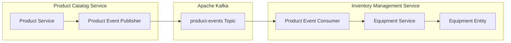
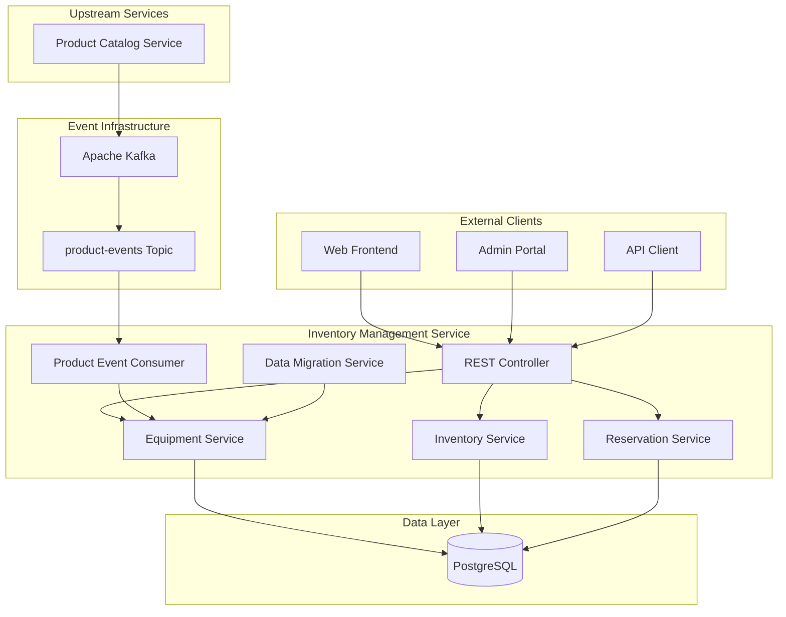
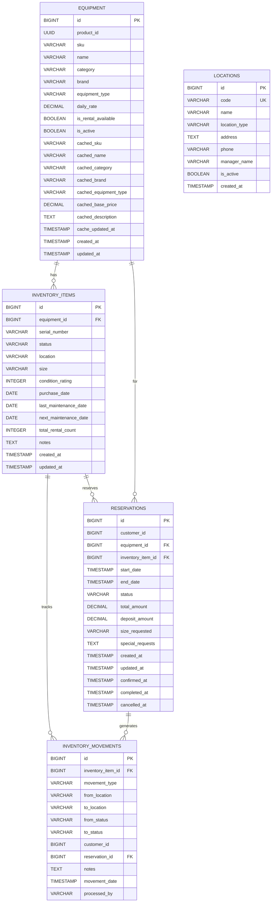
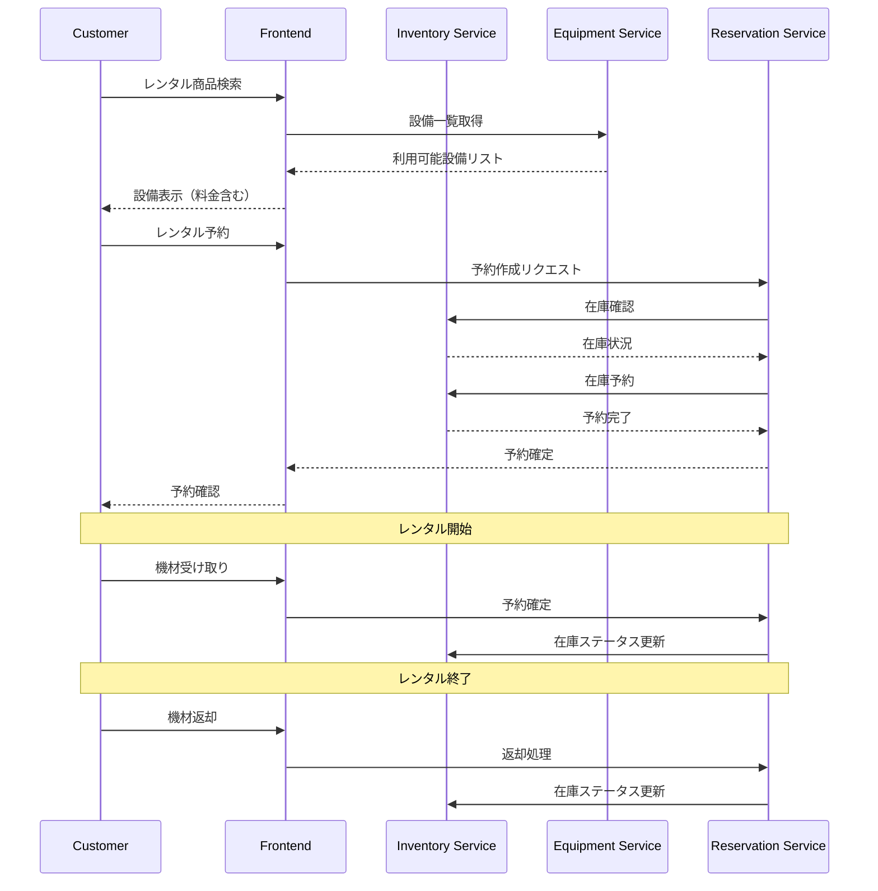

# Inventory Management Service 詳細設計書

## 目次

1. [概要](#概要)
2. [技術仕様](#技術仕様)
3. [Event-Driven Architecture](#event-driven-architecture)
4. [アーキテクチャ設計](#アーキテクチャ設計)
5. [Equipment管理設計](#equipment-management-design)
6. [API設計](#api設計)
7. [データベース設計](#データベース設計)
8. [レンタル管理設計](#rental-management-design)
9. [エラー処理](#error-handling)
10. [テスト設計](#test-design)
11. [ローカル開発環境](#local-development)
12. [本番デプロイメント](#production-deployment)
13. [監視・運用](#monitoring-operations)

## 概要

### サービス概要

Inventory Management Serviceは、スキー用品レンタルショップの設備在庫管理を担当するマイクロサービスです。Product Catalog Serviceからのイベントを消費して、レンタル用設備情報をキャッシュし、在庫管理、予約管理、レンタル業務に特化した機能を提供します。

### 主要責務

- **Event消費**: Product Catalog Serviceからの商品イベント処理
- **Equipment管理**: レンタル用設備情報のキャッシュ管理
- **レンタル料金計算**: 商品タイプ別の動的料金算出
- **在庫管理**: レンタル可能設備の在庫追跡
- **予約管理**: レンタル予約の管理と状態制御
- **データ移行**: 段階的な旧システムからの移行サポート

### ビジネス価値

- **データ分離**: 商品データはProduct Catalogに一元化、レンタル特化機能に集中
- **レンタル最適化**: 設備タイプ別の最適な料金設定とビジネスロジック
- **リアルタイム同期**: Event-Driven Architectureによる即座の商品情報同期
- **段階的移行**: 既存システムから新アーキテクチャへの無停止移行
- **運用効率化**: レンタル業務に特化した管理画面と機能

## 技術仕様

### 使用技術スタック

| 技術領域 | 技術/ライブラリ | バージョン | 用途 |
|---------|----------------|-----------|------|
| **Runtime** | OpenJDK | 17 LTS | Java実行環境 |
| **Framework** | Jakarta EE | 11 | エンタープライズフレームワーク |
| **Application Server** | WildFly | 31.0.1 | Jakarta EEアプリケーションサーバー |
| **Persistence** | Hibernate ORM | 6.4 | ORM |
| **Data Access** | JPA | 3.2 | データアクセス |
| **REST API** | JAX-RS | 4.0 | RESTful Web Services |
| **CDI** | Weld | 5.1 | 依存性注入・管理 |
| **Validation** | Hibernate Validator | 8.0 | Bean Validation |
| **JSON Processing** | Jackson | 2.16 | JSON処理 |
| **Database** | PostgreSQL | 16 | 設備・在庫データベース |
| **Message Queue** | Apache Kafka | 3.7 | Event-Driven Architecture |
| **Reactive Messaging** | SmallRye Reactive Messaging | 4.15 | Kafka統合 |
| **Health Check** | MicroProfile Health | 4.0 | ヘルスチェック |
| **Configuration** | MicroProfile Config | 3.1 | 設定管理 |
| **Metrics** | MicroProfile Metrics | 5.1 | メトリクス収集 |

### 除外技術

- **Redis**: キャッシュ機能はJPA level 2 cacheで代替
- **InfluxDB**: 履歴データはPostgreSQLで管理

### Java 17 LTS 活用機能

- **Records**: 設備データ転送オブジェクトとイベントクラス
- **Pattern Matching for instanceof**: 設備タイプ別の料金計算ロジック
- **Text Blocks**: 複雑なSQL定義とJSONテンプレート
- **Sealed Classes**: イベントタイプとレンタル状態の型安全性
- **Stream API**: 効率的なデータ処理とフィルタリング

## Event-Driven Architecture

### アーキテクチャ概要

Inventory Management Serviceは、Product Catalog ServiceからのイベントをリアルタイムでConsumeし、レンタル用設備情報をキャッシュ管理する Event Consumer として機能します。



### イベント消費設計

#### Event Consumer実装

```java
@ApplicationScoped
public class ProductEventConsumer {
    
    @Inject
    Logger logger;
    
    @Inject
    EquipmentService equipmentService;
    
    @Incoming("product-events")
    public CompletionStage<Void> handleProductEvent(Message<ProductEvent> message) {
        ProductEvent event = message.getPayload();
        
        logger.info("Received product event: " + event.getEventType() + 
                   " for product: " + event.getAggregateId());
        
        try {
            switch (event.getEventType()) {
                case "PRODUCT_CREATED":
                    handleProductCreated((ProductCreatedEvent) event);
                    break;
                case "PRODUCT_UPDATED":
                    handleProductUpdated((ProductUpdatedEvent) event);
                    break;
                case "PRODUCT_DELETED":
                    handleProductDeleted((ProductDeletedEvent) event);
                    break;
                case "PRODUCT_ACTIVATED":
                    handleProductActivated((ProductActivatedEvent) event);
                    break;
                case "PRODUCT_DEACTIVATED":
                    handleProductDeactivated((ProductDeactivatedEvent) event);
                    break;
                default:
                    logger.warning("Unknown product event type: " + event.getEventType());
            }
            
            logger.info("Successfully processed product event: " + event.getEventId());
            return message.ack();
            
        } catch (Exception e) {
            logger.severe("Failed to process product event: " + event.getEventId() + 
                         ", error: " + e.getMessage());
            return message.nack(e);
        }
    }
    
    private void handleProductCreated(ProductCreatedEvent event) {
        if (isRentalEligible(event)) {
            equipmentService.createEquipmentFromProduct(event);
            logger.info("Created equipment for product: " + event.getProductId());
        } else {
            logger.info("Product not eligible for rental, skipping: " + event.getProductId());
        }
    }
    
    private void handleProductUpdated(ProductUpdatedEvent event) {
        equipmentService.updateEquipmentFromProduct(event);
        logger.info("Updated equipment cache for product: " + event.getProductId());
    }
    
    private void handleProductDeleted(ProductDeletedEvent event) {
        equipmentService.deactivateEquipment(event.getProductId());
        logger.info("Deactivated equipment for deleted product: " + event.getProductId());
    }
    
    private void handleProductActivated(ProductActivatedEvent event) {
        equipmentService.activateEquipment(event.getProductId());
        logger.info("Activated equipment for product: " + event.getProductId());
    }
    
    private void handleProductDeactivated(ProductDeactivatedEvent event) {
        equipmentService.deactivateEquipment(event.getProductId());
        logger.info("Deactivated equipment for product: " + event.getProductId());
    }
    
    /**
     * レンタル対象商品の判定ロジック
     */
    private boolean isRentalEligible(ProductCreatedEvent event) {
        return event.isRentalAvailable() && 
               !"WAX".equals(event.getEquipmentType()) && 
               !"TUNING".equals(event.getEquipmentType());
    }
}
```

### イベント処理戦略

#### 1. 冪等性保証

同じイベントが複数回処理されても結果が同じになるよう、イベントIDベースの処理済みチェックを実装。

#### 2. エラーハンドリング

処理失敗時には、Dead Letter Queue パターンを使用して手動での復旧を可能にします。

#### 3. Graceful Degradation

Product Catalog Serviceが停止していても、キャッシュされた設備情報でレンタル業務を継続可能。

## アーキテクチャ設計

### システムアーキテクチャ図



## Equipment管理設計 {#equipment-management-design}

### Equipment エンティティ設計

```java
@Entity
@Table(name = "equipment")
@NamedQueries({
    @NamedQuery(
        name = "Equipment.findByProductId",
        query = "SELECT e FROM Equipment e WHERE e.productId = :productId"
    ),
    @NamedQuery(
        name = "Equipment.findBySku",
        query = "SELECT e FROM Equipment e WHERE e.cachedSku = :sku"
    ),
    @NamedQuery(
        name = "Equipment.findRentalAvailable",
        query = "SELECT e FROM Equipment e WHERE e.isRentalAvailable = true AND e.isActive = true"
    )
})
public class Equipment {
    
    @Id
    @GeneratedValue(strategy = GenerationType.SEQUENCE, generator = "equipment_seq")
    @SequenceGenerator(name = "equipment_seq", sequenceName = "equipment_id_seq", allocationSize = 1)
    private Long id;
    
    @NotNull
    @Column(name = "product_id", nullable = false)
    private UUID productId;
    
    // 段階的移行のための旧フィールド（将来削除予定）
    @Column(name = "sku", length = 100)
    private String sku;
    
    @Column(name = "name", length = 200)
    private String name;
    
    @Column(name = "category", length = 100)
    private String category;
    
    @Column(name = "brand", length = 100)
    private String brand;
    
    @Column(name = "equipment_type", length = 50)
    private String equipmentType;
    
    @Column(name = "description", columnDefinition = "TEXT")
    private String description;
    
    // ビジネス固有フィールド
    @NotNull
    @Column(name = "daily_rate", precision = 10, scale = 2, nullable = false)
    private BigDecimal dailyRate;
    
    @Column(name = "is_rental_available", nullable = false)
    private boolean isRentalAvailable = true;
    
    @Column(name = "is_active", nullable = false)
    private boolean isActive = true;
    
    // キャッシュフィールド（Product Catalog Serviceから同期）
    @Column(name = "cached_sku", length = 100)
    private String cachedSku;
    
    @Column(name = "cached_name", length = 200)
    private String cachedName;
    
    @Column(name = "cached_category", length = 100)
    private String cachedCategory;
    
    @Column(name = "cached_brand", length = 100)
    private String cachedBrand;
    
    @Column(name = "cached_equipment_type", length = 50)
    private String cachedEquipmentType;
    
    @Column(name = "cached_base_price", precision = 10, scale = 2)
    private BigDecimal cachedBasePrice;
    
    @Column(name = "cached_description", columnDefinition = "TEXT")
    private String cachedDescription;
    
    @Column(name = "cache_updated_at", nullable = false)
    private LocalDateTime cacheUpdatedAt;
    
    // タイムスタンプ
    @Column(name = "created_at", nullable = false)
    private LocalDateTime createdAt;
    
    @Column(name = "updated_at", nullable = false)
    private LocalDateTime updatedAt;
    
    // ライフサイクルコールバック
    @PrePersist
    public void prePersist() {
        this.createdAt = LocalDateTime.now();
        this.updatedAt = LocalDateTime.now();
        this.cacheUpdatedAt = LocalDateTime.now();
    }
    
    @PreUpdate
    public void preUpdate() {
        this.updatedAt = LocalDateTime.now();
    }
    
    // ビジネスメソッド
    
    /**
     * レンタル料金を計算（商品タイプに応じた計算）
     */
    public static BigDecimal calculateDailyRate(BigDecimal basePrice, String equipmentType) {
        if (basePrice == null) {
            return BigDecimal.ZERO;
        }
        
        BigDecimal rate = basePrice.multiply(BigDecimal.valueOf(0.1)); // 基本10%
        
        return switch (equipmentType) {
            case "SKI_BOARD" -> rate.multiply(BigDecimal.valueOf(1.2)); // 20%増し
            case "BOOT" -> rate.multiply(BigDecimal.valueOf(1.1)); // 10%増し
            case "HELMET" -> rate.multiply(BigDecimal.valueOf(0.8)); // 20%減
            case "POLE" -> rate.multiply(BigDecimal.valueOf(0.6)); // 40%減
            case "GOGGLE" -> rate.multiply(BigDecimal.valueOf(0.5)); // 50%減
            case "GLOVE" -> rate.multiply(BigDecimal.valueOf(0.4)); // 60%減
            default -> rate;
        };
    }
    
    /**
     * レンタル対象商品かどうか判定
     */
    public static boolean isRentalEligible(String equipmentType) {
        return !"WAX".equals(equipmentType) && !"TUNING".equals(equipmentType);
    }
    
    // Getter and Setter methods...
}
```

### Equipment Service設計

```java
@ApplicationScoped
@Transactional
public class EquipmentService {
    
    @Inject
    Logger logger;
    
    @PersistenceContext
    EntityManager entityManager;
    
    /**
     * Product Created イベントからEquipment作成
     */
    public Equipment createEquipmentFromProduct(ProductCreatedEvent event) {
        // レンタル対象チェック
        if (!Equipment.isRentalEligible(event.getEquipmentType())) {
            logger.info("Product not eligible for rental: " + event.getProductId());
            return null;
        }
        
        Equipment equipment = new Equipment();
        equipment.setProductId(event.getProductId());
        
        // キャッシュフィールドに新しいデータを設定
        equipment.setCachedSku(event.getSku());
        equipment.setCachedName(event.getName());
        equipment.setCachedCategory(event.getCategory());
        equipment.setCachedBrand(event.getBrand());
        equipment.setCachedEquipmentType(event.getEquipmentType());
        equipment.setCachedBasePrice(event.getBasePrice());
        equipment.setCachedDescription(event.getDescription());
        
        // ビジネスロジック：料金計算
        BigDecimal dailyRate = Equipment.calculateDailyRate(
            event.getBasePrice(), 
            event.getEquipmentType()
        );
        equipment.setDailyRate(dailyRate);
        equipment.setRentalAvailable(event.isRentalAvailable());
        
        entityManager.persist(equipment);
        
        logger.info("Created equipment for product: " + event.getProductId() + 
                   ", daily rate: " + dailyRate);
        
        return equipment;
    }
    
    /**
     * Product Updated イベントからEquipment更新
     */
    public Equipment updateEquipmentFromProduct(ProductUpdatedEvent event) {
        Equipment equipment = findByProductId(event.getProductId());
        if (equipment == null) {
            logger.warning("Equipment not found for product: " + event.getProductId());
            return null;
        }
        
        // キャッシュフィールドを更新
        equipment.setCachedSku(event.getSku());
        equipment.setCachedName(event.getName());
        equipment.setCachedCategory(event.getCategory());
        equipment.setCachedBrand(event.getBrand());
        equipment.setCachedEquipmentType(event.getEquipmentType());
        equipment.setCachedBasePrice(event.getBasePrice());
        equipment.setCachedDescription(event.getDescription());
        equipment.setCacheUpdatedAt(LocalDateTime.now());
        
        // 料金再計算
        BigDecimal newDailyRate = Equipment.calculateDailyRate(
            event.getBasePrice(), 
            event.getEquipmentType()
        );
        equipment.setDailyRate(newDailyRate);
        
        entityManager.merge(equipment);
        
        logger.info("Updated equipment cache for product: " + event.getProductId());
        
        return equipment;
    }
    
    /**
     * Equipment検索（Product IDによる）
     */
    public Equipment findByProductId(UUID productId) {
        TypedQuery<Equipment> query = entityManager.createNamedQuery(
            "Equipment.findByProductId", Equipment.class);
        query.setParameter("productId", productId);
        
        try {
            return query.getSingleResult();
        } catch (NoResultException e) {
            return null;
        }
    }
    
    /**
     * Equipment検索（SKUによる）
     */
    public Equipment findBySku(String sku) {
        TypedQuery<Equipment> query = entityManager.createNamedQuery(
            "Equipment.findBySku", Equipment.class);
        query.setParameter("sku", sku);
        
        try {
            return query.getSingleResult();
        } catch (NoResultException e) {
            return null;
        }
    }
    
    /**
     * レンタル可能な設備一覧取得
     */
    public List<Equipment> findRentalAvailable() {
        TypedQuery<Equipment> query = entityManager.createNamedQuery(
            "Equipment.findRentalAvailable", Equipment.class);
        return query.getResultList();
    }
    
    /**
     * Equipment非アクティブ化
     */
    public void deactivateEquipment(UUID productId) {
        Equipment equipment = findByProductId(productId);
        if (equipment != null) {
            equipment.setActive(false);
            equipment.setRentalAvailable(false);
            entityManager.merge(equipment);
            
            logger.info("Deactivated equipment for product: " + productId);
        }
    }
    
    /**
     * Equipmentアクティブ化
     */
    public void activateEquipment(UUID productId) {
        Equipment equipment = findByProductId(productId);
        if (equipment != null) {
            equipment.setActive(true);
            equipment.setRentalAvailable(true);
            entityManager.merge(equipment);
            
            logger.info("Activated equipment for product: " + productId);
        }
    }
}
```

### レンタル料金計算ロジック

Equipment管理の核心機能として、商品タイプ別の動的料金計算を実装：

#### 料金計算戦略

1. **基本料金**: Product Catalog Serviceからの basePrice * 10%
2. **設備タイプ別係数**:
   - SKI_BOARD (スキー板): 1.2倍 (高需要・高価値)
   - BOOT (ブーツ): 1.1倍 (必需品)
   - HELMET (ヘルメット): 0.8倍 (安全促進価格)
   - POLE (ストック): 0.6倍 (低価格設定)
   - GOGGLE (ゴーグル): 0.5倍 (アクセサリー価格)
   - GLOVE (グローブ): 0.4倍 (低価格設定)

#### 計算例

```java
// 例: ベース価格 50,000円のスキー板
BigDecimal basePrice = new BigDecimal("50000");
String equipmentType = "SKI_BOARD";

BigDecimal dailyRate = Equipment.calculateDailyRate(basePrice, equipmentType);
// 結果: 50,000 * 0.1 * 1.2 = 6,000円/日
```

## API設計

### REST API エンドポイント

#### 設備管理

| Method | Path | Description |
|--------|------|-------------|
| GET | `/admin/equipment` | 設備一覧取得 |
| GET | `/admin/equipment/{id}` | 設備詳細取得 |
| GET | `/admin/equipment/sku/{sku}` | SKUによる設備取得 |
| GET | `/admin/equipment/product/{productId}` | 商品IDによる設備取得 |
| PUT | `/admin/equipment/{id}/rate` | レンタル料金更新 |
| PUT | `/admin/equipment/{id}/activate` | 設備アクティベート |
| PUT | `/admin/equipment/{id}/deactivate` | 設備ディアクティベート |

#### 在庫管理

| Method | Path | Description |
|--------|------|-------------|
| GET | `/inventory/items` | 在庫アイテム一覧 |
| GET | `/inventory/items/{id}` | 在庫アイテム詳細 |
| POST | `/inventory/items` | 在庫アイテム作成 |
| PUT | `/inventory/items/{id}` | 在庫アイテム更新 |
| PUT | `/inventory/items/{id}/status` | 在庫状態更新 |

#### レンタル予約

| Method | Path | Description |
|--------|------|-------------|
| GET | `/reservations` | 予約一覧取得 |
| GET | `/reservations/{id}` | 予約詳細取得 |
| POST | `/reservations` | 予約作成 |
| PUT | `/reservations/{id}/confirm` | 予約確定 |
| DELETE | `/reservations/{id}` | 予約キャンセル |

### 管理API実装

```java
@Path("/admin")
@ApplicationScoped
public class AdminResource {
    
    @Inject
    EquipmentService equipmentService;
    
    @Inject
    DataMigrationService migrationService;
    
    @GET
    @Path("/equipment")
    @Produces(MediaType.APPLICATION_JSON)
    public Response getAllEquipment() {
        List<Equipment> equipmentList = equipmentService.findRentalAvailable();
        List<EquipmentResponse> response = equipmentList.stream()
            .map(EquipmentResponse::from)
            .collect(Collectors.toList());
        return Response.ok(response).build();
    }
    
    @GET
    @Path("/equipment/{id}")
    @Produces(MediaType.APPLICATION_JSON)
    public Response getEquipment(@PathParam("id") Long id) {
        Equipment equipment = equipmentService.findById(id);
        if (equipment == null) {
            return Response.status(Response.Status.NOT_FOUND).build();
        }
        EquipmentResponse response = EquipmentResponse.from(equipment);
        return Response.ok(response).build();
    }
    
    @GET
    @Path("/equipment/sku/{sku}")
    @Produces(MediaType.APPLICATION_JSON)
    public Response getEquipmentBySku(@PathParam("sku") String sku) {
        Equipment equipment = equipmentService.findBySku(sku);
        if (equipment == null) {
            return Response.status(Response.Status.NOT_FOUND).build();
        }
        EquipmentResponse response = EquipmentResponse.from(equipment);
        return Response.ok(response).build();
    }
    
    @PUT
    @Path("/equipment/{id}/rate")
    @Consumes(MediaType.APPLICATION_JSON)
    @Produces(MediaType.APPLICATION_JSON)
    public Response updateDailyRate(@PathParam("id") Long id, 
                                  @Valid RateUpdateRequest request) {
        Equipment equipment = equipmentService.updateDailyRate(id, request.dailyRate());
        if (equipment == null) {
            return Response.status(Response.Status.NOT_FOUND).build();
        }
        EquipmentResponse response = EquipmentResponse.from(equipment);
        return Response.ok(response).build();
    }
    
    @GET
    @Path("/migration/status")
    @Produces(MediaType.APPLICATION_JSON)
    public Response getMigrationStatus() {
        MigrationStatus status = migrationService.getMigrationStatus();
        return Response.ok(status).build();
    }
    
    @POST
    @Path("/migration/legacy-to-cache")
    @Produces(MediaType.APPLICATION_JSON)
    public Response migrateLegacyToCache() {
        migrationService.migrateLegacyDataToCache();
        return Response.ok(Map.of("message", "Migration started")).build();
    }
}
```

### DTOクラス設計

```java
// 設備レスポンス
public record EquipmentResponse(
    Long id,
    UUID productId,
    String sku,
    String name,
    String category,
    String brand,
    String equipmentType,
    BigDecimal dailyRate,
    String sizeRange,
    String difficultyLevel,
    String description,
    String imageUrl,
    boolean isRentalAvailable,
    boolean isActive,
    LocalDateTime createdAt,
    LocalDateTime updatedAt,
    // キャッシュ情報
    String cachedSku,
    String cachedName,
    String cachedCategory,
    String cachedBrand,
    String cachedEquipmentType,
    BigDecimal cachedBasePrice,
    LocalDateTime cacheUpdatedAt
) {
    public static EquipmentResponse from(Equipment equipment) {
        return new EquipmentResponse(
            equipment.getId(),
            equipment.getProductId(),
            equipment.getSku(),
            equipment.getName(),
            equipment.getCategory(),
            equipment.getBrand(),
            equipment.getEquipmentType(),
            equipment.getDailyRate(),
            equipment.getSizeRange(),
            equipment.getDifficultyLevel(),
            equipment.getDescription(),
            equipment.getImageUrl(),
            equipment.isRentalAvailable(),
            equipment.isActive(),
            equipment.getCreatedAt(),
            equipment.getUpdatedAt(),
            equipment.getCachedSku(),
            equipment.getCachedName(),
            equipment.getCachedCategory(),
            equipment.getCachedBrand(),
            equipment.getCachedEquipmentType(),
            equipment.getCachedBasePrice(),
            equipment.getCacheUpdatedAt()
        );
    }
}

// 料金更新リクエスト
public record RateUpdateRequest(
    @NotNull @DecimalMin("0.01") BigDecimal dailyRate
) {}

// 在庫アイテムレスポンス
public record InventoryItemResponse(
    Long id,
    Long equipmentId,
    String serialNumber,
    String status,
    String location,
    String size,
    Integer conditionRating,
    LocalDateTime createdAt,
    LocalDateTime updatedAt
) {}

// 予約レスポンス
public record ReservationResponse(
    Long id,
    Long customerId,
    Long equipmentId,
    Long inventoryItemId,
    LocalDateTime startDate,
    LocalDateTime endDate,
    String status,
    BigDecimal totalAmount,
    String sizeRequested,
    LocalDateTime createdAt
) {}
```

## データベース設計

### ERD（Entity Relationship Diagram）



### Equipment テーブル設計

```sql
CREATE TABLE equipment (
    id BIGSERIAL PRIMARY KEY,
    product_id UUID NOT NULL, -- 商品カタログサービスとの連携
    -- 旧フィールド（段階的移行のため一時的に保持）
    sku VARCHAR(100) UNIQUE,
    name VARCHAR(200),
    category VARCHAR(100),
    brand VARCHAR(100),
    equipment_type VARCHAR(50),
    size_range VARCHAR(50),
    difficulty_level VARCHAR(20),
    description TEXT,
    image_url VARCHAR(500),
    -- ビジネス固有フィールド
    daily_rate DECIMAL(10,2) NOT NULL,
    is_rental_available BOOLEAN NOT NULL DEFAULT TRUE,
    is_active BOOLEAN NOT NULL DEFAULT TRUE,
    -- キャッシュフィールド（商品カタログサービスから同期）
    cached_sku VARCHAR(100),
    cached_name VARCHAR(200),
    cached_category VARCHAR(100),
    cached_brand VARCHAR(100),
    cached_equipment_type VARCHAR(50),
    cached_size_range VARCHAR(50),
    cached_difficulty_level VARCHAR(20),
    cached_base_price DECIMAL(10,2),
    cached_description TEXT,
    cached_image_url VARCHAR(500),
    cache_updated_at TIMESTAMP NOT NULL DEFAULT CURRENT_TIMESTAMP,
    -- タイムスタンプ
    created_at TIMESTAMP NOT NULL DEFAULT CURRENT_TIMESTAMP,
    updated_at TIMESTAMP NOT NULL DEFAULT CURRENT_TIMESTAMP
);

-- インデックス作成
CREATE INDEX idx_equipment_product_id ON equipment(product_id);
CREATE INDEX idx_equipment_cached_sku ON equipment(cached_sku);
CREATE INDEX idx_equipment_cached_equipment_type ON equipment(cached_equipment_type);
CREATE INDEX idx_equipment_rental_available ON equipment(is_rental_available);
CREATE INDEX idx_equipment_is_active ON equipment(is_active);

-- 更新時刻自動更新トリガー
CREATE TRIGGER update_equipment_updated_at 
    BEFORE UPDATE ON equipment 
    FOR EACH ROW EXECUTE PROCEDURE update_updated_at_column();
```

### Inventory Items テーブル設計

```sql
CREATE TABLE inventory_items (
    id BIGSERIAL PRIMARY KEY,
    equipment_id BIGINT NOT NULL REFERENCES equipment(id),
    serial_number VARCHAR(100) UNIQUE,
    status VARCHAR(20) NOT NULL DEFAULT 'AVAILABLE', 
    -- AVAILABLE, RENTED, MAINTENANCE, RETIRED
    location VARCHAR(100) NOT NULL DEFAULT 'MAIN_STORE',
    size VARCHAR(20),
    condition_rating INTEGER DEFAULT 5 CHECK (condition_rating >= 1 AND condition_rating <= 5),
    purchase_date DATE,
    last_maintenance_date DATE,
    next_maintenance_date DATE,
    total_rental_count INTEGER DEFAULT 0,
    notes TEXT,
    created_at TIMESTAMP NOT NULL DEFAULT CURRENT_TIMESTAMP,
    updated_at TIMESTAMP NOT NULL DEFAULT CURRENT_TIMESTAMP
);

CREATE INDEX idx_inventory_items_equipment_id ON inventory_items(equipment_id);
CREATE INDEX idx_inventory_items_status ON inventory_items(status);
CREATE INDEX idx_inventory_items_location ON inventory_items(location);
```

### Reservations テーブル設計

```sql
CREATE TABLE reservations (
    id BIGSERIAL PRIMARY KEY,
    customer_id BIGINT NOT NULL,
    equipment_id BIGINT NOT NULL REFERENCES equipment(id),
    inventory_item_id BIGINT REFERENCES inventory_items(id),
    start_date TIMESTAMP NOT NULL,
    end_date TIMESTAMP NOT NULL,
    status VARCHAR(20) NOT NULL DEFAULT 'PENDING', 
    -- PENDING, CONFIRMED, ACTIVE, COMPLETED, CANCELLED
    total_amount DECIMAL(10,2),
    deposit_amount DECIMAL(10,2),
    size_requested VARCHAR(20),
    special_requests TEXT,
    created_at TIMESTAMP NOT NULL DEFAULT CURRENT_TIMESTAMP,
    updated_at TIMESTAMP NOT NULL DEFAULT CURRENT_TIMESTAMP,
    confirmed_at TIMESTAMP,
    completed_at TIMESTAMP,
    cancelled_at TIMESTAMP
);

CREATE INDEX idx_reservations_customer_id ON reservations(customer_id);
CREATE INDEX idx_reservations_equipment_id ON reservations(equipment_id);
CREATE INDEX idx_reservations_status ON reservations(status);
CREATE INDEX idx_reservations_start_date ON reservations(start_date);
```

### データ移行戦略

Event-Driven Architectureの導入に伴う段階的移行：

#### Phase 1: キャッシュフィールド追加
- 既存のequipmentテーブルにcachedフィールドを追加
- Product Catalog Serviceからのイベント受信開始
- 旧フィールドと新フィールドの並行運用

#### Phase 2: データ同期確立
- Product Eventの消費による自動キャッシュ更新
- データ整合性チェック機能の実装
- 管理画面での移行状況モニタリング

#### Phase 3: 段階的切り替え
- 新規設備は cached フィールドのみ使用
- 既存設備は段階的にキャッシュデータに移行
- クエリロジックの cached フィールド優先に変更

#### Phase 4: 旧フィールド削除
- データ移行完了後、旧フィールドを削除
- cached_ プレフィックスを削除してフィールド名を整理

### 移行サービス実装

```java
@ApplicationScoped
@Transactional
public class DataMigrationService {
    
    @Inject
    Logger logger;
    
    @PersistenceContext
    EntityManager entityManager;
    
    /**
     * 移行状況確認
     */
    public MigrationStatus getMigrationStatus() {
        String sql = """
            SELECT 
                COUNT(*) as total_equipment,
                COUNT(CASE WHEN cached_sku IS NOT NULL THEN 1 END) as cached_equipment,
                COUNT(CASE WHEN cached_sku IS NULL AND sku IS NOT NULL THEN 1 END) as legacy_equipment
            FROM equipment
            """;
        
        Object[] result = (Object[]) entityManager.createNativeQuery(sql).getSingleResult();
        
        long totalEquipment = ((Number) result[0]).longValue();
        long cachedEquipment = ((Number) result[1]).longValue();
        long legacyEquipment = ((Number) result[2]).longValue();
        
        double migrationPercentage = totalEquipment > 0 ? 
            (double) cachedEquipment / totalEquipment * 100 : 0;
        
        return new MigrationStatus(
            totalEquipment,
            cachedEquipment,
            legacyEquipment,
            migrationPercentage,
            legacyEquipment == 0 // migration completed
        );
    }
    
    /**
     * 旧データをキャッシュフィールドに移行
     */
    public void migrateLegacyDataToCache() {
        String sql = """
            UPDATE equipment 
            SET 
                cached_sku = sku,
                cached_name = name,
                cached_category = category,
                cached_brand = brand,
                cached_equipment_type = equipment_type,
                cached_description = description,
                cached_image_url = image_url,
                cache_updated_at = CURRENT_TIMESTAMP
            WHERE cached_sku IS NULL AND sku IS NOT NULL
            """;
        
        int updatedCount = entityManager.createNativeQuery(sql).executeUpdate();
        
        logger.info("Migrated {} legacy equipment records to cache fields", updatedCount);
    }
    
    /**
     * データ整合性チェック
     */
    public List<DataInconsistency> checkDataConsistency() {
        String sql = """
            SELECT id, sku, cached_sku, name, cached_name
            FROM equipment 
            WHERE (sku IS NOT NULL AND cached_sku IS NOT NULL AND sku != cached_sku)
               OR (name IS NOT NULL AND cached_name IS NOT NULL AND name != cached_name)
            """;
        
        @SuppressWarnings("unchecked")
        List<Object[]> results = entityManager.createNativeQuery(sql).getResultList();
        
        return results.stream()
            .map(row -> new DataInconsistency(
                ((Number) row[0]).longValue(),
                (String) row[1],
                (String) row[2],
                (String) row[3],
                (String) row[4]
            ))
            .collect(Collectors.toList());
    }
}

// DTOクラス
public record MigrationStatus(
    long totalEquipment,
    long cachedEquipment,
    long legacyEquipment,
    double migrationPercentage,
    boolean migrationCompleted
) {}

public record DataInconsistency(
    Long equipmentId,
    String legacySku,
    String cachedSku,
    String legacyName,
    String cachedName
) {}
```

## レンタル管理設計 {#rental-management-design}

### レンタル業務フロー



### 料金計算ロジック

レンタル料金は以下の要素で構成されます：

1. **基本料金**: Equipment.dailyRate × レンタル日数
2. **サイズ調整**: 特別サイズの場合の追加料金
3. **コンディション調整**: 設備の状態による割引
4. **シーズン調整**: ピークシーズンの料金調整

```java
@ApplicationScoped
public class RentalPricingService {
    
    public BigDecimal calculateRentalPrice(Equipment equipment, 
                                         LocalDate startDate, 
                                         LocalDate endDate,
                                         String requestedSize,
                                         Integer conditionRating) {
        
        long rentalDays = ChronoUnit.DAYS.between(startDate, endDate) + 1;
        BigDecimal basePrice = equipment.getDailyRate().multiply(BigDecimal.valueOf(rentalDays));
        
        // サイズ調整
        BigDecimal sizeAdjustment = calculateSizeAdjustment(equipment, requestedSize);
        
        // コンディション調整
        BigDecimal conditionAdjustment = calculateConditionAdjustment(conditionRating);
        
        // シーズン調整
        BigDecimal seasonAdjustment = calculateSeasonAdjustment(startDate, endDate);
        
        return basePrice
            .multiply(BigDecimal.ONE.add(sizeAdjustment))
            .multiply(BigDecimal.ONE.add(conditionAdjustment))
            .multiply(BigDecimal.ONE.add(seasonAdjustment));
    }
    
    private BigDecimal calculateSizeAdjustment(Equipment equipment, String requestedSize) {
        // 特別サイズの場合の追加料金
        if ("XS".equals(requestedSize) || "XXL".equals(requestedSize)) {
            return BigDecimal.valueOf(0.1); // 10%増し
        }
        return BigDecimal.ZERO;
    }
    
    private BigDecimal calculateConditionAdjustment(Integer conditionRating) {
        // コンディションによる割引
        return switch (conditionRating) {
            case 5 -> BigDecimal.ZERO; // 新品同様
            case 4 -> BigDecimal.valueOf(-0.05); // 5%割引
            case 3 -> BigDecimal.valueOf(-0.1); // 10%割引
            case 2 -> BigDecimal.valueOf(-0.2); // 20%割引
            case 1 -> BigDecimal.valueOf(-0.3); // 30%割引
            default -> BigDecimal.ZERO;
        };
    }
    
    private BigDecimal calculateSeasonAdjustment(LocalDate startDate, LocalDate endDate) {
        // ピークシーズン（12月～3月）の料金調整
        boolean isPeakSeason = isPeakSeason(startDate) || isPeakSeason(endDate);
        return isPeakSeason ? BigDecimal.valueOf(0.2) : BigDecimal.ZERO; // 20%増し
    }
    
    private boolean isPeakSeason(LocalDate date) {
        int month = date.getMonthValue();
        return month == 12 || month == 1 || month == 2 || month == 3;
    }
}
```

## エラー処理 {#error-handling}

### 例外クラス設計

```java
// ベース例外クラス
public abstract class InventoryManagementException extends RuntimeException {
    protected final String errorCode;
    
    protected InventoryManagementException(String errorCode, String message) {
        super(message);
        this.errorCode = errorCode;
    }
    
    public String getErrorCode() {
        return errorCode;
    }
}

// 具体的な例外クラス
public class EquipmentNotFoundException extends InventoryManagementException {
    public EquipmentNotFoundException(String message) {
        super("EQUIPMENT_NOT_FOUND", message);
    }
}

public class InsufficientStockException extends InventoryManagementException {
    public InsufficientStockException(String message) {
        super("INSUFFICIENT_STOCK", message);
    }
}

public class InvalidReservationStateException extends InventoryManagementException {
    public InvalidReservationStateException(String message) {
        super("INVALID_RESERVATION_STATE", message);
    }
}

public class EventProcessingException extends InventoryManagementException {
    public EventProcessingException(String message) {
        super("EVENT_PROCESSING_ERROR", message);
    }
}

// グローバル例外ハンドラー
@Provider
public class InventoryExceptionMapper implements ExceptionMapper<Exception> {
    
    @Override
    public Response toResponse(Exception exception) {
        if (exception instanceof InventoryManagementException ime) {
            return Response.status(getHttpStatus(ime))
                .entity(new ErrorResponse(ime.getErrorCode(), ime.getMessage()))
                .type(MediaType.APPLICATION_JSON)
                .build();
        }
        
        return Response.status(500)
            .entity(new ErrorResponse("INTERNAL_ERROR", "内部エラーが発生しました"))
            .type(MediaType.APPLICATION_JSON)
            .build();
    }
    
    private int getHttpStatus(InventoryManagementException exception) {
        return switch (exception.getErrorCode()) {
            case "EQUIPMENT_NOT_FOUND" -> 404;
            case "INSUFFICIENT_STOCK" -> 400;
            case "INVALID_RESERVATION_STATE" -> 400;
            default -> 500;
        };
    }
}

public record ErrorResponse(String errorCode, String message) {}
```

## テスト設計 {#test-design}

### 単体テスト

```java
@ExtendWith(MockitoExtension.class)
class EquipmentServiceTest {
    
    @InjectMocks
    private EquipmentService equipmentService;
    
    @Mock
    private EntityManager entityManager;
    
    @Test
    void testCreateEquipmentFromProduct_Success() {
        // Given
        ProductCreatedEvent event = new ProductCreatedEvent(
            UUID.randomUUID(),
            UUID.randomUUID(),
            "SKI-TEST-001",
            "テストスキー",
            "SKI_BOARD",
            "Rossignol",
            "SKI_BOARD",
            new BigDecimal("50000"),
            "165cm",
            "INTERMEDIATE",
            "テスト用スキー",
            "https://example.com/image.jpg",
            true,
            LocalDateTime.now()
        );
        
        // When
        Equipment result = equipmentService.createEquipmentFromProduct(event);
        
        // Then
        assertThat(result).isNotNull();
        assertThat(result.getCachedSku()).isEqualTo("SKI-TEST-001");
        assertThat(result.getDailyRate()).isEqualTo(new BigDecimal("6000.00")); // 50000 * 0.1 * 1.2
        
        verify(entityManager).persist(any(Equipment.class));
    }
    
    @Test
    void testCreateEquipmentFromProduct_NotRentalEligible() {
        // Given
        ProductCreatedEvent event = new ProductCreatedEvent(
            UUID.randomUUID(),
            UUID.randomUUID(),
            "WAX-TEST-001",
            "テストワックス",
            "WAX",
            "Swix",
            "WAX",
            new BigDecimal("2000"),
            null,
            null,
            "テスト用ワックス",
            null,
            false,
            LocalDateTime.now()
        );
        
        // When
        Equipment result = equipmentService.createEquipmentFromProduct(event);
        
        // Then
        assertThat(result).isNull();
        verify(entityManager, never()).persist(any(Equipment.class));
    }
}
```

### 統合テスト

```java
@QuarkusTest
@TestTransaction
class ProductEventConsumerIntegrationTest {
    
    @Inject
    ProductEventConsumer eventConsumer;
    
    @Inject
    EquipmentService equipmentService;
    
    @Test
    void testHandleProductCreatedEvent() {
        // Given
        ProductCreatedEvent event = createTestProductEvent();
        Message<ProductEvent> message = Message.of(event);
        
        // When
        CompletionStage<Void> result = eventConsumer.handleProductEvent(message);
        
        // Then
        result.toCompletableFuture().join();
        
        Equipment equipment = equipmentService.findByProductId(event.getProductId());
        assertThat(equipment).isNotNull();
        assertThat(equipment.getCachedSku()).isEqualTo(event.getSku());
    }
    
    private ProductCreatedEvent createTestProductEvent() {
        return new ProductCreatedEvent(
            UUID.randomUUID(),
            UUID.randomUUID(),
            "SKI-INTEGRATION-001",
            "統合テストスキー",
            "SKI_BOARD",
            "Atomic",
            "SKI_BOARD",
            new BigDecimal("60000"),
            "170cm",
            "ADVANCED",
            "統合テスト用",
            null,
            true,
            LocalDateTime.now()
        );
    }
}
```

## ローカル開発環境 {#local-development}

### 開発環境セットアップ

```yaml
# docker-compose.yml
version: '3.8'
services:
  inventory-management-service:
    build:
      context: .
      dockerfile: Dockerfile
    ports:
      - "8084:8084"
    environment:
      - DATABASE_URL=jdbc:postgresql://postgres:5432/inventory_db
      - DATABASE_USER=inventory_user
      - DATABASE_PASSWORD=inventory_pass
      - KAFKA_BOOTSTRAP_SERVERS=kafka:9092
    depends_on:
      - postgres
      - kafka
    networks:
      - ski-shop-network

  postgres:
    image: postgres:16-alpine
    environment:
      - POSTGRES_DB=inventory_db
      - POSTGRES_USER=inventory_user
      - POSTGRES_PASSWORD=inventory_pass
    ports:
      - "5435:5432"
    volumes:
      - postgres_inventory_data:/var/lib/postgresql/data
      - ./setup_inventory_db.sh:/docker-entrypoint-initdb.d/setup_inventory_db.sh
    networks:
      - ski-shop-network

  zookeeper:
    image: confluentinc/cp-zookeeper:latest
    environment:
      ZOOKEEPER_CLIENT_PORT: 2181
      ZOOKEEPER_TICK_TIME: 2000
    networks:
      - ski-shop-network

  kafka:
    image: confluentinc/cp-kafka:latest
    depends_on:
      - zookeeper
    ports:
      - "9093:9092"
    environment:
      KAFKA_BROKER_ID: 1
      KAFKA_ZOOKEEPER_CONNECT: zookeeper:2181
      KAFKA_ADVERTISED_LISTENERS: PLAINTEXT://localhost:9093
      KAFKA_OFFSETS_TOPIC_REPLICATION_FACTOR: 1
      KAFKA_AUTO_CREATE_TOPICS_ENABLE: true
    networks:
      - ski-shop-network

volumes:
  postgres_inventory_data:

networks:
  ski-shop-network:
    driver: bridge
```

### アプリケーション設定

```yaml
# application.yml
quarkus:
  application:
    name: inventory-management-service
  
  http:
    port: 8084
  
  datasource:
    db-kind: postgresql
    jdbc:
      url: ${DATABASE_URL:jdbc:postgresql://localhost:5435/inventory_db}
    username: ${DATABASE_USER:inventory_user}
    password: ${DATABASE_PASSWORD:inventory_pass}
  
  hibernate-orm:
    database:
      generation: update
    sql-load-script: import.sql

# Kafka設定
mp:
  messaging:
    incoming:
      product-events:
        connector: smallrye-kafka
        topic: product-events
        value:
          deserializer: io.quarkus.kafka.client.serialization.JsonbDeserializer
        key:
          deserializer: org.apache.kafka.common.serialization.StringDeserializer
        auto-offset-reset: earliest
        group-id: inventory-management-service

kafka:
  bootstrap:
    servers: ${KAFKA_BOOTSTRAP_SERVERS:localhost:9093}
```

### 開発用データ投入

```sql
-- import.sql
-- サンプル設備データ
INSERT INTO equipment (id, product_id, cached_sku, cached_name, cached_category, cached_brand, cached_equipment_type, cached_base_price, daily_rate, is_rental_available, is_active, cache_updated_at, created_at, updated_at) VALUES
(1, 'p1234567-89ab-cdef-0123-456789abcdef', 'SKI-ROSS-HERO-165', 'Rossignol Hero Athlete FIS GS', 'SKI_BOARD', 'Rossignol', 'SKI_BOARD', 120000.00, 14400.00, true, true, CURRENT_TIMESTAMP, CURRENT_TIMESTAMP, CURRENT_TIMESTAMP),
(2, 'p2234567-89ab-cdef-0123-456789abcdef', 'SKI-ATOM-REDSTER-170', 'Atomic Redster X9 WC GS', 'SKI_BOARD', 'Atomic', 'SKI_BOARD', 110000.00, 13200.00, true, true, CURRENT_TIMESTAMP, CURRENT_TIMESTAMP, CURRENT_TIMESTAMP),
(3, 'p3234567-89ab-cdef-0123-456789abcdef', 'SKI-SAL-SMAX-160', 'Salomon S/Max 8', 'SKI_BOARD', 'Salomon', 'SKI_BOARD', 45000.00, 5400.00, true, true, CURRENT_TIMESTAMP, CURRENT_TIMESTAMP, CURRENT_TIMESTAMP);

-- サンプル在庫アイテム
INSERT INTO inventory_items (id, equipment_id, serial_number, status, location, size, condition_rating, total_rental_count, created_at, updated_at) VALUES
(1, 1, 'SKI001-001', 'AVAILABLE', 'MAIN_STORE', '165cm', 5, 0, CURRENT_TIMESTAMP, CURRENT_TIMESTAMP),
(2, 1, 'SKI001-002', 'AVAILABLE', 'MAIN_STORE', '165cm', 5, 0, CURRENT_TIMESTAMP, CURRENT_TIMESTAMP),
(3, 2, 'SKI002-001', 'RENTED', 'MAIN_STORE', '170cm', 4, 5, CURRENT_TIMESTAMP, CURRENT_TIMESTAMP),
(4, 3, 'SKI003-001', 'AVAILABLE', 'RENTAL_COUNTER', '160cm', 5, 0, CURRENT_TIMESTAMP, CURRENT_TIMESTAMP);
```

## 本番デプロイメント {#production-deployment}

### Kubernetes デプロイメント

```yaml
apiVersion: apps/v1
kind: Deployment
metadata:
  name: inventory-management-service
spec:
  replicas: 3
  selector:
    matchLabels:
      app: inventory-management-service
  template:
    metadata:
      labels:
        app: inventory-management-service
    spec:
      containers:
      - name: inventory-management-service
        image: ski-shop/inventory-management-service:latest
        ports:
        - containerPort: 8084
        env:
        - name: DATABASE_URL
          value: "jdbc:postgresql://postgres-service:5432/inventory_db"
        - name: KAFKA_BOOTSTRAP_SERVERS
          value: "kafka-service:9092"
        livenessProbe:
          httpGet:
            path: /q/health/live
            port: 8084
        readinessProbe:
          httpGet:
            path: /q/health/ready
            port: 8084
```

## 監視・運用 {#monitoring-operations}

### ヘルスチェック

```java
@ApplicationScoped
public class InventoryHealthCheck implements HealthCheck {
    
    @Override
    public HealthCheckResponse call() {
        HealthCheckResponseBuilder builder = HealthCheckResponse.named("inventory-management-service");
        
        try {
            // データベース接続確認
            // Kafka接続確認
            // Event Consumer状態確認
            
            builder.up()
                .withData("kafka-consumer", "healthy")
                .withData("database", "connected");
        } catch (Exception e) {
            builder.down().withData("error", e.getMessage());
        }
        
        return builder.build();
    }
}
```

### メトリクス

```java
@ApplicationScoped
public class InventoryMetrics {
    
    @Inject
    @Metric(name = "equipment_created_total")
    Counter equipmentCreated;
    
    @Inject
    @Metric(name = "product_events_processed_total")
    Counter eventsProcessed;
    
    @Inject
    @Metric(name = "rental_rate_calculations_total")
    Counter rateCalculations;
    
    public void recordEquipmentCreated() {
        equipmentCreated.increment();
    }
    
    public void recordEventProcessed() {
        eventsProcessed.increment();
    }
    
    public void recordRateCalculation() {
        rateCalculations.increment();
    }
}
```

このInventory Management Serviceの詳細設計書により、Event-Driven Architectureを活用した効率的なレンタル設備管理システムの実装が可能です。Product Catalog Serviceとの連携により、データの一貫性を保ちながら、レンタル業務に特化した機能を提供します。
