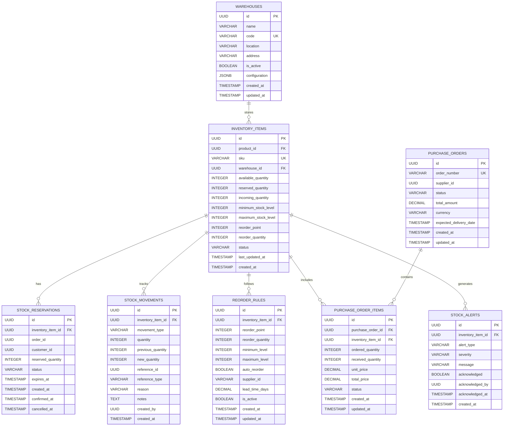

# Inventory Management Service 詳細設計書

## 目次

1. [概要](#概要)
2. [技術仕様](#技術仕様)
3. [Event-Driven Architecture](#event-driven-architecture)
4. [アーキテクチャ設計](#アーキテクチャ設計)
5. [Equipment管理設計](#equipment-management-design)
6. [API設計](#api設計)
7. [データベース設計](#データベース設計)
8. [レンタル管理設計](#rental-management-design)
9. [エラー処理](#error-handling)
10. [テスト設計](#test-design)
11. [ローカル開発環境](#local-development)
12. [本番デプロイメント](#production-deployment)
13. [監視・運用](#monitoring-operations)

## 概要

### サービス概要

Inventory Management Serviceは、スキー用品レンタルショップの設備在庫管理を担当するマイクロサービスです。Product Catalog Serviceからのイベントを消費して、レンタル用設備情報をキャッシュし、在庫管理、予約管理、レンタル業務に特化した機能を提供します。

### 主要責務

- **Event消費**: Product Catalog Serviceからの商品イベント処理
- **Equipment管理**: レンタル用設備情報のキャッシュ管理
- **レンタル料金計算**: 商品タイプ別の動的料金算出
- **在庫管理**: レンタル可能設備の在庫追跡
- **予約管理**: レンタル予約の管理と状態制御
- **データ移行**: 段階的な旧システムからの移行サポート

### ビジネス価値

- **データ分離**: 商品データはProduct Catalogに一元化、レンタル特化機能に集中
- **レンタル最適化**: 設備タイプ別の最適な料金設定とビジネスロジック
- **リアルタイム同期**: Event-Driven Architectureによる即座の商品情報同期
- **段階的移行**: 既存システムから新アーキテクチャへの無停止移行
- **運用効率化**: レンタル業務に特化した管理画面と機能

## 技術仕様

### 使用技術スタック

| 技術領域 | 技術/ライブラリ | バージョン | 用途 |
|---------|----------------|-----------|------|
| **Runtime** | OpenJDK | 21 LTS | Java実行環境 |
| **Framework** | Jakarta EE | 11 | エンタープライズフレームワーク |
| **Application Server** | WildFly | 31.0.1 | Jakarta EEアプリケーションサーバー |
| **Persistence** | Hibernate ORM | 6.4 | ORM |
| **Data Access** | JPA | 3.2 | データアクセス |
| **REST API** | JAX-RS | 4.0 | RESTful Web Services |
| **CDI** | Weld | 5.1 | 依存性注入・管理 |
| **Validation** | Hibernate Validator | 8.0 | Bean Validation |
| **JSON Processing** | Jackson | 2.16 | JSON処理 |
| **Database** | PostgreSQL | 16 | 設備・在庫データベース |
| **Message Queue** | Apache Kafka | 3.7 | Event-Driven Architecture |
| **Reactive Messaging** | SmallRye Reactive Messaging | 4.15 | Kafka統合 |
| **Health Check** | MicroProfile Health | 4.0 | ヘルスチェック |
| **Configuration** | MicroProfile Config | 3.1 | 設定管理 |
| **Metrics** | MicroProfile Metrics | 5.1 | メトリクス収集 |

### 除外技術

- **Redis**: キャッシュ機能はJPA level 2 cacheで代替
- **InfluxDB**: 履歴データはPostgreSQLで管理

### Java 21 LTS 活用機能

- **Virtual Threads**: 高い並行性を持つイベント処理とレンタル処理
- **Record Classes**: 設備データ転送オブジェクトとイベントクラス
- **Pattern Matching**: 設備タイプ別の料金計算ロジック
- **Text Blocks**: 複雑なSQL定義とJSONテンプレート
- **Sealed Classes**: イベントタイプとレンタル状態の型安全性

## Event-Driven Architecture

### アーキテクチャ概要

Inventory Management Serviceは、Product Catalog ServiceからのイベントをリアルタイムでConsumeし、レンタル用設備情報をキャッシュ管理する Event Consumer として機能します。


### イベント消費設計

#### Event Consumer実装

```java
@ApplicationScoped
public class ProductEventConsumer {
    
    @Inject
    Logger logger;
    
    @Inject
    EquipmentService equipmentService;
    
    @Incoming("product-events")
    public CompletionStage<Void> handleProductEvent(Message<ProductEvent> message) {
        ProductEvent event = message.getPayload();
        
        logger.info("Received product event: " + event.getEventType() + 
                   " for product: " + event.getAggregateId());
        
        try {
            switch (event.getEventType()) {
                case "PRODUCT_CREATED":
                    handleProductCreated((ProductCreatedEvent) event);
                    break;
                case "PRODUCT_UPDATED":
                    handleProductUpdated((ProductUpdatedEvent) event);
                    break;
                case "PRODUCT_DELETED":
                    handleProductDeleted((ProductDeletedEvent) event);
                    break;
                case "PRODUCT_ACTIVATED":
                    handleProductActivated((ProductActivatedEvent) event);
                    break;
                case "PRODUCT_DEACTIVATED":
                    handleProductDeactivated((ProductDeactivatedEvent) event);
                    break;
                default:
                    logger.warning("Unknown product event type: " + event.getEventType());
            }
            
            logger.info("Successfully processed product event: " + event.getEventId());
            return message.ack();
            
        } catch (Exception e) {
            logger.severe("Failed to process product event: " + event.getEventId() + 
                         ", error: " + e.getMessage());
            return message.nack(e);
        }
    }
    
    private void handleProductCreated(ProductCreatedEvent event) {
        if (isRentalEligible(event)) {
            equipmentService.createEquipmentFromProduct(event);
            logger.info("Created equipment for product: " + event.getProductId());
        } else {
            logger.info("Product not eligible for rental, skipping: " + event.getProductId());
        }
    }
    
    private void handleProductUpdated(ProductUpdatedEvent event) {
        equipmentService.updateEquipmentFromProduct(event);
        logger.info("Updated equipment cache for product: " + event.getProductId());
    }
    
    private void handleProductDeleted(ProductDeletedEvent event) {
        equipmentService.deactivateEquipment(event.getProductId());
        logger.info("Deactivated equipment for deleted product: " + event.getProductId());
    }
    
    private void handleProductActivated(ProductActivatedEvent event) {
        equipmentService.activateEquipment(event.getProductId());
        logger.info("Activated equipment for product: " + event.getProductId());
    }
    
    private void handleProductDeactivated(ProductDeactivatedEvent event) {
        equipmentService.deactivateEquipment(event.getProductId());
        logger.info("Deactivated equipment for product: " + event.getProductId());
    }
    
    /**
     * レンタル対象商品の判定ロジック
     */
    private boolean isRentalEligible(ProductCreatedEvent event) {
        return event.isRentalAvailable() && 
               !"WAX".equals(event.getEquipmentType()) && 
               !"TUNING".equals(event.getEquipmentType());
    }
}
```

### イベント処理戦略

#### 1. 冪等性保証

同じイベントが複数回処理されても結果が同じになるよう、イベントIDベースの処理済みチェックを実装。

#### 2. エラーハンドリング

処理失敗時には、Dead Letter Queue パターンを使用して手動での復旧を可能にします。

#### 3. Graceful Degradation

Product Catalog Serviceが停止していても、キャッシュされた設備情報でレンタル業務を継続可能。

## アーキテクチャ設計

### システムアーキテクチャ図


## Equipment管理設計 {#equipment-management-design}

### Equipment エンティティ設計

```java
@Entity
@Table(name = "equipment")
@NamedQueries({
    @NamedQuery(
        name = "Equipment.findByProductId",
        query = "SELECT e FROM Equipment e WHERE e.productId = :productId"
    ),
    @NamedQuery(
        name = "Equipment.findBySku",
        query = "SELECT e FROM Equipment e WHERE e.cachedSku = :sku"
    ),
    @NamedQuery(
        name = "Equipment.findRentalAvailable",
        query = "SELECT e FROM Equipment e WHERE e.isRentalAvailable = true AND e.isActive = true"
    )
})
public class Equipment {
    
    @Id
    @GeneratedValue(strategy = GenerationType.SEQUENCE, generator = "equipment_seq")
    @SequenceGenerator(name = "equipment_seq", sequenceName = "equipment_id_seq", allocationSize = 1)
    private Long id;
    
    @NotNull
    @Column(name = "product_id", nullable = false)
    private UUID productId;
    
    // 段階的移行のための旧フィールド（将来削除予定）
    @Column(name = "sku", length = 100)
    private String sku;
    
    @Column(name = "name", length = 200)
    private String name;
    
    @Column(name = "category", length = 100)
    private String category;
    
    @Column(name = "brand", length = 100)
    private String brand;
    
    @Column(name = "equipment_type", length = 50)
    private String equipmentType;
    
    @Column(name = "description", columnDefinition = "TEXT")
    private String description;
    
    // ビジネス固有フィールド
    @NotNull
    @Column(name = "daily_rate", precision = 10, scale = 2, nullable = false)
    private BigDecimal dailyRate;
    
    @Column(name = "is_rental_available", nullable = false)
    private boolean isRentalAvailable = true;
    
    @Column(name = "is_active", nullable = false)
    private boolean isActive = true;
    
    // キャッシュフィールド（Product Catalog Serviceから同期）
    @Column(name = "cached_sku", length = 100)
    private String cachedSku;
    
    @Column(name = "cached_name", length = 200)
    private String cachedName;
    
    @Column(name = "cached_category", length = 100)
    private String cachedCategory;
    
    @Column(name = "cached_brand", length = 100)
    private String cachedBrand;
    
    @Column(name = "cached_equipment_type", length = 50)
    private String cachedEquipmentType;
    
    @Column(name = "cached_base_price", precision = 10, scale = 2)
    private BigDecimal cachedBasePrice;
    
    @Column(name = "cached_description", columnDefinition = "TEXT")
    private String cachedDescription;
    
    @Column(name = "cache_updated_at", nullable = false)
    private LocalDateTime cacheUpdatedAt;
    
    // タイムスタンプ
    @Column(name = "created_at", nullable = false)
    private LocalDateTime createdAt;
    
    @Column(name = "updated_at", nullable = false)
    private LocalDateTime updatedAt;
    
    // ライフサイクルコールバック
    @PrePersist
    public void prePersist() {
        this.createdAt = LocalDateTime.now();
        this.updatedAt = LocalDateTime.now();
        this.cacheUpdatedAt = LocalDateTime.now();
    }
    
    @PreUpdate
    public void preUpdate() {
        this.updatedAt = LocalDateTime.now();
    }
    
    // ビジネスメソッド
    
    /**
     * レンタル料金を計算（商品タイプに応じた計算）
     */
    public static BigDecimal calculateDailyRate(BigDecimal basePrice, String equipmentType) {
        if (basePrice == null) {
            return BigDecimal.ZERO;
        }
        
        BigDecimal rate = basePrice.multiply(BigDecimal.valueOf(0.1)); // 基本10%
        
        return switch (equipmentType) {
            case "SKI_BOARD" -> rate.multiply(BigDecimal.valueOf(1.2)); // 20%増し
            case "BOOT" -> rate.multiply(BigDecimal.valueOf(1.1)); // 10%増し
            case "HELMET" -> rate.multiply(BigDecimal.valueOf(0.8)); // 20%減
            case "POLE" -> rate.multiply(BigDecimal.valueOf(0.6)); // 40%減
            case "GOGGLE" -> rate.multiply(BigDecimal.valueOf(0.5)); // 50%減
            case "GLOVE" -> rate.multiply(BigDecimal.valueOf(0.4)); // 60%減
            default -> rate;
        };
    }
    
    /**
     * レンタル対象商品かどうか判定
     */
    public static boolean isRentalEligible(String equipmentType) {
        return !"WAX".equals(equipmentType) && !"TUNING".equals(equipmentType);
    }
    
    // Getter and Setter methods...
}
```

### Equipment Service設計

```java
@ApplicationScoped
@Transactional
public class EquipmentService {
    
    @Inject
    Logger logger;
    
    @PersistenceContext
    EntityManager entityManager;
    
    /**
     * Product Created イベントからEquipment作成
     */
    public Equipment createEquipmentFromProduct(ProductCreatedEvent event) {
        // レンタル対象チェック
        if (!Equipment.isRentalEligible(event.getEquipmentType())) {
            logger.info("Product not eligible for rental: " + event.getProductId());
            return null;
        }
        
        Equipment equipment = new Equipment();
        equipment.setProductId(event.getProductId());
        
        // キャッシュフィールドに新しいデータを設定
        equipment.setCachedSku(event.getSku());
        equipment.setCachedName(event.getName());
        equipment.setCachedCategory(event.getCategory());
        equipment.setCachedBrand(event.getBrand());
        equipment.setCachedEquipmentType(event.getEquipmentType());
        equipment.setCachedBasePrice(event.getBasePrice());
        equipment.setCachedDescription(event.getDescription());
        
        // ビジネスロジック：料金計算
        BigDecimal dailyRate = Equipment.calculateDailyRate(
            event.getBasePrice(), 
            event.getEquipmentType()
        );
        equipment.setDailyRate(dailyRate);
        equipment.setRentalAvailable(event.isRentalAvailable());
        
        entityManager.persist(equipment);
        
        logger.info("Created equipment for product: " + event.getProductId() + 
                   ", daily rate: " + dailyRate);
        
        return equipment;
    }
    
    /**
     * Product Updated イベントからEquipment更新
     */
    public Equipment updateEquipmentFromProduct(ProductUpdatedEvent event) {
        Equipment equipment = findByProductId(event.getProductId());
        if (equipment == null) {
            logger.warning("Equipment not found for product: " + event.getProductId());
            return null;
        }
        
        // キャッシュフィールドを更新
        equipment.setCachedSku(event.getSku());
        equipment.setCachedName(event.getName());
        equipment.setCachedCategory(event.getCategory());
        equipment.setCachedBrand(event.getBrand());
        equipment.setCachedEquipmentType(event.getEquipmentType());
        equipment.setCachedBasePrice(event.getBasePrice());
        equipment.setCachedDescription(event.getDescription());
        equipment.setCacheUpdatedAt(LocalDateTime.now());
        
        // 料金再計算
        BigDecimal newDailyRate = Equipment.calculateDailyRate(
            event.getBasePrice(), 
            event.getEquipmentType()
        );
        equipment.setDailyRate(newDailyRate);
        
        entityManager.merge(equipment);
        
        logger.info("Updated equipment cache for product: " + event.getProductId());
        
        return equipment;
    }
    
    /**
     * Equipment検索（Product IDによる）
     */
    public Equipment findByProductId(UUID productId) {
        TypedQuery<Equipment> query = entityManager.createNamedQuery(
            "Equipment.findByProductId", Equipment.class);
        query.setParameter("productId", productId);
        
        try {
            return query.getSingleResult();
        } catch (NoResultException e) {
            return null;
        }
    }
    
    /**
     * Equipment検索（SKUによる）
     */
    public Equipment findBySku(String sku) {
        TypedQuery<Equipment> query = entityManager.createNamedQuery(
            "Equipment.findBySku", Equipment.class);
        query.setParameter("sku", sku);
        
        try {
            return query.getSingleResult();
        } catch (NoResultException e) {
            return null;
        }
    }
    
    /**
     * レンタル可能な設備一覧取得
     */
    public List<Equipment> findRentalAvailable() {
        TypedQuery<Equipment> query = entityManager.createNamedQuery(
            "Equipment.findRentalAvailable", Equipment.class);
        return query.getResultList();
    }
    
    /**
     * Equipment非アクティブ化
     */
    public void deactivateEquipment(UUID productId) {
        Equipment equipment = findByProductId(productId);
        if (equipment != null) {
            equipment.setActive(false);
            equipment.setRentalAvailable(false);
            entityManager.merge(equipment);
            
            logger.info("Deactivated equipment for product: " + productId);
        }
    }
    
    /**
     * Equipmentアクティブ化
     */
    public void activateEquipment(UUID productId) {
        Equipment equipment = findByProductId(productId);
        if (equipment != null) {
            equipment.setActive(true);
            equipment.setRentalAvailable(true);
            entityManager.merge(equipment);
            
            logger.info("Activated equipment for product: " + productId);
        }
    }
}
```

### レンタル料金計算ロジック

Equipment管理の核心機能として、商品タイプ別の動的料金計算を実装：

#### 料金計算戦略

1. **基本料金**: Product Catalog Serviceからの basePrice * 10%
2. **設備タイプ別係数**:
   - SKI_BOARD (スキー板): 1.2倍 (高需要・高価値)
   - BOOT (ブーツ): 1.1倍 (必需品)
   - HELMET (ヘルメット): 0.8倍 (安全促進価格)
   - POLE (ストック): 0.6倍 (低価格設定)
   - GOGGLE (ゴーグル): 0.5倍 (アクセサリー価格)
   - GLOVE (グローブ): 0.4倍 (低価格設定)

#### 計算例

```java
// 例: ベース価格 50,000円のスキー板
BigDecimal basePrice = new BigDecimal("50000");
String equipmentType = "SKI_BOARD";

BigDecimal dailyRate = Equipment.calculateDailyRate(basePrice, equipmentType);
// 結果: 50,000 * 0.1 * 1.2 = 6,000円/日
```

## API設計

### OpenAPI 3.1 仕様

```yaml
# inventory-management-api.yml
openapi: 3.1.0
info:
  title: Inventory Management Service API
  version: 1.0.0
  description: スキー用品ショップ 在庫管理サービス

servers:
  - url: https://api.ski-shop.com/v1/inventory
    description: Production server
  - url: https://staging.api.ski-shop.com/v1/inventory
    description: Staging server
  - url: http://localhost:8084
    description: Local development

paths:
  /items/{sku}/stock:
    get:
      summary: 在庫レベル取得
      operationId: getStockLevel
      tags: [Stock Management]
      parameters:
        - name: sku
          in: path
          required: true
          schema:
            type: string
          example: "SKI-ROSSIGNOL-HERO-165"
      responses:
        '200':
          description: 在庫レベル情報
          content:
            application/json:
              schema:
                $ref: '#/components/schemas/StockLevelResponse'
        '404':
          description: SKUが見つからない

    put:
      summary: 在庫レベル更新
      operationId: updateStockLevel
      tags: [Stock Management]
      security:
        - BearerAuth: []
      parameters:
        - name: sku
          in: path
          required: true
          schema:
            type: string
      requestBody:
        required: true
        content:
          application/json:
            schema:
              $ref: '#/components/schemas/StockUpdateRequest'
      responses:
        '200':
          description: 在庫更新成功
          content:
            application/json:
              schema:
                $ref: '#/components/schemas/StockLevelResponse'
        '400':
          description: 無効なリクエスト
        '404':
          description: SKUが見つからない

  /items/bulk-check:
    post:
      summary: 複数SKUの在庫確認
      operationId: bulkStockCheck
      tags: [Stock Management]
      requestBody:
        required: true
        content:
          application/json:
            schema:
              $ref: '#/components/schemas/BulkStockCheckRequest'
      responses:
        '200':
          description: 複数SKUの在庫情報
          content:
            application/json:
              schema:
                $ref: '#/components/schemas/BulkStockCheckResponse'

  /reservations:
    post:
      summary: 在庫予約
      operationId: reserveStock
      tags: [Reservations]
      security:
        - BearerAuth: []
      requestBody:
        required: true
        content:
          application/json:
            schema:
              $ref: '#/components/schemas/StockReservationRequest'
      responses:
        '201':
          description: 予約作成成功
          content:
            application/json:
              schema:
                $ref: '#/components/schemas/StockReservationResponse'
        '400':
          description: 在庫不足または無効なリクエスト
        '404':
          description: SKUが見つからない

  /reservations/{reservationId}/confirm:
    post:
      summary: 在庫予約確定
      operationId: confirmReservation
      tags: [Reservations]
      security:
        - BearerAuth: []
      parameters:
        - name: reservationId
          in: path
          required: true
          schema:
            type: string
            format: uuid
      responses:
        '200':
          description: 予約確定成功
        '400':
          description: 予約を確定できない
        '404':
          description: 予約が見つからない

  /reservations/{reservationId}/cancel:
    post:
      summary: 在庫予約キャンセル
      operationId: cancelReservation
      tags: [Reservations]
      security:
        - BearerAuth: []
      parameters:
        - name: reservationId
          in: path
          required: true
          schema:
            type: string
            format: uuid
      requestBody:
        required: true
        content:
          application/json:
            schema:
              $ref: '#/components/schemas/CancelReservationRequest'
      responses:
        '200':
          description: 予約キャンセル成功
        '404':
          description: 予約が見つからない

  /items/low-stock:
    get:
      summary: 低在庫商品一覧
      operationId: getLowStockItems
      tags: [Stock Management]
      security:
        - BearerAuth: []
      parameters:
        - name: warehouse
          in: query
          schema:
            type: string
            format: uuid
        - name: category
          in: query
          schema:
            type: string
        - name: limit
          in: query
          schema:
            type: integer
            default: 50
      responses:
        '200':
          description: 低在庫商品一覧
          content:
            application/json:
              schema:
                $ref: '#/components/schemas/LowStockItemsResponse'

  /warehouses/{warehouseId}/items:
    get:
      summary: 倉庫別在庫一覧
      operationId: getWarehouseInventory
      tags: [Warehouse Management]
      security:
        - BearerAuth: []
      parameters:
        - name: warehouseId
          in: path
          required: true
          schema:
            type: string
            format: uuid
        - name: page
          in: query
          schema:
            type: integer
            default: 0
        - name: size
          in: query
          schema:
            type: integer
            default: 20
      responses:
        '200':
          description: 倉庫在庫一覧
          content:
            application/json:
              schema:
                $ref: '#/components/schemas/WarehouseInventoryResponse'

  /items/{sku}/movements:
    get:
      summary: 在庫移動履歴
      operationId: getStockMovementHistory
      tags: [Stock Tracking]
      security:
        - BearerAuth: []
      parameters:
        - name: sku
          in: path
          required: true
          schema:
            type: string
        - name: from
          in: query
          schema:
            type: string
            format: date
        - name: to
          in: query
          schema:
            type: string
            format: date
        - name: movementType
          in: query
          schema:
            type: string
            enum: [INBOUND, OUTBOUND, ADJUSTMENT, TRANSFER, RETURN, DAMAGE, THEFT]
      responses:
        '200':
          description: 在庫移動履歴
          content:
            application/json:
              schema:
                $ref: '#/components/schemas/StockMovementHistoryResponse'

  /statistics:
    get:
      summary: 在庫統計情報
      operationId: getInventoryStatistics
      tags: [Analytics]
      security:
        - BearerAuth: []
      responses:
        '200':
          description: 在庫統計情報
          content:
            application/json:
              schema:
                $ref: '#/components/schemas/InventoryStatisticsResponse'

components:
  schemas:
    StockLevelResponse:
      type: object
      properties:
        sku:
          type: string
          example: "SKI-ROSSIGNOL-HERO-165"
        available:
          type: integer
          example: 25
        reserved:
          type: integer
          example: 5
        incoming:
          type: integer
          example: 10
        total:
          type: integer
          example: 40
        warehouse:
          $ref: '#/components/schemas/WarehouseInfo'
        reorderInfo:
          $ref: '#/components/schemas/ReorderInfo'
        status:
          type: string
          enum: [ACTIVE, INACTIVE, DISCONTINUED]
        lastUpdated:
          type: string
          format: date-time

    StockUpdateRequest:
      type: object
      required:
        - quantity
        - movementType
      properties:
        quantity:
          type: integer
          minimum: 0
          example: 10
        movementType:
          type: string
          enum: [INBOUND, OUTBOUND, ADJUSTMENT, TRANSFER, RETURN, DAMAGE, THEFT]
          example: "INBOUND"
        reason:
          type: string
          example: "新規入荷"
        referenceId:
          type: string
          format: uuid
          example: "123e4567-e89b-12d3-a456-426614174000"
        referenceType:
          type: string
          example: "PURCHASE_ORDER"
        notes:
          type: string
          example: "検品完了"

    BulkStockCheckRequest:
      type: object
      required:
        - items
      properties:
        items:
          type: array
          items:
            type: object
            required:
              - sku
              - quantity
            properties:
              sku:
                type: string
              quantity:
                type: integer
          example:
            - sku: "SKI-ROSSIGNOL-HERO-165"
              quantity: 2
            - sku: "BOOT-SALOMON-PRO-27"
              quantity: 1

    BulkStockCheckResponse:
      type: object
      properties:
        results:
          type: array
          items:
            type: object
            properties:
              sku:
                type: string
              available:
                type: integer
              canFulfill:
                type: boolean
              shortfall:
                type: integer

    StockReservationRequest:
      type: object
      required:
        - sku
        - quantity
        - orderId
      properties:
        sku:
          type: string
          example: "SKI-ROSSIGNOL-HERO-165"
        quantity:
          type: integer
          minimum: 1
          example: 2
        orderId:
          type: string
          format: uuid
          example: "123e4567-e89b-12d3-a456-426614174000"
        customerId:
          type: string
          format: uuid
          example: "123e4567-e89b-12d3-a456-426614174000"
        expirationMinutes:
          type: integer
          minimum: 1
          maximum: 1440
          default: 30
          example: 30

    StockReservationResponse:
      type: object
      properties:
        reservationId:
          type: string
          format: uuid
        sku:
          type: string
        quantity:
          type: integer
        status:
          type: string
          enum: [ACTIVE, CONFIRMED, CANCELLED, EXPIRED]
        expiresAt:
          type: string
          format: date-time
        createdAt:
          type: string
          format: date-time

    WarehouseInfo:
      type: object
      properties:
        warehouseId:
          type: string
          format: uuid
        name:
          type: string
        location:
          type: string
        isActive:
          type: boolean

    ReorderInfo:
      type: object
      properties:
        reorderPoint:
          type: integer
        reorderQuantity:
          type: integer
        minimumLevel:
          type: integer
        maximumLevel:
          type: integer
        autoReorder:
          type: boolean

  securitySchemes:
    BearerAuth:
      type: http
      scheme: bearer
      bearerFormat: JWT
```

## データベース設計

### ERD（Entity Relationship Diagram）



### 詳細エンティティ設計

```java
// 倉庫エンティティ
@Entity
@Table(name = "warehouses")
public class Warehouse {
    
    @Id
    @GeneratedValue(strategy = GenerationType.UUID)
    private UUID id;
    
    @Column(name = "name", nullable = false)
    private String name;
    
    @Column(name = "code", unique = true, nullable = false)
    private String code;
    
    @Column(name = "location")
    private String location;
    
    @Column(name = "address")
    private String address;
    
    @Column(name = "is_active", nullable = false)
    private Boolean isActive = true;
    
    @Column(name = "configuration", columnDefinition = "JSONB")
    private String configuration;
    
    @Column(name = "created_at", nullable = false)
    private LocalDateTime createdAt;
    
    @Column(name = "updated_at")
    private LocalDateTime updatedAt;
    
    // 関連エンティティ
    @OneToMany(mappedBy = "warehouse", cascade = CascadeType.ALL, fetch = FetchType.LAZY)
    private List<InventoryItem> inventoryItems = new ArrayList<>();
}

// 発注ルールエンティティ
@Entity
@Table(name = "reorder_rules")
public class ReorderRule {
    
    @Id
    @GeneratedValue(strategy = GenerationType.UUID)
    private UUID id;
    
    @OneToOne(fetch = FetchType.LAZY)
    @JoinColumn(name = "inventory_item_id", nullable = false)
    private InventoryItem inventoryItem;
    
    @Column(name = "reorder_point", nullable = false)
    private Integer reorderPoint;
    
    @Column(name = "reorder_quantity", nullable = false)
    private Integer reorderQuantity;
    
    @Column(name = "minimum_level", nullable = false)
    private Integer minimumLevel;
    
    @Column(name = "maximum_level", nullable = false)
    private Integer maximumLevel;
    
    @Column(name = "auto_reorder", nullable = false)
    private Boolean autoReorder = false;
    
    @Column(name = "supplier_id")
    private UUID supplierId;
    
    @Column(name = "lead_time_days", precision = 5, scale = 2)
    private BigDecimal leadTimeDays;
    
    @Column(name = "is_active", nullable = false)
    private Boolean isActive = true;
    
    @Column(name = "created_at", nullable = false)
    private LocalDateTime createdAt;
    
    @Column(name = "updated_at")
    private LocalDateTime updatedAt;
    
    public boolean shouldTriggerReorder(Integer currentStock) {
        return isActive && autoReorder && currentStock <= reorderPoint;
    }
}

// 発注エンティティ
@Entity
@Table(name = "purchase_orders")
public class PurchaseOrder {
    
    @Id
    @GeneratedValue(strategy = GenerationType.UUID)
    private UUID id;
    
    @Column(name = "order_number", unique = true, nullable = false)
    private String orderNumber;
    
    @Column(name = "supplier_id", nullable = false)
    private UUID supplierId;
    
    @Enumerated(EnumType.STRING)
    @Column(name = "status", nullable = false)
    private PurchaseOrderStatus status;
    
    @Column(name = "total_amount", precision = 12, scale = 2)
    private BigDecimal totalAmount;
    
    @Column(name = "currency", length = 3)
    private String currency = "JPY";
    
    @Column(name = "expected_delivery_date")
    private LocalDate expectedDeliveryDate;
    
    @Column(name = "created_at", nullable = false)
    private LocalDateTime createdAt;
    
    @Column(name = "updated_at")
    private LocalDateTime updatedAt;
    
    // 関連エンティティ
    @OneToMany(mappedBy = "purchaseOrder", cascade = CascadeType.ALL, fetch = FetchType.LAZY)
    private List<PurchaseOrderItem> items = new ArrayList<>();
}

// 発注明細エンティティ
@Entity
@Table(name = "purchase_order_items")
public class PurchaseOrderItem {
    
    @Id
    @GeneratedValue(strategy = GenerationType.UUID)
    private UUID id;
    
    @ManyToOne(fetch = FetchType.LAZY)
    @JoinColumn(name = "purchase_order_id", nullable = false)
    private PurchaseOrder purchaseOrder;
    
    @ManyToOne(fetch = FetchType.LAZY)
    @JoinColumn(name = "inventory_item_id", nullable = false)
    private InventoryItem inventoryItem;
    
    @Column(name = "ordered_quantity", nullable = false)
    private Integer orderedQuantity;
    
    @Column(name = "received_quantity", nullable = false)
    private Integer receivedQuantity = 0;
    
    @Column(name = "unit_price", precision = 10, scale = 2)
    private BigDecimal unitPrice;
    
    @Column(name = "total_price", precision = 12, scale = 2)
    private BigDecimal totalPrice;
    
    @Enumerated(EnumType.STRING)
    @Column(name = "status", nullable = false)
    private PurchaseOrderItemStatus status;
    
    @Column(name = "created_at", nullable = false)
    private LocalDateTime createdAt;
    
    @Column(name = "updated_at")
    private LocalDateTime updatedAt;
    
    public boolean isFullyReceived() {
        return receivedQuantity.equals(orderedQuantity);
    }
    
    public Integer getPendingQuantity() {
        return orderedQuantity - receivedQuantity;
    }
}

// 在庫アラートエンティティ
@Entity
@Table(name = "stock_alerts")
public class StockAlert {
    
    @Id
    @GeneratedValue(strategy = GenerationType.UUID)
    private UUID id;
    
    @ManyToOne(fetch = FetchType.LAZY)
    @JoinColumn(name = "inventory_item_id", nullable = false)
    private InventoryItem inventoryItem;
    
    @Enumerated(EnumType.STRING)
    @Column(name = "alert_type", nullable = false)
    private AlertType alertType;
    
    @Enumerated(EnumType.STRING)
    @Column(name = "severity", nullable = false)
    private AlertSeverity severity;
    
    @Column(name = "message", nullable = false)
    private String message;
    
    @Column(name = "acknowledged", nullable = false)
    private Boolean acknowledged = false;
    
    @Column(name = "acknowledged_by")
    private UUID acknowledgedBy;
    
    @Column(name = "acknowledged_at")
    private LocalDateTime acknowledgedAt;
    
    @Column(name = "created_at", nullable = false)
    private LocalDateTime createdAt;
}

// Repository設計（Jakarta Data活用）
@Repository
public interface InventoryItemRepository extends BasicRepository<InventoryItem, UUID> {
    
    @Query("SELECT i FROM InventoryItem i WHERE i.sku = :sku")
    Optional<InventoryItem> findBySku(String sku);
    
    @Query("""
        SELECT i FROM InventoryItem i 
        WHERE i.availableQuantity <= i.reorderPoint 
        AND i.status = 'ACTIVE'
        ORDER BY i.availableQuantity ASC
        """)
    List<InventoryItem> findLowStockItems();
    
    @Query("""
        SELECT i FROM InventoryItem i 
        WHERE i.availableQuantity = 0 
        AND i.status = 'ACTIVE'
        """)
    List<InventoryItem> findOutOfStockItems();
    
    @Query("SELECT i FROM InventoryItem i WHERE i.warehouseId = :warehouseId")
    List<InventoryItem> findByWarehouseId(UUID warehouseId);
    
    @Query("SELECT COUNT(i) FROM InventoryItem i WHERE i.availableQuantity <= i.reorderPoint")
    long countLowStockItems();
    
    @Query("SELECT COUNT(i) FROM InventoryItem i WHERE i.availableQuantity = 0")
    long countOutOfStockItems();
    
    @Query("""
        SELECT SUM(i.availableQuantity * p.price) 
        FROM InventoryItem i 
        JOIN Product p ON i.productId = p.id
        """)
    BigDecimal calculateTotalInventoryValue();
}

@Repository
public interface StockReservationRepository extends BasicRepository<StockReservation, UUID> {
    
    @Query("""
        SELECT r FROM StockReservation r 
        WHERE r.status = 'ACTIVE' 
        AND r.expiresAt < :currentTime
        """)
    List<StockReservation> findExpiredReservations(LocalDateTime currentTime);
    
    default List<StockReservation> findExpiredReservations() {
        return findExpiredReservations(LocalDateTime.now());
    }
    
    @Query("SELECT r FROM StockReservation r WHERE r.orderId = :orderId")
    List<StockReservation> findByOrderId(UUID orderId);
    
    @Query("SELECT r FROM StockReservation r WHERE r.customerId = :customerId AND r.status = 'ACTIVE'")
    List<StockReservation> findActiveReservationsByCustomer(UUID customerId);
}

// Enums
public enum PurchaseOrderStatus {
    DRAFT("下書き"),
    PENDING("承認待ち"),
    APPROVED("承認済み"),
    SENT("発注済み"),
    PARTIALLY_RECEIVED("部分入荷"),
    COMPLETED("完了"),
    CANCELLED("キャンセル");
    
    private final String description;
    
    PurchaseOrderStatus(String description) {
        this.description = description;
    }
    
    public String getDescription() {
        return description;
    }
}

public enum PurchaseOrderItemStatus {
    PENDING("待機中"),
    PARTIALLY_RECEIVED("部分入荷"),
    COMPLETED("完了"),
    CANCELLED("キャンセル");
    
    private final String description;
    
    PurchaseOrderItemStatus(String description) {
        this.description = description;
    }
    
    public String getDescription() {
        return description;
    }
}

public enum AlertType {
    LOW_STOCK("低在庫"),
    OUT_OF_STOCK("在庫切れ"),
    OVERSTOCK("過剰在庫"),
    EXPIRED_RESERVATION("期限切れ予約"),
    REORDER_TRIGGERED("自動発注実行");
    
    private final String description;
    
    AlertType(String description) {
        this.description = description;
    }
    
    public String getDescription() {
        return description;
    }
}

public enum AlertSeverity {
    LOW("低"),
    MEDIUM("中"),
    HIGH("高"),
    CRITICAL("緊急");
    
    private final String description;
    
    AlertSeverity(String description) {
        this.description = description;
    }
    
    public String getDescription() {
        return description;
    }
}
```

### CQRS Commands、Queries、Projections

```java
// CQRS Commands
public sealed interface InventoryCommand permits 
    ReserveInventoryCommand, ReleaseInventoryCommand, ConfirmInventoryCommand, 
    AdjustInventoryCommand, CreateInventoryItemCommand {
}

public record ReserveInventoryCommand(
    UUID commandId,
    String sku,
    Integer quantity,
    UUID orderId,
    UUID customerId,
    LocalDateTime timestamp
) implements InventoryCommand {}

public record ReleaseInventoryCommand(
    UUID commandId,
    UUID reservationId,
    UUID orderId,
    String reason,
    LocalDateTime timestamp
) implements InventoryCommand {}

public record ConfirmInventoryCommand(
    UUID commandId,
    UUID reservationId,
    UUID orderId,
    LocalDateTime timestamp
) implements InventoryCommand {}

public record AdjustInventoryCommand(
    UUID commandId,
    String sku,
    Integer previousQuantity,
    Integer newQuantity,
    String reason,
    LocalDateTime timestamp
) implements InventoryCommand {}

public record CreateInventoryItemCommand(
    UUID commandId,
    String sku,
    String productName,
    String description,
    BigDecimal unitCost,
    Integer initialQuantity,
    Integer minimumQuantity,
    Integer maximumQuantity,
    String location,
    LocalDateTime timestamp
) implements InventoryCommand {}

// CQRS Queries
public sealed interface InventoryQuery permits 
    GetInventoryBySkuQuery, GetLowStockItemsQuery, GetStockMovementHistoryQuery, 
    GetInventoryStatisticsQuery, SearchInventoryQuery {
}

public record GetInventoryBySkuQuery(
    UUID queryId,
    String sku,
    LocalDateTime timestamp
) implements InventoryQuery {}

public record GetLowStockItemsQuery(
    UUID queryId,
    Integer threshold,
    LocalDateTime timestamp
) implements InventoryQuery {}

public record GetStockMovementHistoryQuery(
    UUID queryId,
    String sku,
    LocalDate fromDate,
    LocalDate toDate,
    LocalDateTime timestamp
) implements InventoryQuery {}

public record GetInventoryStatisticsQuery(
    UUID queryId,
    Integer lowStockThreshold,
    LocalDateTime timestamp
) implements InventoryQuery {}

public record SearchInventoryQuery(
    UUID queryId,
    InventorySearchCriteria criteria,
    int page,
    int size,
    LocalDateTime timestamp
) implements InventoryQuery {}

// CQRS Projections (Read Models)
public record InventoryProjection(
    UUID id,
    String sku,
    String productName,
    String description,
    Integer availableQuantity,
    Integer reservedQuantity,
    Integer minimumQuantity,
    Integer maximumQuantity,
    BigDecimal unitCost,
    String location,
    StockStatus status,
    LocalDateTime lastUpdatedAt
) {
    public static InventoryProjection from(InventoryItem item) {
        return new InventoryProjection(
            item.getId(),
            item.getSku(),
            item.getProductName(),
            item.getDescription(),
            item.getAvailableQuantity(),
            item.getReservedQuantity(),
            item.getMinimumQuantity(),
            item.getMaximumQuantity(),
            item.getUnitCost(),
            item.getLocation(),
            item.getStockStatus(),
            item.getLastUpdatedAt()
        );
    }
}

public record StockMovementProjection(
    UUID id,
    String sku,
    MovementType movementType,
    Integer quantity,
    Integer previousQuantity,
    Integer newQuantity,
    String reason,
    String reference,
    LocalDateTime createdAt
) {
    public static StockMovementProjection from(StockMovement movement) {
        return new StockMovementProjection(
            movement.getId(),
            movement.getInventoryItem().getSku(),
            movement.getMovementType(),
            movement.getQuantity(),
            movement.getPreviousQuantity(),
            movement.getNewQuantity(),
            movement.getReason(),
            movement.getReference(),
            movement.getCreatedAt()
        );
    }
}

public record InventoryStatisticsProjection(
    long totalItems,
    long lowStockItems,
    long outOfStockItems,
    BigDecimal totalValue,
    LocalDateTime calculatedAt
) {}

public record InventorySearchCriteria(
    String skuPattern,
    String productNamePattern,
    StockStatus status,
    Integer minQuantity,
    Integer maxQuantity,
    String location
) {}

// Inventory Events
public sealed interface InventoryEvent permits 
    InventoryReservedEvent, InventoryReleasedEvent, InventoryConfirmedEvent, 
    InventoryAdjustedEvent, InventoryReservationFailedEvent {
}

public record InventoryReservedEvent(
    UUID orderId,
    String sku,
    Integer quantity,
    UUID reservationId,
    LocalDateTime timestamp
) implements InventoryEvent {}

public record InventoryReleasedEvent(
    UUID orderId,
    UUID reservationId,
    String reason,
    LocalDateTime timestamp
) implements InventoryEvent {}

public record InventoryConfirmedEvent(
    UUID orderId,
    UUID reservationId,
    LocalDateTime timestamp
) implements InventoryEvent {}

public record InventoryAdjustedEvent(
    String sku,
    Integer previousQuantity,
    Integer newQuantity,
    String reason,
    LocalDateTime timestamp
) implements InventoryEvent {}

public record InventoryReservationFailedEvent(
    UUID orderId,
    String sku,
    Integer quantity,
    String reason,
    LocalDateTime timestamp
) implements InventoryEvent {}

// Result Classes
public record InventoryResult(
    boolean success,
    UUID reservationId,
    String message
) {}

public record InventoryReservationResult(
    boolean success,
    List<UUID> reservationIds,
    String message
) {}

// External Events from Order Service
public record OrderCreatedEvent(
    UUID orderId,
    String orderNumber,
    UUID customerId,
    List<OrderItemDto> orderItems,
    LocalDateTime timestamp
) {}

public record OrderCancelledEvent(
    UUID orderId,
    String orderNumber,
    String reason,
    LocalDateTime timestamp
) {}

public record OrderItemDto(
    UUID productId,
    String sku,
    String productName,
    BigDecimal unitPrice,
    Integer quantity
) {}

// CQRS Annotations
@Target(ElementType.METHOD)
@Retention(RetentionPolicy.RUNTIME)
public @interface CommandHandler {}

@Target(ElementType.METHOD)
@Retention(RetentionPolicy.RUNTIME)
public @interface QueryHandler {}

@Target(ElementType.METHOD)
@Retention(RetentionPolicy.RUNTIME)
public @interface EventHandler {}
```

## 在庫管理設計 {#inventory-management-design}

### 在庫レベル管理

在庫管理サービスでは、複数の在庫レベルを総合的に管理し、正確な在庫状況の把握と適切な在庫補充を実現します。

#### 在庫レベル構成

- **利用可能在庫**: 実際に販売可能な在庫数
- **予約在庫**: 注文により一時的に確保された在庫数
- **入荷予定在庫**: 発注済みで入荷待ちの在庫数
- **最小在庫レベル**: 在庫切れを防ぐための最低限の在庫数
- **最大在庫レベル**: 過剰在庫を防ぐための上限在庫数

### 自動発注システム

在庫レベルが設定された閾値を下回った場合、自動的に発注処理を実行するシステムを実装しています。

#### 発注ルール設定

- **発注点**: 自動発注を実行する在庫レベル
- **発注量**: 一回の発注で注文する数量
- **リードタイム**: 発注から入荷までの期間
- **安全在庫**: 需要変動や納期遅延に対するバッファ

## 在庫追跡設計 {#inventory-tracking-design}

### 在庫移動履歴管理

すべての在庫変動を詳細に記録し、トレーサビリティを確保します。

#### 移動タイプ分類

- **入荷 (INBOUND)**: 仕入先からの商品入荷
- **出荷 (OUTBOUND)**: 顧客への商品出荷
- **調整 (ADJUSTMENT)**: 棚卸しによる数量調整
- **移動 (TRANSFER)**: 倉庫間での在庫移動
- **返品 (RETURN)**: 顧客からの返品
- **損傷 (DAMAGE)**: 商品の損傷による在庫減少
- **紛失 (THEFT)**: 盗難や紛失による在庫減少

### リアルタイム在庫追跡

Apache Kafkaを活用したイベント駆動アーキテクチャにより、在庫変動をリアルタイムで追跡・通知します。

## エラー処理 {#error-handling}

### 在庫関連例外クラス

```java
public class InventoryNotFoundException extends RuntimeException {
    public InventoryNotFoundException(String message) {
        super(message);
    }
}

public class InsufficientStockException extends RuntimeException {
    public InsufficientStockException(String message) {
        super(message);
    }
}

public class InvalidReservationStateException extends RuntimeException {
    public InvalidReservationStateException(String message) {
        super(message);
    }
}
```

### エラー処理戦略

- **在庫不足エラー**: 在庫予約失敗時の適切なレスポンス
- **タイムアウトエラー**: 長時間処理時の自動キャンセル
- **データ整合性エラー**: トランザクション管理による一貫性保証
- **外部サービス連携エラー**: サーキットブレーカーパターンの適用

## テスト設計 {#test-design}

### 単体テスト

```java
@ExtendWith(MockitoExtension.class)
class InventoryServiceTest {
    
    @Mock
    private InventoryItemRepository inventoryRepository;
    
    @Mock
    private InventoryEventPublisher eventPublisher;
    
    @InjectMocks
    private InventoryService inventoryService;
    
    @Test
    void testReserveStock_Success() {
        // テスト実装
    }
    
    @Test
    void testReserveStock_InsufficientStock() {
        // テスト実装
    }
}
```

### 統合テスト

- **データベース連携テスト**: Testcontainersを使用したPostgreSQL連携テスト
- **メッセージング連携テスト**: Apache Kafka連携テスト
- **API統合テスト**: RESTAssuredを使用したAPI テスト

### 性能テスト

- **同時実行テスト**: 複数ユーザーによる同時在庫予約テスト
- **大量データテスト**: 大量在庫データでの性能検証
- **負荷テスト**: JMeterを使用した負荷テスト

## ローカル開発環境 {#local-development}

### 開発環境セットアップ

```yaml
# docker-compose.yml
version: '3.8'
services:
  postgres:
    image: postgres:16
    environment:
      POSTGRES_DB: inventory_db
      POSTGRES_USER: inventory_user
      POSTGRES_PASSWORD: inventory_pass
    ports:
      - "5432:5432"
  
  redis:
    image: redis:7.2
    ports:
      - "6379:6379"
  
  kafka:
    image: confluentinc/cp-kafka:latest
    environment:
      KAFKA_ZOOKEEPER_CONNECT: zookeeper:2181
      KAFKA_ADVERTISED_LISTENERS: PLAINTEXT://localhost:9092
    ports:
      - "9092:9092"
```

### 開発用設定

```properties
# application-dev.properties
quarkus.datasource.url=jdbc:postgresql://localhost:5432/inventory_db
quarkus.datasource.username=inventory_user
quarkus.datasource.password=inventory_pass

quarkus.redis.uri=redis://localhost:6379

kafka.bootstrap.servers=localhost:9092
```

## 本番デプロイメント {#production-deployment}

### Kubernetes デプロイメント

```yaml
apiVersion: apps/v1
kind: Deployment
metadata:
  name: inventory-service
spec:
  replicas: 3
  selector:
    matchLabels:
      app: inventory-service
  template:
    metadata:
      labels:
        app: inventory-service
    spec:
      containers:
      - name: inventory-service
        image: ski-shop/inventory-service:latest
        ports:
        - containerPort: 8080
        env:
        - name: POSTGRES_HOST
          value: "postgres-service"
        - name: REDIS_HOST
          value: "redis-service"
        - name: KAFKA_BOOTSTRAP_SERVERS
          value: "kafka-service:9092"
```

### 本番環境設定

- **データベース接続**: 本番PostgreSQL クラスター設定
- **キャッシュ設定**: Redis Cluster設定
- **メッセージング設定**: Kafka クラスター設定
- **モニタリング設定**: Prometheus/Grafana設定

## 監視・運用 {#monitoring-operations}

### メトリクス監視

```java
@Counted(name = "inventory_reservations_total", description = "Total inventory reservations")
@Timed(name = "inventory_reservation_duration", description = "Inventory reservation processing time")
public InventoryResult reserveStock(ReservationRequest request) {
    // 在庫予約処理
}
```

### アラート設定

- **在庫切れアラート**: 在庫レベルが0になった場合
- **低在庫アラート**: 在庫レベルが設定閾値を下回った場合
- **システムエラーアラート**: アプリケーションエラー発生時
- **性能劣化アラート**: レスポンス時間が閾値を超過した場合

### ダッシュボード

- **在庫レベル監視**: リアルタイム在庫状況表示
- **在庫移動履歴**: 在庫変動の時系列表示
- **予約状況監視**: アクティブな予約の一覧表示
- **システム性能**: API レスポンス時間、スループット監視

## 障害対応 {#incident-response}

### 障害対応手順

#### レベル1: 軽微な障害

- **対象**: 個別API エラー、一時的な性能劣化
- **対応時間**: 1時間以内
- **対応手順**: ログ確認、自動復旧監視

#### レベル2: 中程度の障害

- **対象**: 在庫データ不整合、予約処理エラー
- **対応時間**: 30分以内
- **対応手順**: データ整合性チェック、手動修正

#### レベル3: 重大な障害

- **対象**: システム全体停止、データ損失
- **対応時間**: 15分以内
- **対応手順**: 緊急復旧、バックアップ復元

### 災害復旧計画

- **バックアップ戦略**: 日次フルバックアップ、時間単位増分バックアップ
- **復旧手順**: 自動フェイルオーバー、手動切り戻し手順
- **データ復旧**: PostgreSQL PITR、Redis AOF復旧
- **テスト計画**: 月次災害復旧テスト実施
