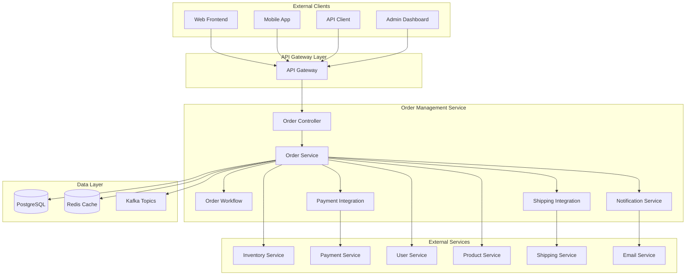
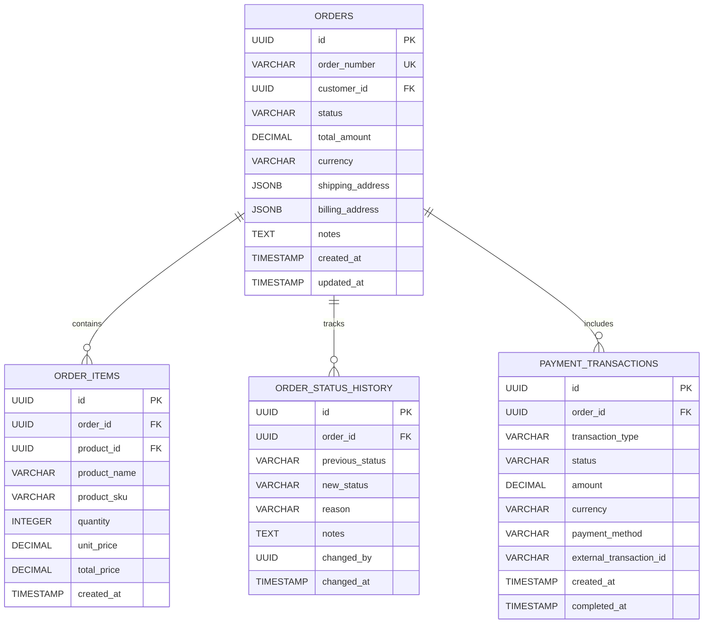
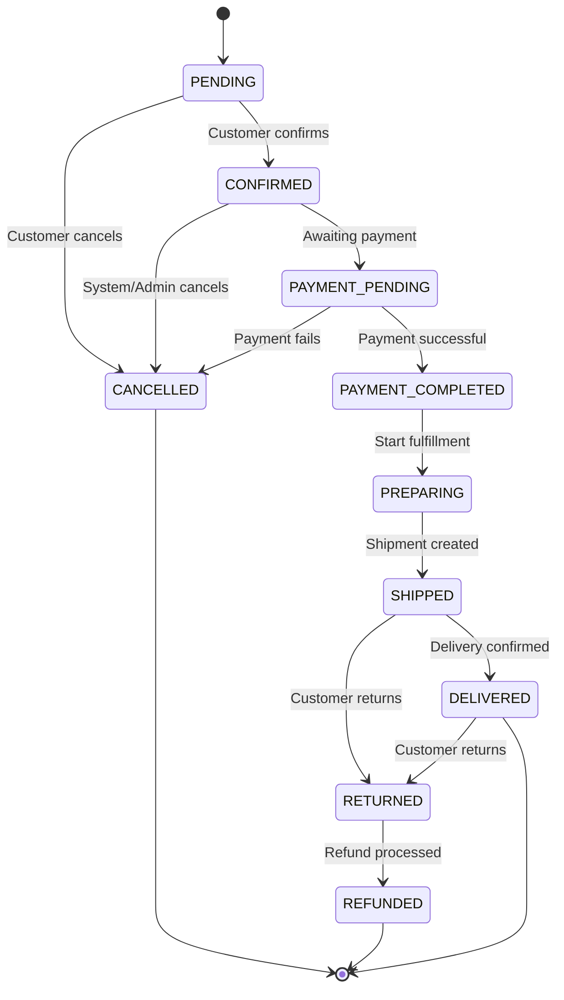

# Order Management Service Detailed Design Document

## Table of Contents

1. [Overview](#overview)
2. [Technical Specifications](#technical-specifications)
3. [Architecture Design](#architecture-design)
4. [API Design](#api-design)
5. [Database Design](#database-design)
6. [Order Processing Design](#order-processing-design)
7. [Order History Design](#order-history-design)
8. [Error Handling](#error-handling)
9. [Test Design](#test-design)
10. [Local Development Environment](#local-development)
11. [Production Deployment](#production-deployment)
12. [Monitoring and Operations](#monitoring-operations)
13. [Incident Response](#incident-response)

## Overview

### Service Summary

The Order Management Service is a microservice responsible for handling the order management functions of the ski equipment e-commerce site. It provides all order-related features, including order creation, processing, tracking, and history management.

### Key Responsibilities

- **Order Processing**: Creating, validating, and confirming orders.
- **Order Status Management**: Tracking and updating order statuses.
- **Order History**: Managing and searching order history.
- **Order Modification**: Handling order changes and cancellations.
- **Shipping Management**: Managing and tracking shipping information.
- **Returns and Exchanges**: Processing returns and exchanges.

### Business Value

- **Sales Management**: Securing sales through accurate order processing.
- **Customer Satisfaction**: Providing a smooth ordering experience.
- **Operational Efficiency**: Automated order processing flow.
- **Inventory Integration**: Real-time integration with inventory management.

## Technical Specifications

### Technology Stack

| Category | Technology/Library | Version | Purpose |
|---|---|---|---|
| **Runtime** | OpenJDK | 21 LTS | Java execution environment |
| **Framework** | Jakarta EE | 11 | Enterprise framework |
| **Application Server** | WildFly | 31.0.1 | Jakarta EE application server |
| **Persistence** | Jakarta Persistence (JPA) | 3.2 | ORM |
| **Data Access** | Jakarta Data | 1.0 | Repository abstraction |
| **REST API** | Jakarta REST (JAX-RS) | 4.0 | RESTful Web Services |
| **CDI** | Jakarta CDI | 4.1 | Dependency Injection and Management |
| **Validation** | Jakarta Validation | 3.1 | Bean Validation |
| **JSON Processing** | Jakarta JSON-P | 2.1 | JSON processing |
| **Database** | PostgreSQL | 16 | Primary database |
| **Cache** | Redis | 7.2 | Order caching |
| **Message Queue** | Apache Kafka | 3.7 | Order event processing |
| **Workflow** | Camunda | 7.20 | Order workflow |
| **Monitoring** | MicroProfile Metrics | 5.1 | Metrics collection |
| **Tracing** | MicroProfile OpenTelemetry | 2.0 | Distributed tracing |
| **Health Check** | MicroProfile Health | 4.0 | Health checks |
| **Configuration** | MicroProfile Config | 3.1 | Configuration management |

### Excluded Technologies

- **Lombok**: Not used, to leverage Jakarta EE 11's Record classes and modern Java features.

### Java 21 LTS Features Utilized

- **Virtual Threads**: For highly concurrent order processing.
- **Record Classes**: For order data structures.
- **Pattern Matching**: For determining order status.
- **Text Blocks**: For defining complex SQL queries.
- **Sealed Classes**: For type safety of order events.

## Architecture Design

### System Architecture Diagram



### Domain Model Design

```java
// Order Entity
@Entity
@Table(name = "orders")
public class Order {
    
    @Id
    @GeneratedValue(strategy = GenerationType.UUID)
    private UUID id;
    
    @Column(name = "order_number", unique = true, nullable = false)
    private String orderNumber;
    
    @Column(name = "customer_id", nullable = false)
    private UUID customerId;
    
    @Enumerated(EnumType.STRING)
    @Column(name = "status", nullable = false)
    private OrderStatus status;
    
    @Embedded
    private OrderAmount orderAmount;
    
    @Embedded
    private ShippingAddress shippingAddress;
    
    @Embedded
    private BillingAddress billingAddress;
    
    @Column(name = "payment_method")
    private String paymentMethod;
    
    @Column(name = "shipping_method")
    private String shippingMethod;
    
    @Column(name = "notes")
    private String notes;
    
    @Column(name = "expected_delivery_date")
    private LocalDate expectedDeliveryDate;
    
    @Column(name = "created_at", nullable = false)
    private LocalDateTime createdAt;
    
    @Column(name = "updated_at")
    private LocalDateTime updatedAt;
    
    @Column(name = "confirmed_at")
    private LocalDateTime confirmedAt;
    
    @Column(name = "shipped_at")
    private LocalDateTime shippedAt;
    
    @Column(name = "delivered_at")
    private LocalDateTime deliveredAt;
    
    @Column(name = "cancelled_at")
    private LocalDateTime cancelledAt;
    
    // Related Entities
    @OneToMany(mappedBy = "order", cascade = CascadeType.ALL, fetch = FetchType.LAZY)
    private List<OrderItem> orderItems = new ArrayList<>();
    
    @OneToMany(mappedBy = "order", cascade = CascadeType.ALL, fetch = FetchType.LAZY)
    private List<OrderStatusHistory> statusHistory = new ArrayList<>();
    
    @OneToMany(mappedBy = "order", cascade = CascadeType.ALL, fetch = FetchType.LAZY)
    private List<OrderPayment> payments = new ArrayList<>();
    
    @OneToMany(mappedBy = "order", cascade = CascadeType.ALL, fetch = FetchType.LAZY)
    private List<OrderShipment> shipments = new ArrayList<>();
    
    // Business Logic
    public boolean canBeCancelled() {
        return status == OrderStatus.PENDING || status == OrderStatus.CONFIRMED;
    }
    
    public boolean canBeModified() {
        return status == OrderStatus.PENDING;
    }
    
    public boolean isCompleted() {
        return status == OrderStatus.DELIVERED;
    }
    
    public void confirm() {
        if (status != OrderStatus.PENDING) {
            throw new InvalidOrderStateException("Cannot confirm order");
        }
        this.status = OrderStatus.CONFIRMED;
        this.confirmedAt = LocalDateTime.now();
        this.updatedAt = LocalDateTime.now();
    }
    
    public void cancel(String reason) {
        if (!canBeCancelled()) {
            throw new InvalidOrderStateException("Cannot cancel order");
        }
        this.status = OrderStatus.CANCELLED;
        this.cancelledAt = LocalDateTime.now();
        this.updatedAt = LocalDateTime.now();
    }
    
    public BigDecimal getTotalAmount() {
        return orderAmount.totalAmount();
    }
}

// Order Item Entity
@Entity
@Table(name = "order_items")
public class OrderItem {
    
    @Id
    @GeneratedValue(strategy = GenerationType.UUID)
    private UUID id;
    
    @ManyToOne(fetch = FetchType.LAZY)
    @JoinColumn(name = "order_id", nullable = false)
    private Order order;
    
    @Column(name = "product_id", nullable = false)
    private UUID productId;
    
    @Column(name = "sku", nullable = false)
    private String sku;
    
    @Column(name = "product_name", nullable = false)
    private String productName;
    
    @Column(name = "unit_price", precision = 10, scale = 2, nullable = false)
    private BigDecimal unitPrice;
    
    @Column(name = "quantity", nullable = false)
    private Integer quantity;
    
    @Column(name = "discount_amount", precision = 10, scale = 2)
    private BigDecimal discountAmount = BigDecimal.ZERO;
    
    @Column(name = "tax_amount", precision = 10, scale = 2)
    private BigDecimal taxAmount = BigDecimal.ZERO;
    
    @Column(name = "total_amount", precision = 10, scale = 2, nullable = false)
    private BigDecimal totalAmount;
    
    @Column(name = "reservation_id")
    private UUID reservationId;
    
    @Column(name = "created_at", nullable = false)
    private LocalDateTime createdAt;
    
    public BigDecimal calculateSubtotal() {
        return unitPrice.multiply(BigDecimal.valueOf(quantity));
    }
    
    public BigDecimal calculateFinalAmount() {
        return calculateSubtotal().subtract(discountAmount).add(taxAmount);
    }
}

// Order Status History
@Entity
@Table(name = "order_status_history")
public class OrderStatusHistory {
    
    @Id
    @GeneratedValue(strategy = GenerationType.UUID)
    private UUID id;
    
    @ManyToOne(fetch = FetchType.LAZY)
    @JoinColumn(name = "order_id", nullable = false)
    private Order order;
    
    @Enumerated(EnumType.STRING)
    @Column(name = "from_status")
    private OrderStatus fromStatus;
    
    @Enumerated(EnumType.STRING)
    @Column(name = "to_status", nullable = false)
    private OrderStatus toStatus;
    
    @Column(name = "reason")
    private String reason;
    
    @Column(name = "notes")
    private String notes;
    
    @Column(name = "changed_by")
    private UUID changedBy;
    
    @Column(name = "changed_at", nullable = false)
    private LocalDateTime changedAt;
}

// Embeddable Classes
@Embeddable
public record OrderAmount(
    @Column(name = "subtotal_amount", precision = 12, scale = 2)
    BigDecimal subtotalAmount,
    
    @Column(name = "discount_amount", precision = 12, scale = 2)
    BigDecimal discountAmount,
    
    @Column(name = "tax_amount", precision = 12, scale = 2)
    BigDecimal taxAmount,
    
    @Column(name = "shipping_amount", precision = 12, scale = 2)
    BigDecimal shippingAmount,
    
    @Column(name = "total_amount", precision = 12, scale = 2)
    BigDecimal totalAmount,
    
    @Column(name = "currency", length = 3)
    String currency
) {
    public static OrderAmount create(BigDecimal subtotal, BigDecimal discount, 
                                   BigDecimal tax, BigDecimal shipping) {
        var total = subtotal.subtract(discount).add(tax).add(shipping);
        return new OrderAmount(subtotal, discount, tax, shipping, total, "JPY");
    }
}

@Embeddable
public record ShippingAddress(
    @Column(name = "shipping_first_name")
    String firstName,
    
    @Column(name = "shipping_last_name")
    String lastName,
    
    @Column(name = "shipping_postal_code")
    String postalCode,
    
    @Column(name = "shipping_prefecture")
    String prefecture,
    
    @Column(name = "shipping_city")
    String city,
    
    @Column(name = "shipping_address_line1")
    String addressLine1,
    
    @Column(name = "shipping_address_line2")
    String addressLine2,
    
    @Column(name = "shipping_phone_number")
    String phoneNumber
) {
    public String getFullAddress() {
        var builder = new StringBuilder()
            .append(prefecture)
            .append(city)
            .append(addressLine1);
            
        if (addressLine2 != null && !addressLine2.isBlank()) {
            builder.append(" ").append(addressLine2);
        }
        
        return builder.toString();
    }
}

// Sealed Classes for Events
public sealed interface OrderEvent
    permits OrderCreatedEvent, OrderConfirmedEvent, OrderCancelledEvent, 
            OrderShippedEvent, OrderDeliveredEvent, OrderReturnedEvent {
}

public record OrderCreatedEvent(
    UUID orderId,
    String orderNumber,
    UUID customerId,
    BigDecimal totalAmount,
    LocalDateTime timestamp
) implements OrderEvent {}

public record OrderConfirmedEvent(
    UUID orderId,
    String orderNumber,
    LocalDateTime confirmedAt,
    LocalDateTime expectedDeliveryDate
) implements OrderEvent {}

public record OrderCancelledEvent(
    UUID orderId,
    String orderNumber,
    String cancelReason,
    LocalDateTime cancelledAt
) implements OrderEvent {}

// Enums
public enum OrderStatus {
    PENDING("Processing"),
    CONFIRMED("Confirmed"),
    PAYMENT_PENDING("Payment Pending"),
    PAYMENT_COMPLETED("Payment Completed"),
    PREPARING("Preparing"),
    SHIPPED("Shipped"),
    DELIVERED("Delivered"),
    CANCELLED("Cancelled"),
    RETURNED("Returned"),
    REFUNDED("Refunded");
    
    private final String description;
    
    OrderStatus(String description) {
        this.description = description;
    }
    
    public String getDescription() {
        return description;
    }
    
    public boolean isTerminal() {
        return this == DELIVERED || this == CANCELLED || this == REFUNDED;
    }
    
    public boolean canTransitionTo(OrderStatus targetStatus) {
        return switch (this) {
            case PENDING -> targetStatus == CONFIRMED || targetStatus == CANCELLED;
            case CONFIRMED -> targetStatus == PAYMENT_PENDING || targetStatus == CANCELLED;
            case PAYMENT_PENDING -> targetStatus == PAYMENT_COMPLETED || targetStatus == CANCELLED;
            case PAYMENT_COMPLETED -> targetStatus == PREPARING || targetStatus == CANCELLED;
            case PREPARING -> targetStatus == SHIPPED;
            case SHIPPED -> targetStatus == DELIVERED || targetStatus == RETURNED;
            case DELIVERED -> targetStatus == RETURNED;
            case RETURNED -> targetStatus == REFUNDED;
            default -> false;
        };
    }
}

public enum PaymentStatus {
    PENDING("Payment Pending"),
    AUTHORIZED("Authorized"),
    CAPTURED("Captured"),
    FAILED("Failed"),
    CANCELLED("Cancelled"),
    REFUNDED("Refunded");
    
    private final String description;
    
    PaymentStatus(String description) {
        this.description = description;
    }
    
    public String getDescription() {
        return description;
    }
}

public enum ShipmentStatus {
    PREPARING("Preparing"),
    SHIPPED("Shipped"),
    IN_TRANSIT("In Transit"),
    DELIVERED("Delivered"),
    FAILED_DELIVERY("Failed Delivery"),
    RETURNED("Returned");
    
    private final String description;
    
    ShipmentStatus(String description) {
        this.description = description;
    }
    
    public String getDescription() {
        return description;
    }
}
```

### Service Layer Design

```java
// Order Service
@ApplicationScoped
@Transactional
public class OrderService {
    
    private static final Logger logger = LoggerFactory.getLogger(OrderService.class);
    
    @Inject
    private OrderRepository orderRepository;
    
    @Inject
    private OrderItemRepository orderItemRepository;
    
    @Inject
    private OrderNumberGenerator orderNumberGenerator;
    
    @Inject
    private InventoryServiceClient inventoryClient;
    
    @Inject
    private PaymentServiceClient paymentClient;
    
    @Inject
    private OrderEventPublisher eventPublisher;
    
    @Inject
    private OrderValidator orderValidator;
    
    @Inject
    private OrderProcessingSaga orderSaga;
    
    // CQRS - Command Handler
    @CommandHandler
    public CompletableFuture<OrderCreatedEvent> handle(CreateOrderCommand command) {
        return CompletableFuture
            .supplyAsync(() -> {
                // Order validation
                orderValidator.validateOrderRequest(command.toRequest());
                
                // Create order
                var order = buildOrder(command.toRequest());
                var savedOrder = orderRepository.save(order);
                
                // Create event
                var event = new OrderCreatedEvent(
                    savedOrder.getId(),
                    savedOrder.getOrderNumber(),
                    savedOrder.getCustomerId(),
                    savedOrder.getTotalAmount(),
                    LocalDateTime.now(),
                    savedOrder.getOrderItems().stream()
                        .map(this::toOrderItemDto)
                        .toList()
                );
                
                // Publish event
                eventPublisher.publish(event);
                
                // Start Saga
                orderSaga.startOrderProcessingSaga(event);
                
                logger.info("Order created: {}", savedOrder.getOrderNumber());
                return event;
            }, Virtual.ofVirtual().factory());
    }
    
    @CommandHandler
    public CompletableFuture<OrderConfirmedEvent> handle(ConfirmOrderCommand command) {
        return CompletableFuture
            .supplyAsync(() -> {
                var order = findOrderById(command.orderId());
                
                if (!order.canBeModified()) {
                    throw new InvalidOrderStateException("Cannot confirm order");
                }
                
                // Confirm order
                order.confirm();
                
                // Add status history
                addStatusHistory(order, OrderStatus.PENDING, OrderStatus.CONFIRMED, "Order confirmed");
                
                orderRepository.save(order);
                
                // Publish event
                var event = new OrderConfirmedEvent(
                    order.getId(),
                    order.getOrderNumber(),
                    order.getConfirmedAt(),
                    order.getExpectedDeliveryDate()
                );
                
                eventPublisher.publish(event);
                
                logger.info("Order confirmed: {}", order.getOrderNumber());
                return event;
            }, Virtual.ofVirtual().factory());
    }
    
    @CommandHandler
    public CompletableFuture<OrderCancelledEvent> handle(CancelOrderCommand command) {
        return CompletableFuture
            .supplyAsync(() -> {
                var order = findOrderById(command.orderId());
                
                if (!order.canBeCancelled()) {
                    throw new InvalidOrderStateException("Cannot cancel order");
                }
                
                // Cancel order
                order.cancel(command.reason());
                
                // Add status history
                addStatusHistory(order, order.getStatus(), OrderStatus.CANCELLED, command.reason());
                
                orderRepository.save(order);
                
                // Publish event
                var event = new OrderCancelledEvent(
                    order.getId(),
                    order.getOrderNumber(),
                    command.reason(),
                    order.getCancelledAt()
                );
                
                eventPublisher.publish(event);
                
                // Start compensation saga
                orderSaga.startOrderCancellationSaga(event);
                
                logger.info("Order cancelled: {}, Reason: {}", order.getOrderNumber(), command.reason());
                return event;
            }, Virtual.ofVirtual().factory());
    }
    
    // CQRS - Query Handler
    @QueryHandler
    public OrderProjection handle(GetOrderByIdQuery query) {
        var order = findOrderById(query.orderId());
        return OrderProjection.from(order);
    }
    
    @QueryHandler
    public List<OrderSummaryProjection> handle(GetOrdersByCustomerQuery query) {
        var orders = orderRepository.findByCustomerIdOrderByCreatedAtDesc(
            query.customerId(), 
            PageRequest.of(query.page(), query.size())
        );
        return orders.stream()
            .map(OrderSummaryProjection::from)
            .toList();
    }
    
    @QueryHandler
    public OrderStatisticsProjection handle(GetOrderStatisticsQuery query) {
        var totalOrders = orderRepository.countOrdersInPeriod(query.from(), query.to());
        var totalAmount = orderRepository.sumOrderAmountInPeriod(query.from(), query.to());
        var completedOrders = orderRepository.countCompletedOrdersInPeriod(query.from(), query.to());
        var cancelledOrders = orderRepository.countCancelledOrdersInPeriod(query.from(), query.to());
        
        return new OrderStatisticsProjection(
            totalOrders,
            totalAmount,
            completedOrders,
            cancelledOrders,
            calculateConversionRate(completedOrders, totalOrders)
        );
    }
    
    // Event Handlers for Service Integration
    @EventHandler
    @Async
    public void handle(InventoryReservedEvent event) {
        var order = findOrderById(event.orderId());
        logger.info("Inventory reserved for order: {}", order.getOrderNumber());
        
        // Next step: Payment processing
        var paymentCommand = new ProcessPaymentCommand(
            order.getId(),
            order.getCustomerId(),
            order.getTotalAmount(),
            order.getPaymentMethod()
        );
        
        // Trigger payment processing
        eventPublisher.publish(new PaymentProcessingRequiredEvent(paymentCommand));
    }
    
    @EventHandler
    @Async
    public void handle(PaymentCompletedEvent event) {
        var order = findOrderById(event.orderId());
        order.setStatus(OrderStatus.PAYMENT_COMPLETED);
        orderRepository.save(order);
        
        logger.info("Payment completed for order: {}", order.getOrderNumber());
        
        // Publish event
        eventPublisher.publish(new OrderPaymentCompletedEvent(
            order.getId(),
            order.getOrderNumber(),
            event.transactionId(),
            LocalDateTime.now()
        ));
    }
    
    @EventHandler
    @Async
    public void handle(ShipmentCreatedEvent event) {
        var order = findOrderById(event.orderId());
        order.setStatus(OrderStatus.SHIPPED);
        order.setShippedAt(LocalDateTime.now());
        orderRepository.save(order);
        
        logger.info("Order shipped: {}", order.getOrderNumber());
        
        // Publish event
        eventPublisher.publish(new OrderShippedEvent(
            order.getId(),
            order.getOrderNumber(),
            event.trackingNumber(),
            order.getShippedAt()
        ));
    }
    
    private Order buildOrder(CreateOrderRequest request) {
        var orderNumber = orderNumberGenerator.generate();
        
        var order = new Order();
        order.setOrderNumber(orderNumber);
        order.setCustomerId(request.customerId());
        order.setStatus(OrderStatus.PENDING);
        order.setShippingAddress(request.shippingAddress());
        order.setBillingAddress(request.billingAddress());
        order.setPaymentMethod(request.paymentMethod());
        order.setShippingMethod(request.shippingMethod());
        order.setNotes(request.notes());
        order.setCreatedAt(LocalDateTime.now());
        
        // Create order items
        var orderItems = new ArrayList<OrderItem>();
        var subtotal = BigDecimal.ZERO;
        
        for (var itemRequest : request.items()) {
            var orderItem = new OrderItem();
            orderItem.setOrder(order);
            orderItem.setProductId(itemRequest.productId());
            orderItem.setSku(itemRequest.sku());
            orderItem.setProductName(itemRequest.productName());
            orderItem.setUnitPrice(itemRequest.unitPrice());
            orderItem.setQuantity(itemRequest.quantity());
            orderItem.setCreatedAt(LocalDateTime.now());
            
            var itemTotal = orderItem.calculateFinalAmount();
            orderItem.setTotalAmount(itemTotal);
            subtotal = subtotal.add(itemTotal);
            
            orderItems.add(orderItem);
        }
        
        order.setOrderItems(orderItems);
        
        // Calculate amounts
        var discount = calculateDiscount(order);
        var tax = calculateTax(subtotal.subtract(discount));
        var shipping = calculateShipping(order);
        
        var orderAmount = OrderAmount.create(subtotal, discount, tax, shipping);
        order.setOrderAmount(orderAmount);
        
        return order;
    }
    
    public Order findOrderById(UUID orderId) {
        return orderRepository.findById(orderId)
            .orElseThrow(() -> new OrderNotFoundException("Order not found: " + orderId));
    }
    
    public Order findOrderByNumber(String orderNumber) {
        return orderRepository.findByOrderNumber(orderNumber)
            .orElseThrow(() -> new OrderNotFoundException("Order not found: " + orderNumber));
    }
    
    private void addStatusHistory(Order order, OrderStatus fromStatus, OrderStatus toStatus, String reason) {
        var history = new OrderStatusHistory();
        history.setOrder(order);
        history.setFromStatus(fromStatus);
        history.setToStatus(toStatus);
        history.setReason(reason);
        history.setChangedAt(LocalDateTime.now());
        
        order.getStatusHistory().add(history);
    }
    
    private OrderItemDto toOrderItemDto(OrderItem item) {
        return new OrderItemDto(
            item.getProductId(),
            item.getSku(),
            item.getProductName(),
            item.getUnitPrice(),
            item.getQuantity()
        );
    }
    
    private BigDecimal calculateDiscount(Order order) {
        // Discount calculation logic (coupons, campaigns, etc.)
        return BigDecimal.ZERO;
    }
    
    private BigDecimal calculateTax(BigDecimal amount) {
        // Consumption tax calculation (10%)
        return amount.multiply(new BigDecimal("0.10"));
    }
    
    private BigDecimal calculateShipping(Order order) {
        // Shipping cost calculation logic
        return new BigDecimal("500"); // Basic shipping cost
    }
    
    private BigDecimal calculateConversionRate(long completed, long total) {
        if (total == 0) return BigDecimal.ZERO;
        return BigDecimal.valueOf(completed)
            .divide(BigDecimal.valueOf(total), 4, RoundingMode.HALF_UP)
            .multiply(BigDecimal.valueOf(100));
    }
}

// Saga Pattern Implementation
@ApplicationScoped
public class OrderProcessingSaga {
    
    private static final Logger logger = LoggerFactory.getLogger(OrderProcessingSaga.class);
    
    @Inject
    private InventoryServiceClient inventoryClient;
    
    @Inject
    private PaymentServiceClient paymentClient;
    
    @Inject
    private ShippingServiceClient shippingClient;
    
    @Inject
    private OrderEventPublisher eventPublisher;
    
    @Inject
    private SagaStateRepository sagaStateRepository;
    
    @Async
    public CompletableFuture<SagaResult> startOrderProcessingSaga(OrderCreatedEvent orderEvent) {
        var sagaId = UUID.randomUUID();
        var sagaState = new SagaState(sagaId, orderEvent.orderId(), SagaType.ORDER_PROCESSING);
        sagaStateRepository.save(sagaState);
        
        logger.info("Starting order processing saga: {} for order: {}", sagaId, orderEvent.orderNumber());
        
        return CompletableFuture
            .supplyAsync(() -> reserveInventory(orderEvent), Virtual.ofVirtual().factory())
            .thenCompose(this::processPayment)
            .thenCompose(this::arrangeShipping)
            .thenApply(result -> {
                sagaState.complete();
                sagaStateRepository.save(sagaState);
                return result;
            })
            .exceptionally(throwable -> {
                logger.error("Order processing saga failed: " + sagaId, throwable);
                return handleSagaFailure(sagaState, throwable);
            });
    }
    
    @Async
    public CompletableFuture<SagaResult> startOrderCancellationSaga(OrderCancelledEvent orderEvent) {
        var sagaId = UUID.randomUUID();
        var sagaState = new SagaState(sagaId, orderEvent.orderId(), SagaType.ORDER_CANCELLATION);
        sagaStateRepository.save(sagaState);
        
        logger.info("Starting order cancellation saga: {} for order: {}", sagaId, orderEvent.orderNumber());
        
        return CompletableFuture
            .supplyAsync(() -> cancelPayment(orderEvent), Virtual.ofVirtual().factory())
            .thenCompose(result -> releaseInventory(orderEvent))
            .thenCompose(result -> cancelShipping(orderEvent))
            .thenApply(result -> {
                sagaState.complete();
                sagaStateRepository.save(sagaState);
                return result;
            })
            .exceptionally(throwable -> {
                logger.error("Order cancellation saga failed: " + sagaId, throwable);
                sagaState.fail(throwable.getMessage());
                sagaStateRepository.save(sagaState);
                return new SagaResult(false, throwable.getMessage());
            });
    }
    
    private SagaStepResult reserveInventory(OrderCreatedEvent orderEvent) {
        try {
            var reservationRequests = orderEvent.orderItems().stream()
                .map(item -> new InventoryReservationRequest(
                    item.sku(),
                    item.quantity(),
                    orderEvent.orderId(),
                    orderEvent.customerId()
                ))
                .toList();
            
            var reservationResults = inventoryClient.reserveInventoryForOrder(reservationRequests);
            
            if (reservationResults.stream().allMatch(r -> r.success())) {
                eventPublisher.publish(new InventoryReservedEvent(
                    orderEvent.orderId(),
                    orderEvent.orderNumber(),
                    reservationResults.stream().map(r -> r.reservationId()).toList(),
                    LocalDateTime.now()
                ));
                return new SagaStepResult(true, "Inventory reserved successfully");
            } else {
                throw new SagaStepException("Failed to reserve inventory");
            }
        } catch (Exception e) {
            throw new SagaStepException("Inventory reservation failed", e);
        }
    }
    
    private CompletableFuture<SagaStepResult> processPayment(SagaStepResult previousStep) {
        if (!previousStep.success()) {
            return CompletableFuture.failedFuture(new SagaStepException("Previous step failed"));
        }
        
        return CompletableFuture.supplyAsync(() -> {
            try {
                // Payment processing logic
                logger.info("Processing payment for saga step");
                return new SagaStepResult(true, "Payment processed successfully");
            } catch (Exception e) {
                throw new SagaStepException("Payment processing failed", e);
            }
        }, Virtual.ofVirtual().factory());
    }
    
    private CompletableFuture<SagaStepResult> arrangeShipping(SagaStepResult previousStep) {
        if (!previousStep.success()) {
            return CompletableFuture.failedFuture(new SagaStepException("Previous step failed"));
        }
        
        return CompletableFuture.supplyAsync(() -> {
            try {
                // Shipping arrangement logic
                logger.info("Arranging shipping for saga step");
                return new SagaStepResult(true, "Shipping arranged successfully");
            } catch (Exception e) {
                throw new SagaStepException("Shipping arrangement failed", e);
            }
        }, Virtual.ofVirtual().factory());
    }
    
    private SagaStepResult cancelPayment(OrderCancelledEvent orderEvent) {
        try {
            // Payment cancellation logic
            logger.info("Cancelling payment for order: {}", orderEvent.orderNumber());
            return new SagaStepResult(true, "Payment cancelled successfully");
        } catch (Exception e) {
            throw new SagaStepException("Payment cancellation failed", e);
        }
    }
    
    private CompletableFuture<SagaStepResult> releaseInventory(OrderCancelledEvent orderEvent) {
        return CompletableFuture.supplyAsync(() -> {
            try {
                // Inventory release logic
                logger.info("Releasing inventory for order: {}", orderEvent.orderNumber());
                return new SagaStepResult(true, "Inventory released successfully");
            } catch (Exception e) {
                throw new SagaStepException("Inventory release failed", e);
            }
        }, Virtual.ofVirtual().factory());
    }
    
    private CompletableFuture<SagaStepResult> cancelShipping(OrderCancelledEvent orderEvent) {
        return CompletableFuture.supplyAsync(() -> {
            try {
                // Shipping cancellation logic
                logger.info("Cancelling shipping for order: {}", orderEvent.orderNumber());
                return new SagaStepResult(true, "Shipping cancelled successfully");
            } catch (Exception e) {
                throw new SagaStepException("Shipping cancellation failed", e);
            }
        }, Virtual.ofVirtual().factory());
    }
    
    private SagaResult handleSagaFailure(SagaState sagaState, Throwable throwable) {
        logger.error("Saga failed, starting compensation: " + sagaState.getId(), throwable);
        sagaState.fail(throwable.getMessage());
        sagaStateRepository.save(sagaState);
        
        // Start compensation saga
        startCompensationSaga(sagaState);
        
        return new SagaResult(false, throwable.getMessage());
    }
    
    @Async
    private void startCompensationSaga(SagaState failedSaga) {
        logger.info("Starting compensation saga for: {}", failedSaga.getId());
        
        CompletableFuture
            .supplyAsync(() -> {
                // Compensation logic based on failed saga state
                if (failedSaga.getLastCompletedStep() != null) {
                    switch (failedSaga.getLastCompletedStep()) {
                        case "INVENTORY_RESERVED" -> compensateInventoryReservation(failedSaga);
                        case "PAYMENT_PROCESSED" -> compensatePayment(failedSaga);
                        case "SHIPPING_ARRANGED" -> compensateShipping(failedSaga);
                    }
                }
                return null;
            }, Virtual.ofVirtual().factory())
            .exceptionally(throwable -> {
                logger.error("Compensation saga failed: " + failedSaga.getId(), throwable);
                return null;
            });
    }
    
    private void compensateInventoryReservation(SagaState sagaState) {
        // Release reserved inventory
        logger.info("Compensating inventory reservation for saga: {}", sagaState.getId());
    }
    
    private void compensatePayment(SagaState sagaState) {
        // Refund payment
        logger.info("Compensating payment for saga: {}", sagaState.getId());
    }
    
    private void compensateShipping(SagaState sagaState) {
        // Cancel shipping
        logger.info("Compensating shipping for saga: {}", sagaState.getId());
    }
}

// Order Number Generation Service
@ApplicationScoped
public class OrderNumberGenerator {
    
    @Inject
    private RedisTemplate redisTemplate;
    
    public String generate() {
        var today = LocalDate.now();
        var datePrefix = today.format(DateTimeFormatter.ofPattern("yyyyMMdd"));
        
        // Manage daily sequence in Redis
        var counterKey = "order_counter:" + datePrefix;
        var counter = redisTemplate.opsForValue().increment(counterKey);
        
        // If the counter is new, set an expiration
        if (counter == 1) {
            redisTemplate.expire(counterKey, Duration.ofDays(1));
        }
        
        return String.format("ORD-%s-%06d", datePrefix, counter);
    }
}

// Order Validator
@ApplicationScoped
public class OrderValidator {
    
    @Inject
    private ProductServiceClient productClient;
    
    @Inject
    private UserServiceClient userClient;
    
    public void validateOrderRequest(CreateOrderRequest request) {
        var violations = new ArrayList<String>();
        
        // Check if customer exists
        if (!userClient.existsUser(request.customerId())) {
            violations.add("Customer does not exist");
        }
        
        // Check product existence and price
        for (var item : request.items()) {
            var product = productClient.getProduct(item.productId());
            if (product.isEmpty()) {
                violations.add("Product does not exist: " + item.sku());
                continue;
            }
            
            if (!product.get().price().equals(item.unitPrice())) {
                violations.add("Product price does not match: " + item.sku());
            }
            
            if (item.quantity() <= 0) {
                violations.add("Quantity must be at least 1: " + item.sku());
            }
        }
        
        // Check shipping address
        if (request.shippingAddress() == null) {
            violations.add("Shipping address is required");
        }
        
        if (!violations.isEmpty()) {
            throw new OrderValidationException(violations);
        }
    }
}
```

### Record-based DTOs

```java
// Request DTOs
public record CreateOrderRequest(
    UUID customerId,
    List<OrderItemRequest> items,
    ShippingAddress shippingAddress,
    BillingAddress billingAddress,
    String paymentMethod,
    String shippingMethod,
    String notes
) {}

public record OrderItemRequest(
    UUID productId,
    String sku,
    String productName,
    BigDecimal unitPrice,
    Integer quantity,
    UUID customerId
) {}

public record UpdateOrderRequest(
    List<OrderItemRequest> items,
    ShippingAddress shippingAddress,
    String notes
) {}

// CQRS Commands
public sealed interface OrderCommand permits 
    CreateOrderCommand, ConfirmOrderCommand, CancelOrderCommand, UpdateOrderCommand {
}

public record CreateOrderCommand(
    UUID commandId,
    UUID customerId,
    List<OrderItemRequest> items,
    ShippingAddress shippingAddress,
    BillingAddress billingAddress,
    String paymentMethod,
    String shippingMethod,
    String notes,
    LocalDateTime timestamp
) implements OrderCommand {
    
    public CreateOrderRequest toRequest() {
        return new CreateOrderRequest(
            customerId, items, shippingAddress, billingAddress,
            paymentMethod, shippingMethod, notes
        );
    }
}

public record ConfirmOrderCommand(
    UUID commandId,
    UUID orderId,
    String reason,
    LocalDateTime timestamp
) implements OrderCommand {}

public record CancelOrderCommand(
    UUID commandId,
    UUID orderId,
    String reason,
    LocalDateTime timestamp
) implements OrderCommand {}

public record UpdateOrderCommand(
    UUID commandId,
    UUID orderId,
    List<OrderItemRequest> items,
    ShippingAddress shippingAddress,
    String notes,
    LocalDateTime timestamp
) implements OrderCommand {}

// CQRS Queries
public sealed interface OrderQuery permits 
    GetOrderByIdQuery, GetOrderByNumberQuery, GetOrdersByCustomerQuery, 
    GetOrderStatisticsQuery, SearchOrdersQuery {
}

public record GetOrderByIdQuery(
    UUID queryId,
    UUID orderId,
    LocalDateTime timestamp
) implements OrderQuery {}

public record GetOrderByNumberQuery(
    UUID queryId,
    String orderNumber,
    LocalDateTime timestamp
) implements OrderQuery {}

public record GetOrdersByCustomerQuery(
    UUID queryId,
    UUID customerId,
    int page,
    int size,
    LocalDateTime timestamp
) implements OrderQuery {}

public record GetOrderStatisticsQuery(
    UUID queryId,
    LocalDate from,
    LocalDate to,
    LocalDateTime timestamp
) implements OrderQuery {}

public record SearchOrdersQuery(
    UUID queryId,
    OrderSearchCriteria criteria,
    int page,
    int size,
    LocalDateTime timestamp
) implements OrderQuery {}

// CQRS Projections (Read Models)
public record OrderProjection(
    UUID orderId,
    String orderNumber,
    UUID customerId,
    OrderStatus status,
    OrderAmount orderAmount,
    ShippingAddress shippingAddress,
    BillingAddress billingAddress,
    String paymentMethod,
    String shippingMethod,
    List<OrderItemProjection> items,
    List<OrderStatusProjection> statusHistory,
    LocalDateTime createdAt,
    LocalDateTime updatedAt,
    LocalDateTime expectedDeliveryDate
) {
    public static OrderProjection from(Order order) {
        var items = order.getOrderItems().stream()
            .map(OrderItemProjection::from)
            .toList();
            
        var statusHistory = order.getStatusHistory().stream()
            .map(OrderStatusProjection::from)
            .toList();
            
        return new OrderProjection(
            order.getId(),
            order.getOrderNumber(),
            order.getCustomerId(),
            order.getStatus(),
            order.getOrderAmount(),
            order.getShippingAddress(),
            order.getBillingAddress(),
            order.getPaymentMethod(),
            order.getShippingMethod(),
            items,
            statusHistory,
            order.getCreatedAt(),
            order.getUpdatedAt(),
            order.getExpectedDeliveryDate()
        );
    }
}

public record OrderSummaryProjection(
    UUID orderId,
    String orderNumber,
    OrderStatus status,
    BigDecimal totalAmount,
    LocalDateTime createdAt,
    LocalDateTime expectedDeliveryDate
) {
    public static OrderSummaryProjection from(Order order) {
        return new OrderSummaryProjection(
            order.getId(),
            order.getOrderNumber(),
            order.getStatus(),
            order.getTotalAmount(),
            order.getCreatedAt(),
            order.getExpectedDeliveryDate()
        );
    }
}

public record OrderItemProjection(
    UUID itemId,
    UUID productId,
    String sku,
    String productName,
    BigDecimal unitPrice,
    Integer quantity,
    BigDecimal totalAmount
) {
    public static OrderItemProjection from(OrderItem item) {
        return new OrderItemProjection(
            item.getId(),
            item.getProductId(),
            item.getSku(),
            item.getProductName(),
            item.getUnitPrice(),
            item.getQuantity(),
            item.getTotalAmount()
        );
    }
}

public record OrderStatusProjection(
    OrderStatus fromStatus,
    OrderStatus toStatus,
    String reason,
    LocalDateTime changedAt
) {
    public static OrderStatusProjection from(OrderStatusHistory history) {
        return new OrderStatusProjection(
            history.getFromStatus(),
            history.getToStatus(),
            history.getReason(),
            history.getChangedAt()
        );
    }
}

public record OrderStatisticsProjection(
    long totalOrders,
    BigDecimal totalAmount,
    long completedOrders,
    long cancelledOrders,
    BigDecimal conversionRate
) {}

public record OrderSearchCriteria(
    String customerName,
    String orderNumber,
    OrderStatus status,
    LocalDate fromDate,
    LocalDate toDate,
    BigDecimal minAmount,
    BigDecimal maxAmount
) {}

// Saga Pattern Classes
@Entity
@Table(name = "saga_states")
public class SagaState {
    
    @Id
    private UUID id;
    
    @Column(name = "order_id", nullable = false)
    private UUID orderId;
    
    @Enumerated(EnumType.STRING)
    @Column(name = "saga_type", nullable = false)
    private SagaType sagaType;
    
    @Enumerated(EnumType.STRING)
    @Column(name = "status", nullable = false)
    private SagaStatus status;
    
    @Column(name = "current_step")
    private String currentStep;
    
    @Column(name = "last_completed_step")
    private String lastCompletedStep;
    
    @Column(name = "error_message")
    private String errorMessage;
    
    @Column(name = "started_at", nullable = false)
    private LocalDateTime startedAt;
    
    @Column(name = "completed_at")
    private LocalDateTime completedAt;
    
    public SagaState() {}
    
    public SagaState(UUID id, UUID orderId, SagaType sagaType) {
        this.id = id;
        this.orderId = orderId;
        this.sagaType = sagaType;
        this.status = SagaStatus.STARTED;
        this.startedAt = LocalDateTime.now();
    }
    
    public void complete() {
        this.status = SagaStatus.COMPLETED;
        this.completedAt = LocalDateTime.now();
    }
    
    public void fail(String errorMessage) {
        this.status = SagaStatus.FAILED;
        this.errorMessage = errorMessage;
        this.completedAt = LocalDateTime.now();
    }
    
    // Getters and setters
    public UUID getId() { return id; }
    public void setId(UUID id) { this.id = id; }
    
    public UUID getOrderId() { return orderId; }
    public void setOrderId(UUID orderId) { this.orderId = orderId; }
    
    public SagaType getSagaType() { return sagaType; }
    public void setSagaType(SagaType sagaType) { this.sagaType = sagaType; }
    
    public SagaStatus getStatus() { return status; }
    public void setStatus(SagaStatus status) { this.status = status; }
    
    public String getCurrentStep() { return currentStep; }
    public void setCurrentStep(String currentStep) { this.currentStep = currentStep; }
    
    public String getLastCompletedStep() { return lastCompletedStep; }
    public void setLastCompletedStep(String lastCompletedStep) { this.lastCompletedStep = lastCompletedStep; }
    
    public String getErrorMessage() { return errorMessage; }
    public void setErrorMessage(String errorMessage) { this.errorMessage = errorMessage; }
    
    public LocalDateTime getStartedAt() { return startedAt; }
    public void setStartedAt(LocalDateTime startedAt) { this.startedAt = startedAt; }
    
    public LocalDateTime getCompletedAt() { return completedAt; }
    public void setCompletedAt(LocalDateTime completedAt) { this.completedAt = completedAt; }
}

public enum SagaType {
    ORDER_PROCESSING("Order Processing"),
    ORDER_CANCELLATION("Order Cancellation"),
    ORDER_MODIFICATION("Order Modification"),
    PAYMENT_PROCESSING("Payment Processing"),
    INVENTORY_ADJUSTMENT("Inventory Adjustment");
    
    private final String description;
    
    SagaType(String description) {
        this.description = description;
    }
    
    public String getDescription() {
        return description;
    }
}

public enum SagaStatus {
    STARTED("Started"),
    IN_PROGRESS("In Progress"),
    COMPLETED("Completed"),
    FAILED("Failed"),
    COMPENSATING("Compensating"),
    COMPENSATED("Compensated");
    
    private final String description;
    
    SagaStatus(String description) {
        this.description = description;
    }
    
    public String getDescription() {
        return description;
    }
}

public record SagaResult(
    boolean success,
    String message
) {}

public record SagaStepResult(
    boolean success,
    String message
) {}

public class SagaStepException extends RuntimeException {
    public SagaStepException(String message) {
        super(message);
    }
    
    public SagaStepException(String message, Throwable cause) {
        super(message, cause);
    }
}

// Event Processing Classes
public record OrderItemDto(
    UUID productId,
    String sku,
    String productName,
    BigDecimal unitPrice,
    Integer quantity
) {}

public record InventoryReservationRequest(
    String sku,
    Integer quantity,
    UUID orderId,
    UUID customerId
) {}

public record InventoryReservationResult(
    boolean success,
    UUID reservationId,
    String message
) {}

public record ProcessPaymentCommand(
    UUID orderId,
    UUID customerId,
    BigDecimal amount,
    String paymentMethod
) {}

// Additional Events for Service Integration
public record InventoryReservedEvent(
    UUID orderId,
    String orderNumber,
    List<UUID> reservationIds,
    LocalDateTime timestamp
) implements OrderEvent {}

public record PaymentProcessingRequiredEvent(
    ProcessPaymentCommand paymentCommand
) implements OrderEvent {}

public record OrderPaymentCompletedEvent(
    UUID orderId,
    String orderNumber,
    String transactionId,
    LocalDateTime timestamp
) implements OrderEvent {}

public record ShipmentCreatedEvent(
    UUID orderId,
    String orderNumber,
    String trackingNumber,
    LocalDateTime timestamp
) implements OrderEvent {}

public record OrderShippedEvent(
    UUID orderId,
    String orderNumber,
    String trackingNumber,
    LocalDateTime timestamp
) implements OrderEvent {}

// CQRS Annotations
@Target(ElementType.METHOD)
@Retention(RetentionPolicy.RUNTIME)
public @interface CommandHandler {}

@Target(ElementType.METHOD)
@Retention(RetentionPolicy.RUNTIME)
public @interface QueryHandler {}

@Target(ElementType.METHOD)
@Retention(RetentionPolicy.RUNTIME)
public @interface EventHandler {}

// Response DTOs
public record OrderResponse(
    UUID orderId,
    String orderNumber,
    UUID customerId,
    OrderStatus status,
    OrderAmount orderAmount,
    ShippingAddress shippingAddress,
    String paymentMethod,
    String shippingMethod,
    List<OrderItemResponse> items,
    LocalDateTime createdAt,
    LocalDateTime expectedDeliveryDate
) {
    public static OrderResponse from(Order order) {
        var items = order.getOrderItems().stream()
            .map(OrderItemResponse::from)
            .toList();
            
        return new OrderResponse(
            order.getId(),
            order.getOrderNumber(),
            order.getCustomerId(),
            order.getStatus(),
            order.getOrderAmount(),
            order.getShippingAddress(),
            order.getPaymentMethod(),
            order.getShippingMethod(),
            items,
            order.getCreatedAt(),
            order.getExpectedDeliveryDate()
        );
    }
}

public record OrderItemResponse(
    UUID itemId,
    UUID productId,
    String sku,
    String productName,
    BigDecimal unitPrice,
    Integer quantity,
    BigDecimal totalAmount
) {
    public static OrderItemResponse from(OrderItem item) {
        return new OrderItemResponse(
            item.getId(),
            item.getProductId(),
            item.getSku(),
            item.getProductName(),
            item.getUnitPrice(),
            item.getQuantity(),
            item.getTotalAmount()
        );
    }
}

public record OrderStatistics(
    long totalOrders,
    BigDecimal totalAmount,
    long completedOrders,
    long cancelledOrders,
    BigDecimal conversionRate
) {}

// Exception Classes
public class OrderNotFoundException extends RuntimeException {
    public OrderNotFoundException(String message) {
        super(message);
    }
}

public class InvalidOrderStateException extends RuntimeException {
    public InvalidOrderStateException(String message) {
        super(message);
    }
}

public class OrderValidationException extends RuntimeException {
    private final List<String> violations;
    
    public OrderValidationException(List<String> violations) {
        super("Order data validation failed: " + String.join(", ", violations));
        this.violations = violations;
    }
    
    public List<String> getViolations() {
        return violations;
    }
}
```

## API Design {#api-design}

### OpenAPI 3.1 Specification

```yaml
# order-management-api.yml
openapi: 3.1.0
info:
  title: Order Management Service API
  version: 1.0.0
  description: Ski Shop Order Management Service

servers:
  - url: https://api.ski-shop.com/v1/orders
    description: Production server
  - url: https://staging.api.ski-shop.com/v1/orders
    description: Staging server
  - url: http://localhost:8083
    description: Local development

paths:
  /orders:
    post:
      summary: Create New Order
      operationId: createOrder
      tags: [Order Management]
      security:
        - BearerAuth: []
      requestBody:
        required: true
        content:
          application/json:
            schema:
              $ref: '#/components/schemas/CreateOrderRequest'
      responses:
        '201':
          description: Order created successfully
          content:
            application/json:
              schema:
                $ref: '#/components/schemas/OrderResponse'
        '400':
          description: Invalid request
        '409':
          description: Insufficient stock

    get:
      summary: Get Order List
      operationId: getOrders
      tags: [Order Management]
      security:
        - BearerAuth: []
      parameters:
        - name: customerId
          in: query
          schema:
            type: string
            format: uuid
        - name: status
          in: query
          schema:
            type: string
            enum: [PENDING, CONFIRMED, PROCESSING, SHIPPED, DELIVERED, CANCELLED]
        - name: page
          in: query
          schema:
            type: integer
            default: 0
        - name: size
          in: query
          schema:
            type: integer
            default: 20
      responses:
        '200':
          description: Order list
          content:
            application/json:
              schema:
                $ref: '#/components/schemas/OrderListResponse'

  /orders/{orderId}:
    get:
      summary: Get Order Details
      operationId: getOrderById
      tags: [Order Management]
      security:
        - BearerAuth: []
      parameters:
        - name: orderId
          in: path
          required: true
          schema:
            type: string
            format: uuid
      responses:
        '200':
          description: Order details
          content:
            application/json:
              schema:
                $ref: '#/components/schemas/OrderResponse'
        '404':
          description: Order not found

    put:
      summary: Update Order
      operationId: updateOrder
      tags: [Order Management]
      security:
        - BearerAuth: []
      parameters:
        - name: orderId
          in: path
          required: true
          schema:
            type: string
            format: uuid
      requestBody:
        required: true
        content:
          application/json:
            schema:
              $ref: '#/components/schemas/UpdateOrderRequest'
      responses:
        '200':
          description: Order updated successfully
        '404':
          description: Order not found

  /orders/{orderId}/cancel:
    post:
      summary: Cancel Order
      operationId: cancelOrder
      tags: [Order Management]
      security:
        - BearerAuth: []
      parameters:
        - name: orderId
          in: path
          required: true
          schema:
            type: string
            format: uuid
      requestBody:
        required: true
        content:
          application/json:
            schema:
              $ref: '#/components/schemas/CancelOrderRequest'
      responses:
        '200':
          description: Cancellation successful
        '400':
          description: Cannot be cancelled
        '404':
          description: Order not found

  /orders/{orderId}/status:
    patch:
      summary: Update Order Status
      operationId: updateOrderStatus
      tags: [Order Management]
      security:
        - BearerAuth: []
      parameters:
        - name: orderId
          in: path
          required: true
          schema:
            type: string
            format: uuid
      requestBody:
        required: true
        content:
          application/json:
            schema:
              $ref: '#/components/schemas/UpdateStatusRequest'
      responses:
        '200':
          description: Status updated successfully
        '400':
          description: Invalid status transition
        '404':
          description: Order not found

components:
  schemas:
    CreateOrderRequest:
      type: object
      required:
        - customerId
        - items
        - shippingAddress
      properties:
        customerId:
          type: string
          format: uuid
        items:
          type: array
          items:
            $ref: '#/components/schemas/OrderItemRequest'
        shippingAddress:
          $ref: '#/components/schemas/AddressRequest'
        billingAddress:
          $ref: '#/components/schemas/AddressRequest'
        notes:
          type: string

    OrderItemRequest:
      type: object
      required:
        - productId
        - quantity
      properties:
        productId:
          type: string
          format: uuid
        quantity:
          type: integer
          minimum: 1

    OrderResponse:
      type: object
      properties:
        orderId:
          type: string
          format: uuid
        orderNumber:
          type: string
        customerId:
          type: string
          format: uuid
        status:
          type: string
          enum: [PENDING, CONFIRMED, PROCESSING, SHIPPED, DELIVERED, CANCELLED]
        items:
          type: array
          items:
            $ref: '#/components/schemas/OrderItemResponse'
        totalAmount:
          type: number
          format: decimal
        shippingAddress:
          $ref: '#/components/schemas/AddressResponse'
        createdAt:
          type: string
          format: date-time
        updatedAt:
          type: string
          format: date-time

  securitySchemes:
    BearerAuth:
      type: http
      scheme: bearer
      bearerFormat: JWT
```

## Database Design {#database-design}

### ERD (Entity Relationship Diagram)



### Detailed Table Design

```sql
-- Order Table
CREATE TABLE orders (
    id UUID PRIMARY KEY,
    order_number VARCHAR(255) UNIQUE NOT NULL,
    customer_id UUID NOT NULL,
    status VARCHAR(50) NOT NULL,
    total_amount NUMERIC(12, 2) NOT NULL,
    currency VARCHAR(3) NOT NULL,
    shipping_address JSONB,
    billing_address JSONB,
    notes TEXT,
    created_at TIMESTAMP WITH TIME ZONE NOT NULL,
    updated_at TIMESTAMP WITH TIME ZONE
);

-- Order Item Table
CREATE TABLE order_items (
    id UUID PRIMARY KEY,
    order_id UUID NOT NULL REFERENCES orders(id),
    product_id UUID NOT NULL,
    product_name VARCHAR(255) NOT NULL,
    product_sku VARCHAR(100) NOT NULL,
    quantity INTEGER NOT NULL,
    unit_price NUMERIC(10, 2) NOT NULL,
    total_price NUMERIC(12, 2) NOT NULL,
    created_at TIMESTAMP WITH TIME ZONE NOT NULL
);

-- Order Status History Table
CREATE TABLE order_status_history (
    id UUID PRIMARY KEY,
    order_id UUID NOT NULL REFERENCES orders(id),
    previous_status VARCHAR(50),
    new_status VARCHAR(50) NOT NULL,
    reason VARCHAR(255),
    notes TEXT,
    changed_by UUID,
    changed_at TIMESTAMP WITH TIME ZONE NOT NULL
);

-- Payment Transaction Table
CREATE TABLE payment_transactions (
    id UUID PRIMARY KEY,
    order_id UUID NOT NULL REFERENCES orders(id),
    transaction_type VARCHAR(50) NOT NULL,
    status VARCHAR(50) NOT NULL,
    amount NUMERIC(12, 2) NOT NULL,
    currency VARCHAR(3) NOT NULL,
    payment_method VARCHAR(100),
    external_transaction_id VARCHAR(255),
    created_at TIMESTAMP WITH TIME ZONE NOT NULL,
    completed_at TIMESTAMP WITH TIME ZONE
);
```

## Order Processing Design {#order-processing-design}

### Order Workflow Diagram



### Saga Pattern for Order Processing

The order processing follows a Saga pattern to ensure data consistency across multiple microservices.

1.  **Order Creation**:
    -   `Order Service`: Creates an order in `PENDING` status.
    -   Publishes `OrderCreatedEvent`.

2.  **Inventory Reservation**:
    -   `Inventory Service`: Consumes `OrderCreatedEvent`.
    -   Reserves stock for the order items.
    -   Publishes `InventoryReservedEvent` on success or `InventoryReservationFailedEvent` on failure.

3.  **Payment Processing**:
    -   `Payment Service`: Consumes `InventoryReservedEvent`.
    -   Processes the payment.
    -   Publishes `PaymentCompletedEvent` on success or `PaymentFailedEvent` on failure.

4.  **Order Confirmation**:
    -   `Order Service`: Consumes `PaymentCompletedEvent`.
    -   Updates order status to `CONFIRMED`.
    -   Publishes `OrderConfirmedEvent`.

5.  **Shipping Arrangement**:
    -   `Shipping Service`: Consumes `OrderConfirmedEvent`.
    -   Arranges for shipping.
    -   Publishes `ShipmentArrangedEvent`.

### Compensation Logic

-   **Inventory Reservation Failure**:
    -   `Order Service`: Consumes `InventoryReservationFailedEvent`.
    -   Updates order status to `CANCELLED`.
    -   Publishes `OrderCancelledEvent`.

-   **Payment Failure**:
    -   `Inventory Service`: Consumes `PaymentFailedEvent`.
    -   Releases the reserved stock.
    -   Publishes `InventoryReleasedEvent`.
    -   `Order Service`: Consumes `PaymentFailedEvent`.
    -   Updates order status to `CANCELLED`.
    -   Publishes `OrderCancelledEvent`.

## Order History Design {#order-history-design}

### Data Model

The `order_status_history` table records all status changes for an order. This provides a complete audit trail.

### API

-   `GET /orders/{orderId}/history`: Retrieves the status history for a specific order.

## Error Handling {#error-handling}

### Common Error Scenarios

| Status Code | Error Type | Description |
|---|---|---|
| 400 | `INVALID_REQUEST` | Invalid request format or missing parameters. |
| 401 | `UNAUTHORIZED` | Authentication failed. |
| 403 | `FORBIDDEN` | Insufficient permissions. |
| 404 | `ORDER_NOT_FOUND` | The specified order does not exist. |
| 409 | `INSUFFICIENT_STOCK` | Not enough stock to fulfill the order. |
| 409 | `INVALID_STATE_TRANSITION` | The requested status change is not allowed. |
| 500 | `INTERNAL_SERVER_ERROR` | An unexpected server error occurred. |
| 503 | `SERVICE_UNAVAILABLE` | A dependent service is unavailable. |

### Error Response Format

```json
{
  "error": {
    "code": "INVALID_REQUEST",
    "message": "Validation failed for the request.",
    "details": [
      {
        "field": "customerId",
        "issue": "Customer ID cannot be null."
      }
    ],
    "timestamp": "2025-08-01T12:34:56Z"
  }
}
```

## Test Design {#test-design}

### Unit Tests

-   Focus on individual components (services, repositories).
-   Use mocks for external dependencies (e.g., other services).
-   Framework: JUnit 5, Mockito.

### Integration Tests

-   Test interactions between components within the service.
-   Use an in-memory database (e.g., H2) or Testcontainers.
-   Framework: Arquillian, REST Assured.

### End-to-End (E2E) Tests

-   Test the entire order workflow across multiple services.
-   Use a dedicated test environment that mirrors production.
-   Tools: Cypress, Playwright.

### Performance Tests

-   Measure throughput and latency under load.
-   Tools: Gatling, JMeter.

## Local Development Environment {#local-development}

### Setup

-   Use Docker Compose to run dependent services (PostgreSQL, Redis, Kafka).
-   Provide a `docker-compose.yml` file.
-   Use MicroProfile Config for local configuration.

### Running the Service

-   Run the WildFly server from an IDE or using Maven.
-   `mvn wildfly:run`

## Production Deployment {#production-deployment}

### CI/CD Pipeline

-   Use GitHub Actions for CI/CD.
-   Pipeline steps: Build -> Test -> Package -> Deploy.

### Deployment Strategy

-   Deploy as a container on Azure Container Apps.
-   Use a Blue/Green or Canary deployment strategy to minimize downtime.

## Monitoring and Operations {#monitoring-operations}

### Metrics

-   **Business Metrics**: Order volume, total sales, conversion rate.
-   **Performance Metrics**: API latency, throughput, error rate.
-   **System Metrics**: CPU/Memory usage, DB connections.

### Logging

-   Use a structured logging format (e.g., JSON).
-   Aggregate logs using a centralized logging solution (e.g., ELK Stack, Azure Monitor).

### Tracing

-   Use OpenTelemetry for distributed tracing to track requests across services.

### Health Checks

-   Implement MicroProfile Health checks for liveness and readiness probes.
-   `GET /q/health/live`
-   `GET /q/health/ready`

## Incident Response {#incident-response}

### Alerting

-   Set up alerts for critical errors, performance degradation, and business metric anomalies.
-   Tools: Prometheus Alertmanager, Grafana.

### On-Call Rotation

-   Establish an on-call rotation for handling production incidents.

### Playbooks

-   Create playbooks for common incident scenarios (e.g., payment gateway failure, inventory sync issues).
