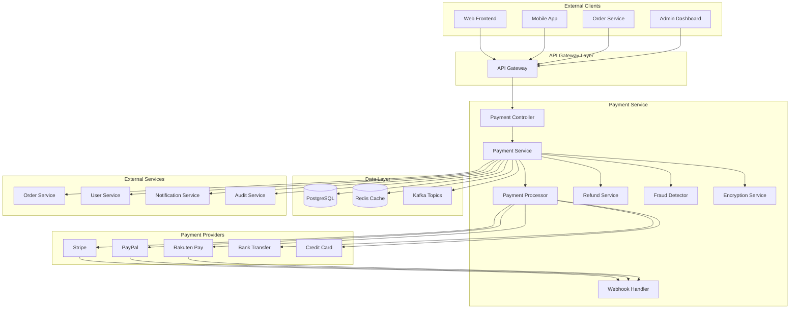

# Payment Service Detailed Design Document

## Table of Contents

1. [Overview](#overview)
2. [Technical Specifications](#technical-specifications)
3. [Architecture Design](#architecture-design)
4. [API Design](#api-design)
5. [Database Design](#database-design)
6. [Payment Processing Design](#payment-processing-design)
7. [Payment Provider Integration](#payment-provider-integration)
8. [Error Handling](#error-handling)
9. [Test Design](#test-design)
10. [Local Development Environment](#local-development)
11. [Production Deployment](#production-deployment)
12. [Monitoring and Operations](#monitoring-operations)
13. [Incident Response](#incident-response)

## Overview

### Service Summary

The Payment Service is a microservice responsible for the payment functionality of the ski equipment sales shop site. It provides features such as integration with multiple payment providers, payment processing, transaction management, and payment history management.

### Key Responsibilities

- **Payment Processing**: Handles payments via credit cards, electronic money, bank transfers, etc.
- **Payment Provider Integration**: Integrates with external payment services like Stripe, PayPal, Rakuten Pay, etc.
- **Transaction Management**: Manages and tracks payment transactions.
- **Payment Security**: Ensures secure payment processing compliant with PCI DSS.
- **Refund Processing**: Handles refunds for returns and cancellations.
- **Payment History Management**: Stores and provides search functionality for payment history.

### Business Value

- **Increased Sales**: Improves customer satisfaction by offering a variety of payment methods.
- **Security**: Provides a safe payment environment compliant with PCI DSS.
- **Operational Efficiency**: Automates payment processing and error handling.
- **Compliance**: Adheres to financial regulations.

## Technical Specifications

### Technology Stack

| Technology Area | Technology/Library | Version | Purpose |
|---|---|---|---|
| **Runtime** | OpenJDK | 21 LTS | Java execution environment |
| **Framework** | Jakarta EE | 11 | Enterprise framework |
| **Application Server** | WildFly | 31.0.1 | Jakarta EE application server |
| **Persistence** | Jakarta Persistence (JPA) | 3.2 | ORM |
| **Data Access** | Jakarta Data | 1.0 | Repository abstraction |
| **REST API** | Jakarta REST (JAX-RS) | 4.0 | RESTful Web Services |
| **CDI** | Jakarta CDI | 4.1 | Dependency injection and management |
| **Validation** | Jakarta Validation | 3.1 | Bean Validation |
| **JSON Processing** | Jakarta JSON-P | 2.1 | JSON processing |
| **Security** | Jakarta Security | 3.0 | Security features |
| **Database** | PostgreSQL | 16 | Primary database |
| **Cache** | Redis | 7.2 | Payment cache |
| **Message Queue** | Apache Kafka | 3.7 | Payment event processing |
| **Monitoring** | MicroProfile Metrics | 5.1 | Metrics collection |
| **Tracing** | MicroProfile OpenTelemetry | 2.0 | Distributed tracing |
| **Health Check** | MicroProfile Health | 4.0 | Health checks |
| **Configuration** | MicroProfile Config | 3.1 | Configuration management |
| **HTTP Client** | MicroProfile Rest Client | 4.0 | External API integration |
| **Encryption** | Bouncy Castle | 1.76 | Encryption processing |

### Excluded Technologies

- **Lombok**: Not used, to leverage Jakarta EE 11's Record classes and modern Java features.

### Java 21 LTS Features Utilized

- **Virtual Threads**: For high-concurrency payment processing.
- **Record Classes**: For payment data structures.
- **Pattern Matching**: For determining payment status.
- **Text Blocks**: For defining complex SQL.
- **Sealed Classes**: For type safety of payment events.

## Architecture Design

### System Architecture Diagram



### Domain Model Design

```java
// Payment Entity
@Entity
@Table(name = "payments")
public class Payment {
    
    @Id
    @GeneratedValue(strategy = GenerationType.UUID)
    private UUID id;
    
    @Column(name = "payment_id", unique = true, nullable = false)
    private String paymentId;
    
    @Column(name = "order_id", nullable = false)
    private UUID orderId;
    
    @Column(name = "customer_id", nullable = false)
    private UUID customerId;
    
    @Embedded
    private PaymentAmount amount;
    
    @Enumerated(EnumType.STRING)
    @Column(name = "payment_method", nullable = false)
    private PaymentMethod paymentMethod;
    
    @Enumerated(EnumType.STRING)
    @Column(name = "status", nullable = false)
    private PaymentStatus status;
    
    @Column(name = "provider", nullable = false)
    private String provider;
    
    @Column(name = "provider_transaction_id")
    private String providerTransactionId;
    
    @Column(name = "provider_reference")
    private String providerReference;
    
    @Embedded
    private PaymentDetails paymentDetails;
    
    @Column(name = "failure_reason")
    private String failureReason;
    
    @Column(name = "authorization_code")
    private String authorizationCode;
    
    @Column(name = "created_at", nullable = false)
    private LocalDateTime createdAt;
    
    @Column(name = "updated_at")
    private LocalDateTime updatedAt;
    
    @Column(name = "authorized_at")
    private LocalDateTime authorizedAt;
    
    @Column(name = "captured_at")
    private LocalDateTime capturedAt;
    
    @Column(name = "failed_at")
    private LocalDateTime failedAt;
    
    @Column(name = "expires_at")
    private LocalDateTime expiresAt;
    
    // Related Entities
    @OneToMany(mappedBy = "payment", cascade = CascadeType.ALL, fetch = FetchType.LAZY)
    private List<PaymentEvent> events = new ArrayList<>();
    
    @OneToMany(mappedBy = "payment", cascade = CascadeType.ALL, fetch = FetchType.LAZY)
    private List<Refund> refunds = new ArrayList<>();
    
    // Business Logic
    public boolean canBeAuthorized() {
        return status == PaymentStatus.PENDING;
    }
    
    public boolean canBeCaptured() {
        return status == PaymentStatus.AUTHORIZED;
    }
    
    public boolean canBeRefunded() {
        return status == PaymentStatus.CAPTURED;
    }
    
    public void authorize(String authCode, String providerTransactionId) {
        if (!canBeAuthorized()) {
            throw new InvalidPaymentStateException("Cannot authorize payment");
        }
        this.status = PaymentStatus.AUTHORIZED;
        this.authorizationCode = authCode;
        this.providerTransactionId = providerTransactionId;
        this.authorizedAt = LocalDateTime.now();
        this.updatedAt = LocalDateTime.now();
    }
    
    public void capture() {
        if (!canBeCaptured()) {
            throw new InvalidPaymentStateException("Cannot capture payment");
        }
        this.status = PaymentStatus.CAPTURED;
        this.capturedAt = LocalDateTime.now();
        this.updatedAt = LocalDateTime.now();
    }
    
    public void fail(String reason) {
        this.status = PaymentStatus.FAILED;
        this.failureReason = reason;
        this.failedAt = LocalDateTime.now();
        this.updatedAt = LocalDateTime.now();
    }
    
    public BigDecimal getRefundableAmount() {
        var totalRefunded = refunds.stream()
            .filter(r -> r.getStatus() == RefundStatus.COMPLETED)
            .map(Refund::getAmount)
            .reduce(BigDecimal.ZERO, BigDecimal::add);
            
        return amount.totalAmount().subtract(totalRefunded);
    }
}

// Refund Entity
@Entity
@Table(name = "refunds")
public class Refund {
    
    @Id
    @GeneratedValue(strategy = GenerationType.UUID)
    private UUID id;
    
    @Column(name = "refund_id", unique = true, nullable = false)
    private String refundId;
    
    @ManyToOne(fetch = FetchType.LAZY)
    @JoinColumn(name = "payment_id", nullable = false)
    private Payment payment;
    
    @Column(name = "amount", precision = 12, scale = 2, nullable = false)
    private BigDecimal amount;
    
    @Column(name = "currency", length = 3, nullable = false)
    private String currency;
    
    @Enumerated(EnumType.STRING)
    @Column(name = "status", nullable = false)
    private RefundStatus status;
    
    @Column(name = "reason", nullable = false)
    private String reason;
    
    @Column(name = "provider_refund_id")
    private String providerRefundId;
    
    @Column(name = "failure_reason")
    private String failureReason;
    
    @Column(name = "requested_by", nullable = false)
    private UUID requestedBy;
    
    @Column(name = "created_at", nullable = false)
    private LocalDateTime createdAt;
    
    @Column(name = "updated_at")
    private LocalDateTime updatedAt;
    
    @Column(name = "completed_at")
    private LocalDateTime completedAt;
    
    @Column(name = "failed_at")
    private LocalDateTime failedAt;
    
    public void complete(String providerRefundId) {
        this.status = RefundStatus.COMPLETED;
        this.providerRefundId = providerRefundId;
        this.completedAt = LocalDateTime.now();
        this.updatedAt = LocalDateTime.now();
    }
    
    public void fail(String reason) {
        this.status = RefundStatus.FAILED;
        this.failureReason = reason;
        this.failedAt = LocalDateTime.now();
        this.updatedAt = LocalDateTime.now();
    }
}

// Payment Event History
@Entity
@Table(name = "payment_events")
public class PaymentEvent {
    
    @Id
    @GeneratedValue(strategy = GenerationType.UUID)
    private UUID id;
    
    @ManyToOne(fetch = FetchType.LAZY)
    @JoinColumn(name = "payment_id", nullable = false)
    private Payment payment;
    
    @Enumerated(EnumType.STRING)
    @Column(name = "event_type", nullable = false)
    private PaymentEventType eventType;
    
    @Enumerated(EnumType.STRING)
    @Column(name = "from_status")
    private PaymentStatus fromStatus;
    
    @Enumerated(EnumType.STRING)
    @Column(name = "to_status", nullable = false)
    private PaymentStatus toStatus;
    
    @Column(name = "provider_response", columnDefinition = "TEXT")
    private String providerResponse;
    
    @Column(name = "metadata", columnDefinition = "JSONB")
    private String metadata;
    
    @Column(name = "created_at", nullable = false)
    private LocalDateTime createdAt;
}

// Embeddable Classes
@Embeddable
public record PaymentAmount(
    @Column(name = "amount", precision = 12, scale = 2)
    BigDecimal amount,
    
    @Column(name = "fee_amount", precision = 12, scale = 2)
    BigDecimal feeAmount,
    
    @Column(name = "tax_amount", precision = 12, scale = 2)
    BigDecimal taxAmount,
    
    @Column(name = "total_amount", precision = 12, scale = 2)
    BigDecimal totalAmount,
    
    @Column(name = "currency", length = 3)
    String currency
) {
    public static PaymentAmount create(BigDecimal amount, BigDecimal fee, BigDecimal tax) {
        var total = amount.add(fee).add(tax);
        return new PaymentAmount(amount, fee, tax, total, "JPY");
    }
}

@Embeddable
public record PaymentDetails(
    @Column(name = "card_last_four")
    String cardLastFour,
    
    @Column(name = "card_brand")
    String cardBrand,
    
    @Column(name = "card_expiry_month")
    Integer cardExpiryMonth,
    
    @Column(name = "card_expiry_year")
    Integer cardExpiryYear,
    
    @Column(name = "billing_address", columnDefinition = "JSONB")
    String billingAddress,
    
    @Column(name = "customer_email")
    String customerEmail,
    
    @Column(name = "customer_name")
    String customerName
) {}

// Sealed Classes for Events
public sealed interface PaymentDomainEvent
    permits PaymentCreatedEvent, PaymentAuthorizedEvent, PaymentCapturedEvent,
            PaymentFailedEvent, PaymentRefundedEvent {
}

public record PaymentCreatedEvent(
    UUID paymentId,
    String paymentNumber,
    UUID orderId,
    UUID customerId,
    BigDecimal amount,
    PaymentMethod paymentMethod,
    LocalDateTime timestamp
) implements PaymentDomainEvent {}

public record PaymentAuthorizedEvent(
    UUID paymentId,
    String paymentNumber,
    String authorizationCode,
    LocalDateTime authorizedAt
) implements PaymentDomainEvent {}

public record PaymentCapturedEvent(
    UUID paymentId,
    String paymentNumber,
    BigDecimal amount,
    LocalDateTime capturedAt
) implements PaymentDomainEvent {}

public record PaymentFailedEvent(
    UUID paymentId,
    String paymentNumber,
    String failureReason,
    LocalDateTime failedAt
) implements PaymentDomainEvent {}

// Enums
public enum PaymentMethod {
    CREDIT_CARD("Credit Card"),
    DEBIT_CARD("Debit Card"),
    BANK_TRANSFER("Bank Transfer"),
    CONVENIENCE_STORE("Convenience Store Payment"),
    PAYPAL("PayPal"),
    RAKUTEN_PAY("Rakuten Pay"),
    AMAZON_PAY("Amazon Pay"),
    APPLE_PAY("Apple Pay"),
    GOOGLE_PAY("Google Pay"),
    CRYPTO("Cryptocurrency");
    
    private final String description;
    
    PaymentMethod(String description) {
        this.description = description;
    }
    
    public String getDescription() {
        return description;
    }
    
    public boolean isInstant() {
        return this == CREDIT_CARD || this == DEBIT_CARD || 
               this == PAYPAL || this == APPLE_PAY || this == GOOGLE_PAY;
    }
    
    public boolean requiresManualVerification() {
        return this == BANK_TRANSFER || this == CONVENIENCE_STORE;
    }
}

public enum PaymentStatus {
    PENDING("Processing"),
    AUTHORIZED("Authorized"),
    CAPTURED("Captured"),
    FAILED("Failed"),
    CANCELLED("Cancelled"),
    REFUNDED("Refunded"),
    PARTIALLY_REFUNDED("Partially Refunded");
    
    private final String description;
    
    PaymentStatus(String description) {
        this.description = description;
    }
    
    public String getDescription() {
        return description;
    }
    
    public boolean isTerminal() {
        return this == CAPTURED || this == FAILED || this == CANCELLED || this == REFUNDED;
    }
    
    public boolean canTransitionTo(PaymentStatus targetStatus) {
        return switch (this) {
            case PENDING -> targetStatus == AUTHORIZED || targetStatus == FAILED || targetStatus == CANCELLED;
            case AUTHORIZED -> targetStatus == CAPTURED || targetStatus == FAILED || targetStatus == CANCELLED;
            case CAPTURED -> targetStatus == REFUNDED || targetStatus == PARTIALLY_REFUNDED;
            default -> false;
        };
    }
}

public enum RefundStatus {
    PENDING("Processing"),
    COMPLETED("Completed"),
    FAILED("Failed"),
    CANCELLED("Cancelled");
    
    private final String description;
    
    RefundStatus(String description) {
        this.description = description;
    }
    
    public String getDescription() {
        return description;
    }
}

public enum PaymentEventType {
    CREATED("Created"),
    AUTHORIZED("Authorized"),
    CAPTURED("Captured"),
    FAILED("Failed"),
    CANCELLED("Cancelled"),
    REFUND_REQUESTED("Refund Requested"),
    REFUNDED("Refund Completed"),
    WEBHOOK_RECEIVED("Webhook Received");
    
    private final String description;
    
    PaymentEventType(String description) {
        this.description = description;
    }
    
    public String getDescription() {
        return description;
    }
}
```

### Service Layer Design

```java
// Payment Service
// Payment Service (CQRS Pattern compliant)
@ApplicationScoped
@Transactional
public class PaymentService {
    
    private static final Logger logger = LoggerFactory.getLogger(PaymentService.class);
    
    @Inject
    private PaymentRepository paymentRepository;
    
    @Inject
    private RefundRepository refundRepository;
    
    @Inject
    private PaymentIdGenerator paymentIdGenerator;
    
    @Inject
    private PaymentProcessorFactory processorFactory;
    
    @Inject
    private PaymentEventPublisher eventPublisher;
    
    @Inject
    private FraudDetectionService fraudDetectionService;
    
    @Inject
    private EncryptionService encryptionService;
    
    @Inject
    private OrderServiceClient orderServiceClient;
    
    @Inject
    private PaymentProcessingSaga paymentProcessingSaga;
    
    // CQRS Command Handlers
    @CommandHandler
    public PaymentResult handle(CreatePaymentCommand command) {
        try {
            // Fraud detection
            var fraudResult = fraudDetectionService.analyze(command.toRequest());
            if (fraudResult.isRisk()) {
                return new PaymentResult(false, null, "Suspicious transaction detected");
            }
            
            // Generate payment ID
            var paymentId = paymentIdGenerator.generate();
            
            // Create payment entity
            var payment = buildPayment(command.toRequest(), paymentId);
            var savedPayment = paymentRepository.save(payment);
            
            // Publish event
            eventPublisher.publish(new PaymentCreatedEvent(
                savedPayment.getId(),
                savedPayment.getPaymentId(),
                savedPayment.getOrderId(),
                savedPayment.getCustomerId(),
                savedPayment.getAmount().totalAmount(),
                savedPayment.getPaymentMethod(),
                LocalDateTime.now()
            ));
            
            logger.info("Payment created: {}", savedPayment.getPaymentId());
            return new PaymentResult(true, savedPayment.getId(), "Payment creation complete");
            
        } catch (Exception e) {
            logger.error("Payment creation error: orderId=" + command.orderId(), e);
            eventPublisher.publish(new PaymentCreationFailedEvent(
                command.orderId(),
                command.customerId(),
                e.getMessage(),
                LocalDateTime.now()
            ));
            
            return new PaymentResult(false, null, e.getMessage());
        }
    }
    
    @CommandHandler
    public PaymentResult handle(ProcessPaymentCommand command) {
        try {
            var payment = findPaymentById(command.paymentId());
            
            if (!payment.canBeAuthorized()) {
                return new PaymentResult(false, command.paymentId(), "Payment cannot be processed");
            }
            
            // Get payment processor
            var processor = processorFactory.getProcessor(payment.getProvider());
            
            // Execute payment
            var result = processor.processPayment(payment);
            
            // Update state based on result
            if (result.isSuccess()) {
                payment.authorize(result.getTransactionId(), result.getAuthorizationCode());
                paymentRepository.save(payment);
                
                eventPublisher.publish(new PaymentAuthorizedEvent(
                    payment.getId(),
                    payment.getOrderId(),
                    result.getTransactionId(),
                    LocalDateTime.now()
                ));
                
                logger.info("Payment authorized: {}", payment.getPaymentId());
                return new PaymentResult(true, payment.getId(), "Payment authorization complete");
            } else {
                payment.fail(result.getErrorMessage());
                paymentRepository.save(payment);
                
                eventPublisher.publish(new PaymentFailedEvent(
                    payment.getId(),
                    payment.getOrderId(),
                    result.getErrorMessage(),
                    LocalDateTime.now()
                ));
                
                return new PaymentResult(false, payment.getId(), result.getErrorMessage());
            }
            
        } catch (Exception e) {
            logger.error("Payment processing error: paymentId=" + command.paymentId(), e);
            return new PaymentResult(false, command.paymentId(), e.getMessage());
        }
    }
    
    @CommandHandler
    public PaymentResult handle(CapturePaymentCommand command) {
        try {
            var payment = findPaymentById(command.paymentId());
            
            if (!payment.canBeCaptured()) {
                return new PaymentResult(false, command.paymentId(), "Payment cannot be captured");
            }
            
            var processor = processorFactory.getProcessor(payment.getProvider());
            var result = processor.capturePayment(payment, command.amount());
            
            if (result.isSuccess()) {
                payment.capture(command.amount(), result.getTransactionId());
                paymentRepository.save(payment);
                
                eventPublisher.publish(new PaymentCapturedEvent(
                    payment.getId(),
                    payment.getOrderId(),
                    command.amount(),
                    result.getTransactionId(),
                    LocalDateTime.now()
                ));
                
                logger.info("Payment captured: {}", payment.getPaymentId());
                return new PaymentResult(true, payment.getId(), "Payment capture complete");
            } else {
                return new PaymentResult(false, payment.getId(), result.getErrorMessage());
            }
            
        } catch (Exception e) {
            logger.error("Payment capture error: paymentId=" + command.paymentId(), e);
            return new PaymentResult(false, command.paymentId(), e.getMessage());
        }
    }
    
    @CommandHandler
    public RefundResult handle(CreateRefundCommand command) {
        try {
            var payment = findPaymentById(command.paymentId());
            
            if (!payment.canBeRefunded()) {
                return new RefundResult(false, null, "Payment cannot be refunded");
            }
            
            var processor = processorFactory.getProcessor(payment.getProvider());
            var result = processor.refundPayment(payment, command.amount());
            
            if (result.isSuccess()) {
                var refund = new Refund();
                refund.setPayment(payment);
                refund.setAmount(command.amount());
                refund.setReason(command.reason());
                refund.setStatus(RefundStatus.COMPLETED);
                refund.setTransactionId(result.getTransactionId());
                refund.setCreatedAt(LocalDateTime.now());
                
                var savedRefund = refundRepository.save(refund);
                
                eventPublisher.publish(new PaymentRefundedEvent(
                    payment.getId(),
                    savedRefund.getId(),
                    command.amount(),
                    command.reason(),
                    LocalDateTime.now()
                ));
                
                logger.info("Refund created: paymentId={}, refundId={}", 
                    payment.getPaymentId(), savedRefund.getId());
                return new RefundResult(true, savedRefund.getId(), "Refund complete");
            } else {
                return new RefundResult(false, null, result.getErrorMessage());
            }
            
        } catch (Exception e) {
            logger.error("Refund processing error: paymentId=" + command.paymentId(), e);
            return new RefundResult(false, null, e.getMessage());
        }
    }
    
    // CQRS Query Handlers
    @QueryHandler
    public PaymentProjection handle(GetPaymentByIdQuery query) {
        var payment = paymentRepository.findById(query.paymentId());
        return payment.map(PaymentProjection::from)
            .orElse(null);
    }
    
    @QueryHandler
    public PaymentProjection handle(GetPaymentByOrderIdQuery query) {
        var payment = paymentRepository.findByOrderId(query.orderId());
        return payment.map(PaymentProjection::from)
            .orElse(null);
    }
    
    @QueryHandler
    public List<PaymentProjection> handle(GetPaymentsByCustomerQuery query) {
        return paymentRepository.findByCustomerId(query.customerId(), query.page(), query.size())
            .stream()
            .map(PaymentProjection::from)
            .toList();
    }
    
    @QueryHandler
    public PaymentStatisticsProjection handle(GetPaymentStatisticsQuery query) {
        var totalAmount = paymentRepository.getTotalAmountByDateRange(query.fromDate(), query.toDate());
        var totalCount = paymentRepository.getCountByDateRange(query.fromDate(), query.toDate());
        var successfulPayments = paymentRepository.getSuccessfulPaymentsByDateRange(query.fromDate(), query.toDate());
        var failedPayments = paymentRepository.getFailedPaymentsByDateRange(query.fromDate(), query.toDate());
        
        return new PaymentStatisticsProjection(
            totalAmount,
            totalCount,
            successfulPayments,
            failedPayments,
            LocalDateTime.now()
        );
    }
    
    // Event Handlers
    @EventHandler
    public void handle(OrderCreatedEvent event) {
        logger.info("Starting order creation event processing: orderId={}", event.orderId());
        
        CompletableFuture.runAsync(() -> {
            try {
                paymentProcessingSaga.processOrderPayment(
                    event.orderId(),
                    event.customerId(),
                    event.totalAmount(),
                    event.paymentMethod()
                );
            } catch (Exception e) {
                logger.error("Payment processing Saga execution error: orderId=" + event.orderId(), e);
            }
        }, VirtualThread.ofVirtual().factory());
    }
    
    @EventHandler
    public void handle(InventoryReservedEvent event) {
        logger.info("Starting inventory reservation complete event processing: orderId={}", event.orderId());
        
        CompletableFuture.runAsync(() -> {
            try {
                paymentProcessingSaga.processPaymentAuthorization(event.orderId());
            } catch (Exception e) {
                logger.error("Payment authorization Saga execution error: orderId=" + event.orderId(), e);
            }
        }, VirtualThread.ofVirtual().factory());
    }
    
    @EventHandler
    public void handle(OrderCancelledEvent event) {
        logger.info("Starting order cancellation event processing: orderId={}", event.orderId());
        
        CompletableFuture.runAsync(() -> {
            try {
                paymentProcessingSaga.processPaymentCancellation(event.orderId(), event.reason());
            } catch (Exception e) {
                logger.error("Payment cancellation Saga execution error: orderId=" + event.orderId(), e);
            }
        }, VirtualThread.ofVirtual().factory());
    }
    
    public Payment createPayment(CreatePaymentRequest request) {
        // Fraud detection
        var fraudResult = fraudDetectionService.analyze(request);
        if (fraudResult.isRisk()) {
            throw new PaymentFraudException("Suspicious transaction detected");
        }
        
        // Generate payment ID
        var paymentId = paymentIdGenerator.generate();
        
        // Create payment entity
        var payment = buildPayment(request, paymentId);
        var savedPayment = paymentRepository.save(payment);
        
        // Publish event
        eventPublisher.publish(new PaymentCreatedEvent(
            savedPayment.getId(),
            savedPayment.getPaymentId(),
            savedPayment.getOrderId(),
            savedPayment.getCustomerId(),
            savedPayment.getAmount().totalAmount(),
            savedPayment.getPaymentMethod(),
            LocalDateTime.now()
        ));
        
        logger.info("Payment created: {}", savedPayment.getPaymentId());
        return savedPayment;
    }
    
    public Payment processPayment(UUID paymentId) {
        var payment = findPaymentById(paymentId);
        
        if (!payment.canBeAuthorized()) {
            throw new InvalidPaymentStateException("Payment cannot be processed");
        }
        
        try {
            // Get payment processor
            var processor = processorFactory.getProcessor(payment.getProvider());
            
            // Execute payment
            var result = processor.processPayment(payment);
            
            if (result.isSuccessful()) {
                payment.authorize(result.authorizationCode(), result.transactionId());
                
                // If auto-capture is configured
                if (shouldAutoCapture(payment)) {
                    return capturePayment(paymentId);
                }
                
                eventPublisher.publish(new PaymentAuthorizedEvent(
                    payment.getId(),
                    payment.getPaymentId(),
                    result.authorizationCode(),
                    payment.getAuthorizedAt()
                ));
                
            } else {
                payment.fail(result.errorMessage());
                
                eventPublisher.publish(new PaymentFailedEvent(
                    payment.getId(),
                    payment.getPaymentId(),
                    result.errorMessage(),
                    payment.getFailedAt()
                ));
            }
            
            return paymentRepository.save(payment);
            
        } catch (Exception e) {
            payment.fail(e.getMessage());
            paymentRepository.save(payment);
            
            logger.error("Payment processing failed: {}", payment.getPaymentId(), e);
            throw new PaymentProcessingException("Payment processing failed", e);
        }
    }
    
    public Payment capturePayment(UUID paymentId) {
        var payment = findPaymentById(paymentId);
        
        if (!payment.canBeCaptured()) {
            throw new InvalidPaymentStateException("Payment cannot be captured");
        }
        
        try {
            var processor = processorFactory.getProcessor(payment.getProvider());
            var result = processor.capturePayment(payment);
            
            if (result.isSuccessful()) {
                payment.capture();
                
                // Update order status
                orderServiceClient.updatePaymentStatus(payment.getOrderId(), "COMPLETED");
                
                eventPublisher.publish(new PaymentCapturedEvent(
                    payment.getId(),
                    payment.getPaymentId(),
                    payment.getAmount().totalAmount(),
                    payment.getCapturedAt()
                ));
                
            } else {
                payment.fail(result.errorMessage());
            }
            
            return paymentRepository.save(payment);
            
        } catch (Exception e) {
            logger.error("Payment capture failed: {}", payment.getPaymentId(), e);
            throw new PaymentProcessingException("Payment capture failed", e);
        }
    }
    
    public Refund createRefund(CreateRefundRequest request) {
        var payment = findPaymentById(request.paymentId());
        
        if (!payment.canBeRefunded()) {
            throw new InvalidPaymentStateException("Payment cannot be refunded");
        }
        
        var refundableAmount = payment.getRefundableAmount();
        if (request.amount().compareTo(refundableAmount) > 0) {
            throw new InvalidRefundAmountException("Refund amount exceeds refundable amount");
        }
        
        var refundId = paymentIdGenerator.generateRefundId();
        
        var refund = new Refund();
        refund.setRefundId(refundId);
        refund.setPayment(payment);
        refund.setAmount(request.amount());
        refund.setCurrency(payment.getAmount().currency());
        refund.setStatus(RefundStatus.PENDING);
        refund.setReason(request.reason());
        refund.setRequestedBy(request.requestedBy());
        refund.setCreatedAt(LocalDateTime.now());
        
        var savedRefund = refundRepository.save(refund);
        
        // Execute refund processing asynchronously
        processRefundAsync(savedRefund.getId());
        
        logger.info("Refund created: {} for payment: {}", refundId, payment.getPaymentId());
        return savedRefund;
    }
    
    @Asynchronous
    public void processRefundAsync(UUID refundId) {
        var refund = refundRepository.findById(refundId)
            .orElseThrow(() -> new RefundNotFoundException("Refund not found: " + refundId));
            
        try {
            var processor = processorFactory.getProcessor(refund.getPayment().getProvider());
            var result = processor.processRefund(refund);
            
            if (result.isSuccessful()) {
                refund.complete(result.providerRefundId());
                
                eventPublisher.publish(new PaymentRefundedEvent(
                    refund.getPayment().getId(),
                    refund.getPayment().getPaymentId(),
                    refund.getAmount(),
                    refund.getCompletedAt()
                ));
                
            } else {
                refund.fail(result.errorMessage());
            }
            
            refundRepository.save(refund);
            
        } catch (Exception e) {
            refund.fail(e.getMessage());
            refundRepository.save(refund);
            logger.error("Refund processing failed: {}", refund.getRefundId(), e);
        }
    }
    
    public Payment findPaymentById(UUID paymentId) {
        return paymentRepository.findById(paymentId)
            .orElseThrow(() -> new PaymentNotFoundException("Payment not found: " + paymentId));
    }
    
    public Payment findPaymentByOrderId(UUID orderId) {
        return paymentRepository.findByOrderId(orderId)
            .orElseThrow(() -> new PaymentNotFoundException("Payment not found for order: " + orderId));
    }
    
    public List<Payment> findPaymentsByCustomer(UUID customerId, int page, int size) {
        return paymentRepository.findByCustomerIdOrderByCreatedAtDesc(customerId, 
            PageRequest.of(page, size));
    }
    
    private Payment buildPayment(CreatePaymentRequest request, String paymentId) {
        var payment = new Payment();
        payment.setPaymentId(paymentId);
        payment.setOrderId(request.orderId());
        payment.setCustomerId(request.customerId());
        payment.setPaymentMethod(request.paymentMethod());
        payment.setProvider(determineProvider(request.paymentMethod()));
        payment.setStatus(PaymentStatus.PENDING);
        payment.setCreatedAt(LocalDateTime.now());
        
        // Set amount
        var amount = PaymentAmount.create(
            request.amount(),
            calculateFee(request.amount(), request.paymentMethod()),
            calculateTax(request.amount())
        );
        payment.setAmount(amount);
        
        // Set payment details (encrypt sensitive information)
        if (request.paymentDetails() != null) {
            var encryptedDetails = encryptPaymentDetails(request.paymentDetails());
            payment.setPaymentDetails(encryptedDetails);
        }
        
        // Set expiration time
        payment.setExpiresAt(calculateExpiryTime(request.paymentMethod()));
        
        return payment;
    }
    
    private boolean shouldAutoCapture(Payment payment) {
        // Determine auto-capture based on payment method
        return payment.getPaymentMethod().isInstant();
    }
    
    private String determineProvider(PaymentMethod method) {
        return switch (method) {
            case CREDIT_CARD, DEBIT_CARD -> "stripe";
            case PAYPAL -> "paypal";
            case RAKUTEN_PAY -> "rakuten";
            case BANK_TRANSFER -> "bank";
            default -> "default";
        };
    }
    
    private BigDecimal calculateFee(BigDecimal amount, PaymentMethod method) {
        // Calculate payment fee
        var feeRate = switch (method) {
            case CREDIT_CARD -> new BigDecimal("0.036"); // 3.6%
            case PAYPAL -> new BigDecimal("0.034"); // 3.4%
            case BANK_TRANSFER -> BigDecimal.ZERO;
            default -> new BigDecimal("0.03"); // 3%
        };
        
        return amount.multiply(feeRate).setScale(0, RoundingMode.UP);
    }
    
    private BigDecimal calculateTax(BigDecimal amount) {
        // Calculate consumption tax (10%)
        return amount.multiply(new BigDecimal("0.10"));
    }
    
    private LocalDateTime calculateExpiryTime(PaymentMethod method) {
        var now = LocalDateTime.now();
        return switch (method) {
            case CREDIT_CARD, DEBIT_CARD -> now.plusMinutes(30);
            case BANK_TRANSFER -> now.plusDays(7);
            case CONVENIENCE_STORE -> now.plusDays(3);
            default -> now.plusHours(24);
        };
    }
    
    private PaymentDetails encryptPaymentDetails(PaymentDetailsRequest details) {
        // Encrypt sensitive information
        var encryptedCardNumber = details.cardNumber() != null ? 
            encryptionService.encrypt(details.cardNumber()) : null;
        var cardLastFour = details.cardNumber() != null ? 
            details.cardNumber().substring(details.cardNumber().length() - 4) : null;
            
        return new PaymentDetails(
            cardLastFour,
            details.cardBrand(),
            details.cardExpiryMonth(),
            details.cardExpiryYear(),
            details.billingAddress() != null ? JsonUtils.toJson(details.billingAddress()) : null,
            details.customerEmail(),
            details.customerName()
        );
    }
}

// Payment Processor Factory
@ApplicationScoped
public class PaymentProcessorFactory {
    
    @Inject
    private StripePaymentProcessor stripeProcessor;
    
    @Inject
    private PayPalPaymentProcessor paypalProcessor;
    
    @Inject
    private RakutenPaymentProcessor rakutenProcessor;
    
    @Inject
    private BankTransferProcessor bankProcessor;
    
    public PaymentProcessor getProcessor(String provider) {
        return switch (provider.toLowerCase()) {
            case "stripe" -> stripeProcessor;
            case "paypal" -> paypalProcessor;
            case "rakuten" -> rakutenProcessor;
            case "bank" -> bankProcessor;
            default -> throw new UnsupportedPaymentProviderException("Unsupported provider: " + provider);
        };
    }
}

// Payment Processor Interface
public interface PaymentProcessor {
    
    PaymentResult processPayment(Payment payment);
    
    PaymentResult capturePayment(Payment payment);
    
    RefundResult processRefund(Refund refund);
    
    boolean verifyWebhook(String payload, String signature);
    
    PaymentStatus getPaymentStatus(String providerTransactionId);
}

// Stripe Payment Processor Implementation
@ApplicationScoped
public class StripePaymentProcessor implements PaymentProcessor {
    
    private static final Logger logger = LoggerFactory.getLogger(StripePaymentProcessor.class);
    
    @Inject
    @ConfigProperty(name = "stripe.api.key")
    private String apiKey;
    
    @Inject
    @ConfigProperty(name = "stripe.webhook.secret")
    private String webhookSecret;
    
    @Inject
    @RestClient
    private StripeClient stripeClient;
    
    @Override
    public PaymentResult processPayment(Payment payment) {
        try {
            var request = buildStripePaymentRequest(payment);
            var response = stripeClient.createPaymentIntent(request);
            
            if (response.status().equals("succeeded")) {
                return PaymentResult.success(
                    response.id(),
                    response.id(),
                    response.metadata().toString()
                );
            } else {
                return PaymentResult.failure(response.lastPaymentError().message());
            }
            
        } catch (Exception e) {
            logger.error("Stripe payment processing failed", e);
            return PaymentResult.failure(e.getMessage());
        }
    }
    
    @Override
    public PaymentResult capturePayment(Payment payment) {
        try {
            var response = stripeClient.capturePaymentIntent(payment.getProviderTransactionId());
            
            if (response.status().equals("succeeded")) {
                return PaymentResult.success(
                    response.id(),
                    response.id(),
                    response.metadata().toString()
                );
            } else {
                return PaymentResult.failure("Capture failed");
            }
            
        } catch (Exception e) {
            logger.error("Stripe payment capture failed", e);
            return PaymentResult.failure(e.getMessage());
        }
    }
    
    @Override
    public RefundResult processRefund(Refund refund) {
        try {
            var request = new StripeRefundRequest(
                refund.getPayment().getProviderTransactionId(),
                refund.getAmount().multiply(BigDecimal.valueOf(100)).longValue(), // cents
                refund.getReason()
            );
            
            var response = stripeClient.createRefund(request);
            
            if (response.status().equals("succeeded")) {
                return RefundResult.success(response.id());
            } else {
                return RefundResult.failure("Refund failed");
            }
            
        } catch (Exception e) {
            logger.error("Stripe refund processing failed", e);
            return RefundResult.failure(e.getMessage());
        }
    }
    
    @Override
    public boolean verifyWebhook(String payload, String signature) {
        try {
            return StripeWebhookVerifier.verify(payload, signature, webhookSecret);
        } catch (Exception e) {
            logger.error("Stripe webhook verification failed", e);
            return false;
        }
    }
    
    @Override
    public PaymentStatus getPaymentStatus(String providerTransactionId) {
        try {
            var response = stripeClient.getPaymentIntent(providerTransactionId);
            return mapStripeStatus(response.status());
        } catch (Exception e) {
            logger.error("Failed to get Stripe payment status", e);
            return PaymentStatus.FAILED;
        }
    }
    
    private StripePaymentRequest buildStripePaymentRequest(Payment payment) {
        return new StripePaymentRequest(
            payment.getAmount().totalAmount().multiply(BigDecimal.valueOf(100)).longValue(),
            payment.getAmount().currency().toLowerCase(),
            payment.getPaymentDetails().customerEmail(),
            Map.of(
                "order_id", payment.getOrderId().toString(),
                "customer_id", payment.getCustomerId().toString()
            )
        );
    }
    
    private PaymentStatus mapStripeStatus(String stripeStatus) {
        return switch (stripeStatus) {
            case "requires_payment_method", "requires_confirmation" -> PaymentStatus.PENDING;
            case "requires_capture" -> PaymentStatus.AUTHORIZED;
            case "succeeded" -> PaymentStatus.CAPTURED;
            case "canceled" -> PaymentStatus.CANCELLED;
            default -> PaymentStatus.FAILED;
        };
    }
}
```

### Record-based DTOs

```java
// Request DTOs
public record CreatePaymentRequest(
    UUID orderId,
    UUID customerId,
    BigDecimal amount,
    PaymentMethod paymentMethod,
    PaymentDetailsRequest paymentDetails,
    String description,
    Map<String, String> metadata
) {}

public record PaymentDetailsRequest(
    String cardNumber,
    String cardBrand,
    Integer cardExpiryMonth,
    Integer cardExpiryYear,
    String cardCvv,
    BillingAddressRequest billingAddress,
    String customerEmail,
    String customerName
) {}

public record BillingAddressRequest(
    String firstName,
    String lastName,
    String postalCode,
    String prefecture,
    String city,
    String addressLine1,
    String addressLine2,
    String phoneNumber
) {}

public record CreateRefundRequest(
    UUID paymentId,
    BigDecimal amount,
    String reason,
    UUID requestedBy,
    Map<String, String> metadata
) {}

public record CapturePaymentRequest(
    UUID paymentId,
    BigDecimal amount
) {}

// Response DTOs
public record PaymentResponse(
    UUID paymentId,
    String paymentNumber,
    UUID orderId,
    UUID customerId,
    PaymentAmount amount,
    PaymentMethod paymentMethod,
    PaymentStatus status,
    String provider,
    PaymentDetails paymentDetails,
    LocalDateTime createdAt,
    LocalDateTime authorizedAt,
    LocalDateTime capturedAt,
    LocalDateTime expiresAt
) {
    public static PaymentResponse from(Payment payment) {
        return new PaymentResponse(
            payment.getId(),
            payment.getPaymentId(),
            payment.getOrderId(),
            payment.getCustomerId(),
            payment.getAmount(),
            payment.getPaymentMethod(),
            payment.getStatus(),
            payment.getProvider(),
            payment.getPaymentDetails(),
            payment.getCreatedAt(),
            payment.getAuthorizedAt(),
            payment.getCapturedAt(),
            payment.getExpiresAt()
        );
    }
}

public record RefundResponse(
    UUID refundId,
    String refundNumber,
    UUID paymentId,
    BigDecimal amount,
    String currency,
    RefundStatus status,
    String reason,
    LocalDateTime createdAt,
    LocalDateTime completedAt
) {
    public static RefundResponse from(Refund refund) {
        return new RefundResponse(
            refund.getId(),
            refund.getRefundId(),
            refund.getPayment().getId(),
            refund.getAmount(),
            refund.getCurrency(),
            refund.getStatus(),
            refund.getReason(),
            refund.getCreatedAt(),
            refund.getCompletedAt()
        );
    }
}

public record PaymentStatistics(
    long totalPayments,
    BigDecimal totalAmount,
    long successfulPayments,
    long failedPayments,
    BigDecimal averageAmount,
    Map<PaymentMethod, Long> paymentMethodDistribution,
    Map<PaymentStatus, Long> statusDistribution
) {}

// Result Classes
public record PaymentResult(
    boolean successful,
    String transactionId,
    String authorizationCode,
    String errorMessage,
    String metadata
) {
    public static PaymentResult success(String transactionId, String authCode, String metadata) {
        return new PaymentResult(true, transactionId, authCode, null, metadata);
    }
    
    public static PaymentResult failure(String errorMessage) {
        return new PaymentResult(false, null, null, errorMessage, null);
    }
    
    public boolean isSuccessful() {
        return successful;
    }
}

public record RefundResult(
    boolean successful,
    String providerRefundId,
    String errorMessage
) {
    public static RefundResult success(String providerRefundId) {
        return new RefundResult(true, providerRefundId, null);
    }
    
    public static RefundResult failure(String errorMessage) {
        return new RefundResult(false, null, errorMessage);
    }
    
    public boolean isSuccessful() {
        return successful;
    }
}

// External API DTOs (Stripe)
public record StripePaymentRequest(
    long amount,
    String currency,
    String receiptEmail,
    Map<String, String> metadata
) {}

public record StripePaymentResponse(
    String id,
    String status,
    long amount,
    String currency,
    StripeError lastPaymentError,
    Map<String, Object> metadata
) {}

public record StripeError(
    String code,
    String message,
    String type
) {}

public record StripeRefundRequest(
    String paymentIntentId,
    long amount,
    String reason
) {}

public record StripeRefundResponse(
    String id,
    String status,
    long amount,
    String currency
) {}

// Exception Classes
public class PaymentNotFoundException extends RuntimeException {
    public PaymentNotFoundException(String message) {
        super(message);
    }
}

public class InvalidPaymentStateException extends RuntimeException {
    public InvalidPaymentStateException(String message) {
        super(message);
    }
}

public class PaymentProcessingException extends RuntimeException {
    public PaymentProcessingException(String message, Throwable cause) {
        super(message, cause);
    }
}

public class PaymentFraudException extends RuntimeException {
    public PaymentFraudException(String message) {
        super(message);
    }
}

public class UnsupportedPaymentProviderException extends RuntimeException {
    public UnsupportedPaymentProviderException(String message) {
        super(message);
    }
}

public class InvalidRefundAmountException extends RuntimeException {
    public InvalidRefundAmountException(String message) {
        super(message);
    }
}

public class RefundNotFoundException extends RuntimeException {
    public RefundNotFoundException(String message) {
        super(message);
    }
}
```

## API Design

### REST API Endpoints

```java
@Path("/api/v1/payments")
@ApplicationScoped
@Produces(MediaType.APPLICATION_JSON)
@Consumes(MediaType.APPLICATION_JSON)
public class PaymentController {
    
    private static final Logger logger = LoggerFactory.getLogger(PaymentController.class);
    
    @Inject
    private PaymentService paymentService;
    
    @Inject
    private PaymentMapper paymentMapper;
    
    @POST
    @Path("")
    @Operation(summary = "Create Payment", description = "Creates a new payment.")
    @APIResponse(responseCode = "201", description = "Payment created successfully")
    @APIResponse(responseCode = "400", description = "Invalid request")
    @APIResponse(responseCode = "409", description = "Payment already exists")
    public Response createPayment(
            @Valid @RequestBody CreatePaymentRequest request) {
        
        try {
            var payment = paymentService.createPayment(request);
            var response = PaymentResponse.from(payment);
            
            return Response.status(Response.Status.CREATED)
                .entity(response)
                .build();
                
        } catch (PaymentFraudException e) {
            logger.warn("Fraud detected for payment creation: {}", e.getMessage());
            return Response.status(Response.Status.FORBIDDEN)
                .entity(Map.of("error", "Transaction declined"))
                .build();
                
        } catch (Exception e) {
            logger.error("Failed to create payment", e);
            return Response.status(Response.Status.INTERNAL_SERVER_ERROR)
                .entity(Map.of("error", "Internal server error"))
                .build();
        }
    }
    
    @POST
    @Path("/{paymentId}/process")
    @Operation(summary = "Process Payment", description = "Executes a payment.")
    @APIResponse(responseCode = "200", description = "Payment processed successfully")
    @APIResponse(responseCode = "404", description = "Payment not found")
    @APIResponse(responseCode = "422", description = "Payment cannot be processed")
    public Response processPayment(
            @PathParam("paymentId") UUID paymentId) {
        
        try {
            var payment = paymentService.processPayment(paymentId);
            var response = PaymentResponse.from(payment);
            
            return Response.ok(response).build();
            
        } catch (PaymentNotFoundException e) {
            return Response.status(Response.Status.NOT_FOUND)
                .entity(Map.of("error", e.getMessage()))
                .build();
                
        } catch (InvalidPaymentStateException e) {
            return Response.status(422)
                .entity(Map.of("error", e.getMessage()))
                .build();
                
        } catch (PaymentProcessingException e) {
            logger.error("Payment processing failed", e);
            return Response.status(Response.Status.INTERNAL_SERVER_ERROR)
                .entity(Map.of("error", "Payment processing failed"))
                .build();
        }
    }
    
    @POST
    @Path("/{paymentId}/capture")
    @Operation(summary = "Capture Payment", description = "Captures an authorized payment.")
    @APIResponse(responseCode = "200", description = "Payment captured successfully")
    @APIResponse(responseCode = "404", description = "Payment not found")
    @APIResponse(responseCode = "422", description = "Payment cannot be captured")
    public Response capturePayment(
            @PathParam("paymentId") UUID paymentId,
            @Valid @RequestBody(required = false) CapturePaymentRequest request) {
        
        try {
            var payment = paymentService.capturePayment(paymentId);
            var response = PaymentResponse.from(payment);
            
            return Response.ok(response).build();
            
        } catch (PaymentNotFoundException e) {
            return Response.status(Response.Status.NOT_FOUND)
                .entity(Map.of("error", e.getMessage()))
                .build();
                
        } catch (InvalidPaymentStateException e) {
            return Response.status(422)
                .entity(Map.of("error", e.getMessage()))
                .build();
        }
    }
    
    @POST
    @Path("/{paymentId}/refunds")
    @Operation(summary = "Create Refund", description = "Creates a refund for a payment.")
    @APIResponse(responseCode = "201", description = "Refund created successfully")
    @APIResponse(responseCode = "404", description = "Payment not found")
    @APIResponse(responseCode = "422", description = "Cannot be refunded")
    public Response createRefund(
            @PathParam("paymentId") UUID paymentId,
            @Valid @RequestBody CreateRefundRequest request) {
        
        try {
            var refund = paymentService.createRefund(request);
            var response = RefundResponse.from(refund);
            
            return Response.status(Response.Status.CREATED)
                .entity(response)
                .build();
                
        } catch (PaymentNotFoundException e) {
            return Response.status(Response.Status.NOT_FOUND)
                .entity(Map.of("error", e.getMessage()))
                .build();
                
        } catch (InvalidPaymentStateException | InvalidRefundAmountException e) {
            return Response.status(422)
                .entity(Map.of("error", e.getMessage()))
                .build();
        }
    }
    
    @GET
    @Path("/{paymentId}")
    @Operation(summary = "Get Payment", description = "Retrieves payment information.")
    @APIResponse(responseCode = "200", description = "Payment retrieved successfully")
    @APIResponse(responseCode = "404", description = "Payment not found")
    public Response getPayment(@PathParam("paymentId") UUID paymentId) {
        try {
            var payment = paymentService.findPaymentById(paymentId);
            var response = PaymentResponse.from(payment);
            
            return Response.ok(response).build();
            
        } catch (PaymentNotFoundException e) {
            return Response.status(Response.Status.NOT_FOUND)
                .entity(Map.of("error", e.getMessage()))
                .build();
        }
    }
    
    @GET
    @Path("/orders/{orderId}")
    @Operation(summary = "Get Order Payment", description = "Retrieves payment information by order ID.")
    @APIResponse(responseCode = "200", description = "Payment retrieved successfully")
    @APIResponse(responseCode = "404", description = "Payment not found")
    public Response getPaymentByOrderId(@PathParam("orderId") UUID orderId) {
        try {
            var payment = paymentService.findPaymentByOrderId(orderId);
            var response = PaymentResponse.from(payment);
            
            return Response.ok(response).build();
            
        } catch (PaymentNotFoundException e) {
            return Response.status(Response.Status.NOT_FOUND)
                .entity(Map.of("error", e.getMessage()))
                .build();
        }
    }
    
    @GET
    @Path("/customers/{customerId}")
    @Operation(summary = "Customer Payment History", description = "Retrieves a customer's payment history.")
    @APIResponse(responseCode = "200", description = "Payment history retrieved successfully")
    public Response getCustomerPayments(
            @PathParam("customerId") UUID customerId,
            @QueryParam("page") @DefaultValue("0") int page,
            @QueryParam("size") @DefaultValue("20") int size) {
        
        var payments = paymentService.findPaymentsByCustomer(customerId, page, size);
        var responses = payments.stream()
            .map(PaymentResponse::from)
            .toList();
            
        return Response.ok(responses).build();
    }
    
    @GET
    @Path("/statistics")
    @Operation(summary = "Payment Statistics", description = "Retrieves payment statistics.")
    @APIResponse(responseCode = "200", description = "Statistics retrieved successfully")
    @RolesAllowed({"ADMIN", "MANAGER"})
    public Response getPaymentStatistics(
            @QueryParam("from") @DateTimeFormat String fromDate,
            @QueryParam("to") @DateTimeFormat String toDate) {
        
        var from = fromDate != null ? LocalDate.parse(fromDate) : LocalDate.now().minusDays(30);
        var to = toDate != null ? LocalDate.parse(toDate) : LocalDate.now();
        
        var statistics = paymentService.getPaymentStatistics(from, to);
        return Response.ok(statistics).build();
    }
    
    @POST
    @Path("/webhooks/{provider}")
    @Operation(summary = "Process Webhook", description = "Processes webhooks from payment providers.")
    @APIResponse(responseCode = "200", description = "Webhook processed successfully")
    @APIResponse(responseCode = "400", description = "Webhook verification failed")
    @Consumes(MediaType.TEXT_PLAIN)
    public Response handleWebhook(
            @PathParam("provider") String provider,
            @HeaderParam("Stripe-Signature") String signature,
            String payload) {
        
        try {
            var processor = paymentService.getPaymentProcessor(provider);
            
            if (!processor.verifyWebhook(payload, signature)) {
                return Response.status(Response.Status.BAD_REQUEST)
                    .entity(Map.of("error", "Invalid webhook signature"))
                    .build();
            }
            
            paymentService.processWebhook(provider, payload);
            return Response.ok(Map.of("status", "success")).build();
            
        } catch (Exception e) {
            logger.error("Webhook processing failed for provider: {}", provider, e);
            return Response.status(Response.Status.INTERNAL_SERVER_ERROR)
                .entity(Map.of("error", "Webhook processing failed"))
                .build();
        }
    }
}

// Payment Processing Saga Pattern
@ApplicationScoped
@Transactional
public class PaymentProcessingSaga {
    
    private static final Logger logger = LoggerFactory.getLogger(PaymentProcessingSaga.class);
    
    @Inject
    private PaymentRepository paymentRepository;
    
    @Inject
    private SagaStateRepository sagaStateRepository;
    
    @Inject
    private PaymentEventPublisher eventPublisher;
    
    @Inject
    private PaymentProcessorFactory processorFactory;
    
    public CompletableFuture<SagaResult> processOrderPayment(
            UUID orderId, UUID customerId, BigDecimal amount, String paymentMethod) {
        
        return CompletableFuture.supplyAsync(() -> {
            var sagaId = UUID.randomUUID();
            var sagaState = new SagaState(sagaId, orderId, SagaType.PAYMENT_PROCESSING);
            sagaStateRepository.save(sagaState);
            
            try {
                logger.info("Starting payment processing Saga: sagaId={}, orderId={}", sagaId, orderId);
                
                // Step 1: Create Payment
                sagaState.setCurrentStep("CREATING_PAYMENT");
                var paymentResult = createPaymentRecord(orderId, customerId, amount, paymentMethod);
                if (!paymentResult.success()) {
                    return handleSagaFailure(sagaState, "Payment creation failed", paymentResult.message());
                }
                sagaState.setLastCompletedStep("CREATING_PAYMENT");
                
                // Step 2: Pre-payment Validation
                sagaState.setCurrentStep("VALIDATING_PAYMENT");
                var validationResult = validatePaymentDetails(paymentResult.paymentId());
                if (!validationResult.success()) {
                    return handleSagaFailure(sagaState, "Payment validation failed", validationResult.message());
                }
                sagaState.setLastCompletedStep("VALIDATING_PAYMENT");
                
                // Step 3: Payment Ready Event
                sagaState.setCurrentStep("PUBLISHING_EVENTS");
                publishPaymentReadyEvent(orderId, paymentResult.paymentId());
                sagaState.setLastCompletedStep("PUBLISHING_EVENTS");
                
                // Saga complete
                sagaState.complete();
                sagaStateRepository.save(sagaState);
                
                logger.info("Payment processing Saga complete: sagaId={}, orderId={}", sagaId, orderId);
                return new SagaResult(true, "Payment ready");
                
            } catch (Exception e) {
                logger.error("Payment processing Saga execution error: sagaId=" + sagaId, e);
                return handleSagaFailure(sagaState, "Unexpected error", e.getMessage());
            }
        }, VirtualThread.ofVirtual().factory());
    }
    
    public CompletableFuture<SagaResult> processPaymentAuthorization(UUID orderId) {
        return CompletableFuture.supplyAsync(() -> {
            var sagaId = UUID.randomUUID();
            var sagaState = new SagaState(sagaId, orderId, SagaType.PAYMENT_AUTHORIZATION);
            sagaStateRepository.save(sagaState);
            
            try {
                logger.info("Starting payment authorization Saga: sagaId={}, orderId={}", sagaId, orderId);
                
                // Step 1: Find Payment
                sagaState.setCurrentStep("FINDING_PAYMENT");
                var payment = paymentRepository.findByOrderId(orderId);
                if (payment.isEmpty()) {
                    return handleSagaFailure(sagaState, "Payment not found", "Payment not found");
                }
                sagaState.setLastCompletedStep("FINDING_PAYMENT");
                
                // Step 2: Execute Payment Authorization
                sagaState.setCurrentStep("AUTHORIZING_PAYMENT");
                var authResult = authorizePayment(payment.get());
                if (!authResult.success()) {
                    return handleSagaFailure(sagaState, "Payment authorization failed", authResult.message());
                }
                sagaState.setLastCompletedStep("AUTHORIZING_PAYMENT");
                
                // Step 3: Authorization Complete Event
                sagaState.setCurrentStep("PUBLISHING_EVENTS");
                publishPaymentAuthorizedEvent(orderId, payment.get().getId());
                sagaState.setLastCompletedStep("PUBLISHING_EVENTS");
                
                // Saga complete
                sagaState.complete();
                sagaStateRepository.save(sagaState);
                
                logger.info("Payment authorization Saga complete: sagaId={}, orderId={}", sagaId, orderId);
                return new SagaResult(true, "Payment authorization complete");
                
            } catch (Exception e) {
                logger.error("Payment authorization Saga execution error: sagaId=" + sagaId, e);
                return handleSagaFailure(sagaState, "Unexpected error", e.getMessage());
            }
        }, VirtualThread.ofVirtual().factory());
    }
    
    public CompletableFuture<SagaResult> processPaymentCancellation(UUID orderId, String reason) {
        return CompletableFuture.supplyAsync(() -> {
            var sagaId = UUID.randomUUID();
            var sagaState = new SagaState(sagaId, orderId, SagaType.PAYMENT_CANCELLATION);
            sagaStateRepository.save(sagaState);
            
            try {
                logger.info("Starting payment cancellation Saga: sagaId={}, orderId={}", sagaId, orderId);
                
                // Step 1: Find Payment
                sagaState.setCurrentStep("FINDING_PAYMENT");
                var payment = paymentRepository.findByOrderId(orderId);
                if (payment.isEmpty()) {
                    logger.warn("Payment not found: orderId={}", orderId);
                    sagaState.complete();
                    sagaStateRepository.save(sagaState);
                    return new SagaResult(true, "No payment - processing complete");
                }
                sagaState.setLastCompletedStep("FINDING_PAYMENT");
                
                // Step 2: Cancel/Refund Payment
                sagaState.setCurrentStep("CANCELLING_PAYMENT");
                var cancelResult = cancelOrRefundPayment(payment.get(), reason);
                if (!cancelResult.success()) {
                    return handleSagaFailure(sagaState, "Payment cancellation failed", cancelResult.message());
                }
                sagaState.setLastCompletedStep("CANCELLING_PAYMENT");
                
                // Step 3: Cancellation Complete Event
                sagaState.setCurrentStep("PUBLISHING_EVENTS");
                publishPaymentCancelledEvent(orderId, payment.get().getId(), reason);
                sagaState.setLastCompletedStep("PUBLISHING_EVENTS");
                
                // Saga complete
                sagaState.complete();
                sagaStateRepository.save(sagaState);
                
                logger.info("Payment cancellation Saga complete: sagaId={}, orderId={}", sagaId, orderId);
                return new SagaResult(true, "Payment cancellation complete");
                
            } catch (Exception e) {
                logger.error("Payment cancellation Saga execution error: sagaId=" + sagaId, e);
                return handleSagaFailure(sagaState, "Unexpected error", e.getMessage());
            }
        }, VirtualThread.ofVirtual().factory());
    }
    
    // Private helper methods
    private PaymentStepResult createPaymentRecord(UUID orderId, UUID customerId, 
            BigDecimal amount, String paymentMethod) {
        try {
            var payment = new Payment();
            payment.setOrderId(orderId);
            payment.setCustomerId(customerId);
            payment.setAmount(new PaymentAmount(amount, amount, BigDecimal.ZERO));
            payment.setPaymentMethod(paymentMethod);
            payment.setStatus(PaymentStatus.PENDING);
            payment.setCreatedAt(LocalDateTime.now());
            
            var savedPayment = paymentRepository.save(payment);
            return new PaymentStepResult(true, savedPayment.getId(), "Payment record created successfully");
            
        } catch (Exception e) {
            return new PaymentStepResult(false, null, "Payment record creation error: " + e.getMessage());
        }
    }
    
    private PaymentStepResult validatePaymentDetails(UUID paymentId) {
        try {
            var payment = paymentRepository.findById(paymentId)
                .orElseThrow(() -> new PaymentNotFoundException("Payment not found"));
            
            if (payment.getAmount().totalAmount().compareTo(BigDecimal.ZERO) <= 0) {
                return new PaymentStepResult(false, paymentId, "Invalid payment amount");
            }
            
            return new PaymentStepResult(true, paymentId, "Payment validation complete");
            
        } catch (Exception e) {
            return new PaymentStepResult(false, paymentId, "Payment validation error: " + e.getMessage());
        }
    }
