# Shopping Cart Service Detailed Design Document

Quarkus + Jakarta EE 11 + Java 21 + MicroProfile Implementation

## Table of Contents

1. [Overview](#overview)
2. [Technical Specifications](#technical-specifications)
3. [Architecture Design](#architecture-design)
4. [Quarkus Configuration](#quarkus-config-settings)
5. [API Design](#api-design)
6. [Database Design](#database-design)
7. [Cart Management Design](#cart-management-design)
8. [Session Management Design](#session-management-design)
9. [Docker Configuration](#docker-config)
10. [Error Handling](#error-handling)
11. [Test Design](#test-design)
12. [Monitoring and Operations](#monitoring-operations)
13. [Deployment](#deployment)

## Overview

### Service Summary

The Shopping Cart Service is a microservice responsible for the shopping cart functionality of the ski equipment sales shop site. It utilizes Quarkus, Jakarta EE 11, and MicroProfile to provide a high-performance and scalable cart feature.

This shopping cart service is a core component of an e-commerce platform composed of 12 microservices. It provides a seamless purchasing experience through close integration with the following services in particular:

- **12-frontend-service**: The main user interface layer
- **03-product-catalog-service**: Provides product information, pricing, and specifications
- **05-inventory-management-service**: Real-time inventory management, reservation, and monitoring
- **02-user-management-service**: User authentication, profile, and session management
- **06-order-management-service**: Order processing and workflow management
- **07-payment-service**: Payment processing and transaction management
- **09-coupon-discount-service**: Applies coupons, discounts, and promotions
- **10-points-loyalty-service**: Integrates points and loyalty programs

### Architectural Features

This service adopts the best practices of modern microservice architecture and is implemented based on the following design principles:

- **Event-Driven Architecture**: Asynchronous event communication using Kafka
- **CQRS (Command Query Responsibility Segregation)**: Optimization of read and write operations
- **Saga Pattern**: Distributed transaction management and data consistency assurance
- **Circuit Breaker**: Fault tolerance for external service failures
- **Distributed Cache**: High-speed data access using Redis
- **Distributed Tracing**: Request tracking and debugging across all services

## Key Responsibilities

### Core Functions

- **Cart Management**: Adding, removing, and changing the quantity of items in the cart
- **Session Management**: Integrated management of guest and user carts
- **Price Calculation**: Comprehensive calculation of product prices, taxes, shipping costs, and discounts
- **Inventory Integration**: Real-time inventory checking, reservation, and monitoring
- **Checkout**: Secure purchase processing through distributed transactions

### Microservice Integration Functions

- **Product Information Integration**: Retrieves and validates product data from 03-product-catalog-service
- **Inventory Management Integration**: Manages inventory reservation, release, and monitoring with 05-inventory-management-service
- **User Management Integration**: Manages authentication, authorization, and profiles with 02-user-management-service
- **Order Processing Integration**: Transfers checkout data to 06-order-management-service
- **Payment Integration**: Manages payment processing and status synchronization with 07-payment-service
- **Coupon Integration**: Validates and applies coupons with 09-coupon-discount-service
- **Points Integration**: Calculates, awards, and uses points with 10-points-loyalty-service
- **Frontend Integration**: Real-time status notifications and WebSocket communication with 12-frontend-service

### Business Value

- **Improved Purchasing Experience**: Increases customer satisfaction with smooth cart operations
- **Increased Conversion**: Reduces cart abandonment rates (through persistence + reminders)
- **Increased Sales**: Increases average purchase value through related product suggestions
- **Data Utilization**: Enhances customer understanding and personalization through cart behavior analysis

## Technical Specifications

### Quarkus Technology Stack

| Technology Area | Technology/Library | Version | Purpose |
|---|---|---|---|
| **Framework** | Quarkus | 3.16.5 | Jakarta EE 11 + MicroProfile implementation |
| **Runtime** | OpenJDK | 21 LTS | Java execution environment (Virtual Threads supported) |
| **Jakarta EE** | Jakarta EE Platform | 11.0 | Enterprise framework |
| **Persistence** | Quarkus Hibernate ORM | 3.16.5 | Jakarta Persistence (JPA) 3.2 |
| **REST API** | Quarkus REST (RESTEasy) | 3.16.5 | Jakarta REST (JAX-RS) 4.0 |
| **CDI** | Quarkus CDI | 3.16.5 | Jakarta CDI 4.1 |
| **Validation** | Quarkus Validation | 3.16.5 | Jakarta Validation 3.1 |
| **JSON** | Quarkus Jackson | 3.16.5 | JSON processing |
| **Database** | PostgreSQL | 16.x | Primary database |
| **Cache** | Quarkus Redis | 3.16.5 | Session and cart cache |
| **Messaging** | Quarkus Kafka | 3.16.5 | Event-driven architecture |
| **WebSocket** | Quarkus WebSocket | 3.16.5 | Real-time communication |

### MicroProfile Implementation

| Component | Quarkus Extension | Version | Purpose |
|---|---|---|---|
| **Metrics** | Quarkus Micrometer | 3.16.5 | Metrics collection and monitoring |
| **Tracing** | Quarkus OpenTelemetry | 3.16.5 | Distributed tracing |
| **Health** | Quarkus Health | 3.16.5 | Health checks |
| **Config** | Quarkus Config | 3.16.5 | Configuration management |
| **Rest Client** | Quarkus REST Client | 3.16.5 | External API integration |
| **Fault Tolerance** | Quarkus Fault Tolerance | 3.16.5 | Fault tolerance patterns |
| **JWT** | Quarkus JWT | 3.16.5 | Security and authentication |

### Java 21 LTS Features Utilized

- **Virtual Threads**: High-concurrency cart processing and WebSocket connection management
- **Record Classes**: Immutable cart DTOs and event classes
- **Pattern Matching**: Simplifies cart status and event determination
- **Text Blocks**: Improves readability of SQL statements and JSON templates
- **Sealed Classes**: Type safety for cart events and exceptions
- **Switch Expressions**: Efficiently handles cart operation branching

### Container Environment

- **Base Image**: `registry.access.redhat.com/ubi8/openjdk-21:latest`
- **Native Build**: GraalVM Native Image supported (improves startup speed and memory efficiency)
- **Container Runtime**: Docker/Podman
- **Orchestration**: Docker Compose (local), Kubernetes (production)

## Architecture Design

### Microservice Integration Architecture

```mermaid
graph TB
    subgraph "Client Layer"
        WEB[12-frontend-service<br/>Web UI]
        MOBILE[Mobile App]
        API_CLIENT[External API Clients]
    end
    
    subgraph "API Gateway Layer"
        API_GW[01-api-gateway-service<br/>Unified API Gateway]
    end
    
    subgraph "Shopping Cart Service (08)"
        subgraph "Presentation Layer"
            CART_CONTROLLER[CartController<br/>@RestController]
            WS_ENDPOINT[WebSocketEndpoint<br/>Real-time Updates]
        end
        
        subgraph "Application Layer"
            CART_APP_SERVICE[CartApplicationService<br/>@ApplicationScoped]
            CART_SAGA[CartSagaOrchestrator<br/>@ApplicationScoped]
            CART_EVENT_HANDLER[CartEventHandler<br/>@ApplicationScoped]
        end
        
        subgraph "Domain Layer"
            CART_SERVICE[CartDomainService<br/>@ApplicationScoped]
            CART_AGGREGATE[Cart Aggregate]
            CART_REPO[CartRepository<br/>Panache]
        end
        
        subgraph "Infrastructure Layer"
            CACHE_SERVICE[CacheService<br/>Redis]
            EVENT_BUS[EventBus<br/>Kafka]
            EXTERNAL_CLIENTS[External Service Clients]
        end
    end
    
    subgraph "Connected Microservices"
        USER_SVC[02-user-management-service<br/>Authentication & User Info]
        PRODUCT_SVC[03-product-catalog-service<br/>Product Information]
        INVENTORY_SVC[05-inventory-management-service<br/>Stock Management]
        ORDER_SVC[06-order-management-service<br/>Order Processing]
        PAYMENT_SVC[07-payment-service<br/>Payment Processing]
        COUPON_SVC[09-coupon-discount-service<br/>Discounts & Coupons]
        LOYALTY_SVC[10-points-loyalty-service<br/>Points & Loyalty]
    end
    
    subgraph "Data & Messaging Layer"
        POSTGRES[(PostgreSQL<br/>Cart Data)]
        REDIS[(Redis<br/>Session & Cache)]
        KAFKA[(Kafka<br/>Event Streaming)]
    end
    
    subgraph "Monitoring & Observability"
        PROMETHEUS[Prometheus<br/>Metrics]
        JAEGER[Jaeger<br/>Distributed Tracing]
        LOKI[Loki<br/>Centralized Logging]
    end
    
    %% Client to API Gateway
    WEB --> API_GW
    MOBILE --> API_GW
    API_CLIENT --> API_GW
    
    %% API Gateway to Cart Service
    API_GW --> CART_CONTROLLER
    WEB -.->|WebSocket| WS_ENDPOINT
    
    %% Internal Cart Service Flow
    CART_CONTROLLER --> CART_APP_SERVICE
    WS_ENDPOINT --> CART_APP_SERVICE
    CART_APP_SERVICE --> CART_SERVICE
    CART_APP_SERVICE --> CART_SAGA
    CART_SERVICE --> CART_AGGREGATE
    CART_AGGREGATE --> CART_REPO
    
    %% Infrastructure Dependencies
    CART_REPO --> POSTGRES
    CART_APP_SERVICE --> CACHE_SERVICE
    CACHE_SERVICE --> REDIS
    CART_APP_SERVICE --> EVENT_BUS
    EVENT_BUS --> KAFKA
    
    %% Microservice Communications
    CART_APP_SERVICE <--> EXTERNAL_CLIENTS
    EXTERNAL_CLIENTS <--> USER_SVC
    EXTERNAL_CLIENTS <--> PRODUCT_SVC
    EXTERNAL_CLIENTS <--> INVENTORY_SVC
    EXTERNAL_CLIENTS <--> ORDER_SVC
    EXTERNAL_CLIENTS <--> PAYMENT_SVC
    EXTERNAL_CLIENTS <--> COUPON_SVC
    EXTERNAL_CLIENTS <--> LOYALTY_SVC
    
    %% Event-driven Communications
    EVENT_BUS -.->|Product Events| PRODUCT_SVC
    EVENT_BUS -.->|Inventory Events| INVENTORY_SVC
    EVENT_BUS -.->|Order Events| ORDER_SVC
    EVENT_BUS -.->|Payment Events| PAYMENT_SVC
    EVENT_BUS -.->|Coupon Events| COUPON_SVC
    EVENT_BUS -.->|Loyalty Events| LOYALTY_SVC
    
    %% Monitoring
    CART_APP_SERVICE -.->|Metrics| PROMETHEUS
    CART_APP_SERVICE -.->|Traces| JAEGER
    CART_APP_SERVICE -.->|Logs| LOKI
```

### Event-Driven Architecture Design

#### Cart Event Stream Design


#### Key Event Definitions

##### Outbound Events

- `CartCreatedEvent`: When a cart is created
- `CartItemAddedEvent`: When an item is added to the cart
- `CartItemRemovedEvent`: When an item is removed from the cart
- `CartItemQuantityUpdatedEvent`: When the quantity of an item is updated
- `CartCheckedOutEvent`: When checkout begins
- `CartAbandonedEvent`: When a cart is abandoned
- `CartMergedEvent`: When a guest cart is merged with a user cart

##### Inbound Events

- `ProductPriceUpdatedEvent`: Product price change (from 03-product-catalog)
- `ProductDiscontinuedEvent`: Product discontinued (from 03-product-catalog)
- `InventoryDepletedEvent`: Out of stock (from 05-inventory-management)
- `InventoryRestoredEvent`: Back in stock (from 05-inventory-management)
- `OrderCreatedEvent`: Order creation complete (from 06-order-management)
- `PaymentCompletedEvent`: Payment complete (from 07-payment-service)
- `CouponAppliedEvent`: Coupon applied (from 09-coupon-discount)
- `LoyaltyPointsUpdatedEvent`: Points updated (from 10-points-loyalty)

### CQRS (Command Query Responsibility Segregation) Pattern Implementation

#### Command-Query Separation Architecture

```mermaid
graph TB
    subgraph "Command Side (Write)"
        COMMAND_API[Command API<br/>@RestController]
        COMMAND_HANDLER[Command Handlers<br/>@ApplicationScoped]
        COMMAND_STORE[(Command Store<br/>PostgreSQL)]
        EVENT_STORE[(Event Store<br/>PostgreSQL)]
    end
    
    subgraph "Query Side (Read)"
        QUERY_API[Query API<br/>@RestController]
        QUERY_HANDLER[Query Handlers<br/>@ApplicationScoped]
        READ_MODEL[(Read Models<br/>Redis + PostgreSQL)]
        PROJECTION_HANDLER[Projection Handlers<br/>@ApplicationScoped]
    end
    
    subgraph "Event Streaming"
        EVENT_BUS[Event Bus<br/>Kafka]
        SAGA_ORCHESTRATOR[Saga Orchestrator<br/>@ApplicationScoped]
    end
    
    subgraph "External Services"
        PRODUCT_SVC[03-product-catalog]
        INVENTORY_SVC[05-inventory-management]
        USER_SVC[02-user-management]
    end
    
    %% Command Flow
    COMMAND_API --> COMMAND_HANDLER
    COMMAND_HANDLER --> COMMAND_STORE
    COMMAND_HANDLER --> EVENT_STORE
    EVENT_STORE --> EVENT_BUS
    
    %% Query Flow
    QUERY_API --> QUERY_HANDLER
    QUERY_HANDLER --> READ_MODEL
    
    %% Event Processing
    EVENT_BUS --> PROJECTION_HANDLER
    PROJECTION_HANDLER --> READ_MODEL
    EVENT_BUS --> SAGA_ORCHESTRATOR
    
    %% External Integration
    SAGA_ORCHESTRATOR <--> PRODUCT_SVC
    SAGA_ORCHESTRATOR <--> INVENTORY_SVC
    SAGA_ORCHESTRATOR <--> USER_SVC
```



#### Cart Command Definitions

```java
// Command Interface
public interface CartCommand {
    String getCartId();
    String getUserId();
}

// Concrete Command Implementations
public record CreateCartCommand(
    String cartId,
    String userId,
    CartType cartType
) implements CartCommand {}

public record AddItemToCartCommand(
    String cartId,
    String userId,
    String productId,
    int quantity,
    BigDecimal unitPrice
) implements CartCommand {}

public record RemoveItemFromCartCommand(
    String cartId,
    String userId,
    String productId
) implements CartCommand {}

public record UpdateItemQuantityCommand(
    String cartId,
    String userId,
    String productId,
    int newQuantity
) implements CartCommand {}

public record ApplyCouponCommand(
    String cartId,
    String userId,
    String couponCode
) implements CartCommand {}

public record CheckoutCartCommand(
    String cartId,
    String userId,
    String deliveryAddress,
    PaymentMethod paymentMethod
) implements CartCommand {}
```

#### Cart Query Definitions

```java
// Query Interface
public interface CartQuery {
    String getUserId();
}

// Concrete Query Implementations
public record GetCartByIdQuery(
    String cartId,
    String userId
) implements CartQuery {}

public record GetActiveCartsQuery(
    String userId
) implements CartQuery {}

public record GetCartSummaryQuery(
    String cartId,
    String userId
) implements CartQuery {}

public record GetCartItemsWithProductInfoQuery(
    String cartId,
    String userId
) implements CartQuery {}

public record GetAbandonedCartsQuery(
    LocalDateTime abandonedAfter,
    int pageSize,
    int pageNumber
) implements CartQuery {}
```

#### Read Model Design

```java
// Cart Summary View (for fast access)
@Entity
@Table(name = "cart_summary_view")
public class CartSummaryView {
    @Id
    private String cartId;
    private String userId;
    private CartStatus status;
    private int totalItems;
    private BigDecimal totalAmount;
    private LocalDateTime lastUpdated;
    private List<String> appliedCoupons;
    
    // Lightweight version for Redis
    @Cacheable("cart-summary")
    public CartSummaryDto toDto() {
        return new CartSummaryDto(
            cartId, userId, status, 
            totalItems, totalAmount, lastUpdated
        );
    }
}

// Cart View with Product Details (integrated with Product Catalog Service)
@Entity
@Table(name = "cart_items_with_product_view")
public class CartItemWithProductView {
    @Id
    private String cartItemId;
    private String cartId;
    private String productId;
    private String productName;
    private String productDescription;
    private BigDecimal currentPrice;
    private String imageUrl;
    private int quantity;
    private BigDecimal itemTotal;
    private boolean inStock;
    private int availableQuantity;
    
    // Update the view with the latest information from the Product Catalog Service
    public void updateFromProductCatalog(ProductInfoDto productInfo) {
        this.productName = productInfo.name();
        this.productDescription = productInfo.description();
        this.currentPrice = productInfo.price();
        this.imageUrl = productInfo.imageUrl();
    }
}
```

### Saga Pattern Implementation (Distributed Transaction Management)

#### Checkout Saga Orchestration


#### Saga State Management

```java
@Entity
@Table(name = "cart_saga_instances")
public class CartCheckoutSaga {
    @Id
    private String sagaId;
    private String cartId;
    private String userId;
    private SagaStatus status;
    private LocalDateTime startedAt;
    private LocalDateTime completedAt;
    private Map<String, Object> sagaData;
    private List<SagaStep> completedSteps;
    private List<SagaStep> compensationSteps;
    
    public enum SagaStatus {
        STARTED,
        PRODUCT_VALIDATION_COMPLETED,
        INVENTORY_RESERVED,
        COUPONS_APPLIED,
        ORDER_CREATED,
        PAYMENT_PROCESSED,
        COMPLETED,
        FAILED,
        COMPENSATED
    }
    
    public enum SagaStep {
        VALIDATE_PRODUCTS("ValidateProducts", "N/A"),
        RESERVE_INVENTORY("ReserveInventory", "ReleaseInventoryReservation"),
        APPLY_COUPONS("ApplyCoupons", "ReleaseCoupons"),
        CREATE_ORDER("CreateOrder", "CancelOrder"),
        PROCESS_PAYMENT("ProcessPayment", "RefundPayment"),
        AWARD_LOYALTY_POINTS("AwardLoyaltyPoints", "DeductLoyaltyPoints"),
        COMPLETE_CHECKOUT("CompleteCheckout", "RevertCheckout");
        
        private final String action;
        private final String compensation;
        
        SagaStep(String action, String compensation) {
            this.action = action;
            this.compensation = compensation;
        }
    }
}

@ApplicationScoped
public class CartSagaOrchestrator {
    
    @Inject
    @Channel("saga-commands")
    Emitter<SagaCommand> sagaCommandEmitter;
    
    @Inject
    CartSagaRepository sagaRepository;
    
    public String startCheckoutSaga(String cartId, String userId, CheckoutRequest request) {
        String sagaId = UUID.randomUUID().toString();
        
        CartCheckoutSaga saga = new CartCheckoutSaga();
        saga.setSagaId(sagaId);
        saga.setCartId(cartId);
        saga.setUserId(userId);
        saga.setStatus(SagaStatus.STARTED);
        saga.setStartedAt(LocalDateTime.now());
        saga.setSagaData(Map.of(
            "checkoutRequest", request,
            "totalAmount", request.getTotalAmount(),
            "deliveryAddress", request.getDeliveryAddress()
        ));
        
        sagaRepository.persist(saga);
        
        // First step: Validate product prices
        validateProducts(sagaId, cartId);
        
        return sagaId;
    }
    
    @Incoming("product-validation-completed")
    public void handleProductValidationCompleted(ProductValidationCompletedEvent event) {
        CartCheckoutSaga saga = sagaRepository.findById(event.getSagaId());
        saga.setStatus(SagaStatus.PRODUCT_VALIDATION_COMPLETED);
        saga.getCompletedSteps().add(SagaStep.VALIDATE_PRODUCTS);
        
        // Next step: Reserve inventory
        reserveInventory(saga.getSagaId(), saga.getCartId());
    }
    
    @Incoming("inventory-reserved")
    public void handleInventoryReserved(InventoryReservedEvent event) {
        CartCheckoutSaga saga = sagaRepository.findById(event.getSagaId());
        saga.setStatus(SagaStatus.INVENTORY_RESERVED);
        saga.getCompletedSteps().add(SagaStep.RESERVE_INVENTORY);
        
        // Next step: Apply coupons
        applyCoupons(saga.getSagaId(), saga.getCartId());
    }
    
    // Compensation transaction processing
    private void executeCompensation(CartCheckoutSaga saga, SagaStep failedStep) {
        List<SagaStep> stepsToCompensate = saga.getCompletedSteps()
            .stream()
            .filter(step -> step.ordinal() >= failedStep.ordinal())
            .sorted(Collections.reverseOrder())
            .toList();
            
        for (SagaStep step : stepsToCompensate) {
            executeCompensationStep(saga.getSagaId(), step);
        }
        
        saga.setStatus(SagaStatus.COMPENSATED);
        saga.setCompletedAt(LocalDateTime.now());
    }
}
```

#### Distributed Tracing Integration

```java
@ApplicationScoped
public class TracedCartSagaOrchestrator {
    
    @Inject
    @ConfigProperty(name = "tracing.service.name", defaultValue = "cart-service")
    String serviceName;
    
    @Traced
    @WithSpan("cart-checkout-saga")
    public String startCheckoutSaga(
            @SpanAttribute("cart.id") String cartId,
            @SpanAttribute("user.id") String userId,
            CheckoutRequest request) {
        
        Span span = Span.current();
        span.setAttributes(Attributes.of(
            AttributeKey.stringKey("saga.type"), "checkout",
            AttributeKey.stringKey("cart.total.amount"), request.getTotalAmount().toString(),
            AttributeKey.longKey("cart.items.count"), request.getItemCount()
        ));
        
        String sagaId = UUID.randomUUID().toString();
        span.setAttributes(Attributes.of(
            AttributeKey.stringKey("saga.id"), sagaId
        ));
        
        try {
            return executeCheckoutSaga(sagaId, cartId, userId, request);
        } catch (Exception e) {
            span.recordException(e);
            span.setStatus(StatusCode.ERROR, e.getMessage());
            throw e;
        }
    }
    
    @Traced
    @WithSpan("saga-compensation")
    private void executeCompensation(
            @SpanAttribute("saga.id") String sagaId,
            @SpanAttribute("failed.step") String failedStep) {
        // Execute compensation transaction
    }
}
```

### Microservice Integration Specifications

#### 03-product-catalog-service Integration

```java
@RestClient
@RegisterRestClient(configKey = "product-catalog-service")
@ApplicationScoped
public interface ProductCatalogClient {
    
    @GET
    @Path("/products/{productId}")
    ProductDetailDto getProduct(@PathParam("productId") String productId);
    
    @POST
    @Path("/products/batch")
    List<ProductDetailDto> getProductsBatch(List<String> productIds);
    
    @GET
    @Path("/products/{productId}/pricing")
    ProductPricingDto getCurrentPricing(@PathParam("productId") String productId);
    
    @POST
    @Path("/products/validate-pricing")
    List<ProductPricingValidationDto> validateProductPricing(
        List<ProductPricingRequestDto> pricingRequests
    );
}

@ApplicationScoped
public class ProductCatalogIntegrationService {
    
    @Inject
    @RestClient
    ProductCatalogClient productCatalogClient;
    
    @Retry(maxRetries = 3, delay = 1000)
    @Fallback(fallbackMethod = "getProductFromCache")
    public ProductDetailDto getProductDetails(String productId) {
        return productCatalogClient.getProduct(productId);
    }
    
    @Incoming("product-price-updated")
    public void handleProductPriceUpdate(ProductPriceUpdatedEvent event) {
        // Update the price of the corresponding product in the cart
        cartReadModelUpdater.updateProductPricing(
            event.getProductId(), 
            event.getNewPrice()
        );
        
        // Notify the frontend in real-time
        cartWebSocketService.notifyPriceUpdate(
            event.getProductId(),
            event.getOldPrice(),
            event.getNewPrice()
        );
    }
    
    @Incoming("product-discontinued")
    public void handleProductDiscontinued(ProductDiscontinuedEvent event) {
        // Remove or display a warning for the discontinued product in the cart
        cartService.handleDiscontinuedProduct(event.getProductId());
        
        // Notify the frontend of the discontinuation
        cartWebSocketService.notifyProductDiscontinued(event.getProductId());
    }
}
}
```

#### 05-inventory-management-service Integration

```java
@RestClient
@RegisterRestClient(configKey = "inventory-management-service")
@ApplicationScoped
public interface InventoryManagementClient {
    
    @GET
    @Path("/inventory/{productId}")
    InventoryStatusDto getInventoryStatus(@PathParam("productId") String productId);
    
    @POST
    @Path("/inventory/reserve")
    InventoryReservationDto reserveInventory(InventoryReservationRequestDto request);
    
    @POST
    @Path("/inventory/confirm-reservation")
    void confirmReservation(@QueryParam("reservationId") String reservationId);
    
    @POST
    @Path("/inventory/release-reservation")
    void releaseReservation(@QueryParam("reservationId") String reservationId);
    
    @POST
    @Path("/inventory/check-availability")
    List<InventoryAvailabilityDto> checkBatchAvailability(
        List<String> productIds
    );
}

@ApplicationScoped
public class InventoryIntegrationService {
    
    @Inject
    @RestClient
    InventoryManagementClient inventoryClient;
    
    @CircuitBreaker(requestVolumeThreshold = 4, failureRatio = 0.5, delay = 10000)
    @Retry(maxRetries = 2)
    public InventoryReservationDto reserveCartInventory(String cartId, List<CartItemDto> items) {
        InventoryReservationRequestDto request = new InventoryReservationRequestDto(
            cartId,
            items.stream()
                .map(item -> new InventoryItemRequestDto(
                    item.getProductId(), 
                    item.getQuantity()
                ))
                .toList()
        );
        return inventoryClient.reserveInventory(request);
    }
    
    @Incoming("inventory-depleted")
    public void handleInventoryDepleted(InventoryDepletedEvent event) {
        // Display a warning for the out-of-stock item in the cart
        cartService.markItemOutOfStock(event.getProductId());
        
        // Notify the frontend in real-time
        cartWebSocketService.notifyInventoryUpdate(
            event.getProductId(), 
            false
        );
    }
    
    @Incoming("inventory-restored")
    public void handleInventoryRestored(InventoryRestoredEvent event) {
        // Restore the stock status of the item in the cart
        cartService.markItemInStock(event.getProductId());
        
        // Notify the frontend in real-time
        cartWebSocketService.notifyInventoryUpdate(
            event.getProductId(), 
            true
        );
    }
}
```

#### 12-frontend-service Integration (WebSocket + REST)

```java
@ServerEndpoint("/carts/{cartId}/websocket")
@ApplicationScoped
public class CartWebSocketEndpoint {
    
    private static Map<String, Session> userSessions = new ConcurrentHashMap<>();
    
    @OnOpen
    public void onOpen(Session session, @PathParam("cartId") String cartId) {
        String userId = extractUserIdFromSession(session);
        userSessions.put(userId, session);
        
        // Send the current cart state upon connection
        CartSummaryDto currentCart = cartQueryService.getCartSummary(cartId, userId);
        sendToUser(userId, new CartStateMessage("CART_CONNECTED", currentCart));
    }
    
    @OnMessage
    public void onMessage(String message, Session session, @PathParam("cartId") String cartId) {
        try {
            CartWebSocketMessage wsMessage = JsonUtil.fromJson(message, CartWebSocketMessage.class);
            String userId = extractUserIdFromSession(session);
            
            switch (wsMessage.getType()) {
                case "ADD_ITEM":
                    handleAddItem(cartId, userId, wsMessage.getPayload());
                    break;
                case "UPDATE_QUANTITY":
                    handleUpdateQuantity(cartId, userId, wsMessage.getPayload());
                    break;
                case "REMOVE_ITEM":
                    handleRemoveItem(cartId, userId, wsMessage.getPayload());
                    break;
                case "APPLY_COUPON":
                    handleApplyCoupon(cartId, userId, wsMessage.getPayload());
                    break;
            }
        } catch (Exception e) {
            sendError(session, "An error occurred during processing: " + e.getMessage());
        }
    }
    
    @Incoming("cart-updated")
    public void handleCartUpdated(CartUpdatedEvent event) {
        // Notify the corresponding user's WebSocket session of the update
        Session userSession = userSessions.get(event.getUserId());
        if (userSession != null && userSession.isOpen()) {
            CartSummaryDto updatedCart = cartQueryService.getCartSummary(
                event.getCartId(), 
                event.getUserId()
            );
            sendToSession(userSession, new CartStateMessage("CART_UPDATED", updatedCart));
        }
    }
    
    public void broadcastInventoryUpdate(String productId, boolean inStock) {
        CartInventoryUpdateMessage message = new CartInventoryUpdateMessage(
            "INVENTORY_UPDATE", 
            productId, 
            inStock
        );
        
        userSessions.values().forEach(session -> {
            if (session.isOpen()) {
                sendToSession(session, message);
            }
        });
    }
}

@RestController
@RequestMapping("/api/v1/carts")
@ApplicationScoped
public class CartController {
    
    @Inject
    CartApplicationService cartApplicationService;
    
    @GET
    @Path("/{cartId}")
    @RolesAllowed({"USER", "ADMIN"})
    public Response getCart(@PathParam("cartId") String cartId, @Context SecurityContext securityContext) {
        String userId = securityContext.getUserPrincipal().getName();
        CartDetailDto cart = cartApplicationService.getCartWithProductDetails(cartId, userId);
        return Response.ok(cart).build();
    }
    
    @POST
    @Path("/{cartId}/items")
    @RolesAllowed({"USER", "ADMIN"})
    public Response addItemToCart(
            @PathParam("cartId") String cartId,
            @Valid AddItemToCartRequest request,
            @Context SecurityContext securityContext) {
        
        String userId = securityContext.getUserPrincipal().getName();
        
        AddItemToCartCommand command = new AddItemToCartCommand(
            cartId, userId, request.getProductId(), 
            request.getQuantity(), request.getUnitPrice()
        );
        
        CartItemDto addedItem = cartApplicationService.addItemToCart(command);
        return Response.status(Response.Status.CREATED).entity(addedItem).build();
    }
    
    @POST
    @Path("/{cartId}/checkout")
    @RolesAllowed({"USER", "ADMIN"})
    @Traced
    public Response checkout(
            @PathParam("cartId") String cartId,
            @Valid CheckoutRequest request,
            @Context SecurityContext securityContext) {
        
        String userId = securityContext.getUserPrincipal().getName();
        
        CheckoutCartCommand command = new CheckoutCartCommand(
            cartId, userId, request.getDeliveryAddress(), request.getPaymentMethod()
        );
        
        String sagaId = cartApplicationService.startCheckout(command);
        
        CheckoutResponseDto response = new CheckoutResponseDto(
            sagaId, 
            "Checkout has started", 
            CheckoutStatus.STARTED
        );
        
#### 04-authentication-service Integration

```java
@RestClient
@RegisterRestClient(configKey = "authentication-service")
@ApplicationScoped
public interface AuthenticationServiceClient {
    
    @POST
    @Path("/auth/validate-token")
    TokenValidationResponse validateToken(TokenValidationRequest request);
    
    @GET
    @Path("/auth/user-info")
    UserInfoResponse getUserInfo(@HeaderParam("Authorization") String bearerToken);
    
    @POST
    @Path("/auth/refresh-token")
    TokenRefreshResponse refreshToken(TokenRefreshRequest request);
    
    @GET
    @Path("/users/{userId}")
    UserDetailDto getUserDetails(@PathParam("userId") String userId);
}

@ApplicationScoped
public class AuthenticationIntegrationService {
    
    @Inject
    @RestClient
    AuthenticationServiceClient authClient;
    
    @Retry(maxRetries = 3, delay = 1000)
    @Fallback(fallbackMethod = "validateTokenFallback")
    public TokenValidationResponse validateUserToken(String token) {
        TokenValidationRequest request = new TokenValidationRequest(token);
        return authClient.validateToken(request);
    }
    
    @CircuitBreaker(requestVolumeThreshold = 4, failureRatio = 0.5, delay = 10000)
    public UserDetailDto getUserProfile(String userId) {
        return authClient.getUserDetails(userId);
    }
    
    public TokenValidationResponse validateTokenFallback(String token) {
        // Fallback: Use cached user information
        return new TokenValidationResponse(false, "Authentication service unavailable");
    }
    
    @Incoming("user-profile-updated")
    public void handleUserProfileUpdated(UserProfileUpdatedEvent event) {
        // Action on user profile update
        cartCacheService.invalidateUserCartCache(event.getUserId());
    }
}
```

#### 01-api-gateway-service Integration

```java
@ApplicationScoped
public class ApiGatewayIntegrationService {
    
    @Inject
    @ConfigProperty(name = "api.gateway.base-url")
    String gatewayBaseUrl;
    
    @Inject
    @ConfigProperty(name = "api.gateway.service-path")
    String cartServicePath;
    
    // Client for calling the service via the API Gateway
    @RestClient
    @RegisterRestClient(configKey = "api-gateway")
    public interface GatewayCartClient {
        
        @GET
        @Path("/carts/{cartId}")
        CartResponse getCartViaGateway(
            @PathParam("cartId") String cartId,
            @HeaderParam("Authorization") String authorization
        );
        
        @POST
        @Path("/carts/{cartId}/items")
        CartResponse addItemViaGateway(
            @PathParam("cartId") String cartId,
            AddItemRequest request,
            @HeaderParam("Authorization") String authorization
        );
    }
    
    public String getServiceRegistrationPath() {
        return gatewayBaseUrl + cartServicePath;
    }
    
    // Provide health check information to the API Gateway
    @GET
    @Path("/gateway/health")
    @Produces(MediaType.APPLICATION_JSON)
    public Response getHealthForGateway() {
        return Response.ok(Map.of(
            "service", "shopping-cart-service",
            "status", "UP",
            "version", "1.0.0",
            "timestamp", LocalDateTime.now()
        )).build();
    }
}
```

### Performance Optimization and Caching Strategy

#### Redis Distributed Cache Design

```java
@ApplicationScoped
public class CartCacheService {
    
    @Inject
    @RedisClientName("cart-cache")
    RedisDataSource redis;
    
    private static final String CART_SUMMARY_KEY = "cart:summary:";
    private static final String CART_ITEMS_KEY = "cart:items:";
    private static final String USER_CARTS_KEY = "user:carts:";
    private static final Duration CACHE_TTL = Duration.ofHours(24);
    private static final Duration SESSION_TTL = Duration.ofHours(8);
    
    @CacheResult(cacheName = "cart-summaries")
    public CartSummaryDto getCachedCartSummary(String cartId, String userId) {
        String key = CART_SUMMARY_KEY + cartId;
        String cachedJson = redis.value(String.class).get(key);
        
        if (cachedJson != null) {
            return JsonUtil.fromJson(cachedJson, CartSummaryDto.class);
        }
        
        // On cache miss, retrieve from the database and store in the cache
        CartSummaryDto summary = cartRepository.findCartSummary(cartId, userId);
        if (summary != null) {
            cacheCartSummary(cartId, summary);
        }
        return summary;
    }
    
    @CacheInvalidate(cacheName = "cart-summaries")
    public void invalidateCartSummary(String cartId) {
        String key = CART_SUMMARY_KEY + cartId;
        redis.key().del(key);
    }
    
    // Session-based guest cart management
    public void storeGuestCart(String sessionId, GuestCartDto guestCart) {
        String key = "guest:cart:" + sessionId;
        String cartJson = JsonUtil.toJson(guestCart);
        redis.value(String.class).setex(key, SESSION_TTL.getSeconds(), cartJson);
    }
    
    public GuestCartDto getGuestCart(String sessionId) {
        String key = "guest:cart:" + sessionId;
        String cartJson = redis.value(String.class).get(key);
        return cartJson != null ? JsonUtil.fromJson(cartJson, GuestCartDto.class) : null;
    }
    
    // Cart merge process on user login
    @Transactional
    public CartDto mergeGuestCartWithUserCart(String sessionId, String userId) {
        GuestCartDto guestCart = getGuestCart(sessionId);
        if (guestCart == null || guestCart.getItems().isEmpty()) {
            return getCurrentUserCart(userId);
        }
        
        CartDto userCart = getCurrentUserCart(userId);
        if (userCart == null) {
            // If user cart does not exist, convert guest cart to user cart
            return convertGuestCartToUserCart(guestCart, userId);
        }
        
        // If both exist, merge them
        return mergeCartItems(userCart, guestCart, userId);
    }
}

@ApplicationScoped
public class CartPerformanceService {
    
    @Inject
    @ConfigProperty(name = "cart.batch.size", defaultValue = "50")
    int batchSize;
    
    @Inject
    @ConfigProperty(name = "cart.concurrent.operations", defaultValue = "10")
    int concurrentOperations;
    
    // Parallel inventory check for a large number of products
    @Timeout(value = 5, unit = ChronoUnit.SECONDS)
    public CompletionStage<List<InventoryStatusDto>> checkInventoryBatch(List<String> productIds) {
        List<List<String>> batches = Lists.partition(productIds, batchSize);
        
        List<CompletionStage<List<InventoryStatusDto>>> futures = batches.stream()
            .map(batch -> inventoryClient.checkBatchAvailabilityAsync(batch))
            .toList();
        
        return CompletableFuture.allOf(futures.toArray(new CompletableFuture[0]))
            .thenApply(v -> futures.stream()
                .map(CompletionStage::toCompletableFuture)
                .map(CompletableFuture::join)
                .flatMap(List::stream)
                .toList()
            );
    }
    
    // Parallel retrieval of product information
    @Timeout(value = 3, unit = ChronoUnit.SECONDS)
    public CompletionStage<List<ProductDetailDto>> getProductDetailsBatch(List<String> productIds) {
        return productCatalogClient.getProductsBatchAsync(productIds)
            .thenApply(products -> {
                // Store the retrieved product information in the cache
                products.forEach(product -> 
                    productCacheService.cacheProduct(product.getId(), product)
                );
                return products;
            });
    }
}
```

#### Distributed Monitoring and Observability

```java
@ApplicationScoped
public class CartMetricsService {
    
    @Inject
    MeterRegistry meterRegistry;
    
    private final Counter cartCreatedCounter;
    private final Counter itemAddedCounter;
    private final Counter checkoutStartedCounter;
    private final Counter checkoutCompletedCounter;
    private final Timer checkoutDurationTimer;
    private final Gauge activeCartsGauge;
    
    public CartMetricsService(MeterRegistry meterRegistry) {
        this.meterRegistry = meterRegistry;
        this.cartCreatedCounter = Counter.builder("cart.created.total")
            .description("Total number of carts created")
            .register(meterRegistry);
            
        this.itemAddedCounter = Counter.builder("cart.item.added.total")
            .description("Total number of items added to carts")
            .register(meterRegistry);
            
        this.checkoutStartedCounter = Counter.builder("cart.checkout.started.total")
            .description("Total number of checkout processes started")
            .register(meterRegistry);
            
        this.checkoutCompletedCounter = Counter.builder("cart.checkout.completed.total")
            .description("Total number of checkout processes completed")
            .tag("status", "success")
            .register(meterRegistry);
            
        this.checkoutDurationTimer = Timer.builder("cart.checkout.duration")
            .description("Duration of checkout process")
            .register(meterRegistry);
            
        this.activeCartsGauge = Gauge.builder("cart.active.count")
            .description("Number of currently active carts")
            .register(meterRegistry, this, CartMetricsService::getActiveCartCount);
    }
    
    public void recordCartCreated(String cartType) {
        cartCreatedCounter.increment(Tags.of("type", cartType));
    }
    
    public void recordItemAdded(String productCategory) {
        itemAddedCounter.increment(Tags.of("category", productCategory));
    }
    
    public void recordCheckoutStarted() {
        checkoutStartedCounter.increment();
    }
    
    public Timer.Sample startCheckoutTimer() {
        return Timer.start(meterRegistry);
    }
    
    public void recordCheckoutCompleted(Timer.Sample sample, boolean success, String failureReason) {
        sample.stop(checkoutDurationTimer);
        
        Tags tags = success ? 
            Tags.of("status", "success") : 
            Tags.of("status", "failure", "reason", failureReason);
            
        checkoutCompletedCounter.increment(tags);
    }
    
    private double getActiveCartCount() {
        return cartRepository.countActiveCarts();
    }
}

@Component
public class CartHealthIndicator implements HealthIndicator {
    
    @Inject
    CartRepository cartRepository;
    
    @Inject
    RedisDataSource redis;
    
    @Inject
    @RestClient
    ProductCatalogClient productCatalogClient;
    
    @Override
    public Health health() {
        try {
            // Check database connection
            long cartCount = cartRepository.count();
            
            // Check Redis connection
            redis.key().exists("health:check");
            
            // Check external service connection (with timeout)
            CompletableFuture<Boolean> productServiceHealth = CompletableFuture
                .supplyAsync(() -> checkProductCatalogHealth())
                .orTimeout(2, TimeUnit.SECONDS);
            
            boolean externalServicesHealthy = productServiceHealth.get();
            
            if (externalServicesHealthy) {
                return Health.up()
                    .withDetail("carts.count", cartCount)
                    .withDetail("redis.status", "UP")
                    .withDetail("external.services", "UP")
                    .build();
            } else {
                return Health.down()
                    .withDetail("carts.count", cartCount)
                    .withDetail("redis.status", "UP")
                    .withDetail("external.services", "DOWN")
                    .build();
            }
            
        } catch (Exception e) {
            return Health.down()
                .withException(e)
                .build();
        }
    }
    
    private boolean checkProductCatalogHealth() {
        try {
            productCatalogClient.healthCheck();
            return true;
        } catch (Exception e) {
            Log.warn("Product catalog service health check failed", e);
            return false;
        }
    }
}
```

#### Configuration File Integration {#quarkus-config-settings}

```properties
# Quarkus 3.16.5 + Jakarta EE 11 Configuration
quarkus.application.name=shopping-cart-service
quarkus.application.version=1.0.0
quarkus.profile=prod

# HTTP Configuration
quarkus.http.port=8080
quarkus.http.cors=true
quarkus.http.cors.origins=http://localhost:3000,https://frontend.company.com
quarkus.http.limits.max-body-size=10M

# Database Configuration (PostgreSQL)
quarkus.datasource.db-kind=postgresql
quarkus.datasource.username=${DB_USERNAME:cart_user}
quarkus.datasource.password=${DB_PASSWORD:cart_password}
quarkus.datasource.jdbc.url=jdbc:postgresql://${DB_HOST:localhost}:${DB_PORT:5432}/${DB_NAME:cartdb}
quarkus.datasource.jdbc.min-size=5
quarkus.datasource.jdbc.max-size=20

# Hibernate Configuration
quarkus.hibernate-orm.database.generation=validate
quarkus.hibernate-orm.sql-load-script=import.sql
quarkus.hibernate-orm.log.sql=false

# Redis Configuration
quarkus.redis.hosts=redis://${REDIS_HOST:localhost}:${REDIS_PORT:6379}
quarkus.redis.password=${REDIS_PASSWORD:}
quarkus.redis.database=0
quarkus.redis.timeout=5s
quarkus.redis.max-pool-size=20
quarkus.redis.max-pool-waiting=30

# Kafka Configuration
kafka.bootstrap.servers=${KAFKA_BOOTSTRAP_SERVERS:localhost:9092}
mp.messaging.outgoing.cart-events.connector=smallrye-kafka
mp.messaging.outgoing.cart-events.topic=cart.events
mp.messaging.outgoing.cart-events.value.serializer=io.quarkus.kafka.client.serialization.JsonObjectSerializer

mp.messaging.incoming.product-events.connector=smallrye-kafka
mp.messaging.incoming.product-events.topic=product.events
mp.messaging.incoming.product-events.value.deserializer=io.quarkus.kafka.client.serialization.JsonObjectDeserializer

mp.messaging.incoming.inventory-events.connector=smallrye-kafka
mp.messaging.incoming.inventory-events.topic=inventory.events
mp.messaging.incoming.inventory-events.value.deserializer=io.quarkus.kafka.client.serialization.JsonObjectDeserializer

# External Services Configuration
quarkus.rest-client.product-catalog-service.url=${PRODUCT_CATALOG_URL:http://localhost:8081}
quarkus.rest-client.product-catalog-service.scope=javax.inject.Singleton
quarkus.rest-client.product-catalog-service.connection-timeout=5000
quarkus.rest-client.product-catalog-service.read-timeout=10000

quarkus.rest-client.inventory-management-service.url=${INVENTORY_SERVICE_URL:http://localhost:8082}
quarkus.rest-client.inventory-management-service.scope=javax.inject.Singleton

quarkus.rest-client.user-management-service.url=${USER_SERVICE_URL:http://localhost:8081}
quarkus.rest-client.user-management-service.scope=javax.inject.Singleton

quarkus.rest-client.authentication-service.url=${AUTH_SERVICE_URL:http://localhost:8083}
quarkus.rest-client.authentication-service.scope=javax.inject.Singleton
quarkus.rest-client.authentication-service.connection-timeout=5000
quarkus.rest-client.authentication-service.read-timeout=10000

quarkus.rest-client.api-gateway.url=${API_GATEWAY_URL:http://localhost:8080}
quarkus.rest-client.api-gateway.scope=javax.inject.Singleton
quarkus.rest-client.api-gateway.connection-timeout=5000
quarkus.rest-client.api-gateway.read-timeout=10000

# Security Configuration
quarkus.oidc.auth-server-url=${OIDC_AUTH_SERVER_URL:http://localhost:8083/auth/realms/shopping}
quarkus.oidc.client-id=${OIDC_CLIENT_ID:shopping-cart-service}
quarkus.oidc.credentials.secret=${OIDC_CLIENT_SECRET:cart-secret}

# Monitoring & Observability Configuration
quarkus.micrometer.enabled=true
quarkus.micrometer.registry-enabled-default=true
quarkus.micrometer.export.prometheus.enabled=true
quarkus.micrometer.export.prometheus.path=/metrics

# Distributed Tracing Configuration
quarkus.opentelemetry.enabled=true
quarkus.opentelemetry.tracer.exporter.otlp.endpoint=${OTLP_ENDPOINT:http://localhost:4317}
quarkus.opentelemetry.tracer.resource-attributes="service.name=shopping-cart-service,service.version=1.0.0"

# Health Check Configuration
quarkus.smallrye-health.enabled=true
quarkus.smallrye-health.ui.enable=true

# Cache Configuration
quarkus.cache.caffeine.cart-summaries.maximum-size=1000
quarkus.cache.caffeine.cart-summaries.expire-after-write=PT30M

# Performance Configuration
cart.batch.size=${CART_BATCH_SIZE:50}
cart.concurrent.operations=${CART_CONCURRENT_OPS:10}
cart.abandoned.cleanup.interval=${CART_CLEANUP_INTERVAL:PT6H}
cart.session.timeout=${CART_SESSION_TIMEOUT:PT8H}

# Resilience Configuration
quarkus.fault-tolerance.enabled=true

# CircuitBreaker Configuration (for each external service)
microprofile.fault.tolerance.circuit-breaker.product-service.requestVolumeThreshold=4
microprofile.fault.tolerance.circuit-breaker.product-service.failureRatio=0.5
microprofile.fault.tolerance.circuit-breaker.product-service.delay=10000

microprofile.fault.tolerance.circuit-breaker.inventory-service.requestVolumeThreshold=4
microprofile.fault.tolerance.circuit-breaker.inventory-service.failureRatio=0.5
microprofile.fault.tolerance.circuit-breaker.inventory-service.delay=10000

# Retry Configuration
microprofile.fault.tolerance.retry.maxRetries=3
microprofile.fault.tolerance.retry.delay=1000
microprofile.fault.tolerance.retry.maxDuration=10000

# Timeout Configuration
microprofile.fault.tolerance.timeout.value=5000

# Logging Configuration
quarkus.log.level=INFO
quarkus.log.category."com.company.cart".level=DEBUG
quarkus.log.console.format=%d{yyyy-MM-dd HH:mm:ss,SSS} %-5p [%c{3.}] (%t) %s%e%n

# Production Environment Configuration
%prod.quarkus.datasource.jdbc.max-size=50
%prod.quarkus.redis.max-pool-size=50
%prod.quarkus.log.level=WARN
%prod.quarkus.log.category."com.company.cart".level=INFO

# Development Environment Configuration
%dev.quarkus.log.category."com.company.cart".level=DEBUG
%dev.quarkus.hibernate-orm.log.sql=true
%dev.quarkus.redis.database=1
```

### pom.xml Dependencies

```xml
<?xml version="1.0" encoding="UTF-8"?>
<project xmlns="http://maven.apache.org/POM/4.0.0"
         xmlns:xsi="http://www.w3.org/2001/XMLSchema-instance"
         xsi:schemaLocation="http://maven.apache.org/POM/4.0.0 
         https://maven.apache.org/xsd/maven-4.0.0.xsd">
    <modelVersion>4.0.0</modelVersion>

    <groupId>com.skishop</groupId>
    <artifactId>shopping-cart-service</artifactId>
    <version>1.0.0-SNAPSHOT</version>
    <packaging>jar</packaging>

    <properties>
        <maven.compiler.source>21</maven.compiler.source>
        <maven.compiler.target>21</maven.compiler.target>
        <maven.compiler.release>21</maven.compiler.release>
        <quarkus.platform.version>3.16.5</quarkus.platform.version>
        <project.build.sourceEncoding>UTF-8</project.build.sourceEncoding>
        <project.reporting.outputEncoding>UTF-8</project.reporting.outputEncoding>
    </properties>

    <dependencyManagement>
        <dependencies>
            <dependency>
                <groupId>io.quarkus</groupId>
                <artifactId>quarkus-bom</artifactId>
                <version>${quarkus.platform.version}</version>
                <type>pom</type>
                <scope>import</scope>
            </dependency>
        </dependencies>
    </dependencyManagement>

    <dependencies>
        <!-- Jakarta EE Core -->
        <dependency>
            <groupId>io.quarkus</groupId>
            <artifactId>quarkus-rest-jackson</artifactId>
        </dependency>
        <dependency>
            <groupId>io.quarkus</groupId>
            <artifactId>quarkus-hibernate-orm-panache</artifactId>
        </dependency>
        <dependency>
            <groupId>io.quarkus</groupId>
            <artifactId>quarkus-hibernate-validator</artifactId>
        </dependency>
        <dependency>
            <groupId>io.quarkus</groupId>
            <artifactId>quarkus-websockets</artifactId>
        </dependency>

        <!-- Database -->
        <dependency>
            <groupId>io.quarkus</groupId>
            <artifactId>quarkus-jdbc-postgresql</artifactId>
        </dependency>
        <dependency>
            <groupId>io.quarkus</groupId>
            <artifactId>quarkus-flyway</artifactId>
        </dependency>

        <!-- Caching & Messaging -->
        <dependency>
            <groupId>io.quarkus</groupId>
            <artifactId>quarkus-redis-client</artifactId>
        </dependency>
        <dependency>
            <groupId>io.quarkus</groupId>
            <artifactId>quarkus-kafka-client</artifactId>
        </dependency>

        <!-- MicroProfile -->
        <dependency>
            <groupId>io.quarkus</groupId>
            <artifactId>quarkus-rest-client-jackson</artifactId>
        </dependency>
        <dependency>
            <groupId>io.quarkus</groupId>
            <artifactId>quarkus-fault-tolerance</artifactId>
        </dependency>
        <dependency>
            <groupId>io.quarkus</groupId>
            <artifactId>quarkus-micrometer-registry-prometheus</artifactId>
        </dependency>
        <dependency>
            <groupId>io.quarkus</groupId>
            <artifactId>quarkus-opentelemetry</artifactId>
        </dependency>
        <dependency>
            <groupId>io.quarkus</groupId>
            <artifactId>quarkus-smallrye-health</artifactId>
        </dependency>

        <!-- Security -->
        <dependency>
            <groupId>io.quarkus</groupId>
            <artifactId>quarkus-smallrye-jwt</artifactId>
        </dependency>
        <dependency>
            <groupId>io.quarkus</groupId>
            <artifactId>quarkus-security</artifactId>
        </dependency>

        <!-- Testing -->
        <dependency>
            <groupId>io.quarkus</groupId>
            <artifactId>quarkus-junit5</artifactId>
            <scope>test</scope>
        </dependency>
        <dependency>
            <groupId>io.rest-assured</groupId>
            <artifactId>rest-assured</artifactId>
            <scope>test</scope>
        </dependency>
        <dependency>
            <groupId>io.quarkus</groupId>
            <artifactId>quarkus-test-h2</artifactId>
            <scope>test</scope>
        </dependency>
        <dependency>
            <groupId>io.quarkus</groupId>
            <artifactId>quarkus-test-kafka-companion</artifactId>
            <scope>test</scope>
        </dependency>
    </dependencies>

    <build>
        <plugins>
            <plugin>
                <groupId>io.quarkus</groupId>
                <artifactId>quarkus-maven-plugin</artifactId>
                <version>${quarkus.platform.version}</version>
                <extensions>true</extensions>
                <executions>
                    <execution>
                        <goals>
                            <goal>build</goal>
                            <goal>generate-code</goal>
                            <goal>generate-code-tests</goal>
                        </goals>
                    </execution>
                </executions>
            </plugin>
            <plugin>
                <groupId>org.apache.maven.plugins</groupId>
                <artifactId>maven-compiler-plugin</artifactId>
                <version>3.13.0</version>
                <configuration>
                    <release>21</release>
                    <parameters>true</parameters>
                </configuration>
            </plugin>
        </plugins>
    </build>

    <profiles>
        <profile>
            <id>native</id>
            <properties>
                <quarkus.native.enabled>true</quarkus.native.enabled>
                <quarkus.native.container-build>true</quarkus.native.container-build>
            </properties>
        </profile>
    </profiles>
</project>
```

### application.properties

```properties
# =====================================
# Application Configuration
# =====================================
quarkus.application.name=shopping-cart-service
quarkus.application.version=1.0.0

# =====================================
# HTTP Configuration
# =====================================
quarkus.http.port=8088
quarkus.http.host=0.0.0.0
quarkus.http.cors=true
quarkus.http.cors.origins=*
quarkus.http.cors.methods=GET,POST,PUT,DELETE,OPTIONS
quarkus.http.cors.headers=accept,authorization,content-type,x-requested-with

# =====================================
# Virtual Threads (Java 21)
# =====================================
quarkus.virtual-threads.enabled=true

# =====================================
# Database Configuration (PostgreSQL)
# =====================================
quarkus.datasource.db-kind=postgresql
quarkus.datasource.username=${DB_USERNAME:cartuser}
quarkus.datasource.password=${DB_PASSWORD:cartpass}
quarkus.datasource.jdbc.url=${DB_URL:jdbc:postgresql://localhost:85432/cartdb}
quarkus.datasource.jdbc.min-size=5
quarkus.datasource.jdbc.max-size=20
quarkus.datasource.jdbc.acquisition-timeout=5

# Hibernate ORM
quarkus.hibernate-orm.database.generation=none
quarkus.hibernate-orm.log.sql=true
quarkus.hibernate-orm.log.format-sql=true
quarkus.hibernate-orm.dialect=org.hibernate.dialect.PostgreSQLDialect

# Flyway Migration
quarkus.flyway.migrate-at-start=true
quarkus.flyway.baseline-on-migrate=true

# =====================================
# Redis Configuration
# =====================================
quarkus.redis.hosts=${REDIS_URL:redis://localhost:86379}
quarkus.redis.timeout=3s
quarkus.redis.max-pool-size=20
quarkus.redis.max-pool-waiting=10

# =====================================
# Kafka Configuration
# =====================================
kafka.bootstrap.servers=${KAFKA_BOOTSTRAP_SERVERS:localhost:89092}

# Outgoing Events
mp.messaging.outgoing.cart-events.connector=smallrye-kafka
mp.messaging.outgoing.cart-events.topic=cart.events
mp.messaging.outgoing.cart-events.value.serializer=io.quarkus.kafka.client.serialization.ObjectMapperSerializer
mp.messaging.outgoing.cart-events.key.serializer=org.apache.kafka.common.serialization.StringSerializer

# =====================================
# External Services (REST Clients)
# =====================================
# Product Service
com.skishop.cart.client.ProductClient/mp-rest/url=${PRODUCT_SERVICE_URL:http://localhost:8081}
com.skishop.cart.client.ProductClient/mp-rest/connectTimeout=5000
com.skishop.cart.client.ProductClient/mp-rest/readTimeout=10000

# Inventory Service
com.skishop.cart.client.InventoryClient/mp-rest/url=${INVENTORY_SERVICE_URL:http://localhost:8082}
com.skishop.cart.client.InventoryClient/mp-rest/connectTimeout=5000
com.skishop.cart.client.InventoryClient/mp-rest/readTimeout=10000

# User Service
com.skishop.cart.client.UserClient/mp-rest/url=${USER_SERVICE_URL:http://localhost:8083}
com.skishop.cart.client.UserClient/mp-rest/connectTimeout=5000
com.skishop.cart.client.UserClient/mp-rest/readTimeout=10000

# =====================================
# MicroProfile Configuration
# =====================================
# Health Check
mp.health.default.readiness.empty.response=UP

# Metrics
quarkus.micrometer.enabled=true
quarkus.micrometer.export.prometheus.enabled=true
quarkus.micrometer.export.prometheus.path=/metrics

# OpenTelemetry Tracing
quarkus.opentelemetry.enabled=true
quarkus.opentelemetry.tracer.exporter.otlp.endpoint=${JAEGER_ENDPOINT:http://localhost:14250}

# Fault Tolerance
mp.fault-tolerance.interceptor.priority=100

# =====================================
# Security Configuration
# =====================================
# JWT
mp.jwt.verify.issuer=${JWT_ISSUER:https://auth.skishop.com}
mp.jwt.verify.publickey.location=${JWT_PUBLIC_KEY_LOCATION:META-INF/publicKey.pem}

# =====================================
# Caching Configuration
# =====================================
quarkus.cache.caffeine.cart-cache.initial-capacity=100
quarkus.cache.caffeine.cart-cache.maximum-size=1000
quarkus.cache.caffeine.cart-cache.expire-after-write=PT30M

# =====================================
# Business Configuration
# =====================================
# Cart Settings
cart.session.timeout.minutes=30
cart.guest.timeout.hours=24
cart.max.items.per.cart=50
cart.max.quantity.per.item=10

# Currency
cart.default.currency=JPY
cart.tax.rate=0.10
cart.free.shipping.threshold=5000

# =====================================
# Development Configuration
# =====================================
%dev.quarkus.log.level=INFO
%dev.quarkus.log.category."com.skishop.cart".level=DEBUG
%dev.quarkus.hibernate-orm.log.sql=true

# Test Configuration
%test.quarkus.datasource.db-kind=h2
%test.quarkus.datasource.jdbc.url=jdbc:h2:mem:testdb
%test.quarkus.hibernate-orm.database.generation=drop-and-create
```

### Domain Model Design (Quarkus Panache)

```java
// Cart Entity (Quarkus Panache Active Record)
@Entity
@Table(name = "shopping_carts")
public class ShoppingCart extends PanacheEntityBase {
    
    @Id
    @GeneratedValue(strategy = GenerationType.UUID)
    public UUID id;
    
    @Column(name = "cart_id", unique = true, nullable = false)
    public String cartId;
    
    @Column(name = "customer_id")
    public UUID customerId;
    
    @Column(name = "session_id")
    public String sessionId;
    
    @Enumerated(EnumType.STRING)
    @Column(name = "status", nullable = false)
    public CartStatus status = CartStatus.ACTIVE;
    
    @Column(name = "currency", length = 3, nullable = false)
    public String currency = "JPY";
    
    @Column(name = "subtotal_amount", precision = 12, scale = 2)
    public BigDecimal subtotalAmount = BigDecimal.ZERO;
    
    @Column(name = "tax_amount", precision = 12, scale = 2)
    public BigDecimal taxAmount = BigDecimal.ZERO;
    
    @Column(name = "shipping_amount", precision = 12, scale = 2)
    public BigDecimal shippingAmount = BigDecimal.ZERO;
    
    @Column(name = "discount_amount", precision = 12, scale = 2)
    public BigDecimal discountAmount = BigDecimal.ZERO;
    
    @Column(name = "total_amount", precision = 12, scale = 2)
    public BigDecimal totalAmount = BigDecimal.ZERO;
    
    @CreationTimestamp
    @Column(name = "created_at", nullable = false)
    public LocalDateTime createdAt;
    
    @UpdateTimestamp
    @Column(name = "updated_at")
    public LocalDateTime updatedAt;
    
    @Column(name = "expires_at")
    public LocalDateTime expiresAt;
    
    @Column(name = "converted_at")
    public LocalDateTime convertedAt;
    
    // Related Entities
    @OneToMany(mappedBy = "cart", cascade = CascadeType.ALL, fetch = FetchType.LAZY)
    public List<CartItem> items = new ArrayList<>();
    
    @OneToMany(mappedBy = "cart", cascade = CascadeType.ALL, fetch = FetchType.LAZY)
    public List<AppliedCoupon> appliedCoupons = new ArrayList<>();
    
    // Panache Query Methods
    public static Optional<ShoppingCart> findByCartId(String cartId) {
        return find("cartId", cartId).firstResultOptional();
    }
    
    public static Optional<ShoppingCart> findByCustomerId(UUID customerId) {
        return find("customerId = ?1 and status = ?2", customerId, CartStatus.ACTIVE)
                .firstResultOptional();
    }
    
    public static Optional<ShoppingCart> findBySessionId(String sessionId) {
        return find("sessionId = ?1 and status = ?2", sessionId, CartStatus.ACTIVE)
                .firstResultOptional();
    }
    
    public static List<ShoppingCart> findExpiredCarts() {
        return list("expiresAt < ?1 and status = ?2", 
                   LocalDateTime.now(), CartStatus.ACTIVE);
    }
    
    // Business Logic
    public void addItem(CartItem item) {
        var existingItem = findItemBySku(item.sku);
        if (existingItem.isPresent()) {
            existingItem.get().increaseQuantity(item.quantity);
        } else {
            item.cart = this;
            items.add(item);
        }
        recalculateAmounts();
    }
    
    public void removeItem(String sku) {
        items.removeIf(item -> item.sku.equals(sku));
        recalculateAmounts();
    }
    
    public void updateItemQuantity(String sku, int newQuantity) {
        var item = findItemBySku(sku)
            .orElseThrow(() -> new CartItemNotFoundException("Item not found: " + sku));
            
        if (newQuantity <= 0) {
            removeItem(sku);
        } else {
            item.setQuantity(newQuantity);
            recalculateAmounts();
        }
    }
    
    public void clearItems() {
        items.clear();
        recalculateAmounts();
    }
    
    public boolean isEmpty() {
        return items.isEmpty();
    }
    
    public int getTotalItems() {
        return items.stream()
            .mapToInt(item -> item.quantity)
            .sum();
    }
    
    public boolean isExpired() {
        return expiresAt != null && LocalDateTime.now().isAfter(expiresAt);
    }
    
    public void convert() {
        this.status = CartStatus.CONVERTED;
        this.convertedAt = LocalDateTime.now();
    }
    
    public void expire() {
        this.status = CartStatus.EXPIRED;
    }
    
    private Optional<CartItem> findItemBySku(String sku) {
        return items.stream()
            .filter(item -> item.sku.equals(sku))
            .findFirst();
    }
    
    private void recalculateAmounts() {
        this.subtotalAmount = items.stream()
            .map(item -> item.totalPrice)
            .reduce(BigDecimal.ZERO, BigDecimal::add);
            
        // Calculate tax (10% consumption tax)
        this.taxAmount = subtotalAmount.multiply(new BigDecimal("0.10"));
        
        // Calculate shipping (free for orders over 5000)
        this.shippingAmount = subtotalAmount.compareTo(new BigDecimal("5000")) >= 0 
            ? BigDecimal.ZERO 
            : new BigDecimal("500");
            
        // Apply discounts
        this.discountAmount = appliedCoupons.stream()
            .map(coupon -> coupon.discountAmount)
            .reduce(BigDecimal.ZERO, BigDecimal::add);
            
        // Calculate total
        this.totalAmount = subtotalAmount
            .add(taxAmount)
            .add(shippingAmount)
            .subtract(discountAmount);
    }
}
