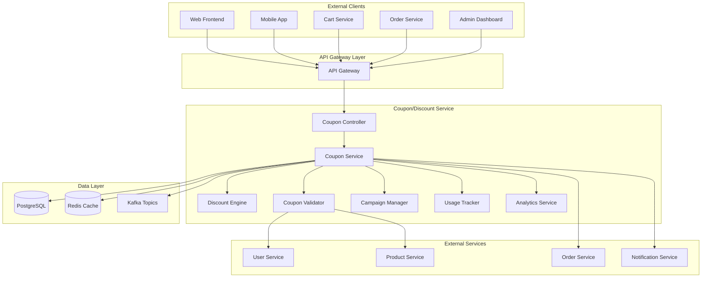

# Coupon/Discount Service Detailed Design Document

## Table of Contents

1. [Overview](#overview)
2. [Technical Specifications](#technical-specifications)
3. [Architecture Design](#architecture-design)
4. [API Design](#api-design)
5. [Database Design](#database-design)
6. [Coupon Management Design](#coupon-management-design)
7. [Discount Calculation Design](#discount-calculation-design)
8. [Error Handling](#error-handling)
9. [Test Design](#test-design)
10. [Local Development Environment](#local-development-environment)
11. [Production Deployment](#production-deployment)
12. [Monitoring and Operations](#monitoring-operations)
13. [Incident Response](#incident-response)

## Overview

### Service Summary

The Coupon/Discount Service is a microservice responsible for the coupon and discount functionality of the ski equipment sales shop site. It provides features such as creating and managing coupons, defining discount rules, determining applicability, and calculating discount amounts.

### Key Responsibilities

- **Coupon Management**: Create, edit, delete, and enable/disable coupons.
- **Discount Calculation**: Calculate the optimal discount amount based on multiple discount rules.
- **Applicability Check**: Determine if a coupon can be applied based on customer, product, and order conditions.
- **Usage History Management**: Record and track coupon usage history.
- **Campaign Management**: Manage limited-time campaigns.
- **Reporting**: Measure coupon effectiveness and provide usage statistics reports.

### Business Value

- **Increased Sales**: Promote purchases through strategic discounts.
- **Customer Acquisition**: Attract new customers with coupons.
- **Customer Retention**: Encourage repeat business with benefits for returning customers.
- **Inventory Management**: Support inventory adjustment for popular products.

## Technical Specifications

### Technology Stack

| Technology Area | Technology/Library | Version | Purpose |
|---|---|---|---|
| **Runtime** | OpenJDK | 21 LTS | Java execution environment |
| **Framework** | Jakarta EE | 11 | Enterprise framework |
| **Application Server** | WildFly | 31.0.1 | Jakarta EE application server |
| **Persistence** | Jakarta Persistence (JPA) | 3.2 | ORM |
| **Data Access** | Jakarta Data | 1.0 | Repository abstraction |
| **REST API** | Jakarta REST (JAX-RS) | 4.0 | RESTful Web Services |
| **CDI** | Jakarta CDI | 4.1 | Dependency injection and management |
| **Validation** | Jakarta Validation | 3.1 | Bean Validation |
| **JSON Processing** | Jakarta JSON-P | 2.1 | JSON processing |
| **Database** | PostgreSQL | 16 | Primary database |
| **Cache** | Redis | 7.2 | Coupon cache |
| **Message Queue** | Apache Kafka | 3.7 | Coupon event processing |
| **Monitoring** | MicroProfile Metrics | 5.1 | Metrics collection |
| **Tracing** | MicroProfile OpenTelemetry | 2.0 | Distributed tracing |
| **Health Check** | MicroProfile Health | 4.0 | Health checks |
| **Configuration** | MicroProfile Config | 3.1 | Configuration management |

### Excluded Technologies

- **Lombok**: Not used in order to leverage Jakarta EE 11's Record classes and modern Java features.

### Java 21 LTS Features Utilized

- **Virtual Threads**: High-concurrency coupon processing.
- **Record Classes**: Coupon data structures.
- **Pattern Matching**: Discount rule evaluation.
- **Text Blocks**: Complex SQL definitions.
- **Sealed Classes**: Type safety for coupon events.

## Architecture Design

### System Architecture Diagram



### Domain Model Design

```java
// Coupon Entity
@Entity
@Table(name = "coupons")
public class Coupon {
    
    @Id
    @GeneratedValue(strategy = GenerationType.UUID)
    private UUID id;
    
    @Column(name = "coupon_code", unique = true, nullable = false)
    private String couponCode;
    
    @Column(name = "name", nullable = false)
    private String name;
    
    @Column(name = "description")
    private String description;
    
    @Enumerated(EnumType.STRING)
    @Column(name = "coupon_type", nullable = false)
    private CouponType couponType;
    
    @Enumerated(EnumType.STRING)
    @Column(name = "discount_type", nullable = false)
    private DiscountType discountType;
    
    @Column(name = "discount_value", precision = 10, scale = 2, nullable = false)
    private BigDecimal discountValue;
    
    @Column(name = "minimum_order_amount", precision = 10, scale = 2)
    private BigDecimal minimumOrderAmount;
    
    @Column(name = "maximum_discount_amount", precision = 10, scale = 2)
    private BigDecimal maximumDiscountAmount;
    
    @Column(name = "usage_limit")
    private Integer usageLimit;
    
    @Column(name = "usage_limit_per_customer")
    private Integer usageLimitPerCustomer;
    
    @Column(name = "current_usage_count")
    private Integer currentUsageCount = 0;
    
    @Enumerated(EnumType.STRING)
    @Column(name = "status", nullable = false)
    private CouponStatus status;
    
    @Column(name = "valid_from", nullable = false)
    private LocalDateTime validFrom;
    
    @Column(name = "valid_until", nullable = false)
    private LocalDateTime validUntil;
    
    @Column(name = "created_at", nullable = false)
    private LocalDateTime createdAt;
    
    @Column(name = "updated_at")
    private LocalDateTime updatedAt;
    
    @Column(name = "created_by", nullable = false)
    private UUID createdBy;
    
    // Related Entities
    @OneToMany(mappedBy = "coupon", cascade = CascadeType.ALL, fetch = FetchType.LAZY)
    private List<CouponCondition> conditions = new ArrayList<>();
    
    @OneToMany(mappedBy = "coupon", cascade = CascadeType.ALL, fetch = FetchType.LAZY)
    private List<CouponUsage> usages = new ArrayList<>();
    
    // Business Logic
    public boolean isValid() {
        var now = LocalDateTime.now();
        return status == CouponStatus.ACTIVE &&
               now.isAfter(validFrom) &&
               now.isBefore(validUntil) &&
               !isUsageLimitExceeded();
    }
    
    public boolean isUsageLimitExceeded() {
        return usageLimit != null && currentUsageCount >= usageLimit;
    }
    
    public boolean canBeUsedByCustomer(UUID customerId) {
        if (usageLimitPerCustomer == null) {
            return true;
        }
        
        var customerUsageCount = usages.stream()
            .filter(usage -> usage.getCustomerId().equals(customerId))
            .filter(usage -> usage.getStatus() == CouponUsageStatus.USED)
            .mapToInt(usage -> 1)
            .sum();
            
        return customerUsageCount < usageLimitPerCustomer;
    }
    
    public BigDecimal calculateDiscount(BigDecimal orderAmount) {
        if (orderAmount.compareTo(minimumOrderAmount != null ? minimumOrderAmount : BigDecimal.ZERO) < 0) {
            return BigDecimal.ZERO;
        }
        
        var discount = switch (discountType) {
            case PERCENTAGE -> orderAmount.multiply(discountValue).divide(BigDecimal.valueOf(100));
            case FIXED_AMOUNT -> discountValue;
            case FREE_SHIPPING -> BigDecimal.ZERO; // Free shipping is handled separately
        };
        
        // Maximum discount amount limit
        if (maximumDiscountAmount != null && discount.compareTo(maximumDiscountAmount) > 0) {
            discount = maximumDiscountAmount;
        }
        
        return discount;
    }
    
    public void incrementUsage() {
        this.currentUsageCount++;
        this.updatedAt = LocalDateTime.now();
    }
    
    public void decrementUsage() {
        if (this.currentUsageCount > 0) {
            this.currentUsageCount--;
            this.updatedAt = LocalDateTime.now();
        }
    }
}

// Coupon Condition Entity
@Entity
@Table(name = "coupon_conditions")
public class CouponCondition {
    
    @Id
    @GeneratedValue(strategy = GenerationType.UUID)
    private UUID id;
    
    @ManyToOne(fetch = FetchType.LAZY)
    @JoinColumn(name = "coupon_id", nullable = false)
    private Coupon coupon;
    
    @Enumerated(EnumType.STRING)
    @Column(name = "condition_type", nullable = false)
    private ConditionType conditionType;
    
    @Enumerated(EnumType.STRING)
    @Column(name = "operator", nullable = false)
    private ConditionOperator operator;
    
    @Column(name = "target_value", nullable = false)
    private String targetValue;
    
    @Column(name = "condition_value", nullable = false)
    private String conditionValue;
    
    public boolean evaluate(CouponEvaluationContext context) {
        var actualValue = extractValue(context);
        var expectedValue = conditionValue;
        
        return switch (operator) {
            case EQUALS -> actualValue.equals(expectedValue);
            case NOT_EQUALS -> !actualValue.equals(expectedValue);
            case GREATER_THAN -> compareNumeric(actualValue, expectedValue) > 0;
            case GREATER_THAN_OR_EQUAL -> compareNumeric(actualValue, expectedValue) >= 0;
            case LESS_THAN -> compareNumeric(actualValue, expectedValue) < 0;
            case LESS_THAN_OR_EQUAL -> compareNumeric(actualValue, expectedValue) <= 0;
            case CONTAINS -> actualValue.contains(expectedValue);
            case IN -> Arrays.asList(expectedValue.split(",")).contains(actualValue);
        };
    }
    
    private String extractValue(CouponEvaluationContext context) {
        return switch (conditionType) {
            case CUSTOMER_SEGMENT -> context.customerSegment();
            case PRODUCT_CATEGORY -> context.productCategory();
            case PRODUCT_ID -> context.productId();
            case ORDER_AMOUNT -> context.orderAmount().toString();
            case DAY_OF_WEEK -> context.dayOfWeek().toString();
            case CUSTOMER_TYPE -> context.customerType();
        };
    }
    
    private int compareNumeric(String value1, String value2) {
        try {
            var num1 = new BigDecimal(value1);
            var num2 = new BigDecimal(value2);
            return num1.compareTo(num2);
        } catch (NumberFormatException e) {
            return value1.compareTo(value2);
        }
    }
}

// Coupon Usage History Entity
@Entity
@Table(name = "coupon_usages")
public class CouponUsage {
    
    @Id
    @GeneratedValue(strategy = GenerationType.UUID)
    private UUID id;
    
    @ManyToOne(fetch = FetchType.LAZY)
    @JoinColumn(name = "coupon_id", nullable = false)
    private Coupon coupon;
    
    @Column(name = "customer_id", nullable = false)
    private UUID customerId;
    
    @Column(name = "order_id")
    private UUID orderId;
    
    @Column(name = "discount_amount", precision = 10, scale = 2, nullable = false)
    private BigDecimal discountAmount;
    
    @Enumerated(EnumType.STRING)
    @Column(name = "status", nullable = false)
    private CouponUsageStatus status;
    
    @Column(name = "used_at", nullable = false)
    private LocalDateTime usedAt;
    
    @Column(name = "cancelled_at")
    private LocalDateTime cancelledAt;
    
    @Column(name = "cancel_reason")
    private String cancelReason;
    
    public void cancel(String reason) {
        this.status = CouponUsageStatus.CANCELLED;
        this.cancelledAt = LocalDateTime.now();
        this.cancelReason = reason;
    }
}

// Campaign Entity
@Entity
@Table(name = "campaigns")
public class Campaign {
    
    @Id
    @GeneratedValue(strategy = GenerationType.UUID)
    private UUID id;
    
    @Column(name = "name", nullable = false)
    private String name;
    
    @Column(name = "description")
    private String description;
    
    @Enumerated(EnumType.STRING)
    @Column(name = "campaign_type", nullable = false)
    private CampaignType campaignType;
    
    @Enumerated(EnumType.STRING)
    @Column(name = "status", nullable = false)
    private CampaignStatus status;
    
    @Column(name = "start_date", nullable = false)
    private LocalDateTime startDate;
    
    @Column(name = "end_date", nullable = false)
    private LocalDateTime endDate;
    
    @Column(name = "target_segment")
    private String targetSegment;
    
    @Column(name = "budget", precision = 12, scale = 2)
    private BigDecimal budget;
    
    @Column(name = "current_spend", precision = 12, scale = 2)
    private BigDecimal currentSpend = BigDecimal.ZERO;
    
    @Column(name = "created_at", nullable = false)
    private LocalDateTime createdAt;
    
    @Column(name = "created_by", nullable = false)
    private UUID createdBy;
    
    // Related Entities
    @OneToMany(mappedBy = "campaign", cascade = CascadeType.ALL, fetch = FetchType.LAZY)
    private List<Coupon> coupons = new ArrayList<>();
    
    public boolean isActive() {
        var now = LocalDateTime.now();
        return status == CampaignStatus.ACTIVE &&
               now.isAfter(startDate) &&
               now.isBefore(endDate) &&
               !isBudgetExceeded();
    }
    
    public boolean isBudgetExceeded() {
        return budget != null && currentSpend.compareTo(budget) >= 0;
    }
    
    public void addSpend(BigDecimal amount) {
        this.currentSpend = this.currentSpend.add(amount);
    }
}

// Enums
public enum CouponType {
    PERCENTAGE_OFF("Percentage Discount"),
    FIXED_AMOUNT_OFF("Fixed Amount Discount"),
    FREE_SHIPPING("Free Shipping"),
    BUY_X_GET_Y("Buy X Get Y"),
    FIRST_TIME_BUYER("For First-Time Buyers"),
    LOYALTY_REWARD("Loyalty Reward");
    
    private final String description;
    
    CouponType(String description) {
        this.description = description;
    }
    
    public String getDescription() {
        return description;
    }
}

public enum DiscountType {
    PERCENTAGE("Percentage"),
    FIXED_AMOUNT("Fixed Amount"),
    FREE_SHIPPING("Free Shipping");
    
    private final String description;
    
    DiscountType(String description) {
        this.description = description;
    }
    
    public String getDescription() {
        return description;
    }
}

public enum CouponStatus {
    DRAFT("Draft"),
    ACTIVE("Active"),
    PAUSED("Paused"),
    EXPIRED("Expired"),
    EXHAUSTED("Usage Limit Reached"),
    CANCELLED("Cancelled");
    
    private final String description;
    
    CouponStatus(String description) {
        this.description = description;
    }
    
    public String getDescription() {
        return description;
    }
}

public enum CouponUsageStatus {
    USED("Used"),
    CANCELLED("Cancelled"),
    REFUNDED("Refunded");
    
    private final String description;
    
    CouponUsageStatus(String description) {
        this.description = description;
    }
    
    public String getDescription() {
        return description;
    }
}

public enum ConditionType {
    CUSTOMER_SEGMENT("Customer Segment"),
    PRODUCT_CATEGORY("Product Category"),
    PRODUCT_ID("Product ID"),
    ORDER_AMOUNT("Order Amount"),
    DAY_OF_WEEK("Day of Week"),
    CUSTOMER_TYPE("Customer Type");
    
    private final String description;
    
    ConditionType(String description) {
        this.description = description;
    }
    
    public String getDescription() {
        return description;
    }
}

public enum ConditionOperator {
    EQUALS("Equals"),
    NOT_EQUALS("Not Equals"),
    GREATER_THAN("Greater Than"),
    GREATER_THAN_OR_EQUAL("Greater Than or Equal To"),
    LESS_THAN("Less Than"),
    LESS_THAN_OR_EQUAL("Less Than or Equal To"),
    CONTAINS("Contains"),
    IN("In");
    
    private final String description;
    
    ConditionOperator(String description) {
        this.description = description;
    }
    
    public String getDescription() {
        return description;
    }
}

public enum CampaignType {
    SEASONAL("Seasonal"),
    PRODUCT_LAUNCH("Product Launch"),
    CUSTOMER_ACQUISITION("Customer Acquisition"),
    RETENTION("Retention"),
    INVENTORY_CLEARANCE("Inventory Clearance");
    
    private final String description;
    
    CampaignType(String description) {
        this.description = description;
    }
    
    public String getDescription() {
        return description;
    }
}

public enum CampaignStatus {
    DRAFT("Draft"),
    SCHEDULED("Scheduled"),
    ACTIVE("Active"),
    PAUSED("Paused"),
    COMPLETED("Completed"),
    CANCELLED("Cancelled");
    
    private final String description;
    
    CampaignStatus(String description) {
        this.description = description;
    }
    
    public String getDescription() {
        return description;
    }
}

// Context Classes
public record CouponEvaluationContext(
    UUID customerId,
    String customerSegment,
    String customerType,
    String productCategory,
    String productId,
    BigDecimal orderAmount,
    DayOfWeek dayOfWeek,
    LocalDateTime timestamp
) {}

// Coupon CQRS Commands
public sealed interface CouponCommand permits CreateCouponCommand, UpdateCouponCommand,
        DeleteCouponCommand, ApplyCouponCommand, CancelCouponUsageCommand, 
        CreateCampaignCommand, StartCampaignCommand, EndCampaignCommand {}

public record CreateCouponCommand(
    String couponCode,
    String name,
    String description,
    CouponType couponType,
    DiscountType discountType,
    BigDecimal discountValue,
    BigDecimal minimumOrderAmount,
    BigDecimal maximumDiscountAmount,
    Integer usageLimit,
    Integer usageLimitPerCustomer,
    LocalDateTime validFrom,
    LocalDateTime validUntil,
    Set<String> applicableCategories,
    Set<String> applicableProducts,
    Set<UUID> applicableCustomers
) implements CouponCommand {}

public record UpdateCouponCommand(
    UUID couponId,
    String name,
    String description,
    CouponStatus status,
    BigDecimal discountValue,
    BigDecimal minimumOrderAmount,
    BigDecimal maximumDiscountAmount,
    Integer usageLimit,
    Integer usageLimitPerCustomer,
    LocalDateTime validFrom,
    LocalDateTime validUntil
) implements CouponCommand {}

public record DeleteCouponCommand(
    UUID couponId,
    String reason
) implements CouponCommand {}

public record ApplyCouponCommand(
    String couponCode,
    UUID customerId,
    UUID orderId,
    List<OrderItem> orderItems,
    BigDecimal orderTotal,
    LocalDateTime timestamp
) implements CouponCommand {}

public record CancelCouponUsageCommand(
    UUID couponUsageId,
    UUID orderId,
    String reason
) implements CouponCommand {}

public record CreateCampaignCommand(
    String name,
    String description,
    LocalDateTime startDate,
    LocalDateTime endDate,
    List<UUID> couponIds,
    CampaignType campaignType,
    Map<String, Object> campaignSettings
) implements CouponCommand {}

public record StartCampaignCommand(
    UUID campaignId
) implements CouponCommand {}

public record EndCampaignCommand(
    UUID campaignId,
    String reason
) implements CouponCommand {}

// Coupon CQRS Queries
public sealed interface CouponQuery permits GetCouponByCodeQuery, GetUserCouponsQuery,
        GetActiveCouponsQuery, GetCouponUsageStatsQuery, GetCampaignQuery,
        GetDiscountCalculationQuery, ValidateCouponQuery {}

public record GetCouponByCodeQuery(
    String couponCode
) implements CouponQuery {}

public record GetUserCouponsQuery(
    UUID customerId,
    CouponStatus status,
    int page,
    int size
) implements CouponQuery {}

public record GetActiveCouponsQuery(
    LocalDateTime timestamp,
    String category,
    String productId,
    int page,
    int size
) implements CouponQuery {}

public record GetCouponUsageStatsQuery(
    UUID couponId,
    LocalDateTime fromDate,
    LocalDateTime toDate
) implements CouponQuery {}

public record GetCampaignQuery(
    UUID campaignId
) implements CouponQuery {}

public record GetDiscountCalculationQuery(
    String couponCode,
    UUID customerId,
    List<OrderItem> orderItems,
    BigDecimal orderTotal
) implements CouponQuery {}

public record ValidateCouponQuery(
    String couponCode,
    UUID customerId,
    ValidationContext context
) implements CouponQuery {}

// Coupon Projections
public record CouponProjection(
    UUID id,
    String couponCode,
    String name,
    CouponType couponType,
    DiscountType discountType,
    BigDecimal discountValue,
    BigDecimal minimumOrderAmount,
    CouponStatus status,
    LocalDateTime validFrom,
    LocalDateTime validUntil,
    Integer currentUsageCount,
    Integer usageLimit
) {}

public record CouponUsageStatsProjection(
    UUID couponId,
    String couponCode,
    long totalUsageCount,
    BigDecimal totalDiscountAmount,
    BigDecimal averageOrderValue,
    long uniqueCustomerCount,
    Map<LocalDate, Long> dailyUsage
) {}

public record DiscountCalculationProjection(
    String couponCode,
    boolean isValid,
    BigDecimal discountAmount,
    BigDecimal finalTotal,
    String discountDescription,
    List<String> validationErrors
) {}

public record CampaignProjection(
    UUID id,
    String name,
    String description,
    CampaignStatus status,
    LocalDateTime startDate,
    LocalDateTime endDate,
    List<CouponProjection> coupons,
    CampaignStats stats
) {}

// Coupon Service with CQRS
@ApplicationScoped
@Transactional
public class CouponService {
    
    private static final Logger logger = LoggerFactory.getLogger(CouponService.class);
    
    @Inject
    private CouponRepository couponRepository;
    
    @Inject
    private CouponUsageRepository couponUsageRepository;
    
    @Inject
    private CampaignRepository campaignRepository;
    
    @Inject
    private CouponCodeGenerator codeGenerator;
    
    @Inject
    private DiscountCalculationEngine discountEngine;
    
    @Inject
    private CouponEventPublisher eventPublisher;
    
    @Inject
    private CouponQueryService queryService;
    
    // Command Handlers
    @CommandHandler
    public UUID handle(CreateCouponCommand command) {
        // Generate coupon code
        var couponCode = command.couponCode() != null ? 
            command.couponCode() : codeGenerator.generate();
        
        // Check for duplicates
        if (couponRepository.existsByCouponCode(couponCode)) {
            throw new DuplicateCouponCodeException("Coupon code already exists: " + couponCode);
        }
        
        // Create coupon entity
        var coupon = buildCoupon(command, couponCode);
        var savedCoupon = couponRepository.save(coupon);
        
        // Publish event
        eventPublisher.publish(new CouponCreatedEvent(
            savedCoupon.getId(),
            savedCoupon.getCouponCode(),
            savedCoupon.getCouponType(),
            LocalDateTime.now()
        ));
        
        return savedCoupon.getId();
    }
    
    @CommandHandler
    public void handle(ApplyCouponCommand command) {
        var coupon = couponRepository.findByCouponCode(command.couponCode())
            .orElseThrow(() -> new CouponNotFoundException("Coupon not found: " + command.couponCode()));
        
        // Validation
        var validationResult = validateCouponUsage(coupon, command);
        if (!validationResult.isValid()) {
            throw new InvalidCouponUsageException(validationResult.getErrorMessage());
        }
        
        // Calculate discount
        var discountAmount = discountEngine.calculateDiscount(
            coupon, command.orderItems(), command.orderTotal());
        
        // Record usage history
        var usage = new CouponUsage(
            coupon.getId(),
            command.customerId(),
            command.orderId(),
            discountAmount,
            command.timestamp()
        );
        couponUsageRepository.save(usage);
        
        // Update usage count
        coupon.incrementUsageCount();
        couponRepository.save(coupon);
        
        // Publish event
        eventPublisher.publish(new CouponUsedEvent(
            coupon.getId(),
            coupon.getCouponCode(),
            command.customerId(),
            command.orderId(),
            discountAmount,
            LocalDateTime.now()
        ));
    }
    
    @CommandHandler
    public void handle(CancelCouponUsageCommand command) {
        var usage = couponUsageRepository.findById(command.couponUsageId())
            .orElseThrow(() -> new CouponUsageNotFoundException("Usage not found"));
        
        if (usage.isCancelled()) {
            throw new InvalidOperationException("Usage already cancelled");
        }
        
        // Cancel usage history
        usage.cancel(command.reason());
        couponUsageRepository.save(usage);
        
        // Restore coupon usage count
        var coupon = couponRepository.findById(usage.getCouponId())
            .orElseThrow(() -> new CouponNotFoundException("Coupon not found"));
        
        coupon.decrementUsageCount();
        couponRepository.save(coupon);
        
        // Publish event
        eventPublisher.publish(new CouponCancelledEvent(
            coupon.getId(),
            coupon.getCouponCode(),
            usage.getCustomerId(),
            command.reason(),
            LocalDateTime.now()
        ));
    }
    
    @CommandHandler
    public UUID handle(CreateCampaignCommand command) {
        var campaign = Campaign.builder()
            .name(command.name())
            .description(command.description())
            .startDate(command.startDate())
            .endDate(command.endDate())
            .campaignType(command.campaignType())
            .status(CampaignStatus.DRAFT)
            .build();
        
        // Associate coupons
        if (command.couponIds() != null && !command.couponIds().isEmpty()) {
            var coupons = couponRepository.findByIds(command.couponIds());
            campaign.addCoupons(coupons);
        }
        
        var savedCampaign = campaignRepository.save(campaign);
        
        eventPublisher.publish(new CampaignCreatedEvent(
            savedCampaign.getId(),
            savedCampaign.getName(),
            savedCampaign.getStartDate(),
            savedCampaign.getEndDate(),
            LocalDateTime.now()
        ));
        
        return savedCampaign.getId();
    }
    
    @CommandHandler
    public void handle(StartCampaignCommand command) {
        var campaign = campaignRepository.findById(command.campaignId())
            .orElseThrow(() -> new CampaignNotFoundException("Campaign not found"));
        
        campaign.start();
        campaignRepository.save(campaign);
        
        // Activate related coupons
        campaign.getCoupons().forEach(coupon -> {
            coupon.activate();
            couponRepository.save(coupon);
        });
        
        eventPublisher.publish(new CampaignStartedEvent(
            campaign.getId(),
            campaign.getName(),
            LocalDateTime.now()
        ));
    }
    
    private Coupon buildCoupon(CreateCouponCommand command, String couponCode) {
        return Coupon.builder()
            .couponCode(couponCode)
            .name(command.name())
            .description(command.description())
            .couponType(command.couponType())
            .discountType(command.discountType())
            .discountValue(command.discountValue())
            .minimumOrderAmount(command.minimumOrderAmount())
            .maximumDiscountAmount(command.maximumDiscountAmount())
            .usageLimit(command.usageLimit())
            .usageLimitPerCustomer(command.usageLimitPerCustomer())
            .validFrom(command.validFrom())
            .validUntil(command.validUntil())
            .status(CouponStatus.ACTIVE)
            .build();
    }
    
    private CouponValidationResult validateCouponUsage(Coupon coupon, ApplyCouponCommand command) {
        var context = new CouponValidationContext(
            command.customerId(),
            command.orderItems(),
            command.orderTotal(),
            command.timestamp()
        );
        
        return couponValidator.validate(coupon, context);
    }
}

// Coupon Query Service
@ApplicationScoped
public class CouponQueryService {
    
    @Inject
    private CouponRepository couponRepository;
    
    @Inject
    private CouponUsageRepository couponUsageRepository;
    
    @Inject
    private CampaignRepository campaignRepository;
    
    @QueryHandler
    public Optional<CouponProjection> handle(GetCouponByCodeQuery query) {
        return couponRepository.findByCouponCode(query.couponCode())
            .map(this::toCouponProjection);
    }
    
    @QueryHandler
    public List<CouponProjection> handle(GetUserCouponsQuery query) {
        return couponRepository.findByCustomerIdAndStatus(
            query.customerId(), query.status(), query.page(), query.size())
            .stream()
            .map(this::toCouponProjection)
            .toList();
    }
    
    @QueryHandler
    public List<CouponProjection> handle(GetActiveCouponsQuery query) {
        return couponRepository.findActiveCoupons(
            query.timestamp(), query.category(), query.productId(), 
            query.page(), query.size())
            .stream()
            .map(this::toCouponProjection)
            .toList();
    }
    
    @QueryHandler
    public CouponUsageStatsProjection handle(GetCouponUsageStatsQuery query) {
        var stats = couponUsageRepository.getUsageStats(
            query.couponId(), query.fromDate(), query.toDate());
        
        return new CouponUsageStatsProjection(
            query.couponId(),
            stats.getCouponCode(),
            stats.getTotalUsageCount(),
            stats.getTotalDiscountAmount(),
            stats.getAverageOrderValue(),
            stats.getUniqueCustomerCount(),
            stats.getDailyUsage()
        );
    }
    
    @QueryHandler
    public DiscountCalculationProjection handle(GetDiscountCalculationQuery query) {
        try {
            var coupon = couponRepository.findByCouponCode(query.couponCode())
                .orElseThrow(() -> new CouponNotFoundException("Coupon not found"));
            
            var validationResult = couponValidator.validate(coupon, 
                new CouponValidationContext(query.customerId(), query.orderItems(), 
                    query.orderTotal(), LocalDateTime.now()));
            
            if (!validationResult.isValid()) {
                return new DiscountCalculationProjection(
                    query.couponCode(),
                    false,
                    BigDecimal.ZERO,
                    query.orderTotal(),
                    "",
                    validationResult.getErrors()
                );
            }
            
            var discountAmount = discountEngine.calculateDiscount(
                coupon, query.orderItems(), query.orderTotal());
            
            var finalTotal = query.orderTotal().subtract(discountAmount);
            
            return new DiscountCalculationProjection(
                query.couponCode(),
                true,
                discountAmount,
                finalTotal,
                generateDiscountDescription(coupon, discountAmount),
                List.of()
            );
            
        } catch (Exception e) {
            return new DiscountCalculationProjection(
                query.couponCode(),
                false,
                BigDecimal.ZERO,
                query.orderTotal(),
                "",
                List.of(e.getMessage())
            );
        }
    }
    
    private CouponProjection toCouponProjection(Coupon coupon) {
        return new CouponProjection(
            coupon.getId(),
            coupon.getCouponCode(),
            coupon.getName(),
            coupon.getCouponType(),
            coupon.getDiscountType(),
            coupon.getDiscountValue(),
            coupon.getMinimumOrderAmount(),
            coupon.getStatus(),
            coupon.getValidFrom(),
            coupon.getValidUntil(),
            coupon.getCurrentUsageCount(),
            coupon.getUsageLimit()
        );
    }
    
    private String generateDiscountDescription(Coupon coupon, BigDecimal discountAmount) {
        return switch (coupon.getDiscountType()) {
            case PERCENTAGE -> String.format("%.0f%% discount (¥%,d)", 
                coupon.getDiscountValue(), discountAmount.intValue());
            case FIXED_AMOUNT -> String.format("¥%,d discount", discountAmount.intValue());
            case FREE_SHIPPING -> "Free shipping";
        };
    }
}
        
        // Publish event
        eventPublisher.publish(new CouponCreatedEvent(
            savedCoupon.getId(),
            savedCoupon.getCouponCode(),
            savedCoupon.getCouponType(),
            LocalDateTime.now()
        ));
        
        logger.info("Coupon created: {}", savedCoupon.getCouponCode());
        return savedCoupon;
    }
    
    public CouponValidationResult validateCoupon(String couponCode, CouponContext context) {
        var coupon = couponRepository.findByCouponCode(couponCode)
            .orElse(null);
            
        if (coupon == null) {
            return CouponValidationResult.invalid("Coupon not found");
        }
        
        if (!coupon.isActive()) {
            return CouponValidationResult.invalid("Coupon is not active");
        }
        
        if (coupon.isExpired()) {
            return CouponValidationResult.invalid("Coupon has expired");
        }
        
        // Check usage limit
        if (coupon.hasUsageLimit()) {
            var usageCount = couponUsageRepository.countByCouponId(coupon.getId());
            if (usageCount >= coupon.getMaxUsageCount()) {
                return CouponValidationResult.invalid("Coupon usage limit has been reached");
            }
        }
        
        // Check usage limit per customer
        if (coupon.hasCustomerUsageLimit() && context.customerId() != null) {
            var customerUsageCount = couponUsageRepository
                .countByCouponIdAndCustomerId(coupon.getId(), context.customerId());
            if (customerUsageCount >= coupon.getMaxUsageCountPerCustomer()) {
                return CouponValidationResult.invalid("You have reached the usage limit for this coupon");
            }
        }
        
        // Check conditions
        for (var condition : coupon.getConditions()) {
            if (!condition.evaluate(context)) {
                return CouponValidationResult.invalid("Coupon conditions are not met");
            }
        }
        
        return CouponValidationResult.valid(coupon);
    }
    
    public DiscountCalculationResult calculateDiscount(String couponCode, CouponContext context) {
        var validationResult = validateCoupon(couponCode, context);
        
        if (!validationResult.isValid()) {
            return DiscountCalculationResult.failed(validationResult.errorMessage());
        }
        
        var coupon = validationResult.coupon();
        var discountAmount = discountEngine.calculateDiscount(coupon, context);
        
        return DiscountCalculationResult.success(coupon, discountAmount);
    }
    
    public CouponUsage useCoupon(UseCouponRequest request) {
        var coupon = couponRepository.findByCouponCode(request.couponCode())
            .orElseThrow(() -> new CouponNotFoundException("Coupon not found: " + request.couponCode()));
        
        // Re-validate
        var context = new CouponContext(
            request.customerId(),
            request.cartItems(),
            request.totalAmount(),
            request.productCategories(),
            null, // productId
            request.totalAmount(),
            LocalDateTime.now().getDayOfWeek(),
            LocalDateTime.now()
        );
        
        var validationResult = validateCoupon(request.couponCode(), context);
        if (!validationResult.isValid()) {
            throw new InvalidCouponException(validationResult.errorMessage());
        }
        
        // Calculate discount amount
        var discountAmount = discountEngine.calculateDiscount(coupon, context);
        
        // Create usage history
        var usage = new CouponUsage();
        usage.setCoupon(coupon);
        usage.setCustomerId(request.customerId());
        usage.setOrderId(request.orderId());
        usage.setDiscountAmount(discountAmount);
        usage.setUsedAt(LocalDateTime.now());
        
        var savedUsage = couponUsageRepository.save(usage);
        
        // Publish event
        eventPublisher.publish(new CouponUsedEvent(
            coupon.getId(),
            coupon.getCouponCode(),
            request.customerId(),
            request.orderId(),
            discountAmount,
            LocalDateTime.now()
        ));
        
        logger.info("Coupon used: {} by customer: {}", coupon.getCouponCode(), request.customerId());
        return savedUsage;
    }
    
    public void cancelCouponUsage(UUID usageId, String reason) {
        var usage = couponUsageRepository.findById(usageId)
            .orElseThrow(() -> new CouponUsageNotFoundException("Coupon usage not found: " + usageId));
        
        if (usage.isCancelled()) {
            throw new IllegalStateException("Coupon usage already cancelled");
        }
        
        usage.cancel(reason);
        couponUsageRepository.save(usage);
        
        // Publish event
        eventPublisher.publish(new CouponCancelledEvent(
            usage.getCoupon().getId(),
            usage.getCoupon().getCouponCode(),
            usage.getCustomerId(),
            reason,
            LocalDateTime.now()
        ));
        
        logger.info("Coupon usage cancelled: {} for customer: {}", 
            usage.getCoupon().getCouponCode(), usage.getCustomerId());
    }
    
    public List<Coupon> findAvailableCoupons(UUID customerId) {
        // Get a list of coupons available to the customer
        var allActiveCoupons = couponRepository.findActiveAndNotExpired();
        
        return allActiveCoupons.stream()
            .filter(coupon -> {
                // Check customer-specific conditions
                if (coupon.hasCustomerRestrictions()) {
                    return coupon.isApplicableToCustomer(customerId);
                }
                
                // Check usage limit
                if (coupon.hasCustomerUsageLimit()) {
                    var usageCount = couponUsageRepository
                        .countByCouponIdAndCustomerId(coupon.getId(), customerId);
                    return usageCount < coupon.getMaxUsageCountPerCustomer();
                }
                
                return true;
            })
            .toList();
    }
    
    public CouponStatistics getCouponStatistics(UUID couponId) {
        var coupon = couponRepository.findById(couponId)
            .orElseThrow(() -> new CouponNotFoundException("Coupon not found: " + couponId));
        
        var totalUsages = couponUsageRepository.countByCouponId(couponId);
        var totalDiscountAmount = couponUsageRepository.sumDiscountAmountByCouponId(couponId);
        var uniqueCustomers = couponUsageRepository.countDistinctCustomersByCouponId(couponId);
        
        return new CouponStatistics(
            coupon.getCouponCode(),
            totalUsages,
            totalDiscountAmount,
            uniqueCustomers,
            coupon.getMaxUsageCount() != null ? 
                (double) totalUsages / coupon.getMaxUsageCount() * 100 : null
        );
    }
    
    private Coupon buildCoupon(CreateCouponRequest request, String couponCode) {
        var coupon = new Coupon();
        coupon.setCouponCode(couponCode);
        coupon.setName(request.name());
        coupon.setDescription(request.description());
        coupon.setCouponType(request.couponType());
        coupon.setDiscountType(request.discountType());
        coupon.setDiscountValue(request.discountValue());
        coupon.setMinimumOrderAmount(request.minimumOrderAmount());
        coupon.setMaximumDiscountAmount(request.maximumDiscountAmount());
        coupon.setValidFrom(request.validFrom());
        coupon.setValidTo(request.validTo());
        coupon.setMaxUsageCount(request.maxUsageCount());
        coupon.setMaxUsageCountPerCustomer(request.maxUsageCountPerCustomer());
        coupon.setStatus(CouponStatus.ACTIVE);
        coupon.setCreatedAt(LocalDateTime.now());
        
        // Set conditions
        if (request.conditions() != null) {
            var conditions = request.conditions().stream()
                .map(this::buildCouponCondition)
                .toList();
            coupon.setConditions(conditions);
        }
        
        return coupon;
    }
    
    private CouponCondition buildCouponCondition(CouponConditionRequest request) {
        var condition = new CouponCondition();
        condition.setConditionType(request.conditionType());
        condition.setOperator(request.operator());
        condition.setValue(request.value());
        condition.setCreatedAt(LocalDateTime.now());
        return condition;
    }
}

// Discount Calculation Engine
@ApplicationScoped
public class DiscountCalculationEngine {
    
    private static final Logger logger = LoggerFactory.getLogger(DiscountCalculationEngine.class);
    
    public BigDecimal calculateDiscount(Coupon coupon, CouponContext context) {
        var baseDiscount = calculateBaseDiscount(coupon, context);
        var finalDiscount = applyDiscountConstraints(coupon, baseDiscount, context);
        
        logger.debug("Calculated discount for coupon {}: {} -> {}", 
            coupon.getCouponCode(), baseDiscount, finalDiscount);
        
        return finalDiscount;
    }
    
    private BigDecimal calculateBaseDiscount(Coupon coupon, CouponContext context) {
        return switch (coupon.getDiscountType()) {
            case FIXED_AMOUNT -> coupon.getDiscountValue();
            case PERCENTAGE -> context.orderAmount()
                .multiply(coupon.getDiscountValue())
                .divide(BigDecimal.valueOf(100), 2, RoundingMode.DOWN);
            case BUY_X_GET_Y -> calculateBuyXGetYDiscount(coupon, context);
            case FREE_SHIPPING -> calculateShippingDiscount(context);
        };
    }
    
    private BigDecimal applyDiscountConstraints(Coupon coupon, BigDecimal discount, CouponContext context) {
        var finalDiscount = discount;
        
        // Maximum discount amount limit
        if (coupon.getMaximumDiscountAmount() != null) {
            finalDiscount = finalDiscount.min(coupon.getMaximumDiscountAmount());
        }
        
        // Do not exceed order amount
        finalDiscount = finalDiscount.min(context.orderAmount());
        
        // Do not become negative
        finalDiscount = finalDiscount.max(BigDecimal.ZERO);
        
        return finalDiscount;
    }
    
    private BigDecimal calculateBuyXGetYDiscount(Coupon coupon, CouponContext context) {
        // Implementation of Buy X Get Y (simplified)
        // The actual implementation would calculate combinations of products in detail
        return context.orderAmount().multiply(new BigDecimal("0.1")); // Simplified as 10% discount
    }
    
    private BigDecimal calculateShippingDiscount(CouponContext context) {
        // Discount amount for free shipping (usually the shipping cost)
        return new BigDecimal("500"); // Simplified as fixed shipping cost
    }
}

// Campaign Service
@ApplicationScoped
@Transactional
public class CampaignService {
    
    private static final Logger logger = LoggerFactory.getLogger(CampaignService.class);
    
    @Inject
    private CampaignRepository campaignRepository;
    
    @Inject
    private CouponRepository couponRepository;
    
    @Inject
    private CouponEventPublisher eventPublisher;
    
    public Campaign createCampaign(CreateCampaignRequest request) {
        var campaign = new Campaign();
        campaign.setName(request.name());
        campaign.setDescription(request.description());
        campaign.setCampaignType(request.campaignType());
        campaign.setStartDate(request.startDate());
        campaign.setEndDate(request.endDate());
        campaign.setBudget(request.budget());
        campaign.setTargetCustomerSegment(request.targetCustomerSegment());
        campaign.setStatus(CampaignStatus.DRAFT);
        campaign.setCreatedAt(LocalDateTime.now());
        
        var savedCampaign = campaignRepository.save(campaign);
        
        logger.info("Campaign created: {}", savedCampaign.getName());
        return savedCampaign;
    }
    
    public void startCampaign(UUID campaignId) {
        var campaign = campaignRepository.findById(campaignId)
            .orElseThrow(() -> new CampaignNotFoundException("Campaign not found: " + campaignId));
        
        if (campaign.getStatus() != CampaignStatus.DRAFT) {
            throw new IllegalStateException("Campaign cannot be started");
        }
        
        campaign.start();
        campaignRepository.save(campaign);
        
        // Activate related coupons
        activateCampaignCoupons(campaign);
        
        // Publish event
        eventPublisher.publish(new CampaignStartedEvent(
            campaign.getId(),
            campaign.getName(),
            LocalDateTime.now()
        ));
        
        logger.info("Campaign started: {}", campaign.getName());
    }
    
    public void endCampaign(UUID campaignId) {
        var campaign = campaignRepository.findById(campaignId)
            .orElseThrow(() -> new CampaignNotFoundException("Campaign not found: " + campaignId));
        
        if (campaign.getStatus() != CampaignStatus.ACTIVE) {
            throw new IllegalStateException("Campaign cannot be ended");
        }
        
        campaign.end();
        campaignRepository.save(campaign);
        
        // Deactivate related coupons
        deactivateCampaignCoupons(campaign);
        
        // Publish event
        eventPublisher.publish(new CampaignEndedEvent(
            campaign.getId(),
            campaign.getName(),
            LocalDateTime.now()
        ));
        
        logger.info("Campaign ended: {}", campaign.getName());
    }
    
    public List<Campaign> getActiveCampaigns() {
        return campaignRepository.findActiveAndNotExpired();
    }
    
    public CampaignAnalytics getCampaignAnalytics(UUID campaignId) {
        var campaign = campaignRepository.findById(campaignId)
            .orElseThrow(() -> new CampaignNotFoundException("Campaign not found: " + campaignId));
        
        // Aggregate usage statistics for coupons related to the campaign
        var relatedCoupons = couponRepository.findByCampaignId(campaignId);
        
        var totalUsages = relatedCoupons.stream()
            .mapToLong(coupon -> couponRepository.getUsageCount(coupon.getId()))
            .sum();
            
        var totalDiscountAmount = relatedCoupons.stream()
            .map(coupon -> couponRepository.getTotalDiscountAmount(coupon.getId()))
            .reduce(BigDecimal.ZERO, BigDecimal::add);
        
        return new CampaignAnalytics(
            campaign.getName(),
            totalUsages,
            totalDiscountAmount,
            campaign.getBudget().subtract(totalDiscountAmount), // Remaining budget
            relatedCoupons.size()
        );
    }
    
    private void activateCampaignCoupons(Campaign campaign) {
        var coupons = couponRepository.findByCampaignId(campaign.getId());
        coupons.forEach(coupon -> {
            coupon.setStatus(CouponStatus.ACTIVE);
            couponRepository.save(coupon);
        });
    }
    
    private void deactivateCampaignCoupons(Campaign campaign) {
        var coupons = couponRepository.findByCampaignId(campaign.getId());
        coupons.forEach(coupon -> {
            coupon.setStatus(CouponStatus.INACTIVE);
            couponRepository.save(coupon);
}
```

## API Design

### REST API Endpoints

```java
@Path("/api/v1/coupons")
@ApplicationScoped
@Produces(MediaType.APPLICATION_JSON)
@Consumes(MediaType.APPLICATION_JSON)
public class CouponController {
    
    private static final Logger logger = LoggerFactory.getLogger(CouponController.class);
    
    @Inject
    private CouponService couponService;
    
    @Inject
    private CampaignService campaignService;
    
    @POST
    @Path("")
    @Operation(summary = "Create Coupon", description = "Creates a new coupon.")
    @APIResponse(responseCode = "201", description = "Coupon created successfully")
    @APIResponse(responseCode = "400", description = "Invalid request")
    @APIResponse(responseCode = "409", description = "Duplicate coupon code")
    @RolesAllowed({"ADMIN", "MARKETING"})
    public Response createCoupon(@Valid @RequestBody CreateCouponRequest request) {
        try {
            var coupon = couponService.createCoupon(request);
            var response = CouponResponse.from(coupon);
            
            return Response.status(Response.Status.CREATED)
                .entity(response)
                .build();
                
        } catch (DuplicateCouponCodeException e) {
            return Response.status(Response.Status.CONFLICT)
                .entity(Map.of("error", e.getMessage()))
                .build();
                
        } catch (Exception e) {
            logger.error("Failed to create coupon", e);
            return Response.status(Response.Status.INTERNAL_SERVER_ERROR)
                .entity(Map.of("error", "Internal server error"))
                .build();
        }
    }
    
    @POST
    @Path("/validate")
    @Operation(summary = "Validate Coupon", description = "Validates the applicability of a coupon.")
    @APIResponse(responseCode = "200", description = "Validation result")
    public Response validateCoupon(@Valid @RequestBody CouponValidationRequest request) {
        var context = new CouponContext(
            request.customerId(),
            request.cartItems(),
            request.totalAmount(),
            request.productCategories(),
            null,
            request.totalAmount(),
            LocalDateTime.now().getDayOfWeek(),
            LocalDateTime.now()
        );
        
        var result = couponService.validateCoupon(request.couponCode(), context);
        
        if (result.isValid()) {
            var discountResult = couponService.calculateDiscount(request.couponCode(), context);
            return Response.ok(CouponValidationResponse.valid(
                result.coupon(),
                discountResult.discountAmount()
            )).build();
        } else {
            return Response.ok(CouponValidationResponse.invalid(result.errorMessage())).build();
        }
    }
    
    @POST
    @Path("/use")
    @Operation(summary = "Use Coupon", description = "Applies a discount using a coupon.")
    @APIResponse(responseCode = "200", description = "Coupon used successfully")
    @APIResponse(responseCode = "400", description = "Invalid coupon")
    @APIResponse(responseCode = "404", description = "Coupon not found")
    public Response useCoupon(@Valid @RequestBody UseCouponRequest request) {
        try {
            var usage = couponService.useCoupon(request);
            var response = CouponUsageResponse.from(usage);
            
            return Response.ok(response).build();
            
        } catch (CouponNotFoundException e) {
            return Response.status(Response.Status.NOT_FOUND)
                .entity(Map.of("error", e.getMessage()))
                .build();
                
        } catch (InvalidCouponException e) {
            return Response.status(Response.Status.BAD_REQUEST)
                .entity(Map.of("error", e.getMessage()))
                .build();
        }
    }
    
    @DELETE
    @Path("/usage/{usageId}")
    @Operation(summary = "Cancel Coupon Usage", description = "Cancels the usage of a coupon.")
    @APIResponse(responseCode = "200", description = "Cancellation successful")
    @APIResponse(responseCode = "404", description = "Usage history not found")
    @RolesAllowed({"ADMIN", "CUSTOMER_SERVICE"})
    public Response cancelCouponUsage(
            @PathParam("usageId") UUID usageId,
            @Valid @RequestBody CancelCouponUsageRequest request) {
        
        try {
            couponService.cancelCouponUsage(usageId, request.reason());
            return Response.ok(Map.of("status", "cancelled")).build();
            
        } catch (CouponUsageNotFoundException e) {
            return Response.status(Response.Status.NOT_FOUND)
                .entity(Map.of("error", e.getMessage()))
                .build();
        }
    }
    
    @GET
    @Path("/customers/{customerId}/available")
    @Operation(summary = "Get Available Coupons", description = "Gets a list of coupons available to a customer.")
    @APIResponse(responseCode = "200", description = "Coupon list retrieved successfully")
    public Response getAvailableCoupons(@PathParam("customerId") UUID customerId) {
        var coupons = couponService.findAvailableCoupons(customerId);
        var responses = coupons.stream()
            .map(CouponResponse::from)
            .toList();
            
        return Response.ok(responses).build();
    }
    
    @GET
    @Path("/{couponId}")
    @Operation(summary = "Get Coupon Details", description = "Gets the detailed information of a coupon.")
    @APIResponse(responseCode = "200", description = "Coupon details retrieved successfully")
    @APIResponse(responseCode = "404", description = "Coupon not found")
    public Response getCoupon(@PathParam("couponId") UUID couponId) {
        try {
            var coupon = couponService.findCouponById(couponId);
            var response = CouponResponse.from(coupon);
            
            return Response.ok(response).build();
            
        } catch (CouponNotFoundException e) {
            return Response.status(Response.Status.NOT_FOUND)
                .entity(Map.of("error", e.getMessage()))
                .build();
        }
    }
    
    @GET
    @Path("/{couponId}/statistics")
    @Operation(summary = "Coupon Statistics", description = "Gets the usage statistics of a coupon.")
    @APIResponse(responseCode = "200", description = "Statistics retrieved successfully")
    @RolesAllowed({"ADMIN", "MARKETING"})
    public Response getCouponStatistics(@PathParam("couponId") UUID couponId) {
        try {
            var statistics = couponService.getCouponStatistics(couponId);
            return Response.ok(statistics).build();
            
        } catch (CouponNotFoundException e) {
            return Response.status(Response.Status.NOT_FOUND)
                .entity(Map.of("error", e.getMessage()))
                .build();
        }
    }
    
    @PUT
    @Path("/{couponId}/status")
    @Operation(summary = "Update Coupon Status", description = "Updates the status of a coupon.")
    @APIResponse(responseCode = "200", description = "Status updated successfully")
    @RolesAllowed({"ADMIN", "MARKETING"})
    public Response updateCouponStatus(
            @PathParam("couponId") UUID couponId,
            @Valid @RequestBody UpdateCouponStatusRequest request) {
        
        try {
            var coupon = couponService.updateCouponStatus(couponId, request.status());
            var response = CouponResponse.from(coupon);
            
            return Response.ok(response).build();
            
        } catch (CouponNotFoundException e) {
            return Response.status(Response.Status.NOT_FOUND)
                .entity(Map.of("error", e.getMessage()))
                .build();
        }
    }
}

@Path("/api/v1/campaigns")
@ApplicationScoped
@Produces(MediaType.APPLICATION_JSON)
@Consumes(MediaType.APPLICATION_JSON)
public class CampaignController {
    
    private static final Logger logger = LoggerFactory.getLogger(CampaignController.class);
    
    @Inject
    private CampaignService campaignService;
    
    @POST
    @Path("")
    @Operation(summary = "Create Campaign", description = "Creates a new campaign.")
    @APIResponse(responseCode = "201", description = "Campaign created successfully")
    @RolesAllowed({"ADMIN", "MARKETING"})
    public Response createCampaign(@Valid @RequestBody CreateCampaignRequest request) {
        try {
            var campaign = campaignService.createCampaign(request);
            var response = CampaignResponse.from(campaign);
            
            return Response.status(Response.Status.CREATED)
                .entity(response)
                .build();
                
        } catch (Exception e) {
            logger.error("Failed to create campaign", e);
            return Response.status(Response.Status.INTERNAL_SERVER_ERROR)
                .entity(Map.of("error", "Internal server error"))
                .build();
        }
    }
    
    @POST
    @Path("/{campaignId}/start")
    @Operation(summary = "Start Campaign", description = "Starts a campaign.")
    @APIResponse(responseCode = "200", description = "Campaign started successfully")
    @RolesAllowed({"ADMIN", "MARKETING"})
    public Response startCampaign(@PathParam("campaignId") UUID campaignId) {
        try {
            campaignService.startCampaign(campaignId);
            return Response.ok(Map.of("status", "started")).build();
            
        } catch (CampaignNotFoundException e) {
            return Response.status(Response.Status.NOT_FOUND)
                .entity(Map.of("error", e.getMessage()))
                .build();
                
        } catch (IllegalStateException e) {
            return Response.status(Response.Status.BAD_REQUEST)
                .entity(Map.of("error", e.getMessage()))
                .build();
        }
    }
    
    @POST
    @Path("/{campaignId}/end")
    @Operation(summary = "End Campaign", description = "Ends a campaign.")
    @APIResponse(responseCode = "200", description = "Campaign ended successfully")
    @RolesAllowed({"ADMIN", "MARKETING"})
    public Response endCampaign(@PathParam("campaignId") UUID campaignId) {
        try {
            campaignService.endCampaign(campaignId);
            return Response.ok(Map.of("status", "ended")).build();
            
        } catch (CampaignNotFoundException e) {
            return Response.status(Response.Status.NOT_FOUND)
                .entity(Map.of("error", e.getMessage()))
                .build();
        }
    }
    
    @GET
    @Path("/active")
    @Operation(summary = "Get Active Campaigns", description = "Gets a list of currently active campaigns.")
    @APIResponse(responseCode = "200", description = "Campaign list retrieved successfully")
    public Response getActiveCampaigns() {
        var campaigns = campaignService.getActiveCampaigns();
        var responses = campaigns.stream()
            .map(CampaignResponse::from)
            .toList();
            
        return Response.ok(responses).build();
    }
    
    @GET
    @Path("/{campaignId}/analytics")
    @Operation(summary = "Campaign Analytics", description = "Gets the effectiveness analysis data of a campaign.")
    @APIResponse(responseCode = "200", description = "Analysis data retrieved successfully")
    @RolesAllowed({"ADMIN", "MARKETING"})
    public Response getCampaignAnalytics(@PathParam("campaignId") UUID campaignId) {
        try {
            var analytics = campaignService.getCampaignAnalytics(campaignId);
            return Response.ok(analytics).build();
            
        } catch (CampaignNotFoundException e) {
            return Response.status(Response.Status.NOT_FOUND)
                .entity(Map.of("error", e.getMessage()))
                .build();
        }
    }
}
```

### Record-based DTOs

```java
// Request DTOs
public record CreateCouponRequest(
    String couponCode,
    String name,
    String description,
    CouponType couponType,
    DiscountType discountType,
    BigDecimal discountValue,
    BigDecimal minimumOrderAmount,
    BigDecimal maximumDiscountAmount,
    LocalDateTime validFrom,
    LocalDateTime validTo,
    Integer maxUsageCount,
    Integer maxUsageCountPerCustomer,
    List<CouponConditionRequest> conditions,
    UUID campaignId
) {}

public record CouponConditionRequest(
    ConditionType conditionType,
    ConditionOperator operator,
    String value
) {}

public record CouponValidationRequest(
    String couponCode,
    UUID customerId,
    List<CartItem> cartItems,
    BigDecimal totalAmount,
    List<String> productCategories
) {}

public record UseCouponRequest(
    String couponCode,
    UUID customerId,
    UUID orderId,
    List<CartItem> cartItems,
    BigDecimal totalAmount,
    List<String> productCategories
) {}

public record CancelCouponUsageRequest(
    String reason
) {}

public record UpdateCouponStatusRequest(
    CouponStatus status
) {}

public record CreateCampaignRequest(
    String name,
    String description,
    CampaignType campaignType,
    LocalDate startDate,
    LocalDate endDate,
    BigDecimal budget,
    String targetCustomerSegment
) {}

// Response DTOs
public record CouponResponse(
    UUID couponId,
    String couponCode,
    String name,
    String description,
    CouponType couponType,
    DiscountType discountType,
    BigDecimal discountValue,
    BigDecimal minimumOrderAmount,
    BigDecimal maximumDiscountAmount,
    LocalDateTime validFrom,
    LocalDateTime validTo,
    Integer maxUsageCount,
    Integer maxUsageCountPerCustomer,
    CouponStatus status,
    LocalDateTime createdAt,
    List<CouponConditionResponse> conditions
) {
    public static CouponResponse from(Coupon coupon) {
        return new CouponResponse(
            coupon.getId(),
            coupon.getCouponCode(),
            coupon.getName(),
            coupon.getDescription(),
            coupon.getCouponType(),
            coupon.getDiscountType(),
            coupon.getDiscountValue(),
            coupon.getMinimumOrderAmount(),
            coupon.getMaximumDiscountAmount(),
            coupon.getValidFrom(),
            coupon.getValidTo(),
            coupon.getMaxUsageCount(),
            coupon.getMaxUsageCountPerCustomer(),
            coupon.getStatus(),
            coupon.getCreatedAt(),
            coupon.getConditions().stream()
                .map(CouponConditionResponse::from)
                .toList()
        );
    }
}

public record CouponConditionResponse(
    ConditionType conditionType,
    ConditionOperator operator,
    String value
) {
    public static CouponConditionResponse from(CouponCondition condition) {
        return new CouponConditionResponse(
            condition.getConditionType(),
            condition.getOperator(),
            condition.getValue()
        );
    }
}

public record CouponValidationResponse(
    boolean valid,
    String errorMessage,
    CouponResponse coupon,
    BigDecimal discountAmount
) {
    public static CouponValidationResponse valid(Coupon coupon, BigDecimal discountAmount) {
        return new CouponValidationResponse(
            true,
            null,
            CouponResponse.from(coupon),
            discountAmount
        );
    }
    
    public static CouponValidationResponse invalid(String errorMessage) {
        return new CouponValidationResponse(false, errorMessage, null, null);
    }
}

public record CouponUsageResponse(
    UUID usageId,
    String couponCode,
    UUID customerId,
    UUID orderId,
    BigDecimal discountAmount,
    LocalDateTime usedAt
) {
    public static CouponUsageResponse from(CouponUsage usage) {
        return new CouponUsageResponse(
            usage.getId(),
            usage.getCoupon().getCouponCode(),
            usage.getCustomerId(),
            usage.getOrderId(),
            usage.getDiscountAmount(),
            usage.getUsedAt()
        );
    }
}

public record CampaignResponse(
    UUID campaignId,
    String name,
    String description,
    CampaignType campaignType,
    LocalDate startDate,
    LocalDate endDate,
    BigDecimal budget,
    String targetCustomerSegment,
    CampaignStatus status,
    LocalDateTime createdAt
) {
    public static CampaignResponse from(Campaign campaign) {
        return new CampaignResponse(
            campaign.getId(),
            campaign.getName(),
            campaign.getDescription(),
            campaign.getCampaignType(),
            campaign.getStartDate(),
            campaign.getEndDate(),
            campaign.getBudget(),
            campaign.getTargetCustomerSegment(),
            campaign.getStatus(),
            campaign.getCreatedAt()
        );
    }
}

public record CouponStatistics(
    String couponCode,
    long totalUsages,
    BigDecimal totalDiscountAmount,
    long uniqueCustomers,
    Double usageRate
) {}
