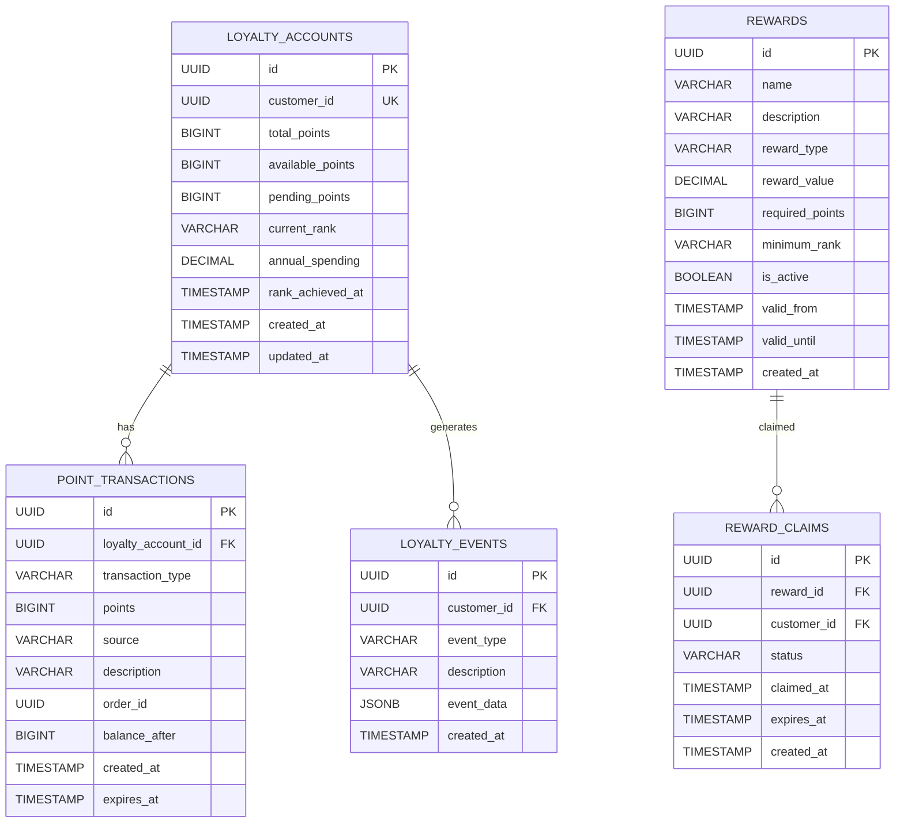

# Points/Loyalty Service Detailed Design Document

## Table of Contents

1. [Overview](#overview)
2. [Technical Specifications](#technical-specifications)
3. [Architecture Design](#architecture-design)
4. [API Design](#api-design)
5. [Database Design](#database-design)
6. [Points Management Design](#points-management-design)
7. [Loyalty Program Design](#loyalty-program-design)
8. [Error Handling](#error-handling)
9. [Test Design](#test-design)
10. [Local Development Environment](#local-development-environment)
11. [Production Deployment](#production-deployment)
12. [Monitoring and Operations](#monitoring-operations)
13. [Incident Response](#incident-response)

## Overview

### Service Summary

The Points/Loyalty Service is a microservice responsible for the points and loyalty functionality of the ski equipment sales shop site. It provides features such as earning, spending, and managing points, operating the loyalty program, and managing customer ranks.

### Key Responsibilities

- **Points Management**: Earning, spending, and balance management of points.
- **Loyalty Program**: Customer rank and benefits management.
- **Points Exchange**: Exchanging points for products and coupons.
- **Rank-Up Management**: Rank determination and promotion based on purchase history.
- **Benefit Distribution**: Automatic distribution of rank and event benefits.
- **Reporting**: Points and loyalty analysis reports.

### Business Value

- **Customer Acquisition**: Attracting new customers with a points system.
- **Customer Retention**: Promoting repeat business through a loyalty program.
- **Increased Sales**: Increasing average purchase value through rank benefits.
- **Customer Satisfaction**: A system where continued use leads to increased benefits.

## Technical Specifications

### Technology Stack

| Technology Area | Technology/Library | Version | Purpose |
|---|---|---|---|
| **Runtime** | OpenJDK | 21 LTS | Java execution environment |
| **Framework** | Jakarta EE | 11 | Enterprise framework |
| **Application Server** | WildFly | 31.0.1 | Jakarta EE application server |
| **Persistence** | Jakarta Persistence (JPA) | 3.2 | ORM |
| **Data Access** | Jakarta Data | 1.0 | Repository abstraction |
| **REST API** | Jakarta REST (JAX-RS) | 4.0 | RESTful Web Services |
| **CDI** | Jakarta CDI | 4.1 | Dependency injection and management |
| **Validation** | Jakarta Validation | 3.1 | Bean Validation |
| **JSON Processing** | Jakarta JSON-P | 2.1 | JSON processing |
| **Database** | PostgreSQL | 16 | Primary database |
| **Cache** | Redis | 7.2 | Points cache |
| **Message Queue** | Apache Kafka | 3.7 | Points event processing |
| **Monitoring** | MicroProfile Metrics | 5.1 | Metrics collection |
| **Tracing** | MicroProfile OpenTelemetry | 2.0 | Distributed tracing |
| **Health Check** | MicroProfile Health | 4.0 | Health checks |
| **Configuration** | MicroProfile Config | 3.1 | Configuration management |
| **HTTP Client** | MicroProfile Rest Client | 4.0 | External API integration |

### Excluded Technologies

- **Lombok**: Not used in order to leverage Jakarta EE 11's Record classes and modern Java features.

### Java 21 LTS Features Utilized

- **Virtual Threads**: High-concurrency points processing.
- **Record Classes**: Points data structures.
- **Pattern Matching**: Rank determination logic.
- **Text Blocks**: Complex SQL definitions.
- **Sealed Classes**: Type safety for points events.

## Architecture Design

### System Architecture Diagram


### Domain Model Design

```java
// Point Account Entity
@Entity
@Table(name = "point_accounts")
public class PointAccount {
    
    @Id
    @GeneratedValue(strategy = GenerationType.UUID)
    private UUID id;
    
    @Column(name = "customer_id", unique = true, nullable = false)
    private UUID customerId;
    
    @Column(name = "total_points", nullable = false)
    private Long totalPoints;
    
    @Column(name = "available_points", nullable = false)
    private Long availablePoints;
    
    @Column(name = "pending_points", nullable = false)
    private Long pendingPoints;
    
    @Column(name = "expired_points", nullable = false)
    private Long expiredPoints;
    
    @Column(name = "lifetime_earned_points", nullable = false)
    private Long lifetimeEarnedPoints;
    
    @Column(name = "lifetime_spent_points", nullable = false)
    private Long lifetimeSpentPoints;
    
    @Column(name = "created_at", nullable = false)
    private LocalDateTime createdAt;
    
    @Column(name = "updated_at")
    private LocalDateTime updatedAt;
    
    // Related Entities
    @OneToMany(mappedBy = "pointAccount", cascade = CascadeType.ALL, fetch = FetchType.LAZY)
    private List<PointTransaction> transactions = new ArrayList<>();
    
    @OneToOne(mappedBy = "pointAccount", cascade = CascadeType.ALL, fetch = FetchType.LAZY)
    private LoyaltyStatus loyaltyStatus;
    
    // Business Logic
    public void earnPoints(long points, String source, String description) {
        this.totalPoints += points;
        this.availablePoints += points;
        this.lifetimeEarnedPoints += points;
        this.updatedAt = LocalDateTime.now();
        
        var transaction = new PointTransaction();
        transaction.setPointAccount(this);
        transaction.setTransactionType(PointTransactionType.EARN);
        transaction.setPoints(points);
        transaction.setSource(source);
        transaction.setDescription(description);
        transaction.setCreatedAt(LocalDateTime.now());
        
        this.transactions.add(transaction);
    }
    
    public boolean spendPoints(long points, String purpose, String description) {
        if (this.availablePoints < points) {
            return false;
        }
        
        this.availablePoints -= points;
        this.lifetimeSpentPoints += points;
        this.updatedAt = LocalDateTime.now();
        
        var transaction = new PointTransaction();
        transaction.setPointAccount(this);
        transaction.setTransactionType(PointTransactionType.SPEND);
        transaction.setPoints(-points);
        transaction.setSource(purpose);
        transaction.setDescription(description);
        transaction.setCreatedAt(LocalDateTime.now());
        
        this.transactions.add(transaction);
        return true;
    }
    
    public void expirePoints(long points) {
        this.availablePoints -= points;
        this.expiredPoints += points;
        this.updatedAt = LocalDateTime.now();
        
        var transaction = new PointTransaction();
        transaction.setPointAccount(this);
        transaction.setTransactionType(PointTransactionType.EXPIRE);
        transaction.setPoints(-points);
        transaction.setSource("SYSTEM");
        transaction.setDescription("Points expired");
        transaction.setCreatedAt(LocalDateTime.now());
        
        this.transactions.add(transaction);
    }
    
    public long getPointsExpiringSoon(LocalDateTime cutoffDate) {
        return transactions.stream()
            .filter(t -> t.getTransactionType() == PointTransactionType.EARN)
            .filter(t -> t.getExpiresAt() != null)
            .filter(t -> t.getExpiresAt().isBefore(cutoffDate))
            .filter(t -> !t.isExpired())
            .mapToLong(PointTransaction::getPoints)
            .sum();
    }
}

// Point Transaction History Entity
@Entity
@Table(name = "point_transactions")
public class PointTransaction {
    
    @Id
    @GeneratedValue(strategy = GenerationType.UUID)
    private UUID id;
    
    @ManyToOne(fetch = FetchType.LAZY)
    @JoinColumn(name = "point_account_id", nullable = false)
    private PointAccount pointAccount;
    
    @Enumerated(EnumType.STRING)
    @Column(name = "transaction_type", nullable = false)
    private PointTransactionType transactionType;
    
    @Column(name = "points", nullable = false)
    private Long points;
    
    @Column(name = "source", nullable = false)
    private String source;
    
    @Column(name = "description")
    private String description;
    
    @Column(name = "reference_id")
    private UUID referenceId;
    
    @Column(name = "expires_at")
    private LocalDateTime expiresAt;
    
    @Column(name = "is_expired", nullable = false)
    private Boolean isExpired = false;
    
    @Column(name = "created_at", nullable = false)
    private LocalDateTime createdAt;
    
    public boolean isExpirable() {
        return transactionType == PointTransactionType.EARN && expiresAt != null;
    }
    
    public boolean isExpiringSoon(LocalDateTime cutoffDate) {
        return isExpirable() && !isExpired && expiresAt.isBefore(cutoffDate);
    }
    
    public void markAsExpired() {
        this.isExpired = true;
    }
}

// Loyalty Status Entity
@Entity
@Table(name = "loyalty_status")
public class LoyaltyStatus {
    
    @Id
    @GeneratedValue(strategy = GenerationType.UUID)
    private UUID id;
    
    @OneToOne(fetch = FetchType.LAZY)
    @JoinColumn(name = "point_account_id", nullable = false)
    private PointAccount pointAccount;
    
    @Column(name = "customer_id", nullable = false)
    private UUID customerId;
    
    @Enumerated(EnumType.STRING)
    @Column(name = "current_rank", nullable = false)
    private LoyaltyRank currentRank;
    
    @Enumerated(EnumType.STRING)
    @Column(name = "next_rank")
    private LoyaltyRank nextRank;
    
    @Column(name = "points_to_next_rank")
    private Long pointsToNextRank;
    
    @Column(name = "rank_achieved_at")
    private LocalDateTime rankAchievedAt;
    
    @Column(name = "total_purchases", nullable = false)
    private Long totalPurchases = 0L;
    
    @Column(name = "total_purchase_amount", precision = 12, scale = 2, nullable = false)
    private BigDecimal totalPurchaseAmount = BigDecimal.ZERO;
    
    @Column(name = "annual_purchases", nullable = false)
    private Long annualPurchases = 0L;
    
    @Column(name = "annual_purchase_amount", precision = 12, scale = 2, nullable = false)
    private BigDecimal annualPurchaseAmount = BigDecimal.ZERO;
    
    @Column(name = "membership_start_date", nullable = false)
    private LocalDate membershipStartDate;
    
    @Column(name = "created_at", nullable = false)
    private LocalDateTime createdAt;
    
    @Column(name = "updated_at")
    private LocalDateTime updatedAt;
    
    // Related Entities
    @OneToMany(mappedBy = "loyaltyStatus", cascade = CascadeType.ALL, fetch = FetchType.LAZY)
    private List<LoyaltyEvent> loyaltyEvents = new ArrayList<>();
    
    @OneToMany(mappedBy = "loyaltyStatus", cascade = CascadeType.ALL, fetch = FetchType.LAZY)
    private List<RewardGrant> rewardGrants = new ArrayList<>();
    
    // Business Logic
    public void recordPurchase(BigDecimal purchaseAmount) {
        this.totalPurchases++;
        this.totalPurchaseAmount = this.totalPurchaseAmount.add(purchaseAmount);
        this.annualPurchases++;
        this.annualPurchaseAmount = this.annualPurchaseAmount.add(purchaseAmount);
        this.updatedAt = LocalDateTime.now();
    }
    
    public boolean shouldUpgradeRank() {
        if (nextRank == null) {
            return false;
        }
        
        return switch (nextRank) {
            case SILVER -> totalPurchaseAmount.compareTo(LoyaltyRank.SILVER.getMinPurchaseAmount()) >= 0
                || totalPurchases >= LoyaltyRank.SILVER.getMinPurchaseCount();
            case GOLD -> totalPurchaseAmount.compareTo(LoyaltyRank.GOLD.getMinPurchaseAmount()) >= 0
                || totalPurchases >= LoyaltyRank.GOLD.getMinPurchaseCount();
            case PLATINUM -> totalPurchaseAmount.compareTo(LoyaltyRank.PLATINUM.getMinPurchaseAmount()) >= 0
                || totalPurchases >= LoyaltyRank.PLATINUM.getMinPurchaseCount();
            case DIAMOND -> totalPurchaseAmount.compareTo(LoyaltyRank.DIAMOND.getMinPurchaseAmount()) >= 0
                || totalPurchases >= LoyaltyRank.DIAMOND.getMinPurchaseCount();
            default -> false;
        };
    }
    
    public void upgradeRank(LoyaltyRank newRank) {
        var previousRank = this.currentRank;
        this.currentRank = newRank;
        this.nextRank = newRank.getNextRank();
        this.rankAchievedAt = LocalDateTime.now();
        this.updatedAt = LocalDateTime.now();
        
        // Record rank-up event
        var event = new LoyaltyEvent();
        event.setLoyaltyStatus(this);
        event.setEventType(LoyaltyEventType.RANK_UP);
        event.setFromRank(previousRank);
        event.setToRank(newRank);
        event.setCreatedAt(LocalDateTime.now());
        
        this.loyaltyEvents.add(event);
        
        updatePointsToNextRank();
    }
    
    public void resetAnnualStats() {
        this.annualPurchases = 0L;
        this.annualPurchaseAmount = BigDecimal.ZERO;
        this.updatedAt = LocalDateTime.now();
    }
    
    private void updatePointsToNextRank() {
        if (nextRank != null) {
            var currentPoints = pointAccount.getLifetimeEarnedPoints();
            var requiredPoints = nextRank.getMinPoints();
            this.pointsToNextRank = Math.max(0, requiredPoints - currentPoints);
        } else {
            this.pointsToNextRank = 0L;
        }
    }
    
    public BigDecimal getDiscountRate() {
        return currentRank.getDiscountRate();
    }
    
    public Double getPointsMultiplier() {
        return currentRank.getPointsMultiplier();
    }
}

// Loyalty Event Entity
@Entity
@Table(name = "loyalty_events")
public class LoyaltyEvent {
    
    @Id
    @GeneratedValue(strategy = GenerationType.UUID)
    private UUID id;
    
    @ManyToOne(fetch = FetchType.LAZY)
    @JoinColumn(name = "loyalty_status_id", nullable = false)
    private LoyaltyStatus loyaltyStatus;
    
    @Enumerated(EnumType.STRING)
    @Column(name = "event_type", nullable = false)
    private LoyaltyEventType eventType;
    
    @Enumerated(EnumType.STRING)
    @Column(name = "from_rank")
    private LoyaltyRank fromRank;
    
    @Enumerated(EnumType.STRING)
    @Column(name = "to_rank")
    private LoyaltyRank toRank;
    
    @Column(name = "description")
    private String description;
    
    @Column(name = "metadata", columnDefinition = "JSONB")
    private String metadata;
    
    @Column(name = "created_at", nullable = false)
    private LocalDateTime createdAt;
}

// Reward Grant Entity
@Entity
@Table(name = "reward_grants")
public class RewardGrant {
    
    @Id
    @GeneratedValue(strategy = GenerationType.UUID)
    private UUID id;
    
    @ManyToOne(fetch = FetchType.LAZY)
    @JoinColumn(name = "loyalty_status_id", nullable = false)
    private LoyaltyStatus loyaltyStatus;
    
    @Column(name = "customer_id", nullable = false)
    private UUID customerId;
    
    @Enumerated(EnumType.STRING)
    @Column(name = "reward_type", nullable = false)
    private RewardType rewardType;
    
    @Column(name = "reward_value", precision = 12, scale = 2)
    private BigDecimal rewardValue;
    
    @Column(name = "reward_reference")
    private String rewardReference;
    
    @Column(name = "description", nullable = false)
    private String description;
    
    @Enumerated(EnumType.STRING)
    @Column(name = "status", nullable = false)
    private RewardStatus status;
    
    @Column(name = "granted_at", nullable = false)
    private LocalDateTime grantedAt;
    
    @Column(name = "claimed_at")
    private LocalDateTime claimedAt;
    
    @Column(name = "expires_at")
    private LocalDateTime expiresAt;
    
    public boolean isExpired() {
        return expiresAt != null && LocalDateTime.now().isAfter(expiresAt);
    }
    
    public boolean canBeClaimed() {
        return status == RewardStatus.GRANTED && !isExpired();
    }
    
    public void claim() {
        if (!canBeClaimed()) {
            throw new IllegalStateException("Reward cannot be claimed");
        }
        this.status = RewardStatus.CLAIMED;
        this.claimedAt = LocalDateTime.now();
    }
}

// Enums
public enum PointTransactionType {
    EARN("Earn"),
    SPEND("Spend"),
    EXPIRE("Expire"),
    ADJUST("Adjust"),
    REFUND("Refund");
    
    private final String description;
    
    PointTransactionType(String description) {
        this.description = description;
    }
    
    public String getDescription() {
        return description;
    }
}

public enum LoyaltyRank {
    BRONZE("Bronze", 0L, BigDecimal.ZERO, 0L, 1.0, BigDecimal.ZERO),
    SILVER("Silver", 1000L, new BigDecimal("50000"), 5L, 1.2, new BigDecimal("0.03")),
    GOLD("Gold", 3000L, new BigDecimal("150000"), 15L, 1.5, new BigDecimal("0.05")),
    PLATINUM("Platinum", 6000L, new BigDecimal("300000"), 30L, 2.0, new BigDecimal("0.08")),
    DIAMOND("Diamond", 12000L, new BigDecimal("600000"), 60L, 3.0, new BigDecimal("0.10"));
    
    private final String displayName;
    private final Long minPoints;
    private final BigDecimal minPurchaseAmount;
    private final Long minPurchaseCount;
    private final Double pointsMultiplier;
    private final BigDecimal discountRate;
    
    LoyaltyRank(String displayName, Long minPoints, BigDecimal minPurchaseAmount, 
                Long minPurchaseCount, Double pointsMultiplier, BigDecimal discountRate) {
        this.displayName = displayName;
        this.minPoints = minPoints;
        this.minPurchaseAmount = minPurchaseAmount;
        this.minPurchaseCount = minPurchaseCount;
        this.pointsMultiplier = pointsMultiplier;
        this.discountRate = discountRate;
    }
    
    public String getDisplayName() { return displayName; }
    public Long getMinPoints() { return minPoints; }
    public BigDecimal getMinPurchaseAmount() { return minPurchaseAmount; }
    public Long getMinPurchaseCount() { return minPurchaseCount; }
    public Double getPointsMultiplier() { return pointsMultiplier; }
    public BigDecimal getDiscountRate() { return discountRate; }
    
    public LoyaltyRank getNextRank() {
        var ranks = values();
        var currentIndex = this.ordinal();
        return currentIndex < ranks.length - 1 ? ranks[currentIndex + 1] : null;
    }
    
    public boolean canUpgradeTo(LoyaltyRank targetRank) {
        return targetRank.ordinal() == this.ordinal() + 1;
    }
}

public enum LoyaltyEventType {
    ENROLLMENT("Enrollment"),
    RANK_UP("Rank Up"),
    RANK_DOWN("Rank Down"),
    SPECIAL_PROMOTION("Special Promotion"),
    ANNIVERSARY("Anniversary"),
    BONUS_AWARD("Bonus Award");
    
    private final String description;
    
    LoyaltyEventType(String description) {
        this.description = description;
    }
    
    public String getDescription() {
        return description;
    }
}

public enum RewardType {
    POINTS("Points"),
    COUPON("Coupon"),
    FREE_SHIPPING("Free Shipping"),
    DISCOUNT("Discount"),
    EXCLUSIVE_ACCESS("Exclusive Access"),
    BIRTHDAY_BONUS("Birthday Bonus");
    
    private final String description;
    
    RewardType(String description) {
        this.description = description;
    }
    
    public String getDescription() {
        return description;
    }
}

public enum RewardStatus {
    GRANTED("Granted"),
    CLAIMED("Claimed"),
    EXPIRED("Expired"),
    CANCELLED("Cancelled");
    
    private final String description;
    
    RewardStatus(String description) {
        this.description = description;
    }
    
    public String getDescription() {
        return description;
    }
}

// Points/Loyalty CQRS Commands
public sealed interface PointsLoyaltyCommand permits EarnPointsCommand, SpendPointsCommand,
        TransferPointsCommand, ClaimRewardCommand, UpdateLoyaltyRankCommand, 
        CreateRewardCommand, ExpirePointsCommand {}

public record EarnPointsCommand(
    UUID customerId,
    Long points,
    String source,
    String description,
    UUID orderId,
    LocalDateTime earnedAt
) implements PointsLoyaltyCommand {}

public record SpendPointsCommand(
    UUID customerId,
    Long points,
    String purpose,
    String description,
    UUID orderId,
    LocalDateTime spentAt
) implements PointsLoyaltyCommand {}

public record TransferPointsCommand(
    UUID fromCustomerId,
    UUID toCustomerId,
    Long points,
    String reason
) implements PointsLoyaltyCommand {}

public record ClaimRewardCommand(
    UUID customerId,
    UUID rewardId,
    LocalDateTime claimedAt
) implements PointsLoyaltyCommand {}

public record UpdateLoyaltyRankCommand(
    UUID customerId,
    LoyaltyRank newRank,
    String reason
) implements PointsLoyaltyCommand {}

public record CreateRewardCommand(
    String name,
    String description,
    RewardType rewardType,
    BigDecimal rewardValue,
    Long requiredPoints,
    LoyaltyRank minimumRank,
    LocalDateTime validFrom,
    LocalDateTime validUntil
) implements PointsLoyaltyCommand {}

public record ExpirePointsCommand(
    UUID customerId,
    Long points,
    String reason
) implements PointsLoyaltyCommand {}

// Points/Loyalty CQRS Queries
public sealed interface PointsLoyaltyQuery permits GetPointsBalanceQuery, GetPointsHistoryQuery,
        GetLoyaltyStatusQuery, GetAvailableRewardsQuery, GetPointsStatisticsQuery,
        GetLoyaltyTrendQuery, GetRankBenefitsQuery {}

public record GetPointsBalanceQuery(
    UUID customerId
) implements PointsLoyaltyQuery {}

public record GetPointsHistoryQuery(
    UUID customerId,
    LocalDateTime fromDate,
    LocalDateTime toDate,
    Set<TransactionType> transactionTypes,
    int page,
    int size
) implements PointsLoyaltyQuery {}

public record GetLoyaltyStatusQuery(
    UUID customerId
) implements PointsLoyaltyQuery {}

public record GetAvailableRewardsQuery(
    UUID customerId,
    LoyaltyRank customerRank,
    Long availablePoints
) implements PointsLoyaltyQuery {}

public record GetPointsStatisticsQuery(
    LocalDateTime fromDate,
    LocalDateTime toDate,
    String groupBy
) implements PointsLoyaltyQuery {}

public record GetLoyaltyTrendQuery(
    UUID customerId,
    int months
) implements PointsLoyaltyQuery {}

public record GetRankBenefitsQuery(
    LoyaltyRank rank
) implements PointsLoyaltyQuery {}

// Points/Loyalty Projections
public record PointsBalanceProjection(
    UUID customerId,
    Long totalPoints,
    Long availablePoints,
    Long pendingPoints,
    Long expiredPoints,
    LocalDateTime lastActivity
) {}

public record PointsHistoryProjection(
    UUID transactionId,
    TransactionType transactionType,
    Long points,
    String source,
    String description,
    LocalDateTime timestamp,
    Long balanceAfter
) {}

public record LoyaltyStatusProjection(
    UUID customerId,
    LoyaltyRank currentRank,
    LoyaltyRank nextRank,
    Long pointsToNextRank,
    BigDecimal annualSpending,
    LocalDateTime rankAchievedAt,
    List<String> currentBenefits
) {}

public record RewardProjection(
    UUID rewardId,
    String name,
    String description,
    RewardType rewardType,
    BigDecimal rewardValue,
    Long requiredPoints,
    LoyaltyRank minimumRank,
    boolean isAvailable,
    LocalDateTime validUntil
) {}

public record PointsStatisticsProjection(
    long totalPointsEarned,
    long totalPointsSpent,
    long totalPointsExpired,
    long activeCustomers,
    Map<String, Long> pointsSourceDistribution,
    Map<LoyaltyRank, Long> rankDistribution
) {}

// Points/Loyalty Service with CQRS
@ApplicationScoped
@Transactional
public class PointsLoyaltyService {
    
    private static final Logger logger = LoggerFactory.getLogger(PointsLoyaltyService.class);
    
    @Inject
    private PointAccountRepository pointAccountRepository;
    
    @Inject
    private PointTransactionRepository transactionRepository;
    
    @Inject
    private LoyaltyStatusRepository loyaltyStatusRepository;
    
    @Inject
    private RewardRepository rewardRepository;
    
    @Inject
    private PointsLoyaltyEventPublisher eventPublisher;
    
    @Inject
    private RankCalculationEngine rankEngine;
    
    @Inject
    private PointsLoyaltyQueryService queryService;
    
    // Command Handlers
    @CommandHandler
    public void handle(EarnPointsCommand command) {
        var pointAccount = getOrCreatePointAccount(command.customerId());
        
        // Grant points
        pointAccount.earnPoints(command.points(), command.source(), command.description());
        pointAccountRepository.save(pointAccount);
        
        // Record transaction
        var transaction = new PointTransaction(
            pointAccount,
            TransactionType.EARN,
            command.points(),
            command.source(),
            command.description(),
            command.orderId(),
            command.earnedAt()
        );
        transactionRepository.save(transaction);
        
        // Determine rank
        var loyaltyStatus = loyaltyStatusRepository.findByCustomerId(command.customerId())
            .orElse(createInitialLoyaltyStatus(command.customerId()));
        
        var newRank = rankEngine.calculateRank(pointAccount.getLifetimeEarnedPoints(), 
            loyaltyStatus.getAnnualSpending());
        
        if (newRank != loyaltyStatus.getCurrentRank()) {
            loyaltyStatus.updateRank(newRank);
            loyaltyStatusRepository.save(loyaltyStatus);
            
            eventPublisher.publish(new RankUpEvent(
                command.customerId(),
                loyaltyStatus.getCurrentRank(),
                newRank,
                LocalDateTime.now()
            ));
        }
        
        // Publish event
        eventPublisher.publish(new PointsEarnedEvent(
            command.customerId(),
            command.points(),
            command.source(),
            command.description(),
            LocalDateTime.now()
        ));
    }
    
    @CommandHandler
    public void handle(SpendPointsCommand command) {
        var pointAccount = pointAccountRepository.findByCustomerId(command.customerId())
            .orElseThrow(() -> new PointAccountNotFoundException("Point account not found"));
        
        if (pointAccount.getAvailablePoints() < command.points()) {
            throw new InsufficientPointsException("Insufficient points available");
        }
        
        // Spend points
        pointAccount.spendPoints(command.points(), command.purpose(), command.description());
        pointAccountRepository.save(pointAccount);
        
        // Record transaction
        var transaction = new PointTransaction(
            pointAccount,
            TransactionType.SPEND,
            -command.points(),
            command.purpose(),
            command.description(),
            command.orderId(),
            command.spentAt()
        );
        transactionRepository.save(transaction);
        
        // Publish event
        eventPublisher.publish(new PointsSpentEvent(
            command.customerId(),
            command.points(),
            command.purpose(),
            command.description(),
            LocalDateTime.now()
        ));
    }
    
    @CommandHandler
    public void handle(ClaimRewardCommand command) {
        var reward = rewardRepository.findById(command.rewardId())
            .orElseThrow(() -> new RewardNotFoundException("Reward not found"));
        
        var pointAccount = pointAccountRepository.findByCustomerId(command.customerId())
            .orElseThrow(() -> new PointAccountNotFoundException("Point account not found"));
        
        var loyaltyStatus = loyaltyStatusRepository.findByCustomerId(command.customerId())
            .orElseThrow(() -> new LoyaltyStatusNotFoundException("Loyalty status not found"));
        
        // Check reward claim conditions
        if (!canClaimReward(reward, pointAccount, loyaltyStatus)) {
            throw new RewardClaimException("Cannot claim this reward");
        }
        
        // Spend points
        if (reward.getRequiredPoints() > 0) {
            pointAccount.spendPoints(reward.getRequiredPoints(), "REWARD_CLAIM", 
                "Claimed reward: " + reward.getName());
            pointAccountRepository.save(pointAccount);
        }
        
        // Record reward claim
        var claim = new RewardClaim(
            reward.getId(),
            command.customerId(),
            reward.getRewardType(),
            reward.getRewardValue(),
            command.claimedAt()
        );
        rewardClaimRepository.save(claim);
        
        // Publish event
        eventPublisher.publish(new RewardClaimedEvent(
            command.customerId(),
            command.rewardId(),
            reward.getRewardType(),
            reward.getRewardValue(),
            LocalDateTime.now()
        ));
    }
    
    @CommandHandler
    public void handle(UpdateLoyaltyRankCommand command) {
        var loyaltyStatus = loyaltyStatusRepository.findByCustomerId(command.customerId())
            .orElseThrow(() -> new LoyaltyStatusNotFoundException("Loyalty status not found"));
        
        var previousRank = loyaltyStatus.getCurrentRank();
        loyaltyStatus.updateRank(command.newRank());
        loyaltyStatusRepository.save(loyaltyStatus);
        
        eventPublisher.publish(new RankUpEvent(
            command.customerId(),
            previousRank,
            command.newRank(),
            LocalDateTime.now()
        ));
    }
    
    private PointAccount getOrCreatePointAccount(UUID customerId) {
        return pointAccountRepository.findByCustomerId(customerId)
            .orElseGet(() -> {
                var newAccount = new PointAccount(customerId);
                return pointAccountRepository.save(newAccount);
            });
    }
    
    private LoyaltyStatus createInitialLoyaltyStatus(UUID customerId) {
        var loyaltyStatus = new LoyaltyStatus(customerId, LoyaltyRank.BRONZE);
        return loyaltyStatusRepository.save(loyaltyStatus);
    }
    
    private boolean canClaimReward(Reward reward, PointAccount pointAccount, LoyaltyStatus loyaltyStatus) {
        return pointAccount.getAvailablePoints() >= reward.getRequiredPoints() &&
               loyaltyStatus.getCurrentRank().ordinal() >= reward.getMinimumRank().ordinal() &&
               reward.isActive() &&
               (reward.getValidUntil() == null || reward.getValidUntil().isAfter(LocalDateTime.now()));
    }
}

// Points/Loyalty Query Service
@ApplicationScoped
public class PointsLoyaltyQueryService {
    
    @Inject
    private PointAccountRepository pointAccountRepository;
    
    @Inject
    private PointTransactionRepository transactionRepository;
    
    @Inject
    private LoyaltyStatusRepository loyaltyStatusRepository;
    
    @Inject
    private RewardRepository rewardRepository;
    
    @QueryHandler
    public Optional<PointsBalanceProjection> handle(GetPointsBalanceQuery query) {
        return pointAccountRepository.findByCustomerId(query.customerId())
            .map(this::toPointsBalanceProjection);
    }
    
    @QueryHandler
    public List<PointsHistoryProjection> handle(GetPointsHistoryQuery query) {
        return transactionRepository.findByCustomerIdAndDateRange(
            query.customerId(),
            query.fromDate(),
            query.toDate(),
            query.transactionTypes(),
            query.page(),
            query.size()
        ).stream()
        .map(this::toPointsHistoryProjection)
        .toList();
    }
    
    @QueryHandler
    public Optional<LoyaltyStatusProjection> handle(GetLoyaltyStatusQuery query) {
        return loyaltyStatusRepository.findByCustomerId(query.customerId())
            .map(this::toLoyaltyStatusProjection);
    }
    
    @QueryHandler
    public List<RewardProjection> handle(GetAvailableRewardsQuery query) {
        return rewardRepository.findAvailableRewards(
            query.customerRank(),
            query.availablePoints()
        ).stream()
        .map(this::toRewardProjection)
        .toList();
    }
    
    @QueryHandler
    public PointsStatisticsProjection handle(GetPointsStatisticsQuery query) {
        var stats = transactionRepository.getStatistics(query.fromDate(), query.toDate());
        
        return new PointsStatisticsProjection(
            stats.getTotalPointsEarned(),
            stats.getTotalPointsSpent(),
            stats.getTotalPointsExpired(),
            stats.getActiveCustomers(),
            stats.getPointsSourceDistribution(),
            stats.getRankDistribution()
        );
    }
    
    private PointsBalanceProjection toPointsBalanceProjection(PointAccount account) {
        return new PointsBalanceProjection(
            account.getCustomerId(),
            account.getTotalPoints(),
            account.getAvailablePoints(),
            account.getPendingPoints(),
            account.getExpiredPoints(),
            account.getUpdatedAt()
        );
    }
    
    private PointsHistoryProjection toPointsHistoryProjection(PointTransaction transaction) {
        return new PointsHistoryProjection(
            transaction.getId(),
            transaction.getTransactionType(),
            transaction.getPoints(),
            transaction.getSource(),
            transaction.getDescription(),
            transaction.getCreatedAt(),
            transaction.getBalanceAfter()
        );
    }
    
    private LoyaltyStatusProjection toLoyaltyStatusProjection(LoyaltyStatus status) {
        var nextRank = getNextRank(status.getCurrentRank());
        var pointsToNextRank = calculatePointsToNextRank(status, nextRank);
        
        return new LoyaltyStatusProjection(
            status.getCustomerId(),
            status.getCurrentRank(),
            nextRank,
            pointsToNextRank,
            status.getAnnualSpending(),
            status.getRankAchievedAt(),
            getBenefitsForRank(status.getCurrentRank())
        );
    }
    
    private RewardProjection toRewardProjection(Reward reward) {
        return new RewardProjection(
            reward.getId(),
            reward.getName(),
            reward.getDescription(),
            reward.getRewardType(),
            reward.getRewardValue(),
            reward.getRequiredPoints(),
            reward.getMinimumRank(),
            reward.isActive(),
            reward.getValidUntil()
        );
    }
    
    private LoyaltyRank getNextRank(LoyaltyRank currentRank) {
        var ranks = LoyaltyRank.values();
        var currentIndex = currentRank.ordinal();
        return currentIndex < ranks.length - 1 ? ranks[currentIndex + 1] : null;
    }
    
    private Long calculatePointsToNextRank(LoyaltyStatus status, LoyaltyRank nextRank) {
        if (nextRank == null) return 0L;
        return rankEngine.getPointsRequiredForRank(nextRank) - status.getTotalEarnedPoints();
    }
    
    private List<String> getBenefitsForRank(LoyaltyRank rank) {
        return switch (rank) {
            case BRONZE -> List.of("Basic point rewards", "Birthday benefit");
            case SILVER -> List.of("1.5x point rewards", "Free shipping", "Early access to sales");
            case GOLD -> List.of("2x point rewards", "Dedicated support", "Access to exclusive products");
            case PLATINUM -> List.of("3x point rewards", "Concierge service", "VIP event invitations");
            case DIAMOND -> List.of("5x point rewards", "Personal advisor", "Top priority support");
        };
    }
}

// Points/Loyalty Service Saga Patterns
@ApplicationScoped
public class PointsEarningSaga {
    
    private static final Logger logger = LoggerFactory.getLogger(PointsEarningSaga.class);
    
    @Inject
    private PointsLoyaltyService pointsService;
    
    @Inject
    private EmailService emailService;
    
    @Inject
    private NotificationService notificationService;
    
    @Inject
    private AuditService auditService;
    
    private final ExecutorService executor = Executors.newVirtualThreadPerTaskExecutor();
    
    @SagaOrchestrationStart
    @EventHandler
    public void handleOrderCompletedEvent(OrderCompletedEvent event) {
        var sagaId = UUID.randomUUID();
        logger.info("Starting Points Earning Saga for order: {} (Saga: {})", 
            event.orderId(), sagaId);
        
        CompletableFuture.runAsync(() -> {
            try {
                // Step 1: Calculate points
                var pointsToEarn = calculatePointsForOrder(event);
                
                // Step 2: Grant points
                var earnCommand = new EarnPointsCommand(
                    event.customerId(),
                    pointsToEarn,
                    "ORDER_COMPLETION",
                    "Order completion points for order: " + event.orderId(),
                    event.orderId(),
                    LocalDateTime.now()
                );
                
                pointsService.handle(earnCommand);
                
                // Step 3: Determine bonus points
                handleBonusPointsIfEligible(event, pointsToEarn);
                
                // Step 4: Send notification
                sendEarningNotification(event.customerId(), pointsToEarn);
                
                // Step 5: Record audit log
                auditService.recordPointsEarning(sagaId, event.customerId(), 
                    pointsToEarn, event.orderId());
                
                logger.info("Points Earning Saga completed successfully (Saga: {})", sagaId);
                
            } catch (Exception e) {
                logger.error("Points Earning Saga failed (Saga: {})", sagaId, e);
                handlePointsEarningFailure(sagaId, event, e);
            }
        }, executor);
    }
    
    private Long calculatePointsForOrder(OrderCompletedEvent event) {
        var basePoints = (event.totalAmount().longValue() / 100) * 1; // 1 point per 100 yen
        
        // Day of week bonus
        var dayOfWeek = LocalDateTime.now().getDayOfWeek();
        var dayMultiplier = switch (dayOfWeek) {
            case SATURDAY, SUNDAY -> 2.0;
            default -> 1.0;
        };
        
        return (long) (basePoints * dayMultiplier);
    }
    
    private void handleBonusPointsIfEligible(OrderCompletedEvent event, Long basePoints) {
        // First-time purchase bonus
        if (isFirstTimeCustomer(event.customerId())) {
            var bonusCommand = new EarnPointsCommand(
                event.customerId(),
                500L, // First-time purchase bonus
                "FIRST_ORDER_BONUS",
                "First order bonus points",
                event.orderId(),
                LocalDateTime.now()
            );
            pointsService.handle(bonusCommand);
        }
        
        // High-value purchase bonus
        if (event.totalAmount().compareTo(BigDecimal.valueOf(10000)) >= 0) {
            var bonusPoints = event.totalAmount().longValue() / 1000; // 1 bonus point per 1000 yen
            var bonusCommand = new EarnPointsCommand(
                event.customerId(),
                bonusPoints,
                "HIGH_VALUE_ORDER_BONUS",
                "High value order bonus points",
                event.orderId(),
                LocalDateTime.now()
            );
            pointsService.handle(bonusCommand);
        }
    }
    
    private void sendEarningNotification(UUID customerId, Long points) {
        try {
            var notification = new PointsEarnedNotification(
                customerId,
                points,
                "Points have been granted",
                LocalDateTime.now()
            );
            
            notificationService.sendAsync(notification);
            
        } catch (Exception e) {
            logger.warn("Failed to send points earning notification to customer: {}", 
                customerId, e);
        }
    }
    
    private void handlePointsEarningFailure(UUID sagaId, OrderCompletedEvent event, Exception error) {
        try {
            // Compensation process on failure
            auditService.recordPointsEarningFailure(sagaId, event.customerId(), 
                event.orderId(), error.getMessage());
            
            // Notify administrator
            notificationService.sendAdminAlert(
                "Points Earning Saga Failed",
                String.format("Saga: %s, Customer: %s, Order: %s, Error: %s",
                    sagaId, event.customerId(), event.orderId(), error.getMessage())
            );
            
        } catch (Exception compensationError) {
            logger.error("Failed to handle points earning saga failure", compensationError);
        }
    }
    
    private boolean isFirstTimeCustomer(UUID customerId) {
        // Simple implementation example
        return pointsService.getPointsBalance(customerId)
            .map(balance -> balance.totalPoints() == 0L)
            .orElse(true);
    }
}

@ApplicationScoped
public class RankUpSaga {
    
    private static final Logger logger = LoggerFactory.getLogger(RankUpSaga.class);
    
    @Inject
    private PointsLoyaltyService pointsService;
    
    @Inject
    private CouponService couponService;
    
    @Inject
    private EmailService emailService;
    
    @Inject
    private NotificationService notificationService;
    
    private final ExecutorService executor = Executors.newVirtualThreadPerTaskExecutor();
    
    @SagaOrchestrationStart
    @EventHandler
    public void handleRankUpEvent(RankUpEvent event) {
        var sagaId = UUID.randomUUID();
        logger.info("Starting Rank Up Saga for customer: {} to rank: {} (Saga: {})", 
            event.customerId(), event.newRank(), sagaId);
        
        CompletableFuture.runAsync(() -> {
            try {
                // Step 1: Grant rank-up benefits
                grantRankUpBenefits(event);
                
                // Step 2: Issue rank-up coupon
                issueRankUpCoupon(event);
                
                // Step 3: Send rank-up notification
                sendRankUpNotification(event);
                
                // Step 4: Activate VIP benefits (Platinum and above)
                if (event.newRank().ordinal() >= LoyaltyRank.PLATINUM.ordinal()) {
                    activateVipBenefits(event.customerId(), event.newRank());
                }
                
                // Step 5: Arrange commemorative gift (Diamond)
                if (event.newRank() == LoyaltyRank.DIAMOND) {
                    arrangeDiamondGift(event.customerId());
                }
                
                logger.info("Rank Up Saga completed successfully (Saga: {})", sagaId);
                
            } catch (Exception e) {
                logger.error("Rank Up Saga failed (Saga: {})", sagaId, e);
                handleRankUpFailure(sagaId, event, e);
            }
        }, executor);
    }
    
    private void grantRankUpBenefits(RankUpEvent event) {
        // Rank-up bonus points
        var bonusPoints = calculateRankUpBonus(event.newRank());
        
        var earnCommand = new EarnPointsCommand(
            event.customerId(),
            bonusPoints,
            "RANK_UP_BONUS",
            "Rank up bonus to " + event.newRank(),
            null,
            LocalDateTime.now()
        );
        
        pointsService.handle(earnCommand);
    }
    
    private void issueRankUpCoupon(RankUpEvent event) {
        var discountRate = calculateRankUpCouponDiscount(event.newRank());
        
        var createCouponCommand = new CreateCouponCommand(
            "RANK_UP_" + event.newRank() + "_" + UUID.randomUUID().toString().substring(0, 8),
            "Rank-Up Commemorative Coupon",
            "Congratulations on your rank up!",
            CouponType.PERCENTAGE,
            discountRate,
            null, // No minimum order amount
            BigDecimal.valueOf(10000), // Maximum discount
            LocalDateTime.now(),
            LocalDateTime.now().plusDays(30),
            Set.of(event.customerId()),
            false, // Not public
            1 // Usage limit
        );
        
        couponService.handle(createCouponCommand);
    }
    
    private void sendRankUpNotification(RankUpEvent event) {
        try {
            // Email notification
            var emailContent = createRankUpEmailContent(event);
            emailService.sendTemplateEmail(
                event.customerId(),
                "Notification of Rank Up",
                "rank-up-notification",
                emailContent
            );
            
            // Push notification
            var pushNotification = new RankUpNotification(
                event.customerId(),
                event.newRank(),
                "Congratulations! You have been promoted to " + event.newRank() + " rank!",
                LocalDateTime.now()
            );
            
            notificationService.sendAsync(pushNotification);
            
        } catch (Exception e) {
            logger.warn("Failed to send rank up notification to customer: {}", 
                event.customerId(), e);
        }
    }
    
    private void activateVipBenefits(UUID customerId, LoyaltyRank rank) {
        try {
            // Activate VIP benefits
            var vipBenefits = createVipBenefits(rank);
            
            for (var benefit : vipBenefits) {
                // Benefit activation process
                activateBenefit(customerId, benefit);
            }
            
        } catch (Exception e) {
            logger.warn("Failed to activate VIP benefits for customer: {}", customerId, e);
        }
    }
    
    private void arrangeDiamondGift(UUID customerId) {
        try {
            // Arrange Diamond member commemorative gift
            var giftRequest = new GiftRequest(
                customerId,
                "DIAMOND_WELCOME_GIFT",
                "Diamond Member Commemorative Gift Set",
                LocalDateTime.now()
            );
            
            // Request to external gift service
            giftService.arrangeGift(giftRequest);
            
        } catch (Exception e) {
            logger.warn("Failed to arrange diamond gift for customer: {}", customerId, e);
        }
    }
    
    private void handleRankUpFailure(UUID sagaId, RankUpEvent event, Exception error) {
        try {
            // Compensation process on failure
            auditService.recordRankUpFailure(sagaId, event.customerId(), 
                event.newRank(), error.getMessage());
            
            // Notify administrator
            notificationService.sendAdminAlert(
                "Rank Up Saga Failed",
                String.format("Saga: %s, Customer: %s, New Rank: %s, Error: %s",
                    sagaId, event.customerId(), event.newRank(), error.getMessage())
            );
            
        } catch (Exception compensationError) {
            logger.error("Failed to handle rank up saga failure", compensationError);
        }
    }
    
    private Long calculateRankUpBonus(LoyaltyRank rank) {
        return switch (rank) {
            case BRONZE -> 100L;
            case SILVER -> 300L;
            case GOLD -> 500L;
            case PLATINUM -> 1000L;
            case DIAMOND -> 2000L;
        };
    }
    
    private BigDecimal calculateRankUpCouponDiscount(LoyaltyRank rank) {
        return switch (rank) {
            case BRONZE -> BigDecimal.valueOf(5);
            case SILVER -> BigDecimal.valueOf(10);
            case GOLD -> BigDecimal.valueOf(15);
            case PLATINUM -> BigDecimal.valueOf(20);
            case DIAMOND -> BigDecimal.valueOf(25);
        };
    }
    
    private Map<String, Object> createRankUpEmailContent(RankUpEvent event) {
        return Map.of(
            "customerRank", event.newRank().toString(),
            "bonusPoints", calculateRankUpBonus(event.newRank()),
            "benefits", getBenefitsForRank(event.newRank()),
            "congratulationMessage", createCongratulationMessage(event.newRank())
        );
    }
    
    private List<VipBenefit> createVipBenefits(LoyaltyRank rank) {
        return switch (rank) {
            case PLATINUM -> List.of(
                new VipBenefit("DEDICATED_SUPPORT", "Dedicated Support"),
                new VipBenefit("PRIORITY_SHIPPING", "Priority Shipping"),
                new VipBenefit("EARLY_ACCESS", "Early Access to Sales")
            );
            case DIAMOND -> List.of(
                new VipBenefit("CONCIERGE_SERVICE", "Concierge Service"),
                new VipBenefit("PERSONAL_ADVISOR", "Personal Advisor"),
                new VipBenefit("VIP_EVENTS", "VIP Event Invitations"),
                new VipBenefit("MAXIMUM_PRIORITY", "Maximum Priority Support")
            );
            default -> List.of();
        };
    }
}

@ApplicationScoped
public class PointsSpendingSaga {
    
    private static final Logger logger = LoggerFactory.getLogger(PointsSpendingSaga.class);
    
    @Inject
    private PointsLoyaltyService pointsService;
    
    @Inject
    private OrderService orderService;
    
    @Inject
    private PaymentService paymentService;
    
    @Inject
    private NotificationService notificationService;
    
    private final ExecutorService executor = Executors.newVirtualThreadPerTaskExecutor();
    
    @SagaOrchestrationStart
    @EventHandler
    public void handlePointsPaymentRequest(PointsPaymentRequestEvent event) {
        var sagaId = UUID.randomUUID();
        logger.info("Starting Points Spending Saga for order: {} (Saga: {})", 
            event.orderId(), sagaId);
        
        CompletableFuture.runAsync(() -> {
            try {
                // Step 1: Check points balance
                validatePointsBalance(event);
                
                // Step 2: Temporarily hold points
                reservePoints(event);
                
                // Step 3: Process payment
                processPayment(event);
                
                // Step 4: Confirm points spending
                confirmPointsSpending(event);
                
                // Step 5: Send notification
                sendSpendingNotification(event);
                
                logger.info("Points Spending Saga completed successfully (Saga: {})", sagaId);
                
            } catch (Exception e) {
                logger.error("Points Spending Saga failed (Saga: {})", sagaId, e);
                handleSpendingFailure(sagaId, event, e);
            }
        }, executor);
    }
    
    private void validatePointsBalance(PointsPaymentRequestEvent event) {
        var balance = pointsService.getPointsBalance(event.customerId())
            .orElseThrow(() -> new PointAccountNotFoundException("Point account not found"));
        
        if (balance.availablePoints() < event.pointsToSpend()) {
            throw new InsufficientPointsException(
                String.format("Insufficient points. Available: %d, Required: %d",
                    balance.availablePoints(), event.pointsToSpend())
            );
        }
    }
    
    private void reservePoints(PointsPaymentRequestEvent event) {
        // Temporarily hold points (example implementation)
        var reserveCommand = new ReservePointsCommand(
            event.customerId(),
            event.pointsToSpend(),
            event.orderId(),
            LocalDateTime.now()
        );
        
        pointsService.handle(reserveCommand);
    }
    
    private void processPayment(PointsPaymentRequestEvent event) {
        // Process payment
        var paymentRequest = new PaymentRequest(
            event.orderId(),
            event.customerId(),
            event.pointsAmount(),
            PaymentMethod.POINTS,
            Map.of("points", event.pointsToSpend().toString())
        );
        
        paymentService.processPayment(paymentRequest);
    }
    
    private void confirmPointsSpending(PointsPaymentRequestEvent event) {
        var spendCommand = new SpendPointsCommand(
            event.customerId(),
            event.pointsToSpend(),
            "ORDER_PAYMENT",
            "Points payment for order: " + event.orderId(),
            event.orderId(),
            LocalDateTime.now()
        );
        
        pointsService.handle(spendCommand);
    }
    
    private void sendSpendingNotification(PointsPaymentRequestEvent event) {
        try {
            var notification = new PointsSpentNotification(
                event.customerId(),
                event.pointsToSpend(),
                "Payment was made with points",
                event.orderId(),
                LocalDateTime.now()
            );
            
            notificationService.sendAsync(notification);
            
        } catch (Exception e) {
            logger.warn("Failed to send points spending notification to customer: {}", 
                event.customerId(), e);
        }
    }
    
    private void handleSpendingFailure(UUID sagaId, PointsPaymentRequestEvent event, Exception error) {
        try {
            // Compensation: Release temporary hold on points
            compensatePointsReservation(event);
            
            // Cancel payment
            paymentService.cancelPayment(event.orderId());
            
            // Update order status
            orderService.updateOrderStatus(event.orderId(), OrderStatus.PAYMENT_FAILED);
            
            // Notify customer
            notificationService.sendPaymentFailureNotification(
                event.customerId(),
                event.orderId(),
                "Points payment failed"
            );
            
        } catch (Exception compensationError) {
            logger.error("Failed to compensate points spending saga failure", compensationError);
        }
    }
    
    private void compensatePointsReservation(PointsPaymentRequestEvent event) {
        try {
            var releaseCommand = new ReleasePointsReservationCommand(
                event.customerId(),
                event.pointsToSpend(),
                event.orderId(),
                LocalDateTime.now()
            );
            
            pointsService.handle(releaseCommand);
            
        } catch (Exception e) {
            logger.error("Failed to release points reservation for order: {}", 
                event.orderId(), e);
        }
    }
}

public record PointsEarnedEvent(
    UUID customerId,
    Long points,
    String source,
    String description,
    LocalDateTime timestamp
) implements PointsLoyaltyEvent {}

public record PointsSpentEvent(
    UUID customerId,
    Long points,
    String purpose,
    String description,
    LocalDateTime timestamp
) implements PointsLoyaltyEvent {}

public record PointsExpiredEvent(
    UUID customerId,
    Long expiredPoints,
    LocalDateTime timestamp
) implements PointsLoyaltyEvent {}

public record RankUpEvent(
    UUID customerId,
    LoyaltyRank fromRank,
    LoyaltyRank toRank,
    LocalDateTime timestamp
) implements PointsLoyaltyEvent {}

public record RewardGrantedEvent(
    UUID customerId,
    RewardType rewardType,
    BigDecimal rewardValue,
    String description,
    LocalDateTime timestamp
) implements PointsLoyaltyEvent {}

public record RewardClaimedEvent(
    UUID customerId,
    UUID rewardId,
    RewardType rewardType,
    LocalDateTime timestamp
) implements PointsLoyaltyEvent {}

// Exception Classes
public class LoyaltyAccountNotFoundException extends RuntimeException {
    public LoyaltyAccountNotFoundException(String message) {
        super(message);
    }
}

public class InsufficientPointsException extends RuntimeException {
    public InsufficientPointsException(String message) {
        super(message);
    }
}

public class RewardNotFoundException extends RuntimeException {
    public RewardNotFoundException(String message) {
        super(message);
    }
}

public class RewardAlreadyClaimedException extends RuntimeException {
    public RewardAlreadyClaimedException(String message) {
        super(message);
    }
}

public class RewardExpiredException extends RuntimeException {
    public RewardExpiredException(String message) {
        super(message);
    }
}
```

## API Design {#api-design}

### REST API Endpoints

```java
@Path("/api/v1/loyalty")
@ApplicationScoped
@Produces(MediaType.APPLICATION_JSON)
@Consumes(MediaType.APPLICATION_JSON)
public class LoyaltyController {
    
    private static final Logger logger = LoggerFactory.getLogger(LoyaltyController.class);
    
    @Inject
    private PointsLoyaltyService loyaltyService;
    
    @Inject
    private PointsLoyaltyQueryService queryService;
    
    @GET
    @Path("/accounts/{customerId}")
    @Operation(summary = "Get Loyalty Account", description = "Gets the loyalty account information for a customer.")
    @APIResponse(responseCode = "200", description = "Account retrieved successfully")
    @APIResponse(responseCode = "404", description = "Account not found")
    public Response getLoyaltyAccount(@PathParam("customerId") UUID customerId) {
        try {
            var query = new GetLoyaltyStatusQuery(customerId);
            var loyaltyStatus = queryService.handle(query);
            
            if (loyaltyStatus.isEmpty()) {
                return Response.status(Response.Status.NOT_FOUND)
                    .entity(Map.of("error", "Loyalty account not found"))
                    .build();
            }
            
            return Response.ok(loyaltyStatus.get()).build();
            
        } catch (Exception e) {
            logger.error("Failed to get loyalty account", e);
            return Response.status(Response.Status.INTERNAL_SERVER_ERROR)
                .entity(Map.of("error", "Internal server error"))
                .build();
        }
    }
    
    @GET
    @Path("/points/{customerId}")
    @Operation(summary = "Get Points Balance", description = "Gets the points balance for a customer.")
    @APIResponse(responseCode = "200", description = "Points balance retrieved successfully")
    @APIResponse(responseCode = "404", description = "Account not found")
    public Response getPointsBalance(@PathParam("customerId") UUID customerId) {
        try {
            var query = new GetPointsBalanceQuery(customerId);
            var balance = queryService.handle(query);
            
            if (balance.isEmpty()) {
                return Response.status(Response.Status.NOT_FOUND)
                    .entity(Map.of("error", "Points account not found"))
                    .build();
            }
            
            return Response.ok(balance.get()).build();
            
        } catch (Exception e) {
            logger.error("Failed to get points balance", e);
            return Response.status(Response.Status.INTERNAL_SERVER_ERROR)
                .entity(Map.of("error", "Internal server error"))
                .build();
        }
    }
    
    @POST
    @Path("/points/{customerId}/earn")
    @Operation(summary = "Earn Points", description = "Grants points to a customer.")
    @APIResponse(responseCode = "200", description = "Points granted successfully")
    @APIResponse(responseCode = "400", description = "Invalid request")
    public Response earnPoints(
            @PathParam("customerId") UUID customerId,
            @Valid @RequestBody EarnPointsRequest request) {
        
        try {
            var command = new EarnPointsCommand(
                customerId,
                request.points(),
                request.source(),
                request.description(),
                request.orderId(),
                LocalDateTime.now()
            );
            
            loyaltyService.handle(command);
            
            return Response.ok(Map.of("message", "Points earned successfully")).build();
            
        } catch (Exception e) {
            logger.error("Failed to earn points", e);
            return Response.status(Response.Status.BAD_REQUEST)
                .entity(Map.of("error", e.getMessage()))
                .build();
        }
    }
    
    @POST
    @Path("/points/{customerId}/spend")
    @Operation(summary = "Spend Points", description = "Spends a customer's points.")
    @APIResponse(responseCode = "200", description = "Points spent successfully")
    @APIResponse(responseCode = "400", description = "Invalid request")
    public Response spendPoints(
            @PathParam("customerId") UUID customerId,
            @Valid @RequestBody SpendPointsRequest request) {
        
        try {
            var command = new SpendPointsCommand(
                customerId,
                request.points(),
                request.purpose(),
                request.description(),
                request.orderId(),
                LocalDateTime.now()
            );
            
            loyaltyService.handle(command);
            
            return Response.ok(Map.of("message", "Points spent successfully")).build();
            
        } catch (InsufficientPointsException e) {
            return Response.status(Response.Status.BAD_REQUEST)
                .entity(Map.of("error", "Insufficient points"))
                .build();
                
        } catch (Exception e) {
            logger.error("Failed to spend points", e);
            return Response.status(Response.Status.INTERNAL_SERVER_ERROR)
                .entity(Map.of("error", "Internal server error"))
                .build();
        }
    }
    
    @GET
    @Path("/points/{customerId}/history")
    @Operation(summary = "Get Points History", description = "Gets the points transaction history for a customer.")
    @APIResponse(responseCode = "200", description = "History retrieved successfully")
    public Response getPointsHistory(
            @PathParam("customerId") UUID customerId,
            @QueryParam("fromDate") String fromDate,
            @QueryParam("toDate") String toDate,
            @QueryParam("page") @DefaultValue("0") int page,
            @QueryParam("size") @DefaultValue("20") int size) {
        
        try {
            var from = fromDate != null ? LocalDateTime.parse(fromDate) : LocalDateTime.now().minusMonths(1);
            var to = toDate != null ? LocalDateTime.parse(toDate) : LocalDateTime.now();
            
            var query = new GetPointsHistoryQuery(
                customerId,
                from,
                to,
                Set.of(), // All transaction types
                page,
                size
            );
            
            var history = queryService.handle(query);
            
            return Response.ok(history).build();
            
        } catch (Exception e) {
            logger.error("Failed to get points history", e);
            return Response.status(Response.Status.INTERNAL_SERVER_ERROR)
                .entity(Map.of("error", "Internal server error"))
                .build();
        }
    }
    
    @GET
    @Path("/rewards/{customerId}")
    @Operation(summary = "Get Available Rewards", description = "Gets the rewards available to a customer.")
    @APIResponse(responseCode = "200", description = "Rewards retrieved successfully")
    public Response getAvailableRewards(@PathParam("customerId") UUID customerId) {
        try {
            var loyaltyStatus = queryService.handle(new GetLoyaltyStatusQuery(customerId));
            var pointsBalance = queryService.handle(new GetPointsBalanceQuery(customerId));
            
            if (loyaltyStatus.isEmpty() || pointsBalance.isEmpty()) {
                return Response.status(Response.Status.NOT_FOUND)
                    .entity(Map.of("error", "Customer not found"))
                    .build();
            }
            
            var query = new GetAvailableRewardsQuery(
                customerId,
                loyaltyStatus.get().currentRank(),
                pointsBalance.get().availablePoints()
            );
            
            var rewards = queryService.handle(query);
            
            return Response.ok(rewards).build();
            
        } catch (Exception e) {
            logger.error("Failed to get available rewards", e);
            return Response.status(Response.Status.INTERNAL_SERVER_ERROR)
                .entity(Map.of("error", "Internal server error"))
                .build();
        }
    }
    
    @POST
    @Path("/rewards/{customerId}/claim/{rewardId}")
    @Operation(summary = "Claim Reward", description = "A customer claims a reward.")
    @APIResponse(responseCode = "200", description = "Reward claimed successfully")
    @APIResponse(responseCode = "400", description = "Reward cannot be claimed")
    public Response claimReward(
            @PathParam("customerId") UUID customerId,
            @PathParam("rewardId") UUID rewardId) {
        
        try {
            var command = new ClaimRewardCommand(
                customerId,
                rewardId,
                LocalDateTime.now()
            );
            
            loyaltyService.handle(command);
            
            return Response.ok(Map.of("message", "Reward claimed successfully")).build();
            
        } catch (RewardNotFoundException e) {
            return Response.status(Response.Status.NOT_FOUND)
                .entity(Map.of("error", "Reward not found"))
                .build();
                
        } catch (Exception e) {
            logger.error("Failed to claim reward", e);
            return Response.status(Response.Status.BAD_REQUEST)
                .entity(Map.of("error", e.getMessage()))
                .build();
        }
    }
}
```

### DTO Design

```java
// Request DTOs
public record EarnPointsRequest(
    Long points,
    String source,
    String description,
    UUID orderId
) {}

public record SpendPointsRequest(
    Long points,
    String purpose,
    String description,
    UUID orderId
) {}

public record TransferPointsRequest(
    UUID toCustomerId,
    Long points,
    String reason
) {}

public record CreateRewardRequest(
    String name,
    String description,
    RewardType rewardType,
    BigDecimal rewardValue,
    Long requiredPoints,
    LoyaltyRank minimumRank,
    LocalDateTime validFrom,
    LocalDateTime validUntil
) {}

// Response DTOs
public record LoyaltyAccountResponse(
    UUID customerId,
    Long totalPoints,
    Long availablePoints,
    Long pendingPoints,
    LoyaltyRank currentRank,
    LoyaltyRank nextRank,
    Long pointsToNextRank,
    BigDecimal annualSpending,
    LocalDateTime rankAchievedAt,
    List<String> currentBenefits,
    LocalDateTime createdAt,
    LocalDateTime updatedAt
) {}

public record PointsBalanceResponse(
    UUID customerId,
    Long totalPoints,
    Long availablePoints,
    Long pendingPoints,
    Long expiredPoints,
    LocalDateTime lastActivity
) {}

public record PointsTransactionResponse(
    UUID transactionId,
    PointTransactionType transactionType,
    Long points,
    String source,
    String description,
    LocalDateTime timestamp,
    Long balanceAfter
) {}

public record RewardResponse(
    UUID rewardId,
    String name,
    String description,
    RewardType rewardType,
    BigDecimal rewardValue,
    Long requiredPoints,
    LoyaltyRank minimumRank,
    boolean isAvailable,
    LocalDateTime validUntil
) {}
```

## Database Design {#database-design}

### ERD (Entity Relationship Diagram)



### Detailed Table Design

```sql
-- Loyalty Accounts Table
CREATE TABLE loyalty_accounts (
    id UUID PRIMARY KEY DEFAULT gen_random_uuid(),
    customer_id UUID UNIQUE NOT NULL,
    total_points BIGINT NOT NULL DEFAULT 0,
    available_points BIGINT NOT NULL DEFAULT 0,
    pending_points BIGINT NOT NULL DEFAULT 0,
    current_rank VARCHAR(20) NOT NULL DEFAULT 'BRONZE',
    annual_spending DECIMAL(12,2) NOT NULL DEFAULT 0,
    rank_achieved_at TIMESTAMP NOT NULL DEFAULT CURRENT_TIMESTAMP,
    created_at TIMESTAMP NOT NULL DEFAULT CURRENT_TIMESTAMP,
    updated_at TIMESTAMP NOT NULL DEFAULT CURRENT_TIMESTAMP
);

-- Point Transactions Table
CREATE TABLE point_transactions (
    id UUID PRIMARY KEY DEFAULT gen_random_uuid(),
    loyalty_account_id UUID NOT NULL REFERENCES loyalty_accounts(id) ON DELETE CASCADE,
    transaction_type VARCHAR(20) NOT NULL,
    points BIGINT NOT NULL,
    source VARCHAR(100) NOT NULL,
    description TEXT,
    order_id UUID,
    balance_after BIGINT NOT NULL,
    created_at TIMESTAMP NOT NULL DEFAULT CURRENT_TIMESTAMP,
    expires_at TIMESTAMP
);

-- Rewards Table
CREATE TABLE rewards (
    id UUID PRIMARY KEY DEFAULT gen_random_uuid(),
    name VARCHAR(200) NOT NULL,
    description TEXT,
    reward_type VARCHAR(50) NOT NULL,
    reward_value DECIMAL(10,2),
    required_points BIGINT NOT NULL DEFAULT 0,
    minimum_rank VARCHAR(20) NOT NULL DEFAULT 'BRONZE',
    is_active BOOLEAN NOT NULL DEFAULT TRUE,
    valid_from TIMESTAMP NOT NULL DEFAULT CURRENT_TIMESTAMP,
    valid_until TIMESTAMP,
    created_at TIMESTAMP NOT NULL DEFAULT CURRENT_TIMESTAMP
);

-- Reward Claims Table
CREATE TABLE reward_claims (
    id UUID PRIMARY KEY DEFAULT gen_random_uuid(),
    reward_id UUID NOT NULL REFERENCES rewards(id),
    customer_id UUID NOT NULL,
    status VARCHAR(20) NOT NULL DEFAULT 'CLAIMED',
    claimed_at TIMESTAMP NOT NULL DEFAULT CURRENT_TIMESTAMP,
    expires_at TIMESTAMP,
    created_at TIMESTAMP NOT NULL DEFAULT CURRENT_TIMESTAMP
);

-- Loyalty Events Table
CREATE TABLE loyalty_events (
    id UUID PRIMARY KEY DEFAULT gen_random_uuid(),
    customer_id UUID NOT NULL,
    event_type VARCHAR(50) NOT NULL,
    description TEXT,
    event_data JSONB,
    created_at TIMESTAMP NOT NULL DEFAULT CURRENT_TIMESTAMP
);

-- Index Creation
CREATE INDEX idx_loyalty_accounts_customer_id ON loyalty_accounts(customer_id);
CREATE INDEX idx_loyalty_accounts_current_rank ON loyalty_accounts(current_rank);
CREATE INDEX idx_point_transactions_loyalty_account_id ON point_transactions(loyalty_account_id);
CREATE INDEX idx_point_transactions_created_at ON point_transactions(created_at);
CREATE INDEX idx_point_transactions_expires_at ON point_transactions(expires_at);
CREATE INDEX idx_rewards_is_active ON rewards(is_active);
CREATE INDEX idx_rewards_valid_period ON rewards(valid_from, valid_until);
CREATE INDEX idx_reward_claims_customer_id ON reward_claims(customer_id);
CREATE INDEX idx_reward_claims_claimed_at ON reward_claims(claimed_at);
CREATE INDEX idx_loyalty_events_customer_id ON loyalty_events(customer_id);
CREATE INDEX idx_loyalty_events_event_type ON loyalty_events(event_type);
```

## Points Management Design {#points-management-design}

### Points Calculation Engine

```java
@ApplicationScoped
public class PointsCalculationEngine {
    
    private static final Logger logger = LoggerFactory.getLogger(PointsCalculationEngine.class);
    
    @ConfigProperty(name = "loyalty.points.base-rate")
    private Double basePointsRate; // Base points reward rate
    
    @ConfigProperty(name = "loyalty.points.expiry-months")
    private Integer pointsExpiryMonths; // Points expiry period (months)
    
    public Long calculateEarnedPoints(BigDecimal orderAmount, LoyaltyRank customerRank, 
                                    String source, LocalDateTime orderDate) {
        
        // Calculate base points
        var basePoints = (orderAmount.longValue() / 100) * 1; // 1 point per 100 yen
        
        // Apply rank multiplier
        var rankMultiplier = getRankMultiplier(customerRank);
        var rankPoints = (long) (basePoints * rankMultiplier);
        
        // Source-specific bonus
        var sourceBonus = getSourceBonus(source);
        var bonusPoints = (long) (rankPoints * sourceBonus);
        
        // Special day bonus
        var dayBonus = getSpecialDayBonus(orderDate);
        var finalPoints = (long) (bonusPoints * dayBonus);
        
        logger.debug("Points calculation: base={}, rank={}, source={}, day={}, final={}", 
                    basePoints, rankPoints, bonusPoints, dayBonus, finalPoints);
        
        return Math.max(finalPoints, 1L); // Guarantee at least 1 point
    }
    
    public LocalDateTime calculateExpiryDate(LocalDateTime earnedDate) {
        return earnedDate.plusMonths(pointsExpiryMonths);
    }
    
    public List<PointTransaction> findExpiringPoints(UUID customerId, LocalDateTime expiryDate) {
        return pointTransactionRepository.findByCustomerIdAndExpiryDateBefore(customerId, expiryDate);
    }
    
    private Double getRankMultiplier(LoyaltyRank rank) {
        return switch (rank) {
            case BRONZE -> 1.0;
            case SILVER -> 1.2;
            case GOLD -> 1.5;
            case PLATINUM -> 2.0;
            case DIAMOND -> 3.0;
        };
    }
    
    private Double getSourceBonus(String source) {
        return switch (source) {
            case "PURCHASE" -> 1.0;
            case "REVIEW" -> 1.5;
            case "REFERRAL" -> 2.0;
            case "BIRTHDAY" -> 3.0;
            case "CAMPAIGN" -> 1.8;
            default -> 1.0;
        };
    }
    
    private Double getSpecialDayBonus(LocalDateTime orderDate) {
        var dayOfWeek = orderDate.getDayOfWeek();
        var dayOfMonth = orderDate.getDayOfMonth();
        
        // Weekend bonus
        if (dayOfWeek == DayOfWeek.SATURDAY || dayOfWeek == DayOfWeek.SUNDAY) {
            return 1.5;
        }
        
        // Bonus for days that are multiples of 5
        if (dayOfMonth % 5 == 0) {
            return 1.3;
        }
        
        return 1.0;
    }
}
```

### Points Expiry Management

```java
@ApplicationScoped
public class PointsExpiryManager {
    
    private static final Logger logger = LoggerFactory.getLogger(PointsExpiryManager.class);
    
    @Inject
    private PointTransactionRepository transactionRepository;
    
    @Inject
    private LoyaltyAccountRepository accountRepository;
    
    @Inject
    private PointsLoyaltyEventPublisher eventPublisher;
    
    @Scheduled(cron = "0 0 1 * * ?") // Runs daily at 1 AM
    @Transactional
    public void processExpiredPoints() {
        logger.info("Starting expired points processing");
        
        var expiryDate = LocalDateTime.now();
        var expiredTransactions = transactionRepository.findExpiredTransactions(expiryDate);
        
        var customerPointsMap = expiredTransactions.stream()
            .collect(Collectors.groupingBy(
                PointTransaction::getCustomerId,
                Collectors.summingLong(PointTransaction::getPoints)
            ));
        
        for (var entry : customerPointsMap.entrySet()) {
            var customerId = entry.getKey();
            var expiredPoints = entry.getValue();
            
            try {
                processCustomerExpiredPoints(customerId, expiredPoints);
                
            } catch (Exception e) {
                logger.error("Error processing expired points for customer: customerId={}", customerId, e);
            }
        }
        
        logger.info("Expired points processing complete: {} customers affected", customerPointsMap.size());
    }
    
    private void processCustomerExpiredPoints(UUID customerId, Long expiredPoints) {
        var account = accountRepository.findByCustomerId(customerId)
            .orElseThrow(() -> new LoyaltyAccountNotFoundException("Account not found: " + customerId));
        
        // Subtract expired points from available points
        var newAvailablePoints = Math.max(0L, account.getAvailablePoints() - expiredPoints);
        account.setAvailablePoints(newAvailablePoints);
        
        // Record expiration transaction
        var expiredTransaction = new PointTransaction();
        expiredTransaction.setLoyaltyAccountId(account.getId());
        expiredTransaction.setTransactionType(PointTransactionType.EXPIRE);
        expiredTransaction.setPoints(-expiredPoints);
        expiredTransaction.setSource("SYSTEM");
        expiredTransaction.setDescription("Points expired");
        expiredTransaction.setBalanceAfter(newAvailablePoints);
        expiredTransaction.setCreatedAt(LocalDateTime.now());
        
        transactionRepository.save(expiredTransaction);
        accountRepository.save(account);
        
        // Publish event
        eventPublisher.publish(new PointsExpiredEvent(
            customerId,
            expiredPoints,
            LocalDateTime.now()
        ));
        
        logger.info("Expired points processed: customerId={}, expiredPoints={}, newBalance={}", 
                   customerId, expiredPoints, newAvailablePoints);
    }
    
    @Scheduled(cron = "0 0 10 * * ?") // Runs daily at 10 AM
    public void sendExpiryNotifications() {
        logger.info("Starting to send points expiry notifications");
        
        // Points expiring in 7 days
        var warningDate = LocalDateTime.now().plusDays(7);
        var expiringTransactions = transactionRepository.findExpiringTransactions(warningDate);
        
        var customerExpiringPoints = expiringTransactions.stream()
            .collect(Collectors.groupingBy(
                PointTransaction::getCustomerId,
                Collectors.summingLong(PointTransaction::getPoints)
            ));
        
        for (var entry : customerExpiringPoints.entrySet()) {
            var customerId = entry.getKey();
            var expiringPoints = entry.getValue();
            
            try {
                sendExpiryWarningNotification(customerId, expiringPoints, warningDate);
                
            } catch (Exception e) {
                logger.error("Error sending points expiry notification: customerId={}", customerId, e);
            }
        }
        
        logger.info("Points expiry notifications sent: {} customers affected", customerExpiringPoints.size());
    }
    
    private void sendExpiryWarningNotification(UUID customerId, Long expiringPoints, LocalDateTime expiryDate) {
        var notification = new PointsExpiryWarningNotification(
            customerId,
            expiringPoints,
            expiryDate,
            "Your points are about to expire",
            LocalDateTime.now()
        );
        
        // Send notification asynchronously
        CompletableFuture.runAsync(() -> {
            try {
                notificationService.sendAsync(notification);
            } catch (Exception e) {
                logger.warn("Failed to send points expiry notification: customerId={}", customerId, e);
            }
        }, VirtualThread.ofVirtual().factory());
    }
}
```

## Loyalty Program Design {#loyalty-program-design}

### Rank Calculation Engine

```java
@ApplicationScoped
public class RankCalculationEngine {
    
    private static final Logger logger = LoggerFactory.getLogger(RankCalculationEngine.class);
    
    @Inject
    private PointTransactionRepository transactionRepository;
    
    @Inject
    private OrderServiceClient orderServiceClient;
    
    public LoyaltyRank calculateRank(UUID customerId) {
        // Get purchase history for the last 12 months
        var fromDate = LocalDateTime.now().minusMonths(12);
        var toDate = LocalDateTime.now();
        
        var totalPoints = getTotalEarnedPoints(customerId, fromDate, toDate);
        var annualSpending = getAnnualSpending(customerId, fromDate, toDate);
        var purchaseCount = getPurchaseCount(customerId, fromDate, toDate);
        
        return determineRank(totalPoints, annualSpending, purchaseCount);
    }
    
    public Long getPointsRequiredForRank(LoyaltyRank targetRank) {
        return targetRank.getMinPoints();
    }
    
    public BigDecimal getSpendingRequiredForRank(LoyaltyRank targetRank) {
        return targetRank.getMinPurchaseAmount();
    }
    
    private Long getTotalEarnedPoints(UUID customerId, LocalDateTime fromDate, LocalDateTime toDate) {
        return transactionRepository.findByCustomerIdAndDateRange(customerId, fromDate, toDate)
            .stream()
            .filter(t -> t.getTransactionType() == PointTransactionType.EARN)
            .mapToLong(PointTransaction::getPoints)
            .sum();
    }
    
    private BigDecimal getAnnualSpending(UUID customerId, LocalDateTime fromDate, LocalDateTime toDate) {
        try {
            return orderServiceClient.getTotalSpending(customerId, fromDate, toDate);
        } catch (Exception e) {
            logger.warn("Failed to get annual spending for customer: {}", customerId, e);
            return BigDecimal.ZERO;
        }
    }
    
    private Long getPurchaseCount(UUID customerId, LocalDateTime fromDate, LocalDateTime toDate) {
        try {
            return orderServiceClient.getPurchaseCount(customerId, fromDate, toDate);
        } catch (Exception e) {
            logger.warn("Failed to get purchase count for customer: {}", customerId, e);
            return 0L;
        }
    }
    
    private LoyaltyRank determineRank(Long totalPoints, BigDecimal annualSpending, Long purchaseCount) {
        for (var rank : LoyaltyRank.values()) {
            if (totalPoints >= rank.getMinPoints() &&
                annualSpending.compareTo(rank.getMinPurchaseAmount()) >= 0 &&
                purchaseCount >= rank.getMinPurchaseCount()) {
                
                // Evaluate from higher ranks, so return the highest rank that meets the criteria
                continue;
            } else {
                // If conditions are not met, return the rank below
                var ranks = LoyaltyRank.values();
                var currentIndex = rank.ordinal();
                return currentIndex > 0 ? ranks[currentIndex - 1] : LoyaltyRank.BRONZE;
            }
        }
        
        // If all conditions are met, return the highest rank
        return LoyaltyRank.DIAMOND;
    }
}
```

### Reward Management System

```java
@ApplicationScoped
@Transactional
public class RewardManagementService {
    
    private static final Logger logger = LoggerFactory.getLogger(RewardManagementService.class);
    
    @Inject
    private RewardRepository rewardRepository;
    
    @Inject
    private RewardClaimRepository rewardClaimRepository;
    
    @Inject
    private CouponService couponService;
    
    @Inject
    private PointsLoyaltyEventPublisher eventPublisher;
    
    public List<Reward> getAvailableRewards(UUID customerId, LoyaltyRank customerRank, Long availablePoints) {
        return rewardRepository.findAvailableRewards(customerRank, availablePoints, LocalDateTime.now());
    }
    
    public RewardClaim claimReward(UUID customerId, UUID rewardId) {
        var reward = rewardRepository.findById(rewardId)
            .orElseThrow(() -> new RewardNotFoundException("Reward not found: " + rewardId));
        
        // Check for duplicate claims
        var existingClaim = rewardClaimRepository.findByCustomerIdAndRewardId(customerId, rewardId);
        if (existingClaim.isPresent()) {
            throw new RewardAlreadyClaimedException("Reward already claimed");
        }
        
        // Check reward validity
        if (!reward.isClaimable()) {
            throw new RewardExpiredException("Reward is not claimable");
        }
        
        // Process reward claim
        var claim = new RewardClaim();
        claim.setRewardId(rewardId);
        claim.setCustomerId(customerId);
        claim.setStatus(RewardStatus.CLAIMED);
        claim.setClaimedAt(LocalDateTime.now());
        
        if (reward.getValidUntil() != null) {
            claim.setExpiresAt(reward.getValidUntil());
        }
        
        var savedClaim = rewardClaimRepository.save(claim);
        
        // Process reward-specific actions
        processRewardSpecificActions(customerId, reward);
        
        // Publish event
        eventPublisher.publish(new RewardClaimedEvent(
            customerId,
            rewardId,
            reward.getRewardType(),
            LocalDateTime.now()
        ));
        
        logger.info("Reward claimed: customerId={}, rewardId={}, type={}", 
                   customerId, rewardId, reward.getRewardType());
        
        return savedClaim;
    }
    
    public void generateSeasonalRewards() {
        logger.info("Starting seasonal reward generation");
        
        var currentSeason = getCurrentSeason();
        var seasonalRewards = createSeasonalRewards(currentSeason);
        
        for (var reward : seasonalRewards) {
            rewardRepository.save(reward);
            logger.info("Seasonal reward created: {}", reward.getName());
        }
        
        logger.info("Seasonal reward generation complete: {} created", seasonalRewards.size());
    }
    
    public void generateBirthdayRewards() {
        logger.info("Starting birthday reward generation");
        
        // Get customers whose birthday is today
        var today = LocalDate.now();
        var birthdayCustomers = customerService.getBirthdayCustomers(today);
        
        for (var customerId : birthdayCustomers) {
            try {
                createBirthdayReward(customerId);
            } catch (Exception e) {
                logger.error("Error creating birthday reward: customerId={}", customerId, e);
            }
        }
        
        logger.info("Birthday reward generation complete: {} customers affected", birthdayCustomers.size());
    }
    
    private void processRewardSpecificActions(UUID customerId, Reward reward) {
        switch (reward.getRewardType()) {
            case COUPON -> {
                // Issue coupon
                var couponCode = generateCouponCode();
                var createCouponCommand = new CreateCouponCommand(
                    couponCode,
                    reward.getName(),
                    reward.getDescription(),
                    CouponType.PERCENTAGE,
                    reward.getRewardValue(),
                    null,
                    BigDecimal.valueOf(5000),
                    LocalDateTime.now(),
                    LocalDateTime.now().plusDays(30),
                    Set.of(customerId),
                    false,
                    1
                );
                
                couponService.handle(createCouponCommand);
            }
            
            case FREE_SHIPPING -> {
                // Grant free shipping benefit
                grantFreeShippingBenefit(customerId, reward);
            }
            
            case POINTS -> {
                // Grant bonus points
                var earnCommand = new EarnPointsCommand(
                    customerId,
                    reward.getRewardValue().longValue(),
                    "REWARD_CLAIM",
                    "Bonus points from reward: " + reward.getName(),
                    null,
                    LocalDateTime.now()
                );
                
                pointsLoyaltyService.handle(earnCommand);
            }
            
            case EXCLUSIVE_ACCESS -> {
                // Grant exclusive access
                grantExclusiveAccess(customerId, reward);
            }
        }
    }
    
    private Season getCurrentSeason() {
        var month = LocalDate.now().getMonthValue();
        return switch (month) {
            case 12, 1, 2 -> Season.WINTER;
            case 3, 4, 5 -> Season.SPRING;
            case 6, 7, 8 -> Season.SUMMER;
            case 9, 10, 11 -> Season.AUTUMN;
            default -> Season.SPRING;
        };
    }
    
    private List<Reward> createSeasonalRewards(Season season) {
        return switch (season) {
            case WINTER -> List.of(
                createReward("Winter Special", "20% discount for winter", RewardType.COUPON, 
                           BigDecimal.valueOf(20), 1000L, LoyaltyRank.SILVER),
                createReward("Ski Season Benefit", "Additional 10% off ski equipment", RewardType.COUPON,
                           BigDecimal.valueOf(10), 500L, LoyaltyRank.BRONZE)
            );
            
            case SPRING -> List.of(
                createReward("Spring Sale", "15% discount on new spring products", RewardType.COUPON,
                           BigDecimal.valueOf(15), 800L, LoyaltyRank.SILVER)
            );
            
            case SUMMER -> List.of(
                createReward("Summer Bonus", "2x points for summer", RewardType.POINTS,
                           BigDecimal.valueOf(1000), 2000L, LoyaltyRank.GOLD)
            );
            
            case AUTUMN -> List.of(
                createReward("Autumn Sale", "25% discount for the great autumn festival", RewardType.COUPON,
                           BigDecimal.valueOf(25), 1500L, LoyaltyRank.GOLD)
            );
        };
    }
    
    private void createBirthdayReward(UUID customerId) {
        var loyaltyStatus = loyaltyStatusRepository.findByCustomerId(customerId)
            .orElse(null);
        
        if (loyaltyStatus != null) {
            var rank = loyaltyStatus.getCurrentRank();
            var discountRate = getBirthdayDiscountRate(rank);
            
            var birthdayReward = createReward(
                "Birthday Benefit",
                "Happy Birthday! Here is a " + discountRate + "% discount coupon.",
                RewardType.COUPON,
                discountRate,
                0L, // No points required
                LoyaltyRank.BRONZE
            );
            
            // Save as a customer-specific reward
            birthdayReward.setCustomerId(customerId);
            birthdayReward.setValidUntil(LocalDateTime.now().plusDays(30));
            
            rewardRepository.save(birthdayReward);
            
            // Publish birthday event
            eventPublisher.publish(new BirthdayRewardGrantedEvent(
                customerId,
                birthdayReward.getId(),
                discountRate,
                LocalDateTime.now()
            ));
        }
    }
    
    private BigDecimal getBirthdayDiscountRate(LoyaltyRank rank) {
        return switch (rank) {
            case BRONZE -> BigDecimal.valueOf(10);
            case SILVER -> BigDecimal.valueOf(15);
            case GOLD -> BigDecimal.valueOf(20);
            case PLATINUM -> BigDecimal.valueOf(25);
            case DIAMOND -> BigDecimal.valueOf(30);
        };
    }
    
    private Reward createReward(String name, String description, RewardType type, 
                              BigDecimal value, Long requiredPoints, LoyaltyRank minRank) {
        var reward = new Reward();
        reward.setName(name);
        reward.setDescription(description);
        reward.setRewardType(type);
        reward.setRewardValue(value);
        reward.setRequiredPoints(requiredPoints);
        reward.setMinimumRank(minRank);
        reward.setIsActive(true);
        reward.setValidFrom(LocalDateTime.now());
        reward.setValidUntil(LocalDateTime.now().plusDays(90));
        reward.setCreatedAt(LocalDateTime.now());
        
        return reward;
    }
}

enum Season {
    SPRING, SUMMER, AUTUMN, WINTER
}
```

## Error Handling {#error-handling}

### Points/Loyalty Related Exception Classes

```java
public class LoyaltyAccountNotFoundException extends RuntimeException {
    public LoyaltyAccountNotFoundException(String message) {
        super(message);
    }
}

public class PointAccountNotFoundException extends RuntimeException {
    public PointAccountNotFoundException(String message) {
        super(message);
    }
}

public class InsufficientPointsException extends RuntimeException {
    public InsufficientPointsException(String message) {
        super(message);
    }
}

public class PointsTransactionException extends RuntimeException {
    public PointsTransactionException(String message) {
        super(message);
    }
    
    public PointsTransactionException(String message, Throwable cause) {
        super(message, cause);
    }
}

public class RewardNotFoundException extends RuntimeException {
    public RewardNotFoundException(String message) {
        super(message);
    }
}

public class RewardAlreadyClaimedException extends RuntimeException {
    public RewardAlreadyClaimedException(String message) {
        super(message);
    }
}

public class RewardExpiredException extends RuntimeException {
    public RewardExpiredException(String message) {
        super(message);
    }
}

public class RewardClaimException extends RuntimeException {
    public RewardClaimException(String message) {
        super(message);
    }
    
    public RewardClaimException(String message, Throwable cause) {
        super(message, cause);
    }
}

public class InvalidRankTransitionException extends RuntimeException {
    public InvalidRankTransitionException(String message) {
        super(message);
    }
}

public class LoyaltyProgramException extends RuntimeException {
    public LoyaltyProgramException(String message) {
        super(message);
    }
    
    public LoyaltyProgramException(String message, Throwable cause) {
        super(message, cause);
    }
}
```

### Global Exception Handler

```java
@Provider
public class LoyaltyExceptionHandler implements ExceptionMapper<Exception> {
    
    private static final Logger logger = LoggerFactory.getLogger(LoyaltyExceptionHandler.class);
    
    @Override
    public Response toResponse(Exception exception) {
        return switch (exception) {
            case LoyaltyAccountNotFoundException e -> createErrorResponse(
                Response.Status.NOT_FOUND,
                "LOYALTY_ACCOUNT_NOT_FOUND",
                e.getMessage()
            );
            
            case PointAccountNotFoundException e -> createErrorResponse(
                Response.Status.NOT_FOUND,
                "POINT_ACCOUNT_NOT_FOUND",
                e.getMessage()
            );
            
            case InsufficientPointsException e -> createErrorResponse(
                Response.Status.BAD_REQUEST,
                "INSUFFICIENT_POINTS",
                e.getMessage()
            );
            
            case RewardNotFoundException e -> createErrorResponse(
                Response.Status.NOT_FOUND,
                "REWARD_NOT_FOUND",
                e.getMessage()
            );
            
            case RewardAlreadyClaimedException e -> createErrorResponse(
                Response.Status.CONFLICT,
                "REWARD_ALREADY_CLAIMED",
                e.getMessage()
            );
            
            case RewardExpiredException e -> createErrorResponse(
                Response.Status.BAD_REQUEST,
                "REWARD_EXPIRED",
                e.getMessage()
            );
            
            case InvalidRankTransitionException e -> createErrorResponse(
                Response.Status.BAD_REQUEST,
                "INVALID_RANK_TRANSITION",
                e.getMessage()
            );
            
            case PointsTransactionException e -> createErrorResponse(
                Response.Status.BAD_REQUEST,
                "POINTS_TRANSACTION_ERROR",
                e.getMessage()
            );
            
            default -> {
                logger.error("Unexpected error", exception);
                yield createErrorResponse(
                    Response.Status.INTERNAL_SERVER_ERROR,
                    "INTERNAL_ERROR",
                    "An internal error occurred"
                );
            }
        };
    }
    
    private Response createErrorResponse(Response.Status status, String code, String message) {
        var errorResponse = new LoyaltyErrorResponse(code, message, LocalDateTime.now());
        return Response.status(status)
            .entity(errorResponse)
            .type(MediaType.APPLICATION_JSON)
            .build();
    }
}

public record LoyaltyErrorResponse(
    String errorCode,
    String message,
    LocalDateTime timestamp
) {}
```

## Test Design

### Unit Tests

```java
// Unit test for LoyaltyService
@ExtendWith(MockitoExtension.class)
class LoyaltyServiceTest {
    
    @Mock
    private LoyaltyAccountRepository loyaltyAccountRepository;
    
    @Mock
    private PointsTransactionRepository pointsTransactionRepository;
    
    @Mock
    private RewardRepository rewardRepository;
    
    @Mock
    private ApplicationEventPublisher eventPublisher;
    
    @InjectMocks
    private LoyaltyService loyaltyService;
    
    @Test
    @DisplayName("Earn Points - Normal Case")
    void testEarnPointsSuccess() {
        // Arrange
        UUID customerId = UUID.randomUUID();
        Long points = 100L;
        String source = "Purchase";
        
        LoyaltyAccount account = createMockLoyaltyAccount(customerId);
        when(loyaltyAccountRepository.findByCustomerId(customerId))
            .thenReturn(Optional.of(account));
        when(loyaltyAccountRepository.save(any()))
            .thenReturn(account);
        
        // Act
        LoyaltyAccountDto result = loyaltyService.earnPoints(customerId, points, source);
        
        // Assert
        assertThat(result).isNotNull();
        assertThat(result.totalPoints()).isEqualTo(account.getTotalPoints() + points);
        verify(pointsTransactionRepository).save(any());
        verify(eventPublisher).publishEvent(any(PointsEarnedEvent.class));
    }
    
    @Test
    @DisplayName("Earn Points - Rank Up")
    void testEarnPointsWithRankUp() {
        // Arrange
        UUID customerId = UUID.randomUUID();
        Long points = 10000L; // Enough points to rank up
        String source = "Purchase";
        
        LoyaltyAccount account = createMockLoyaltyAccount(customerId);
        account.setTotalPoints(40000L); // Bronze level
        
        when(loyaltyAccountRepository.findByCustomerId(customerId))
            .thenReturn(Optional.of(account));
        when(loyaltyAccountRepository.save(any()))
            .thenReturn(account);
        
        // Act
        LoyaltyAccountDto result = loyaltyService.earnPoints(customerId, points, source);
        
        // Assert
        assertThat(result.rank()).isEqualTo(LoyaltyRank.SILVER);
        verify(eventPublisher).publishEvent(any(PointsEarnedEvent.class));
        verify(eventPublisher).publishEvent(any(RankUpEvent.class));
    }
    
    @Test
    @DisplayName("Spend Points - Normal Case")
    void testSpendPointsSuccess() {
        // Arrange
        UUID customerId = UUID.randomUUID();
        Long points = 500L;
        String purpose = "Discount";
        
        LoyaltyAccount account = createMockLoyaltyAccount(customerId);
        account.setCurrentPoints(1000L);
        
        when(loyaltyAccountRepository.findByCustomerId(customerId))
            .thenReturn(Optional.of(account));
        when(loyaltyAccountRepository.save(any()))
            .thenReturn(account);
        
        // Act
        LoyaltyAccountDto result = loyaltyService.spendPoints(customerId, points, purpose);
        
        // Assert
        assertThat(result.currentPoints()).isEqualTo(500L);
        verify(pointsTransactionRepository).save(any());
        verify(eventPublisher).publishEvent(any(PointsSpentEvent.class));
    }
    
    @Test
    @DisplayName("Spend Points - Insufficient Balance Error")
    void testSpendPointsInsufficientBalance() {
        // Arrange
        UUID customerId = UUID.randomUUID();
        Long points = 1500L;
        String purpose = "Discount";
        
        LoyaltyAccount account = createMockLoyaltyAccount(customerId);
        account.setCurrentPoints(1000L);
        
        when(loyaltyAccountRepository.findByCustomerId(customerId))
            .thenReturn(Optional.of(account));
        
        // Act & Assert
        assertThatThrownBy(() -> loyaltyService.spendPoints(customerId, points, purpose))
            .isInstanceOf(InsufficientPointsException.class)
            .hasMessage("Insufficient points balance");
        
        verify(loyaltyAccountRepository, never()).save(any());
    }
    
    @Test
    @DisplayName("Claim Reward - Normal Case")
    void testClaimRewardSuccess() {
        // Arrange
        UUID customerId = UUID.randomUUID();
        UUID rewardId = UUID.randomUUID();
        
        LoyaltyAccount account = createMockLoyaltyAccount(customerId);
        Reward reward = createMockReward(rewardId, customerId);
        
        when(loyaltyAccountRepository.findByCustomerId(customerId))
            .thenReturn(Optional.of(account));
        when(rewardRepository.findById(rewardId))
            .thenReturn(Optional.of(reward));
        when(rewardRepository.save(any()))
            .thenReturn(reward);
        
        // Act
        RewardDto result = loyaltyService.claimReward(customerId, rewardId);
        
        // Assert
        assertThat(result.status()).isEqualTo(RewardStatus.CLAIMED);
        verify(eventPublisher).publishEvent(any(RewardClaimedEvent.class));
    }
    
    private LoyaltyAccount createMockLoyaltyAccount(UUID customerId) {
        return new LoyaltyAccount(
            UUID.randomUUID(),
            customerId,
            5000L,
            4500L,
            LoyaltyRank.BRONZE,
            LocalDateTime.now().minusDays(30),
            LocalDateTime.now()
        );
    }
    
    private Reward createMockReward(UUID rewardId, UUID customerId) {
        return new Reward(
            rewardId,
            customerId,
            "20% Discount Coupon",
            RewardType.DISCOUNT_COUPON,
            new BigDecimal("20"),
            RewardStatus.AVAILABLE,
            LocalDateTime.now().plusDays(30),
            LocalDateTime.now(),
            null,
            null
        );
    }
}
```

### Integration Tests

```java
@SpringBootTest
@TestPropertySource(locations = "classpath:application-test.properties")
@DirtiesContext(classMode = DirtiesContext.ClassMode.AFTER_EACH_TEST_METHOD)
class LoyaltyServiceIntegrationTest {
    
    @Autowired
    private LoyaltyService loyaltyService;
    
    @Autowired
    private LoyaltyAccountRepository loyaltyAccountRepository;
    
    @Autowired
    private PointsTransactionRepository pointsTransactionRepository;
    
    @Autowired
    private RewardRepository rewardRepository;
    
    @Test
    @DisplayName("Loyalty Program - End-to-End")
    void testCompleteLoyaltyFlow() {
        // Arrange
        UUID customerId = UUID.randomUUID();
        
        // Act & Assert
        // 1. Create account
        LoyaltyAccountDto account = loyaltyService.createAccount(customerId);
        assertThat(account.customerId()).isEqualTo(customerId);
        assertThat(account.rank()).isEqualTo(LoyaltyRank.BRONZE);
        assertThat(account.currentPoints()).isEqualTo(0L);
        
        // 2. Earn points (purchase)
        account = loyaltyService.earnPoints(customerId, 1000L, "Product Purchase");
        assertThat(account.currentPoints()).isEqualTo(1000L);
        
        // 3. Earn points (review submission)
        account = loyaltyService.earnPoints(customerId, 200L, "Review Submission");
        assertThat(account.currentPoints()).isEqualTo(1200L);
        
        // 4. Spend points
        account = loyaltyService.spendPoints(customerId, 500L, "Discount Usage");
        assertThat(account.currentPoints()).isEqualTo(700L);
        
        // 5. Earn large amount of points to rank up
        account = loyaltyService.earnPoints(customerId, 49300L, "Large Purchase");
        assertThat(account.rank()).isEqualTo(LoyaltyRank.SILVER);
        assertThat(account.currentPoints()).isEqualTo(50000L);
        
        // 6. Check rank-up benefits
        List<RewardDto> rewards = loyaltyService.getAvailableRewards(customerId);
        assertThat(rewards).isNotEmpty();
        assertThat(rewards).anyMatch(r -> r.rewardType() == RewardType.RANK_UP_BONUS);
        
        // Database verification
        Optional<LoyaltyAccount> savedAccount = 
            loyaltyAccountRepository.findByCustomerId(customerId);
        assertThat(savedAccount).isPresent();
        assertThat(savedAccount.get().getRank()).isEqualTo(LoyaltyRank.SILVER);
        
        List<PointsTransaction> transactions = 
            pointsTransactionRepository.findByCustomerIdOrderByCreatedAtDesc(customerId);
        assertThat(transactions).hasSize(4); // 3 earns, 1 spend
    }
    
    @Test
    @DisplayName("Points Expiry Management")
    void testPointsExpiration() {
        // Arrange
        UUID customerId = UUID.randomUUID();
        loyaltyService.createAccount(customerId);
        
        // Past points earning (expired)
        LoyaltyAccount account = loyaltyAccountRepository.findByCustomerId(customerId).get();
        PointsTransaction expiredTransaction = new PointsTransaction(
            UUID.randomUUID(),
            customerId,
            1000L,
            PointsTransactionType.EARNED,
            "Test Purchase",
            LocalDateTime.now().minusYears(2), // 2 years ago
            LocalDateTime.now().minusYears(1)  // Expired 1 year ago
        );
        pointsTransactionRepository.save(expiredTransaction);
        
        // Current points earning
        loyaltyService.earnPoints(customerId, 500L, "Current Purchase");
        
        // Act - Process expired points
        loyaltyService.processExpiredPoints();
        
        // Assert
        LoyaltyAccountDto updatedAccount = loyaltyService.getAccount(customerId);
        assertThat(updatedAccount.currentPoints()).isEqualTo(500L); // Expired points should be excluded
    }
}
```

## Local Development Environment

### Docker Compose Configuration

```yaml
# docker-compose.dev.yml
version: '3.8'

services:
  loyalty-service:
    build:
      context: .
      dockerfile: Dockerfile.dev
    ports:
      - "8090:8080"
    environment:
      - DB_HOST=loyalty-db
      - DB_PORT=5432
      - DB_NAME=loyalty_db
      - DB_USER=loyalty_user
      - DB_PASSWORD=loyalty_pass
      - KAFKA_BROKERS=kafka:29092
      - REDIS_HOST=redis
      - REDIS_PORT=6379
    depends_on:
      - loyalty-db
      - kafka
      - redis
    networks:
      - microservices-network

  loyalty-db:
    image: postgres:16
    environment:
      - POSTGRES_DB=loyalty_db
      - POSTGRES_USER=loyalty_user
      - POSTGRES_PASSWORD=loyalty_pass
    ports:
      - "5440:5432"
    volumes:
      - loyalty_db_data:/var/lib/postgresql/data
      - ./scripts/init-loyalty-db.sql:/docker-entrypoint-initdb.d/init-db.sql
    networks:
      - microservices-network

  kafka:
    image: confluentinc/cp-kafka:7.4.0
    environment:
      KAFKA_BROKER_ID: 1
      KAFKA_ZOOKEEPER_CONNECT: zookeeper:2181
      KAFKA_ADVERTISED_LISTENERS: PLAINTEXT://kafka:29092
      KAFKA_OFFSETS_TOPIC_REPLICATION_FACTOR: 1
    depends_on:
      - zookeeper
    networks:
      - microservices-network

  zookeeper:
    image: confluentinc/cp-zookeeper:7.4.0
    environment:
      ZOOKEEPER_CLIENT_PORT: 2181
      ZOOKEEPER_TICK_TIME: 2000
    networks:
      - microservices-network

  redis:
    image: redis:7-alpine
    ports:
      - "6379:6379"
    networks:
      - microservices-network

volumes:
  loyalty_db_data:

networks:
  microservices-network:
    driver: bridge
```

### Development Configuration

```properties
# application-dev.properties
# Database
quarkus.datasource.db-kind=postgresql
quarkus.datasource.username=loyalty_user
quarkus.datasource.password=loyalty_pass
quarkus.datasource.reactive.url=postgresql://localhost:5440/loyalty_db

# Hibernate ORM
quarkus.hibernate-orm.database.generation=update
quarkus.hibernate-orm.log.sql=true

# Kafka
mp.messaging.outgoing.loyalty-events.connector=smallrye-kafka
mp.messaging.outgoing.loyalty-events.topic=loyalty.events
mp.messaging.outgoing.loyalty-events.bootstrap.servers=localhost:9092

mp.messaging.incoming.order-events.connector=smallrye-kafka
mp.messaging.incoming.order-events.topic=order.events
mp.messaging.incoming.order-events.bootstrap.servers=localhost:9092

# Redis
quarkus.redis.hosts=redis://localhost:6379

# Scheduled Tasks
quarkus.scheduler.enabled=true

# Logging
quarkus.log.level=INFO
quarkus.log.category."com.skishop.loyalty".level=DEBUG

# Health Check
quarkus.smallrye-health.ui.enable=true

# Metrics
quarkus.micrometer.enabled=true
quarkus.micrometer.export.prometheus.enabled=true
```

## Production Deployment

### Azure Container Apps Configuration

```yaml
# azure-container-app.yml
apiVersion: apps/v1
kind: Deployment
metadata:
  name: loyalty-service
  namespace: skishop
spec:
  replicas: 2
  selector:
    matchLabels:
      app: loyalty-service
  template:
    metadata:
      labels:
        app: loyalty-service
    spec:
      containers:
      - name: loyalty-service
        image: skishop.azurecr.io/loyalty-service:latest
        ports:
        - containerPort: 8080
        env:
        - name: DB_HOST
          valueFrom:
            secretKeyRef:
              name: db-credentials
              key: loyalty-host
        - name: DB_USER
          valueFrom:
            secretKeyRef:
              name: db-credentials
              key: loyalty-username
        - name: DB_PASSWORD
          valueFrom:
            secretKeyRef:
              name: db-credentials
              key: loyalty-password
        - name: KAFKA_BROKERS
          value: "skishop-kafka.servicebus.windows.net:9093"
        - name: REDIS_HOST
          valueFrom:
            secretKeyRef:
              name: redis-credentials
              key: host
        resources:
          requests:
            memory: "256Mi"
            cpu: "200m"
          limits:
            memory: "512Mi"
            cpu: "400m"
        livenessProbe:
          httpGet:
            path: /q/health/live
            port: 8080
          initialDelaySeconds: 30
          periodSeconds: 10
        readinessProbe:
          httpGet:
            path: /q/health/ready
            port: 8080
          initialDelaySeconds: 5
          periodSeconds: 5

---
apiVersion: v1
kind: Service
metadata:
  name: loyalty-service
  namespace: skishop
spec:
  selector:
    app: loyalty-service
  ports:
  - port: 80
    targetPort: 8080
  type: ClusterIP
```

## Monitoring and Operations

### Metrics Configuration

```java
@ApplicationScoped
public class LoyaltyMetrics {
    
    @Inject
    @Metric(name = "points_earned_total", description = "Total points earned")
    private Counter pointsEarned;
    
    @Inject
    @Metric(name = "points_spent_total", description = "Total points spent")
    private Counter pointsSpent;
    
    @Inject
    @Metric(name = "rank_ups_total", description = "Total rank ups")
    private Counter rankUps;
    
    @Inject
    @Metric(name = "rewards_claimed_total", description = "Total rewards claimed")
    private Counter rewardsClaimed;
    
    @Inject
    @Metric(name = "active_loyalty_accounts", description = "Number of active loyalty accounts")
    private Gauge<Long> activeLoyaltyAccounts;
    
    public void incrementPointsEarned(Long points) {
        pointsEarned.inc(points);
    }
    
    public void incrementPointsSpent(Long points) {
        pointsSpent.inc(points);
    }
    
    public void incrementRankUps() {
        rankUps.inc();
    }
    
    public void incrementRewardsClaimed() {
        rewardsClaimed.inc();
    }
}
```

### Batch Processing

```java
@ApplicationScoped
public class LoyaltyBatchProcessor {
    
    @Inject
    private LoyaltyService loyaltyService;
    
    @Inject
    private Logger logger;
    
    @Scheduled(cron = "0 0 2 * * ?") // Runs daily at 2 AM
    public void processExpiredPoints() {
        logger.info("Starting expired points processing");
        try {
            loyaltyService.processExpiredPoints();
            logger.info("Expired points processing complete");
        } catch (Exception e) {
            logger.error("Error in expired points processing", e);
        }
    }
    
    @Scheduled(cron = "0 0 3 * * ?") // Runs daily at 3 AM
    public void generateMonthlyRewards() {
        logger.info("Starting monthly reward generation");
        try {
            loyaltyService.generateMonthlyRewards();
            logger.info("Monthly reward generation complete");
        } catch (Exception e) {
            logger.error("Error in monthly reward generation", e);
        }
    }
    
    @Scheduled(cron = "0 */30 * * * ?") // Runs every 30 minutes
    public void calculateRankings() {
        logger.info("Starting ranking calculation");
        try {
            loyaltyService.calculateCustomerRankings();
            logger.info("Ranking calculation complete");
        } catch (Exception e) {
            logger.error("Error in ranking calculation", e);
        }
    }
}
```

## Analytics and Reporting

### Analytics Service

```java
@ApplicationScoped
public class LoyaltyAnalyticsService {
    
    @Inject
    private LoyaltyAccountRepository loyaltyAccountRepository;
    
    @Inject
    private PointsTransactionRepository pointsTransactionRepository;
    
    public LoyaltyProgramAnalyticsDto getAnalytics(LocalDate fromDate, LocalDate toDate) {
        // Points earned/spent analysis
        List<PointsTransaction> transactions = pointsTransactionRepository
            .findByCreatedAtBetween(fromDate.atStartOfDay(), toDate.atTime(23, 59, 59));
        
        Long totalPointsEarned = transactions.stream()
            .filter(t -> t.getType() == PointsTransactionType.EARNED)
            .mapToLong(PointsTransaction::getPoints)
            .sum();
        
        Long totalPointsSpent = transactions.stream()
            .filter(t -> t.getType() == PointsTransactionType.SPENT)
            .mapToLong(PointsTransaction::getPoints)
            .sum();
        
        // Rank distribution analysis
        Map<LoyaltyRank, Long> rankDistribution = loyaltyAccountRepository
            .findAll()
            .stream()
            .collect(groupingBy(LoyaltyAccount::getRank, counting()));
        
        // Activity analysis
        Long activeAccounts = loyaltyAccountRepository
            .countByLastActivityAfter(LocalDateTime.now().minusDays(30));
        
        return new LoyaltyProgramAnalyticsDto(
            totalPointsEarned,
            totalPointsSpent,
            rankDistribution,
            activeAccounts,
            calculateEngagementRate(),
            fromDate,
            toDate
        );
    }
    
    private Double calculateEngagementRate() {
        Long totalAccounts = loyaltyAccountRepository.count();
        Long activeAccounts = loyaltyAccountRepository
            .countByLastActivityAfter(LocalDateTime.now().minusDays(30));
        
        return totalAccounts > 0 ? (double) activeAccounts / totalAccounts * 100 : 0.0;
    }
}
```

## Incident Response

### Incident Response Procedure

```markdown
# Points/Loyalty Service Incident Response Procedure

## 1. Points Calculation Error
### Symptoms
- Discrepancy in points granted/deducted
- Anomaly in rank calculation

### Response Procedure
1. Check points transaction logs
2. Check database integrity
3. If necessary, run the points recalculation batch process

## 2. Rank-Up Processing Error
### Symptoms
- Rank-up is not reflected correctly
- Benefits are not granted

### Response Procedure
1. Check rank calculation logic
2. Check event processing status
3. Manually adjust rank and benefits

## 3. Batch Processing Error
### Symptoms
- Failure of expired points processing
- Stoppage of monthly reward generation

### Response Procedure
1. Check batch processing logs
2. Check the data being processed
3. Manually run the batch process
```

---

This completes the detailed design document for the Points/Loyalty Service. It is designed to provide comprehensive points and loyalty program functionality, leveraging Jakarta EE 11, Java 21 LTS, Record classes, and Virtual Threads.
