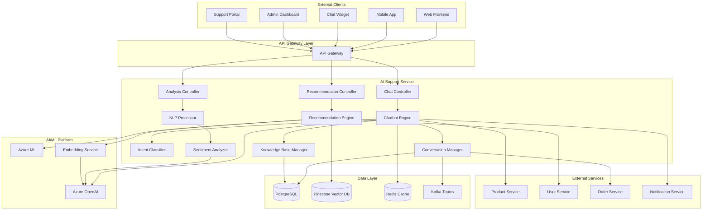
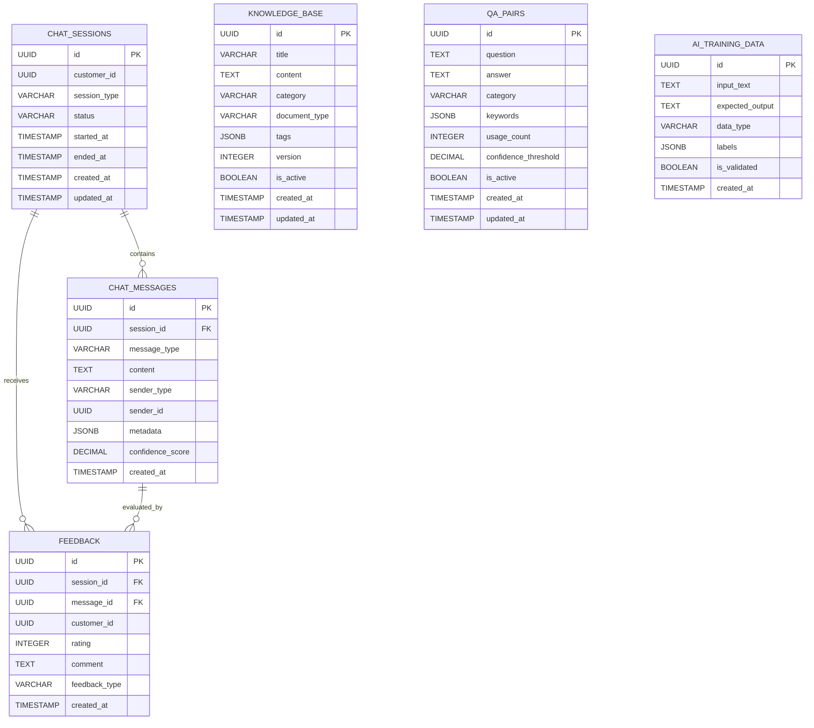

# AI Support Service Detailed Design Document

## Table of Contents

1. [Overview](#overview)
2. [Technical Specifications](#technical-specifications)
3. [Architecture Design](#architecture-design)
4. [API Design](#api-design)
5. [Database Design](#database-design)
6. [AI Feature Design](#ai-features-design)
7. [Chatbot Design](#chatbot-design)
8. [Error Handling](#error-handling)
9. [Test Design](#test-design)
10. [Local Development Environment](#local-development-environment)
11. [Production Deployment](#production-deployment)
12. [Monitoring and Operations](#monitoring-operations)
13. [Incident Response](#incident-response)

## Overview

### Service Summary

The AI Support Service is a microservice responsible for the AI-powered features of the ski equipment sales shop site. It provides AI functionalities such as a chatbot, product recommendations, automated FAQ responses, and customer support assistance.

### Key Responsibilities

- **Chatbot**: 24/7 automated customer support.
- **Product Recommendation**: AI-based personalized product recommendations.
- **FAQ Response**: Automated FAQ responses using natural language processing.
- **Support Assistance**: AI-powered assistance features for human operators.
- **Conversation Analysis**: Sentiment analysis and classification of customer interactions.
- **Knowledge Management**: Management of the support knowledge base.

### Business Value

- **Improved Customer Satisfaction**: Instant responses to inquiries.
- **Reduced Operational Costs**: Cost savings through automation of human tasks.
- **Increased Sales**: Sales promotion through personalized recommendations.
- **Customer Understanding**: Gaining customer insights through conversation analysis.

## Technical Specifications

### Technology Stack

| Technology Area | Technology/Library | Version | Purpose |
|---|---|---|---|
| **Runtime** | OpenJDK | 21 LTS | Java execution environment |
| **Framework** | Jakarta EE | 11 | Enterprise framework |
| **Application Server** | WildFly | 31.0.1 | Jakarta EE application server |
| **Persistence** | Jakarta Persistence (JPA) | 3.2 | ORM |
| **Data Access** | Jakarta Data | 1.0 | Repository abstraction |
| **REST API** | Jakarta REST (JAX-RS) | 4.0 | RESTful Web Services |
| **WebSocket** | Jakarta WebSocket | 2.2 | Real-time communication |
| **CDI** | Jakarta CDI | 4.1 | Dependency injection and management |
| **Validation** | Jakarta Validation | 3.1 | Bean Validation |
| **JSON Processing** | Jakarta JSON-P | 2.1 | JSON processing |
| **Database** | PostgreSQL | 16 | Primary database |
| **Vector Database** | PGVector | - | Vector search |
| **Cache** | Redis | 7.2 | Conversation cache |
| **Message Queue** | Apache Kafka | 3.7 | AI event processing |
| **AI Platform** | Azure OpenAI | GPT-4 | Large Language Model |
| **ML Framework** | Azure ML | - | Machine Learning Platform |
| **Monitoring** | MicroProfile Metrics | 5.1 | Metrics collection |
| **Tracing** | MicroProfile OpenTelemetry | 2.0 | Distributed tracing |
| **Health Check** | MicroProfile Health | 4.0 | Health checks |
| **Configuration** | MicroProfile Config | 3.1 | Configuration management |
| **HTTP Client** | MicroProfile Rest Client | 4.0 | External API integration |

### Excluded Technologies

- **Lombok**: Not used in order to leverage Jakarta EE 11's Record classes and modern Java features.

### Java 21 LTS Features Utilized

- **Virtual Threads**: High-concurrency AI processing.
- **Record Classes**: AI response structures.
- **Pattern Matching**: Intent classification logic.
- **Text Blocks**: Prompt templates.
- **Sealed Classes**: Type safety for AI events.

## Architecture Design

### System Architecture Diagram



### Domain Model Design

```java
// Conversation Session Entity
@Entity
@Table(name = "conversation_sessions")
public class ConversationSession {
    
    @Id
    @GeneratedValue(strategy = GenerationType.UUID)
    private UUID id;
    
    @Column(name = "session_id", unique = true, nullable = false)
    private String sessionId;
    
    @Column(name = "customer_id")
    private UUID customerId;
    
    @Column(name = "visitor_id")
    private String visitorId;
    
    @Enumerated(EnumType.STRING)
    @Column(name = "channel", nullable = false)
    private ConversationChannel channel;
    
    @Enumerated(EnumType.STRING)
    @Column(name = "status", nullable = false)
    private ConversationStatus status;
    
    @Column(name = "language", length = 5)
    private String language = "ja";
    
    @Column(name = "user_agent")
    private String userAgent;
    
    @Column(name = "ip_address")
    private String ipAddress;
    
    @Column(name = "started_at", nullable = false)
    private LocalDateTime startedAt;
    
    @Column(name = "ended_at")
    private LocalDateTime endedAt;
    
    @Column(name = "last_activity_at")
    private LocalDateTime lastActivityAt;
    
    @Embedded
    private ConversationContext context;
    
    // Related Entities
    @OneToMany(mappedBy = "conversationSession", cascade = CascadeType.ALL, fetch = FetchType.LAZY)
    @OrderBy("createdAt ASC")
    private List<ChatMessage> messages = new ArrayList<>();
    
    @OneToMany(mappedBy = "conversationSession", cascade = CascadeType.ALL, fetch = FetchType.LAZY)
    private List<ConversationAnalysis> analyses = new ArrayList<>();
    
    // Business Logic
    public void addMessage(ChatMessage message) {
        message.setConversationSession(this);
        this.messages.add(message);
        this.lastActivityAt = LocalDateTime.now();
    }
    
    public void endConversation() {
        this.status = ConversationStatus.ENDED;
        this.endedAt = LocalDateTime.now();
    }
    
    public boolean isActive() {
        return status == ConversationStatus.ACTIVE;
    }
    
    public boolean isTimedOut(Duration timeout) {
        return lastActivityAt.plus(timeout).isBefore(LocalDateTime.now());
    }
    
    public long getMessageCount() {
        return messages.size();
    }
    
    public Duration getDuration() {
        var endTime = endedAt != null ? endedAt : LocalDateTime.now();
        return Duration.between(startedAt, endTime);
    }
    
    public List<ChatMessage> getRecentMessages(int count) {
        return messages.stream()
            .sorted((m1, m2) -> m2.getCreatedAt().compareTo(m1.getCreatedAt()))
            .limit(count)
            .toList();
    }
}

// Chat Message Entity
@Entity
@Table(name = "chat_messages")
public class ChatMessage {
    
    @Id
    @GeneratedValue(strategy = GenerationType.UUID)
    private UUID id;
    
    @ManyToOne(fetch = FetchType.LAZY)
    @JoinColumn(name = "conversation_session_id", nullable = false)
    private ConversationSession conversationSession;
    
    @Column(name = "message_id", unique = true, nullable = false)
    private String messageId;
    
    @Enumerated(EnumType.STRING)
    @Column(name = "sender_type", nullable = false)
    private MessageSenderType senderType;
    
    @Column(name = "sender_id")
    private String senderId;
    
    @Column(name = "content", columnDefinition = "TEXT", nullable = false)
    private String content;
    
    @Enumerated(EnumType.STRING)
    @Column(name = "message_type", nullable = false)
    private MessageType messageType;
    
    @Column(name = "metadata", columnDefinition = "JSONB")
    private String metadata;
    
    @Embedded
    private MessageAnalysis analysis;
    
    @Column(name = "created_at", nullable = false)
    private LocalDateTime createdAt;
    
    @Column(name = "processed_at")
    private LocalDateTime processedAt;
    
    // Business Logic
    public boolean isFromUser() {
        return senderType == MessageSenderType.USER;
    }
    
    public boolean isFromBot() {
        return senderType == MessageSenderType.BOT;
    }
    
    public boolean isFromAgent() {
        return senderType == MessageSenderType.AGENT;
    }
    
    public void markAsProcessed() {
        this.processedAt = LocalDateTime.now();
    }
}

// Conversation Analysis Entity
@Entity
@Table(name = "conversation_analyses")
public class ConversationAnalysis {
    
    @Id
    @GeneratedValue(strategy = GenerationType.UUID)
    private UUID id;
    
    @ManyToOne(fetch = FetchType.LAZY)
    @JoinColumn(name = "conversation_session_id", nullable = false)
    private ConversationSession conversationSession;
    
    @Enumerated(EnumType.STRING)
    @Column(name = "analysis_type", nullable = false)
    private AnalysisType analysisType;
    
    @Column(name = "intent", length = 100)
    private String intent;
    
    @Column(name = "confidence_score", precision = 5, scale = 4)
    private BigDecimal confidenceScore;
    
    @Enumerated(EnumType.STRING)
    @Column(name = "sentiment")
    private SentimentType sentiment;
    
    @Column(name = "sentiment_score", precision = 5, scale = 4)
    private BigDecimal sentimentScore;
    
    @Column(name = "entities", columnDefinition = "JSONB")
    private String entities;
    
    @Column(name = "keywords", columnDefinition = "JSONB")
    private String keywords;
    
    @Column(name = "satisfaction_score", precision = 3, scale = 2)
    private BigDecimal satisfactionScore;
    
    @Column(name = "resolution_status")
    private String resolutionStatus;
    
    @Column(name = "created_at", nullable = false)
    private LocalDateTime createdAt;
}

// Knowledge Base Entity
@Entity
@Table(name = "knowledge_base")
public class KnowledgeBaseEntry {
    
    @Id
    @GeneratedValue(strategy = GenerationType.UUID)
    private UUID id;
    
    @Column(name = "title", nullable = false)
    private String title;
    
    @Column(name = "content", columnDefinition = "TEXT", nullable = false)
    private String content;
    
    @Column(name = "category", nullable = false)
    private String category;
    
    @Column(name = "subcategory")
    private String subcategory;
    
    @Column(name = "keywords", columnDefinition = "TEXT")
    private String keywords;
    
    @Column(name = "embedding_vector", columnDefinition = "vector(1536)")
    private String embeddingVector;
    
    @Column(name = "language", length = 5, nullable = false)
    private String language = "ja";
    
    @Column(name = "priority", nullable = false)
    private Integer priority = 0;
    
    @Column(name = "view_count", nullable = false)
    private Long viewCount = 0L;
    
    @Column(name = "helpful_count", nullable = false)
    private Long helpfulCount = 0L;
    
    @Column(name = "unhelpful_count", nullable = false)
    private Long unhelpfulCount = 0L;
    
    @Column(name = "is_active", nullable = false)
    private Boolean isActive = true;
    
    @Column(name = "created_at", nullable = false)
    private LocalDateTime createdAt;
    
    @Column(name = "updated_at")
    private LocalDateTime updatedAt;
    
    @Column(name = "created_by", nullable = false)
    private String createdBy;
    
    @Column(name = "updated_by")
    private String updatedBy;
    
    // Business Logic
    public void incrementViewCount() {
        this.viewCount++;
    }
    
    public void markAsHelpful() {
        this.helpfulCount++;
    }
    
    public void markAsUnhelpful() {
        this.unhelpfulCount++;
    }
    
    public double getHelpfulnessRatio() {
        var totalFeedback = helpfulCount + unhelpfulCount;
        return totalFeedback > 0 ? (double) helpfulCount / totalFeedback : 0.0;
    }
    
    public boolean isHighlyRated() {
        return getHelpfulnessRatio() >= 0.8 && (helpfulCount + unhelpfulCount) >= 10;
    }
}

// Product Recommendation Entity
@Entity
@Table(name = "product_recommendations")
public class ProductRecommendation {
    
    @Id
    @GeneratedValue(strategy = GenerationType.UUID)
    private UUID id;
    
    @Column(name = "customer_id")
    private UUID customerId;
    
    @Column(name = "session_id")
    private String sessionId;
    
    @Column(name = "product_id", nullable = false)
    private UUID productId;
    
    @Enumerated(EnumType.STRING)
    @Column(name = "recommendation_type", nullable = false)
    private RecommendationType recommendationType;
    
    @Column(name = "confidence_score", precision = 5, scale = 4, nullable = false)
    private BigDecimal confidenceScore;
    
    @Column(name = "reasoning", columnDefinition = "TEXT")
    private String reasoning;
    
    @Column(name = "context", columnDefinition = "JSONB")
    private String context;
    
    @Column(name = "position", nullable = false)
    private Integer position;
    
    @Column(name = "is_clicked", nullable = false)
    private Boolean isClicked = false;
    
    @Column(name = "is_purchased", nullable = false)
    private Boolean isPurchased = false;
    
    @Column(name = "clicked_at")
    private LocalDateTime clickedAt;
    
    @Column(name = "created_at", nullable = false)
    private LocalDateTime createdAt;
    
    public void recordClick() {
        this.isClicked = true;
        this.clickedAt = LocalDateTime.now();
    }
    
    public void recordPurchase() {
        this.isPurchased = true;
    }
}

// Embeddable Classes
@Embeddable
public record ConversationContext(
    @Column(name = "current_page")
    String currentPage,
    
    @Column(name = "referrer")
    String referrer,
    
    @Column(name = "product_context", columnDefinition = "JSONB")
    String productContext,
    
    @Column(name = "cart_context", columnDefinition = "JSONB")
    String cartContext,
    
    @Column(name = "user_preferences", columnDefinition = "JSONB")
    String userPreferences
) {}

@Embeddable
public record MessageAnalysis(
    @Column(name = "intent")
    String intent,
    
    @Column(name = "intent_confidence", precision = 5, scale = 4)
    BigDecimal intentConfidence,
    
    @Column(name = "sentiment")
    String sentiment,
    
    @Column(name = "sentiment_score", precision = 5, scale = 4)
    BigDecimal sentimentScore,
    
    @Column(name = "entities", columnDefinition = "JSONB")
    String entities,
    
    @Column(name = "language_detected")
    String languageDetected
) {}

// Enums
public enum ConversationChannel {
    WEB_CHAT("Web Chat"),
    MOBILE_APP("Mobile App"),
    EMAIL("Email"),
    PHONE("Phone"),
    SOCIAL_MEDIA("Social Media");
    
    private final String description;
    
    ConversationChannel(String description) {
        this.description = description;
    }
    
    public String getDescription() {
        return description;
    }
}

public enum ConversationStatus {
    ACTIVE("Active"),
    PAUSED("Paused"),
    ENDED("Ended"),
    TRANSFERRED("Transferred"),
    ESCALATED("Escalated");
    
    private final String description;
    
    ConversationStatus(String description) {
        this.description = description;
    }
    
    public String getDescription() {
        return description;
    }
}

public enum MessageSenderType {
    USER("User"),
    BOT("Bot"),
    AGENT("Agent"),
    SYSTEM("System");
    
    private final String description;
    
    MessageSenderType(String description) {
        this.description = description;
    }
    
    public String getDescription() {
        return description;
    }
}

public enum MessageType {
    TEXT("Text"),
    IMAGE("Image"),
    FILE("File"),
    QUICK_REPLY("Quick Reply"),
    CAROUSEL("Carousel"),
    BUTTON("Button"),
    SYSTEM("System");
    
    private final String description;
    
    MessageType(String description) {
        this.description = description;
    }
    
    public String getDescription() {
        return description;
    }
}

public enum AnalysisType {
    INTENT_CLASSIFICATION("Intent Classification"),
    SENTIMENT_ANALYSIS("Sentiment Analysis"),
    ENTITY_EXTRACTION("Entity Extraction"),
    SATISFACTION_SCORING("Satisfaction Scoring");
    
    private final String description;
    
    AnalysisType(String description) {
        this.description = description;
    }
    
    public String getDescription() {
        return description;
    }
}

public enum SentimentType {
    VERY_POSITIVE("Very Positive"),
    POSITIVE("Positive"),
    NEUTRAL("Neutral"),
    NEGATIVE("Negative"),
    VERY_NEGATIVE("Very Negative");
    
    private final String description;
    
    SentimentType(String description) {
        this.description = description;
    }
    
    public String getDescription() {
        return description;
    }
    
    public static SentimentType fromScore(double score) {
        if (score >= 0.6) return VERY_POSITIVE;
        if (score >= 0.2) return POSITIVE;
        if (score >= -0.2) return NEUTRAL;
        if (score >= -0.6) return NEGATIVE;
        return VERY_NEGATIVE;
    }
}

public enum RecommendationType {
    COLLABORATIVE_FILTERING("Collaborative Filtering"),
    CONTENT_BASED("Content-Based"),
    HYBRID("Hybrid"),
    TRENDING("Trending"),
    SEASONAL("Seasonal"),
    CONTEXTUAL("Contextual"),
    CONVERSATION_BASED("Conversation-Based");
    
    private final String description;
    
    RecommendationType(String description) {
        this.description = description;
    }
    
    public String getDescription() {
        return description;
    }
}

// Sealed Classes for Events
public sealed interface AISupportEvent
    permits ConversationStartedEvent, MessageReceivedEvent, MessageSentEvent,
            ConversationEndedEvent, RecommendationGeneratedEvent, IntentDetectedEvent {
}

public record ConversationStartedEvent(
    String sessionId,
    UUID customerId,
    ConversationChannel channel,
    LocalDateTime timestamp
) implements AISupportEvent {}

public record MessageReceivedEvent(
    String sessionId,
    String messageId,
    String content,
    MessageSenderType senderType,
    LocalDateTime timestamp
) implements AISupportEvent {}

public record MessageSentEvent(
    String sessionId,
    String messageId,
    String content,
    MessageSenderType senderType,
    LocalDateTime timestamp
) implements AISupportEvent {}

public record ConversationEndedEvent(
    String sessionId,
    UUID customerId,
    Duration duration,
    Integer messageCount,
    LocalDateTime timestamp
) implements AISupportEvent {}

public record RecommendationGeneratedEvent(
    UUID customerId,
    List<UUID> productIds,
    RecommendationType type,
    LocalDateTime timestamp
) implements AISupportEvent {}

public record IntentDetectedEvent(
    String sessionId,
    String intent,
    BigDecimal confidence,
    LocalDateTime timestamp
) implements AISupportEvent {}

// Exception Classes
public class ChatSessionNotFoundException extends RuntimeException {
    public ChatSessionNotFoundException(String message) {
        super(message);
    }
}

public class AIServiceUnavailableException extends RuntimeException {
    public AIServiceUnavailableException(String message) {
        super(message);
    }
}

public class InvalidMessageException extends RuntimeException {
    public InvalidMessageException(String message) {
        super(message);
    }
}

public class RecommendationServiceException extends RuntimeException {
    public RecommendationServiceException(String message) {
        super(message);
    }
}
```

## API Design {#api-design}

### REST API Endpoints

```java
@Path("/api/v1/ai-support")
@ApplicationScoped
@Produces(MediaType.APPLICATION_JSON)
@Consumes(MediaType.APPLICATION_JSON)
public class AISupportController {
    
    private static final Logger logger = LoggerFactory.getLogger(AISupportController.class);
    
    @Inject
    private ChatService chatService;
    
    @Inject
    private QuestionAnswerService qaService;
    
    @Inject
    private ProductRecommendationService recommendationService;
    
    @POST
    @Path("/chat")
    @Operation(summary = "Send Chat Message", description = "Sends a message to the AI chatbot.")
    @APIResponse(responseCode = "200", description = "Chat response successful")
    @APIResponse(responseCode = "400", description = "Invalid request")
    public Response sendChatMessage(@Valid @RequestBody ChatRequest request) {
        try {
            var sessionId = request.sessionId() != null ? request.sessionId() : UUID.randomUUID();
            
            var chatResponse = chatService.processMessage(
                sessionId,
                request.customerId(),
                request.message(),
                request.context()
            );
            
            return Response.ok(chatResponse).build();
            
        } catch (Exception e) {
            logger.error("Failed to process chat message", e);
            return Response.status(Response.Status.INTERNAL_SERVER_ERROR)
                .entity(Map.of("error", "An error occurred while processing the chat"))
                .build();
        }
    }
    
    @GET
    @Path("/chat/sessions/{sessionId}/history")
    @Operation(summary = "Get Chat History", description = "Gets the chat history for a specified session.")
    @APIResponse(responseCode = "200", description = "History retrieved successfully")
    @APIResponse(responseCode = "404", description = "Session not found")
    public Response getChatHistory(
            @PathParam("sessionId") UUID sessionId,
            @QueryParam("limit") @DefaultValue("50") int limit) {
        
        try {
            var history = chatService.getChatHistory(sessionId, limit);
            
            if (history.isEmpty()) {
                return Response.status(Response.Status.NOT_FOUND)
                    .entity(Map.of("error", "Chat session not found"))
                    .build();
            }
            
            return Response.ok(history).build();
            
        } catch (Exception e) {
            logger.error("Failed to get chat history", e);
            return Response.status(Response.Status.INTERNAL_SERVER_ERROR)
                .entity(Map.of("error", "An error occurred while retrieving history"))
                .build();
        }
    }
    
    @POST
    @Path("/qa")
    @Operation(summary = "Ask Q&A Question", description = "Answers questions about products or services.")
    @APIResponse(responseCode = "200", description = "Answer successful")
    @APIResponse(responseCode = "400", description = "Invalid request")
    public Response askQuestion(@Valid @RequestBody QuestionRequest request) {
        try {
            var answer = qaService.answerQuestion(
                request.question(),
                request.customerId(),
                request.category(),
                request.context()
            );
            
            return Response.ok(answer).build();
            
        } catch (Exception e) {
            logger.error("Failed to answer question", e);
            return Response.status(Response.Status.INTERNAL_SERVER_ERROR)
                .entity(Map.of("error", "An error occurred while answering the question"))
                .build();
        }
    }
    
    @GET
    @Path("/recommendations/{customerId}")
    @Operation(summary = "Product Recommendations", description = "Recommends products tailored to the customer.")
    @APIResponse(responseCode = "200", description = "Recommendation successful")
    @APIResponse(responseCode = "404", description = "Customer not found")
    public Response getProductRecommendations(
            @PathParam("customerId") UUID customerId,
            @QueryParam("category") String category,
            @QueryParam("priceRange") String priceRange,
            @QueryParam("limit") @DefaultValue("10") int limit) {
        
        try {
            var preferences = new RecommendationPreferences(
                customerId,
                category,
                priceRange,
                limit
            );
            
            var recommendations = recommendationService.getRecommendations(preferences);
            
            return Response.ok(recommendations).build();
            
        } catch (Exception e) {
            logger.error("Failed to get product recommendations", e);
            return Response.status(Response.Status.INTERNAL_SERVER_ERROR)
                .entity(Map.of("error", "An error occurred while generating recommendations"))
                .build();
        }
    }
    
    @POST
    @Path("/feedback")
    @Operation(summary = "Submit Feedback", description = "Submits feedback on an AI response.")
    @APIResponse(responseCode = "200", description = "Feedback submitted successfully")
    @APIResponse(responseCode = "400", description = "Invalid request")
    public Response submitFeedback(@Valid @RequestBody FeedbackRequest request) {
        try {
            chatService.recordFeedback(
                request.sessionId(),
                request.messageId(),
                request.rating(),
                request.comment(),
                request.customerId()
            );
            
            return Response.ok(Map.of("message", "Feedback received")).build();
            
        } catch (Exception e) {
            logger.error("Failed to submit feedback", e);
            return Response.status(Response.Status.INTERNAL_SERVER_ERROR)
                .entity(Map.of("error", "An error occurred while submitting feedback"))
                .build();
        }
    }
    
    @GET
    @Path("/analytics/conversations")
    @Operation(summary = "Conversation Analytics", description = "Gets conversation statistics for the chatbot.")
    @APIResponse(responseCode = "200", description = "Analytics data retrieved successfully")
    public Response getConversationAnalytics(
            @QueryParam("fromDate") String fromDate,
            @QueryParam("toDate") String toDate,
            @QueryParam("groupBy") @DefaultValue("day") String groupBy) {
        
        try {
            var from = fromDate != null ? LocalDateTime.parse(fromDate) : LocalDateTime.now().minusDays(7);
            var to = toDate != null ? LocalDateTime.parse(toDate) : LocalDateTime.now();
            
            var analytics = chatService.getConversationAnalytics(from, to, groupBy);
            
            return Response.ok(analytics).build();
            
        } catch (Exception e) {
            logger.error("Failed to get conversation analytics", e);
            return Response.status(Response.Status.INTERNAL_SERVER_ERROR)
                .entity(Map.of("error", "An error occurred while retrieving analytics data"))
                .build();
        }
    }
}
```

### DTO Design

```java
// Request DTOs
public record ChatRequest(
    UUID sessionId,
    UUID customerId,
    String message,
    Map<String, Object> context
) {}

public record QuestionRequest(
    String question,
    UUID customerId,
    String category,
    Map<String, Object> context
) {}

public record FeedbackRequest(
    UUID sessionId,
    UUID messageId,
    int rating,
    String comment,
    UUID customerId
) {}

public record RecommendationPreferences(
    UUID customerId,
    String category,
    String priceRange,
    int limit
) {}

// Response DTOs
public record ChatResponse(
    UUID sessionId,
    UUID messageId,
    String response,
    ChatMessageType messageType,
    List<String> suggestedActions,
    Map<String, Object> metadata,
    LocalDateTime timestamp
) {}

public record QuestionAnswerResponse(
    UUID questionId,
    String answer,
    double confidence,
    List<String> relatedTopics,
    List<DocumentReference> sources,
    LocalDateTime timestamp
) {}

public record ProductRecommendation(
    UUID productId,
    String name,
    String description,
    BigDecimal price,
    String imageUrl,
    double relevanceScore,
    String reasonCode,
    List<String> features
) {}

public record ConversationAnalytics(
    long totalConversations,
    long totalMessages,
    double averageSessionLength,
    double customerSatisfactionScore,
    Map<String, Long> topicDistribution,
    Map<String, Double> responseTimeMetrics,
    List<TrendData> trends
) {}

public record DocumentReference(
    String title,
    String url,
    String snippet,
    double relevanceScore
) {}

public record TrendData(
    String period,
    long value,
    double changePercentage
) {}
```

## Database Design {#database-design}

### ERD (Entity Relationship Diagram)



### Detailed Table Design

```sql
-- Chat Sessions Table
CREATE TABLE chat_sessions (
    id UUID PRIMARY KEY DEFAULT gen_random_uuid(),
    customer_id UUID,
    session_type VARCHAR(50) NOT NULL DEFAULT 'GENERAL',
    status VARCHAR(20) NOT NULL DEFAULT 'ACTIVE',
    started_at TIMESTAMP NOT NULL DEFAULT CURRENT_TIMESTAMP,
    ended_at TIMESTAMP,
    created_at TIMESTAMP NOT NULL DEFAULT CURRENT_TIMESTAMP,
    updated_at TIMESTAMP NOT NULL DEFAULT CURRENT_TIMESTAMP
);

-- Chat Messages Table
CREATE TABLE chat_messages (
    id UUID PRIMARY KEY DEFAULT gen_random_uuid(),
    session_id UUID NOT NULL REFERENCES chat_sessions(id) ON DELETE CASCADE,
    message_type VARCHAR(20) NOT NULL,
    content TEXT NOT NULL,
    sender_type VARCHAR(20) NOT NULL,
    sender_id UUID,
    metadata JSONB,
    confidence_score DECIMAL(5,4),
    created_at TIMESTAMP NOT NULL DEFAULT CURRENT_TIMESTAMP
);

-- Knowledge Base Table
CREATE TABLE knowledge_base (
    id UUID PRIMARY KEY DEFAULT gen_random_uuid(),
    title VARCHAR(500) NOT NULL,
    content TEXT NOT NULL,
    category VARCHAR(100) NOT NULL,
    document_type VARCHAR(50) NOT NULL DEFAULT 'FAQ',
    tags JSONB,
    version INTEGER NOT NULL DEFAULT 1,
    is_active BOOLEAN NOT NULL DEFAULT TRUE,
    created_at TIMESTAMP NOT NULL DEFAULT CURRENT_TIMESTAMP,
    updated_at TIMESTAMP NOT NULL DEFAULT CURRENT_TIMESTAMP
);

-- Q&A Pairs Table
CREATE TABLE qa_pairs (
    id UUID PRIMARY KEY DEFAULT gen_random_uuid(),
    question TEXT NOT NULL,
    answer TEXT NOT NULL,
    category VARCHAR(100) NOT NULL,
    keywords JSONB,
    usage_count INTEGER NOT NULL DEFAULT 0,
    confidence_threshold DECIMAL(5,4) NOT NULL DEFAULT 0.8,
    is_active BOOLEAN NOT NULL DEFAULT TRUE,
    created_at TIMESTAMP NOT NULL DEFAULT CURRENT_TIMESTAMP,
    updated_at TIMESTAMP NOT NULL DEFAULT CURRENT_TIMESTAMP
);

-- Feedback Table
CREATE TABLE feedback (
    id UUID PRIMARY KEY DEFAULT gen_random_uuid(),
    session_id UUID NOT NULL REFERENCES chat_sessions(id),
    message_id UUID NOT NULL REFERENCES chat_messages(id),
    customer_id UUID,
    rating INTEGER NOT NULL CHECK (rating >= 1 AND rating <= 5),
    comment TEXT,
    feedback_type VARCHAR(50) NOT NULL DEFAULT 'QUALITY',
    created_at TIMESTAMP NOT NULL DEFAULT CURRENT_TIMESTAMP
);

-- AI Training Data Table
CREATE TABLE ai_training_data (
    id UUID PRIMARY KEY DEFAULT gen_random_uuid(),
    input_text TEXT NOT NULL,
    expected_output TEXT NOT NULL,
    data_type VARCHAR(50) NOT NULL,
    labels JSONB,
    is_validated BOOLEAN NOT NULL DEFAULT FALSE,
    created_at TIMESTAMP NOT NULL DEFAULT CURRENT_TIMESTAMP
);

-- Index Creation
CREATE INDEX idx_chat_sessions_customer_id ON chat_sessions(customer_id);
CREATE INDEX idx_chat_sessions_status ON chat_sessions(status);
CREATE INDEX idx_chat_messages_session_id ON chat_messages(session_id);
CREATE INDEX idx_chat_messages_created_at ON chat_messages(created_at);
CREATE INDEX idx_knowledge_base_category ON knowledge_base(category);
CREATE INDEX idx_knowledge_base_is_active ON knowledge_base(is_active);
CREATE INDEX idx_qa_pairs_category ON qa_pairs(category);
CREATE INDEX idx_qa_pairs_is_active ON qa_pairs(is_active);
CREATE INDEX idx_feedback_session_id ON feedback(session_id);
CREATE INDEX idx_feedback_rating ON feedback(rating);

-- Full-Text Search Index
CREATE INDEX idx_knowledge_base_content_fts ON knowledge_base USING gin(to_tsvector('japanese', content));
CREATE INDEX idx_qa_pairs_question_fts ON qa_pairs USING gin(to_tsvector('japanese', question));
```

## AI Feature Design {#ai-features-design}

### OpenAI Integration Service

```java
@ApplicationScoped
public class OpenAIService {
    
    private static final Logger logger = LoggerFactory.getLogger(OpenAIService.class);
    
    @ConfigProperty(name = "openai.api.key")
    private String apiKey;
    
    @ConfigProperty(name = "openai.api.base-url")
    private String baseUrl;
    
    @ConfigProperty(name = "openai.model.chat")
    private String chatModel;
    
    @ConfigProperty(name = "openai.model.embedding")
    private String embeddingModel;
    
    @RestClient
    private OpenAIClient openAIClient;
    
    public CompletableFuture<String> generateChatResponse(String message, List<ChatMessage> history, 
                                                         Map<String, Object> context) {
        return CompletableFuture.supplyAsync(() -> {
            try {
                var systemPrompt = buildSystemPrompt(context);
                var messages = buildMessageHistory(systemPrompt, history, message);
                
                var request = new ChatCompletionRequest(
                    chatModel,
                    messages,
                    0.7, // temperature
                    1000, // max_tokens
                    1.0, // top_p
                    0.0, // frequency_penalty
                    0.0  // presence_penalty
                );
                
                var response = openAIClient.createChatCompletion(request);
                
                if (response.choices().isEmpty()) {
                    throw new AIServiceException("No response generated");
                }
                
                var content = response.choices().get(0).message().content();
                
                // Validate response quality
                validateResponseQuality(content, message);
                
                return content;
                
            } catch (Exception e) {
                logger.error("Failed to generate chat response", e);
                throw new AIServiceException("Chat response generation failed", e);
            }
        }, VirtualThread.ofVirtual().factory());
    }
    
    public CompletableFuture<List<Double>> generateEmbedding(String text) {
        return CompletableFuture.supplyAsync(() -> {
            try {
                var request = new EmbeddingRequest(
                    embeddingModel,
                    text
                );
                
                var response = openAIClient.createEmbedding(request);
                
                if (response.data().isEmpty()) {
                    throw new AIServiceException("No embedding generated");
                }
                
                return response.data().get(0).embedding();
                
            } catch (Exception e) {
                logger.error("Failed to generate embedding", e);
                throw new AIServiceException("Embedding generation failed", e);
            }
        }, VirtualThread.ofVirtual().factory());
    }
    
    public CompletableFuture<String> summarizeConversation(List<ChatMessage> messages) {
        return CompletableFuture.supplyAsync(() -> {
            try {
                var conversationText = messages.stream()
                    .map(msg -> msg.senderType() + ": " + msg.content())
                    .collect(Collectors.joining("\n"));
                
                var systemPrompt = """
                    Please summarize the following conversation concisely.
                    - Include the main topics and resolved issues.
                    - Include mentions of important products or services.
                    - Summarize within 200 characters.
                    """;
                
                var messages = List.of(
                    new OpenAIMessage("system", systemPrompt),
                    new OpenAIMessage("user", "Conversation content:\n" + conversationText)
                );
                
                var request = new ChatCompletionRequest(
                    chatModel,
                    messages,
                    0.3, // Low temperature for consistent summary
                    200,
                    1.0,
                    0.0,
                    0.0
                );
                
                var response = openAIClient.createChatCompletion(request);
                return response.choices().get(0).message().content();
                
            } catch (Exception e) {
                logger.error("Failed to summarize conversation", e);
                return "Failed to summarize the conversation.";
            }
        }, VirtualThread.ofVirtual().factory());
    }
    
    private String buildSystemPrompt(Map<String, Object> context) {
        var prompt = new StringBuilder();
        prompt.append("You are a professional AI assistant for a ski equipment sales shop.\n\n");
        prompt.append("Roles and Responsibilities:\n");
        prompt.append("- Provide expert knowledge on ski equipment.\n");
        prompt.append("- Make recommendations based on the customer's skill level and preferences.\n");
        prompt.append("- Support a safe and enjoyable skiing experience.\n");
        prompt.append("- Respond in a friendly and professional tone.\n\n");
        
        if (context.containsKey("customerLevel")) {
            prompt.append("Customer Level: ").append(context.get("customerLevel")).append("\n");
        }
        
        if (context.containsKey("previousPurchases")) {
            prompt.append("Past Purchase History: ").append(context.get("previousPurchases")).append("\n");
        }
        
        if (context.containsKey("currentSeason")) {
            prompt.append("Current Season: ").append(context.get("currentSeason")).append("\n");
        }
        
        prompt.append("\nResponse Guidelines:\n");
        prompt.append("- Provide specific and practical advice.\n");
        prompt.append("- Prioritize safety above all else.\n");
        prompt.append("- Clearly explain the reasons for product recommendations.\n");
        prompt.append("- Be honest if you are unsure about something.\n");
        
        return prompt.toString();
    }
    
    private List<OpenAIMessage> buildMessageHistory(String systemPrompt, 
                                                   List<ChatMessage> history, 
                                                   String currentMessage) {
        var messages = new ArrayList<OpenAIMessage>();
        messages.add(new OpenAIMessage("system", systemPrompt));
        
        // Add past conversation history (up to the last 10 messages)
        history.stream()
            .skip(Math.max(0, history.size() - 10))
            .forEach(msg -> {
                var role = msg.senderType() == SenderType.USER ? "user" : "assistant";
                messages.add(new OpenAIMessage(role, msg.content()));
            });
        
        messages.add(new OpenAIMessage("user", currentMessage));
        
        return messages;
    }
    
    private void validateResponseQuality(String response, String originalMessage) {
        // Basic quality checks
        if (response == null || response.trim().isEmpty()) {
            throw new AIServiceException("Empty response generated");
        }
        
        if (response.length() < 10) {
            throw new AIServiceException("Response too short");
        }
        
        if (response.length() > 2000) {
            logger.warn("Response length exceeds recommended limit: {} chars", response.length());
        }
        
        // Inappropriate content check
        if (containsInappropriateContent(response)) {
            throw new AIServiceException("Inappropriate content detected");
        }
    }
    
    private boolean containsInappropriateContent(String content) {
        // Simple inappropriate content detection
        var inappropriatePatterns = List.of(
            "I'm sorry, but I can't help with that",
            "As an AI assistant",
            "I am a language model"
        );
        
        return inappropriatePatterns.stream()
            .anyMatch(pattern -> content.toLowerCase().contains(pattern.toLowerCase()));
    }
}

// OpenAI API Client
@RestClient
@RegisterRestClient
public interface OpenAIClient {
    
    @POST
    @Path("/v1/chat/completions")
    @Consumes(MediaType.APPLICATION_JSON)
    @Produces(MediaType.APPLICATION_JSON)
    ChatCompletionResponse createChatCompletion(ChatCompletionRequest request);
    
    @POST
    @Path("/v1/embeddings")
    @Consumes(MediaType.APPLICATION_JSON)
    @Produces(MediaType.APPLICATION_JSON)
    EmbeddingResponse createEmbedding(EmbeddingRequest request);
}

// OpenAI DTOs
public record ChatCompletionRequest(
    String model,
    List<OpenAIMessage> messages,
    double temperature,
    int max_tokens,
    double top_p,
    double frequency_penalty,
    double presence_penalty
) {}

public record ChatCompletionResponse(
    String id,
    String object,
    long created,
    String model,
    List<Choice> choices,
    Usage usage
) {}

public record Choice(
    int index,
    OpenAIMessage message,
    String finish_reason
) {}

public record OpenAIMessage(
    String role,
    String content
) {}

public record Usage(
    int prompt_tokens,
    int completion_tokens,
    int total_tokens
) {}

public record EmbeddingRequest(
    String model,
    String input
) {}

public record EmbeddingResponse(
    String object,
    List<EmbeddingData> data,
    String model,
    Usage usage
) {}

public record EmbeddingData(
    String object,
    int index,
    List<Double> embedding
) {}
```

### Knowledge Base Search Service

```java
@ApplicationScoped
public class KnowledgeBaseService {
    
    private static final Logger logger = LoggerFactory.getLogger(KnowledgeBaseService.class);
    
    @Inject
    private KnowledgeBaseRepository knowledgeRepository;
    
    @Inject
    private OpenAIService openAIService;
    
    @Inject
    @ConfigProperty(name = "ai.similarity.threshold", defaultValue = "0.8")
    private Double similarityThreshold;
    
    public CompletableFuture<List<DocumentSearchResult>> searchRelevantDocuments(
            String query, String category, int limit) {
        
        return CompletableFuture.supplyAsync(() -> {
            try {
                // Generate embedding vector for the query
                var queryEmbedding = openAIService.generateEmbedding(query).join();
                
                // Vector similarity search
                var searchResults = knowledgeRepository.findSimilarDocuments(
                    queryEmbedding, 
                    category, 
                    similarityThreshold, 
                    limit
                );
                
                // Sort results by score
                return searchResults.stream()
                    .sorted((a, b) -> Double.compare(b.similarityScore(), a.similarityScore()))
                    .toList();
                
            } catch (Exception e) {
                logger.error("Failed to search knowledge base", e);
                return List.of();
            }
        }, VirtualThread.ofVirtual().factory());
    }
    
    public CompletableFuture<String> generateContextualAnswer(String question, 
                                                             List<DocumentSearchResult> relevantDocs) {
        
        return CompletableFuture.supplyAsync(() -> {
            try {
                if (relevantDocs.isEmpty()) {
                    return "I'm sorry, but I couldn't find any information to answer your question.";
                }
                
                var context = buildDocumentContext(relevantDocs);
                var systemPrompt = """
                    Please provide an accurate and helpful answer to the user's question based on the following document information.
                    
                    Response Guidelines:
                    - Use only the provided document information.
                    - Do not speculate on information that is not certain.
                    - Strive to provide specific and practical advice.
                    - Utilize your expertise in ski equipment.
                    
                    Reference Documents:
                    """ + context;
                
                var messages = List.of(
                    new OpenAIMessage("system", systemPrompt),
                    new OpenAIMessage("user", question)
                );
                
                return openAIService.generateChatResponse(question, List.of(), 
                    Map.of("context", "knowledge_base_search")).join();
                
            } catch (Exception e) {
                logger.error("Failed to generate contextual answer", e);
                return "I'm sorry, but I failed to generate an answer.";
            }
        }, VirtualThread.ofVirtual().factory());
    }
    
    public void updateDocumentEmbeddings() {
        logger.info("Starting document embedding update");
        
        var documents = knowledgeRepository.findDocumentsWithoutEmbeddings();
        
        documents.parallelStream()
            .forEach(doc -> {
                try {
                    var content = doc.getTitle() + "\n" + doc.getContent();
                    var embedding = openAIService.generateEmbedding(content).join();
                    
                    doc.setEmbedding(embedding);
                    knowledgeRepository.save(doc);
                    
                    logger.debug("Updated embedding for document: {}", doc.getId());
                    
                } catch (Exception e) {
                    logger.error("Failed to update embedding for document: {}", doc.getId(), e);
                }
            });
        
        logger.info("Completed document embedding update");
    }
    
    private String buildDocumentContext(List<DocumentSearchResult> documents) {
        return documents.stream()
            .map(doc -> String.format(
                "Document: %s\nContent: %s\nRelevance: %.2f\n",
                doc.title(),
                doc.content(),
                doc.similarityScore()
            ))
            .collect(Collectors.joining("\n---\n"));
    }
}

public record DocumentSearchResult(
    UUID documentId,
    String title,
    String content,
    String category,
    double similarityScore,
    List<String> tags
) {}
```

## Chatbot Design {#chatbot-design}

### Chat Conversation Management Service

```java
@ApplicationScoped
@Transactional
public class ChatService {
    
    private static final Logger logger = LoggerFactory.getLogger(ChatService.class);
    
    @Inject
    private ChatSessionRepository sessionRepository;
    
    @Inject
    private ChatMessageRepository messageRepository;
    
    @Inject
    private OpenAIService openAIService;
    
    @Inject
    private KnowledgeBaseService knowledgeService;
    
    @Inject
    private CustomerProfileService customerService;
    
    @Inject
    private IntentClassificationService intentService;
    
    private final ExecutorService executor = Executors.newVirtualThreadPerTaskExecutor();
    
    public CompletableFuture<ChatResponse> processMessage(UUID sessionId, UUID customerId, 
                                                         String message, Map<String, Object> context) {
        
        return CompletableFuture.supplyAsync(() -> {
            try {
                // Get or create session
                var session = getOrCreateSession(sessionId, customerId);
                
                // Record user message
                var userMessage = recordMessage(session, message, SenderType.USER, customerId);
                
                // Classify intent
                var intent = intentService.classifyIntent(message, context);
                
                // Generate response
                var response = generateResponse(session, message, intent, context);
                
                // Record AI response
                var aiMessage = recordMessage(session, response.response(), SenderType.AI, null);
                
                // Update session
                updateSessionActivity(session);
                
                return response;
                
            } catch (Exception e) {
                logger.error("Failed to process chat message", e);
                return new ChatResponse(
                    sessionId,
                    UUID.randomUUID(),
                    "I'm sorry, but there is currently a problem with the service. Please try again later.",
                    ChatMessageType.ERROR,
                    List.of(),
                    Map.of(),
                    LocalDateTime.now()
                );
            }
        }, executor);
    }
    
    public List<ChatMessage> getChatHistory(UUID sessionId, int limit) {
        return messageRepository.findBySessionIdOrderByCreatedAtDesc(sessionId, limit);
    }
    
    public void recordFeedback(UUID sessionId, UUID messageId, int rating, 
                              String comment, UUID customerId) {
        
        var feedback = new ChatFeedback();
        feedback.setSessionId(sessionId);
        feedback.setMessageId(messageId);
        feedback.setCustomerId(customerId);
        feedback.setRating(rating);
        feedback.setComment(comment);
        feedback.setCreatedAt(LocalDateTime.now());
        
        feedbackRepository.save(feedback);
        
        // Alert on low rating
        if (rating <= 2) {
            alertService.sendLowRatingAlert(sessionId, messageId, rating, comment);
        }
    }
    
    public ConversationAnalytics getConversationAnalytics(LocalDateTime fromDate, 
                                                         LocalDateTime toDate, 
                                                         String groupBy) {
        
        var sessions = sessionRepository.findByDateRange(fromDate, toDate);
        var messages = messageRepository.findByDateRange(fromDate, toDate);
        
        var totalConversations = sessions.size();
        var totalMessages = messages.size();
        
        var averageSessionLength = sessions.stream()
            .filter(s -> s.getEndedAt() != null)
            .mapToLong(s -> Duration.between(s.getStartedAt(), s.getEndedAt()).toMinutes())
            .average()
            .orElse(0.0);
        
        var satisfactionScore = calculateSatisfactionScore(sessions);
        var topicDistribution = calculateTopicDistribution(messages);
        var responseTimeMetrics = calculateResponseTimeMetrics(messages);
        var trends = calculateTrends(sessions, groupBy);
        
        return new ConversationAnalytics(
            totalConversations,
            totalMessages,
            averageSessionLength,
            satisfactionScore,
            topicDistribution,
            responseTimeMetrics,
            trends
        );
    }
    
    private ChatSession getOrCreateSession(UUID sessionId, UUID customerId) {
        return sessionRepository.findById(sessionId)
            .orElseGet(() -> {
                var newSession = new ChatSession();
                newSession.setId(sessionId);
                newSession.setCustomerId(customerId);
                newSession.setSessionType("GENERAL");
                newSession.setStatus("ACTIVE");
                newSession.setStartedAt(LocalDateTime.now());
                newSession.setCreatedAt(LocalDateTime.now());
                return sessionRepository.save(newSession);
            });
    }
    
    private ChatMessage recordMessage(ChatSession session, String content, 
                                    SenderType senderType, UUID senderId) {
        
        var message = new ChatMessage();
        message.setSessionId(session.getId());
        message.setContent(content);
        message.setSenderType(senderType);
        message.setSenderId(senderId);
        message.setMessageType(determineMessageType(content, senderType));
        message.setCreatedAt(LocalDateTime.now());
        
        return messageRepository.save(message);
    }
    
    private ChatResponse generateResponse(ChatSession session, String message, 
                                        MessageIntent intent, Map<String, Object> context) {
        
        return switch (intent.type()) {
            case PRODUCT_INQUIRY -> handleProductInquiry(session, message, context);
            case TECHNICAL_SUPPORT -> handleTechnicalSupport(session, message, context);
            case ORDER_STATUS -> handleOrderStatus(session, message, context);
            case RECOMMENDATION_REQUEST -> handleRecommendationRequest(session, message, context);
            case GENERAL_QUESTION -> handleGeneralQuestion(session, message, context);
            case COMPLAINT -> handleComplaint(session, message, context);
            default -> handleGeneralChat(session, message, context);
        };
    }
    
    private ChatResponse handleProductInquiry(ChatSession session, String message, 
                                            Map<String, Object> context) {
        
        try {
            // Search for relevant product information
            var relevantDocs = knowledgeService.searchRelevantDocuments(
                message, "PRODUCT", 5
            ).join();
            
            // Get customer profile
            var customerProfile = customerService.getCustomerProfile(session.getCustomerId());
            
            // Add customer information to context
            var enhancedContext = new HashMap<>(context);
            if (customerProfile.isPresent()) {
                enhancedContext.put("customerLevel", customerProfile.get().getSkillLevel());
                enhancedContext.put("previousPurchases", customerProfile.get().getPurchaseHistory());
            }
            
            // Generate AI response
            var response = openAIService.generateChatResponse(
                message, 
                getChatHistory(session.getId(), 5), 
                enhancedContext
            ).join();
            
            // Generate suggested actions
            var suggestedActions = generateProductInquiryActions(message, relevantDocs);
            
            return new ChatResponse(
                session.getId(),
                UUID.randomUUID(),
                response,
                ChatMessageType.PRODUCT_INFO,
                suggestedActions,
                Map.of("intent", "PRODUCT_INQUIRY", "relevantDocs", relevantDocs.size()),
                LocalDateTime.now()
            );
            
        } catch (Exception e) {
            logger.error("Failed to handle product inquiry", e);
            return createErrorResponse(session.getId());
        }
    }
    
    private ChatResponse handleTechnicalSupport(ChatSession session, String message, 
                                              Map<String, Object> context) {
        
        try {
            // Search technical support documents
            var relevantDocs = knowledgeService.searchRelevantDocuments(
                message, "TECHNICAL", 3
            ).join();
            
            // Generate step-by-step solutions
            var troubleshootingSteps = generateTroubleshootingSteps(message, relevantDocs);
            
            var response = openAIService.generateChatResponse(
                message, 
                getChatHistory(session.getId(), 3), 
                Map.of("context", "technical_support", "steps", troubleshootingSteps)
            ).join();
            
            var suggestedActions = List.of(
                "Provide more details",
                "Upload an image",
                "Request human support"
            );
            
            return new ChatResponse(
                session.getId(),
                UUID.randomUUID(),
                response,
                ChatMessageType.TECHNICAL_SUPPORT,
                suggestedActions,
                Map.of("intent", "TECHNICAL_SUPPORT", "troubleshootingSteps", troubleshootingSteps),
                LocalDateTime.now()
            );
            
        } catch (Exception e) {
            logger.error("Failed to handle technical support", e);
            return createErrorResponse(session.getId());
        }
    }
    
    private ChatResponse handleGeneralChat(ChatSession session, String message, 
                                         Map<String, Object> context) {
        
        try {
            var response = openAIService.generateChatResponse(
                message, 
                getChatHistory(session.getId(), 5), 
                context
            ).join();
            
            var suggestedActions = List.of(
                "View products",
                "Contact support",
                "See frequently asked questions"
            );
            
            return new ChatResponse(
                session.getId(),
                UUID.randomUUID(),
                response,
                ChatMessageType.GENERAL,
                suggestedActions,
                Map.of("intent", "GENERAL"),
                LocalDateTime.now()
            );
            
        } catch (Exception e) {
            logger.error("Failed to handle general chat", e);
            return createErrorResponse(session.getId());
        }
    }
    
    private ChatResponse createErrorResponse(UUID sessionId) {
        return new ChatResponse(
            sessionId,
            UUID.randomUUID(),
            "I'm sorry, but the service is temporarily unavailable. Please try again later.",
            ChatMessageType.ERROR,
            List.of("Try again later", "Contact support"),
            Map.of(),
            LocalDateTime.now()
        );
    }
    
    private List<String> generateProductInquiryActions(String message, 
                                                      List<DocumentSearchResult> docs) {
        var actions = new ArrayList<String>();
        
        if (!docs.isEmpty()) {
            actions.add("View related products");
            actions.add("Check detailed specifications");
        }
        
        actions.add("Compare prices");
        actions.add("Read reviews");
        actions.add("Consult with an expert");
        
        return actions;
    }
    
    private List<String> generateTroubleshootingSteps(String message, 
                                                     List<DocumentSearchResult> docs) {
        
        // Simple implementation example
        return List.of(
            "Confirm problem details",
            "Try basic solutions",
            "Check settings",
            "Contact expert support if necessary"
        );
    }
    
    private void updateSessionActivity(ChatSession session) {
        session.setUpdatedAt(LocalDateTime.now());
        sessionRepository.save(session);
    }
    
    private ChatMessageType determineMessageType(String content, SenderType senderType) {
        if (senderType == SenderType.USER) {
            return ChatMessageType.USER_MESSAGE;
        }
        
        // Estimate the type of AI response
        if (content.contains("product") || content.contains("item")) {
            return ChatMessageType.PRODUCT_INFO;
        } else if (content.contains("support") || content.contains("problem")) {
            return ChatMessageType.TECHNICAL_SUPPORT;
        }
        
        return ChatMessageType.GENERAL;
    }
    
    private double calculateSatisfactionScore(List<ChatSession> sessions) {
        // Calculate satisfaction score from feedback
        return feedbackRepository.getAverageRatingForSessions(
            sessions.stream().map(ChatSession::getId).toList()
        ).orElse(0.0);
    }
    
    private Map<String, Long> calculateTopicDistribution(List<ChatMessage> messages) {
        // Calculate topic distribution from message content
        return messages.stream()
            .map(this::extractTopic)
            .collect(Collectors.groupingBy(
                Function.identity(),
                Collectors.counting()
            ));
    }
    
    private Map<String, Double> calculateResponseTimeMetrics(List<ChatMessage> messages) {
        // Calculate response time metrics
        var responseTimes = new ArrayList<Long>();
        
        for (int i = 1; i < messages.size(); i++) {
            var prev = messages.get(i - 1);
            var curr = messages.get(i);
            
            if (prev.getSenderType() == SenderType.USER && 
                curr.getSenderType() == SenderType.AI) {
                
                var responseTime = Duration.between(
                    prev.getCreatedAt(), 
                    curr.getCreatedAt()
                ).toMillis();
                
                responseTimes.add(responseTime);
            }
        }
        
        // ... (omitted)
        return Map.of();
    }
    
    private List<TrendData> calculateTrends(List<ChatSession> sessions, String groupBy) {
        // ... (omitted)
        return List.of();
    }
    
    private String extractTopic(ChatMessage message) {
        // ... (omitted)
        return "General";
    }
}
```
