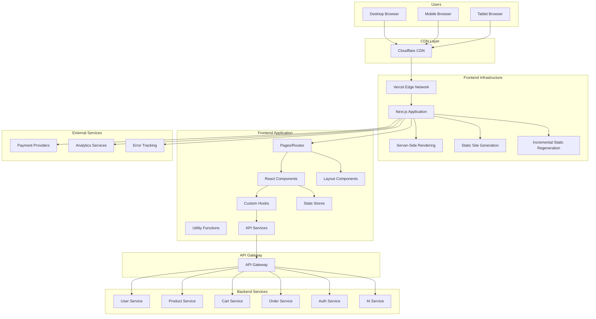

# Frontend Service Detailed Design Document

## Table of Contents

1. [Overview](#overview)
2. [Technical Specifications](#technical-specifications)
3. [Architecture Design](#architecture-design)
4. [API Design](#api-design)
5. [UI/UX Design](#uiux-design)
6. [Performance Design](#performance-design)
7. [Security Design](#security-design)
8. [Error Handling](#error-handling)
9. [Test Design](#test-design)
10. [Local Development Environment](#local-development-environment)
11. [Production Deployment](#production-deployment)
12. [Monitoring and Operations](#monitoring-and-operations)
13. [Incident Response](#incident-response)

## Overview

### Service Summary

The Frontend Service is responsible for the frontend functionality of the ski equipment sales shop site. It provides web application delivery, user interface, responsive design, and PWA features.

### Key Responsibilities

- **Web Application Delivery**: Providing a Single Page Application (SPA)
- **User Interface**: Responsive UI/UX
- **PWA Features**: Progressive Web App functionality
- **SEO Support**: Server-Side Rendering (SSR)
- **Performance Optimization**: Fast loading and caching strategies
- **Accessibility**: WCAG 2.1 compliant accessible UI

### Business Value

- **Improved User Experience**: Intuitive and easy-to-use interface
- **Increased Sales**: Conversion rate optimization
- **Accessibility**: Catering to a wide range of users
- **SEO Benefits**: Attracting customers through search engine optimization

## Technical Specifications

### Technology Stack

| Technology Area | Technology/Library | Version | Purpose |
|---|---|---|---|
| **Frontend Framework** | Next.js | 15.4 | React Framework |
| **UI Library** | React | 19.1.0 | User Interface |
| **Language** | TypeScript | 5.8 | Type-safe JavaScript |
| **Styling** | Tailwind CSS | 4.1.10 | Utility-first CSS |
| **UI Components** | Headless UI | 2.2.4 | Accessible Components |
| **Icons** | Heroicons | 2.2.0 | SVG Icon Library |
| **State Management** | Zustand | 4.4 | Lightweight State Management |
| **Forms** | React Hook Form | 7.60.0 | Form Management |
| **Validation** | Zod | 4.0 | Schema Validation |
| **HTTP Client** | Axios | 1.10.0 | HTTP Communication |
| **Animation** | Framer Motion | 12.23.5 | Animation |
| **Testing** | Jest | 30.0.2 | Unit Testing |
| **E2E Testing** | Playwright | 1.54 | End-to-End Testing |
| **Build Tool** | Webpack | 5.100.2 | Bundler |
| **Package Manager** | pnpm | 10.9 | Package Management |
| **Deployment** | Vercel | - | Hosting & Deployment |
| **CDN** | Cloudflare | - | Content Delivery |
| **Monitoring** | Vercel Analytics | - | Performance Monitoring |
| **Error Tracking** | Sentry | 8 | Error Tracking |

### Excluded Technologies

- **jQuery**: Not used in favor of a modern React approach.
- **Bootstrap**: Not used as Tailwind CSS is adopted.

### TypeScript/React Features Utilized

- **TypeScript**: Type-safe development, interface definitions
- **React 18**: Suspense, Concurrent Features
- **Next.js 14**: App Router, Server Components
- **Server Actions**: Simplifying server-side processing

## Architecture Design

### System Architecture Diagram



### Folder Structure

```text
src/
├── app/                          # Next.js App Router
│   ├── (auth)/                   # Auth-related page group
│   │   ├── login/
│   │   └── register/
│   ├── (shop)/                   # Shop-related page group
│   │   ├── products/
│   │   ├── categories/
│   │   ├── cart/
│   │   └── checkout/
│   ├── (account)/                # Account-related page group
│   │   ├── profile/
│   │   ├── orders/
│   │   └── points/
│   ├── globals.css
│   ├── layout.tsx
│   ├── loading.tsx
│   ├── error.tsx
│   └── not-found.tsx
├── components/                   # Reusable components
│   ├── ui/                       # Basic UI components
│   │   ├── Button.tsx
│   │   ├── Input.tsx
│   │   ├── Modal.tsx
│   │   └── index.ts
│   ├── forms/                    # Form components
│   │   ├── LoginForm.tsx
│   │   ├── ProductForm.tsx
│   │   └── index.ts
│   ├── layout/                   # Layout components
│   │   ├── Header.tsx
│   │   ├── Footer.tsx
│   │   ├── Sidebar.tsx
│   │   └── index.ts
│   ├── product/                  # Product-related components
│   │   ├── ProductCard.tsx
│   │   ├── ProductList.tsx
│   │   ├── ProductDetail.tsx
│   │   └── index.ts
│   └── chat/                     # Chat-related components
│       ├── ChatWidget.tsx
│       ├── ChatMessage.tsx
│       └── index.ts
├── hooks/                        # Custom hooks
│   ├── useAuth.ts
│   ├── useCart.ts
│   ├── useProducts.ts
│   └── useLocalStorage.ts
├── stores/                       # State management
│   ├── authStore.ts
│   ├── cartStore.ts
│   ├── productStore.ts
│   └── uiStore.ts
├── services/                     # API services
│   ├── api/
│   │   ├── auth.ts
│   │   ├── products.ts
│   │   ├── cart.ts
│   │   └── orders.ts
│   ├── http/
│   │   ├── client.ts
│   │   └── interceptors.ts
│   └── cache/
│       └── queries.ts
├── types/                        # TypeScript type definitions
│   ├── auth.ts
│   ├── product.ts
│   ├── cart.ts
│   ├── order.ts
│   └── api.ts
├── utils/                        # Utility functions
│   ├── formatters.ts
│   ├── validators.ts
│   ├── constants.ts
│   └── helpers.ts
├── styles/                       # Style-related
│   ├── globals.css
│   └── components.css
└── middleware.ts                 # Next.js Middleware
```

### Component Design

```typescript
// Basic UI Component
import React from 'react';
import { cva, type VariantProps } from 'class-variance-authority';
import { cn } from '@/utils/helpers';

const buttonVariants = cva(
  'inline-flex items-center justify-center whitespace-nowrap rounded-md text-sm font-medium transition-colors focus-visible:outline-none focus-visible:ring-1 focus-visible:ring-ring disabled:pointer-events-none disabled:opacity-50',
  {
    variants: {
      variant: {
        default: 'bg-primary text-primary-foreground shadow hover:bg-primary/90',
        destructive: 'bg-destructive text-destructive-foreground shadow-sm hover:bg-destructive/90',
        outline: 'border border-input bg-background shadow-sm hover:bg-accent hover:text-accent-foreground',
        secondary: 'bg-secondary text-secondary-foreground shadow-sm hover:bg-secondary/80',
        ghost: 'hover:bg-accent hover:text-accent-foreground',
        link: 'text-primary underline-offset-4 hover:underline',
      },
      size: {
        default: 'h-9 px-4 py-2',
        sm: 'h-8 rounded-md px-3 text-xs',
        lg: 'h-10 rounded-md px-8',
        icon: 'h-9 w-9',
      },
    },
    defaultVariants: {
      variant: 'default',
      size: 'default',
    },
  }
);

export interface ButtonProps
  extends React.ButtonHTMLAttributes<HTMLButtonElement>,
    VariantProps<typeof buttonVariants> {
  asChild?: boolean;
  loading?: boolean;
}

const Button = React.forwardRef<HTMLButtonElement, ButtonProps>(
  ({ className, variant, size, asChild = false, loading = false, children, disabled, ...props }, ref) => {
    return (
      <button
        className={cn(buttonVariants({ variant, size, className }))}
        ref={ref}
        disabled={disabled || loading}
        {...props}
      >
        {loading ? (
          <>
            <svg className="mr-2 h-4 w-4 animate-spin" viewBox="0 0 24 24">
              <circle
                className="opacity-25"
                cx="12"
                cy="12"
                r="10"
                stroke="currentColor"
                strokeWidth="4"
                fill="none"
              />
              <path
                className="opacity-75"
                fill="currentColor"
                d="m15.84 5.76-1.42 1.42A8.97 8.97 0 0 1 21 12c0 4.97-4.03 9-9 9s-9-4.03-9-9 4.03-9 9-9c2.12 0 4.06.74 5.58 1.97l1.42-1.42A10.95 10.95 0 0 0 12 1C5.93 1 1 5.93 1 12s4.93 11 11 11 11-4.93 11-11c0-2.89-1.12-5.51-2.94-7.42Z"
              />
            </svg>
            Loading...
          </>
        ) : (
          children
        )}
      </button>
    );
  }
);

Button.displayName = 'Button';

export { Button, buttonVariants };

// Product Card Component
import React from 'react';
import Image from 'next/image';
import Link from 'next/link';
import { motion } from 'framer-motion';
import { Button } from '@/components/ui/Button';
import { Badge } from '@/components/ui/Badge';
import { useCartStore } from '@/stores/cartStore';
import { formatPrice } from '@/utils/formatters';
import type { Product } from '@/types/product';

interface ProductCardProps {
  product: Product;
  showQuickAdd?: boolean;
  showWishlist?: boolean;
  className?: string;
}

export const ProductCard: React.FC<ProductCardProps> = ({
  product,
  showQuickAdd = true,
  showWishlist = true,
  className,
}) => {
  const addToCart = useCartStore((state) => state.addItem);
  const [isLoading, setIsLoading] = React.useState(false);
  const [isImageLoaded, setIsImageLoaded] = React.useState(false);

  const handleAddToCart = async (e: React.MouseEvent) => {
    e.preventDefault();
    e.stopPropagation();
    
    setIsLoading(true);
    try {
      await addToCart({
        productId: product.id,
        name: product.name,
        price: product.price,
        quantity: 1,
        image: product.images[0],
      });
    } catch (error) {
      console.error('Failed to add to cart:', error);
    } finally {
      setIsLoading(false);
    }
  };

  const discountPercentage = product.originalPrice
    ? Math.round(((product.originalPrice - product.price) / product.originalPrice) * 100)
    : 0;

  return (
    <motion.div
      className={cn(
        'group relative overflow-hidden rounded-lg border bg-white shadow-sm transition-all hover:shadow-md',
        className
      )}
      whileHover={{ y: -2 }}
      transition={{ duration: 0.2 }}
    >
      <Link href={`/products/${product.id}`}>
        <div className="aspect-square overflow-hidden">
          <div className="relative h-full w-full bg-gray-100">
            {!isImageLoaded && (
              <div className="absolute inset-0 animate-pulse bg-gray-200" />
            )}
            <Image
              src={product.images[0] || '/images/product-placeholder.jpg'}
              alt={product.name}
              fill
              className={cn(
                'object-cover transition-all duration-300 group-hover:scale-105',
                isImageLoaded ? 'opacity-100' : 'opacity-0'
              )}
              onLoad={() => setIsImageLoaded(true)}
              sizes="(max-width: 768px) 100vw, (max-width: 1200px) 50vw, 33vw"
            />
          </div>
          
          {/* Badges */}
          <div className="absolute left-2 top-2 flex flex-col gap-1">
            {product.isNew && (
              <Badge variant="secondary" className="bg-blue-500 text-white">
                NEW
              </Badge>
            )}
            {discountPercentage > 0 && (
              <Badge variant="destructive" className="bg-red-500 text-white">
                -{discountPercentage}%
              </Badge>
            )}
            {product.stock <= 5 && product.stock > 0 && (
              <Badge variant="outline" className="bg-yellow-500 text-white">
                {product.stock} left
              </Badge>
            )}
          </div>

          {/* Wishlist Button */}
          {showWishlist && (
            <Button
              variant="ghost"
              size="icon"
              className="absolute right-2 top-2 h-8 w-8 bg-white/80 hover:bg-white"
              onClick={(e) => {
                e.preventDefault();
                e.stopPropagation();
                // Add to wishlist logic
              }}
            >
              <HeartIcon className="h-4 w-4" />
            </Button>
          )}
        </div>

        {/* Product Info */}
        <div className="p-4">
          <div className="mb-2">
            <Badge variant="outline" className="text-xs">
              {product.category}
            </Badge>
          </div>
          
          <h3 className="mb-2 line-clamp-2 text-sm font-medium text-gray-900 group-hover:text-blue-600">
            {product.name}
          </h3>
          
          <div className="flex items-center justify-between">
            <div className="flex items-center gap-2">
              <span className="text-lg font-bold text-gray-900">
                {formatPrice(product.price)}
              </span>
              {product.originalPrice && (
                <span className="text-sm text-gray-500 line-through">
                  {formatPrice(product.originalPrice)}
                </span>
              )}
            </div>
            
            {/* Rating */}
            {product.rating && (
              <div className="flex items-center gap-1">
                <StarIcon className="h-4 w-4 fill-yellow-400 text-yellow-400" />
                <span className="text-sm text-gray-600">
                  {product.rating.toFixed(1)}
                </span>
              </div>
            )}
          </div>
        </div>
      </Link>

      {/* Quick Add Button */}
      {showQuickAdd && (
        <div className="absolute bottom-4 left-4 right-4 translate-y-full transition-all group-hover:translate-y-0">
          <Button
            onClick={handleAddToCart}
            disabled={product.stock === 0 || isLoading}
            className="w-full"
            loading={isLoading}
          >
            {product.stock === 0 ? 'Out of Stock' : 'Add to Cart'}
          </Button>
        </div>
      )}
    </motion.div>
  );
};

// Custom Hook
import React from 'react';
import { create } from 'zustand';
import { persist, createJSONStorage } from 'zustand/middleware';
import { authApi } from '@/services/api/auth';
import type { User, LoginCredentials, RegisterData } from '@/types/auth';

interface AuthState {
  user: User | null;
  isAuthenticated: boolean;
  isLoading: boolean;
  error: string | null;
}

interface AuthActions {
  login: (credentials: LoginCredentials) => Promise<void>;
  register: (data: RegisterData) => Promise<void>;
  logout: () => Promise<void>;
  refreshToken: () => Promise<void>;
  clearError: () => void;
  setUser: (user: User | null) => void;
}

export const useAuthStore = create<AuthState & AuthActions>()(
  persist(
    (set, get) => ({
      // State
      user: null,
      isAuthenticated: false,
      isLoading: false,
      error: null,

      // Actions
      login: async (credentials) => {
        set({ isLoading: true, error: null });
        
        try {
          const response = await authApi.login(credentials);
          const { user, accessToken, refreshToken } = response.data;
          
          // Store tokens in local storage
          localStorage.setItem('accessToken', accessToken);
          localStorage.setItem('refreshToken', refreshToken);
          
          set({
            user,
            isAuthenticated: true,
            isLoading: false,
          });
        } catch (error) {
          set({
            error: error instanceof Error ? error.message : 'Login failed',
            isLoading: false,
          });
          throw error;
        }
      },

      register: async (data) => {
        set({ isLoading: true, error: null });
        
        try {
          const response = await authApi.register(data);
          const { user, accessToken, refreshToken } = response.data;
          
          localStorage.setItem('accessToken', accessToken);
          localStorage.setItem('refreshToken', refreshToken);
          
          set({
            user,
            isAuthenticated: true,
            isLoading: false,
          });
        } catch (error) {
          set({
            error: error instanceof Error ? error.message : 'Registration failed',
            isLoading: false,
          });
          throw error;
        }
      },

      logout: async () => {
        try {
          await authApi.logout();
        } catch (error) {
          console.error('Logout error:', error);
        } finally {
          localStorage.removeItem('accessToken');
          localStorage.removeItem('refreshToken');
          
          set({
            user: null,
            isAuthenticated: false,
            error: null,
          });
        }
      },

      refreshToken: async () => {
        const refreshToken = localStorage.getItem('refreshToken');
        if (!refreshToken) {
          throw new Error('No refresh token available');
        }

        try {
          const response = await authApi.refreshToken(refreshToken);
          const { accessToken, refreshToken: newRefreshToken } = response.data;
          
          localStorage.setItem('accessToken', accessToken);
          localStorage.setItem('refreshToken', newRefreshToken);
        } catch (error) {
          // Logout if refresh token is invalid
          get().logout();
          throw error;
        }
      },

      clearError: () => set({ error: null }),
      
      setUser: (user) => set({ user, isAuthenticated: !!user }),
    }),
    {
      name: 'auth-storage',
      storage: createJSONStorage(() => localStorage),
      partialize: (state) => ({ 
        user: state.user,
        isAuthenticated: state.isAuthenticated 
      }),
    }
  )
);

// Custom Hook
export const useAuth = () => {
  const authStore = useAuthStore();
  
  React.useEffect(() => {
    // Check token validity on initialization
    const accessToken = localStorage.getItem('accessToken');
    if (accessToken && !authStore.isAuthenticated) {
      authStore.refreshToken().catch(() => {
        // Logout if refresh fails
        authStore.logout();
      });
    }
  }, []);

  return authStore;
};

// API Service
import axios, { type AxiosInstance, type AxiosResponse } from 'axios';
import { useAuthStore } from '@/stores/authStore';

class HttpClient {
  private client: AxiosInstance;

  constructor() {
    this.client = axios.create({
      baseURL: process.env.NEXT_PUBLIC_API_BASE_URL || 'http://localhost:8080',
      timeout: 10000,
      headers: {
        'Content-Type': 'application/json',
      },
    });

    this.setupInterceptors();
  }

  private setupInterceptors() {
    // Request interceptor
    this.client.interceptors.request.use(
      (config) => {
        const token = localStorage.getItem('accessToken');
        if (token) {
          config.headers.Authorization = `Bearer ${token}`;
        }
        return config;
      },
      (error) => Promise.reject(error)
    );

    // Response interceptor
    this.client.interceptors.response.use(
      (response) => response,
      async (error) => {
        const originalRequest = error.config;

        if (error.response?.status === 401 && !originalRequest._retry) {
          originalRequest._retry = true;

          try {
            await useAuthStore.getState().refreshToken();
            const newToken = localStorage.getItem('accessToken');
            if (newToken) {
              originalRequest.headers.Authorization = `Bearer ${newToken}`;
              return this.client(originalRequest);
            }
          } catch (refreshError) {
            useAuthStore.getState().logout();
            window.location.href = '/login';
            return Promise.reject(refreshError);
          }
        }

        return Promise.reject(error);
      }
    );
  }

  async get<T>(url: string, config?: any): Promise<AxiosResponse<T>> {
    return this.client.get(url, config);
  }

  async post<T>(url: string, data?: any, config?: any): Promise<AxiosResponse<T>> {
    return this.client.post(url, data, config);
  }

  async put<T>(url: string, data?: any, config?: any): Promise<AxiosResponse<T>> {
    return this.client.put(url, data, config);
  }

  async delete<T>(url: string, config?: any): Promise<AxiosResponse<T>> {
    return this.client.delete(url, config);
  }
}

export const httpClient = new HttpClient();

// Product API Service
import { httpClient } from '../http/client';
import type { 
  Product, 
  ProductSearchParams, 
  ProductCategory,
  ProductResponse,
  ProductSearchResponse 
} from '@/types/product';

export const productApi = {
  // Get product list
  getProducts: async (params?: ProductSearchParams): Promise<ProductSearchResponse> => {
    const response = await httpClient.get<ProductSearchResponse>('/api/v1/products', {
      params,
    });
    return response.data;
  },

  // Get product details
  getProduct: async (id: string): Promise<Product> => {
    const response = await httpClient.get<ProductResponse>(`/api/v1/products/${id}`);
    return response.data.product;
  },

  // Get category list
  getCategories: async (): Promise<ProductCategory[]> => {
    const response = await httpClient.get<{ categories: ProductCategory[] }>('/api/v1/products/categories');
    return response.data.categories;
  },

  // Get popular products
  getPopularProducts: async (limit = 10): Promise<Product[]> => {
    const response = await httpClient.get<{ products: Product[] }>('/api/v1/products/popular', {
      params: { limit },
    });
    return response.data.products;
  },

  // Get new products
  getNewProducts: async (limit = 10): Promise<Product[]> => {
    const response = await httpClient.get<{ products: Product[] }>('/api/v1/products/new', {
      params: { limit },
    });
    return response.data.products;
  },

  // Get recommended products
  getRecommendedProducts: async (productId?: string): Promise<Product[]> => {
    const response = await httpClient.get<{ products: Product[] }>('/api/v1/products/recommended', {
      params: productId ? { productId } : {},
    });
    return response.data.products;
  },

  // Search products
  searchProducts: async (query: string, params?: ProductSearchParams): Promise<ProductSearchResponse> => {
    const response = await httpClient.get<ProductSearchResponse>('/api/v1/products/search', {
      params: { q: query, ...params },
    });
    return response.data;
  },
};
```

### TypeScript Type Definitions

```typescript
// Auth-related type definitions
export interface User {
  id: string;
  email: string;
  firstName: string;
  lastName: string;
  phoneNumber?: string;
  dateOfBirth?: string;
  role: UserRole;
  isEmailVerified: boolean;
  createdAt: string;
  updatedAt: string;
}

export enum UserRole {
  CUSTOMER = 'CUSTOMER',
  ADMIN = 'ADMIN',
  STAFF = 'STAFF',
}

export interface LoginCredentials {
  email: string;
  password: string;
  rememberMe?: boolean;
}

export interface RegisterData {
  email: string;
  password: string;
  confirmPassword: string;
  firstName: string;
  lastName: string;
  phoneNumber?: string;
  dateOfBirth?: string;
  termsAccepted: boolean;
  marketingConsent?: boolean;
}

// Product-related type definitions
export interface Product {
  id: string;
  name: string;
  description: string;
  price: number;
  originalPrice?: number;
  sku: string;
  category: string;
  subcategory?: string;
  brand: string;
  images: string[];
  stock: number;
  isNew?: boolean;
  isFeatured?: boolean;
  rating?: number;
  reviewCount?: number;
  specifications: ProductSpecification[];
  variants: ProductVariant[];
  tags: string[];
  createdAt: string;
  updatedAt: string;
}

export interface ProductSpecification {
  name: string;
  value: string;
  category: string;
}

export interface ProductVariant {
  id: string;
  name: string;
  value: string;
  type: VariantType;
  priceAdjustment?: number;
  stockQuantity: number;
}

export enum VariantType {
  SIZE = 'SIZE',
  COLOR = 'COLOR',
  STYLE = 'STYLE',
}

export interface ProductCategory {
  id: string;
  name: string;
  slug: string;
  description?: string;
  image?: string;
  parentId?: string;
  children?: ProductCategory[];
  productCount: number;
}

export interface ProductSearchParams {
  category?: string;
  subcategory?: string;
  brand?: string;
  minPrice?: number;
  maxPrice?: number;
  sortBy?: ProductSortBy;
  sortOrder?: SortOrder;
  page?: number;
  limit?: number;
  inStock?: boolean;
  isNew?: boolean;
  isFeatured?: boolean;
}

export enum ProductSortBy {
  NAME = 'NAME',
  PRICE = 'PRICE',
  RATING = 'RATING',
  CREATED_AT = 'CREATED_AT',
  POPULARITY = 'POPULARITY',
}

export enum SortOrder {
  ASC = 'ASC',
  DESC = 'DESC',
}

// Cart-related type definitions
export interface CartItem {
  productId: string;
  name: string;
  price: number;
  quantity: number;
  image: string;
  selectedVariants?: Record<string, string>;
  maxQuantity: number;
}

export interface Cart {
  items: CartItem[];
  totalQuantity: number;
  subtotal: number;
  tax: number;
  shipping: number;
  total: number;
  appliedCoupons: AppliedCoupon[];
}

export interface AppliedCoupon {
  code: string;
  name: string;
  discount: number;
  type: CouponType;
}

export enum CouponType {
  PERCENTAGE = 'PERCENTAGE',
  FIXED_AMOUNT = 'FIXED_AMOUNT',
  FREE_SHIPPING = 'FREE_SHIPPING',
}

// Order-related type definitions
export interface Order {
  id: string;
  orderNumber: string;
  status: OrderStatus;
  items: OrderItem[];
  shippingAddress: Address;
  billingAddress: Address;
  paymentMethod: PaymentMethod;
  subtotal: number;
  tax: number;
  shipping: number;
  total: number;
  createdAt: string;
  updatedAt: string;
  estimatedDelivery?: string;
  trackingNumber?: string;
}

export interface OrderItem {
  productId: string;
  name: string;
  price: number;
  quantity: number;
  image: string;
  selectedVariants?: Record<string, string>;
}

export enum OrderStatus {
  PENDING = 'PENDING',
  CONFIRMED = 'CONFIRMED',
  PROCESSING = 'PROCESSING',
  SHIPPED = 'SHIPPED',
  DELIVERED = 'DELIVERED',
  CANCELLED = 'CANCELLED',
  REFUNDED = 'REFUNDED',
}

export interface Address {
  id?: string;
  type: AddressType;
  firstName: string;
  lastName: string;
  company?: string;
  address1: string;
  address2?: string;
  city: string;
  state: string;
  postalCode: string;
  country: string;
  phoneNumber?: string;
  isDefault?: boolean;
}

export enum AddressType {
  BILLING = 'BILLING',
  SHIPPING = 'SHIPPING',
}

export interface PaymentMethod {
  id: string;
  type: PaymentType;
  provider: string;
  last4?: string;
  expiryMonth?: number;
  expiryYear?: number;
  isDefault?: boolean;
}

export enum PaymentType {
  CREDIT_CARD = 'CREDIT_CARD',
  DEBIT_CARD = 'DEBIT_CARD',
  PAYPAL = 'PAYPAL',
  BANK_TRANSFER = 'BANK_TRANSFER',
  CRYPTO = 'CRYPTO',
}

// API response type definitions
export interface ApiResponse<T> {
  success: boolean;
  data: T;
  message?: string;
  errors?: ApiError[];
}

export interface ApiError {
  field?: string;
  code: string;
  message: string;
}

export interface PaginatedResponse<T> {
  items: T[];
  pagination: {
    page: number;
    limit: number;
    total: number;
    totalPages: number;
    hasNext: boolean;
    hasPrev: boolean;
  };
}

export type ProductResponse = ApiResponse<{ product: Product }>;
export type ProductSearchResponse = ApiResponse<PaginatedResponse<Product>>;
export type CartResponse = ApiResponse<{ cart: Cart }>;
export type OrderResponse = ApiResponse<{ order: Order }>;
```

## API Design

### Backend API Integration

The Frontend Service communicates with each microservice through the API Gateway.

```typescript
// API Endpoint Configuration
export const API_ENDPOINTS = {
  // Auth Service
  AUTH: {
    LOGIN: '/api/v1/auth/login',
    REGISTER: '/api/v1/auth/register',
    LOGOUT: '/api/v1/auth/logout',
    REFRESH: '/api/v1/auth/refresh',
    PROFILE: '/api/v1/auth/profile',
    VERIFY_EMAIL: '/api/v1/auth/verify-email',
    RESET_PASSWORD: '/api/v1/auth/reset-password',
  },

  // User Service
  USERS: {
    PROFILE: '/api/v1/users/profile',
    ADDRESSES: '/api/v1/users/addresses',
    PAYMENT_METHODS: '/api/v1/users/payment-methods',
    PREFERENCES: '/api/v1/users/preferences',
  },

  // Product Service
  PRODUCTS: {
    LIST: '/api/v1/products',
    DETAIL: '/api/v1/products/:id',
    CATEGORIES: '/api/v1/products/categories',
    SEARCH: '/api/v1/products/search',
    POPULAR: '/api/v1/products/popular',
    NEW: '/api/v1/products/new',
    RECOMMENDED: '/api/v1/products/recommended',
    REVIEWS: '/api/v1/products/:id/reviews',
  },

  // Cart Service
  CART: {
    GET: '/api/v1/cart',
    ADD_ITEM: '/api/v1/cart/items',
    UPDATE_ITEM: '/api/v1/cart/items/:id',
    REMOVE_ITEM: '/api/v1/cart/items/:id',
    CLEAR: '/api/v1/cart/clear',
    APPLY_COUPON: '/api/v1/cart/coupons',
    REMOVE_COUPON: '/api/v1/cart/coupons/:code',
  },

  // Order Service
  ORDERS: {
    CREATE: '/api/v1/orders',
    LIST: '/api/v1/orders',
    DETAIL: '/api/v1/orders/:id',
    CANCEL: '/api/v1/orders/:id/cancel',
    TRACK: '/api/v1/orders/:id/tracking',
  },

  // Payment Service
  PAYMENT: {
    PROCESS: '/api/v1/payments/process',
    STATUS: '/api/v1/payments/:id/status',
    REFUND: '/api/v1/payments/:id/refund',
  },

  // Points & Loyalty Service
  POINTS: {
    BALANCE: '/api/v1/points/balance',
    HISTORY: '/api/v1/points/history',
    REWARDS: '/api/v1/points/rewards',
    REDEEM: '/api/v1/points/redeem',
  },

  // AI Support Service
  AI_SUPPORT: {
    CHAT: '/api/v1/ai-support/chat',
    SESSIONS: '/api/v1/ai-support/sessions',
    RECOMMENDATIONS: '/api/v1/ai-support/recommendations',
  },

  // Notification Service
  NOTIFICATIONS: {
    LIST: '/api/v1/notifications',
    MARK_READ: '/api/v1/notifications/:id/read',
    PREFERENCES: '/api/v1/notifications/preferences',
    WEBSOCKET: '/ws/notifications',
    SSE: '/api/v1/notifications/events',
  },
  
  // Real-time Events
  REALTIME: {
    WEBSOCKET: '/ws/events',
    SSE: '/api/v1/events/stream',
    ORDER_UPDATES: '/ws/orders/:orderId',
    CART_SYNC: '/ws/cart/:customerId',
    INVENTORY_UPDATES: '/ws/inventory',
    PRICE_UPDATES: '/ws/prices',
  },
  
  // Event Streams
  EVENT_STREAMS: {
    ORDER_STATUS: '/api/v1/events/orders',
    POINTS_UPDATES: '/api/v1/events/points',
    COUPON_UPDATES: '/api/v1/events/coupons',
    RANK_UPDATES: '/api/v1/events/loyalty',
    INVENTORY_ALERTS: '/api/v1/events/inventory',
  },
} as const;

// Frontend Event Types
interface FrontendEvent {
  id: string;
  type: string;
  timestamp: Date;
  payload: any;
}

interface OrderStatusEvent extends FrontendEvent {
  type: 'ORDER_STATUS_CHANGED';
  payload: {
    orderId: string;
    customerId: string;
    oldStatus: string;
    newStatus: string;
    message: string;
  };
}

interface PointsUpdatedEvent extends FrontendEvent {
  type: 'POINTS_UPDATED';
  payload: {
    customerId: string;
    pointsEarned: number;
    newBalance: number;
    source: string;
    message: string;
  };
}

interface InventoryAlertEvent extends FrontendEvent {
  type: 'INVENTORY_LOW' | 'INVENTORY_OUT';
  payload: {
    productId: string;
    productName: string;
    currentStock: number;
    threshold: number;
  };
}

interface RankUpEvent extends FrontendEvent {
  type: 'RANK_UPDATED';
  payload: {
    customerId: string;
    oldRank: string;
    newRank: string;
    benefits: string[];
    message: string;
  };
}

interface CouponEvent extends FrontendEvent {
  type: 'COUPON_AVAILABLE' | 'COUPON_EXPIRING';
  payload: {
    customerId: string;
    couponId: string;
    couponName: string;
    discountValue: number;
    expiresAt: Date;
    message: string;
  };
}

// Real-time Event Manager
class RealTimeEventManager {
  private websocket: WebSocket | null = null;
  private eventSource: EventSource | null = null;
  private eventHandlers = new Map<string, Set<(event: FrontendEvent) => void>>();
  private reconnectAttempts = 0;
  private maxReconnectAttempts = 5;
  private reconnectDelay = 1000;
  
  constructor(private baseUrl: string, private customerId?: string) {}
  
  // WebSocket connection
  connectWebSocket(token: string): void {
    if (this.websocket?.readyState === WebSocket.OPEN) {
      return;
    }
    
    try {
      const wsUrl = `${this.baseUrl.replace('http', 'ws')}${API_ENDPOINTS.REALTIME.WEBSOCKET}`;
      this.websocket = new WebSocket(`${wsUrl}?token=${token}&customerId=${this.customerId}`);
      
      this.websocket.onopen = () => {
        console.log('WebSocket connected');
        this.reconnectAttempts = 0;
        this.subscribeToCustomerEvents();
      };
      
      this.websocket.onmessage = (event) => {
        try {
          const eventData: FrontendEvent = JSON.parse(event.data);
          this.handleEvent(eventData);
        } catch (error) {
          console.error('Failed to parse WebSocket message:', error);
        }
      };
      
      this.websocket.onclose = (event) => {
        console.log('WebSocket disconnected:', event.code, event.reason);
        this.attemptReconnection(token);
      };
      
      this.websocket.onerror = (error) => {
        console.error('WebSocket error:', error);
      };
      
    } catch (error) {
      console.error('Failed to connect WebSocket:', error);
    }
  }
  
  // Server-Sent Events connection
  connectSSE(token: string): void {
    if (this.eventSource?.readyState === EventSource.OPEN) {
      return;
    }
    
    try {
      const sseUrl = `${this.baseUrl}${API_ENDPOINTS.NOTIFICATIONS.SSE}?token=${token}&customerId=${this.customerId}`;
      this.eventSource = new EventSource(sseUrl);
      
      this.eventSource.onopen = () => {
        console.log('SSE connected');
        this.reconnectAttempts = 0;
      };
      
      this.eventSource.onmessage = (event) => {
        try {
          const eventData: FrontendEvent = JSON.parse(event.data);
          this.handleEvent(eventData);
        } catch (error) {
          console.error('Failed to parse SSE message:', error);
        }
      };
      
      this.eventSource.onerror = (error) => {
        console.error('SSE error:', error);
        this.eventSource?.close();
        this.attemptSSEReconnection(token);
      };
      
    } catch (error) {
      console.error('Failed to connect SSE:', error);
    }
  }
  
  private subscribeToCustomerEvents(): void {
    if (this.websocket?.readyState === WebSocket.OPEN && this.customerId) {
      this.websocket.send(JSON.stringify({
        type: 'SUBSCRIBE',
        channels: [
          `orders.${this.customerId}`,
          `points.${this.customerId}`,
          `loyalty.${this.customerId}`,
          `coupons.${this.customerId}`,
          'inventory.global',
          'prices.global'
        ]
      }));
    }
  }
  
  private handleEvent(event: FrontendEvent): void {
    const handlers = this.eventHandlers.get(event.type);
    if (handlers) {
      handlers.forEach(handler => {
        try {
          handler(event);
        } catch (error) {
          console.error(`Error handling event ${event.type}:`, error);
        }
      });
    }
  }
  
  private attemptReconnection(token: string): void {
    if (this.reconnectAttempts < this.maxReconnectAttempts) {
      this.reconnectAttempts++;
      const delay = this.reconnectDelay * Math.pow(2, this.reconnectAttempts - 1);
      
      setTimeout(() => {
        console.log(`Attempting WebSocket reconnection (${this.reconnectAttempts}/${this.maxReconnectAttempts})`);
        this.connectWebSocket(token);
      }, delay);
    }
  }
  
  private attemptSSEReconnection(token: string): void {
    if (this.reconnectAttempts < this.maxReconnectAttempts) {
      this.reconnectAttempts++;
      const delay = this.reconnectDelay * Math.pow(2, this.reconnectAttempts - 1);
      
      setTimeout(() => {
        console.log(`Attempting SSE reconnection (${this.reconnectAttempts}/${this.maxReconnectAttempts})`);
        this.connectSSE(token);
      }, delay);
    }
  }
  
  // Event handler registration
  addEventListener(eventType: string, handler: (event: FrontendEvent) => void): void {
    if (!this.eventHandlers.has(eventType)) {
      this.eventHandlers.set(eventType, new Set());
    }
    this.eventHandlers.get(eventType)!.add(handler);
  }
  
  removeEventListener(eventType: string, handler: (event: FrontendEvent) => void): void {
    const handlers = this.eventHandlers.get(eventType);
    if (handlers) {
      handlers.delete(handler);
      if (handlers.size === 0) {
        this.eventHandlers.delete(eventType);
      }
    }
  }
  
  // Cleanup
  disconnect(): void {
    if (this.websocket) {
      this.websocket.close();
      this.websocket = null;
    }
    
    if (this.eventSource) {
      this.eventSource.close();
      this.eventSource = null;
    }
    
    this.eventHandlers.clear();
  }
}

// React Hook for Real-time Events
const useRealTimeEvents = (customerId?: string) => {
  const [eventManager, setEventManager] = useState<RealTimeEventManager | null>(null);
  const [isConnected, setIsConnected] = useState(false);
  const [events, setEvents] = useState<FrontendEvent[]>([]);
  const { token } = useAuth();
  
  useEffect(() => {
    if (!token || !customerId) return;
    
    const manager = new RealTimeEventManager(process.env.NEXT_PUBLIC_API_BASE_URL!, customerId);
    
    // Connect both WebSocket and SSE for redundancy
    manager.connectWebSocket(token);
    manager.connectSSE(token);
    
    setEventManager(manager);
    setIsConnected(true);
    
    return () => {
      manager.disconnect();
      setIsConnected(false);
    };
  }, [token, customerId]);
  
  const addEventListener = useCallback((eventType: string, handler: (event: FrontendEvent) => void) => {
    eventManager?.addEventListener(eventType, handler);
  }, [eventManager]);
  
  const removeEventListener = useCallback((eventType: string, handler: (event: FrontendEvent) => void) => {
    eventManager?.removeEventListener(eventType, handler);
  }, [eventManager]);
  
  return {
    isConnected,
    addEventListener,
    removeEventListener,
    events
  };
};

// Order Status Updates Hook
const useOrderUpdates = (orderId?: string) => {
  const [orderStatus, setOrderStatus] = useState<string>('');
  const [statusHistory, setStatusHistory] = useState<any[]>([]);
  const { addEventListener, removeEventListener } = useRealTimeEvents();
  
  useEffect(() => {
    if (!orderId) return;
    
    const handleOrderUpdate = (event: OrderStatusEvent) => {
      if (event.payload.orderId === orderId) {
        setOrderStatus(event.payload.newStatus);
        setStatusHistory(prev => [...prev, {
          status: event.payload.newStatus,
          timestamp: event.timestamp,
          message: event.payload.message
        }]);
        
        // Show notification
        showNotification('Order status has been updated', event.payload.message);
      }
    };
    
    addEventListener('ORDER_STATUS_CHANGED', handleOrderUpdate);
    
    return () => {
      removeEventListener('ORDER_STATUS_CHANGED', handleOrderUpdate);
    };
  }, [orderId, addEventListener, removeEventListener]);
  
  return { orderStatus, statusHistory };
};

// Points Updates Hook
const usePointsUpdates = () => {
  const [pointsBalance, setPointsBalance] = useState<number>(0);
  const [pointsHistory, setPointsHistory] = useState<any[]>([]);
  const { addEventListener, removeEventListener } = useRealTimeEvents();
  
  useEffect(() => {
    const handlePointsUpdate = (event: PointsUpdatedEvent) => {
      setPointsBalance(event.payload.newBalance);
      setPointsHistory(prev => [...prev, {
        points: event.payload.pointsEarned,
        source: event.payload.source,
        timestamp: event.timestamp,
        message: event.payload.message
      }]);
      
      // Show notification for points earned
      if (event.payload.pointsEarned > 0) {
        showNotification('Points have been added', 
          `${event.payload.pointsEarned} points have been added (Balance: ${event.payload.newBalance} points)`);
      }
    };
    
    addEventListener('POINTS_UPDATED', handlePointsUpdate);
    
    return () => {
      removeEventListener('POINTS_UPDATED', handlePointsUpdate);
    };
  }, [addEventListener, removeEventListener]);
  
  return { pointsBalance, pointsHistory };
};

// Loyalty Rank Updates Hook
const useLoyaltyUpdates = () => {
  const [currentRank, setCurrentRank] = useState<string>('');
  const [benefits, setBenefits] = useState<string[]>([]);
  const { addEventListener, removeEventListener } = useRealTimeEvents();
  
  useEffect(() => {
    const handleRankUpdate = (event: RankUpEvent) => {
      setCurrentRank(event.payload.newRank);
      setBenefits(event.payload.benefits);
      
      // Show rank up celebration
      showRankUpCelebration(event.payload.oldRank, event.payload.newRank, event.payload.benefits);
    };
    
    addEventListener('RANK_UPDATED', handleRankUpdate);
    
    return () => {
      removeEventListener('RANK_UPDATED', handleRankUpdate);
    };
  }, [addEventListener, removeEventListener]);
  
  return { currentRank, benefits };
};

// Inventory Alerts Hook
const useInventoryAlerts = () => {
  const [lowStockItems, setLowStockItems] = useState<any[]>([]);
  const { addEventListener, removeEventListener } = useRealTimeEvents();
  
  useEffect(() => {
    const handleInventoryAlert = (event: InventoryAlertEvent) => {
      if (event.type === 'INVENTORY_LOW' || event.type === 'INVENTORY_OUT') {
        setLowStockItems(prev => {
          const existing = prev.find(item => item.productId === event.payload.productId);
          if (existing) {
            return prev.map(item => 
              item.productId === event.payload.productId 
                ? { ...event.payload, alertType: event.type }
                : item
            );
          }
          return [...prev, { ...event.payload, alertType: event.type }];
        });
        
        // Show inventory warning
        if (event.type === 'INVENTORY_OUT') {
          showNotification('Out of Stock', `${event.payload.productName} is out of stock`);
        }
      }
    };
    
    addEventListener('INVENTORY_LOW', handleInventoryAlert);
    addEventListener('INVENTORY_OUT', handleInventoryAlert);
    
    return () => {
      removeEventListener('INVENTORY_LOW', handleInventoryAlert);
      removeEventListener('INVENTORY_OUT', handleInventoryAlert);
    };
  }, [addEventListener, removeEventListener]);
  
  return { lowStockItems };
};

// Notification Utils
const showNotification = (title: string, message: string) => {
  if ('Notification' in window && Notification.permission === 'granted') {
    new Notification(title, {
      body: message,
      icon: '/icon-192x192.png',
      badge: '/icon-192x192.png'
    });
  }
};

const showRankUpCelebration = (oldRank: string, newRank: string, benefits: string[]) => {
  // Custom rank up celebration UI
  const celebration = document.createElement('div');
  celebration.className = 'rank-up-celebration';
  celebration.innerHTML = `
    <div class="celebration-content">
      <h2>🎉 Congratulations on your rank up!</h2>
      <p>${oldRank} → ${newRank}</p>
      <ul>
        ${benefits.map(benefit => `<li>${benefit}</li>`).join('')}
      </ul>
    </div>
  `;
  
  document.body.appendChild(celebration);
  
  setTimeout(() => {
    celebration.remove();
  }, 5000);
};
} as const;

// API Client Factory
class ApiClientFactory {
  static createAuthClient() {
    return {
      login: (credentials: LoginCredentials) =>
        httpClient.post(API_ENDPOINTS.AUTH.LOGIN, credentials),
      
      register: (data: RegisterData) =>
        httpClient.post(API_ENDPOINTS.AUTH.REGISTER, data),
      
      logout: () =>
        httpClient.post(API_ENDPOINTS.AUTH.LOGOUT),
      
      refreshToken: (refreshToken: string) =>
        httpClient.post(API_ENDPOINTS.AUTH.REFRESH, { refreshToken }),
      
      getProfile: () =>
        httpClient.get(API_ENDPOINTS.AUTH.PROFILE),
      
      verifyEmail: (token: string) =>
        httpClient.post(API_ENDPOINTS.AUTH.VERIFY_EMAIL, { token }),
      
      resetPassword: (data: { email: string }) =>
        httpClient.post(API_ENDPOINTS.AUTH.RESET_PASSWORD, data),
    };
  }

  static createProductClient() {
    return {
      getProducts: (params?: ProductSearchParams) =>
        httpClient.get(API_ENDPOINTS.PRODUCTS.LIST, { params }),
      
      getProduct: (id: string) =>
        httpClient.get(API_ENDPOINTS.PRODUCTS.DETAIL.replace(':id', id)),
      
      getCategories: () =>
        httpClient.get(API_ENDPOINTS.PRODUCTS.CATEGORIES),
      
      searchProducts: (query: string, params?: ProductSearchParams) =>
        httpClient.get(API_ENDPOINTS.PRODUCTS.SEARCH, {
          params: { q: query, ...params },
        }),
      
      getPopularProducts: (limit = 10) =>
        httpClient.get(API_ENDPOINTS.PRODUCTS.POPULAR, {
          params: { limit },
        }),
      
      getNewProducts: (limit = 10) =>
        httpClient.get(API_ENDPOINTS.PRODUCTS.NEW, {
          params: { limit },
        }),
      
      getRecommendedProducts: (productId?: string) =>
        httpClient.get(API_ENDPOINTS.PRODUCTS.RECOMMENDED, {
          params: productId ? { productId } : {},
        }),
    };
  }

  static createCartClient() {
    return {
      getCart: () =>
        httpClient.get(API_ENDPOINTS.CART.GET),
      
      addItem: (item: Omit<CartItem, 'maxQuantity'>) =>
        httpClient.post(API_ENDPOINTS.CART.ADD_ITEM, item),
      
      updateItem: (id: string, quantity: number) =>
        httpClient.put(API_ENDPOINTS.CART.UPDATE_ITEM.replace(':id', id), {
          quantity,
        }),
      
      removeItem: (id: string) =>
        httpClient.delete(API_ENDPOINTS.CART.REMOVE_ITEM.replace(':id', id)),
      
      clearCart: () =>
        httpClient.delete(API_ENDPOINTS.CART.CLEAR),
      
      applyCoupon: (code: string) =>
        httpClient.post(API_ENDPOINTS.CART.APPLY_COUPON, { code }),
      
      removeCoupon: (code: string) =>
        httpClient.delete(API_ENDPOINTS.CART.REMOVE_COUPON.replace(':code', code)),
    };
  }

  static createOrderClient() {
    return {
      createOrder: (orderData: any) =>
        httpClient.post(API_ENDPOINTS.ORDERS.CREATE, orderData),
      
      getOrders: (params?: any) =>
        httpClient.get(API_ENDPOINTS.ORDERS.LIST, { params }),
      
      getOrder: (id: string) =>
        httpClient.get(API_ENDPOINTS.ORDERS.DETAIL.replace(':id', id)),
      
      cancelOrder: (id: string, reason?: string) =>
        httpClient.post(API_ENDPOINTS.ORDERS.CANCEL.replace(':id', id), {
          reason,
        }),
      
      trackOrder: (id: string) =>
        httpClient.get(API_ENDPOINTS.ORDERS.TRACK.replace(':id', id)),
    };
  }
}

// Exports
export const authApi = ApiClientFactory.createAuthClient();
export const productApi = ApiClientFactory.createProductClient();
export const cartApi = ApiClientFactory.createCartClient();
export const orderApi = ApiClientFactory.createOrderClient();
```

### GraphQL Integration (Optional)

```typescript
// GraphQL Client Configuration
import { ApolloClient, InMemoryCache, createHttpLink, from } from '@apollo/client';
import { setContext } from '@apollo/client/link/context';
import { onError } from '@apollo/client/link/error';

const httpLink = createHttpLink({
  uri: process.env.NEXT_PUBLIC_GRAPHQL_URL || 'http://localhost:8080/graphql',
});

const authLink = setContext((_, { headers }) => {
  const token = localStorage.getItem('accessToken');
  return {
    headers: {
      ...headers,
      authorization: token ? `Bearer ${token}` : '',
    },
  };
});

const errorLink = onError(({ graphQLErrors, networkError, operation, forward }) => {
  if (graphQLErrors) {
    graphQLErrors.forEach(({ message, locations, path }) => {
      console.error(`GraphQL error: Message: ${message}, Location: ${locations}, Path: ${path}`);
    });
  }

  if (networkError) {
    console.error(`Network error: ${networkError}`);
    
    if (networkError.statusCode === 401) {
      // Logout on authentication error
      localStorage.removeItem('accessToken');
      localStorage.removeItem('refreshToken');
      window.location.href = '/login';
    }
  }
});

export const apolloClient = new ApolloClient({
  link: from([errorLink, authLink, httpLink]),
  cache: new InMemoryCache({
    typePolicies: {
      Product: {
        fields: {
          variants: {
            merge(existing = [], incoming) {
              return incoming;
            },
          },
        },
      },
      Cart: {
        fields: {
          items: {
            merge(existing = [], incoming) {
              return incoming;
            },
          },
        },
      },
    },
  }),
  defaultOptions: {
    watchQuery: {
      errorPolicy: 'all',
    },
    query: {
      errorPolicy: 'all',
    },
  },
});

// GraphQL Query Definitions
import { gql } from '@apollo/client';

export const GET_PRODUCTS = gql`
  query GetProducts($input: ProductSearchInput) {
    products(input: $input) {
      items {
        id
        name
        description
        price
        originalPrice
        images
        stock
        category
        brand
        rating
        reviewCount
        variants {
          id
          name
          value
          type
          priceAdjustment
          stockQuantity
        }
      }
      pagination {
        page
        limit
        total
        totalPages
        hasNext
        hasPrev
      }
    }
  }
`;

export const GET_PRODUCT = gql`
  query GetProduct($id: ID!) {
    product(id: $id) {
      id
      name
      description
      price
      originalPrice
      sku
      category
      subcategory
      brand
      images
      stock
      isNew
      isFeatured
      rating
      reviewCount
      specifications {
        name
        value
        category
      }
      variants {
        id
        name
        value
        type
        priceAdjustment
        stockQuantity
      }
      tags
      createdAt
      updatedAt
    }
  }
`;

export const GET_CART = gql`
  query GetCart {
    cart {
      items {
        productId
        name
        price
        quantity
        image
        selectedVariants
        maxQuantity
      }
      totalQuantity
      subtotal
      tax
      shipping
      total
      appliedCoupons {
        code
        name
        discount
        type
      }
    }
  }
`;

export const ADD_TO_CART = gql`
  mutation AddToCart($input: AddToCartInput!) {
    addToCart(input: $input) {
      success
      cart {
        items {
          productId
          name
          price
          quantity
          image
          selectedVariants
          maxQuantity
        }
        totalQuantity
        subtotal
        tax
        shipping
        total
      }
    }
  }
`;
```

## UI/UX Design

### Responsive Design

```typescript
// Responsive Breakpoint Configuration
export const breakpoints = {
  sm: '640px',
  md: '768px',
  lg: '1024px',
  xl: '1280px',
  '2xl': '1536px',
} as const;

// Tailwind CSS Custom Configuration
/** @type {import('tailwindcss').Config} */
module.exports = {
  content: [
    './src/pages/**/*.{js,ts,jsx,tsx,mdx}',
    './src/components/**/*.{js,ts,jsx,tsx,mdx}',
    './src/app/**/*.{js,ts,jsx,tsx,mdx}',
  ],
  theme: {
    extend: {
      colors: {
        primary: {
          50: '#eff6ff',
          100: '#dbeafe',
          500: '#3b82f6',
          600: '#2563eb',
          700: '#1d4ed8',
          900: '#1e3a8a',
        },
        secondary: {
          50: '#f8fafc',
          100: '#f1f5f9',
          500: '#64748b',
          600: '#475569',
          700: '#334155',
          900: '#0f172a',
        },
        success: {
          50: '#f0fdf4',
          100: '#dcfce7',
          500: '#22c55e',
          600: '#16a34a',
          700: '#15803d',
        },
        warning: {
          50: '#fffbeb',
          100: '#fef3c7',
          500: '#f59e0b',
          600: '#d97706',
          700: '#b45309',
        },
        error: {
          50: '#fef2f2',
          100: '#fee2e2',
          500: '#ef4444',
          600: '#dc2626',
          700: '#b91c1c',
        },
      },
      fontFamily: {
        sans: ['Inter', 'Noto Sans JP', 'sans-serif'],
        mono: ['JetBrains Mono', 'monospace'],
      },
      spacing: {
        // ...
      },
    },
  },
  plugins: [
    require('@tailwindcss/typography'),
    require('@tailwindcss/forms'),
    require('@tailwindcss/aspect-ratio'),
  ],
};
```

### PWA (Progressive Web App)

```javascript
// next.config.js
const withPWA = require('next-pwa')({
  dest: 'public',
  register: true,
  skipWaiting: true,
  disable: process.env.NODE_ENV === 'development',
});

/** @type {import('next').NextConfig} */
const nextConfig = {
  reactStrictMode: true,
  swcMinify: true,
  images: {
    domains: ['example.com', 'cdn.example.com'],
  },
  experimental: {
    serverActions: true,
  },
};

module.exports = withPWA(nextConfig);

// public/manifest.json
{
  "name": "AI-Driven Ski Shop",
  "short_name": "SkiShop",
  "description": "The best place to buy ski equipment, powered by AI.",
  "start_url": "/",
  "display": "standalone",
  "background_color": "#ffffff",
  "theme_color": "#1d4ed8",
  "icons": [
    {
      "src": "/icon-192x192.png",
      "sizes": "192x192",
      "type": "image/png"
    },
    {
      "src": "/icon-512x512.png",
      "sizes": "512x512",
      "type": "image/png"
    }
  ]
}
```

## Performance Design

### Caching Strategy

- **Static Assets**: Cached by CDN (Cloudflare) and Vercel Edge Network.
- **API Responses**: Cached using React Query and server-side caching.
- **Images**: Optimized and cached by Next.js Image component.

```typescript
// React Query Cache Configuration
import { QueryClient } from '@tanstack/react-query';

export const queryClient = new QueryClient({
  defaultOptions: {
    queries: {
      staleTime: 1000 * 60 * 5, // 5 minutes
      cacheTime: 1000 * 60 * 30, // 30 minutes
      retry: 1,
      refetchOnWindowFocus: false,
    },
  },
});

// Example usage
import { useQuery } from '@tanstack/react-query';
import { productApi } from '@/services/api/products';

export const useProducts = (params) => {
  return useQuery({
    queryKey: ['products', params],
    queryFn: () => productApi.getProducts(params),
    keepPreviousData: true,
  });
};
```

### Code Splitting

- **Route-based**: Next.js automatically splits code by page.
- **Component-based**: Dynamic imports for large components.

```typescript
// Dynamic import example
import dynamic from 'next/dynamic';

const HeavyComponent = dynamic(() => import('@/components/HeavyComponent'), {
  loading: () => <p>Loading...</p>,
  ssr: false,
});

export default function MyPage() {
  return (
    <div>
      <h1>My Page</h1>
      <HeavyComponent />
    </div>
  );
}
```

## Security Design

### Authentication and Authorization

- **JWT**: Use JWT for authentication.
- **Role-Based Access Control (RBAC)**: Control access by user role.

```typescript
// Middleware for authentication
import { NextResponse } from 'next/server';
import type { NextRequest } from 'next/server';

export function middleware(request: NextRequest) {
  const token = request.cookies.get('accessToken');
  const { pathname } = request.nextUrl;

  if (!token && pathname.startsWith('/account')) {
    return NextResponse.redirect(new URL('/login', request.url));
  }

  return NextResponse.next();
}

export const config = {
  matcher: ['/account/:path*'],
};
```

### XSS/CSRF Protection

- **XSS**: React automatically escapes content.
- **CSRF**: Use CSRF tokens for form submissions.

## Error Handling

### Error Boundaries

```typescript
// Error Boundary Component
import React, { Component, ErrorInfo, ReactNode } from 'react';

interface Props {
  children: ReactNode;
  fallback: ReactNode;
}

interface State {
  hasError: boolean;
}

class ErrorBoundary extends Component<Props, State> {
  public state: State = {
    hasError: false,
  };

  public static getDerivedStateFromError(_: Error): State {
    return { hasError: true };
  }

  public componentDidCatch(error: Error, errorInfo: ErrorInfo) {
    console.error('Uncaught error:', error, errorInfo);
  }

  public render() {
    if (this.state.hasError) {
      return this.props.fallback;
    }

    return this.props.children;
  }
}

export default ErrorBoundary;

// Usage
<ErrorBoundary fallback={<div>Something went wrong.</div>}>
  <MyComponent />
</ErrorBoundary>
```

### Error Tracking

- **Sentry**: Integrate Sentry for error tracking.

```javascript
// sentry.client.config.js
import * as Sentry from '@sentry/nextjs';

Sentry.init({
  dsn: process.env.NEXT_PUBLIC_SENTRY_DSN,
  tracesSampleRate: 1.0,
});
```

## Test Design

### Unit Testing

- **Jest**: Test individual components and functions.

```javascript
// Example test
import { render, screen } from '@testing-library/react';
import { Button } from '@/components/ui/Button';

describe('Button', () => {
  it('renders a button', () => {
    render(<Button>Click me</Button>);
    const button = screen.getByRole('button', { name: /click me/i });
    expect(button).toBeInTheDocument();
  });
});
```

### E2E Testing

- **Playwright**: Test end-to-end user flows.

```javascript
// Example E2E test
import { test, expect } from '@playwright/test';

test('should navigate to the login page', async ({ page }) => {
  await page.goto('/');
  await page.click('text=Login');
  await expect(page).toHaveURL('/login');
  await expect(page.locator('h1')).toContainText('Login');
});
```

## Local Development Environment

### Setup

```bash
# 1. Clone repository
git clone https://github.com/example/ski-shop-frontend.git
cd ski-shop-frontend

# 2. Install dependencies
pnpm install

# 3. Create .env.local file
cp .env.example .env.local

# 4. Start development server
pnpm dev
```

### Tools

- **ESLint**: Code linting
- **Prettier**: Code formatting
- **Storybook**: Component development and documentation

## Production Deployment

### Deployment Process

- **Vercel**: Deploy via Git push to the main branch.
- **CI/CD**: Vercel automatically builds, tests, and deploys.

### Environment Variables

- `NEXT_PUBLIC_API_BASE_URL`
- `NEXT_PUBLIC_SENTRY_DSN`
- `NEXT_PUBLIC_GA_TRACKING_ID`

## Monitoring and Operations

### Monitoring

- **Vercel Analytics**: Monitor performance and traffic.
- **Sentry**: Monitor errors and exceptions.

### Logging

- **Vercel Logs**: Check logs on the Vercel dashboard.

## Incident Response

### On-call Rotation

- **PagerDuty**: Manage on-call schedules and alerts.

### Incident Handling

1. **Detection**: Sentry detects an error and sends an alert.
2. **Triage**: The on-call engineer assesses the impact.
3. **Resolution**: The engineer identifies the cause and deploys a fix.
4. **Postmortem**: A postmortem is conducted to prevent recurrence.
```
