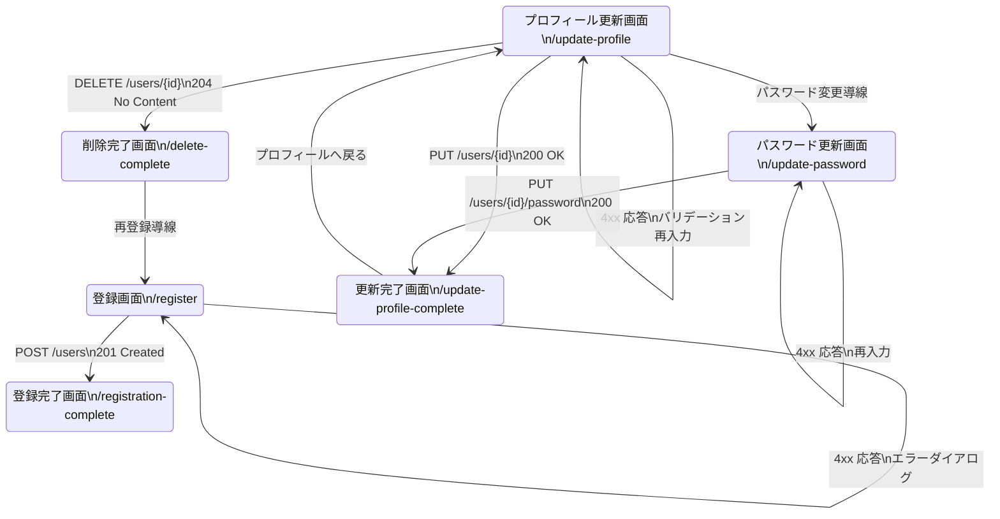

# フロントエンドから 02 User Management Service への接続改修計画

## 目的
Next.js フロントエンドのユーザー登録画面（`/register`）から、02-user-management-service（Quarkus, port 8081）に実際のユーザー登録リクエストを送れるようにする。UI 側では現在コンソール出力のみに留まっており、バックエンド API と連携していない。ここでは、実装前に必要な修正点・考慮事項を整理する。

## 1. バックエンド仕様の整理
- ベース URL: `http://localhost:8081/user-management-service/api`
- 登録エンドポイント: `POST /users`
- リクエスト例（User エンティティの主要フィールド）:
  ```json
  {
    "username": "taro",
    "email": "taro@example.com",
    "passwordHash": "plain-text-password",
    "firstName": "太郎",
    "lastName": "山田",
    "role": "CUSTOMER"
  }
  ```
  - `username` は必須かつ英数字・ハイフン・アンダースコアのみ。
  - `passwordHash` に平文パスワードを送信すると、サービス側で Bcrypt ハッシュ化される。
  - `role` を送らなくてもデフォルト値 `CUSTOMER` が入るが、明示的に送ると安全。
- 成功時: HTTP 201, ボディは JSON の `User` オブジェクト（`ApiResponse` ラッパーなし）。`passwordHash` は null に上書きされて返る。
- 失敗時: HTTP 400/409 等、`{"code": "USER_CREATION_FAILED", "message": "..."}` 形式のレスポンス。

## 2. 環境変数と設定の更新
1. `.env.example` / `.env.local` にユーザー管理サービス専用のベース URL を追加する。
   ```bash
   NEXT_PUBLIC_USER_MANAGEMENT_URL=http://localhost:8081/user-management-service/api
   ```
2. `src/utils/constants.ts` に新しい定数 `USER_MANAGEMENT_BASE_URL` を追加し、`process.env.NEXT_PUBLIC_USER_MANAGEMENT_URL` を参照する。未設定時はゲートウェイ（`NEXT_PUBLIC_API_BASE_URL`）をフォールバックにする。
3. 将来 API Gateway 経由でまとめたい場合に備えて、`NEXT_PUBLIC_USE_API_GATEWAY` フラグを参照してベース URL を切り替えられるようにする（true の場合は Gateway の `/user-management-service/api` へルーティングするなど）。

## 3. HTTP クライアント層の対応
- 現在の `HttpClient.post<T>()` は `ApiResponse<T>` を前提に `response.data.data` を返すため、そのままでは Quarkus サービスの素の JSON を扱えない。
- 対応案:
  1. `HttpClient` に `postRaw<T>(url, data, config)` のようなメソッドを追加し、`response.data` をそのまま返す。
  2. もしくは `HttpClient` にオプション `unwrap: boolean` を持たせ、`false` の時はラッパーを外さない。
  3. もしくはユーザー管理サービス専用の `userManagementClient`（axios インスタンス）を新規作成する。
- いずれの案でも、`baseURL` を呼び出しごとに上書きできるよう `config.baseURL` を許容し、`USER_MANAGEMENT_BASE_URL` を指定する仕組みを用意する。

## 4. API サービス層の設計
1. `src/services/api/userManagement.ts`（新規）を作成し、以下の型と関数を提供する:
   ```ts
   export interface CreateUserPayload {
     username: string;
     email: string;
     password: string; // UI 層で保持する平文パスワード
     firstName: string;
     lastName: string;
     role?: 'CUSTOMER' | 'INSTRUCTOR' | 'STAFF' | 'ADMIN';
     phoneNumber?: string;
   }

   interface CreateUserRequestBody {
     username: string;
     email: string;
     passwordHash: string; // バックエンド仕様に合わせて変換後のフィールド名を使用
     firstName: string;
     lastName: string;
     role?: 'CUSTOMER' | 'INSTRUCTOR' | 'STAFF' | 'ADMIN';
     phoneNumber?: string;
   }

   export interface CreatedUser {
     id: number;
     username: string;
     email: string;
     firstName: string;
     lastName: string;
     role: string;
     active: boolean;
     emailVerified: boolean;
     createdAt: string;
     updatedAt: string;
   }
   ```
  - 登録処理は `const body: CreateUserRequestBody = { ...payload, passwordHash: payload.password };` のように変換してから `httpClient.postRaw<CreatedUser>('/users', body, { baseURL: USER_MANAGEMENT_BASE_URL })` を呼び出す（`delete body.password` で平文パスワードを除去してから送信する）。
2. 現状の `authAPI.register` は `/auth/register`（ダミー想定）を呼ぶ前提になっているため、本実装とは別物として扱い、以下のいずれかを選択:
   - `authAPI.register` をユーザー管理 API を呼ぶように一新し、戻り値を `CreatedUser` に変更する（トークンを返さない前提）。
   - あるいは `authAPI` は将来の認証サービス用に残し、`userManagementAPI.createUser` を新設し UI から直接呼ぶ。
   - 後者の方が責務が分かれるため推奨。

## 5. 型定義とストアの調整
- `src/types/auth.ts` の `RegisterRequest` は `username` を既に含むが、UI 側フォームに入力欄が存在しないため、フォームを拡張する。
- `/register` ページの `formData` ステート初期値と `handleChange` 呼び出しに `username` を追加し、UI と型の齟齬を解消する。
- `CreatedUser` の `id` は `number`（バックエンドは `Long`）で返る。既存の `User` 型は `id: string` なので、新しい型を分離するか、`User` の `id` を `string | number` に広げる。
- `authStore.register` は `AuthResponse`（トークン付き）を期待している。今回のフローでは登録完了後にログイン画面へ遷移するだけで良い場合、`useAuthStore` の `register` は呼ばず、画面コンポーネント内で API 呼び出し→成功時に `/login` へ遷移する実装にする。その際、`authStore` から未使用の `register` ロジックを削除または TODO コメントを付けておく。

## 6. `/register` ページの改修ポイント
1. フォーム項目の追加/整理:
  - `username` 入力欄を追加（バリデーション: 3〜50 文字、英数字/`-_`）。
   - `password` 入力欄は既存を流用（バックエンド仕様に合わせ 8 文字以上などは現状通り）。
2. 送信処理:
   - `handleSubmit` 内で `userManagementAPI.createUser` を呼び出し、`await` する。
   - 成功時: 成功メッセージを表示し、1〜2 秒後に `/login` に `router.push()`。
   - 失敗時: レスポンスの `code` / `message` をパースしてエラーメッセージに反映。
   - 送信中はボタンを無効化し、ローディング表示を維持。
3. `acceptTerms` のチェックが外れていたら送信しない（現状通り）。
4. コンソールログ／`setTimeout` による疑似処理は削除する。

## 7. UI/UX 上の追加考慮
- ユーザーフィードバック: 成功時に `SUCCESS_MESSAGES.REGISTER_SUCCESS` を利用したトーストやアラートを出す。
- バリデーション: クライアント側で `username`、`password`、`email` の正規表現チェックを実装し、バックエンドの制約と整合させる。
  - 特に `validators.ts` にある `USERNAME` パターンを 3〜50 文字の英数字/`-_` に合わせて更新し、フォームと同じ制約を持たせる。
- i18n: 既存 UI が日本語なので、生成するエラーメッセージも日本語化する。バックエンドの英語メッセージは、フロント側で翻訳テーブルを通すか、そのまま表示した上で補足説明を付ける。

## 8. 動作確認手順
1. バックエンド（02-user-management-service）を dev モードまたは Docker Compose で起動し、H2 もしくは PostgreSQL を準備する。
2. フロントエンドで `.env.local` に `NEXT_PUBLIC_USER_MANAGEMENT_URL` を設定し、`npm run dev` を実行。
3. ブラウザで `http://localhost:3000/register` にアクセスし、フォームを送信。
4. Network タブで `POST http://localhost:8081/user-management-service/api/users` が 201 を返すことを確認。
5. DB（H2 コンソールや PostgreSQL）でユーザーが作成されていることを確認。
6. バリデーションエラー（例: 既存メールアドレス）時に適切なエラーメッセージが表示されるか確認。

## 9. 将来の拡張トピック（任意）
- 認証サービス（04-authentication-service）との統合: 登録後にメール確認や JWT 発行が必要になった場合は、ユーザー管理 → 認証 の二段階 API コールにする。
- API Gateway 経由の URL 統一: 本番環境では Gateway への Route を設定し、フロント側は Gateway のみを意識する構成にする。
- テスト: `userManagementAPI.createUser` に対するユニットテスト、`/register` ページの Playwright/E2E テストを追加する。

以上の内容に従って実装すれば、フロントエンドの登録画面からユーザー管理サービスへの接続を安全に進められる。

## 10. 画面遷移図（Mermaid）
ユーザー管理系の画面遷移と 02-user-management-service の主要エンドポイント対応は以下の通り。



各画面での API 呼び出し結果に応じて、完了画面・エラー表示・再入力フローを制御する。
