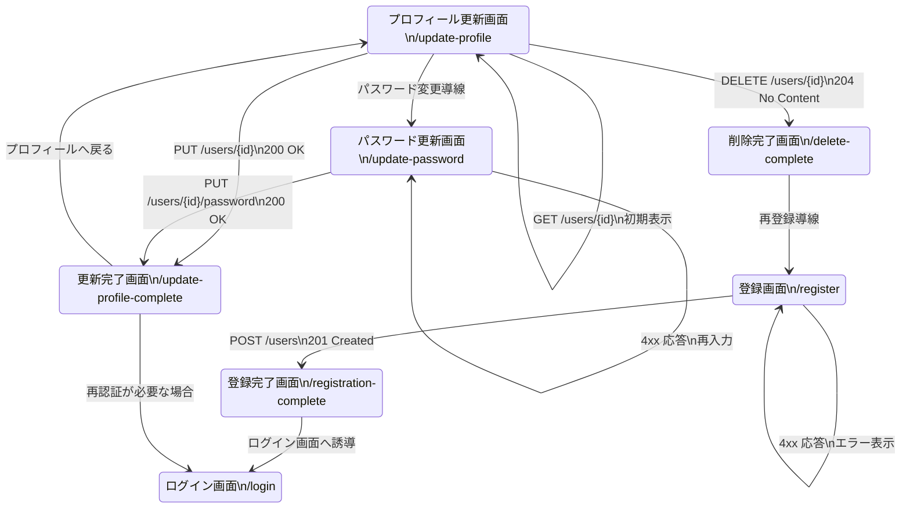

# フロントエンドから 02 User Management Service への総合改修計画

## 目的
Next.js フロントエンドのユーザー管理フロー全体（登録・プロフィール更新・パスワード更新・削除）を、02-user-management-service（Quarkus, port 8081）と正しく連携させる。既存の `/register` のみ考慮した計画を、全 URL/画面に対応できる詳細設計へ刷新する。

## 0. 画面と URL 一覧
- `/register`: ユーザー登録フォーム。必要項目入力→APIで新規作成。
- `/registration-complete`: 登録成功の完了画面。ガイドとログイン導線を表示。
- `/update-profile`: プロフィール情報編集フォーム。既存情報の取得・更新。
- `/update-password`: パスワード変更フォーム。現行・新パスワード入力。
- `/update-profile-complete`: プロフィール更新完了画面。トップやマイページへ遷移させる。
- `/delete-complete`: アカウント削除完了画面。再登録やトップページへの導線。

## 1. バックエンド API 仕様の整理
- ベース URL: `http://localhost:8081/user-management-service/api`
- エンドポイント整理:
  - `POST /users`: 新規ユーザー作成。201 → 作成ユーザー JSON（`passwordHash` は null）。
  - `GET /users/{id}`: 単一ユーザー取得。200 → プロフィール表示用。
  - `PUT /users/{id}`: ユーザー情報更新。200 → 更新後ユーザー JSON。
  - `PUT /users/{id}/password`: パスワード更新。200 → 成功レスポンス（本文は空 or メッセージ）。
  - `DELETE /users/{id}`: ユーザー削除。204 → 本文なし。
- `POST /users`（新規登録）以外の操作は Bearer トークンによる認証を前提とする。必要に応じて `Authorization: Bearer <token>` を付与する。
- エラーレスポンスは `{"code": "...", "message": "..."}` 形式。バリデーション・整合性エラー時の HTTP ステータスは 400/404/409 を想定。

## 2. 環境変数・設定
1. `.env.example` / `.env.local` へ以下を追加・周知。
   ```bash
   NEXT_PUBLIC_USER_MANAGEMENT_URL=http://localhost:8081/user-management-service/api
   ```
2. `src/utils/constants.ts` に `USER_MANAGEMENT_BASE_URL` を定義。`NEXT_PUBLIC_USER_MANAGEMENT_URL` が無い場合のフォールバックとして `NEXT_PUBLIC_API_BASE_URL + '/user-management-service/api'` を利用できるようにする。
3. `NEXT_PUBLIC_USE_API_GATEWAY` が true のときは Gateway URL に切り替えるロジックを `constants` か `http` レイヤに集約する。

## 3. HTTP クライアント層の拡張
- `HttpClient` に下記を追加し、JSON ラッパー有無とメソッド種別に柔軟に対応する。
  1. `requestRaw<T>(config)` もしくは `getRaw/postRaw/putRaw/deleteRaw` など、`response.data` をそのまま返すメソッド。
  2. `config.baseURL` を公開して `USER_MANAGEMENT_BASE_URL` を渡せるようにする。
  3. `HttpClient` 既存の `get/post/put/delete` でも `unwrap: boolean` オプションで挙動を切り替えられると UI 層の記述が統一される。
- DELETE の場合レスポンスボディが無いので、呼び出し元で 204 を許容する実装にしておく。
- 認証が必要なリクエストでは `useAuthStore` から取得した JWT を `Authorization` ヘッダーに付与する仕組み（axios インターセプターや `withAuth` ヘルパー）を導入する。

## 4. API サービス層の詳細設計
`src/services/api/userManagement.ts` を新設し、下記構成にする。

```ts
export interface BaseUserPayload {
  firstName: string;
  lastName: string;
  email: string;
  role?: 'CUSTOMER' | 'INSTRUCTOR' | 'STAFF' | 'ADMIN';
  phoneNumber?: string;
}

export interface CreateUserPayload extends BaseUserPayload {
  username: string;
  password: string;
}

export interface UpdateUserPayload extends BaseUserPayload {
  id: number;
}

export interface UpdatePasswordPayload {
  id: number;
  currentPassword: string;
  newPassword: string;
}

export interface UserDto {
  id: number;
  username: string;
  email: string;
  firstName: string;
  lastName: string;
  role: string;
  phoneNumber?: string;
  active: boolean;
  emailVerified: boolean;
  createdAt: string;
  updatedAt: string;
}

export async function createUser(payload: CreateUserPayload): Promise<UserDto> { ... }
export async function fetchUser(id: number): Promise<UserDto> { ... }
export async function updateUser(payload: UpdateUserPayload): Promise<UserDto> { ... }
export async function updatePassword(payload: UpdatePasswordPayload): Promise<void> { ... }
export async function deleteUser(id: number): Promise<void> { ... }
```

- `createUser` 内で `passwordHash` へ詰め替えて送信。
- `updateUser` は `payload` から `id` を抜き出し、残りをボディにする。
- `updatePassword` はバックエンド仕様確認の上、`{ currentPassword, newPassword }` の形で送信する（必要に応じて `ConfirmPassword` フィールドも追加）。
- `fetchUser` は `/update-profile` 表示時や完了画面遷移前後の再読込で利用する。
- `fetchUser` を含む登録以外の各関数で `Authorization` ヘッダーを必ず付与する。

## 5. 型定義・ストア・ルーティングの調整
- `src/types/auth.ts` と `src/types/user.ts`（新設可）で `UserDto` を共有し、UI 側で型安全に扱う。
- `useAuthStore`:
  - ログインユーザー ID を保持している場合は `profileId` として使う。
  - 未保持の場合は `/update-profile` へアクセスする前に `auth` から取得する仕組みを検討。
- `next/router` or `next/navigation` を使い、各ページから完了ページへの遷移・戻る導線を統一。
- `middleware`（認証チェック）がある場合、`/update-*` 系はログイン必須ページとして保護する。
- リロード時にトークン・ユーザー ID を復元するため、`useAuthStore` に永続化（localStorage など）と初期同期処理を加える。

## 6. 各ページ詳細設計

### `/register`
- 入力項目: `firstName`, `lastName`, `username`, `email`, `password`, `passwordConfirm`, 利用規約同意。
- フォーム state とバリデーションロジックを `react-hook-form` などで統合すると再利用しやすい。
- 送信成功後、`router.push('/registration-complete')`。完了画面ではログイン案内。
- エラー種別ごとのメッセージ表示（409: 既存ユーザー、400: 入力不備）。
- 成功時はフォームを `reset()` し、パスワード値をブラウザに残さない。

### `/registration-complete`
- 静的ページ。登録完了メッセージ、ログインページへのボタン、トップページへのリンク。
- `router.back()` や再登録導線は任意。

### `/update-profile`
- 描画時に `useEffect` で `fetchUser(authStore.userId)` を呼び、初期値をフォームにセット。
- 入力項目: `firstName`, `lastName`, `email`, `phoneNumber`, `role`（必要なら read-only）。
- 更新ボタンで `updateUser` を呼び、成功したら `/update-profile-complete` へ遷移。
- 画面内に以下の導線を設ける。
  - パスワード変更ボタン → `/update-password`
  - アカウント削除ボタン → モーダル確認 → `deleteUser` 実行 → `/delete-complete`
- エラー発生時はフォーム上にメッセージ表示し、必要に応じて該当項目をハイライト。
- `fetchUser` や `updateUser` が 401/403 を返した場合はセッション切れとみなし、トークン破棄→`/login` へリダイレクトする。

### `/update-password`
- 入力項目: `currentPassword`, `newPassword`, `confirmPassword`。
- `updatePassword` API 呼び出し後、成功時は `/update-profile-complete` に遷移し、完了文言をパスワード更新用に切り替える（クエリパラメータ or state で区別）。
- 失敗時は `code` に応じて「現在のパスワードが一致しません」などの日本語メッセージを表示。
- クライアント側で `newPassword` の強度チェックと `confirmPassword` の一致チェックを実施。
- セキュリティのため、送信後はフォーム state を即座に `reset()` して値を破棄する。

### `/update-profile-complete`
- 表示内容を状況に応じて切り替える仕組みを用意。
  - プロフィール更新経由: 「プロフィールを更新しました」。
  - パスワード更新経由: 「パスワードを更新しました」。
- 戻るボタンで `/update-profile` へ、ログアウト導線も検討。
- 完了画面表示後に `/update-profile` へ戻る際は再度 `fetchUser` を呼び、更新内容を反映する。

### `/delete-complete`
- 削除成功後に到達。ログイン状態を強制的に破棄し、`authStore.reset()` を呼ぶ。
- 再登録ボタン（`/register` へ）、トップページリンクを表示。
- 削除 API のレスポンスが非同期完了後であることを保証するため、`deleteUser` 成功時に即時遷移させる。
- 削除確認モーダルで二重送信を防ぐため、ロード中はボタンを無効化し進行状況インジケータを表示する。

## 7. 入力検証・エラー処理
- `src/utils/validators.ts` を更新し、以下の正規表現・ルールを整備。
  - `USERNAME`: 3〜50 文字、英数字・ハイフン・アンダースコア。
  - `PASSWORD`: 8 文字以上、大小英字・数字必須。
  - `EMAIL`: 既存ルール流用。
- API エラーコードと UI 表示の対応表を `src/utils/constants.ts` などで管理して翻訳。
- 共通エラー表示コンポーネント（トースト/アラート）を `components/ui` に用意し、全ページで再利用。
- ネットワークタイムアウトやバックエンド停止時はリトライを案内し、Axios の `isAxiosError` で通信エラーと業務エラーを分岐する。

## 8. ナビゲーションと状態遷移
- Next.js App Router (`useRouter` from `next/navigation`) で統一。
- 成功時遷移:
  - `/register` → `/registration-complete`
  - `/update-profile` → `/update-profile-complete`
  - `/update-password` → `/update-profile-complete`
  - `/update-profile` (削除ボタン) → `/delete-complete`
- 完了画面で `setTimeout` による自動遷移を行う場合は、アクセシビリティと UX を考慮し任意化。
- フォーム送信後は `reset()` を呼び出し、ブラウザバック時の再送ダイアログを避ける。

## 9. 動作確認手順
1. 02-user-management-service を dev モードまたは Docker Compose で起動し、DB を準備。
2. フロントエンドで `.env.local` を設定し `npm run dev` を実行。
3. `/register` で新規登録 → DB のユーザー追加を確認。
4. `/registration-complete` に遷移し、ログイン画面へ移動できることを確認。
5. 登録したユーザーでログインし、`/update-profile` へアクセス。
6. プロフィール更新→`/update-profile-complete`、戻って再読み込みすると更新内容が反映されていることを確認。
7. `/update-password` でパスワード変更→再ログインできることを確認。
8. `/update-profile` の削除ボタンで削除→`/delete-complete` 表示、DB からユーザーが消えていることを確認。
9. 各エラーケース（409 重複、401 パスワード不一致など）でメッセージが期待通り表示されるか検証。

## 10. 将来の拡張トピック
- 04-authentication-service との連携強化（メール検証、JWT 連携、SSO）。
- API Gateway 統合とサービスメッシュ導入時の URL 抽象化。
- E2E テスト（Playwright）で登録→更新→削除フローを自動化。
- サーバーサイドでの CSRF 対策・二段階認証導入に備えた UI 設計。

## 11. 画面遷移図（Mermaid）
全フローの遷移と主要 API 呼び出しを下記に示す。



各画面で API レスポンスの成否に応じて分岐し、ユーザー体験を損なわないよう共通 UX パターンを適用する。
